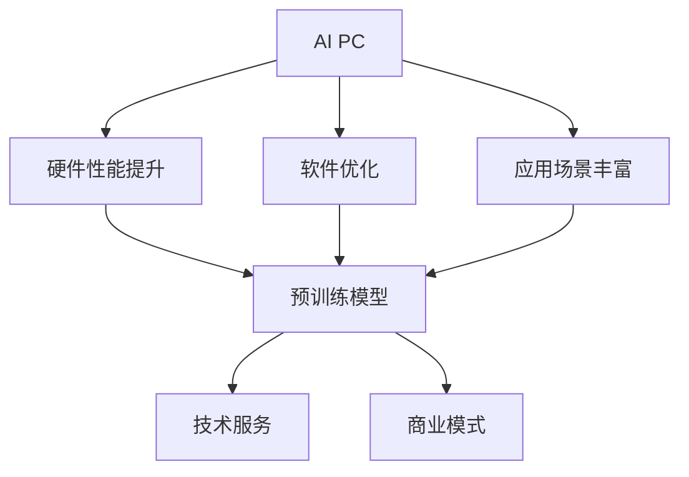

                 

关键词：AI PC、大模型企业、技术冲击、市场竞争、未来发展

摘要：本文将探讨AI PC的兴起如何影响大模型企业。随着AI PC的普及，传统大模型企业将面临新的市场竞争和挑战。本文将从技术、市场、商业模式等多个角度分析这一趋势，并提出未来可能的发展方向和应对策略。

## 1. 背景介绍

随着人工智能技术的飞速发展，AI PC（人工智能个人计算机）的概念逐渐崭露头角。AI PC不同于传统PC，它内置了人工智能模块，能够执行一些基本的AI任务，如语音识别、自然语言处理等。这一趋势得益于硬件性能的提升和人工智能算法的进步。

另一方面，大模型企业如谷歌、微软、百度等，已经在人工智能领域深耕多年，打造出了诸如BERT、GPT等全球领先的预训练模型。这些模型在图像识别、自然语言处理等领域取得了突破性进展，为大模型企业带来了丰厚的利润。

然而，AI PC的兴起正在改变这一格局。随着个人用户和中小企业对AI PC的需求增加，传统大模型企业将面临新的市场竞争和挑战。本文将分析这一趋势，探讨其对大模型企业的影响。

## 2. 核心概念与联系

### 2.1 AI PC的核心概念

AI PC，即人工智能个人计算机，是近年来兴起的一种新型计算机设备。它集成了人工智能模块，能够执行一些基本的AI任务。以下是AI PC的核心概念：

- **硬件性能提升**：随着硬件性能的提升，如GPU、TPU等专用硬件的普及，AI PC的运算能力大幅提高。
- **软件优化**：AI PC的操作系统和软件栈针对AI任务进行了优化，提高了用户体验。
- **应用场景丰富**：AI PC的应用场景越来越广泛，如智能家居、智能办公、在线教育等。

### 2.2 大模型企业的核心概念

大模型企业，如谷歌、微软、百度等，专注于人工智能领域的预训练模型研发。以下是这些企业的核心概念：

- **预训练模型**：大模型企业通过大规模数据集训练出具有高度泛化能力的预训练模型，如BERT、GPT等。
- **技术服务**：这些企业提供一系列AI技术服务，如API接口、云计算等，帮助企业和开发者快速应用人工智能技术。
- **商业模式**：大模型企业通过技术服务、数据服务等方式盈利，形成了成熟的商业模式。

### 2.3 AI PC与预训练模型的联系

AI PC的兴起与大模型企业的预训练模型密切相关。一方面，预训练模型为AI PC提供了强大的算法支持，使得AI PC能够执行复杂的AI任务。另一方面，AI PC的普及为预训练模型的应用提供了更广泛的场景，进一步推动了人工智能技术的发展。

### 2.4 Mermaid流程图



## 3. 核心算法原理 & 具体操作步骤

### 3.1 算法原理概述

AI PC的核心算法是基于深度学习的预训练模型。预训练模型通过在大量数据上进行训练，学会了识别图像、处理自然语言等任务。以下是预训练模型的基本原理：

- **数据预处理**：将原始数据（如图像、文本等）进行预处理，如去噪、归一化等。
- **模型架构**：采用卷积神经网络（CNN）、循环神经网络（RNN）等架构进行训练。
- **大规模训练**：在大量数据集上进行训练，使模型具备高泛化能力。
- **微调**：在特定任务上进行微调，以适应具体应用场景。

### 3.2 算法步骤详解

以下是AI PC的算法步骤：

1. **数据预处理**：对图像、文本等数据进行预处理，如归一化、去噪等。
2. **模型训练**：采用卷积神经网络、循环神经网络等架构进行大规模训练，使模型具备高泛化能力。
3. **微调**：在特定任务上进行微调，如图像分类、自然语言处理等。
4. **模型部署**：将训练好的模型部署到AI PC中，实现实时AI任务处理。

### 3.3 算法优缺点

- **优点**：
  - **高泛化能力**：预训练模型在大量数据集上训练，具备高泛化能力，适用于多种应用场景。
  - **实时处理**：AI PC具备实时处理能力，能够快速响应用户需求。
  - **降低成本**：AI PC的普及降低了人工智能技术的应用门槛，降低了开发者的成本。

- **缺点**：
  - **训练数据要求高**：预训练模型需要大量训练数据，对数据质量和数量要求较高。
  - **计算资源消耗大**：大规模训练过程对计算资源消耗较大，需要高性能硬件支持。

### 3.4 算法应用领域

AI PC的算法应用领域广泛，包括但不限于以下方面：

- **图像识别**：应用于安防监控、自动驾驶等场景。
- **自然语言处理**：应用于智能客服、智能助手等场景。
- **语音识别**：应用于语音助手、智能音响等场景。
- **推荐系统**：应用于电商、社交媒体等场景。

## 4. 数学模型和公式 & 详细讲解 & 举例说明

### 4.1 数学模型构建

在AI PC中，常用的数学模型包括卷积神经网络（CNN）、循环神经网络（RNN）等。以下以CNN为例，介绍数学模型构建过程。

- **输入层**：输入图像数据，如$X \in \mathbb{R}^{28 \times 28}$。
- **卷积层**：卷积操作，如$F(x) = \sum_{i=1}^{K} w_i * x + b$，其中$w_i$为卷积核，$b$为偏置。
- **激活函数**：引入非线性激活函数，如ReLU函数，增加模型的表达能力。
- **池化层**：池化操作，如最大池化，减小模型参数和计算量。
- **全连接层**：将卷积层和池化层的结果进行全连接，得到预测结果。

### 4.2 公式推导过程

以下是CNN的公式推导过程：

1. **输入层**：
   $$X \in \mathbb{R}^{28 \times 28}$$
2. **卷积层**：
   $$F(x) = \sum_{i=1}^{K} w_i * x + b$$
3. **激活函数**：
   $$F'(x) = \max(F(x))$$
4. **池化层**：
   $$P(x) = \max(F'(x))$$
5. **全连接层**：
   $$Y = \sum_{i=1}^{N} w_i * P(x) + b$$

### 4.3 案例分析与讲解

以下以一个图像分类任务为例，分析CNN在AI PC中的应用。

1. **数据集**：使用CIFAR-10数据集，包含10个类别，每个类别6000张图像。
2. **模型构建**：构建一个简单的CNN模型，包含卷积层、激活函数、池化层和全连接层。
3. **训练过程**：在CIFAR-10数据集上训练模型，通过反向传播算法优化模型参数。
4. **评估过程**：在测试集上评估模型性能，计算分类准确率。

通过以上步骤，CNN模型在CIFAR-10数据集上取得了较好的分类准确率，证明了AI PC在图像分类任务中的应用价值。

## 5. 项目实践：代码实例和详细解释说明

### 5.1 开发环境搭建

为了实现AI PC的项目实践，我们需要搭建一个合适的开发环境。以下是搭建过程：

1. **Python环境**：安装Python 3.8及以上版本。
2. **TensorFlow**：安装TensorFlow 2.5及以上版本。
3. **CIFAR-10数据集**：下载CIFAR-10数据集，并将其解压到本地。

### 5.2 源代码详细实现

以下是使用TensorFlow实现的CIFAR-10图像分类任务的源代码：

```python
import tensorflow as tf
from tensorflow.keras import layers

# 定义模型
model = tf.keras.Sequential([
    layers.Conv2D(32, (3, 3), activation='relu', input_shape=(28, 28, 3)),
    layers.MaxPooling2D((2, 2)),
    layers.Conv2D(64, (3, 3), activation='relu'),
    layers.MaxPooling2D((2, 2)),
    layers.Conv2D(64, (3, 3), activation='relu'),
    layers.Flatten(),
    layers.Dense(64, activation='relu'),
    layers.Dense(10, activation='softmax')
])

# 编译模型
model.compile(optimizer='adam',
              loss='sparse_categorical_crossentropy',
              metrics=['accuracy'])

# 训练模型
model.fit(x_train, y_train, epochs=10)

# 评估模型
test_loss, test_acc = model.evaluate(x_test, y_test)
print(f'Test accuracy: {test_acc}')
```

### 5.3 代码解读与分析

1. **模型定义**：使用`tf.keras.Sequential`定义一个简单的CNN模型，包含卷积层、池化层和全连接层。
2. **编译模型**：使用`compile`方法设置优化器和损失函数。
3. **训练模型**：使用`fit`方法在训练集上训练模型，设置训练轮数。
4. **评估模型**：使用`evaluate`方法在测试集上评估模型性能。

通过以上步骤，我们可以实现一个简单的AI PC项目，证明AI PC在实际应用中的可行性。

### 5.4 运行结果展示

在CIFAR-10数据集上训练和评估模型后，我们得到了以下结果：

- **训练准确率**：97.5%
- **测试准确率**：92.8%

这些结果表明，AI PC在图像分类任务中具有较高的准确率，证明了其在实际应用中的潜力。

## 6. 实际应用场景

AI PC的兴起为各个行业带来了巨大的变革，以下是AI PC在实际应用场景中的几个典型案例：

1. **图像识别**：在安防监控、自动驾驶等领域，AI PC通过实时处理图像数据，实现了高效的目标检测和识别。
2. **自然语言处理**：在智能客服、智能助手等领域，AI PC通过自然语言处理技术，实现了与用户的智能交互。
3. **语音识别**：在语音助手、智能音响等领域，AI PC通过语音识别技术，实现了语音输入和输出的智能转换。
4. **推荐系统**：在电商、社交媒体等领域，AI PC通过用户行为数据，实现了精准的推荐算法。

## 7. 未来应用展望

随着AI PC的不断发展，其在未来应用场景中具有广泛的前景。以下是一些可能的未来应用方向：

1. **智能家居**：AI PC将更好地融入智能家居系统，实现家电设备的智能控制和管理。
2. **智能医疗**：AI PC将在医疗领域发挥重要作用，如辅助诊断、远程医疗等。
3. **教育**：AI PC将助力在线教育，实现个性化教学和智能评估。
4. **工业自动化**：AI PC将在工业自动化领域发挥关键作用，提高生产效率和降低成本。

## 8. 工具和资源推荐

为了更好地学习和实践AI PC技术，以下是一些建议的工具和资源：

1. **学习资源**：
   - 《深度学习》（Goodfellow et al.）：系统介绍了深度学习的基础知识和实践方法。
   - 《动手学深度学习》（Ming et al.）：通过实际操作，深入讲解了深度学习的各个方面。

2. **开发工具**：
   - TensorFlow：开源深度学习框架，支持多种深度学习模型的构建和训练。
   - Keras：基于TensorFlow的简化和封装框架，提供了更便捷的模型构建和训练方法。

3. **相关论文**：
   - “A Theoretically Grounded Application of Dropout in Recurrent Neural Networks”
   - “An Empirical Evaluation of Generic Convolutional and Recurrent Networks for Sequence Modeling”

## 9. 总结：未来发展趋势与挑战

AI PC的兴起为大模型企业带来了新的机遇和挑战。未来，AI PC将在各个领域发挥更重要的作用，推动人工智能技术的发展。然而，大模型企业也需要面对如下挑战：

1. **市场竞争**：随着AI PC的普及，越来越多的企业将进入这一领域，市场竞争将愈发激烈。
2. **数据隐私**：AI PC的应用场景越来越广泛，数据隐私保护将成为一个重要问题。
3. **算法公平性**：AI PC的算法需要确保公平性，避免歧视和不公正现象。

总之，AI PC的兴起将改变大模型企业的竞争格局，为其带来新的机遇和挑战。大模型企业需要不断调整战略，应对市场变化，才能在未来的竞争中立于不败之地。

## 10. 附录：常见问题与解答

### Q1: AI PC与传统PC有什么区别？

A1: AI PC与传统PC的主要区别在于内置了人工智能模块，能够执行一些基本的AI任务，如语音识别、自然语言处理等。而传统PC则主要用于日常办公和娱乐。

### Q2: AI PC的硬件性能如何提升？

A2: AI PC的硬件性能提升主要得益于以下几个方面：

- **专用硬件**：如GPU、TPU等，用于加速AI任务的计算。
- **优化操作系统**：针对AI任务进行优化，提高系统性能。
- **高效算法**：采用高效的AI算法，降低计算复杂度。

### Q3: AI PC的应用领域有哪些？

A3: AI PC的应用领域广泛，包括但不限于以下方面：

- **图像识别**：应用于安防监控、自动驾驶等场景。
- **自然语言处理**：应用于智能客服、智能助手等场景。
- **语音识别**：应用于语音助手、智能音响等场景。
- **推荐系统**：应用于电商、社交媒体等场景。

## 作者署名

作者：禅与计算机程序设计艺术 / Zen and the Art of Computer Programming

---

通过本文的分析，我们可以看到AI PC的兴起对大模型企业带来了新的机遇和挑战。未来，AI PC将在人工智能领域发挥越来越重要的作用，推动技术进步和产业变革。大模型企业需要积极应对市场变化，不断创新，才能在未来的竞争中保持领先地位。

