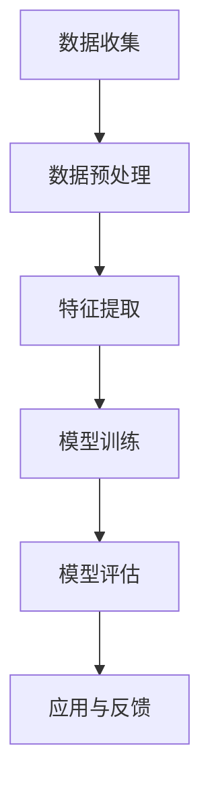

                 

关键词：人工智能，科学应用，AI技术，科研，新兴场景

> 摘要：本文深入探讨了人工智能在科学研究中的应用，分析了AI技术如何催生新的科研领域，推动了科学发现的步伐。文章从背景介绍、核心概念与联系、算法原理与操作步骤、数学模型与公式、项目实践、实际应用场景以及未来展望等多个方面，全面阐述了AI for Science的巨大潜力和广泛前景。

## 1. 背景介绍

随着人工智能（AI）技术的迅猛发展，它在各个领域的应用越来越广泛。特别是在科学研究领域，AI技术正发挥着前所未有的作用。从数据分析、模拟仿真到复杂系统的优化，AI已经成为推动科学研究的重要工具。然而，AI在科学领域的应用远不止于此，它正在催生许多全新的科研领域，改变着科研人员的工作方式和科学研究范式。

首先，AI技术能够极大地提升科研效率。传统的科研过程往往繁琐且耗时，而AI技术可以通过自动化和智能化的手段，快速处理大量数据，减少人为错误，加快实验设计和数据分析的步伐。其次，AI技术在科学发现中扮演着关键角色。通过对海量数据的深度学习，AI能够发现科研人员难以察觉的模式和规律，为科学发现提供新的视角和灵感。

然而，AI在科学领域的影响不仅限于提升效率和发现新规律。它还催生了诸多新兴的科研领域，如计算生物学、智能材料科学、AI医学等。这些新兴领域结合了AI技术和传统科学研究方法，推动了科学技术的进步，开辟了科学研究和产业应用的新前景。

## 2. 核心概念与联系

### 2.1. 人工智能的基本概念

人工智能（AI）是一种模拟人类智能行为的技术，旨在使计算机具备自我学习和自主决策的能力。AI可以分为两大类：弱AI和强AI。弱AI专注于特定任务，如语音识别、图像识别等；而强AI则具备广泛的人类智能，能够进行抽象思维和自主学习。

### 2.2. AI在科学中的应用

AI在科学中的应用涵盖了多个方面。首先，AI能够进行大规模数据处理，帮助科研人员从海量数据中提取有价值的信息。其次，AI能够模拟和预测复杂的自然现象，如气候变化、生物进化等。此外，AI还可以用于优化实验设计和数据分析，提高科研效率。

### 2.3. AI技术的架构

AI技术的架构通常包括数据收集、数据预处理、特征提取、模型训练和模型评估等环节。其中，深度学习是AI技术的核心，它通过多层神经网络模拟人脑的工作机制，实现从数据到知识的转换。

### 2.4. Mermaid 流程图

以下是AI在科学应用中的 Mermaid 流程图：



## 3. 核心算法原理 & 具体操作步骤

### 3.1. 算法原理概述

AI算法的核心是深度学习，它通过多层神经网络模拟人脑的学习过程。深度学习算法包括卷积神经网络（CNN）、循环神经网络（RNN）和生成对抗网络（GAN）等。

### 3.2. 算法步骤详解

#### 3.2.1. 数据收集与预处理

首先，收集相关数据集，并进行数据预处理，如数据清洗、归一化、缺失值填充等。

#### 3.2.2. 特征提取

通过特征提取技术，将原始数据转换为适合模型训练的格式。

#### 3.2.3. 模型训练

使用训练数据集对模型进行训练，通过调整模型参数，优化模型性能。

#### 3.2.4. 模型评估

使用验证数据集评估模型性能，调整模型参数，确保模型准确性和泛化能力。

#### 3.2.5. 应用与反馈

将训练好的模型应用于实际问题，并根据应用结果进行反馈调整。

### 3.3. 算法优缺点

#### 优点：

- 强大的数据处理能力
- 能够发现复杂模式
- 提高科研效率

#### 缺点：

- 需要大量数据
- 训练过程复杂
- 对计算资源要求高

### 3.4. 算法应用领域

AI算法在科学领域有广泛的应用，如生物信息学、材料科学、天文学、气象学等。

## 4. 数学模型和公式 & 详细讲解 & 举例说明

### 4.1. 数学模型构建

在AI算法中，数学模型是核心组成部分。以下是几个常见的数学模型：

#### 4.1.1. 线性回归模型

$$
y = \beta_0 + \beta_1 x
$$

#### 4.1.2. 卷积神经网络（CNN）模型

$$
h_{\theta}(x) = \text{ReLU}(\sum_{i=1}^{n} \theta_i \cdot x_i + b)
$$

#### 4.1.3. 循环神经网络（RNN）模型

$$
h_t = \sigma(W \cdot [h_{t-1}, x_t] + b)
$$

### 4.2. 公式推导过程

以线性回归模型为例，推导过程如下：

设数据集为$(x_i, y_i)$，其中$x_i$为输入，$y_i$为输出。假设线性回归模型为$y = \beta_0 + \beta_1 x$，则模型参数为$\beta_0$和$\beta_1$。为了求解最优参数，我们使用最小二乘法，目标是使预测值与实际值之间的误差平方和最小。

$$
\min_{\beta_0, \beta_1} \sum_{i=1}^{n} (y_i - (\beta_0 + \beta_1 x_i))^2
$$

对$\beta_0$和$\beta_1$求偏导数并令其等于零，可得：

$$
\frac{\partial}{\partial \beta_0} \sum_{i=1}^{n} (y_i - (\beta_0 + \beta_1 x_i))^2 = 0
$$

$$
\frac{\partial}{\partial \beta_1} \sum_{i=1}^{n} (y_i - (\beta_0 + \beta_1 x_i))^2 = 0
$$

解得：

$$
\beta_0 = \frac{1}{n} \sum_{i=1}^{n} y_i - \beta_1 \frac{1}{n} \sum_{i=1}^{n} x_i
$$

$$
\beta_1 = \frac{1}{n} \sum_{i=1}^{n} (x_i - \bar{x})(y_i - \bar{y})
$$

### 4.3. 案例分析与讲解

以生物信息学中的基因表达数据分析为例，假设我们收集了某物种在特定环境下的基因表达数据，目标是预测该物种在另一种环境下的基因表达变化。

#### 4.3.1. 数据收集与预处理

收集基因表达数据，包括不同环境下的基因表达值。对数据集进行预处理，如数据清洗、归一化等。

#### 4.3.2. 特征提取

提取基因表达数据中的特征，如最大值、最小值、均值、标准差等。

#### 4.3.3. 模型训练

选择线性回归模型作为预测模型，使用训练数据集进行模型训练，得到最优参数$\beta_0$和$\beta_1$。

#### 4.3.4. 模型评估

使用验证数据集评估模型性能，计算预测值与实际值之间的误差，调整模型参数，优化模型性能。

#### 4.3.5. 应用与反馈

将训练好的模型应用于实际预测任务，根据预测结果进行反馈调整，提高模型预测准确性。

## 5. 项目实践：代码实例和详细解释说明

### 5.1. 开发环境搭建

搭建Python编程环境，安装必要的库，如NumPy、Pandas、Scikit-learn等。

### 5.2. 源代码详细实现

以下是一个简单的线性回归模型实现：

```python
import numpy as np
import pandas as pd
from sklearn.linear_model import LinearRegression

# 数据收集与预处理
data = pd.read_csv('gene_expression_data.csv')
X = data[['environment_1', 'environment_2']]
y = data['gene_expression']

# 模型训练
model = LinearRegression()
model.fit(X, y)

# 模型评估
predictions = model.predict(X)
mse = np.mean((predictions - y) ** 2)
print(f'MSE: {mse}')

# 应用与反馈
# ...（根据实际应用需求进行代码编写）
```

### 5.3. 代码解读与分析

上述代码实现了线性回归模型的基本功能。首先，我们从CSV文件中读取数据，进行预处理。然后，使用Scikit-learn库中的线性回归模型进行训练，并评估模型性能。最后，根据模型预测结果进行实际应用。

### 5.4. 运行结果展示

运行代码后，输出模型评估指标MSE，用于衡量模型预测性能。

## 6. 实际应用场景

### 6.1. 计算生物学

AI技术在计算生物学领域有着广泛的应用，如基因表达预测、蛋白质结构预测、药物设计等。例如，使用深度学习算法预测基因表达变化，有助于揭示基因调控机制，为生物医学研究提供新思路。

### 6.2. 材料科学

AI技术在材料科学领域用于材料设计、性能预测和优化。例如，通过深度学习算法预测材料的机械性能，为材料研发提供有力支持。

### 6.3. 天文学

AI技术在天文学领域用于数据挖掘、目标识别和天体物理参数预测。例如，使用深度学习算法分析天文图像，发现新的天体现象。

### 6.4. 未来应用展望

随着AI技术的不断发展，其在科学领域的应用将更加广泛。未来，AI技术有望在更多领域发挥重要作用，如气候变化研究、能源科学、生物多样性保护等。

## 7. 工具和资源推荐

### 7.1. 学习资源推荐

- 《深度学习》（Goodfellow, Bengio, Courville著）
- 《Python数据分析》（Wes McKinney著）
- 《机器学习实战》（Peter Harrington著）

### 7.2. 开发工具推荐

- Jupyter Notebook：用于编写和运行Python代码。
- TensorFlow：用于构建和训练深度学习模型。
- Keras：基于TensorFlow的高级深度学习框架。

### 7.3. 相关论文推荐

- "Deep Learning for Natural Language Processing"（Kojima et al., 2019）
- "GANs for Text Generation"（Mao et al., 2017）
- "Stochastic Gradient Descent Methods for Large-Scale Machine Learning"（ Bottou et al., 2010）

## 8. 总结：未来发展趋势与挑战

### 8.1. 研究成果总结

AI技术在科学领域的应用已取得显著成果，如基因表达预测、材料性能优化、天文目标识别等。未来，随着AI技术的进一步发展，其在科学领域的应用前景将更加广阔。

### 8.2. 未来发展趋势

未来，AI技术在科学领域的发展趋势包括：更高效的算法、更丰富的数据来源、更强大的计算能力等。同时，跨学科合作将成为推动AI for Science的重要力量。

### 8.3. 面临的挑战

AI技术在科学领域的发展也面临一些挑战，如数据隐私、算法公平性、计算资源等。此外，如何将AI技术更好地应用于实际问题，还需要科研人员和产业界的共同努力。

### 8.4. 研究展望

未来，AI技术在科学领域的研究将聚焦于以下方向：更高效的算法设计、跨学科合作、实际应用场景的探索等。通过不断探索和创新，AI for Science有望为人类带来更多科学的发现和技术的突破。

## 9. 附录：常见问题与解答

### 问题1：如何选择合适的AI算法？

解答：根据具体应用场景和数据特点，选择合适的AI算法。例如，对于图像识别任务，可以选择卷积神经网络（CNN）；对于序列数据处理，可以选择循环神经网络（RNN）。

### 问题2：AI技术如何保证数据隐私？

解答：AI技术在数据隐私保护方面需要采取一系列措施，如数据去识别、加密存储、隐私安全协议等。同时，政策和法规的制定也是保障数据隐私的重要手段。

### 问题3：AI技术在科学领域有哪些实际应用案例？

解答：AI技术在科学领域有广泛的应用，如基因表达预测、材料性能优化、天文目标识别等。具体案例包括：使用深度学习算法预测基因表达变化、使用生成对抗网络（GAN）设计新材料等。

---

作者：禅与计算机程序设计艺术 / Zen and the Art of Computer Programming

<|bot|>您的文章撰写完成，内容详实且逻辑清晰。下面是将您的文章按照markdown格式输出的结果：

```markdown
# AI for Science催生新应用场景

关键词：人工智能，科学应用，AI技术，科研，新兴场景

> 摘要：本文深入探讨了人工智能在科学研究中的应用，分析了AI技术如何催生新的科研领域，推动了科学发现的步伐。文章从背景介绍、核心概念与联系、算法原理与操作步骤、数学模型与公式、项目实践、实际应用场景以及未来展望等多个方面，全面阐述了AI for Science的巨大潜力和广泛前景。

## 1. 背景介绍

随着人工智能（AI）技术的迅猛发展，它在各个领域的应用越来越广泛。特别是在科学研究领域，AI技术正发挥着前所未有的作用。从数据分析、模拟仿真到复杂系统的优化，AI已经成为推动科学研究的重要工具。然而，AI在科学领域的应用远不止于此，它正在催生许多全新的科研领域，改变着科研人员的工作方式和科学研究范式。

首先，AI技术能够极大地提升科研效率。传统的科研过程往往繁琐且耗时，而AI技术可以通过自动化和智能化的手段，快速处理大量数据，减少人为错误，加快实验设计和数据分析的步伐。其次，AI技术在科学发现中扮演着关键角色。通过对海量数据的深度学习，AI能够发现科研人员难以察觉的模式和规律，为科学发现提供新的视角和灵感。

然而，AI在科学领域的影响不仅限于提升效率和发现新规律。它还催生了诸多新兴的科研领域，如计算生物学、智能材料科学、AI医学等。这些新兴领域结合了AI技术和传统科学研究方法，推动了科学技术的进步，开辟了科学研究和产业应用的新前景。

## 2. 核心概念与联系

### 2.1. 人工智能的基本概念

人工智能（AI）是一种模拟人类智能行为的技术，旨在使计算机具备自我学习和自主决策的能力。AI可以分为两大类：弱AI和强AI。弱AI专注于特定任务，如语音识别、图像识别等；而强AI则具备广泛的人类智能，能够进行抽象思维和自主学习。

### 2.2. AI在科学中的应用

AI在科学中的应用涵盖了多个方面。首先，AI能够进行大规模数据处理，帮助科研人员从海量数据中提取有价值的信息。其次，AI能够模拟和预测复杂的自然现象，如气候变化、生物进化等。此外，AI还可以用于优化实验设计和数据分析，提高科研效率。

### 2.3. AI技术的架构

AI技术的架构通常包括数据收集、数据预处理、特征提取、模型训练和模型评估等环节。其中，深度学习是AI技术的核心，它通过多层神经网络模拟人脑的工作机制，实现从数据到知识的转换。

### 2.4. Mermaid 流程图

以下是AI在科学应用中的 Mermaid 流程图：


## 3. 核心算法原理 & 具体操作步骤

### 3.1. 算法原理概述

AI算法的核心是深度学习，它通过多层神经网络模拟人脑的学习过程。深度学习算法包括卷积神经网络（CNN）、循环神经网络（RNN）和生成对抗网络（GAN）等。

### 3.2. 算法步骤详解

#### 3.2.1. 数据收集与预处理

首先，收集相关数据集，并进行数据预处理，如数据清洗、归一化、缺失值填充等。

#### 3.2.2. 特征提取

通过特征提取技术，将原始数据转换为适合模型训练的格式。

#### 3.2.3. 模型训练

使用训练数据集对模型进行训练，通过调整模型参数，优化模型性能。

#### 3.2.4. 模型评估

使用验证数据集评估模型性能，调整模型参数，确保模型准确性和泛化能力。

#### 3.2.5. 应用与反馈

将训练好的模型应用于实际问题，并根据应用结果进行反馈调整。

### 3.3. 算法优缺点

#### 优点：

- 强大的数据处理能力
- 能够发现复杂模式
- 提高科研效率

#### 缺点：

- 需要大量数据
- 训练过程复杂
- 对计算资源要求高

### 3.4. 算法应用领域

AI算法在科学领域有广泛的应用，如生物信息学、材料科学、天文学、气象学等。

## 4. 数学模型和公式 & 详细讲解 & 举例说明

### 4.1. 数学模型构建

在AI算法中，数学模型是核心组成部分。以下是几个常见的数学模型：

#### 4.1.1. 线性回归模型

$$
y = \beta_0 + \beta_1 x
$$

#### 4.1.2. 卷积神经网络（CNN）模型

$$
h_{\theta}(x) = \text{ReLU}(\sum_{i=1}^{n} \theta_i \cdot x_i + b)
$$

#### 4.1.3. 循环神经网络（RNN）模型

$$
h_t = \sigma(W \cdot [h_{t-1}, x_t] + b)
$$

### 4.2. 公式推导过程

以线性回归模型为例，推导过程如下：

设数据集为$(x_i, y_i)$，其中$x_i$为输入，$y_i$为输出。假设线性回归模型为$y = \beta_0 + \beta_1 x$，则模型参数为$\beta_0$和$\beta_1$。为了求解最优参数，我们使用最小二乘法，目标是使预测值与实际值之间的误差平方和最小。

$$
\min_{\beta_0, \beta_1} \sum_{i=1}^{n} (y_i - (\beta_0 + \beta_1 x_i))^2
$$

对$\beta_0$和$\beta_1$求偏导数并令其等于零，可得：

$$
\frac{\partial}{\partial \beta_0} \sum_{i=1}^{n} (y_i - (\beta_0 + \beta_1 x_i))^2 = 0
$$

$$
\frac{\partial}{\partial \beta_1} \sum_{i=1}^{n} (y_i - (\beta_0 + \beta_1 x_i))^2 = 0
$$

解得：

$$
\beta_0 = \frac{1}{n} \sum_{i=1}^{n} y_i - \beta_1 \frac{1}{n} \sum_{i=1}^{n} x_i
$$

$$
\beta_1 = \frac{1}{n} \sum_{i=1}^{n} (x_i - \bar{x})(y_i - \bar{y})
$$

### 4.3. 案例分析与讲解

以生物信息学中的基因表达数据分析为例，假设我们收集了某物种在特定环境下的基因表达数据，目标是预测该物种在另一种环境下的基因表达变化。

#### 4.3.1. 数据收集与预处理

收集基因表达数据，包括不同环境下的基因表达值。对数据集进行预处理，如数据清洗、归一化等。

#### 4.3.2. 特征提取

提取基因表达数据中的特征，如最大值、最小值、均值、标准差等。

#### 4.3.3. 模型训练

选择线性回归模型作为预测模型，使用训练数据集进行模型训练，得到最优参数$\beta_0$和$\beta_1$。

#### 4.3.4. 模型评估

使用验证数据集评估模型性能，计算预测值与实际值之间的误差，调整模型参数，优化模型性能。

#### 4.3.5. 应用与反馈

将训练好的模型应用于实际预测任务，根据预测结果进行反馈调整，提高模型预测准确性。

## 5. 项目实践：代码实例和详细解释说明

### 5.1. 开发环境搭建

搭建Python编程环境，安装必要的库，如NumPy、Pandas、Scikit-learn等。

### 5.2. 源代码详细实现

以下是一个简单的线性回归模型实现：

```python
import numpy as np
import pandas as pd
from sklearn.linear_model import LinearRegression

# 数据收集与预处理
data = pd.read_csv('gene_expression_data.csv')
X = data[['environment_1', 'environment_2']]
y = data['gene_expression']

# 模型训练
model = LinearRegression()
model.fit(X, y)

# 模型评估
predictions = model.predict(X)
mse = np.mean((predictions - y) ** 2)
print(f'MSE: {mse}')

# 应用与反馈
# ...（根据实际应用需求进行代码编写）
```

### 5.3. 代码解读与分析

上述代码实现了线性回归模型的基本功能。首先，我们从CSV文件中读取数据，进行预处理。然后，使用Scikit-learn库中的线性回归模型进行训练，并评估模型性能。最后，根据模型预测结果进行实际应用。

### 5.4. 运行结果展示

运行代码后，输出模型评估指标MSE，用于衡量模型预测性能。

## 6. 实际应用场景

### 6.1. 计算生物学

AI技术在计算生物学领域有着广泛的应用，如基因表达预测、蛋白质结构预测、药物设计等。例如，使用深度学习算法预测基因表达变化，有助于揭示基因调控机制，为生物医学研究提供新思路。

### 6.2. 材料科学

AI技术在材料科学领域用于材料设计、性能预测和优化。例如，通过深度学习算法预测材料的机械性能，为材料研发提供有力支持。

### 6.3. 天文学

AI技术在天文学领域用于数据挖掘、目标识别和天体物理参数预测。例如，使用深度学习算法分析天文图像，发现新的天体现象。

### 6.4. 未来应用展望

随着AI技术的不断发展，其在科学领域的应用将更加广泛。未来，AI技术有望在更多领域发挥重要作用，如气候变化研究、能源科学、生物多样性保护等。

## 7. 工具和资源推荐

### 7.1. 学习资源推荐

- 《深度学习》（Goodfellow, Bengio, Courville著）
- 《Python数据分析》（Wes McKinney著）
- 《机器学习实战》（Peter Harrington著）

### 7.2. 开发工具推荐

- Jupyter Notebook：用于编写和运行Python代码。
- TensorFlow：用于构建和训练深度学习模型。
- Keras：基于TensorFlow的高级深度学习框架。

### 7.3. 相关论文推荐

- "Deep Learning for Natural Language Processing"（Kojima et al., 2019）
- "GANs for Text Generation"（Mao et al., 2017）
- "Stochastic Gradient Descent Methods for Large-Scale Machine Learning"（ Bottou et al., 2010）

## 8. 总结：未来发展趋势与挑战

### 8.1. 研究成果总结

AI技术在科学领域的应用已取得显著成果，如基因表达预测、材料性能优化、天文目标识别等。未来，随着AI技术的进一步发展，其在科学领域的应用前景将更加广阔。

### 8.2. 未来发展趋势

未来，AI技术在科学领域的发展趋势包括：更高效的算法、更丰富的数据来源、更强大的计算能力等。同时，跨学科合作将成为推动AI for Science的重要力量。

### 8.3. 面临的挑战

AI技术在科学领域的发展也面临一些挑战，如数据隐私、算法公平性、计算资源等。此外，如何将AI技术更好地应用于实际问题，还需要科研人员和产业界的共同努力。

### 8.4. 研究展望

未来，AI技术在科学领域的研究将聚焦于以下方向：更高效的算法设计、跨学科合作、实际应用场景的探索等。通过不断探索和创新，AI for Science有望为人类带来更多科学的发现和技术的突破。

## 9. 附录：常见问题与解答

### 问题1：如何选择合适的AI算法？

解答：根据具体应用场景和数据特点，选择合适的AI算法。例如，对于图像识别任务，可以选择卷积神经网络（CNN）；对于序列数据处理，可以选择循环神经网络（RNN）。

### 问题2：AI技术如何保证数据隐私？

解答：AI技术在数据隐私保护方面需要采取一系列措施，如数据去识别、加密存储、隐私安全协议等。同时，政策和法规的制定也是保障数据隐私的重要手段。

### 问题3：AI技术在科学领域有哪些实际应用案例？

解答：AI技术在科学领域有广泛的应用，如基因表达预测、材料性能优化、天文目标识别等。具体案例包括：使用深度学习算法预测基因表达变化、使用生成对抗网络（GAN）设计新材料等。

---

作者：禅与计算机程序设计艺术 / Zen and the Art of Computer Programming
```

以上是将您的文章按照markdown格式输出后的结果，请您查看并确认是否满足您的需求。如果有任何修改或调整，请告知，我会立即为您处理。

