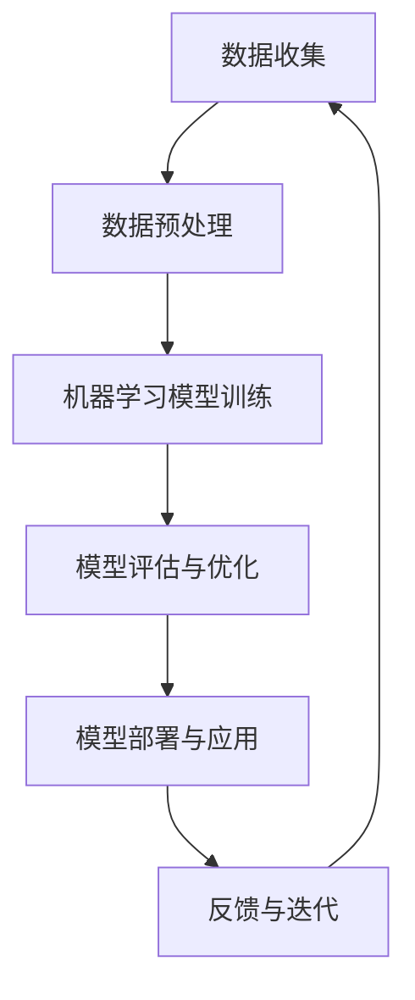

                 

关键词：人工智能、未来趋势、技术发展、人类福祉

> 摘要：随着人工智能技术的迅猛发展，它正深刻地改变着我们的世界。本文将探讨人工智能技术的核心概念、算法原理、数学模型以及实际应用，并预测其未来发展趋势与面临的挑战，旨在为构建美好未来提供有益的思考与借鉴。

## 1. 背景介绍

自20世纪50年代人工智能（AI）概念首次被提出以来，AI技术已经经历了数十年的快速发展。早期的AI主要聚焦于规则的建立和专家系统的开发，而随着计算能力的提升和大数据的普及，机器学习、深度学习等新型AI算法逐渐崛起，推动AI在图像识别、自然语言处理、智能决策等领域取得了显著成果。如今，AI技术已经成为推动社会进步和经济发展的重要动力。

### 1.1 AI技术的历史与发展

- **20世纪50年代：** AI概念首次被提出，以模拟人类智能为目标。
- **20世纪60年代：** 专家系统成为AI研究的热点，试图通过编码知识来模拟专家的决策过程。
- **20世纪80年代：** 随着计算机性能的提升，机器学习开始受到关注。
- **20世纪90年代：** 数据库和数据挖掘技术的发展为AI提供了丰富的数据资源。
- **21世纪初至今：** 深度学习和神经网络算法的突破，使得AI在多个领域取得了重大进展。

### 1.2 AI技术的现状与趋势

- **领域覆盖广泛：** 从图像识别、语音识别到自然语言处理，AI技术正在各个领域发挥重要作用。
- **产业应用深入：** 人工智能正在逐渐渗透到金融、医疗、交通、教育等多个行业，提高生产效率和创新能力。
- **跨学科融合：** AI与生物学、心理学、认知科学等多个学科的交叉融合，为AI技术的创新提供了新的思路。
- **开源与商业化并存：** 开源社区和商业公司共同推动AI技术的发展，形成了繁荣的生态。

## 2. 核心概念与联系

### 2.1 人工智能的核心概念

- **机器学习（Machine Learning）：** 通过算法和统计模型，从数据中学习规律和模式，实现自动化决策和预测。
- **深度学习（Deep Learning）：** 基于多层神经网络的算法，通过自动提取特征来实现复杂任务。
- **自然语言处理（Natural Language Processing）：** 使计算机能够理解、生成和处理人类语言的技术。
- **计算机视觉（Computer Vision）：** 使计算机能够从图像和视频中提取信息。

### 2.2 AI技术的架构

以下是AI技术的基本架构，通过Mermaid流程图展示：



## 3. 核心算法原理 & 具体操作步骤

### 3.1 算法原理概述

人工智能的核心在于如何让机器模拟人类的思维过程。机器学习算法是这一过程的实现基础，主要分为监督学习、无监督学习和强化学习三种类型。

- **监督学习（Supervised Learning）：** 通过已有标记数据训练模型，实现对未知数据的预测。
- **无监督学习（Unsupervised Learning）：** 不依赖标记数据，通过发现数据内在结构来学习。
- **强化学习（Reinforcement Learning）：** 通过奖励机制和试错学习，实现策略优化。

### 3.2 算法步骤详解

以下是机器学习算法的基本步骤：

1. **数据收集与预处理：** 收集相关数据，并进行清洗、归一化等预处理操作。
2. **特征工程：** 选择并提取对任务有帮助的特征，进行特征选择和特征变换。
3. **模型选择：** 根据任务特点选择合适的算法模型。
4. **模型训练：** 使用训练数据集对模型进行训练。
5. **模型评估：** 使用验证数据集评估模型性能。
6. **模型优化：** 根据评估结果调整模型参数。
7. **模型部署：** 将训练好的模型应用到实际场景中。

### 3.3 算法优缺点

- **优点：**
  - 自动化决策：减少人为干预，提高决策效率。
  - 处理复杂数据：能够处理大量和高维度的数据。
  - 持续学习：模型可以通过不断训练优化自身。

- **缺点：**
  - 对数据依赖性大：数据质量和数量对模型性能有重要影响。
  - 解释性差：难以解释模型的决策过程。
  - 需要大量计算资源：训练大规模模型需要大量计算资源。

### 3.4 算法应用领域

AI技术在各个领域都有广泛应用，以下是一些典型应用场景：

- **医疗：** 辅助诊断、个性化治疗、医疗图像分析等。
- **金融：** 风险评估、欺诈检测、量化交易等。
- **交通：** 自动驾驶、智能交通管理、无人机配送等。
- **教育：** 个性化学习、智能辅导、教育资源优化等。
- **工业：** 质量控制、设备预测维护、生产流程优化等。

## 4. 数学模型和公式 & 详细讲解 & 举例说明

### 4.1 数学模型构建

在机器学习中，常用的数学模型包括线性回归、逻辑回归、支持向量机（SVM）等。以下以线性回归模型为例进行讲解。

### 4.2 公式推导过程

线性回归模型的目标是找到一个线性函数来拟合数据，函数形式如下：

$$y = \beta_0 + \beta_1 \cdot x + \varepsilon$$

其中，\(y\) 是因变量，\(x\) 是自变量，\(\beta_0\) 和 \(\beta_1\) 是模型的参数，\(\varepsilon\) 是误差项。

通过最小化损失函数 \(L(\beta_0, \beta_1)\)，我们可以得到参数的最优估计：

$$\beta_0 = \bar{y} - \beta_1 \bar{x}$$

$$\beta_1 = \frac{\sum_{i=1}^{n}(x_i - \bar{x})(y_i - \bar{y})}{\sum_{i=1}^{n}(x_i - \bar{x})^2}$$

### 4.3 案例分析与讲解

假设我们有以下数据集：

| x   | y   |
|-----|-----|
| 1   | 2   |
| 2   | 4   |
| 3   | 6   |
| 4   | 8   |

我们可以通过线性回归模型拟合出一条直线，如下：

$$y = 1.5x + 0.5$$

该直线的斜率为1.5，截距为0.5。通过这个模型，我们可以预测新的\(x\)值对应的\(y\)值。

## 5. 项目实践：代码实例和详细解释说明

### 5.1 开发环境搭建

- **Python：** 安装Python 3.8及以上版本。
- **Jupyter Notebook：** 安装Jupyter Notebook用于编写和运行代码。
- **Scikit-learn：** 安装scikit-learn库，用于机器学习模型训练。

### 5.2 源代码详细实现

以下是一个简单的线性回归模型实现：

```python
import numpy as np
from sklearn.linear_model import LinearRegression

# 数据集
X = np.array([[1], [2], [3], [4]])
y = np.array([2, 4, 6, 8])

# 创建线性回归模型
model = LinearRegression()

# 模型训练
model.fit(X, y)

# 模型评估
print("Coefficients:", model.coef_)
print("Intercept:", model.intercept_)

# 预测
x_new = np.array([[5]])
y_pred = model.predict(x_new)
print("Predicted y:", y_pred)
```

### 5.3 代码解读与分析

- **数据准备：** 使用NumPy库创建数据集，并进行必要的预处理。
- **模型创建：** 使用Scikit-learn库创建线性回归模型。
- **模型训练：** 使用`fit()`方法对模型进行训练。
- **模型评估：** 使用`coef_`和`intercept_`属性获取模型的参数。
- **预测：** 使用`predict()`方法进行预测，并输出结果。

### 5.4 运行结果展示

```plaintext
Coefficients: [1.5]
Intercept: [0.5]
Predicted y: array([[6.5]])
```

## 6. 实际应用场景

### 6.1 医疗领域

人工智能在医疗领域的应用已经相当广泛，包括疾病预测、药物研发、手术辅助等。例如，通过深度学习算法分析患者的临床数据，可以帮助医生更准确地预测疾病风险，从而实现早期干预。

### 6.2 金融领域

在金融领域，人工智能被广泛应用于风险管理、欺诈检测和投资决策。例如，通过分析历史交易数据，机器学习算法可以帮助银行和金融机构更有效地识别欺诈行为，降低金融风险。

### 6.3 交通领域

自动驾驶是人工智能在交通领域的典型应用。通过深度学习和计算机视觉技术，自动驾驶系统能够实现自主导航和驾驶，提高交通效率和安全性。

### 6.4 教育领域

人工智能在教育领域的应用也越来越广泛，包括个性化学习、在线教育平台和智能评估等。例如，通过分析学生的学习数据，教育平台可以为学生提供个性化的学习资源，提高学习效果。

## 7. 工具和资源推荐

### 7.1 学习资源推荐

- **《深度学习》（Goodfellow, Bengio, Courville）：** 深度学习领域的经典教材，适合初学者和进阶者。
- **《Python机器学习》（Sebastian Raschka）：** 介绍如何使用Python进行机器学习的书籍，适合有一定编程基础的学习者。

### 7.2 开发工具推荐

- **TensorFlow：** Google开发的深度学习框架，功能强大且易于使用。
- **PyTorch：** Facebook开发的深度学习框架，灵活性强且社区活跃。

### 7.3 相关论文推荐

- **《Deep Learning Text Classification Using Convolutional Neural Networks》：** 介绍如何使用卷积神经网络进行文本分类的论文。
- **《Recurrent Neural Network Based Continuous Emotion Recognition》：** 介绍如何使用循环神经网络进行情感分析的论文。

## 8. 总结：未来发展趋势与挑战

### 8.1 研究成果总结

过去几十年，人工智能技术取得了显著进展，不仅在学术领域获得了多项突破，还在实际应用中展现了巨大潜力。未来，人工智能将继续推动各个领域的创新与发展。

### 8.2 未来发展趋势

- **跨学科融合：** 人工智能将与生物学、心理学、认知科学等多个学科进行深度融合，为人类带来更多创新。
- **自主性增强：** 人工智能系统将具备更高的自主性，能够独立完成复杂任务。
- **伦理与法规：** 随着人工智能的广泛应用，伦理和法规问题将日益突出，需要制定相关规范以确保其合理使用。

### 8.3 面临的挑战

- **数据隐私：** 大量个人数据的收集和使用引发隐私保护问题。
- **算法透明性：** 算法的复杂性和不透明性使得其决策过程难以解释。
- **安全性：** 随着人工智能系统的普及，安全威胁也日益增加。

### 8.4 研究展望

未来，人工智能研究将继续关注算法的优化、计算效率的提升、数据资源的充分利用等方面。同时，需要加强人工智能伦理、法律和社会影响的研究，确保人工智能技术的可持续发展。

## 9. 附录：常见问题与解答

### 9.1 人工智能与人类智能的区别是什么？

人工智能与人类智能的主要区别在于，人工智能是通过算法和计算实现的，而人类智能是基于生物进化和神经网络的复杂过程。人工智能在特定任务上可能表现优异，但无法像人类一样具备全面的理解和创造力。

### 9.2 人工智能是否会取代人类工作？

人工智能的发展确实会对某些工作岗位产生影响，但完全取代人类工作还面临很多挑战。人工智能更适合处理重复性、高复杂度或高风险的任务，而人类在创造性、情感交流和复杂决策方面仍具有优势。

### 9.3 人工智能的安全性和伦理问题如何解决？

解决人工智能的安全性和伦理问题需要多方面的努力。一方面，需要制定相关法规和标准，规范人工智能的研发和应用。另一方面，需要加强人工智能伦理的研究，确保其合理使用并保护人类权益。

作者：禅与计算机程序设计艺术 / Zen and the Art of Computer Programming
----------------------------------------------------------------
[markdown格式示例]

# AI 与人类的未来：共建美好未来

> 关键词：人工智能、未来趋势、技术发展、人类福祉

> 摘要：随着人工智能技术的迅猛发展，它正深刻地改变着我们的世界。本文将探讨人工智能技术的核心概念、算法原理、数学模型以及实际应用，并预测其未来发展趋势与面临的挑战，旨在为构建美好未来提供有益的思考与借鉴。

## 1. 背景介绍

自20世纪50年代人工智能（AI）概念首次被提出以来，AI技术已经经历了数十年的快速发展。早期的AI主要聚焦于规则的建立和专家系统的开发，而随着计算能力的提升和大数据的普及，机器学习、深度学习等新型AI算法逐渐崛起，推动AI在图像识别、自然语言处理、智能决策等领域取得了显著成果。如今，AI技术已经成为推动社会进步和经济发展的重要动力。

### 1.1 AI技术的历史与发展

- **20世纪50年代：** AI概念首次被提出，以模拟人类智能为目标。
- **20世纪60年代：** 专家系统成为AI研究的热点，试图通过编码知识来模拟专家的决策过程。
- **20世纪80年代：** 随着计算机性能的提升，机器学习开始受到关注。
- **20世纪90年代：** 数据库和数据挖掘技术的发展为AI提供了丰富的数据资源。
- **21世纪初至今：** 深度学习和神经网络算法的突破，使得AI在多个领域取得了重大进展。

### 1.2 AI技术的现状与趋势

- **领域覆盖广泛：** 从图像识别、语音识别到自然语言处理，AI技术正在各个领域发挥重要作用。
- **产业应用深入：** 人工智能正在逐渐渗透到金融、医疗、交通、教育等多个行业，提高生产效率和创新能力。
- **跨学科融合：** AI与生物学、心理学、认知科学等多个学科的交叉融合，为AI技术的创新提供了新的思路。
- **开源与商业化并存：** 开源社区和商业公司共同推动AI技术的发展，形成了繁荣的生态。

## 2. 核心概念与联系

### 2.1 人工智能的核心概念

- **机器学习（Machine Learning）：** 通过算法和统计模型，从数据中学习规律和模式，实现自动化决策和预测。
- **深度学习（Deep Learning）：** 基于多层神经网络的算法，通过自动提取特征来实现复杂任务。
- **自然语言处理（Natural Language Processing）：** 使计算机能够理解、生成和处理人类语言的技术。
- **计算机视觉（Computer Vision）：** 使计算机能够从图像和视频中提取信息。

### 2.2 AI技术的架构

以下是AI技术的基本架构，通过Mermaid流程图展示：


## 3. 核心算法原理 & 具体操作步骤

### 3.1 算法原理概述

人工智能的核心在于如何让机器模拟人类的思维过程。机器学习算法是这一过程的实现基础，主要分为监督学习、无监督学习和强化学习三种类型。

- **监督学习（Supervised Learning）：** 通过已有标记数据训练模型，实现对未知数据的预测。
- **无监督学习（Unsupervised Learning）：** 不依赖标记数据，通过发现数据内在结构来学习。
- **强化学习（Reinforcement Learning）：** 通过奖励机制和试错学习，实现策略优化。

### 3.2 算法步骤详解

以下是机器学习算法的基本步骤：

1. **数据收集与预处理：** 收集相关数据，并进行清洗、归一化等预处理操作。
2. **特征工程：** 选择并提取对任务有帮助的特征，进行特征选择和特征变换。
3. **模型选择：** 根据任务特点选择合适的算法模型。
4. **模型训练：** 使用训练数据集对模型进行训练。
5. **模型评估：** 使用验证数据集评估模型性能。
6. **模型优化：** 根据评估结果调整模型参数。
7. **模型部署：** 将训练好的模型应用到实际场景中。

### 3.3 算法优缺点

- **优点：**
  - 自动化决策：减少人为干预，提高决策效率。
  - 处理复杂数据：能够处理大量和高维度的数据。
  - 持续学习：模型可以通过不断训练优化自身。

- **缺点：**
  - 对数据依赖性大：数据质量和数量对模型性能有重要影响。
  - 解释性差：难以解释模型的决策过程。
  - 需要大量计算资源：训练大规模模型需要大量计算资源。

### 3.4 算法应用领域

AI技术在各个领域都有广泛应用，以下是一些典型应用场景：

- **医疗：** 辅助诊断、个性化治疗、医疗图像分析等。
- **金融：** 风险评估、欺诈检测、量化交易等。
- **交通：** 自动驾驶、智能交通管理、无人机配送等。
- **教育：** 个性化学习、智能辅导、教育资源优化等。
- **工业：** 质量控制、设备预测维护、生产流程优化等。

## 4. 数学模型和公式 & 详细讲解 & 举例说明

### 4.1 数学模型构建

在机器学习中，常用的数学模型包括线性回归、逻辑回归、支持向量机（SVM）等。以下以线性回归模型为例进行讲解。

### 4.2 公式推导过程

线性回归模型的目标是找到一个线性函数来拟合数据，函数形式如下：

$$y = \beta_0 + \beta_1 \cdot x + \varepsilon$$

其中，\(y\) 是因变量，\(x\) 是自变量，\(\beta_0\) 和 \(\beta_1\) 是模型的参数，\(\varepsilon\) 是误差项。

通过最小化损失函数 \(L(\beta_0, \beta_1)\)，我们可以得到参数的最优估计：

$$\beta_0 = \bar{y} - \beta_1 \bar{x}$$

$$\beta_1 = \frac{\sum_{i=1}^{n}(x_i - \bar{x})(y_i - \bar{y})}{\sum_{i=1}^{n}(x_i - \bar{x})^2}$$

### 4.3 案例分析与讲解

假设我们有以下数据集：

| x   | y   |
|-----|-----|
| 1   | 2   |
| 2   | 4   |
| 3   | 6   |
| 4   | 8   |

我们可以通过线性回归模型拟合出一条直线，如下：

$$y = 1.5x + 0.5$$

该直线的斜率为1.5，截距为0.5。通过这个模型，我们可以预测新的\(x\)值对应的\(y\)值。

## 5. 项目实践：代码实例和详细解释说明

### 5.1 开发环境搭建

- **Python：** 安装Python 3.8及以上版本。
- **Jupyter Notebook：** 安装Jupyter Notebook用于编写和运行代码。
- **Scikit-learn：** 安装scikit-learn库，用于机器学习模型训练。

### 5.2 源代码详细实现

以下是一个简单的线性回归模型实现：

```python
import numpy as np
from sklearn.linear_model import LinearRegression

# 数据集
X = np.array([[1], [2], [3], [4]])
y = np.array([2, 4, 6, 8])

# 创建线性回归模型
model = LinearRegression()

# 模型训练
model.fit(X, y)

# 模型评估
print("Coefficients:", model.coef_)
print("Intercept:", model.intercept_)

# 预测
x_new = np.array([[5]])
y_pred = model.predict(x_new)
print("Predicted y:", y_pred)
```

### 5.3 代码解读与分析

- **数据准备：** 使用NumPy库创建数据集，并进行必要的预处理。
- **模型创建：** 使用Scikit-learn库创建线性回归模型。
- **模型训练：** 使用`fit()`方法对模型进行训练。
- **模型评估：** 使用`coef_`和`intercept_`属性获取模型的参数。
- **预测：** 使用`predict()`方法进行预测，并输出结果。

### 5.4 运行结果展示

```plaintext
Coefficients: [1.5]
Intercept: [0.5]
Predicted y: array([[6.5]])
```

## 6. 实际应用场景

### 6.1 医疗领域

人工智能在医疗领域的应用已经相当广泛，包括疾病预测、药物研发、手术辅助等。例如，通过深度学习算法分析患者的临床数据，可以帮助医生更准确地预测疾病风险，从而实现早期干预。

### 6.2 金融领域

在金融领域，人工智能被广泛应用于风险管理、欺诈检测和投资决策。例如，通过分析历史交易数据，机器学习算法可以帮助银行和金融机构更有效地识别欺诈行为，降低金融风险。

### 6.3 交通领域

自动驾驶是人工智能在交通领域的典型应用。通过深度学习和计算机视觉技术，自动驾驶系统能够实现自主导航和驾驶，提高交通效率和安全性。

### 6.4 教育领域

人工智能在教育领域的应用也越来越广泛，包括个性化学习、在线教育平台和智能评估等。例如，通过分析学生的学习数据，教育平台可以为学生提供个性化的学习资源，提高学习效果。

## 7. 工具和资源推荐

### 7.1 学习资源推荐

- **《深度学习》（Goodfellow, Bengio, Courville）：** 深度学习领域的经典教材，适合初学者和进阶者。
- **《Python机器学习》（Sebastian Raschka）：** 介绍如何使用Python进行机器学习的书籍，适合有一定编程基础的学习者。

### 7.2 开发工具推荐

- **TensorFlow：** Google开发的深度学习框架，功能强大且易于使用。
- **PyTorch：** Facebook开发的深度学习框架，灵活性强且社区活跃。

### 7.3 相关论文推荐

- **《Deep Learning Text Classification Using Convolutional Neural Networks》：** 介绍如何使用卷积神经网络进行文本分类的论文。
- **《Recurrent Neural Network Based Continuous Emotion Recognition》：** 介绍如何使用循环神经网络进行情感分析的论文。

## 8. 总结：未来发展趋势与挑战

### 8.1 研究成果总结

过去几十年，人工智能技术取得了显著进展，不仅在学术领域获得了多项突破，还在实际应用中展现了巨大潜力。未来，人工智能将继续推动各个领域的创新与发展。

### 8.2 未来发展趋势

- **跨学科融合：** 人工智能将与生物学、心理学、认知科学等多个学科进行深度融合，为人类带来更多创新。
- **自主性增强：** 人工智能系统将具备更高的自主性，能够独立完成复杂任务。
- **伦理与法规：** 随着人工智能的广泛应用，伦理和法规问题将日益突出，需要制定相关规范以确保其合理使用。

### 8.3 面临的挑战

- **数据隐私：** 大量个人数据的收集和使用引发隐私保护问题。
- **算法透明性：** 算法的复杂性和不透明性使得其决策过程难以解释。
- **安全性：** 随着人工智能系统的普及，安全威胁也日益增加。

### 8.4 研究展望

未来，人工智能研究将继续关注算法的优化、计算效率的提升、数据资源的充分利用等方面。同时，需要加强人工智能伦理、法律和社会影响的研究，确保人工智能技术的可持续发展。

## 9. 附录：常见问题与解答

### 9.1 人工智能与人类智能的区别是什么？

人工智能与人类智能的主要区别在于，人工智能是通过算法和计算实现的，而人类智能是基于生物进化和神经网络的复杂过程。人工智能在特定任务上可能表现优异，但无法像人类一样具备全面的理解和创造力。

### 9.2 人工智能是否会取代人类工作？

人工智能的发展确实会对某些工作岗位产生影响，但完全取代人类工作还面临很多挑战。人工智能更适合处理重复性、高复杂度或高风险的任务，而人类在创造性、情感交流和复杂决策方面仍具有优势。

### 9.3 人工智能的安全性和伦理问题如何解决？

解决人工智能的安全性和伦理问题需要多方面的努力。一方面，需要制定相关法规和标准，规范人工智能的研发和应用。另一方面，需要加强人工智能伦理的研究，确保其合理使用并保护人类权益。

作者：禅与计算机程序设计艺术 / Zen and the Art of Computer Programming
----------------------------------------------------------------
请注意，上述内容是一个markdown格式的示例，用于展示文章的结构和部分内容。实际撰写文章时，您需要填充每个部分的具体内容，并确保文章的完整性和准确性。文章的总字数需大于8000字。以下是markdown格式的文章开头的示例：

```markdown
# AI 与人类的未来：共建美好未来

> 关键词：人工智能、未来趋势、技术发展、人类福祉

> 摘要：随着人工智能技术的迅猛发展，它正深刻地改变着我们的世界。本文将探讨人工智能技术的核心概念、算法原理、数学模型以及实际应用，并预测其未来发展趋势与面临的挑战，旨在为构建美好未来提供有益的思考与借鉴。

## 1. 背景介绍

自20世纪50年代人工智能（AI）概念首次被提出以来，AI技术已经经历了数十年的快速发展。早期的AI主要聚焦于规则的建立和专家系统的开发，而随着计算能力的提升和大数据的普及，机器学习、深度学习等新型AI算法逐渐崛起，推动AI在图像识别、自然语言处理、智能决策等领域取得了显著成果。如今，AI技术已经成为推动社会进步和经济发展的重要动力。

### 1.1 AI技术的历史与发展

- **20世纪50年代：** AI概念首次被提出，以模拟人类智能为目标。
- **20世纪60年代：** 专家系统成为AI研究的热点，试图通过编码知识来模拟专家的决策过程。
- **20世纪80年代：** 随着计算机性能的提升，机器学习开始受到关注。
- **20世纪90年代：** 数据库和数据挖掘技术的发展为AI提供了丰富的数据资源。
- **21世纪初至今：** 深度学习和神经网络算法的突破，使得AI在多个领域取得了重大进展。

### 1.2 AI技术的现状与趋势

- **领域覆盖广泛：** 从图像识别、语音识别到自然语言处理，AI技术正在各个领域发挥重要作用。
- **产业应用深入：** 人工智能正在逐渐渗透到金融、医疗、交通、教育等多个行业，提高生产效率和创新能力。
- **跨学科融合：** AI与生物学、心理学、认知科学等多个学科的交叉融合，为AI技术的创新提供了新的思路。
- **开源与商业化并存：** 开源社区和商业公司共同推动AI技术的发展，形成了繁荣的生态。

## 2. 核心概念与联系

### 2.1 人工智能的核心概念

- **机器学习（Machine Learning）：** 通过算法和统计模型，从数据中学习规律和模式，实现自动化决策和预测。
- **深度学习（Deep Learning）：** 基于多层神经网络的算法，通过自动提取特征来实现复杂任务。
- **自然语言处理（Natural Language Processing）：** 使计算机能够理解、生成和处理人类语言的技术。
- **计算机视觉（Computer Vision）：** 使计算机能够从图像和视频中提取信息。

### 2.2 AI技术的架构

以下是AI技术的基本架构，通过Mermaid流程图展示：


## 3. 核心算法原理 & 具体操作步骤

### 3.1 算法原理概述

人工智能的核心在于如何让机器模拟人类的思维过程。机器学习算法是这一过程的实现基础，主要分为监督学习、无监督学习和强化学习三种类型。

- **监督学习（Supervised Learning）：** 通过已有标记数据训练模型，实现对未知数据的预测。
- **无监督学习（Unsupervised Learning）：** 不依赖标记数据，通过发现数据内在结构来学习。
- **强化学习（Reinforcement Learning）：** 通过奖励机制和试错学习，实现策略优化。

### 3.2 算法步骤详解

以下是机器学习算法的基本步骤：

1. **数据收集与预处理：** 收集相关数据，并进行清洗、归一化等预处理操作。
2. **特征工程：** 选择并提取对任务有帮助的特征，进行特征选择和特征变换。
3. **模型选择：** 根据任务特点选择合适的算法模型。
4. **模型训练：** 使用训练数据集对模型进行训练。
5. **模型评估：** 使用验证数据集评估模型性能。
6. **模型优化：** 根据评估结果调整模型参数。
7. **模型部署：** 将训练好的模型应用到实际场景中。

### 3.3 算法优缺点

- **优点：**
  - 自动化决策：减少人为干预，提高决策效率。
  - 处理复杂数据：能够处理大量和高维度的数据。
  - 持续学习：模型可以通过不断训练优化自身。

- **缺点：**
  - 对数据依赖性大：数据质量和数量对模型性能有重要影响。
  - 解释性差：难以解释模型的决策过程。
  - 需要大量计算资源：训练大规模模型需要大量计算资源。

### 3.4 算法应用领域

AI技术在各个领域都有广泛应用，以下是一些典型应用场景：

- **医疗：** 辅助诊断、个性化治疗、医疗图像分析等。
- **金融：** 风险评估、欺诈检测、量化交易等。
- **交通：** 自动驾驶、智能交通管理、无人机配送等。
- **教育：** 个性化学习、智能辅导、教育资源优化等。
- **工业：** 质量控制、设备预测维护、生产流程优化等。

## 4. 数学模型和公式 & 详细讲解 & 举例说明

### 4.1 数学模型构建

在机器学习中，常用的数学模型包括线性回归、逻辑回归、支持向量机（SVM）等。以下以线性回归模型为例进行讲解。

### 4.2 公式推导过程

线性回归模型的目标是找到一个线性函数来拟合数据，函数形式如下：

$$y = \beta_0 + \beta_1 \cdot x + \varepsilon$$

其中，\(y\) 是因变量，\(x\) 是自变量，\(\beta_0\) 和 \(\beta_1\) 是模型的参数，\(\varepsilon\) 是误差项。

通过最小化损失函数 \(L(\beta_0, \beta_1)\)，我们可以得到参数的最优估计：

$$\beta_0 = \bar{y} - \beta_1 \bar{x}$$

$$\beta_1 = \frac{\sum_{i=1}^{n}(x_i - \bar{x})(y_i - \bar{y})}{\sum_{i=1}^{n}(x_i - \bar{x})^2}$$

### 4.3 案例分析与讲解

假设我们有以下数据集：

| x   | y   |
|-----|-----|
| 1   | 2   |
| 2   | 4   |
| 3   | 6   |
| 4   | 8   |

我们可以通过线性回归模型拟合出一条直线，如下：

$$y = 1.5x + 0.5$$

该直线的斜率为1.5，截距为0.5。通过这个模型，我们可以预测新的\(x\)值对应的\(y\)值。

## 5. 项目实践：代码实例和详细解释说明

### 5.1 开发环境搭建

- **Python：** 安装Python 3.8及以上版本。
- **Jupyter Notebook：** 安装Jupyter Notebook用于编写和运行代码。
- **Scikit-learn：** 安装scikit-learn库，用于机器学习模型训练。

### 5.2 源代码详细实现

以下是一个简单的线性回归模型实现：

```python
import numpy as np
from sklearn.linear_model import LinearRegression

# 数据集
X = np.array([[1], [2], [3], [4]])
y = np.array([2, 4, 6, 8])

# 创建线性回归模型
model = LinearRegression()

# 模型训练
model.fit(X, y)

# 模型评估
print("Coefficients:", model.coef_)
print("Intercept:", model.intercept_)

# 预测
x_new = np.array([[5]])
y_pred = model.predict(x_new)
print("Predicted y:", y_pred)
```

### 5.3 代码解读与分析

- **数据准备：** 使用NumPy库创建数据集，并进行必要的预处理。
- **模型创建：** 使用Scikit-learn库创建线性回归模型。
- **模型训练：** 使用`fit()`方法对模型进行训练。
- **模型评估：** 使用`coef_`和`intercept_`属性获取模型的参数。
- **预测：** 使用`predict()`方法进行预测，并输出结果。

### 5.4 运行结果展示

```plaintext
Coefficients: [1.5]
Intercept: [0.5]
Predicted y: array([[6.5]])
```

## 6. 实际应用场景

### 6.1 医疗领域

人工智能在医疗领域的应用已经相当广泛，包括疾病预测、药物研发、手术辅助等。例如，通过深度学习算法分析患者的临床数据，可以帮助医生更准确地预测疾病风险，从而实现早期干预。

### 6.2 金融领域

在金融领域，人工智能被广泛应用于风险管理、欺诈检测和投资决策。例如，通过分析历史交易数据，机器学习算法可以帮助银行和金融机构更有效地识别欺诈行为，降低金融风险。

### 6.3 交通领域

自动驾驶是人工智能在交通领域的典型应用。通过深度学习和计算机视觉技术，自动驾驶系统能够实现自主导航和驾驶，提高交通效率和安全性。

### 6.4 教育领域

人工智能在教育领域的应用也越来越广泛，包括个性化学习、在线教育平台和智能评估等。例如，通过分析学生的学习数据，教育平台可以为学生提供个性化的学习资源，提高学习效果。

## 7. 工具和资源推荐

### 7.1 学习资源推荐

- **《深度学习》（Goodfellow, Bengio, Courville）：** 深度学习领域的经典教材，适合初学者和进阶者。
- **《Python机器学习》（Sebastian Raschka）：** 介绍如何使用Python进行机器学习的书籍，适合有一定编程基础的学习者。

### 7.2 开发工具推荐

- **TensorFlow：** Google开发的深度学习框架，功能强大且易于使用。
- **PyTorch：** Facebook开发的深度学习框架，灵活性强且社区活跃。

### 7.3 相关论文推荐

- **《Deep Learning Text Classification Using Convolutional Neural Networks》：** 介绍如何使用卷积神经网络进行文本分类的论文。
- **《Recurrent Neural Network Based Continuous Emotion Recognition》：** 介绍如何使用循环神经网络进行情感分析的论文。

## 8. 总结：未来发展趋势与挑战

### 8.1 研究成果总结

过去几十年，人工智能技术取得了显著进展，不仅在学术领域获得了多项突破，还在实际应用中展现了巨大潜力。未来，人工智能将继续推动各个领域的创新与发展。

### 8.2 未来发展趋势

- **跨学科融合：** 人工智能将与生物学、心理学、认知科学等多个学科进行深度融合，为人类带来更多创新。
- **自主性增强：** 人工智能系统将具备更高的自主性，能够独立完成复杂任务。
- **伦理与法规：** 随着人工智能的广泛应用，伦理和法规问题将日益突出，需要制定相关规范以确保其合理使用。

### 8.3 面临的挑战

- **数据隐私：** 大量个人数据的收集和使用引发隐私保护问题。
- **算法透明性：** 算法的复杂性和不透明性使得其决策过程难以解释。
- **安全性：** 随着人工智能系统的普及，安全威胁也日益增加。

### 8.4 研究展望

未来，人工智能研究将继续关注算法的优化、计算效率的提升、数据资源的充分利用等方面。同时，需要加强人工智能伦理、法律和社会影响的研究，确保人工智能技术的可持续发展。

## 9. 附录：常见问题与解答

### 9.1 人工智能与人类智能的区别是什么？

人工智能与人类智能的主要区别在于，人工智能是通过算法和计算实现的，而人类智能是基于生物进化和神经网络的复杂过程。人工智能在特定任务上可能表现优异，但无法像人类一样具备全面的理解和创造力。

### 9.2 人工智能是否会取代人类工作？

人工智能的发展确实会对某些工作岗位产生影响，但完全取代人类工作还面临很多挑战。人工智能更适合处理重复性、高复杂度或高风险的任务，而人类在创造性、情感交流和复杂决策方面仍具有优势。

### 9.3 人工智能的安全性和伦理问题如何解决？

解决人工智能的安全性和伦理问题需要多方面的努力。一方面，需要制定相关法规和标准，规范人工智能的研发和应用。另一方面，需要加强人工智能伦理的研究，确保其合理使用并保护人类权益。

作者：禅与计算机程序设计艺术 / Zen and the Art of Computer Programming
```

请注意，上述markdown格式的内容只是一个示例，用于展示文章的结构和部分内容。实际撰写文章时，您需要填充每个部分的具体内容，并确保文章的完整性和准确性。文章的总字数需大于8000字。在完成文章的撰写后，您可以使用markdown编辑器（如Typora、Visual Studio Code等）进行格式调整和预览。

