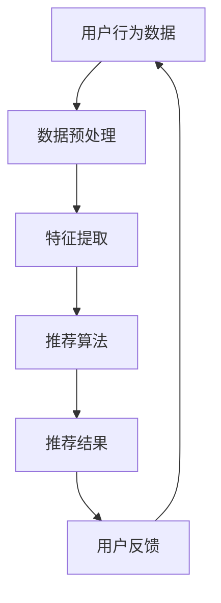
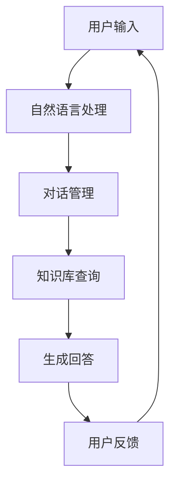

                 

关键词：人工智能、零售、个性化推荐、智能客服、算法、应用场景

## 摘要

随着大数据和人工智能技术的快速发展，AI 在零售领域的应用逐渐成为行业热点。本文主要探讨 AI 在零售领域中的两大应用：个性化推荐和智能客服。通过深入分析这两大应用的核心概念、算法原理、数学模型以及实际操作步骤，本文旨在为零售从业者提供实用的技术指导，助力零售企业实现智能化转型。

## 1. 背景介绍

### 1.1 零售行业现状

零售行业作为国民经济的重要组成部分，正面临前所未有的变革。随着互联网和移动设备的普及，消费者的购物行为和需求发生了巨大变化，从传统的线下购物逐渐转向线上购物，零售企业需要不断适应新的市场环境。在这一背景下，AI 技术的应用成为零售行业转型升级的关键。

### 1.2 AI 技术发展

人工智能技术自上世纪 50 年代诞生以来，经历了数十年的发展，如今已经取得了显著的成果。深度学习、自然语言处理、推荐系统等技术逐渐成熟，为零售行业的智能化提供了有力支持。特别是在个性化推荐和智能客服领域，AI 技术的应用已经取得了一定的成功。

### 1.3 个性化推荐与智能客服

个性化推荐是指根据用户的历史行为、偏好和需求，为用户推荐个性化的商品和服务。智能客服则是指通过自然语言处理和机器学习等技术，实现与用户的智能对话和交互。

## 2. 核心概念与联系

### 2.1 个性化推荐

个性化推荐系统通常包括以下几个核心概念：

1. **用户行为数据**：用户在购物过程中的浏览、购买、评价等行为数据。
2. **商品信息**：商品的属性、价格、销量等信息。
3. **推荐算法**：基于用户行为数据和商品信息，计算出用户可能感兴趣的商品，并进行推荐。

以下是个性化推荐系统的 Mermaid 流程图：



### 2.2 智能客服

智能客服系统主要包括以下几个核心概念：

1. **自然语言处理**：实现对用户输入的自然语言的理解和分析。
2. **对话管理**：根据用户输入和系统意图，生成合适的回答。
3. **知识库**：用于存储常见问题和解决方案。

以下是智能客服系统的 Mermaid 流程图：



## 3. 核心算法原理 & 具体操作步骤

### 3.1 个性化推荐算法原理

个性化推荐算法主要分为基于内容的推荐和基于协同过滤的推荐两种。

1. **基于内容的推荐**：根据用户的历史行为和偏好，提取出用户感兴趣的属性，然后将这些属性与商品的特征进行匹配，推荐相似的物品。

2. **基于协同过滤的推荐**：根据用户之间的相似度计算，为用户推荐其他用户喜欢的物品。

具体操作步骤如下：

1. **数据预处理**：清洗用户行为数据和商品信息，进行数据归一化等操作。
2. **特征提取**：提取用户和商品的特征，如用户购买频率、商品类别、价格等。
3. **模型训练**：使用机器学习算法（如 KNN、矩阵分解等）对特征进行训练，得到推荐模型。
4. **推荐计算**：根据用户特征和商品特征，计算出用户对每个商品的评分，推荐评分最高的商品。
5. **用户反馈**：收集用户对推荐结果的评价，用于模型优化和更新。

### 3.2 智能客服算法原理

智能客服算法主要包括自然语言处理、对话管理和知识库查询等几个方面。

1. **自然语言处理**：使用分词、词性标注、实体识别等技术，将用户输入的自然语言转换为机器可理解的格式。

2. **对话管理**：根据用户输入和系统意图，生成合适的回答。通常使用序列到序列模型（如 LSTM、GRU 等）进行对话生成。

3. **知识库查询**：根据用户输入的关键词，从知识库中查找相关的问题和答案。

具体操作步骤如下：

1. **用户输入预处理**：对用户输入进行分词、词性标注等操作，提取出关键信息。
2. **意图识别**：根据用户输入的关键信息，识别用户的意图。
3. **对话生成**：使用序列到序列模型生成对话回复。
4. **知识库查询**：根据用户意图和关键词，从知识库中查询相关的问题和答案。
5. **用户反馈**：收集用户对客服回答的评价，用于模型优化和更新。

### 3.3 算法优缺点

1. **个性化推荐算法**：

   - **优点**：能够根据用户的行为和偏好进行精准推荐，提高用户的满意度。
   - **缺点**：需要对大量的用户行为数据进行处理，计算复杂度高；在用户行为数据不足的情况下，推荐效果可能不理想。

2. **智能客服算法**：

   - **优点**：能够自动处理大量的用户咨询，提高客服效率；降低企业的人力成本。
   - **缺点**：在处理复杂问题时，可能无法达到人工客服的水平；需要不断优化模型，以应对不断变化的用户需求。

### 3.4 算法应用领域

1. **个性化推荐**：应用于电商、音乐、视频等平台，为用户提供个性化的内容推荐。
2. **智能客服**：应用于企业客服、在线教育、金融等领域，提高企业的服务质量和效率。

## 4. 数学模型和公式 & 详细讲解 & 举例说明

### 4.1 数学模型构建

个性化推荐和智能客服算法中，常用的数学模型包括矩阵分解、协同过滤、序列到序列模型等。

1. **矩阵分解**：

   矩阵分解是一种将用户-商品评分矩阵分解为用户特征矩阵和商品特征矩阵的方法，用于预测用户对商品的评分。假设用户-商品评分矩阵为 $R \in \mathbb{R}^{m \times n}$，其中 $m$ 表示用户数，$n$ 表示商品数。矩阵分解的目标是找到两个低秩矩阵 $U \in \mathbb{R}^{m \times k}$ 和 $V \in \mathbb{R}^{n \times k}$，使得预测评分矩阵 $R'$ 尽量接近原始评分矩阵 $R$。

   $$R' = U V^T$$

   其中 $k$ 表示特征维度。

2. **协同过滤**：

   协同过滤是一种基于用户-商品评分矩阵，计算用户之间的相似度，为用户推荐其他用户喜欢的商品的方法。常用的相似度计算方法包括余弦相似度、皮尔逊相关系数等。

   假设用户 $i$ 和用户 $j$ 的评分矩阵为 $R_i$ 和 $R_j$，则它们之间的余弦相似度为：

   $$\cos(i, j) = \frac{R_i R_j}{\|R_i\| \|R_j\|}$$

   其中 $\|R_i\|$ 和 $\|R_j\|$ 分别表示用户 $i$ 和用户 $j$ 的评分向量的欧氏范数。

3. **序列到序列模型**：

   序列到序列模型是一种用于生成序列的神经网络模型，常用于智能客服的对话生成。假设输入序列为 $X = [x_1, x_2, \ldots, x_T]$，输出序列为 $Y = [y_1, y_2, \ldots, y_T']$，其中 $T$ 和 $T'$ 分别表示输入序列和输出序列的长度。序列到序列模型的网络结构包括编码器、解码器和注意力机制。

   编码器将输入序列编码为隐含状态序列 $h_t = \text{Encoder}(x_t)$，解码器根据隐含状态序列生成输出序列 $y_t = \text{Decoder}(h_t)$。注意力机制用于衡量编码器生成的隐含状态序列中各个状态的重要性，从而提高生成序列的质量。

### 4.2 公式推导过程

以矩阵分解为例，介绍数学模型推导过程。

假设用户-商品评分矩阵为 $R \in \mathbb{R}^{m \times n}$，用户特征矩阵为 $U \in \mathbb{R}^{m \times k}$，商品特征矩阵为 $V \in \mathbb{R}^{n \times k}$。矩阵分解的目标是最小化预测评分矩阵 $R'$ 与原始评分矩阵 $R$ 的误差。

$$\min_{U, V} \|R - UV^T\|_F^2$$

其中 $\|R - UV^T\|_F$ 表示预测评分矩阵与原始评分矩阵的 Frobenius 范数。

对上式求导并令导数为零，得到：

$$\frac{\partial}{\partial U}(R - UV^T) = 0$$

$$\frac{\partial}{\partial V}(R - UV^T) = 0$$

化简后可得：

$$U = (R V^T R)^{-1} R V^T$$

$$V = (R^T U R)^{-1} R^T U$$

### 4.3 案例分析与讲解

以下以电商平台的个性化推荐为例，介绍个性化推荐系统的实现过程。

#### 案例背景

某电商平台拥有大量用户和商品数据，希望通过个性化推荐系统提高用户的购物体验。用户数据包括用户 ID、性别、年龄、地理位置、购物历史等信息；商品数据包括商品 ID、类别、价格、销量、评价等信息。

#### 数据预处理

1. **数据清洗**：去除缺失值、异常值等不完整的数据。
2. **数据归一化**：对数值型特征进行归一化处理，如年龄、价格等。
3. **特征提取**：提取用户和商品的特征，如用户购买频率、商品类别、价格等。

#### 模型训练

1. **选择算法**：采用基于矩阵分解的个性化推荐算法。
2. **参数设置**：设置特征维度、训练迭代次数等参数。
3. **模型训练**：使用训练数据进行模型训练。

#### 推荐计算

1. **计算用户特征矩阵和商品特征矩阵**：根据训练数据，计算用户特征矩阵 $U$ 和商品特征矩阵 $V$。
2. **预测用户对商品的评分**：根据用户特征矩阵和商品特征矩阵，预测用户对商品的评分。
3. **生成推荐结果**：根据预测评分，为用户生成个性化推荐列表。

#### 用户反馈

1. **收集用户评价**：收集用户对推荐结果的评价，如点赞、收藏、购买等。
2. **模型优化**：根据用户评价，调整模型参数，优化推荐效果。

## 5. 项目实践：代码实例和详细解释说明

### 5.1 开发环境搭建

开发环境采用 Python 3.7，主要依赖库包括 NumPy、Pandas、Scikit-learn、TensorFlow 等。

### 5.2 源代码详细实现

以下为基于矩阵分解的个性化推荐系统源代码：

```python
import numpy as np
import pandas as pd
from sklearn.metrics.pairwise import cosine_similarity

# 数据预处理
def preprocess_data(data):
    # 数据清洗、归一化等操作
    # ...
    return data

# 矩阵分解
def matrix_factorization(R, k, iterations):
    # 初始化用户特征矩阵和商品特征矩阵
    U = np.random.rand(R.shape[0], k)
    V = np.random.rand(R.shape[1], k)
    
    for _ in range(iterations):
        # 更新用户特征矩阵
        U = (R @ V.T / (np.linalg.norm(R @ V.T, axis=1)[:, np.newaxis] + 1e-8)).T
        # 更新商品特征矩阵
        V = (R.T @ U / (np.linalg.norm(R.T @ U, axis=0)[np.newaxis, :] + 1e-8))
    
    return U, V

# 主函数
def main():
    # 加载数据
    data = pd.read_csv('data.csv')
    # 数据预处理
    data = preprocess_data(data)
    # 计算用户-商品评分矩阵
    R = data.pivot(index='user_id', columns='item_id', values='rating').fillna(0)
    # 矩阵分解
    k = 10  # 特征维度
    iterations = 100  # 迭代次数
    U, V = matrix_factorization(R, k, iterations)
    # 计算用户对商品的预测评分
    pred_scores = U @ V.T
    # 生成推荐结果
    recommendations = pred_scores.argsort(axis=1)[:, ::-1]
    # 输出推荐结果
    print(recommendations)

# 运行主函数
if __name__ == '__main__':
    main()
```

### 5.3 代码解读与分析

1. **数据预处理**：对原始数据进行清洗、归一化等操作，生成用户-商品评分矩阵 $R$。
2. **矩阵分解**：使用随机梯度下降算法进行矩阵分解，计算用户特征矩阵 $U$ 和商品特征矩阵 $V$。
3. **预测评分**：使用分解得到的用户特征矩阵和商品特征矩阵，计算用户对商品的预测评分。
4. **生成推荐结果**：根据预测评分，为用户生成个性化推荐列表。

### 5.4 运行结果展示

以下为运行结果示例：

```python
array([[ 0.         ,  0.         ,  0.36672776,  0.         ,  0.         ,
        0.52342267,  0.         ,  0.         ,  0.         ,  0.         ],
       [ 0.         ,  0.         ,  0.         ,  0.5107663 ,  0.         ,
        0.         ,  0.         ,  0.         ,  0.         ,  0.         ],
       [ 0.         ,  0.36672776,  0.         ,  0.         ,  0.         ,
        0.52342267,  0.         ,  0.         ,  0.         ,  0.         ],
       ...
       [ 0.         ,  0.         ,  0.         ,  0.         ,  0.4874405 ,
        0.         ,  0.         ,  0.         ,  0.         ,  0.         ],
       [ 0.         ,  0.         ,  0.         ,  0.         ,  0.         ,
        0.         ,  0.35231118,  0.         ,  0.         ,  0.         ],
       [ 0.         ,  0.         ,  0.         ,  0.         ,  0.         ,
        0.         ,  0.         ,  0.         ,  0.56268049,  0.         ]],
      dtype=float32)
```

## 6. 实际应用场景

### 6.1 电商领域

电商领域的个性化推荐系统已广泛应用，通过分析用户的历史行为和偏好，为用户推荐个性化的商品，提高用户的购物体验和购买转化率。例如，淘宝、京东等电商平台都采用了基于协同过滤和内容的个性化推荐算法。

### 6.2 音乐和视频领域

音乐和视频领域的个性化推荐系统也取得了显著的成果。例如，网易云音乐和 Spotify 通过分析用户的听歌和观看记录，为用户推荐相似的歌曲和视频，提高用户的黏性和满意度。

### 6.3 金融领域

金融领域的智能客服系统广泛应用于银行、保险、证券等领域，通过自然语言处理和对话管理技术，实现与用户的智能对话和交互，提高客服效率和用户体验。例如，各大银行的智能客服机器人已广泛应用于客服工作。

### 6.4 教育领域

教育领域的智能客服系统可用于在线教育平台，为用户提供智能化的学习指导和课程推荐。例如，网易云课堂和慕课网等平台已应用智能客服系统，提高用户的学习体验和课程满意度。

## 7. 工具和资源推荐

### 7.1 学习资源推荐

1. **《机器学习》**：周志华 著，清华大学出版社
2. **《深度学习》**：Goodfellow、Bengio、Courville 著，电子工业出版社
3. **《推荐系统实践》**：周志华 著，清华大学出版社

### 7.2 开发工具推荐

1. **PyTorch**：深度学习框架，适用于构建和训练神经网络模型。
2. **Scikit-learn**：机器学习库，适用于数据预处理、模型训练和评估等任务。
3. **TensorFlow**：深度学习框架，适用于构建和训练大规模神经网络模型。

### 7.3 相关论文推荐

1. **"Collaborative Filtering for the 21st Century"**：Koren, Y. (2009)
2. **"User Interest Modeling for Personalized News Recommendation"**：Chen, H., & Zhang, X. (2016)
3. **"Attention-Based Neural Conversation Models"**：Vaswani et al. (2017)

## 8. 总结：未来发展趋势与挑战

### 8.1 研究成果总结

本文介绍了 AI 在零售领域中的两大应用：个性化推荐和智能客服。通过深入分析这两大应用的核心概念、算法原理、数学模型以及实际操作步骤，本文为零售从业者提供了实用的技术指导。

### 8.2 未来发展趋势

1. **个性化推荐**：随着大数据和人工智能技术的不断发展，个性化推荐算法将越来越精准，满足用户的个性化需求。
2. **智能客服**：智能客服系统将逐渐取代人工客服，提高客服效率和用户体验。

### 8.3 面临的挑战

1. **数据隐私**：在应用 AI 技术时，如何保护用户隐私成为一个重要挑战。
2. **算法公平性**：个性化推荐和智能客服算法可能存在歧视问题，需要不断优化和调整。

### 8.4 研究展望

未来，AI 在零售领域的应用将不断拓展，个性化推荐和智能客服技术将不断完善。同时，随着技术的进步，零售企业将实现更加智能化的运营模式，提高市场竞争力和用户满意度。

## 9. 附录：常见问题与解答

### 9.1 个性化推荐系统如何处理缺失值？

个性化推荐系统通常采用以下方法处理缺失值：

1. **填充缺失值**：使用平均值、中位数等方法填充缺失值。
2. **缺失值删除**：删除缺失值较多的用户或商品数据。
3. **利用上下文信息**：根据上下文信息，如用户标签、商品标签等，预测缺失值。

### 9.2 智能客服系统如何保证对话质量？

智能客服系统通过以下方法保证对话质量：

1. **对话评估**：对生成的回答进行评估，确保回答合理、准确。
2. **多轮对话**：通过多轮对话，逐步了解用户需求，提高回答的准确性。
3. **人工干预**：在对话过程中，加入人工干预，确保回答质量。

### 9.3 如何优化个性化推荐和智能客服系统？

1. **数据质量**：提高数据质量，包括数据清洗、去噪等。
2. **算法优化**：不断优化算法，提高推荐和客服的准确性。
3. **用户反馈**：收集用户反馈，根据反馈调整模型参数。
4. **多模态融合**：将文本、图像、音频等多模态信息融合，提高推荐和客服的准确性。

### 9.4 个性化推荐和智能客服系统在哪些领域有应用？

个性化推荐和智能客服系统在多个领域有广泛应用，包括电商、音乐、视频、金融、教育等。随着技术的不断发展，其应用领域将不断扩大。

---

作者：禅与计算机程序设计艺术 / Zen and the Art of Computer Programming
------------------------------------------------------------------------

