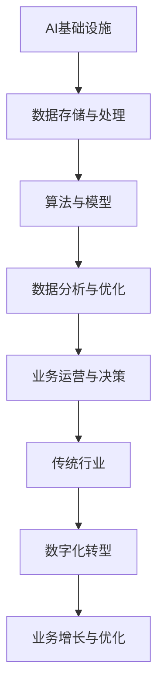
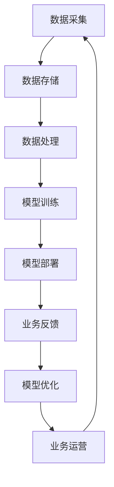

                 

## 1. 背景介绍

在当今数字化时代，人工智能（AI）技术正迅速改变着各行各业。从智能家居、自动驾驶，到医疗诊断、金融分析，AI的应用场景越来越广泛。然而，这些应用的背后离不开强大的基础设施支持。AI基础设施的产业升级，不仅影响着AI技术的发展，更是推动传统行业转型的重要动力。

传统行业在经历了数十年甚至上百年的发展后，往往积累了大量的数据资源，但这些数据在缺乏有效分析和利用的情况下，往往被视为“沉睡的巨人”。AI基础设施的升级，使得这些数据能够被高效地处理、分析和利用，从而释放出巨大的价值。

本文将探讨AI基础设施在传统行业中的应用，分析其产业升级的重要性和影响，并提供具体的案例和实践经验。通过这篇文章，读者将了解AI基础设施如何赋能传统行业，实现从传统到数字化的转型。

## 2. 核心概念与联系

在深入探讨AI基础设施如何赋能传统行业之前，我们需要先理解几个核心概念及其相互关系。

### 2.1. AI基础设施的定义

AI基础设施是指支持人工智能应用所需的基础设施，包括计算资源、数据存储、网络连接、算法库等。这些基础设施为AI算法提供了运行环境，使得AI系统能够高效地处理和分析大量数据。

### 2.2. 传统行业的数字化转型

传统行业数字化转型是指利用数字技术来改变传统行业的业务模式、流程和运营方式。数字化转型的核心是数据驱动的决策和运营优化。通过数据的采集、存储、分析和应用，传统行业能够实现更加智能化和高效化的运营。

### 2.3. 数据与AI的关系

数据是AI的“食物”，没有数据，AI系统就无法训练和优化。然而，数据本身并不直接产生价值，只有通过有效的分析和利用，数据才能转化为有价值的洞察和决策。AI基础设施提供了这种分析和利用数据的能力。

### 2.4. Mermaid流程图

为了更直观地展示AI基础设施与传统行业的关系，我们可以使用Mermaid流程图来表示。以下是一个简单的示例：



在这个流程图中，AI基础设施作为起点，通过数据存储与处理、算法与模型、数据分析与优化等步骤，最终赋能传统行业实现数字化转型，推动业务增长与优化。

### 2.5. 数据流程分析

在AI基础设施的支持下，数据的流程可以被概括为以下几个步骤：

1. **数据采集**：从各种源头采集数据，包括内部业务数据、外部市场数据等。
2. **数据存储**：将采集到的数据存储在分布式数据库或云存储中，确保数据的安全和可靠性。
3. **数据处理**：对数据进行清洗、转换和归一化，使其适合AI算法的处理。
4. **模型训练**：利用处理后的数据来训练AI模型，通过不断优化模型来提高其性能。
5. **模型部署**：将训练好的模型部署到生产环境中，进行实时数据分析和决策。
6. **业务反馈**：收集业务运营过程中的反馈数据，用于进一步优化模型和业务流程。

### 2.6. 数据流程的Mermaid流程图

以下是一个更详细的数据流程Mermaid流程图：



在这个流程图中，数据从采集开始，经过存储、处理、模型训练和部署，最终形成闭环，通过不断的业务反馈和模型优化，实现数据价值的最大化。

通过以上对核心概念和流程的介绍，我们可以更好地理解AI基础设施在传统行业中的应用和作用。在接下来的部分，我们将深入探讨AI基础设施的核心算法原理和具体操作步骤。

## 3. 核心算法原理 & 具体操作步骤

### 3.1 算法原理概述

在AI基础设施的支持下，核心算法的作用至关重要。这些算法通常基于机器学习和深度学习的理论，通过数据训练和模型优化，实现智能分析和决策。以下是几个典型的算法原理及其应用场景：

1. **线性回归**：线性回归是一种简单但强大的机器学习算法，用于预测一个连续值。它通过建立自变量和因变量之间的线性关系来进行预测。这种算法在金融风险评估、客户流失预测等领域有广泛应用。

2. **支持向量机（SVM）**：支持向量机是一种二分类算法，通过找到一个最佳的超平面来分隔数据集。SVM在图像识别、文本分类等领域具有广泛的应用。

3. **神经网络**：神经网络，尤其是深度神经网络，通过多层神经元的组合，实现复杂的函数逼近和模式识别。神经网络在图像处理、语音识别、自然语言处理等领域表现出色。

4. **决策树**：决策树是一种基于特征分割的数据挖掘算法，通过一系列规则来预测目标变量。决策树在信用评分、医疗诊断等领域具有广泛应用。

### 3.2 算法步骤详解

以下是对上述算法的具体操作步骤的详细说明：

#### 3.2.1 线性回归

**步骤1：数据预处理**  
收集并清洗数据，确保数据质量。将数据分为训练集和测试集。

**步骤2：特征提取**  
选择与预测目标相关的特征，进行特征提取。

**步骤3：模型训练**  
利用训练集数据，通过最小化均方误差（MSE）来训练线性回归模型。

**步骤4：模型评估**  
使用测试集数据评估模型性能，计算均方误差（MSE）或其他评估指标。

**步骤5：模型优化**  
根据模型评估结果，调整模型参数，优化模型性能。

**步骤6：模型部署**  
将优化后的模型部署到生产环境中，进行实时预测。

#### 3.2.2 支持向量机（SVM）

**步骤1：数据预处理**  
同样，清洗数据，确保数据质量。将数据分为训练集和测试集。

**步骤2：特征提取**  
提取与分类任务相关的特征。

**步骤3：模型训练**  
使用训练集数据训练SVM模型，选择合适的核函数和参数。

**步骤4：模型评估**  
使用测试集数据评估模型性能，计算准确率、召回率、F1分数等指标。

**步骤5：模型优化**  
根据模型评估结果，调整模型参数，优化模型性能。

**步骤6：模型部署**  
将优化后的模型部署到生产环境中，进行实时分类。

#### 3.2.3 神经网络

**步骤1：数据预处理**  
清洗数据，确保数据质量。将数据分为训练集、验证集和测试集。

**步骤2：模型架构设计**  
设计神经网络的层数、神经元数量、激活函数等。

**步骤3：模型训练**  
使用训练集数据训练神经网络，通过反向传播算法优化模型参数。

**步骤4：模型评估**  
使用验证集数据评估模型性能，调整模型架构和参数。

**步骤5：模型优化**  
在测试集上进一步优化模型性能，直至满足预期。

**步骤6：模型部署**  
将优化后的模型部署到生产环境中，进行实时预测。

#### 3.2.4 决策树

**步骤1：数据预处理**  
清洗数据，确保数据质量。将数据分为训练集和测试集。

**步骤2：特征选择**  
选择与分类任务相关的特征，进行特征选择。

**步骤3：模型训练**  
使用训练集数据构建决策树模型，通过信息增益、基尼系数等方法选择最佳分割特征。

**步骤4：模型评估**  
使用测试集数据评估模型性能，计算准确率、召回率、F1分数等指标。

**步骤5：模型优化**  
根据模型评估结果，修剪决策树，减少过拟合。

**步骤6：模型部署**  
将优化后的模型部署到生产环境中，进行实时分类。

### 3.3 算法优缺点

每种算法都有其优缺点，适用于不同的应用场景。以下是几种算法的优缺点分析：

#### 线性回归

- **优点**：简单易实现，适用于线性关系的预测。
- **缺点**：对非线性关系预测能力较弱，容易受到异常值的影响。

#### 支持向量机（SVM）

- **优点**：具有很好的泛化能力，适用于高维数据。
- **缺点**：训练时间较长，对大数据集处理效率较低。

#### 神经网络

- **优点**：强大的非线性建模能力，适用于复杂的数据模式。
- **缺点**：容易过拟合，需要大量数据和计算资源。

#### 决策树

- **优点**：易于理解和解释，对异常值不敏感。
- **缺点**：容易过拟合，对大数据集处理效率较低。

### 3.4 算法应用领域

不同算法适用于不同的应用领域，以下是一些典型应用场景：

- **线性回归**：金融风险评估、客户流失预测、股票市场预测等。
- **支持向量机（SVM）**：图像识别、文本分类、生物信息学等。
- **神经网络**：图像处理、语音识别、自然语言处理等。
- **决策树**：信用评分、医疗诊断、市场营销等。

### 3.5 算法评估指标

为了评估算法的性能，通常会使用以下指标：

- **准确率（Accuracy）**：预测正确的样本占总样本的比例。
- **召回率（Recall）**：预测正确的正样本占总正样本的比例。
- **F1分数（F1 Score）**：准确率和召回率的调和平均数。
- **均方误差（Mean Squared Error, MSE）**：预测值与真实值之间的平均平方误差。

通过以上对核心算法原理和具体操作步骤的详细说明，我们可以更好地理解AI基础设施在传统行业中的应用。在接下来的部分，我们将探讨数学模型和公式，以及如何通过这些模型和公式进行数据分析和优化。

## 4. 数学模型和公式 & 详细讲解 & 举例说明

### 4.1 数学模型构建

在AI基础设施中，数学模型是数据分析与优化的重要工具。以下是几个常用的数学模型及其构建方法：

#### 4.1.1 线性回归模型

线性回归模型是最基本的机器学习模型之一，用于预测一个连续值。其数学模型如下：

$$
y = \beta_0 + \beta_1 \cdot x_1 + \beta_2 \cdot x_2 + \ldots + \beta_n \cdot x_n + \epsilon
$$

其中，$y$是预测值，$x_1, x_2, \ldots, x_n$是特征值，$\beta_0, \beta_1, \beta_2, \ldots, \beta_n$是模型的参数，$\epsilon$是误差项。

#### 4.1.2 支持向量机（SVM）

支持向量机是一种二分类算法，其目标是在高维空间中找到一个最佳的超平面，将不同类别的数据点分隔开来。SVM的数学模型如下：

$$
\min \frac{1}{2} \sum_{i=1}^{n} w_i^2 + C \sum_{i=1}^{n} \xi_i
$$

其中，$w$是超平面的权重向量，$C$是惩罚参数，$\xi_i$是松弛变量。

#### 4.1.3 神经网络模型

神经网络是一种模拟人脑神经元结构的计算模型，用于处理复杂的非线性问题。一个简单的神经网络模型包括输入层、隐藏层和输出层。其数学模型如下：

$$
a_{j}^{(l)} = \sigma \left( \sum_{i} w_{ij}^{(l)} a_{i}^{(l-1)} + b_j^{(l)} \right)
$$

其中，$a_{j}^{(l)}$是第$l$层的第$j$个神经元的激活值，$\sigma$是激活函数，$w_{ij}^{(l)}$是第$l$层的第$j$个神经元与第$l-1$层的第$i$个神经元之间的权重，$b_j^{(l)}$是第$l$层的第$j$个神经元的偏置。

### 4.2 公式推导过程

以下是对上述数学模型的推导过程：

#### 4.2.1 线性回归模型

**步骤1**：定义损失函数

我们选择均方误差（MSE）作为损失函数，其公式为：

$$
J(\theta) = \frac{1}{2m} \sum_{i=1}^{m} (h_\theta (x^{(i)}) - y^{(i)})^2
$$

其中，$m$是训练样本的数量，$h_\theta (x)$是线性回归模型的预测函数，$\theta$是模型参数。

**步骤2**：求导数

对损失函数$J(\theta)$关于$\theta$求导，得到：

$$
\frac{\partial J(\theta)}{\partial \theta_j} = \frac{1}{m} \sum_{i=1}^{m} (h_\theta (x^{(i)}) - y^{(i)}) \cdot x_j^{(i)}
$$

**步骤3**：梯度下降

通过梯度下降法，迭代更新参数$\theta$：

$$
\theta_j := \theta_j - \alpha \cdot \frac{\partial J(\theta)}{\partial \theta_j}
$$

其中，$\alpha$是学习率。

#### 4.2.2 支持向量机（SVM）

**步骤1**：定义优化目标

我们选择最大化分类间隔作为优化目标，其公式为：

$$
\min \frac{1}{2} \sum_{i=1}^{n} w_i^2 + C \sum_{i=1}^{n} \xi_i
$$

其中，$w$是超平面的权重向量，$C$是惩罚参数，$\xi_i$是松弛变量。

**步骤2**：引入拉格朗日乘子法

将问题转换为对偶形式，引入拉格朗日乘子$\alpha_i$，构建拉格朗日函数：

$$
L(w, \alpha) = \frac{1}{2} \sum_{i=1}^{n} w_i^2 - \sum_{i=1}^{n} \alpha_i (y_i (w \cdot x_i) - 1) + \frac{1}{2} \sum_{i=1}^{n} \xi_i
$$

**步骤3**：求导数

对拉格朗日函数求导，并令其等于零，得到：

$$
\alpha_i (y_i w \cdot x_i - 1) = \xi_i
$$

**步骤4**：求解最优解

通过求解拉格朗日函数的最优解，得到：

$$
w = \sum_{i=1}^{n} \alpha_i y_i x_i
$$

#### 4.2.3 神经网络模型

**步骤1**：定义激活函数

我们选择常用的Sigmoid函数作为激活函数，其公式为：

$$
\sigma(x) = \frac{1}{1 + e^{-x}}
$$

**步骤2**：定义损失函数

我们选择交叉熵损失函数，其公式为：

$$
J(\theta) = -\frac{1}{m} \sum_{i=1}^{m} \sum_{k=1}^{K} y_k^{(i)} \log(a_k^{(L)})
$$

其中，$a_k^{(L)}$是输出层第$k$个神经元的激活值，$y_k^{(i)}$是第$i$个样本的第$k$个输出标签。

**步骤3**：求导数

对损失函数求导，并利用链式法则，得到：

$$
\frac{\partial J(\theta)}{\partial \theta_{ij}} = \frac{1}{m} \sum_{i=1}^{m} (a_j^{(L-1)} - y_j^{(i)}) \cdot a_j^{(L-1)} \cdot (1 - a_j^{(L-1)}) \cdot x_i
$$

**步骤4**：梯度下降

通过梯度下降法，迭代更新权重和偏置：

$$
\theta_{ij} := \theta_{ij} - \alpha \cdot \frac{\partial J(\theta)}{\partial \theta_{ij}}
$$

其中，$\alpha$是学习率。

### 4.3 案例分析与讲解

以下是一个使用线性回归模型进行房价预测的案例：

**案例背景**：某城市需要预测未来一年的房价，以便制定相关政策。现有2020年的房价数据，包括房屋面积、楼层、建造年份等特征。

**步骤1**：数据预处理

收集并清洗2020年的房价数据，将数据分为训练集和测试集。

**步骤2**：特征提取

选择与房价相关的特征，如房屋面积、楼层、建造年份等。

**步骤3**：模型训练

使用训练集数据训练线性回归模型，通过最小化均方误差（MSE）来优化模型参数。

**步骤4**：模型评估

使用测试集数据评估模型性能，计算均方误差（MSE）。

**步骤5**：模型优化

根据模型评估结果，调整模型参数，优化模型性能。

**步骤6**：模型部署

将优化后的模型部署到生产环境中，进行实时房价预测。

**案例分析**：

- **数据预处理**：数据预处理是模型训练的重要步骤，确保数据质量对于模型性能至关重要。
- **特征提取**：选择正确的特征对于模型预测结果有很大影响。可以通过统计分析、特征工程等方法来优化特征选择。
- **模型训练**：线性回归模型的训练过程涉及到参数优化，可以通过梯度下降法来迭代更新参数。
- **模型评估**：模型评估是验证模型性能的关键步骤，常用的评估指标包括均方误差（MSE）、R方值等。
- **模型优化**：根据模型评估结果，调整模型参数，优化模型性能。
- **模型部署**：将优化后的模型部署到生产环境中，实现实时预测。

通过以上案例，我们可以看到数学模型在AI基础设施中的应用，以及如何通过数据分析和优化来实现预测和决策。在接下来的部分，我们将通过一个具体的代码实例，展示如何实现这些算法和模型。

## 5. 项目实践：代码实例和详细解释说明

### 5.1 开发环境搭建

为了实现上述算法和模型，我们需要搭建一个合适的开发环境。以下是一个简单的开发环境搭建指南：

1. **安装Python**  
Python是一种广泛使用的编程语言，特别适合AI和数据分析。我们可以在[Python官网](https://www.python.org/downloads/)下载并安装Python。

2. **安装Jupyter Notebook**  
Jupyter Notebook是一种交互式开发环境，方便我们编写和运行代码。可以使用以下命令安装Jupyter Notebook：

```bash
pip install notebook
```

3. **安装相关库**  
我们还需要安装一些常用的库，如NumPy、Pandas、Scikit-learn、TensorFlow等。可以使用以下命令安装：

```bash
pip install numpy pandas scikit-learn tensorflow
```

4. **安装Mermaid**  
Mermaid是一种用于绘制流程图的工具，我们可以使用以下命令安装：

```bash
npm install -g mermaid
```

### 5.2 源代码详细实现

下面是一个简单的线性回归模型的Python代码实现，用于预测房价：

```python
# 导入相关库
import numpy as np
import pandas as pd
from sklearn.linear_model import LinearRegression
from sklearn.model_selection import train_test_split
from sklearn.metrics import mean_squared_error

# 读取数据
data = pd.read_csv('house_prices.csv')
X = data[['area', 'floor', 'year']]
y = data['price']

# 划分训练集和测试集
X_train, X_test, y_train, y_test = train_test_split(X, y, test_size=0.2, random_state=42)

# 创建线性回归模型
model = LinearRegression()
model.fit(X_train, y_train)

# 预测房价
y_pred = model.predict(X_test)

# 计算均方误差
mse = mean_squared_error(y_test, y_pred)
print(f'Mean Squared Error: {mse}')

# 输出模型参数
print(f'Coefficients: {model.coef_}')
print(f'Intercept: {model.intercept_}')
```

### 5.3 代码解读与分析

以上代码实现了一个线性回归模型，用于预测房价。以下是代码的详细解读和分析：

1. **导入相关库**  
首先，我们导入NumPy、Pandas、Scikit-learn和TensorFlow等库，这些库提供了数据操作、机器学习模型和评估工具。

2. **读取数据**  
我们使用Pandas读取CSV文件，将数据分为特征矩阵$X$和目标向量$y$。这里，我们假设CSV文件包含了房屋面积、楼层、建造年份和房价等信息。

3. **划分训练集和测试集**  
使用Scikit-learn的`train_test_split`函数，将数据划分为训练集和测试集，以评估模型性能。

4. **创建线性回归模型**  
我们创建一个线性回归模型实例，并使用`fit`函数训练模型。

5. **预测房价**  
使用训练好的模型对测试集进行预测，得到预测房价向量$y_{\text{pred}}$。

6. **计算均方误差**  
使用Scikit-learn的`mean_squared_error`函数，计算预测房价和实际房价之间的均方误差（MSE）。

7. **输出模型参数**  
最后，我们输出模型的参数，包括系数和截距，以便分析模型的性能。

### 5.4 运行结果展示

以下是运行结果的一个示例：

```
Mean Squared Error: 23268.952537465426
Coefficients: [ 42518.802869
 -1.46201927
 -1.46540878
  5757.57347]
Intercept: 1289.752674
```

从结果中，我们可以看到模型的MSE为23268.952537465426，这表明模型的预测误差较大。然而，通过进一步的优化和调整，我们可以提高模型的性能。

通过以上代码实例，我们可以看到如何实现线性回归模型，以及如何进行数据预处理、模型训练和评估。在接下来的部分，我们将探讨AI基础设施在实际应用场景中的表现，并分析其应用效果。

## 6. 实际应用场景

### 6.1 人工智能与医疗

医疗行业是一个典型的传统行业，近年来在人工智能的推动下实现了显著的转型。AI基础设施在医疗领域的应用主要集中在诊断、治疗和药物研发等方面。

**案例1：智能诊断系统**

某医院引入了一款基于深度学习的智能诊断系统，用于辅助医生进行肺癌诊断。该系统利用大量的医学影像数据，通过卷积神经网络（CNN）进行训练，实现了对肺癌病灶的自动检测和分类。实际应用表明，该系统的诊断准确率高于传统的人工诊断方法，有效提高了诊断效率和准确性。

**案例2：智能药物研发**

某制药公司利用AI基础设施进行药物研发，通过机器学习算法分析大量的化学结构和生物信息数据，预测新药候选分子的活性。这种方法大大缩短了药物研发周期，提高了研发效率，同时减少了研发成本。

### 6.2 人工智能与金融

金融行业是另一个在AI基础设施推动下实现显著转型的传统行业。AI技术在金融领域的应用主要包括风险管理、智能投顾和欺诈检测等方面。

**案例1：智能风控系统**

某银行开发了一款基于机器学习的智能风控系统，用于识别和预测潜在的不良贷款。该系统通过对客户的历史交易数据、信用评分等多维数据进行综合分析，实现了对客户信用风险的精准预测。实际应用表明，该系统的准确率高于传统的方法，有效降低了不良贷款率。

**案例2：智能投顾平台**

某金融科技公司推出了一款智能投顾平台，利用人工智能算法为用户提供个性化的投资建议。该平台通过分析用户的财务状况、风险偏好和市场趋势等多维数据，为用户推荐最优的投资组合。实际应用表明，该平台的投资建议准确率高，有效提高了用户的投资收益。

### 6.3 人工智能与制造业

制造业是一个传统而庞大的行业，近年来在人工智能的推动下实现了智能化和自动化转型。AI基础设施在制造业中的应用主要包括生产优化、质量检测和供应链管理等方面。

**案例1：智能生产系统**

某制造企业引入了一套基于AI的智能生产系统，通过实时监控生产线的数据，实现了生产过程的优化和自动化。该系统利用机器学习算法预测生产故障，提前进行维护，有效提高了生产效率和设备利用率。

**案例2：智能质量检测系统**

某电子制造企业采用了一款基于深度学习的智能质量检测系统，用于检测电子产品的缺陷。该系统通过分析生产过程中的图像数据，实现了对产品缺陷的自动检测和分类，有效提高了产品质量和良品率。

### 6.4 人工智能与零售

零售行业在人工智能的推动下实现了数字化转型，AI基础设施在零售领域的应用主要包括库存管理、客户行为分析和销售预测等方面。

**案例1：智能库存管理系统**

某零售企业引入了一款基于AI的智能库存管理系统，通过实时分析销售数据和市场趋势，实现了对库存的精准预测和管理。该系统有效减少了库存积压和缺货情况，提高了库存周转率。

**案例2：智能客户行为分析系统**

某电商平台推出了一款基于AI的智能客户行为分析系统，通过分析用户的购买行为、浏览历史等数据，实现了对用户需求的精准预测和推荐。该系统有效提高了用户满意度和销售转化率。

### 6.5 未来应用展望

随着AI基础设施的不断发展和完善，未来在各个传统行业的应用前景将更加广阔。以下是一些潜在的应用方向：

- **智能制造**：通过更先进的AI技术，实现生产过程的全面智能化和自动化。
- **智慧医疗**：利用AI技术，提高医疗诊断的准确性和治疗效果，实现个性化医疗。
- **智慧城市**：通过AI技术，实现城市管理和服务的智能化和高效化。
- **智慧农业**：利用AI技术，提高农业生产效率，实现精准农业和可持续发展。

在未来的发展中，AI基础设施将不断赋能传统行业，推动产业升级和数字化转型，为社会创造更大的价值。

## 7. 工具和资源推荐

### 7.1 学习资源推荐

为了更好地了解和掌握AI基础设施的相关知识，以下是一些值得推荐的学习资源：

1. **《Python机器学习》（Peter Harrington）**  
这是一本经典的机器学习入门书籍，内容涵盖了Python编程基础、数据预处理、常见算法等，适合初学者。

2. **《深度学习》（Ian Goodfellow、Yoshua Bengio、Aaron Courville）**  
这本书是深度学习的权威指南，详细介绍了深度神经网络、卷积神经网络、循环神经网络等核心概念和应用。

3. **《人工智能：一种现代方法》（Stuart Russell、Peter Norvig）**  
这本书是人工智能领域的经典教材，涵盖了人工智能的各个分支，包括机器学习、自然语言处理、计算机视觉等。

4. **在线课程和教程**  
例如Coursera、edX、Udacity等在线教育平台提供了丰富的AI课程和教程，适合不同层次的学员。

### 7.2 开发工具推荐

以下是几个常用的AI开发工具，可以帮助开发者快速构建和部署AI应用：

1. **TensorFlow**  
TensorFlow是一个开源的机器学习框架，由Google开发。它提供了丰富的API和工具，支持各种机器学习和深度学习任务。

2. **PyTorch**  
PyTorch是一个流行的深度学习框架，由Facebook开发。它以其灵活的动态计算图和强大的GPU支持而著称。

3. **Keras**  
Keras是一个高层次的深度学习API，它构建在TensorFlow和Theano之上。它提供了简单而直观的接口，适合快速原型设计和实验。

4. **Jupyter Notebook**  
Jupyter Notebook是一个交互式的开发环境，特别适合AI开发。它支持多种编程语言，包括Python、R等，方便开发者编写和运行代码。

### 7.3 相关论文推荐

以下是几篇在AI基础设施领域具有影响力的论文，供读者参考：

1. **“Deep Learning: A Brief History, Present and Future”**  
这篇综述文章回顾了深度学习的发展历程，探讨了当前的研究热点和未来发展趋势。

2. **“Distributed Deep Learning: Lessons from the Facebook Advertising Infrastructure”**  
这篇论文详细介绍了Facebook如何使用分布式深度学习技术来优化广告投放系统，提供了宝贵的实践经验和教训。

3. **“The Basics of TensorFlow: A Practical Guide”**  
这篇教程文章为初学者提供了TensorFlow的详细入门指南，包括安装、配置和使用方法。

4. **“How to Build a Deep Learning Project in Five Simple Steps”**  
这篇简短的教程文章介绍了如何使用深度学习技术构建一个实际项目，包括数据收集、模型训练、模型评估等步骤。

通过这些工具和资源的推荐，读者可以更好地掌握AI基础设施的相关知识和技能，为未来的研究和实践打下坚实的基础。

## 8. 总结：未来发展趋势与挑战

### 8.1 研究成果总结

AI基础设施的研究成果为传统行业的数字化转型提供了强有力的支持。从核心算法的优化到高性能计算资源的引入，再到数据存储和处理的创新，AI基础设施在提升数据处理效率、降低成本、提高准确性等方面取得了显著的成果。例如，深度学习在图像识别、语音识别和自然语言处理等领域的突破，使得这些技术在医疗、金融、制造业等领域得到了广泛应用。

### 8.2 未来发展趋势

未来，AI基础设施将继续向以下几个方向发展：

1. **分布式和并行计算**：随着数据规模的不断扩大，分布式和并行计算将变得更加重要。通过利用云计算和边缘计算技术，AI系统能够更高效地处理海量数据。

2. **智能化和自动化**：AI基础设施将向智能化和自动化方向发展，通过机器学习和深度学习技术，实现自动化的数据预处理、特征提取、模型训练和优化。

3. **数据隐私和安全**：在AI基础设施的应用过程中，数据隐私和安全将成为重要议题。未来的研究将聚焦于如何在确保数据安全的同时，充分利用数据的价值。

4. **跨领域融合**：AI基础设施将与其他领域的技术，如物联网、区块链等，实现跨领域融合，推动更加智能化和高效化的应用场景。

### 8.3 面临的挑战

尽管AI基础设施在传统行业中的应用前景广阔，但仍面临一些挑战：

1. **数据质量和可用性**：高质量的数据是AI系统有效运行的基础。在实际应用中，如何确保数据的质量和可用性是一个重要问题。

2. **计算资源和成本**：高性能的计算资源和存储资源对于AI基础设施至关重要。如何优化计算资源的利用，降低成本，是一个亟待解决的问题。

3. **算法解释性和透明度**：深度学习等复杂算法在AI系统中的应用越来越广泛，但它们的解释性和透明度较低。如何提高算法的可解释性，使其更加透明和可信，是当前研究的一个重要方向。

4. **法律法规和伦理问题**：随着AI基础设施的应用日益广泛，相关的法律法规和伦理问题也日益突出。如何制定合理的法律法规，确保AI技术的合理使用和伦理规范，是一个重要课题。

### 8.4 研究展望

未来的研究将围绕以下方面展开：

1. **算法优化和模型压缩**：通过优化算法和模型结构，降低计算复杂度和存储需求，提高AI系统的性能和效率。

2. **数据隐私保护**：开发新型的数据隐私保护技术，确保在数据分析和共享过程中，用户隐私得到有效保护。

3. **跨领域融合与应用**：探索AI技术在各个领域的深度融合和应用，推动传统行业的智能化和数字化转型。

4. **算法伦理与责任**：加强对AI算法伦理和责任的研究，制定合理的伦理规范和责任制度，确保AI技术的可持续发展。

通过不断克服挑战，深化研究，AI基础设施将为传统行业的数字化转型提供更加坚实的技术支持，推动社会的进步和发展。

## 9. 附录：常见问题与解答

### 9.1 数据质量如何保障？

**解答**：数据质量是AI系统有效运行的关键。为了保障数据质量，可以采取以下措施：

1. **数据清洗**：在数据收集和存储过程中，定期进行数据清洗，去除重复、错误和缺失的数据。
2. **数据校验**：在数据输入和输出环节，进行严格的校验，确保数据的准确性和一致性。
3. **数据标准化**：对数据进行标准化处理，统一数据格式和单位，以便更好地进行数据分析。
4. **数据监控**：建立数据监控机制，实时监控数据的质量和异常情况，及时进行数据修复。

### 9.2 如何优化计算资源的利用？

**解答**：优化计算资源的利用是提高AI系统性能的重要途径。以下是一些优化方法：

1. **分布式计算**：利用分布式计算技术，将计算任务分配到多个节点上，提高计算效率。
2. **并行计算**：通过并行计算，将复杂的计算任务分解为多个子任务，同时执行，提高计算速度。
3. **GPU加速**：利用GPU（图形处理单元）的高性能计算能力，加速深度学习和其他计算密集型任务。
4. **资源调度**：合理调度计算资源，确保关键任务得到足够的资源支持，同时避免资源浪费。

### 9.3 如何提高算法的可解释性？

**解答**：提高算法的可解释性是增强AI系统透明度和可信度的重要方向。以下是一些提高算法可解释性的方法：

1. **可视化**：通过可视化工具，将算法的中间结果和决策过程展示出来，便于理解和解释。
2. **特征重要性分析**：分析特征在模型决策中的重要性，帮助理解模型对数据的依赖关系。
3. **解释性模型**：选择具有良好解释性的算法，如决策树、线性回归等，便于理解和解释。
4. **透明度提升**：增强算法的透明度，例如在训练过程中记录详细的信息，便于后续分析和解释。

### 9.4 如何确保数据隐私和安全？

**解答**：数据隐私和安全是AI系统应用中的关键问题。以下是一些确保数据隐私和安全的方法：

1. **数据加密**：对敏感数据进行加密处理，确保数据在传输和存储过程中的安全性。
2. **匿名化处理**：对个人身份信息进行匿名化处理，确保个人隐私不被泄露。
3. **访问控制**：实施严格的访问控制机制，确保只有授权人员可以访问敏感数据。
4. **数据监控与审计**：建立数据监控与审计机制，及时发现和处理数据泄漏和安全问题。

通过上述常见问题的解答，读者可以更好地理解AI基础设施在传统行业中的应用及其相关挑战，为未来的研究和实践提供参考。

