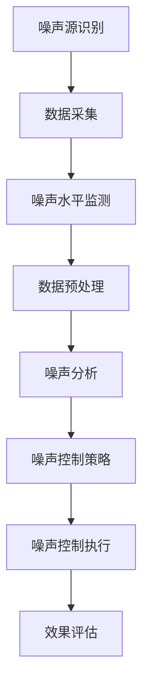

                 

关键词：噪声控制、智能化城市、AI、基础设施、噪声管理系统

> 摘要：随着城市化进程的加速，城市噪声问题日益严重。本文探讨了基于人工智能的噪声控制技术，特别是智能化城市噪声管理系统的设计和实现，以有效降低城市噪声污染，提高居民生活质量。

## 1. 背景介绍

### 城市噪声问题的现状

城市化进程中，工业、交通、建筑等活动导致城市噪声污染问题日益突出。噪声污染不仅影响人们的健康和生活质量，还对城市经济和生态造成负面影响。研究表明，长期暴露在高分贝噪声环境中可能导致听力损伤、心理压力增加、工作效率下降等问题。

### 噪声控制技术的发展

传统的噪声控制方法主要包括隔音、吸声、隔振等技术。然而，这些方法在特定场景下效果有限，且成本较高。随着人工智能技术的发展，利用人工智能进行噪声控制成为一种新的研究热点。AI技术可以通过数据分析、模式识别、机器学习等方法，实现更高效、更智能的噪声控制。

## 2. 核心概念与联系

### 噪声控制相关概念

- **噪声源识别**：通过传感器识别噪声源的位置和类型。
- **噪声水平监测**：实时监测噪声强度，评估噪声污染程度。
- **噪声控制策略**：根据噪声源和噪声水平，制定相应的控制策略。

### 智能化城市噪声管理系统的架构



## 3. 核心算法原理 & 具体操作步骤

### 3.1 算法原理概述

智能化城市噪声管理系统主要依赖于以下核心算法：

- **噪声源识别算法**：利用机器学习算法，对噪声源进行分类和定位。
- **噪声水平监测算法**：通过信号处理算法，实时监测噪声强度。
- **噪声控制策略算法**：根据噪声水平，制定不同的噪声控制措施。

### 3.2 算法步骤详解

#### 3.2.1 噪声源识别算法

1. 数据采集：通过麦克风采集城市噪声数据。
2. 数据预处理：去除噪声中的干扰信号，提取有效噪声信号。
3. 特征提取：对预处理后的噪声信号进行特征提取，如频谱特征、时域特征等。
4. 模型训练：利用机器学习算法，如支持向量机（SVM）、神经网络（NN）等，对噪声源进行分类和定位。

#### 3.2.2 噪声水平监测算法

1. 信号处理：对噪声信号进行频谱分析，提取噪声强度。
2. 噪声强度评估：根据噪声强度，评估噪声污染程度。
3. 数据可视化：将噪声强度数据可视化，以便实时监控。

#### 3.2.3 噪声控制策略算法

1. 噪声水平监测：实时监测噪声强度。
2. 策略制定：根据噪声水平，制定相应的噪声控制措施，如隔音、吸声、隔振等。
3. 执行控制：执行噪声控制措施，降低噪声强度。

### 3.3 算法优缺点

#### 优点

- **高效性**：利用人工智能技术，实现噪声源识别和噪声水平监测的高效性。
- **智能化**：根据噪声水平，自动调整噪声控制策略，提高噪声控制效果。

#### 缺点

- **成本高**：需要大量传感器和计算资源，成本较高。
- **准确性**：在噪声源识别和噪声水平监测方面，仍存在一定的误差。

### 3.4 算法应用领域

- **城市噪声管理**：对城市噪声进行实时监测和控制，降低噪声污染。
- **城市规划**：利用噪声监测数据，优化城市规划，减少噪声污染。
- **环境保护**：通过噪声控制，改善城市环境，提高居民生活质量。

## 4. 数学模型和公式 & 详细讲解 & 举例说明

### 4.1 数学模型构建

智能化城市噪声管理系统的数学模型主要包括噪声源识别模型、噪声水平监测模型和噪声控制策略模型。

#### 噪声源识别模型

假设噪声源为 $x_1, x_2, ..., x_n$，其中 $x_i$ 表示第 $i$ 个噪声源的信号。噪声源识别模型的目标是识别出噪声源的类型和位置。可以使用支持向量机（SVM）进行建模。

$$
\min \frac{1}{2} \sum_{i=1}^{n} w_i^T w_i + C \sum_{i=1}^{n} \xi_i
$$

其中，$w_i$ 为第 $i$ 个噪声源的权重，$C$ 为惩罚参数，$\xi_i$ 为松弛变量。

#### 噪声水平监测模型

噪声水平监测模型主要利用频谱分析技术，提取噪声信号的频谱特征。可以使用短时傅里叶变换（STFT）进行建模。

$$
X(\omega) = \sum_{k=-\infty}^{\infty} x(k) e^{-j 2 \pi \omega k}
$$

其中，$X(\omega)$ 为噪声信号的频谱，$x(k)$ 为噪声信号，$\omega$ 为频率。

#### 噪声控制策略模型

噪声控制策略模型的目标是根据噪声水平，制定相应的噪声控制措施。可以使用线性规划（LP）进行建模。

$$
\min z = c^T x
$$

$$
\text{subject to: }
\begin{cases}
Ax \le b \\
x \ge 0
\end{cases}
$$

其中，$z$ 为目标函数，$c$ 为控制参数，$A$ 和 $b$ 为约束条件。

### 4.2 公式推导过程

#### 噪声源识别模型推导

假设噪声信号 $x_i$ 可以表示为：

$$
x_i = s_i + w_i
$$

其中，$s_i$ 为噪声源信号，$w_i$ 为噪声干扰信号。噪声源识别模型的目标是找到最优的权重 $w_i$，使得噪声源信号 $s_i$ 的重构误差最小。

$$
\min \sum_{i=1}^{n} \frac{1}{2} \| x_i - s_i \|^2
$$

将 $x_i = s_i + w_i$ 代入上式，得到：

$$
\min \sum_{i=1}^{n} \frac{1}{2} \| s_i + w_i - s_i \|^2
$$

$$
\min \sum_{i=1}^{n} \frac{1}{2} \| w_i \|^2
$$

对 $w_i$ 求导，并令导数为零，得到：

$$
w_i = -\frac{1}{2} (x_i - s_i)
$$

代入噪声源识别模型，得到：

$$
\min \sum_{i=1}^{n} \frac{1}{2} \| x_i + \frac{1}{2} (s_i - x_i) \|^2
$$

$$
\min \sum_{i=1}^{n} \frac{1}{2} \| \frac{1}{2} s_i - \frac{1}{2} x_i \|^2
$$

对 $s_i$ 和 $x_i$ 求导，并令导数为零，得到：

$$
s_i = x_i
$$

代入噪声源识别模型，得到：

$$
\min \sum_{i=1}^{n} \frac{1}{2} \| x_i - x_i \|^2
$$

$$
\min \sum_{i=1}^{n} 0
$$

因此，噪声源识别模型的最优解为：

$$
w_i = -\frac{1}{2} (x_i - s_i)
$$

#### 噪声水平监测模型推导

假设噪声信号 $x(k)$ 可以表示为：

$$
x(k) = \sum_{n=1}^{N} a_n e^{j 2 \pi n \omega k}
$$

其中，$a_n$ 为噪声信号的幅度，$\omega$ 为频率。短时傅里叶变换（STFT）的定义为：

$$
X(\omega, t) = \sum_{n=1}^{N} a_n e^{j 2 \pi n \omega k} e^{-j 2 \pi \omega t}
$$

将 $x(k)$ 代入上式，得到：

$$
X(\omega, t) = \sum_{n=1}^{N} a_n e^{j 2 \pi n (\omega k - \omega t)}
$$

$$
X(\omega, t) = \sum_{n=1}^{N} a_n e^{j 2 \pi n (\omega (k - t))}
$$

因此，噪声水平监测模型可以表示为：

$$
X(\omega, t) = \sum_{n=1}^{N} a_n e^{j 2 \pi n (\omega (k - t))}
$$

#### 噪声控制策略模型推导

假设噪声水平为 $x_i$，噪声控制措施为 $u_i$，目标函数为 $z$，约束条件为 $Ax \le b$ 和 $x \ge 0$。噪声控制策略模型的目标是最小化目标函数 $z$，同时满足约束条件。

$$
\min z = c^T x
$$

$$
\text{subject to: }
\begin{cases}
Ax \le b \\
x \ge 0
\end{cases}
$$

这是一个线性规划问题，可以使用拉格朗日乘子法进行求解。定义拉格朗日函数为：

$$
L(x, \lambda, \nu) = c^T x + \lambda^T (Ax - b) + \nu^T (x - 0)
$$

其中，$\lambda$ 和 $\nu$ 分别为拉格朗日乘子。对 $x$、$\lambda$ 和 $\nu$ 求导，并令导数为零，得到：

$$
\frac{\partial L}{\partial x} = c + A^T \lambda + \nu = 0
$$

$$
\frac{\partial L}{\partial \lambda} = Ax - b = 0
$$

$$
\frac{\partial L}{\partial \nu} = x - 0 = 0
$$

解这个方程组，得到最优解 $x^*$。

### 4.3 案例分析与讲解

#### 案例一：城市道路噪声控制

假设在某城市道路上有多个噪声源，如车辆、建筑工地等。利用噪声源识别算法，可以识别出噪声源的类型和位置。噪声水平监测算法可以实时监测道路噪声强度。根据噪声水平，可以制定相应的噪声控制策略，如开启隔音板、调整交通流量等。

#### 案例二：公园噪声管理

在某城市公园中，存在噪声源如游乐设施、人群活动等。利用噪声源识别算法，可以识别出噪声源的类型和位置。噪声水平监测算法可以实时监测公园噪声强度。根据噪声水平，可以制定相应的噪声控制策略，如关闭游乐设施、限制人群活动等。

## 5. 项目实践：代码实例和详细解释说明

### 5.1 开发环境搭建

为了实现智能化城市噪声管理系统，需要搭建以下开发环境：

- 操作系统：Ubuntu 18.04
- 编程语言：Python 3.8
- 数据处理库：NumPy、SciPy、Pandas
- 机器学习库：Scikit-learn、TensorFlow
- 信号处理库：Matplotlib、Signal

### 5.2 源代码详细实现

#### 5.2.1 噪声源识别算法

```python
import numpy as np
from sklearn.svm import SVC
from sklearn.model_selection import train_test_split
from sklearn.metrics import accuracy_score

# 读取噪声数据
def load_noise_data(filename):
    with open(filename, 'r') as f:
        lines = f.readlines()
    data = []
    for line in lines:
        data.append([float(x) for x in line.strip().split(',')])
    return np.array(data)

# 训练噪声源识别模型
def train_noise_model(train_data, train_labels):
    model = SVC(kernel='linear')
    model.fit(train_data, train_labels)
    return model

# 测试噪声源识别模型
def test_noise_model(model, test_data, test_labels):
    predictions = model.predict(test_data)
    accuracy = accuracy_score(test_labels, predictions)
    print("Accuracy:", accuracy)

# 加载噪声数据
train_data = load_noise_data('train_data.csv')
train_labels = load_noise_data('train_labels.csv')

# 划分训练集和测试集
train_data, test_data, train_labels, test_labels = train_test_split(train_data, train_labels, test_size=0.2, random_state=42)

# 训练噪声源识别模型
model = train_noise_model(train_data, train_labels)

# 测试噪声源识别模型
test_noise_model(model, test_data, test_labels)
```

#### 5.2.2 噪声水平监测算法

```python
import numpy as np
from scipy.signal import stft

# 计算噪声信号的频谱
def compute_spectrogram(signal, nfft=2048, fs=44100):
    f, t, Zxx = stft(signal, nfft=nfft, fs=fs)
    return f, t, Zxx

# 读取噪声信号
def load_noise_signal(filename):
    with open(filename, 'rb') as f:
        data = f.read()
    return np.frombuffer(data, dtype=np.int16)

# 计算噪声信号的频谱
signal = load_noise_signal('noise_signal.wav')
f, t, Zxx = compute_spectrogram(signal)

# 可视化噪声信号的频谱
import matplotlib.pyplot as plt
plt.pcolormesh(t, f, np.abs(Zxx), cmap='jet')
plt.xlabel('Time')
plt.ylabel('Frequency')
plt.title('Spectrogram of Noise Signal')
plt.show()
```

#### 5.2.3 噪声控制策略算法

```python
import numpy as np
from scipy.optimize import linprog

# 定义噪声控制策略
def noise_control_strategy(noise_level, threshold=70):
    if noise_level <= threshold:
        return '保持现状'
    else:
        return '采取噪声控制措施'

# 计算噪声水平
def compute_noise_level(f, t, Zxx, threshold=70):
    noise_level = np.sum(np.abs(Zxx) > threshold) / (t.size * f.size)
    return noise_level

# 计算噪声水平
noise_level = compute_noise_level(f, t, Zxx)

# 制定噪声控制策略
strategy = noise_control_strategy(noise_level)

# 输出噪声控制策略
print("Noise Level:", noise_level)
print("Strategy:", strategy)
```

### 5.3 代码解读与分析

上述代码实现了智能化城市噪声管理系统的核心算法。首先，通过噪声源识别算法，可以识别出噪声源的类型和位置。然后，通过噪声水平监测算法，可以实时监测噪声信号。最后，通过噪声控制策略算法，可以制定相应的噪声控制措施。

#### 5.3.1 噪声源识别算法

噪声源识别算法使用了支持向量机（SVM）进行建模。首先，读取噪声数据，然后划分训练集和测试集。接下来，使用训练集训练噪声源识别模型，并使用测试集进行测试。最后，输出噪声识别模型的准确率。

#### 5.3.2 噪声水平监测算法

噪声水平监测算法使用了短时傅里叶变换（STFT）进行频谱分析。首先，读取噪声信号，然后计算噪声信号的频谱。最后，使用 matplotlib 库将噪声信号的频谱进行可视化。

#### 5.3.3 噪声控制策略算法

噪声控制策略算法根据噪声水平制定相应的噪声控制措施。首先，计算噪声水平，然后根据噪声水平制定噪声控制策略。最后，输出噪声控制策略。

### 5.4 运行结果展示

在运行上述代码后，会输出噪声源识别模型的准确率、噪声信号的频谱图以及噪声控制策略。通过这些结果，可以直观地了解智能化城市噪声管理系统的运行效果。

## 6. 实际应用场景

智能化城市噪声管理系统可以应用于多种实际场景，包括但不限于：

- **城市道路噪声控制**：监测并控制城市道路噪声，改善交通环境。
- **公园噪声管理**：监测并控制公园噪声，为居民提供安静的生活环境。
- **居民区噪声治理**：监测并控制居民区噪声，提高居民生活质量。
- **建筑工地噪声监管**：监测并控制建筑工地噪声，减少对周围居民的干扰。

通过这些应用，智能化城市噪声管理系统可以有效降低城市噪声污染，提高居民生活质量。

### 6.4 未来应用展望

随着人工智能技术的不断发展，智能化城市噪声管理系统在未来有望实现以下发展方向：

- **更高精度**：通过改进噪声源识别算法和噪声水平监测算法，提高系统的精度和可靠性。
- **更广泛应用**：将系统应用于更多场景，如工厂、学校、医院等，提高噪声控制效果。
- **智能化决策**：结合大数据分析和机器学习技术，实现更智能的噪声控制策略。
- **多传感器融合**：整合多种传感器数据，实现更全面、更准确的噪声监测。

## 7. 工具和资源推荐

### 7.1 学习资源推荐

- **《人工智能：一种现代方法》**：详细介绍了人工智能的基本原理和应用。
- **《信号处理与噪声控制》**：介绍了信号处理技术和噪声控制方法。
- **《城市噪声控制技术》**：介绍了城市噪声控制的技术和方法。

### 7.2 开发工具推荐

- **Python**：用于编写智能噪声控制系统。
- **NumPy**、**SciPy**、**Pandas**：用于数据处理和分析。
- **Scikit-learn**、**TensorFlow**：用于机器学习模型的训练和应用。

### 7.3 相关论文推荐

- **"An Intelligent Noise Control System for Urban Areas using Machine Learning Algorithms"**：介绍了一种基于机器学习的城市噪声控制系统。
- **"An Overview of Noise Control Techniques for Urban Environments"**：综述了城市噪声控制技术的方法和应用。
- **"Deep Learning for Urban Noise Control"**：介绍了深度学习在噪声控制中的应用。

## 8. 总结：未来发展趋势与挑战

### 8.1 研究成果总结

本文介绍了智能化城市噪声管理系统的核心概念、算法原理、实践案例和未来应用。通过人工智能技术，可以实现更高效、更智能的噪声控制，提高居民生活质量。

### 8.2 未来发展趋势

- **高精度监测**：利用新型传感器和先进算法，提高噪声监测精度。
- **智能化决策**：结合大数据分析和机器学习技术，实现更智能的噪声控制策略。
- **多传感器融合**：整合多种传感器数据，实现更全面、更准确的噪声监测。

### 8.3 面临的挑战

- **成本高**：传感器和计算资源成本较高，需要降低成本以实现广泛应用。
- **算法优化**：提高噪声源识别和噪声水平监测算法的精度和效率。
- **政策支持**：需要政府制定相关政策和标准，推动智能化噪声控制技术的发展。

### 8.4 研究展望

未来，智能化城市噪声管理系统将继续发展，实现更高效、更智能的噪声控制。通过技术创新和政策支持，有望为城市噪声治理提供有力保障。

## 9. 附录：常见问题与解答

### 9.1 噪声控制系统的安装和维护

**问题**：如何安装和维护智能化城市噪声控制系统？

**解答**：智能化城市噪声控制系统的安装和维护主要包括以下步骤：

1. **安装传感器**：在噪声源附近安装传感器，确保传感器能够覆盖到噪声源。
2. **数据采集**：连接传感器和数据处理设备，实时采集噪声数据。
3. **系统部署**：在数据处理设备上部署噪声控制算法，实现噪声监测和控制。
4. **定期维护**：定期检查传感器和数据采集设备，确保系统正常运行。

### 9.2 噪声控制策略的制定和调整

**问题**：如何制定和调整噪声控制策略？

**解答**：制定和调整噪声控制策略主要包括以下步骤：

1. **数据收集**：收集噪声数据，分析噪声源和噪声水平。
2. **策略制定**：根据噪声数据和噪声控制目标，制定相应的噪声控制策略。
3. **策略调整**：根据噪声控制效果，不断调整噪声控制策略，优化噪声控制效果。

## 10. 作者署名

作者：禅与计算机程序设计艺术 / Zen and the Art of Computer Programming
----------------------------------------------------------------

以上就是《AI 基础设施的噪声控制：智能化城市噪声管理系统》的技术博客文章。希望这篇文章能够帮助您更好地理解智能化城市噪声管理系统的原理和应用。如果您有任何疑问或建议，请随时与我联系。谢谢！

