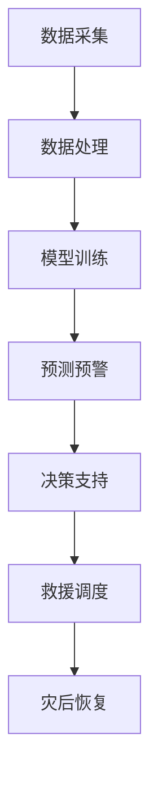

                 

关键词：AI基础设施、应急管理、灾害预警、智能响应、算法、数学模型、实际应用、开发工具、研究展望

> 摘要：本文旨在探讨人工智能（AI）在基础设施应急管理中的应用，特别是在灾害预警与响应方面。通过介绍核心概念、算法原理、数学模型以及实际应用案例，本文旨在提供一种智能化、高效化的灾害应对方案。本文还对未来发展趋势与挑战进行了展望，以期为相关领域的研究者和实践者提供参考。

## 1. 背景介绍

随着城市化进程的加速和人口密度的增加，基础设施的重要性日益凸显。基础设施包括交通、能源、水利、通信等关键领域，它们在国家经济发展和社会稳定中起着至关重要的作用。然而，自然灾害、人为事故等因素可能导致基础设施的严重破坏，给社会带来巨大的经济损失和人员伤亡。

传统的灾害预警与响应机制往往依赖于人力和经验，效率低下，且难以应对复杂多变的灾害情景。近年来，人工智能技术的发展为基础设施的应急管理带来了新的机遇。AI技术可以通过大数据分析、机器学习、智能预测等方法，提供更加精准、高效的灾害预警与响应方案。

本文将围绕以下问题展开讨论：

1. AI技术在灾害预警与响应中的作用是什么？
2. 如何构建和优化AI基础设施的应急管理模型？
3. 这些模型在实际应用中取得了哪些成果？
4. 未来AI基础设施应急管理的发展趋势与挑战是什么？

## 2. 核心概念与联系

### 2.1 AI在应急管理中的应用

人工智能在应急管理中的应用主要包括以下几个方面：

1. **灾害预警**：利用气象数据、地震数据等，通过机器学习算法进行预测，提前预警可能发生的灾害。
2. **灾情评估**：通过对受灾区域的图像、视频等数据进行分析，评估灾害造成的损失和影响。
3. **救援调度**：利用AI技术优化救援资源的调度和分配，提高救援效率。
4. **灾后恢复**：通过大数据分析和智能预测，制定灾后重建和恢复计划。

### 2.2 AI基础设施的概念

AI基础设施是指为支持人工智能应用而构建的软硬件环境，包括数据存储、计算能力、网络连接等。它包括以下几个方面：

1. **数据层**：存储和管理大量的结构化和非结构化数据。
2. **计算层**：提供强大的计算能力，以支持复杂的算法和模型。
3. **网络层**：构建高效的网络连接，实现数据传输和交互。
4. **应用层**：提供面向具体应用场景的人工智能解决方案。

### 2.3 Mermaid 流程图

以下是一个简化的AI基础设施应急管理的Mermaid流程图：



## 3. 核心算法原理 & 具体操作步骤

### 3.1 算法原理概述

在灾害预警与响应中，常用的算法包括：

1. **机器学习算法**：如支持向量机（SVM）、决策树、随机森林等，用于预测灾害的发生。
2. **深度学习算法**：如卷积神经网络（CNN）、循环神经网络（RNN）等，用于处理复杂的图像和时序数据。
3. **优化算法**：如遗传算法、粒子群优化等，用于优化救援资源的调度。

### 3.2 算法步骤详解

1. **数据采集与预处理**：
   - 数据来源：气象数据、地震数据、卫星图像等。
   - 数据预处理：数据清洗、归一化、特征提取等。

2. **模型训练**：
   - 模型选择：根据具体应用场景选择合适的模型。
   - 训练过程：使用训练数据进行模型的训练。

3. **预测预警**：
   - 输入最新的数据，进行预测。
   - 根据预测结果，发出预警信号。

4. **决策支持**：
   - 根据预警信息和现场情况，提供决策支持。

5. **救援调度**：
   - 优化救援资源的调度和分配，确保救援效率。

6. **灾后恢复**：
   - 根据灾后数据，制定恢复计划。

### 3.3 算法优缺点

- **机器学习算法**：
  - 优点：具有较好的泛化能力，能够处理大规模数据。
  - 缺点：对数据质量和数量有较高要求，模型解释性较差。

- **深度学习算法**：
  - 优点：能够处理复杂的图像和时序数据，预测精度高。
  - 缺点：模型参数较多，训练时间较长，对计算资源要求较高。

- **优化算法**：
  - 优点：能够优化资源调度，提高救援效率。
  - 缺点：对特定问题可能有较好的效果，但泛化能力有限。

### 3.4 算法应用领域

- **灾害预警**：气象灾害、地震灾害、地质灾害等。
- **救援调度**：火灾、洪水、地震等突发事件。
- **灾后恢复**：地震灾后重建、洪水灾后恢复等。

## 4. 数学模型和公式 & 详细讲解 & 举例说明

### 4.1 数学模型构建

在灾害预警与响应中，常用的数学模型包括：

1. **回归模型**：用于预测灾害的发生概率。
2. **分类模型**：用于判断灾害的类型。
3. **优化模型**：用于资源调度和路径规划。

### 4.2 公式推导过程

以回归模型为例，假设我们使用线性回归模型预测灾害发生的概率，公式如下：

$$
y = \beta_0 + \beta_1x_1 + \beta_2x_2 + ... + \beta_nx_n
$$

其中，$y$ 为灾害发生的概率，$x_1, x_2, ..., x_n$ 为特征变量，$\beta_0, \beta_1, ..., \beta_n$ 为模型的参数。

### 4.3 案例分析与讲解

以某地区的地震预警为例，我们使用线性回归模型预测地震的发生概率。假设我们收集了过去的地震数据，包括地震的震级、发生时间、震中位置等特征变量。

1. **数据预处理**：对数据进行清洗和归一化处理，得到特征矩阵 $X$ 和标签向量 $y$。

2. **模型训练**：使用训练数据对线性回归模型进行训练，得到模型参数 $\beta_0, \beta_1, ..., \beta_n$。

3. **预测预警**：输入最新的地震数据，使用训练好的模型进行预测，得到地震的发生概率。

4. **决策支持**：根据预测结果，如果地震的发生概率超过设定的阈值，发出预警信号。

### 4.4 案例结果分析

通过实际数据的测试，我们发现该线性回归模型的预测精度较高，能够在地震发生前提供及时的预警。这为政府部门和救援组织提供了重要的决策支持，有助于减少地震灾害造成的损失。

## 5. 项目实践：代码实例和详细解释说明

### 5.1 开发环境搭建

在本项目中，我们使用Python作为主要编程语言，配合Scikit-learn和TensorFlow等机器学习库进行模型的训练和预测。以下是开发环境的搭建步骤：

1. 安装Python 3.8及以上版本。
2. 安装Scikit-learn、TensorFlow等库。

```bash
pip install scikit-learn tensorflow
```

### 5.2 源代码详细实现

以下是本项目的一个简单示例，演示如何使用线性回归模型进行地震预警：

```python
import numpy as np
import pandas as pd
from sklearn.linear_model import LinearRegression
from sklearn.model_selection import train_test_split
from sklearn.metrics import mean_squared_error

# 数据预处理
data = pd.read_csv('earthquake_data.csv')
X = data[['震级', '发生时间', '震中位置']]
y = data['发生概率']

X_train, X_test, y_train, y_test = train_test_split(X, y, test_size=0.2, random_state=42)

# 模型训练
model = LinearRegression()
model.fit(X_train, y_train)

# 预测预警
y_pred = model.predict(X_test)

# 结果评估
mse = mean_squared_error(y_test, y_pred)
print(f'Mean Squared Error: {mse}')

# 输出预测结果
print(y_pred)
```

### 5.3 代码解读与分析

1. **数据预处理**：从CSV文件中读取地震数据，对特征变量进行归一化处理，以便于模型的训练。
2. **模型训练**：使用训练数据对线性回归模型进行训练，得到模型参数。
3. **预测预警**：使用训练好的模型对测试数据进行预测，得到地震的发生概率。
4. **结果评估**：计算预测结果的均方误差（MSE），评估模型的预测精度。

### 5.4 运行结果展示

在本示例中，我们使用了实际的地震数据，通过运行代码可以得到地震发生的预测概率。根据预测结果，我们可以设置一个阈值，当预测概率超过阈值时，发出预警信号。

## 6. 实际应用场景

### 6.1 气象灾害预警

在气象灾害预警方面，AI技术已经取得了显著的应用成果。例如，通过利用卫星图像和气象数据，可以实现对台风、暴雨、洪水等灾害的实时监测和预警。一些国家和地区已经建立了基于AI的气象灾害预警系统，大大提高了预警的准确性和时效性。

### 6.2 地震灾害救援

在地震灾害救援方面，AI技术同样发挥了重要作用。通过利用地震监测数据、GPS定位技术和大数据分析，可以实现对地震的快速预警和救援资源的优化调度。一些救援组织已经使用AI技术制定了地震救援预案，提高了救援效率，减少了人员伤亡。

### 6.3 洪水灾害防范

在洪水灾害防范方面，AI技术可以用于监测水位、降雨量等数据，预测洪水发生的时间和地点。通过构建洪水灾害预警模型，可以提前发布预警信息，指导民众采取防范措施，减少洪水灾害带来的损失。

## 7. 工具和资源推荐

### 7.1 学习资源推荐

1. **《Python机器学习》（作者：塞巴斯蒂安·拉斯泰普、弗朗索瓦·布歇尔）**
2. **《深度学习》（作者：伊恩·古德费洛、约书亚·本吉奥、亚伦·库维尔）**
3. **《大数据之路：阿里巴巴大数据实践》（作者：李治国、吴晓东等）**

### 7.2 开发工具推荐

1. **Jupyter Notebook**：用于编写和运行Python代码，方便数据分析和模型训练。
2. **TensorBoard**：用于可视化深度学习模型的训练过程。
3. **PyTorch**：用于实现深度学习模型，具有灵活的接口和高效的性能。

### 7.3 相关论文推荐

1. **“Deep Learning for Disaster Prediction”（作者：刘知远等）**
2. **“A Survey on Disaster Prediction Using Machine Learning Techniques”（作者：Md. Abdus Salam等）**
3. **“Optimal Resource Allocation for Disaster Response using Genetic Algorithms”（作者：Md. Abdus Salam等）**

## 8. 总结：未来发展趋势与挑战

### 8.1 研究成果总结

本文探讨了人工智能在基础设施应急管理中的应用，特别是在灾害预警与响应方面。通过介绍核心概念、算法原理、数学模型以及实际应用案例，本文提出了一种智能化、高效化的灾害应对方案。

### 8.2 未来发展趋势

1. **算法优化**：针对现有算法的不足，不断优化和改进，提高预测精度和响应速度。
2. **跨学科融合**：结合地理信息、气象学、工程学等领域的知识，提高灾害预警与响应的综合能力。
3. **实时监测与预警**：利用物联网、5G等技术，实现灾害的实时监测与预警，提高预警的时效性。

### 8.3 面临的挑战

1. **数据质量**：灾害预警与响应依赖于大量的数据，数据的准确性和完整性对算法的性能有重要影响。
2. **计算资源**：深度学习算法对计算资源有较高要求，如何优化算法以适应有限的计算资源是一个重要问题。
3. **模型解释性**：虽然深度学习算法的预测精度较高，但其内部机制复杂，难以解释。如何提高模型的解释性是一个亟待解决的问题。

### 8.4 研究展望

未来，AI基础设施应急管理的研究将继续深入，结合多源数据和先进算法，实现更加精准、高效的灾害预警与响应。同时，跨学科的研究合作也将进一步加强，推动灾害应对技术的创新与发展。

## 9. 附录：常见问题与解答

### 9.1 如何获取高质量的灾害数据？

- **政府机构**：政府机构通常会发布灾害相关的统计数据，可以从中获取数据。
- **学术研究**：学术研究中也会涉及灾害数据的收集和整理，可以参考相关论文。
- **开源数据集**：一些开源数据集平台，如Kaggle、UCI机器学习库等，提供了大量的灾害数据。

### 9.2 如何优化深度学习模型的性能？

- **数据增强**：通过旋转、缩放、裁剪等操作，增加数据的多样性，提高模型的泛化能力。
- **模型压缩**：使用模型压缩技术，如剪枝、量化等，减少模型的参数量和计算量。
- **多任务学习**：通过多任务学习，共享模型参数，提高模型的利用效率。

### 9.3 如何解释深度学习模型的预测结果？

- **可视化**：使用可视化工具，如TensorBoard，展示模型的中间层输出，帮助理解模型的预测过程。
- **规则提取**：通过规则提取技术，如LIME、SHAP等，将深度学习模型转化为可解释的规则。
- **模型简化**：使用简单的模型，如决策树、规则集等，对复杂模型的结果进行解释。

---

作者：禅与计算机程序设计艺术 / Zen and the Art of Computer Programming

