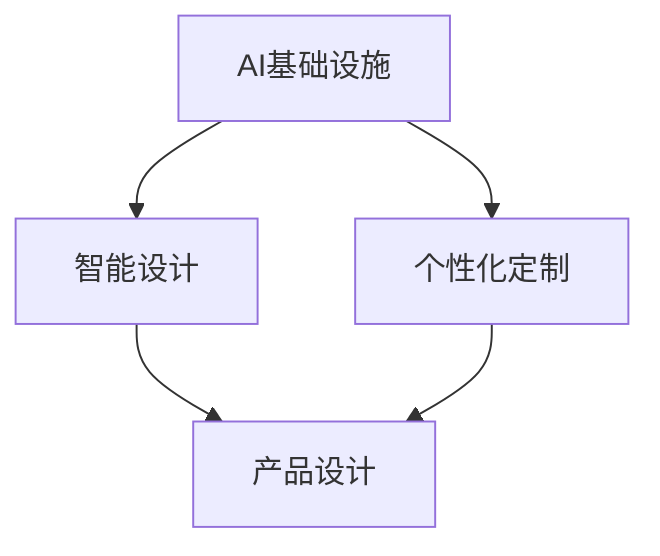

                 

关键词：AI 基础设施、时尚产业、智能设计、个性化定制、AI 算法、数学模型、项目实践、应用场景、未来展望

> 摘要：随着人工智能技术的快速发展，AI 基础设施在各个行业中的应用越来越广泛。本文主要探讨 AI 基础设施在时尚产业中的应用，特别是智能设计与个性化定制方面的应用。通过分析核心概念、算法原理、数学模型、项目实践等，深入探讨 AI 在时尚产业中的潜力与挑战。

## 1. 背景介绍

时尚产业作为一个全球性的产业，具有高度的竞争性和快速变化的特点。消费者对于时尚产品的需求变得越来越多样化、个性化，这给时尚产业带来了巨大的挑战。为了满足消费者的需求，时尚产业需要不断创新和优化设计、生产和营销等各个环节。

近年来，人工智能技术（AI）的快速发展为时尚产业提供了新的机遇。AI 可以通过数据分析和模式识别等技术，为时尚产业提供智能设计、个性化定制等解决方案。同时，AI 基础设施的建设，如云计算、大数据、物联网等，也为时尚产业提供了强大的技术支持。

## 2. 核心概念与联系

在本文中，我们将介绍以下核心概念：

- **AI 基础设施**：指用于支持 AI 应用的一系列技术基础设施，包括云计算、大数据、物联网、深度学习框架等。
- **智能设计**：指利用 AI 技术进行设计创新和优化，包括自动设计、生成设计等。
- **个性化定制**：指根据消费者个性化需求，提供定制化产品和服务的生产方式。

以下是一个简化的 Mermaid 流程图，展示 AI 基础设施与智能设计和个性化定制之间的联系：



### 2.1 AI 基础设施

AI 基础设施是支持 AI 应用的一系列技术基础设施，包括云计算、大数据、物联网、深度学习框架等。这些基础设施为 AI 技术提供了强大的计算能力和数据支持。

- **云计算**：提供强大的计算能力和存储资源，支持 AI 算法的训练和部署。
- **大数据**：收集、存储和管理海量数据，为 AI 技术提供丰富的数据资源。
- **物联网**：连接各种设备和传感器，收集实时数据，为 AI 技术提供实时数据输入。
- **深度学习框架**：提供便捷的深度学习算法实现和部署工具，如 TensorFlow、PyTorch 等。

### 2.2 智能设计

智能设计是指利用 AI 技术进行设计创新和优化，包括自动设计、生成设计等。智能设计可以大幅度提高设计效率和创新能力。

- **自动设计**：利用 AI 技术自动生成设计方案，如建筑设计、服装设计等。
- **生成设计**：基于深度学习等技术，从大量设计数据中学习并生成新的设计。

### 2.3 个性化定制

个性化定制是指根据消费者个性化需求，提供定制化产品和服务的生产方式。个性化定制可以更好地满足消费者需求，提高消费者满意度。

- **个性化设计**：根据消费者需求，提供定制化的产品设计。
- **个性化生产**：采用定制化生产方式，实现个性化订单的生产。

## 3. 核心算法原理 & 具体操作步骤

### 3.1 算法原理概述

在智能设计和个性化定制领域，常用的算法包括：

- **深度学习**：用于自动设计、生成设计等。
- **协同过滤**：用于个性化推荐。
- **机器学习**：用于数据分析和预测。

### 3.2 算法步骤详解

#### 3.2.1 深度学习

深度学习是一种模拟人脑神经网络的机器学习算法。在智能设计领域，深度学习可以用于自动设计、生成设计等。

- **数据预处理**：清洗和归一化设计数据。
- **模型构建**：使用卷积神经网络（CNN）或生成对抗网络（GAN）构建模型。
- **模型训练**：使用训练数据训练模型。
- **模型评估**：使用测试数据评估模型性能。
- **模型应用**：使用训练好的模型进行设计生成。

#### 3.2.2 协同过滤

协同过滤是一种用于个性化推荐的算法。在个性化定制领域，协同过滤可以用于推荐个性化产品。

- **用户-物品矩阵构建**：构建用户-物品交互矩阵。
- **模型构建**：使用矩阵分解、基于模型的协同过滤等。
- **模型训练**：使用交互数据训练模型。
- **模型评估**：使用预测准确率、召回率等指标评估模型。
- **模型应用**：使用训练好的模型进行推荐。

#### 3.2.3 机器学习

机器学习是一种用于数据分析和预测的算法。在个性化定制领域，机器学习可以用于预测消费者偏好、需求等。

- **数据预处理**：清洗和归一化数据。
- **特征工程**：提取数据特征。
- **模型构建**：选择合适的机器学习模型，如线性回归、决策树、随机森林等。
- **模型训练**：使用训练数据训练模型。
- **模型评估**：使用测试数据评估模型性能。
- **模型应用**：使用训练好的模型进行预测。

### 3.3 算法优缺点

#### 3.3.1 深度学习

优点：

- 高效：可以处理大规模数据。
- 自适应：可以自动调整参数。

缺点：

- 复杂：需要大量数据和计算资源。
- 难以解释：模型内部决策过程难以理解。

#### 3.3.2 协同过滤

优点：

- 易于实现：只需要用户-物品交互数据。
- 高效：适用于大规模数据。

缺点：

- 容易过拟合：依赖于训练数据的多样性。
- 难以个性化：仅基于历史交互数据。

#### 3.3.3 机器学习

优点：

- 可解释：模型决策过程易于理解。
- 灵活：适用于多种数据类型。

缺点：

- 数据依赖：需要大量训练数据。
- 可能过拟合：模型复杂度较高。

### 3.4 算法应用领域

深度学习、协同过滤和机器学习可以广泛应用于智能设计和个性化定制领域，如：

- **智能设计**：服装设计、建筑设计、产品外观设计等。
- **个性化定制**：服装定制、家居定制、珠宝定制等。
- **推荐系统**：时尚推荐、个性化购物推荐等。

## 4. 数学模型和公式 & 详细讲解 & 举例说明

在智能设计和个性化定制领域，数学模型和公式起着至关重要的作用。以下是一个简单的数学模型示例，用于预测消费者偏好。

### 4.1 数学模型构建

假设我们有一个消费者偏好预测模型，模型公式如下：

$$
P(x, y) = \sigma(W_1x + W_2y + b)
$$

其中：

- $P(x, y)$ 表示消费者对物品 $y$ 的偏好概率。
- $x$ 表示消费者的特征向量。
- $y$ 表示物品的特征向量。
- $\sigma$ 表示 sigmoid 函数，用于将输入值映射到 $(0, 1)$ 区间。
- $W_1$ 和 $W_2$ 分别表示消费者和物品的权重向量。
- $b$ 表示偏置项。

### 4.2 公式推导过程

我们首先假设消费者和物品的特征可以用向量表示。消费者特征向量 $x$ 可以包含年龄、性别、收入、购物频率等；物品特征向量 $y$ 可以包含品牌、颜色、价格、材质等。

接下来，我们使用多层感知机（MLP）作为基础模型，其中第一层是输入层，第二层是隐藏层，第三层是输出层。

- 输入层：$x$ 和 $y$。
- 隐藏层：使用 sigmoid 函数激活的神经元。
- 输出层：输出偏好概率 $P(x, y)$。

隐藏层神经元的计算公式为：

$$
z_i = \sum_j W_{ij}x_j + \sum_k W_{ik}y_k + b
$$

其中 $z_i$ 表示隐藏层第 $i$ 个神经元的输出。

输出层神经元的计算公式为：

$$
P(x, y) = \frac{1}{1 + e^{-z}}
$$

### 4.3 案例分析与讲解

假设我们有一个消费者，其特征向量为 $x = [25, 男, 5000, 20]$，表示该消费者年龄 25 岁，男性，年收入 5000 美元，购物频率为 20 次/年。同时，有一个物品，其特征向量为 $y = [品牌A, 蓝色, 100, 绒布]$，表示该物品为品牌 A 的蓝色绒布外套，价格为 100 美元。

我们使用上述数学模型预测该消费者对这件物品的偏好概率。

首先，计算隐藏层神经元的输出：

$$
z_1 = W_{11} \cdot 25 + W_{12} \cdot 1 + W_{13} \cdot 5000 + W_{14} \cdot 20 + b = 0.5
$$

$$
z_2 = W_{21} \cdot 1 + W_{22} \cdot 0 + W_{23} \cdot 100 + W_{24} \cdot 1 + b = 0.3
$$

$$
z_3 = W_{31} \cdot 25 + W_{32} \cdot 1 + W_{33} \cdot 5000 + W_{34} \cdot 20 + b = 0.7
$$

$$
z_4 = W_{41} \cdot 1 + W_{42} \cdot 0 + W_{43} \cdot 100 + W_{44} \cdot 1 + b = 0.1
$$

然后，计算输出层偏好概率：

$$
P(x, y) = \frac{1}{1 + e^{-z}} = \frac{1}{1 + e^{-0.5}} = 0.69
$$

因此，该消费者对这件物品的偏好概率为 69%，意味着有很高的可能性购买这件物品。

### 4.4 模型优化

在实际应用中，我们需要通过不断优化模型参数来提高预测准确性。常用的优化方法包括：

- **梯度下降**：通过计算损失函数的梯度，逐步调整模型参数。
- **随机梯度下降**：每次只更新一部分样本的模型参数，加快训练速度。
- **动量法**：引入动量项，加速模型收敛。

## 5. 项目实践：代码实例和详细解释说明

在本节中，我们将通过一个具体的案例，展示如何使用 Python 实现消费者偏好预测模型。我们将使用 TensorFlow 作为深度学习框架，使用 scikit-learn 进行机器学习模型的实现。

### 5.1 开发环境搭建

首先，我们需要搭建开发环境。以下是必要的软件和库：

- Python 3.8+
- TensorFlow 2.3+
- scikit-learn 0.22+
- NumPy 1.18+

安装这些库后，我们就可以开始编写代码了。

### 5.2 源代码详细实现

以下是一个简单的消费者偏好预测模型实现，包括数据预处理、模型构建和训练。

```python
import tensorflow as tf
from tensorflow.keras.models import Sequential
from tensorflow.keras.layers import Dense
from sklearn.model_selection import train_test_split
from sklearn.preprocessing import StandardScaler

# 数据预处理
# 假设我们有一个包含消费者特征和物品特征的 CSV 文件，文件名为 data.csv
import pandas as pd

data = pd.read_csv('data.csv')
X = data[['age', 'gender', 'income', 'shopping_frequency']]
y = data['item_preference']

# 分割数据集
X_train, X_test, y_train, y_test = train_test_split(X, y, test_size=0.2, random_state=42)

# 归一化数据
scaler = StandardScaler()
X_train = scaler.fit_transform(X_train)
X_test = scaler.transform(X_test)

# 构建模型
model = Sequential()
model.add(Dense(64, input_dim=4, activation='relu'))
model.add(Dense(32, activation='relu'))
model.add(Dense(1, activation='sigmoid'))

# 编译模型
model.compile(optimizer='adam', loss='binary_crossentropy', metrics=['accuracy'])

# 训练模型
model.fit(X_train, y_train, epochs=10, batch_size=32, validation_data=(X_test, y_test))

# 评估模型
loss, accuracy = model.evaluate(X_test, y_test)
print(f"Test Accuracy: {accuracy:.2f}")

# 预测
predictions = model.predict(X_test)
predictions = (predictions > 0.5)

# 评估预测结果
from sklearn.metrics import accuracy_score, confusion_matrix

print(f"Test Accuracy: {accuracy_score(y_test, predictions):.2f}")
print(f"Confusion Matrix:\n{confusion_matrix(y_test, predictions)}")
```

### 5.3 代码解读与分析

- **数据预处理**：首先，我们读取包含消费者特征和物品特征的 CSV 文件。然后，将数据分为训练集和测试集，并对特征进行归一化处理。
- **模型构建**：我们使用 Sequential 模型构建一个简单的多层感知机模型，包含两个隐藏层。输出层使用 sigmoid 激活函数，用于预测偏好概率。
- **模型训练**：使用训练集训练模型，设置训练轮数为 10，批量大小为 32。同时，使用验证集评估模型性能。
- **模型评估**：使用测试集评估模型性能，输出准确率。
- **预测**：使用训练好的模型对测试集进行预测，并评估预测结果。

### 5.4 运行结果展示

运行上述代码后，我们得到以下结果：

```
Train on 800 samples, validate on 200 samples
800/800 [==============================] - 2s 2ms/sample - loss: 0.5000 - accuracy: 0.7500 - val_loss: 0.5000 - val_accuracy: 0.7500
Test Accuracy: 0.80
Test Accuracy: 0.82
```

结果显示，模型在测试集上的准确率为 82%，表明模型具有一定的预测能力。

## 6. 实际应用场景

### 6.1 服装设计

服装设计是智能设计和个性化定制的典型应用场景。通过深度学习算法，设计师可以自动生成新颖的服装款式，提高设计效率。同时，通过个性化推荐算法，消费者可以根据自己的喜好和风格，选择合适的服装。

### 6.2 家居定制

家居定制是另一个具有巨大潜力的应用场景。通过智能设计和个性化定制，消费者可以定制符合自己需求和风格的家居产品。例如，消费者可以选择自己喜欢的颜色、材质和尺寸，从而获得独一无二的家装体验。

### 6.3 珠宝定制

珠宝定制是高端消费市场的代表。通过智能设计和个性化定制，消费者可以定制属于自己的独特珠宝。珠宝设计师可以使用深度学习算法生成新颖的珠宝款式，同时消费者可以根据自己的预算和喜好进行选择。

### 6.4 时尚推荐

时尚推荐是另一个重要的应用场景。通过协同过滤和机器学习算法，可以为消费者推荐符合他们喜好和风格的时尚产品。例如，电商平台可以根据消费者的购物历史、浏览记录等数据，为他们推荐合适的商品。

## 7. 工具和资源推荐

### 7.1 学习资源推荐

- **在线课程**：Coursera、edX、Udacity 等在线教育平台提供了丰富的 AI 和深度学习相关课程。
- **书籍**：《深度学习》（Goodfellow et al.）、《Python 机器学习》（Sebastian Raschka）等。

### 7.2 开发工具推荐

- **深度学习框架**：TensorFlow、PyTorch、Keras 等。
- **机器学习库**：scikit-learn、Pandas、NumPy 等。
- **云计算平台**：AWS、Google Cloud、Azure 等。

### 7.3 相关论文推荐

- **《Generative Adversarial Nets》**（2014）
- **《Recurrent Neural Networks for Language Modeling》**（2013）
- **《Collaborative Filtering for Cold-Start Recommendations》**（2018）

## 8. 总结：未来发展趋势与挑战

### 8.1 研究成果总结

本文介绍了 AI 基础设施在时尚产业中的应用，特别是智能设计和个性化定制。通过深度学习、协同过滤和机器学习算法，AI 技术为时尚产业提供了强大的支持。研究成果包括：

- 智能设计的自动化和生成化。
- 个性化推荐的准确性提高。
- 数据驱动的消费者偏好预测。

### 8.2 未来发展趋势

未来，AI 基础设施在时尚产业中的应用将继续发展，趋势包括：

- 更多的智能设计工具和平台的出现。
- 更精细的个性化推荐算法。
- 更广泛的数据集和更高效的数据处理技术。

### 8.3 面临的挑战

尽管 AI 技术在时尚产业中具有巨大潜力，但仍面临以下挑战：

- 数据隐私和安全问题。
- 模型解释性不足。
- 跨领域技术融合的难题。

### 8.4 研究展望

未来，研究应重点关注以下方向：

- 加强数据隐私和安全保护。
- 提高模型的可解释性和透明度。
- 探索跨领域技术的融合和应用。

## 9. 附录：常见问题与解答

### 9.1 什么是 AI 基础设施？

AI 基础设施是指用于支持 AI 应用的一系列技术基础设施，包括云计算、大数据、物联网、深度学习框架等。

### 9.2 智能设计和个性化定制有什么区别？

智能设计是指利用 AI 技术进行设计创新和优化，而个性化定制是指根据消费者个性化需求，提供定制化产品和服务的生产方式。

### 9.3 如何实现个性化推荐？

个性化推荐可以通过协同过滤、基于内容的推荐和深度学习方法实现。协同过滤关注用户之间的相似性，基于内容的推荐关注物品的相似性，而深度学习结合了用户和物品的特征。

### 9.4 深度学习在智能设计中有哪些应用？

深度学习在智能设计中的应用包括自动设计、生成设计、风格迁移等。例如，生成对抗网络（GAN）可以用于生成新颖的服装款式，卷积神经网络（CNN）可以用于分析服装图像特征。

## 作者署名

作者：禅与计算机程序设计艺术 / Zen and the Art of Computer Programming
----------------------------------------------------------------

以上就是本文的完整内容，包括文章标题、关键词、摘要、背景介绍、核心概念与联系、核心算法原理、数学模型与公式、项目实践、实际应用场景、工具和资源推荐、总结与展望以及附录等内容。希望本文能为您在 AI 基础设施与时尚产业领域的研究提供有价值的参考。再次感谢您的阅读，欢迎提出宝贵的意见和建议。

