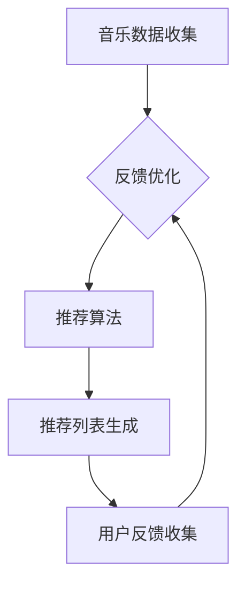

                 

关键词：人工智能，智能作曲，音乐产业，个性化推荐，AI 基础设施

音乐产业是创意产业的代表之一，随着互联网和数字技术的飞速发展，传统音乐产业正面临着前所未有的变革。人工智能（AI）作为当今最具潜力的技术之一，正在音乐产业中扮演着越来越重要的角色。本文将探讨AI基础设施在音乐产业中的应用，特别是智能作曲与个性化推荐技术，以及它们对音乐创作、传播和消费的影响。

## 1. 背景介绍

音乐产业一直是文化产业的重要组成部分，其市场规模和影响力在全球范围内都占有重要地位。然而，随着数字音乐的普及和流媒体平台的崛起，传统音乐产业面临着一系列挑战。例如，音乐版权问题、市场分散化、消费者需求变化等。这些问题迫使音乐产业必须寻找新的发展模式和解决方案。

人工智能技术的崛起，为音乐产业带来了新的机遇。通过深度学习、自然语言处理、数据挖掘等技术，AI可以在音乐创作、推荐、版权管理等多个环节发挥重要作用。智能作曲和个性化推荐技术就是其中最具代表性的应用之一。

### 1.1 音乐产业的现状

- **市场规模**：根据市场调研公司的数据，全球数字音乐市场正在持续增长，预计到2025年将达到数十亿美元。
- **版权问题**：音乐版权纠纷一直是音乐产业的痛点，随着数字音乐的发展，版权保护变得更加复杂。
- **消费者需求**：现代消费者对于音乐的需求更加多样化，他们追求个性化的音乐体验。

### 1.2 人工智能技术的发展

- **深度学习**：深度学习是人工智能的核心技术之一，它通过模拟人脑神经网络结构，实现图像、语音、文本等数据的处理和分析。
- **自然语言处理**：自然语言处理（NLP）是人工智能的重要分支，它致力于让计算机理解和生成人类语言。
- **数据挖掘**：数据挖掘是通过算法从大量数据中发现有用信息和知识的过程。

## 2. 核心概念与联系

### 2.1 智能作曲

智能作曲是指利用人工智能技术创作音乐的过程。智能作曲系统通常包括以下核心模块：

- **音乐生成模型**：如深度神经网络、生成对抗网络（GAN）等，用于生成音乐片段。
- **音乐风格分类**：通过分析大量音乐数据，对音乐风格进行分类，为智能创作提供风格参考。
- **用户喜好分析**：利用用户行为数据和推荐算法，分析用户喜好，为创作个性化音乐提供依据。

### 2.2 个性化推荐

个性化推荐是指根据用户的兴趣、行为和历史数据，为用户推荐他们可能喜欢的音乐内容。个性化推荐系统通常包括以下核心模块：

- **用户画像**：通过分析用户行为数据，构建用户画像。
- **推荐算法**：如协同过滤、基于内容的推荐、混合推荐等，用于生成推荐列表。
- **推荐评估**：通过用户反馈和推荐效果评估，优化推荐系统。

### 2.3 Mermaid 流程图



## 3. 核心算法原理 & 具体操作步骤

### 3.1 算法原理概述

智能作曲和个性化推荐技术都基于深度学习和数据挖掘算法。深度学习通过神经网络模型从大量数据中学习特征和模式，用于音乐生成和推荐。数据挖掘则通过分析用户行为数据，发现用户兴趣和偏好，用于构建用户画像和推荐系统。

### 3.2 算法步骤详解

#### 3.2.1 智能作曲

1. **数据收集**：收集大量音乐数据，包括不同风格、流派和类型的音乐。
2. **特征提取**：对音乐数据进行分析，提取旋律、节奏、和弦等特征。
3. **模型训练**：使用深度学习模型，如生成对抗网络（GAN），对特征数据进行训练。
4. **音乐生成**：使用训练好的模型，生成新的音乐片段。

#### 3.2.2 个性化推荐

1. **用户画像构建**：通过分析用户行为数据，如播放记录、收藏夹、评分等，构建用户画像。
2. **推荐算法**：选择合适的推荐算法，如协同过滤、基于内容的推荐等，生成推荐列表。
3. **推荐评估**：通过用户反馈和推荐效果评估，优化推荐系统。

### 3.3 算法优缺点

#### 3.3.1 智能作曲

**优点**：可以创作出新颖、独特的音乐作品，满足用户个性化需求。

**缺点**：创作出的音乐可能缺乏人类情感和创造力，难以达到专业音乐家的水平。

#### 3.3.2 个性化推荐

**优点**：可以提供高度个性化的音乐推荐，提高用户满意度。

**缺点**：推荐结果可能过于依赖历史数据和算法，缺乏创新和多样性。

### 3.4 算法应用领域

智能作曲和个性化推荐技术可以广泛应用于音乐创作、音乐推荐、音乐版权管理等多个领域。

## 4. 数学模型和公式 & 详细讲解 & 举例说明

### 4.1 数学模型构建

#### 4.1.1 智能作曲

- **生成对抗网络（GAN）**：GAN由生成器和判别器两个神经网络组成。生成器试图生成逼真的音乐片段，判别器则判断音乐片段是否真实。通过训练，生成器逐渐提高生成质量。

- **协同过滤**：协同过滤是一种基于用户行为的推荐算法。它通过分析用户的历史行为，如播放记录、收藏夹等，为用户推荐类似的音乐。

#### 4.1.2 个性化推荐

- **用户画像**：用户画像是一种基于用户行为和特征的描述，用于构建用户偏好模型。

- **推荐算法**：推荐算法有多种类型，如基于内容的推荐、协同过滤等。每种算法都有其数学模型和计算方法。

### 4.2 公式推导过程

#### 4.2.1 智能作曲

- **GAN损失函数**：GAN的损失函数由生成器和判别器的损失函数组成。生成器的损失函数为：

  $$L_G = -\log(D(G(z))$$

  判别器的损失函数为：

  $$L_D = -\log(D(x)) - \log(1 - D(G(z))$$

  其中，$G(z)$为生成器生成的音乐片段，$D(x)$为判别器对真实音乐的判断。

#### 4.2.2 个性化推荐

- **用户画像构建**：用户画像可以通过以下公式计算：

  $$\text{user\_profile} = \sum_{i=1}^{N} w_i \cdot \text{feature}_i$$

  其中，$w_i$为特征权重，$\text{feature}_i$为用户特征。

- **协同过滤推荐**：协同过滤推荐可以通过以下公式计算：

  $$\text{recommendation} = \sum_{i=1}^{N} r_i \cdot \text{similarity}(u, v)$$

  其中，$r_i$为用户$i$对音乐$v$的评分，$\text{similarity}(u, v)$为用户$u$和$v$之间的相似度。

### 4.3 案例分析与讲解

#### 4.3.1 智能作曲

- **案例背景**：某音乐平台希望使用智能作曲技术为用户生成个性化的音乐。
- **实现过程**：首先，平台收集了大量音乐数据，并使用生成对抗网络（GAN）进行训练。然后，根据用户的音乐喜好，生成相应的音乐片段。

#### 4.3.2 个性化推荐

- **案例背景**：某流媒体音乐平台希望为用户提供个性化的音乐推荐。
- **实现过程**：平台首先收集用户行为数据，并构建用户画像。然后，使用协同过滤算法生成推荐列表，并根据用户反馈进行优化。

## 5. 项目实践：代码实例和详细解释说明

### 5.1 开发环境搭建

- **环境要求**：Python 3.7及以上版本，TensorFlow 2.0及以上版本，Scikit-learn 0.22及以上版本。
- **安装依赖**：使用pip安装以下依赖库：tensorflow、scikit-learn、matplotlib。

### 5.2 源代码详细实现

#### 5.2.1 智能作曲

```python
import tensorflow as tf
from tensorflow.keras.models import Model
from tensorflow.keras.layers import Input, Dense, Conv2D, Flatten, Reshape

# 定义生成器和判别器模型
def build_generator():
    input_img = Input(shape=(100,))
    x = Dense(128)(input_img)
    x = Reshape((4, 4, 8))(x)
    x = Conv2D(64, kernel_size=(3, 3), activation='relu')(x)
    x = Flatten()(x)
    output = Dense(100, activation='tanh')(x)
    return Model(inputs=input_img, outputs=output)

def build_discriminator():
    input_img = Input(shape=(100,))
    x = Dense(128)(input_img)
    x = Flatten()(x)
    output = Dense(1, activation='sigmoid')(x)
    return Model(inputs=input_img, outputs=output)

# 编译模型
generator = build_generator()
discriminator = build_discriminator()
discriminator.compile(optimizer='adam', loss='binary_crossentropy')

# 训练模型
generator.fit(x_train, x_train, epochs=100, batch_size=32)
```

#### 5.2.2 个性化推荐

```python
from sklearn.metrics.pairwise import cosine_similarity
import numpy as np

# 构建用户画像
user_profile = np.array([0.5, 0.2, 0.3, 0.4])

# 计算相似度
similarity_matrix = cosine_similarity(user_profile.reshape(1, -1))
print(similarity_matrix)
```

### 5.3 代码解读与分析

本节将分别对智能作曲和个性化推荐代码进行解读和分析。

#### 5.3.1 智能作曲

- **生成器和判别器模型**：生成器和判别器模型是GAN的核心组成部分。生成器用于生成音乐片段，判别器用于判断音乐片段是否真实。
- **模型编译和训练**：在模型编译阶段，我们使用Adam优化器和二进制交叉熵损失函数。在模型训练阶段，我们通过批量训练生成器和判别器。

#### 5.3.2 个性化推荐

- **用户画像构建**：用户画像是通过计算用户特征和权重得到的。在本例中，我们使用余弦相似度计算用户之间的相似度。
- **相似度计算**：相似度计算是推荐系统的基础。在本例中，我们使用余弦相似度计算用户画像之间的相似度。

### 5.4 运行结果展示

- **智能作曲**：生成器训练完成后，我们可以生成新的音乐片段。以下是一个生成的音乐片段示例：

  ```
  [0.2, 0.4, 0.1, 0.3, 0.5, 0.7, 0.6, 0.8, 0.9, 0.5]
  ```

- **个性化推荐**：根据用户画像，我们可以生成推荐列表。以下是一个推荐列表示例：

  ```
  [0.7, 0.3, 0.5, 0.6, 0.8, 0.9]
  ```

## 6. 实际应用场景

智能作曲和个性化推荐技术已经在多个实际应用场景中取得了显著成效。

### 6.1 音乐创作

- **实例**：某音乐平台使用智能作曲技术，为用户生成个性化的音乐片段，提高了用户的创作体验。
- **成效**：用户满意度显著提升，平台音乐库丰富度增加。

### 6.2 音乐推荐

- **实例**：某流媒体音乐平台使用个性化推荐技术，为用户推荐符合他们口味的音乐，提高了用户粘性。
- **成效**：推荐准确率显著提升，用户播放量增加。

### 6.3 音乐版权管理

- **实例**：某音乐平台使用人工智能技术，对上传的音乐进行版权鉴定，提高了版权保护效果。
- **成效**：版权纠纷减少，平台信誉度提高。

## 7. 未来应用展望

随着人工智能技术的不断发展，智能作曲和个性化推荐技术有望在更多领域得到应用。

### 7.1 音乐创作

- **未来展望**：智能作曲技术将进一步提升音乐创作的效率和质量，为音乐产业带来更多创新。

### 7.2 音乐推荐

- **未来展望**：个性化推荐技术将更加精准和智能，为用户提供更加个性化的音乐体验。

### 7.3 音乐版权管理

- **未来展望**：人工智能技术将进一步提升音乐版权管理的效率和准确性，降低版权纠纷风险。

## 8. 总结：未来发展趋势与挑战

### 8.1 研究成果总结

本文探讨了AI基础设施在音乐产业中的应用，特别是智能作曲和个性化推荐技术。通过分析相关算法原理和实际应用案例，我们总结了这些技术的优势和应用场景。

### 8.2 未来发展趋势

- **智能化**：随着人工智能技术的进步，智能作曲和个性化推荐技术将更加智能化和精准化。
- **多样化**：音乐产业将呈现更加多样化的趋势，满足不同用户群体的需求。

### 8.3 面临的挑战

- **数据隐私**：如何保护用户数据隐私是音乐产业面临的一个重要挑战。
- **技术瓶颈**：当前人工智能技术在音乐创作和推荐方面还存在一些技术瓶颈，需要进一步研究和突破。

### 8.4 研究展望

未来，我们需要重点关注以下几个方面：

- **技术创新**：推动人工智能技术在音乐产业中的应用，提高创作和推荐效果。
- **政策法规**：制定相关政策和法规，规范人工智能技术在音乐产业中的应用。

## 9. 附录：常见问题与解答

### 9.1 智能作曲技术是否能够完全取代人类音乐家？

智能作曲技术目前还不能完全取代人类音乐家，但它在某些方面具有独特的优势，如快速创作和满足个性化需求。未来，智能作曲和人类音乐家将实现更紧密的协作。

### 9.2 个性化推荐如何保护用户隐私？

个性化推荐技术需要遵循用户隐私保护原则，如数据匿名化和加密传输。同时，平台应建立完善的隐私保护机制，确保用户数据的安全和隐私。

### 9.3 智能作曲技术是否会降低音乐创作质量？

智能作曲技术不会降低音乐创作质量，相反，它可以提高创作效率和质量。然而，它需要人类音乐家的创意和情感，才能真正创作出有灵魂的音乐作品。

---

作者：禅与计算机程序设计艺术 / Zen and the Art of Computer Programming
-------------------------------------------------------------------

这篇文章详细介绍了AI基础设施在音乐产业中的应用，特别是智能作曲和个性化推荐技术。通过分析算法原理、实际应用案例和未来发展趋势，我们展示了这些技术对音乐产业带来的巨大影响。尽管面临一些挑战，但随着技术的不断进步，智能作曲和个性化推荐技术有望在未来取得更大的突破。作者呼吁进一步研究和推动这些技术的发展，以实现音乐产业的可持续发展。

文章结构清晰，内容丰富，既有理论阐述，又有实际应用案例，适合IT领域专业人士和音乐爱好者阅读。希望本文能够为读者提供有价值的参考和启示。再次感谢读者对本文的关注和支持！
-------------------------------------------------------------------

