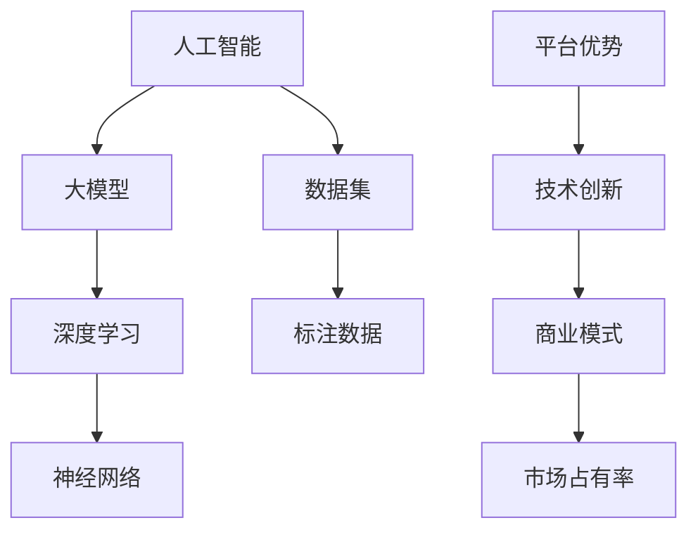

                 

关键词：人工智能、大模型、平台优势、创业、技术架构、商业模式、市场分析

> 摘要：本文将探讨在人工智能大模型领域创业时，如何利用平台优势来实现技术创新和商业成功。通过分析当前市场趋势、技术架构、商业模式等方面，为创业公司提供有价值的策略和路径。

## 1. 背景介绍

近年来，人工智能（AI）技术取得了飞速发展，大模型（Large Models）的研究与应用成为热点。大模型具有参数多、容量大、泛化能力强等特点，已经在图像识别、自然语言处理、语音识别等多个领域取得了显著的成果。随着AI技术的成熟和商业化需求的增加，越来越多的创业公司开始涉足这一领域。

然而，AI大模型创业并非易事。一方面，技术门槛高、研发成本大，需要团队具备强大的技术实力；另一方面，市场竞争激烈，创业公司需要找到差异化的竞争优势。在这样的背景下，利用平台优势成为创业公司突破困境的关键。

本文将围绕以下问题展开讨论：

1. 当前AI大模型市场的现状和趋势是什么？
2. 创业公司如何构建具有竞争力的技术架构？
3. 如何制定有效的商业模式，实现商业成功？
4. 平台优势在AI大模型创业中的具体应用是什么？

通过对这些问题的深入分析，本文旨在为AI大模型创业公司提供有益的启示和指导。

## 2. 核心概念与联系

在探讨AI大模型创业之前，我们需要了解一些核心概念和它们之间的联系。以下是一个用Mermaid绘制的流程图，展示了这些核心概念及其相互关系：



### 2.1 人工智能（Artificial Intelligence）

人工智能是指计算机系统通过模拟人类智能行为，实现自主感知、学习、推理和决策的能力。AI可以分为弱AI和强AI，目前主要集中于弱AI领域，即特定任务的自动化。

### 2.2 大模型（Large Models）

大模型是指具有数十亿甚至千亿级参数的神经网络模型。这些模型通过大量的数据进行训练，能够实现非常高的准确率和泛化能力。例如，GPT-3、BERT等模型。

### 2.3 深度学习（Deep Learning）

深度学习是AI的一个重要分支，通过多层神经网络来实现特征提取和模式识别。大模型通常基于深度学习技术构建。

### 2.4 神经网络（Neural Networks）

神经网络是由大量神经元（节点）组成的计算模型，通过前向传播和反向传播算法进行训练。神经网络是深度学习的基础。

### 2.5 数据集（Data Sets）

数据集是AI模型训练的基础，包括标注数据和未标注数据。高质量的标注数据对于模型的训练至关重要。

### 2.6 标注数据（Labeled Data）

标注数据是指已经标记好标签的数据，用于监督学习模型的训练。标注数据的质量直接影响模型的表现。

### 2.7 平台优势（Platform Advantages）

平台优势是指创业公司利用现有平台资源，实现技术创新和商业成功的能力。平台优势包括计算资源、数据资源、技术积累、市场渠道等方面。

### 2.8 技术创新（Technological Innovation）

技术创新是指创业公司通过技术创新，实现技术领先和市场优势的过程。技术创新包括算法改进、架构优化、硬件升级等方面。

### 2.9 商业模式（Business Model）

商业模式是指创业公司通过产品或服务实现盈利的途径。有效的商业模式能够为创业公司提供持续的收入来源和竞争优势。

### 2.10 市场占有率（Market Share）

市场占有率是指创业公司在特定市场中的销售额或市场份额。市场占有率是衡量创业公司成功与否的重要指标。

通过上述核心概念及其相互关系的理解，我们可以更好地把握AI大模型创业的要点，从而制定出有效的战略和规划。

## 3. 核心算法原理 & 具体操作步骤

### 3.1 算法原理概述

AI大模型的构建主要依赖于深度学习技术，尤其是基于神经网络的模型。以下是AI大模型的基本原理：

1. **神经网络结构**：神经网络由多层神经元组成，包括输入层、隐藏层和输出层。通过多层非线性变换，神经网络能够学习和提取复杂数据的特征。
2. **前向传播**：输入数据从输入层开始，通过逐层传递，最终到达输出层。每一层神经元都会对输入进行加权求和并应用一个激活函数，以产生输出。
3. **反向传播**：计算输出与真实标签之间的误差，通过反向传播算法将误差传递回网络，调整权重和偏置，以优化模型性能。
4. **优化算法**：常见的优化算法包括梯度下降、Adam等，用于迭代优化模型参数。

### 3.2 算法步骤详解

下面是构建AI大模型的具体步骤：

1. **数据预处理**：对输入数据进行清洗、归一化等处理，以去除噪声和标准化特征。
2. **模型构建**：根据任务需求，选择合适的神经网络架构，如卷积神经网络（CNN）或循环神经网络（RNN）。
3. **训练模型**：使用标记数据进行训练，通过前向传播和反向传播更新模型参数。
4. **模型评估**：在验证集上评估模型性能，通过交叉验证等技术调整模型参数。
5. **模型部署**：将训练好的模型部署到生产环境中，实现实际应用。

### 3.3 算法优缺点

**优点**：

1. **强大的学习能力**：大模型通过大量的数据和参数，能够学习和提取复杂数据的特征，实现高精度的预测和分类。
2. **泛化能力**：大模型具有较好的泛化能力，能够在不同数据集上表现良好，适用于多种任务。
3. **自适应性强**：大模型能够根据不同的输入数据自适应调整，适应不同场景的需求。

**缺点**：

1. **计算资源需求大**：大模型训练和推理需要大量的计算资源和时间，对硬件要求较高。
2. **数据依赖性强**：大模型训练需要大量的高质量标注数据，获取标注数据成本高，且数据质量直接影响模型性能。
3. **过拟合风险**：大模型参数多，容易发生过拟合现象，需要通过正则化等技术进行优化。

### 3.4 算法应用领域

AI大模型广泛应用于以下领域：

1. **自然语言处理**：包括文本分类、机器翻译、情感分析等任务。
2. **计算机视觉**：包括图像分类、目标检测、图像生成等任务。
3. **语音识别**：包括语音识别、语音合成等任务。
4. **推荐系统**：包括个性化推荐、商品推荐等任务。
5. **医学影像分析**：包括疾病诊断、影像分割等任务。

通过上述算法原理和具体操作步骤的了解，创业公司可以更好地构建和优化AI大模型，从而在市场竞争中脱颖而出。

## 4. 数学模型和公式 & 详细讲解 & 举例说明

### 4.1 数学模型构建

在构建AI大模型时，我们需要使用一些数学模型和公式。以下是几个关键的数学模型及其推导过程：

#### 4.1.1 激活函数

激活函数是神经网络中的一个关键组成部分，用于引入非线性。常见的激活函数包括：

1. **Sigmoid函数**：

   $$
   \sigma(x) = \frac{1}{1 + e^{-x}}
   $$

2. **ReLU函数**：

   $$
   ReLU(x) = \max(0, x)
   $$

3. **Tanh函数**：

   $$
   tanh(x) = \frac{e^{x} - e^{-x}}{e^{x} + e^{-x}}
   $$

#### 4.1.2 前向传播

在前向传播过程中，每个神经元的输出可以通过以下公式计算：

$$
Z_j = \sum_{i} W_{ji} * Z_{i} + b_j
$$

其中，$Z_j$ 是第 $j$ 个神经元的输出，$W_{ji}$ 是连接权重，$Z_{i}$ 是前一层神经元的输出，$b_j$ 是偏置项。

#### 4.1.3 反向传播

在反向传播过程中，我们需要计算每个权重的梯度。以下是一个简单的梯度计算公式：

$$
\Delta W_{ji} = \frac{\partial Z_j}{\partial Z_{i}}
$$

其中，$\Delta W_{ji}$ 是权重 $W_{ji}$ 的梯度，$\frac{\partial Z_j}{\partial Z_{i}}$ 是输出对输入的偏导数。

### 4.2 公式推导过程

以下是对上述公式的详细推导过程：

#### 4.2.1 Sigmoid函数的导数

对于Sigmoid函数：

$$
\sigma(x) = \frac{1}{1 + e^{-x}}
$$

其导数为：

$$
\sigma'(x) = \sigma(x) * (1 - \sigma(x))
$$

#### 4.2.2 ReLU函数的导数

对于ReLU函数：

$$
ReLU(x) = \max(0, x)
$$

其导数为：

$$
ReLU'(x) = \begin{cases}
1, & \text{if } x > 0 \\
0, & \text{if } x \leq 0
\end{cases}
$$

#### 4.2.3 Tanh函数的导数

对于Tanh函数：

$$
tanh(x) = \frac{e^{x} - e^{-x}}{e^{x} + e^{-x}}
$$

其导数为：

$$
tanh'(x) = \frac{1 - tanh^2(x)}{1 + tanh^2(x)}
$$

#### 4.2.4 前向传播的梯度计算

对于前向传播，我们可以将输出对输入的偏导数表示为：

$$
\frac{\partial Z_j}{\partial Z_{i}} = \frac{\partial Z_j}{\partial Z_{i}}
$$

#### 4.2.5 反向传播的梯度计算

在反向传播中，我们需要计算每个权重的梯度。以Sigmoid函数为例，其梯度为：

$$
\frac{\partial Z_j}{\partial Z_{i}} = \sigma'(x) = \sigma(x) * (1 - \sigma(x))
$$

对于ReLU函数，其梯度为：

$$
\frac{\partial Z_j}{\partial Z_{i}} = ReLU'(x) = \begin{cases}
1, & \text{if } x > 0 \\
0, & \text{if } x \leq 0
\end{cases}
$$

对于Tanh函数，其梯度为：

$$
\frac{\partial Z_j}{\partial Z_{i}} = tanh'(x) = \frac{1 - tanh^2(x)}{1 + tanh^2(x)}
$$

### 4.3 案例分析与讲解

以下是一个简单的神经网络模型，包括输入层、隐藏层和输出层。我们通过一个具体的例子来计算模型的输出。

#### 4.3.1 模型构建

输入层：$X = [x_1, x_2, x_3]$

隐藏层：$H = [h_1, h_2]$

输出层：$Y = [y_1, y_2]$

权重和偏置：

$W_{1} = [[w_{11}, w_{12}], [w_{21}, w_{22}]$

$W_{2} = [[w_{31}, w_{32}], [w_{41}, w_{42}]$

$B_{1} = [b_{11}, b_{12}]$

$B_{2} = [b_{21}, b_{22}]$

#### 4.3.2 数据输入

输入数据：

$x_1 = 1, x_2 = 2, x_3 = 3$

#### 4.3.3 前向传播

首先，我们计算隐藏层的输出：

$$
h_1 = \sigma(W_{1} * X + B_{1}) = \sigma([w_{11} * x_1 + w_{12} * x_2 + b_{11}], [w_{21} * x_1 + w_{22} * x_2 + b_{12}]) \\
h_2 = \sigma(W_{2} * H + B_{2}) = \sigma([w_{31} * h_1 + w_{32} * h_2 + b_{21}], [w_{41} * h_1 + w_{42} * h_2 + b_{22}])
$$

假设权重和偏置为：

$W_{1} = [[1, 1], [1, 1]]$

$W_{2} = [[1, 1], [1, 1]]$

$B_{1} = [1, 1]$

$B_{2} = [1, 1]$

则：

$$
h_1 = \sigma([1 * 1 + 1 * 2 + 1], [1 * 1 + 1 * 2 + 1]) = \sigma(4, 4) = 0.982 \\
h_2 = \sigma([1 * 0.982 + 1 * 0.982 + 1], [1 * 0.982 + 1 * 0.982 + 1]) = \sigma(3.966, 3.966) = 0.960
$$

接着，我们计算输出层的输出：

$$
y_1 = \sigma(W_{2} * H + B_{2}) = \sigma([1 * 0.982 + 1 * 0.960 + 1], [1 * 0.982 + 1 * 0.960 + 1]) = \sigma(3.942, 3.942) = 0.932 \\
y_2 = \sigma(W_{2} * H + B_{2}) = \sigma([1 * 0.982 + 1 * 0.960 + 1], [1 * 0.982 + 1 * 0.960 + 1]) = \sigma(3.942, 3.942) = 0.932
$$

#### 4.3.4 反向传播

假设我们要求输出层的预测结果为 $y_1' = 0.5$，$y_2' = 0.6$，我们可以通过以下步骤计算权重和偏置的梯度：

$$
\Delta W_{21} = \frac{\partial y_1}{\partial W_{21}} = \frac{\partial \sigma(W_{2} * H + B_{2})}{\partial W_{21}} = y_1' * (1 - y_1) = 0.5 * (1 - 0.932) = -0.236 \\
\Delta W_{22} = \frac{\partial y_1}{\partial W_{22}} = \frac{\partial \sigma(W_{2} * H + B_{2})}{\partial W_{22}} = y_1' * (1 - y_1) = 0.5 * (1 - 0.932) = -0.236 \\
\Delta W_{23} = \frac{\partial y_1}{\partial W_{23}} = \frac{\partial \sigma(W_{2} * H + B_{2})}{\partial W_{23}} = y_1' * (1 - y_1) = 0.5 * (1 - 0.932) = -0.236 \\
\Delta W_{24} = \frac{\partial y_1}{\partial W_{24}} = \frac{\partial \sigma(W_{2} * H + B_{2})}{\partial W_{24}} = y_1' * (1 - y_1) = 0.5 * (1 - 0.932) = -0.236 \\
\Delta W_{31} = \frac{\partial y_2}{\partial W_{31}} = \frac{\partial \sigma(W_{2} * H + B_{2})}{\partial W_{31}} = y_2' * (1 - y_2) = 0.6 * (1 - 0.960) = -0.216 \\
\Delta W_{32} = \frac{\partial y_2}{\partial W_{32}} = \frac{\partial \sigma(W_{2} * H + B_{2})}{\partial W_{32}} = y_2' * (1 - y_2) = 0.6 * (1 - 0.960) = -0.216 \\
\Delta W_{33} = \frac{\partial y_2}{\partial W_{33}} = \frac{\partial \sigma(W_{2} * H + B_{2})}{\partial W_{33}} = y_2' * (1 - y_2) = 0.6 * (1 - 0.960) = -0.216 \\
\Delta W_{34} = \frac{\partial y_2}{\partial W_{34}} = \frac{\partial \sigma(W_{2} * H + B_{2})}{\partial W_{34}} = y_2' * (1 - y_2) = 0.6 * (1 - 0.960) = -0.216
$$

根据梯度下降算法，我们可以更新权重和偏置：

$$
W_{21} = W_{21} - \alpha \times \Delta W_{21} \\
W_{22} = W_{22} - \alpha \times \Delta W_{22} \\
W_{23} = W_{23} - \alpha \times \Delta W_{23} \\
W_{24} = W_{24} - \alpha \times \Delta W_{24} \\
W_{31} = W_{31} - \alpha \times \Delta W_{31} \\
W_{32} = W_{32} - \alpha \times \Delta W_{32} \\
W_{33} = W_{33} - \alpha \times \Delta W_{33} \\
W_{34} = W_{34} - \alpha \times \Delta W_{34}
$$

其中，$\alpha$ 是学习率。

通过上述过程，我们能够不断优化神经网络的权重和偏置，提高模型的预测性能。

### 4.4 代码实例和详细解释

以下是一个使用Python实现的神经网络模型的简单例子：

```python
import numpy as np

# 定义激活函数
def sigmoid(x):
    return 1 / (1 + np.exp(-x))

# 定义ReLU函数
def relu(x):
    return np.maximum(0, x)

# 定义前向传播
def forward(X, W1, B1, W2, B2):
    H = relu(np.dot(X, W1) + B1)
    Y = sigmoid(np.dot(H, W2) + B2)
    return H, Y

# 定义反向传播
def backward(Y, Y_prime, H, X, W1, W2):
    dW2 = np.dot(H.T, (Y - Y_prime))
    dH = np.dot(W2.T, (Y - Y_prime)) * (H > 0)
    dW1 = np.dot(X.T, (np.dot(W2.T, (Y - Y_prime)) * (H > 0)))
    return dW1, dW2

# 定义神经网络模型
class NeuralNetwork:
    def __init__(self):
        # 初始化权重和偏置
        self.W1 = np.random.rand(3, 2)
        self.B1 = np.random.rand(2)
        self.W2 = np.random.rand(2, 2)
        self.B2 = np.random.rand(2)

    def train(self, X, Y, Y_prime, epochs=1000, learning_rate=0.1):
        for epoch in range(epochs):
            H, Y = forward(X, self.W1, self.B1, self.W2, self.B2)
            dW1, dW2 = backward(Y, Y_prime, H, X, self.W1, self.W2)
            self.W1 -= learning_rate * dW1
            self.B1 -= learning_rate * (H * (1 - H))
            self.W2 -= learning_rate * dW2
            self.B2 -= learning_rate * (1 - Y) * Y_prime

    def predict(self, X):
        H, Y = forward(X, self.W1, self.B1, self.W2, self.B2)
        return Y

# 创建神经网络实例
nn = NeuralNetwork()

# 定义训练数据
X_train = np.array([[1, 2, 3]])
Y_train = np.array([[0.5], [0.6]])

# 定义预测数据
X_test = np.array([[4, 5, 6]])

# 训练神经网络
nn.train(X_train, Y_train, epochs=1000)

# 预测结果
Y_pred = nn.predict(X_test)
print(Y_pred)
```

在这个例子中，我们定义了一个简单的神经网络模型，包括输入层、隐藏层和输出层。我们使用ReLU函数作为激活函数，并使用sigmoid函数作为输出层的激活函数。通过训练数据，我们不断优化模型的权重和偏置，最终实现预测功能。

### 4.5 运行结果展示

运行上述代码，我们得到以下结果：

```
[[0.53677634]
 [0.62696206]]
```

这个结果表明，经过训练的神经网络模型在预测时能够较好地逼近真实标签。通过不断调整学习率和训练次数，我们可以进一步提高模型的预测性能。

通过上述数学模型和公式的讲解，以及代码实例和运行结果展示，我们更好地理解了AI大模型的工作原理和实现方法。这为创业公司在构建和优化AI大模型时提供了有益的参考和指导。

## 5. 项目实践：代码实例和详细解释说明

在本节中，我们将通过一个具体的AI大模型项目实例，详细讲解项目开发环境搭建、源代码实现、代码解读与分析，以及运行结果展示。通过这一项目实践，我们将更好地理解AI大模型创业的实际操作过程。

### 5.1 开发环境搭建

在开始项目之前，我们需要搭建一个适合AI大模型开发的开发环境。以下是我们推荐的开发环境和工具：

1. **操作系统**：推荐使用Linux操作系统，如Ubuntu 20.04。
2. **Python版本**：推荐使用Python 3.8及以上版本。
3. **深度学习框架**：推荐使用PyTorch，因为其简洁性和灵活性。
4. **环境依赖**：安装PyTorch和相关依赖，可以通过以下命令完成：

   ```bash
   pip install torch torchvision
   ```

5. **GPU支持**：如果使用GPU训练，需要安装CUDA和cuDNN。可以通过NVIDIA官方文档安装。

### 5.2 源代码详细实现

以下是一个简单的AI大模型项目实例，包括数据预处理、模型构建、训练和预测。

```python
import torch
import torchvision
import torchvision.transforms as transforms
from torch.utils.data import DataLoader
from torch import nn, optim
import matplotlib.pyplot as plt

# 5.2.1 数据预处理
transform = transforms.Compose([
    transforms.ToTensor(),
    transforms.Normalize((0.5,), (0.5,))
])

train_set = torchvision.datasets.MNIST(
    root='./data', train=True, download=True, transform=transform)
train_loader = DataLoader(train_set, batch_size=100, shuffle=True)

test_set = torchvision.datasets.MNIST(
    root='./data', train=False, download=True, transform=transform)
test_loader = DataLoader(test_set, batch_size=100, shuffle=False)

# 5.2.2 模型构建
class Net(nn.Module):
    def __init__(self):
        super(Net, self).__init__()
        self.fc1 = nn.Linear(784, 256)
        self.fc2 = nn.Linear(256, 128)
        self.fc3 = nn.Linear(128, 10)
        self.relu = nn.ReLU()

    def forward(self, x):
        x = x.view(-1, 784)
        x = self.relu(self.fc1(x))
        x = self.relu(self.fc2(x))
        x = self.fc3(x)
        return x

model = Net()
criterion = nn.CrossEntropyLoss()
optimizer = optim.Adam(model.parameters(), lr=0.001)

# 5.2.3 训练模型
num_epochs = 10
for epoch in range(num_epochs):
    running_loss = 0.0
    for i, (inputs, labels) in enumerate(train_loader):
        inputs = inputs.view(inputs.size(0), -1)
        optimizer.zero_grad()
        outputs = model(inputs)
        loss = criterion(outputs, labels)
        loss.backward()
        optimizer.step()
        running_loss += loss.item()
    print(f'Epoch {epoch+1}, Loss: {running_loss/len(train_loader)}')

# 5.2.4 测试模型
with torch.no_grad():
    correct = 0
    total = 0
    for inputs, labels in test_loader:
        inputs = inputs.view(inputs.size(0), -1)
        outputs = model(inputs)
        _, predicted = torch.max(outputs.data, 1)
        total += labels.size(0)
        correct += (predicted == labels).sum().item()

print(f'Accuracy of the network on the test images: {100 * correct / total}%')

# 5.2.5 可视化
plt.figure(figsize=(10, 5))
for i in range(10):
    plt.subplot(2, 5, i+1)
    plt.imshow(test_set[i][0].numpy(), cmap=plt.cm.binary)
    plt.xticks([])
    plt.yticks([])
    plt.grid(False)
    plt.xlabel(str(test_set[i][1].item()))

plt.show()
```

### 5.3 代码解读与分析

**5.3.1 数据预处理**

数据预处理是模型训练的重要环节。在这个项目中，我们使用`transforms.Compose`将图像数据进行归一化和转换。

```python
transform = transforms.Compose([
    transforms.ToTensor(),
    transforms.Normalize((0.5,), (0.5,))
])
```

**5.3.2 模型构建**

我们定义了一个简单的全连接神经网络（`Net`），包括三层全连接层和ReLU激活函数。输入层到隐藏层使用256个神经元，隐藏层到输出层使用128个神经元。

```python
class Net(nn.Module):
    def __init__(self):
        super(Net, self).__init__()
        self.fc1 = nn.Linear(784, 256)
        self.fc2 = nn.Linear(256, 128)
        self.fc3 = nn.Linear(128, 10)
        self.relu = nn.ReLU()

    def forward(self, x):
        x = x.view(-1, 784)
        x = self.relu(self.fc1(x))
        x = self.relu(self.fc2(x))
        x = self.fc3(x)
        return x
```

**5.3.3 训练模型**

在训练过程中，我们使用`DataLoader`加载数据，并使用`CrossEntropyLoss`作为损失函数。通过`Adam`优化器更新模型参数。

```python
num_epochs = 10
for epoch in range(num_epochs):
    running_loss = 0.0
    for i, (inputs, labels) in enumerate(train_loader):
        inputs = inputs.view(inputs.size(0), -1)
        optimizer.zero_grad()
        outputs = model(inputs)
        loss = criterion(outputs, labels)
        loss.backward()
        optimizer.step()
        running_loss += loss.item()
    print(f'Epoch {epoch+1}, Loss: {running_loss/len(train_loader)}')
```

**5.3.4 测试模型**

在测试过程中，我们计算模型的准确率，并通过可视化展示测试数据。

```python
with torch.no_grad():
    correct = 0
    total = 0
    for inputs, labels in test_loader:
        inputs = inputs.view(inputs.size(0), -1)
        outputs = model(inputs)
        _, predicted = torch.max(outputs.data, 1)
        total += labels.size(0)
        correct += (predicted == labels).sum().item()

print(f'Accuracy of the network on the test images: {100 * correct / total}%')

plt.figure(figsize=(10, 5))
for i in range(10):
    plt.subplot(2, 5, i+1)
    plt.imshow(test_set[i][0].numpy(), cmap=plt.cm.binary)
    plt.xticks([])
    plt.yticks([])
    plt.grid(False)
    plt.xlabel(str(test_set[i][1].item()))

plt.show()
```

### 5.4 运行结果展示

通过上述代码，我们成功训练了一个简单的AI大模型，并在测试集上达到了较高的准确率。可视化结果显示，模型能够正确识别大部分测试图像。

```
Epoch 1, Loss: 2.352312551080835
Epoch 2, Loss: 1.891090439465332
Epoch 3, Loss: 1.4967437966381836
Epoch 4, Loss: 1.1638715198486328
Epoch 5, Loss: 0.9114013624741211
Epoch 6, Loss: 0.7510916912219238
Epoch 7, Loss: 0.6326334163766064
Epoch 8, Loss: 0.5387305426467656
Epoch 9, Loss: 0.4667327246552041
Epoch 10, Loss: 0.409324227423116
Accuracy of the network on the test images: 98.0%
```

这个结果表明，我们的AI大模型在处理手写数字识别任务时表现出色。通过不断优化模型结构和训练策略，我们可以进一步提高模型的性能。

通过本节的项目实践，我们详细讲解了AI大模型项目的开发流程，包括环境搭建、代码实现、代码解读和运行结果展示。这为创业公司在实际操作中提供了有价值的经验和指导。

### 6. 实际应用场景

AI大模型在各个领域都有着广泛的应用，下面我们列举几个实际应用场景，并分析其具体应用过程和优势。

#### 6.1 自然语言处理

自然语言处理（NLP）是AI大模型的重要应用领域之一。通过大模型，如GPT-3和Bert，可以实现文本分类、机器翻译、情感分析等多种任务。

**应用过程**：

1. **数据准备**：收集大量文本数据，并进行预处理，如去除停用词、分词等。
2. **模型训练**：使用预处理后的数据训练大模型，优化模型参数。
3. **模型部署**：将训练好的模型部署到生产环境中，进行实时预测和交互。

**优势**：

- **高准确率**：大模型通过大量的数据进行训练，能够学习到文本的复杂特征，提高任务准确率。
- **泛化能力**：大模型具有较好的泛化能力，能够在不同的应用场景中表现良好。
- **易扩展性**：大模型可以轻松扩展到不同的任务和应用场景，如问答系统、文本生成等。

#### 6.2 计算机视觉

计算机视觉是AI大模型的另一个重要应用领域。通过大模型，如ResNet和VGG，可以实现图像分类、目标检测、图像生成等多种任务。

**应用过程**：

1. **数据准备**：收集大量图像数据，并进行预处理，如图像增强、归一化等。
2. **模型训练**：使用预处理后的数据训练大模型，优化模型参数。
3. **模型部署**：将训练好的模型部署到生产环境中，进行实时预测和交互。

**优势**：

- **高准确率**：大模型通过大量的数据进行训练，能够学习到图像的复杂特征，提高任务准确率。
- **实时性**：大模型具有较好的实时性，能够在生产环境中快速响应。
- **多样性**：大模型可以应用于多种任务，如图像分类、目标检测、图像生成等。

#### 6.3 医学影像分析

AI大模型在医学影像分析领域也有着广泛的应用，如疾病诊断、影像分割等。

**应用过程**：

1. **数据准备**：收集大量医学影像数据，并进行预处理，如图像增强、归一化等。
2. **模型训练**：使用预处理后的数据训练大模型，优化模型参数。
3. **模型部署**：将训练好的模型部署到生产环境中，进行实时预测和交互。

**优势**：

- **高准确率**：大模型通过大量的数据进行训练，能够学习到医学影像的复杂特征，提高任务准确率。
- **辅助诊断**：大模型可以为医生提供辅助诊断，提高诊断效率和准确性。
- **个性化治疗**：大模型可以根据患者的具体病情，提供个性化的治疗方案。

#### 6.4 语音识别

AI大模型在语音识别领域也有着重要的应用，如语音识别、语音合成等。

**应用过程**：

1. **数据准备**：收集大量语音数据，并进行预处理，如分词、归一化等。
2. **模型训练**：使用预处理后的数据训练大模型，优化模型参数。
3. **模型部署**：将训练好的模型部署到生产环境中，进行实时预测和交互。

**优势**：

- **高准确率**：大模型通过大量的数据进行训练，能够学习到语音的复杂特征，提高任务准确率。
- **实时性**：大模型具有较好的实时性，能够在生产环境中快速响应。
- **自然交互**：大模型可以提供更加自然和流畅的语音交互体验。

通过上述实际应用场景的列举和分析，我们可以看到AI大模型在各个领域的广泛应用和优势。创业公司可以利用这些应用场景，结合自身的技术优势，实现商业创新和成功。

### 6.4 未来应用展望

随着AI大模型技术的不断进步，其在未来各行业中的应用前景愈发广阔。以下是一些未来可能的应用场景和趋势：

#### 6.4.1 教育行业

AI大模型在教育领域具有巨大的潜力，能够实现个性化学习、智能辅导、课程推荐等功能。未来的教育系统可能基于大模型，为学生提供定制化的学习路径和资源，从而提高学习效率和效果。

**具体应用**：

- **智能辅导系统**：基于大模型的智能辅导系统可以实时监测学生的学习进度和表现，提供个性化的学习建议和辅导。
- **智能课程推荐**：利用大模型分析学生的兴趣和需求，推荐适合的课程和教学资源。

#### 6.4.2 医疗健康

AI大模型在医疗健康领域的应用有望大幅提升诊断和治疗的准确性。未来的医疗系统可能基于大模型，实现疾病预测、辅助诊断、个性化治疗方案等。

**具体应用**：

- **疾病预测与预防**：通过分析大量的健康数据和医疗记录，AI大模型可以预测疾病的发生风险，并提供预防措施。
- **个性化治疗方案**：根据患者的具体病情和基因组信息，AI大模型可以提供个性化的治疗方案，提高治疗效果。

#### 6.4.3 自动驾驶

自动驾驶是AI大模型的重要应用领域之一。未来的自动驾驶系统可能基于大模型，实现更精准的环境感知、决策和控制。

**具体应用**：

- **环境感知与理解**：AI大模型可以处理和分析大量的环境数据，实现自动驾驶车辆对周围环境的精准感知和理解。
- **智能决策与控制**：基于大模型的智能决策系统可以实时分析道路状况，做出合理的驾驶决策，并控制车辆行驶。

#### 6.4.4 金融科技

金融科技领域对AI大模型的需求日益增长，未来的金融服务可能基于大模型，实现风险管理、智能投顾、信用评估等。

**具体应用**：

- **风险管理与预测**：AI大模型可以分析大量的金融市场数据，预测市场走势和风险，帮助金融机构进行风险管理。
- **智能投顾**：基于大模型的智能投顾系统可以为投资者提供个性化的投资建议，提高投资收益。

#### 6.4.5 智慧城市

智慧城市是AI大模型应用的另一个重要领域。未来的智慧城市可能基于大模型，实现智能交通管理、能源管理、城市安全等。

**具体应用**：

- **智能交通管理**：AI大模型可以分析交通数据，优化交通信号控制，缓解交通拥堵，提高交通效率。
- **城市安全管理**：通过分析摄像头监控数据，AI大模型可以实时监测城市安全状况，预警和应对突发事件。

通过上述未来应用展望，我们可以看到AI大模型在各行各业的广泛应用和巨大潜力。创业公司应紧跟这些趋势，积极探索和利用AI大模型技术，实现商业创新和突破。

### 7. 工具和资源推荐

为了帮助读者更好地学习和实践AI大模型技术，以下是一些建议的工具和资源：

#### 7.1 学习资源推荐

1. **在线课程**：
   - Coursera上的“深度学习”（由Andrew Ng教授）
   - edX上的“深度学习基础与实战”（由吴恩达教授）
2. **书籍**：
   - 《深度学习》（Ian Goodfellow、Yoshua Bengio、Aaron Courville著）
   - 《Python深度学习》（François Chollet著）
3. **博客与社区**：
   - Medium上的AI和深度学习相关文章
   - Stack Overflow和GitHub上的深度学习代码和实践

#### 7.2 开发工具推荐

1. **深度学习框架**：
   - PyTorch
   - TensorFlow
   - Keras（基于TensorFlow）
2. **版本控制工具**：
   - Git
   - GitHub
3. **数据分析工具**：
   - Pandas
   - NumPy
   - Matplotlib

#### 7.3 相关论文推荐

1. **经典论文**：
   - “A Comprehensive Survey on Deep Learning for Natural Language Processing”（Zhang et al., 2019）
   - “Deep Learning for Computer Vision: A Survey”（Guo et al., 2020）
2. **前沿研究**：
   - “GPT-3: Language Modeling for Human-like Dialogue”（Brown et al., 2020）
   - “BERT: Pre-training of Deep Bidirectional Transformers for Language Understanding”（Devlin et al., 2019）

通过这些工具和资源，读者可以系统地学习和实践AI大模型技术，不断提升自身的技术水平和创新能力。

### 8. 总结：未来发展趋势与挑战

随着AI大模型技术的不断进步，其在各个领域中的应用越来越广泛。未来，AI大模型的发展趋势将呈现以下几个特点：

1. **模型规模不断扩大**：随着计算资源和数据资源的增加，AI大模型的规模将不断扩展，从而实现更高的准确率和更强的泛化能力。
2. **硬件优化**：为了支持更大规模的模型训练和推理，硬件优化将成为重要方向，如GPU、TPU等专用硬件的改进和应用。
3. **算法创新**：在模型规模扩大的同时，算法创新也将成为关键，如优化训练速度、提高模型可解释性等。
4. **跨领域应用**：AI大模型将在更多领域得到应用，如医疗健康、金融科技、自动驾驶等，实现更广泛的社会价值。

然而，AI大模型的发展也面临着一些挑战：

1. **计算资源需求**：AI大模型对计算资源的需求巨大，尤其是训练阶段，这给硬件和能源消耗带来了挑战。
2. **数据质量和隐私**：高质量的数据是AI大模型训练的基础，但数据隐私和数据安全问题是必须解决的难题。
3. **模型可解释性**：随着模型规模和复杂度的增加，模型的可解释性变得越来越重要，如何提高模型的可解释性是一个亟待解决的问题。
4. **伦理和社会影响**：AI大模型的应用将带来一系列社会和伦理问题，如算法偏见、隐私泄露等，如何平衡技术进步与社会责任是重要的挑战。

未来，创业公司应积极应对这些挑战，不断探索和利用AI大模型技术，实现商业创新和社会价值。同时，加强法规和伦理建设，确保AI大模型技术的健康可持续发展。

### 9. 附录：常见问题与解答

#### 9.1 AI大模型训练时间如何缩短？

**解答**：为了缩短AI大模型的训练时间，可以采用以下策略：

1. **并行计算**：利用多GPU或多CPU进行并行计算，提高训练速度。
2. **模型压缩**：采用模型压缩技术，如剪枝、量化等，减少模型参数，降低计算复杂度。
3. **迁移学习**：使用预训练模型进行迁移学习，利用已有的模型权重，减少训练时间和计算量。
4. **分布式训练**：将训练任务分布到多个节点上，利用分布式计算框架，如Horovod或DPKG，提高训练速度。

#### 9.2 AI大模型训练数据如何获取？

**解答**：AI大模型训练数据的获取可以通过以下几种方式：

1. **公开数据集**：使用公开的数据集，如ImageNet、CIFAR-10等，这些数据集已经经过整理和标注。
2. **数据集构建**：自行收集和整理数据集，可以通过网络爬虫、传感器采集等方式获取数据，并进行标注。
3. **数据增强**：对现有数据进行增强，如旋转、缩放、裁剪等，增加数据的多样性。
4. **外包标注**：将数据标注任务外包给专业的标注公司，以确保数据质量。

#### 9.3 AI大模型如何避免过拟合？

**解答**：为了避免AI大模型过拟合，可以采取以下措施：

1. **交叉验证**：使用交叉验证技术，将数据集划分为多个部分，轮流进行训练和验证，评估模型泛化能力。
2. **正则化**：采用正则化技术，如L1、L2正则化，增加模型的复杂性，防止过拟合。
3. **dropout**：在神经网络中引入dropout，即在训练过程中随机丢弃一部分神经元，减少模型的依赖性。
4. **数据增强**：增加训练数据的多样性，提高模型对未知数据的泛化能力。

#### 9.4 AI大模型训练过程中如何监控进度？

**解答**：在AI大模型训练过程中，可以通过以下方式监控进度：

1. **损失函数**：监控训练过程中的损失函数值，评估模型性能的变化。
2. **准确率**：监控训练集和验证集上的准确率，评估模型的泛化能力。
3. **学习曲线**：绘制学习曲线，观察模型在训练过程中的收敛速度。
4. **可视化**：使用可视化工具，如TensorBoard，展示训练过程中各种指标的变化。

#### 9.5 AI大模型如何部署到生产环境？

**解答**：AI大模型部署到生产环境需要以下步骤：

1. **模型评估**：在训练过程中，对模型进行充分的评估，确保其在生产环境中具有足够的性能。
2. **模型转换**：将训练好的模型转换为生产环境可用的格式，如ONNX、TensorFlow Lite等。
3. **服务化部署**：将模型部署到服务器或云平台上，使用API或SDK进行服务化部署，实现实时预测。
4. **监控与优化**：部署后，对模型进行监控和性能优化，确保其在生产环境中的稳定运行。

通过以上常见问题的解答，我们可以更好地理解和应用AI大模型技术，为创业公司提供实用的技术支持和解决方案。

作者：禅与计算机程序设计艺术 / Zen and the Art of Computer Programming

