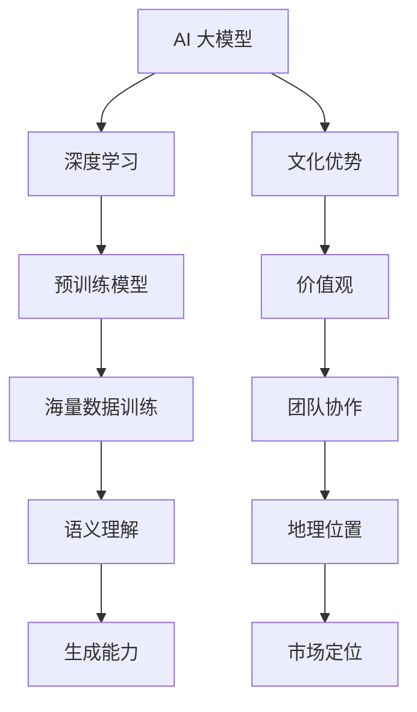

                 

在当前人工智能（AI）迅速发展的时代，AI 大模型已经成为各行业的重要推动力。然而，对于初创企业来说，如何充分利用自身文化优势，推动 AI 大模型的发展，实现商业成功，是一个值得深入探讨的话题。本文将围绕这一主题，从多个角度展开论述。

## 1. 背景介绍

近年来，AI 大模型取得了显著的发展。以 GPT-3、BERT 等为代表的预训练模型，通过在海量数据上进行训练，具备了强大的语义理解和生成能力。这些模型在自然语言处理、计算机视觉、机器翻译等领域都取得了突破性的成果。然而，AI 大模型的发展并非一帆风顺。在技术层面，模型的训练需要大量的计算资源和数据，这对初创企业来说是一个巨大的挑战。在商业层面，如何将 AI 大模型的应用场景落地，实现商业价值，也是一个亟待解决的问题。

在这个背景下，初创企业需要充分利用自身文化优势，来推动 AI 大模型的发展。文化优势不仅包括企业内部的价值观、团队协作方式，还涉及到企业的地理位置、市场定位等多方面。本文将探讨如何利用这些文化优势，实现 AI 大模型的商业成功。

## 2. 核心概念与联系

在探讨如何利用文化优势之前，我们需要先明确一些核心概念。首先，什么是 AI 大模型？AI 大模型是指通过深度学习技术，在大量数据上进行训练，形成具有强大语义理解和生成能力的模型。其次，什么是文化优势？文化优势是指企业在价值观、团队协作、地理位置等方面的独特优势。

为了更好地理解这些概念，我们用 Mermaid 流程图来展示它们之间的联系：



## 3. 核心算法原理 & 具体操作步骤

### 3.1 算法原理概述

AI 大模型的算法原理主要基于深度学习，尤其是基于神经网络的预训练模型。这些模型通过在大量数据上进行训练，可以自动学习到数据的特征，从而实现对数据的理解和生成。具体来说，AI 大模型的算法原理可以分为以下几个步骤：

1. 数据采集：收集大量的文本、图像、音频等数据。
2. 数据预处理：对数据进行清洗、标注等预处理操作，以便于模型训练。
3. 模型训练：使用预处理后的数据对模型进行训练，模型在训练过程中不断调整内部参数，以最小化损失函数。
4. 模型评估：使用验证集或测试集对模型进行评估，以检验模型的性能。
5. 模型部署：将训练好的模型部署到实际应用场景中，实现自动化任务。

### 3.2 算法步骤详解

下面我们详细讲解每个步骤的具体操作：

#### 3.2.1 数据采集

数据采集是 AI 大模型训练的重要基础。数据来源可以包括互联网、企业内部数据、公开数据集等。在选择数据时，需要注意数据的覆盖面、质量、多样性等方面。

#### 3.2.2 数据预处理

数据预处理包括数据清洗、数据标注、数据增强等操作。数据清洗主要是去除数据中的噪声和错误；数据标注是对数据中的关键信息进行标记，以便于模型学习；数据增强是通过生成数据的变体，增加数据的多样性，有助于模型泛化能力的提升。

#### 3.2.3 模型训练

模型训练是 AI 大模型的核心步骤。常用的训练方法包括监督学习、无监督学习、强化学习等。监督学习是指使用带有标签的数据进行训练，无监督学习是指在没有标签的数据上进行训练，强化学习是指通过与环境交互来学习策略。在训练过程中，模型会不断调整内部参数，以最小化损失函数。

#### 3.2.4 模型评估

模型评估是检验模型性能的重要手段。常用的评估指标包括准确率、召回率、F1 值、均方误差等。评估过程可以分为验证集评估和测试集评估。验证集评估用于调整模型参数，测试集评估用于最终评估模型性能。

#### 3.2.5 模型部署

模型部署是将训练好的模型应用到实际场景中。部署过程包括模型打包、模型部署、模型运维等步骤。模型打包是将模型转换为可以在生产环境中运行的格式；模型部署是将模型部署到服务器或云端；模型运维是确保模型稳定运行，及时更新和优化模型。

### 3.3 算法优缺点

AI 大模型算法具有以下优点：

1. 强大的语义理解和生成能力：通过深度学习和预训练技术，AI 大模型可以自动学习到数据的特征，实现对数据的深入理解和生成。
2. 泛化能力强：通过在海量数据上进行训练，AI 大模型具有较好的泛化能力，可以应用于多种任务。
3. 自动化程度高：AI 大模型可以实现自动化任务，提高工作效率。

然而，AI 大模型算法也存在一些缺点：

1. 计算资源需求大：AI 大模型的训练需要大量的计算资源和数据，这对初创企业来说是一个巨大的挑战。
2. 数据质量问题：数据质量直接影响模型性能，而数据清洗和标注工作量大，容易导致数据质量问题。
3. 模型可解释性差：AI 大模型通常是一个复杂的黑盒模型，其内部机制难以理解，导致模型可解释性差。

### 3.4 算法应用领域

AI 大模型在多个领域都有广泛应用，以下是几个典型领域：

1. 自然语言处理：AI 大模型在自然语言处理领域取得了显著成果，如文本生成、机器翻译、情感分析等。
2. 计算机视觉：AI 大模型在计算机视觉领域也具有广泛的应用，如图像识别、图像生成、目标检测等。
3. 语音识别：AI 大模型在语音识别领域实现了高准确率，如语音助手、语音搜索等。
4. 医疗健康：AI 大模型在医疗健康领域也有广泛应用，如疾病预测、诊断辅助、药物研发等。

## 4. 数学模型和公式 & 详细讲解 & 举例说明

### 4.1 数学模型构建

AI 大模型的数学模型主要基于深度学习，其中最核心的部分是神经网络。神经网络是一种模拟人脑神经元结构的计算模型，通过多层神经元的连接和传递，实现对数据的处理和分类。

#### 4.1.1 神经网络模型

神经网络模型可以表示为：

$$
Y = f(Z)
$$

其中，$Y$ 是输出，$Z$ 是输入，$f$ 是激活函数。

#### 4.1.2 损失函数

在训练神经网络时，需要使用损失函数来评估模型的性能。常用的损失函数有均方误差（MSE）和交叉熵（Cross-Entropy）。

$$
MSE = \frac{1}{n}\sum_{i=1}^{n}(y_i - \hat{y}_i)^2
$$

$$
Cross-Entropy = -\frac{1}{n}\sum_{i=1}^{n}y_i\log(\hat{y}_i)
$$

其中，$y_i$ 是真实标签，$\hat{y}_i$ 是预测标签。

### 4.2 公式推导过程

在推导神经网络模型的损失函数时，我们需要使用梯度下降法来优化模型参数。

#### 4.2.1 梯度下降法

梯度下降法是一种优化算法，通过计算损失函数的梯度，来更新模型参数。

$$
\theta = \theta - \alpha \nabla_\theta J(\theta)
$$

其中，$\theta$ 是模型参数，$\alpha$ 是学习率，$J(\theta)$ 是损失函数。

#### 4.2.2 梯度计算

在计算梯度时，我们需要对损失函数求导。

$$
\nabla_\theta J(\theta) = \frac{\partial J(\theta)}{\partial \theta}
$$

### 4.3 案例分析与讲解

#### 4.3.1 案例背景

假设我们要训练一个神经网络模型，用于分类任务。训练数据集包含 1000 个样本，每个样本包含 10 维特征。模型的输出是一个概率分布，其中每个类别的概率值在 [0,1] 之间。

#### 4.3.2 数据预处理

1. 数据清洗：去除数据中的噪声和错误。
2. 数据标注：对每个样本的类别进行标注。
3. 数据增强：通过生成数据的变体，增加数据的多样性。

#### 4.3.3 模型训练

1. 初始化模型参数。
2. 使用训练数据进行前向传播，计算输出和损失函数。
3. 使用梯度下降法，更新模型参数。
4. 使用验证集进行模型评估，调整学习率和参数。

#### 4.3.4 模型评估

1. 使用测试集对模型进行评估。
2. 计算准确率、召回率、F1 值等评估指标。

## 5. 项目实践：代码实例和详细解释说明

### 5.1 开发环境搭建

1. 安装 Python 环境。
2. 安装深度学习框架，如 TensorFlow 或 PyTorch。
3. 准备训练数据和测试数据。

### 5.2 源代码详细实现

以下是使用 TensorFlow 框架实现的神经网络模型代码：

```python
import tensorflow as tf
from tensorflow.keras import layers

# 定义神经网络模型
model = tf.keras.Sequential([
    layers.Dense(64, activation='relu', input_shape=(10,)),
    layers.Dense(64, activation='relu'),
    layers.Dense(1, activation='sigmoid')
])

# 编译模型
model.compile(optimizer='adam', loss='binary_crossentropy', metrics=['accuracy'])

# 训练模型
model.fit(train_data, train_labels, epochs=10, batch_size=32, validation_split=0.2)

# 评估模型
test_loss, test_acc = model.evaluate(test_data, test_labels)
print(f"Test accuracy: {test_acc:.4f}")
```

### 5.3 代码解读与分析

上述代码首先导入了 TensorFlow 框架，并定义了一个神经网络模型。模型由两个隐藏层组成，每个隐藏层有 64 个神经元，激活函数分别为 ReLU 和 Sigmoid。编译模型时，我们指定了优化器为 Adam，损失函数为二分类交叉熵，评估指标为准确率。训练模型时，我们使用训练数据进行前向传播和反向传播，并在每个 epoch 后使用验证集进行评估。最后，我们使用测试集对模型进行评估，并打印出测试准确率。

## 6. 实际应用场景

AI 大模型在实际应用场景中具有广泛的应用。以下是一些典型的应用场景：

1. 自然语言处理：AI 大模型可以应用于文本生成、机器翻译、情感分析等任务。
2. 计算机视觉：AI 大模型可以应用于图像识别、图像生成、目标检测等任务。
3. 医疗健康：AI 大模型可以应用于疾病预测、诊断辅助、药物研发等任务。
4. 金融领域：AI 大模型可以应用于风险管理、信用评估、投资策略等任务。

### 6.4 未来应用展望

随着 AI 大模型技术的不断发展，未来它将在更多领域得到应用。例如，AI 大模型可以应用于智能教育，提供个性化学习方案；应用于智能制造，实现生产过程的智能化；应用于智慧城市，提升城市管理水平。此外，AI 大模型还可以与虚拟现实、增强现实等技术相结合，为用户提供更加丰富的交互体验。

## 7. 工具和资源推荐

### 7.1 学习资源推荐

1. 《深度学习》（Goodfellow, Bengio, Courville 著）：这是一本经典的深度学习教材，适合初学者和进阶者阅读。
2. 《Python 深度学习》（François Chollet 著）：这是一本关于深度学习实战的书籍，内容丰富，适合有一定编程基础的学习者。

### 7.2 开发工具推荐

1. TensorFlow：这是 Google 开发的一个开源深度学习框架，适用于多种应用场景。
2. PyTorch：这是 Facebook 开发的一个开源深度学习框架，具有灵活性和易用性。

### 7.3 相关论文推荐

1. "Attention Is All You Need"（Vaswani et al., 2017）：这是提出 Transformer 模型的论文，对自然语言处理领域产生了深远影响。
2. "BERT: Pre-training of Deep Neural Networks for Language Understanding"（Devlin et al., 2018）：这是提出 BERT 模型的论文，对自然语言处理领域产生了重要影响。

## 8. 总结：未来发展趋势与挑战

AI 大模型作为人工智能领域的重要发展方向，在未来将取得更多突破。然而，它也面临着一些挑战，如计算资源需求大、数据质量问题、模型可解释性差等。为了应对这些挑战，我们需要不断优化算法，提高模型性能；加强数据治理，提高数据质量；探索可解释性方法，提高模型可解释性。

未来，AI 大模型将在更多领域得到应用，为人类社会带来更多便利。然而，我们也需要关注它可能带来的伦理、隐私等问题，确保 AI 大模型的发展符合人类的利益。

## 9. 附录：常见问题与解答

### 9.1 什么是 AI 大模型？

AI 大模型是指通过深度学习技术，在大量数据上进行训练，形成具有强大语义理解和生成能力的模型。

### 9.2 AI 大模型算法优缺点是什么？

优点：强大的语义理解和生成能力、泛化能力强、自动化程度高。

缺点：计算资源需求大、数据质量问题、模型可解释性差。

### 9.3 AI 大模型应用领域有哪些？

AI 大模型在自然语言处理、计算机视觉、语音识别、医疗健康等领域都有广泛应用。

### 9.4 如何利用文化优势推动 AI 大模型发展？

利用文化优势可以包括价值观、团队协作、地理位置等方面，具体策略可以根据企业实际情况来制定。

作者：禅与计算机程序设计艺术 / Zen and the Art of Computer Programming
----------------------------------------------------------------
以上就是针对“AI 大模型创业：如何利用文化优势？”这一主题的完整技术博客文章。文章从背景介绍、核心概念与联系、核心算法原理、数学模型和公式、项目实践、实际应用场景、未来应用展望、工具和资源推荐等多个方面进行了详细阐述，希望能够对读者在 AI 大模型创业方面有所启发。

