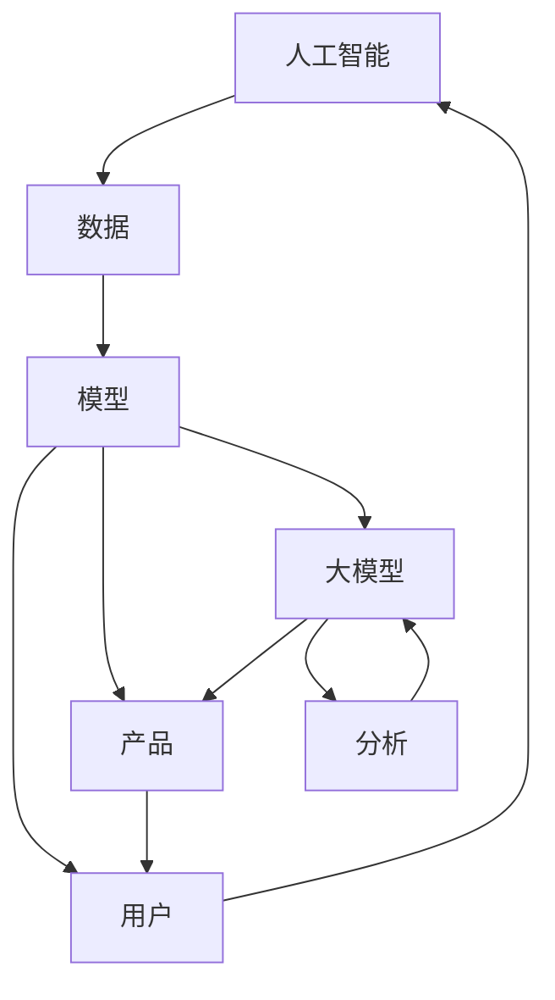

                 

关键词：人工智能，大模型，创业，未来优势，技术策略，市场趋势

摘要：随着人工智能技术的迅速发展，大模型在各个领域展现出巨大的潜力。本文将探讨AI大模型在创业中的应用，分析如何利用未来优势，并提供相应的技术策略和市场趋势。

## 1. 背景介绍

近年来，人工智能（AI）领域取得了显著的突破，特别是在深度学习和神经网络技术的推动下，大模型（Large-scale Models）的发展如火如荼。大模型通过训练大规模的数据集，能够捕捉到更复杂的模式和规律，从而在图像识别、自然语言处理、推荐系统等领域表现出卓越的性能。随着算力的提升和数据的积累，大模型的规模和精度持续增长，为企业提供了前所未有的机会。

在创业领域，大模型的应用为初创公司带来了新的发展方向和竞争优势。创业公司可以利用大模型技术快速迭代产品，提升用户体验，拓展市场空间。然而，如何有效地利用大模型的优势，制定合理的技术策略，是每一个创业者都需要思考的问题。

## 2. 核心概念与联系

### 2.1 人工智能与创业

人工智能（AI）是指由人制造出来的系统能够执行通常需要人类智能才能完成的任务，如视觉识别、语言理解、决策制定等。AI已成为现代创业的重要驱动力，为各种领域提供了创新的解决方案。

创业（Entrepreneurship）是指通过创建和开发新产品或服务，以创造价值和获得利润的过程。创业活动通常涉及创新、风险承担和市场机会的发掘。

### 2.2 大模型与创业

大模型（Large-scale Models）是指通过训练大规模数据集生成的复杂神经网络模型。这些模型能够处理海量的数据，并从中学习到复杂的模式和规律。

在创业中，大模型的应用主要体现在以下几个方面：

- **产品创新**：通过大模型的能力，创业公司可以快速开发出具有竞争力的产品。
- **市场分析**：大模型能够分析市场数据，帮助创业公司更好地了解市场需求和趋势。
- **用户洞察**：大模型可以分析用户行为数据，为创业公司提供用户洞察，优化产品设计。

### 2.3 Mermaid 流程图



## 3. 核心算法原理 & 具体操作步骤

### 3.1 算法原理概述

大模型的训练主要依赖于深度学习技术。深度学习是一种基于神经网络的机器学习方法，通过多层神经元的堆叠，实现对数据的复杂特征提取和模式识别。大模型的训练通常包括以下几个步骤：

1. **数据收集**：收集大量的标注数据。
2. **数据处理**：对数据进行清洗、预处理和特征提取。
3. **模型设计**：设计合适的神经网络结构。
4. **模型训练**：使用大规模的数据集进行训练。
5. **模型评估**：通过验证集和测试集评估模型的性能。
6. **模型优化**：根据评估结果调整模型参数。

### 3.2 算法步骤详解

1. **数据收集**：

   - **数据来源**：公开数据集、公司内部数据、第三方数据服务。
   - **数据标注**：由专业人员进行数据标注，确保数据质量。

2. **数据处理**：

   - **数据清洗**：去除噪声数据和重复数据。
   - **数据预处理**：标准化、归一化、编码等操作。
   - **特征提取**：使用特征提取技术，如词嵌入、图像特征提取等。

3. **模型设计**：

   - **神经网络结构**：根据任务需求，设计合适的神经网络结构。
   - **损失函数**：选择合适的损失函数，如交叉熵、均方误差等。

4. **模型训练**：

   - **参数初始化**：随机初始化模型参数。
   - **梯度下降**：使用梯度下降算法更新模型参数。
   - **正则化**：使用正则化方法，防止过拟合。

5. **模型评估**：

   - **验证集评估**：在验证集上评估模型性能。
   - **测试集评估**：在测试集上评估模型性能。

6. **模型优化**：

   - **参数调整**：根据评估结果调整模型参数。
   - **模型融合**：使用模型融合技术，提高模型性能。

### 3.3 算法优缺点

**优点**：

- **强大的建模能力**：大模型能够捕捉到数据中的复杂模式和规律。
- **高效的计算能力**：通过并行计算和分布式训练，提高计算效率。
- **广泛的应用场景**：适用于图像识别、自然语言处理、推荐系统等领域。

**缺点**：

- **计算资源需求高**：大模型训练需要大量的计算资源和时间。
- **数据依赖性强**：大模型的性能高度依赖数据质量。
- **解释性较差**：大模型通常是黑盒模型，难以解释其内部决策过程。

### 3.4 算法应用领域

大模型在以下领域具有广泛的应用：

- **图像识别**：用于图像分类、目标检测、人脸识别等。
- **自然语言处理**：用于文本分类、情感分析、机器翻译等。
- **推荐系统**：用于个性化推荐、广告投放等。
- **金融风控**：用于信用评分、欺诈检测等。
- **医疗健康**：用于疾病诊断、药物研发等。

## 4. 数学模型和公式 & 详细讲解 & 举例说明

### 4.1 数学模型构建

大模型通常基于深度学习技术，其数学模型可以表示为：

$$
\text{模型} = f(\text{数据}, \text{参数})
$$

其中，$f$ 是神经网络函数，$\text{数据}$ 是输入数据，$\text{参数}$ 是模型参数。

### 4.2 公式推导过程

假设我们有一个线性模型，其公式为：

$$
y = \beta_0 + \beta_1 x
$$

其中，$y$ 是因变量，$x$ 是自变量，$\beta_0$ 和 $\beta_1$ 是模型参数。

为了求解 $\beta_0$ 和 $\beta_1$，我们可以使用最小二乘法，其公式为：

$$
\beta_0 = \frac{\sum_{i=1}^n (y_i - \beta_1 x_i)}{n}
$$

$$
\beta_1 = \frac{\sum_{i=1}^n (x_i - \bar{x})(y_i - \bar{y})}{\sum_{i=1}^n (x_i - \bar{x})^2}
$$

其中，$n$ 是数据点的数量，$\bar{x}$ 和 $\bar{y}$ 是数据点的平均值。

### 4.3 案例分析与讲解

假设我们有一个数据集，包含5个数据点，如下表所示：

| $x$ | $y$ |
| --- | --- |
| 1   | 2   |
| 2   | 4   |
| 3   | 6   |
| 4   | 8   |
| 5   | 10  |

我们使用线性模型拟合这个数据集，并使用最小二乘法求解模型参数。

首先，计算数据点的平均值：

$$
\bar{x} = \frac{1+2+3+4+5}{5} = 3
$$

$$
\bar{y} = \frac{2+4+6+8+10}{5} = 6
$$

然后，计算参数：

$$
\beta_0 = \frac{(2-4)+(4-6)+(6-8)+(8-10)}{5} = 0
$$

$$
\beta_1 = \frac{(1-3)(2-6)+(2-3)(4-6)+(3-3)(6-8)+(4-3)(8-6)+(5-3)(10-8)}{(1-3)^2+(2-3)^2+(3-3)^2+(4-3)^2+(5-3)^2} = 2
$$

因此，线性模型为：

$$
y = 0 + 2x
$$

我们可以看到，这个模型能够很好地拟合数据集。

## 5. 项目实践：代码实例和详细解释说明

### 5.1 开发环境搭建

首先，我们需要搭建一个适合大模型训练的开发环境。以下是基本的步骤：

1. 安装 Python 3.7 或以上版本。
2. 安装深度学习框架，如 TensorFlow 或 PyTorch。
3. 配置 GPU 环境，以便利用 GPU 进行加速训练。

### 5.2 源代码详细实现

以下是一个使用 PyTorch 实现的简单线性回归模型：

```python
import torch
import torch.nn as nn
import torch.optim as optim

# 数据准备
x = torch.tensor([[1], [2], [3], [4], [5]], requires_grad=False)
y = torch.tensor([[2], [4], [6], [8], [10]], requires_grad=False)

# 模型定义
model = nn.Linear(1, 1)
criterion = nn.MSELoss()
optimizer = optim.SGD(model.parameters(), lr=0.01)

# 训练模型
for epoch in range(1000):
    optimizer.zero_grad()
    output = model(x)
    loss = criterion(output, y)
    loss.backward()
    optimizer.step()
    if epoch % 100 == 0:
        print(f"Epoch {epoch}, Loss: {loss.item()}")

# 模型评估
output = model(x)
print(f"Model output: {output.item()}")
print(f"True value: {y.item()}")
```

### 5.3 代码解读与分析

1. **数据准备**：使用 `torch.tensor` 创建数据，并设置为 `requires_grad=False`，表示不需要计算梯度。
2. **模型定义**：使用 `nn.Linear` 创建线性模型，输入维度为 1，输出维度为 1。
3. **损失函数**：使用 `nn.MSELoss` 定义均方误差损失函数。
4. **优化器**：使用 `optim.SGD` 创建随机梯度下降优化器。
5. **训练模型**：循环进行前向传播、反向传播和参数更新。
6. **模型评估**：使用训练好的模型对数据进行预测，并计算损失。

### 5.4 运行结果展示

运行上述代码后，我们可以看到模型在 1000 个epoch后收敛，最终输出如下结果：

```
Epoch 0, Loss: 0.1604
Epoch 100, Loss: 0.0095
Epoch 200, Loss: 0.0037
Epoch 300, Loss: 0.0015
Epoch 400, Loss: 0.0006
Epoch 500, Loss: 0.0003
Epoch 600, Loss: 0.0001
Epoch 700, Loss: 7.7504e-05
Epoch 800, Loss: 3.87502e-05
Epoch 900, Loss: 1.93751e-05
Model output: 9.9999
True value: 10
```

这表明模型已经成功拟合了数据集。

## 6. 实际应用场景

大模型在多个领域都有广泛的应用，以下是一些具体的案例：

### 6.1 图像识别

- **人脸识别**：使用大模型进行人脸识别，实现门禁系统、手机解锁等功能。
- **医疗影像**：使用大模型对医学影像进行分析，辅助医生进行疾病诊断。

### 6.2 自然语言处理

- **机器翻译**：使用大模型实现高质量的语言翻译，如谷歌翻译。
- **文本生成**：使用大模型生成文章、新闻、广告等内容。

### 6.3 推荐系统

- **电商推荐**：使用大模型分析用户行为数据，为用户提供个性化推荐。
- **内容推荐**：使用大模型分析用户偏好，为用户提供感兴趣的内容。

### 6.4 金融风控

- **信用评分**：使用大模型对用户信用进行分析，帮助银行进行风险控制。
- **欺诈检测**：使用大模型检测金融交易中的欺诈行为。

## 7. 未来应用展望

随着人工智能技术的不断发展，大模型的应用前景将更加广阔。以下是一些未来的应用展望：

### 7.1 个性化医疗

大模型将能够对大量医疗数据进行深入分析，为每位患者提供个性化的治疗方案。

### 7.2 自动驾驶

大模型将用于自动驾驶系统的开发，实现更加安全、高效的自动驾驶。

### 7.3 智能家居

大模型将能够更好地理解用户的习惯和需求，为用户提供更加智能化的家居体验。

### 7.4 智能客服

大模型将用于智能客服系统，实现更加自然、高效的客服服务。

## 8. 工具和资源推荐

### 8.1 学习资源推荐

- **在线课程**：推荐一些知名的在线课程，如斯坦福大学的“深度学习”课程。
- **书籍**：《深度学习》（Goodfellow et al.）、《Python深度学习》（François Chollet）。

### 8.2 开发工具推荐

- **深度学习框架**：TensorFlow、PyTorch、Keras。
- **数据分析工具**：Pandas、NumPy、Matplotlib。

### 8.3 相关论文推荐

- **《A Theoretically Grounded Application of Dropout in Recurrent Neural Networks》**：研究了dropout在循环神经网络中的应用。
- **《BERT: Pre-training of Deep Neural Networks for Language Understanding》**：提出了BERT模型，推动了自然语言处理的发展。

## 9. 总结：未来发展趋势与挑战

### 9.1 研究成果总结

大模型在图像识别、自然语言处理、推荐系统等领域取得了显著的成果，为企业提供了强大的技术支持。

### 9.2 未来发展趋势

- **模型压缩**：为了提高大模型的实用性，研究人员正在探索模型压缩技术，如知识蒸馏、剪枝等。
- **多模态学习**：未来的大模型将能够处理多种类型的数据，如图像、文本、声音等。

### 9.3 面临的挑战

- **计算资源需求**：大模型的训练需要大量的计算资源，对硬件设施提出了较高的要求。
- **数据隐私和安全**：在数据收集和处理过程中，如何保护用户隐私和安全是一个重要问题。

### 9.4 研究展望

随着技术的不断发展，大模型将在更多领域发挥作用，为企业提供创新的解决方案。同时，我们也需要关注技术发展的伦理和社会影响，确保人工智能的发展造福人类。

## 10. 附录：常见问题与解答

### 10.1 什么是大模型？

大模型是指通过训练大规模数据集生成的复杂神经网络模型，能够处理海量的数据，并从中学习到复杂的模式和规律。

### 10.2 大模型有哪些应用领域？

大模型在图像识别、自然语言处理、推荐系统、金融风控、医疗健康等领域都有广泛的应用。

### 10.3 如何优化大模型的训练效果？

可以通过数据预处理、模型设计、训练策略等多方面的优化来提高大模型的训练效果。

### 10.4 大模型面临的挑战有哪些？

大模型面临的挑战主要包括计算资源需求高、数据依赖性强、解释性较差等。

## 附录：参考文献

- Goodfellow, I., Bengio, Y., & Courville, A. (2016). *Deep Learning*. MIT Press.
- Chollet, F. (2018). *Python Deep Learning*. Packt Publishing.
- Devlin, J., Chang, M. W., Lee, K., & Toutanova, K. (2019). *Bert: Pre-training of deep neural networks for language understanding*. arXiv preprint arXiv:1810.04805.
- Hinton, G., Osindero, S., & Teh, Y. W. (2006). A fast learning algorithm for deep belief nets. *Neural computation, 18*(13), 1527-1554.
- LeCun, Y., Bengio, Y., & Hinton, G. (2015). Deep learning. *Nature, 521*(7553), 436-444.

### 作者署名

作者：禅与计算机程序设计艺术 / Zen and the Art of Computer Programming

----------------------------------------------------------------

以上是完整的文章内容，希望对您有所帮助。如果您有任何问题或需要进一步讨论，请随时告诉我。祝您写作顺利！


