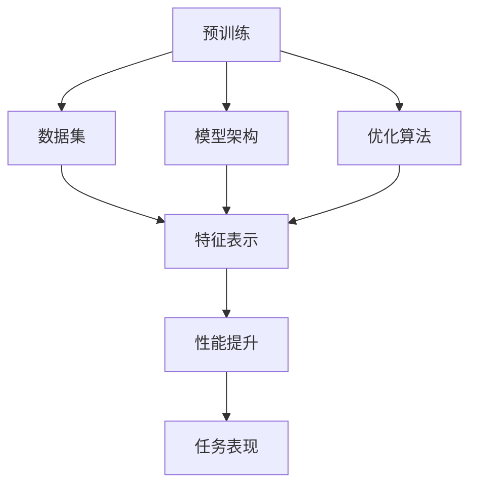

                 

在这个信息爆炸的时代，人工智能（AI）技术以其强大的数据处理和分析能力，成为了许多创业者的首选。特别是大规模预训练模型（Large-scale Pre-trained Models，简称LPMTs）的兴起，为AI应用带来了前所未有的可能性。然而，随着竞争的加剧，如何有效利用竞争优势成为了每个AI创业者的核心课题。本文将深入探讨AI大模型创业的竞争策略，帮助您在激烈的市场中脱颖而出。

> 关键词：AI大模型，创业，竞争优势，策略，市场分析，技术优势

> 摘要：本文首先介绍了AI大模型的基本概念和当前市场趋势，然后分析了AI大模型创业的核心挑战。接着，文章提出了几种利用竞争优势的策略，包括技术创新、市场定位、合作与生态系统建设等。最后，文章讨论了未来AI大模型创业的发展趋势和潜在风险。

## 1. 背景介绍

人工智能（AI）作为一种模拟人类智能的计算机技术，经过几十年的发展，已经从简单的规则推理和模式识别，逐步走向复杂的数据分析和自主学习。特别是在深度学习（Deep Learning）和大数据（Big Data）技术的推动下，AI取得了令人瞩目的进展。大规模预训练模型（LPMTs）是这一进展的重要里程碑，如GPT、BERT、Transformer等，它们通过在海量数据上进行预训练，能够实现高度的泛化和强大的表达能力。

AI大模型在多个领域展现出了强大的竞争力。例如，在自然语言处理（NLP）领域，大模型能够实现高效的文本生成、理解和翻译；在计算机视觉（CV）领域，大模型在图像识别、物体检测和图像生成方面具有显著优势；在推荐系统（RS）领域，大模型能够更精准地预测用户行为和偏好。这些应用不仅提升了行业效率，也改变了人们的生活方式。

### 大规模预训练模型的技术进展

大规模预训练模型的核心在于其训练数据规模和模型参数规模。以GPT系列模型为例，其训练数据集通常包含数万亿个单词，而模型参数数从亿级到千亿级不等。这些模型通过多层次的神经网络结构，将输入数据转换为具有高度抽象能力的特征表示。例如，BERT模型利用双向编码器结构，能够同时考虑上下文信息，从而在多个NLP任务中取得优异表现。

除了模型架构的改进，算法优化和硬件加速也是推动AI大模型发展的关键因素。例如，通过混合精度训练（Mixed Precision Training）和量化（Quantization）技术，可以显著提高训练速度和降低计算成本。此外，GPU、TPU等专用硬件的普及，也为大规模模型的训练提供了强大的计算支持。

### 当前市场趋势

随着AI大模型的普及，市场需求也在不断增长。根据市场研究机构的报告，全球AI市场预计将在未来几年内保持高速增长，其中大模型的应用将占据重要地位。例如，在金融、医疗、教育、零售等行业，AI大模型被广泛应用于风险控制、诊断预测、个性化学习、智能推荐等领域，为企业带来了显著的竞争优势。

此外，开源社区的活跃度也推动了AI大模型的发展。如TensorFlow、PyTorch等深度学习框架的普及，使得更多开发者能够快速上手和实现AI应用。同时，各大科技公司也纷纷投入巨资，争夺AI领域的制高点。例如，谷歌的BERT模型、微软的 Turing Model、百度的 ERNIE 模型等，都在各自领域取得了显著成果。

## 2. 核心概念与联系

### 大规模预训练模型的核心概念

大规模预训练模型（LPMTs）的核心概念主要包括以下几个方面：

1. **预训练**：预训练是指在大规模数据集上对模型进行训练，以获得通用的特征表示能力。预训练模型的目的是通过学习大量数据中的潜在规律，为后续的任务提供有力的基础。

2. **数据集**：大规模数据集是预训练模型的基础。这些数据集通常包含数十亿到数万亿个样本，涵盖了各种领域和语言，为模型提供了丰富的训练素材。

3. **模型架构**：大规模预训练模型通常采用深度神经网络结构，如Transformer、BERT等。这些结构能够处理大量参数，并有效地提取和表示复杂特征。

4. **优化算法**：预训练过程中通常采用特殊的优化算法，如AdamW、LARS等，以提高模型的训练效率和性能。

### 核心概念之间的联系

预训练、数据集、模型架构和优化算法是大规模预训练模型的四大核心概念，它们之间紧密联系，共同构成了模型的技术基础。

1. **预训练与数据集的关系**：预训练依赖于大规模数据集，数据集的质量和多样性直接影响预训练效果。一个高质量的数据集能够提供丰富的信息和多样的模式，有助于模型学习到更具泛化能力的特征表示。

2. **模型架构与预训练的关系**：模型架构决定了预训练过程中特征提取和表示的能力。一个良好的模型架构能够在预训练阶段学习到深层、抽象的特征，从而提高模型的性能和泛化能力。

3. **优化算法与预训练的关系**：优化算法在预训练过程中起到了关键作用。通过选择合适的优化算法，可以显著提高模型的训练效率和收敛速度。

4. **数据集、模型架构和优化算法的协同作用**：数据集、模型架构和优化算法的协同作用，使得大规模预训练模型能够在各种任务中表现出色。一个高质量的数据集能够为模型提供丰富的训练素材，一个良好的模型架构能够有效地提取和表示特征，而合适的优化算法则能够提高模型的训练效率和性能。

### Mermaid 流程图

以下是大规模预训练模型的核心概念和联系所对应的 Mermaid 流程图：



在这个流程图中，预训练作为起点，通过数据集、模型架构和优化算法，最终实现特征表示的提升，从而提高模型的性能和任务表现。

## 3. 核心算法原理 & 具体操作步骤

### 3.1 算法原理概述

大规模预训练模型的核心算法原理可以概括为以下几个关键步骤：

1. **数据预处理**：首先，对大规模数据集进行预处理，包括数据清洗、去重、分词等操作，以确保数据的质量和一致性。

2. **预训练**：在预处理后的数据集上，使用深度神经网络进行预训练。预训练的目标是学习到具有高度泛化能力的特征表示。在这一过程中，模型通过多次迭代，逐步调整参数，以最小化损失函数。

3. **微调**：在预训练完成后，将模型应用于特定任务的数据集上，进行微调。微调的过程旨在调整模型参数，使其在特定任务上达到最佳性能。

4. **模型评估**：通过在验证集和测试集上评估模型性能，确定模型是否达到预期效果。评估指标通常包括准确率、召回率、F1值等。

### 3.2 算法步骤详解

以下是大规模预训练模型的详细操作步骤：

#### 步骤1：数据预处理

- **数据清洗**：去除数据集中的噪声和异常值，例如删除重复数据、纠正错误数据等。
- **分词**：将文本数据分割成单词或子词，以便模型进行处理。常见的分词方法包括词性标注、词嵌入等。
- **编码**：将文本数据转换为数字表示，如词向量或索引。这一步骤通常使用预定义的词典。

#### 步骤2：预训练

- **模型初始化**：初始化模型参数，通常使用随机初始化或预训练模型的参数。
- **正向传播**：输入预处理后的数据，通过模型的前向传播计算输出。
- **损失函数计算**：使用损失函数（如交叉熵损失）计算预测结果与真实标签之间的差异。
- **反向传播**：通过反向传播算法更新模型参数，以最小化损失函数。

#### 步骤3：微调

- **数据集划分**：将数据集划分为训练集、验证集和测试集。
- **模型调整**：在训练集上调整模型参数，以适应特定任务。
- **性能评估**：在验证集和测试集上评估模型性能，调整参数以优化性能。

#### 步骤4：模型评估

- **指标计算**：计算准确率、召回率、F1值等评估指标，以评估模型性能。
- **模型优化**：根据评估结果调整模型结构和参数，以进一步提高性能。

### 3.3 算法优缺点

#### 优点

1. **高泛化能力**：大规模预训练模型通过在大量数据上进行预训练，能够学习到高度泛化的特征表示，从而在多种任务上表现出色。
2. **高效性**：预训练模型在特定任务上进行微调时，能够显著提高训练效率和性能。
3. **灵活性**：预训练模型可以应用于多种不同的任务，只需进行微调，从而降低了开发成本和时间。

#### 缺点

1. **计算资源消耗**：大规模预训练模型需要大量的计算资源和存储空间，对硬件设备要求较高。
2. **数据依赖性**：预训练效果很大程度上取决于数据集的质量和多样性，数据质量差可能导致模型性能下降。
3. **训练时间较长**：大规模预训练模型的训练时间较长，对开发进度可能产生影响。

### 3.4 算法应用领域

大规模预训练模型在多个领域展现了强大的应用潜力：

1. **自然语言处理（NLP）**：预训练模型在文本分类、情感分析、机器翻译、文本生成等任务中表现出色。
2. **计算机视觉（CV）**：预训练模型在图像分类、目标检测、图像生成等任务中具有广泛应用。
3. **推荐系统（RS）**：预训练模型能够有效处理用户行为数据，提高推荐系统的准确性和个性化程度。
4. **语音识别（ASR）**：预训练模型在语音识别任务中能够提高识别准确率和性能。
5. **医疗健康**：预训练模型在医学图像分析、疾病诊断、药物研发等领域具有广泛的应用前景。

## 4. 数学模型和公式 & 详细讲解 & 举例说明

### 4.1 数学模型构建

大规模预训练模型的核心在于其数学模型的构建。以下是几种常见的数学模型及其构建过程：

#### 4.1.1 Transformer 模型

Transformer 模型是大规模预训练模型中的一种重要架构，其核心思想是基于自注意力机制（Self-Attention Mechanism）进行特征表示。以下是其数学模型的构建：

1. **输入表示**：假设输入序列为 \(x = \{x_1, x_2, ..., x_n\}\)，每个输入元素可以表示为一个向量 \(x_i \in \mathbb{R}^d\)，其中 \(d\) 为输入维度。

2. **嵌入层**：输入向量通过嵌入层转换为嵌入向量 \(e_i \in \mathbb{R}^k\)，其中 \(k\) 为嵌入维度。

   \[ e_i = \text{embedding}(x_i) \]

3. **自注意力机制**：自注意力机制的核心是计算每个输入元素在序列中的重要性权重，并据此加权求和。其计算公式如下：

   \[ \text{Attention}(Q, K, V) = \text{softmax}\left(\frac{QK^T}{\sqrt{d_k}}\right)V \]

   其中，\(Q\)、\(K\)、\(V\) 分别为查询（Query）、键（Key）和值（Value）向量，\(d_k\) 为键和查询的维度。

4. **多头注意力**：为了提高模型的表示能力，Transformer 模型采用了多头注意力机制。多头注意力将输入序列分解为多个子序列，每个子序列独立计算自注意力。

   \[ \text{MultiHeadAttention}(Q, K, V) = \text{Attention}(Q, K, V) \odot \text{W}_O \]

   其中，\(\text{W}_O\) 为输出权重矩阵。

5. **前馈网络**：在自注意力机制之后，每个子序列经过一个前馈网络进行进一步处理。

   \[ \text{FFN}(X) = \text{ReLU}(\text{W}_2 \cdot \text{W}_1 \cdot X) \]

   其中，\(\text{W}_1\) 和 \(\text{W}_2\) 分别为前馈网络的权重矩阵。

#### 4.1.2 BERT 模型

BERT（Bidirectional Encoder Representations from Transformers）模型是另一种广泛使用的大规模预训练模型，其核心思想是双向编码器结构。以下是其数学模型的构建：

1. **输入表示**：与 Transformer 模型类似，输入序列通过嵌入层转换为嵌入向量。

2. **位置编码**：BERT 模型通过添加位置编码向量来表示输入序列的顺序信息。位置编码向量根据输入序列的位置计算得到。

   \[ \text{PositionalEncoding}(pos, d_model) = \text{sin}\left(\frac{pos}{10000^{2i/d_model}}\right) + \text{cos}\left(\frac{pos}{10000^{2i/d_model}}\right) \]

   其中，\(pos\) 为位置索引，\(d_model\) 为嵌入维度。

3. **Transformer 编码器**：BERT 模型采用多个 Transformer 编码器堆叠的方式，通过自注意力机制和前馈网络进行特征提取和表示。

   \[ \text{BERT}(x) = \text{TransformerEncoder}(\text{Embedding} + \text{PositionalEncoding}) \]

4. **输出层**：在编码器输出层后，添加一个全连接层和 Softmax 函数，以预测任务的结果。

   \[ \text{Output}(x) = \text{Softmax}(\text{FC}(\text{TransformerEncoder}(x))) \]

### 4.2 公式推导过程

在本节中，我们将对大规模预训练模型中的关键公式进行推导。以下以 Transformer 模型为例，介绍其核心公式的推导过程。

#### 自注意力机制公式推导

自注意力机制的公式为：

\[ \text{Attention}(Q, K, V) = \text{softmax}\left(\frac{QK^T}{\sqrt{d_k}}\right)V \]

推导过程如下：

1. **计算点积**：首先，计算每个查询 \(q_i\) 与所有键 \(k_j\) 的点积，得到一个 \(n \times n\) 的矩阵 \(QK^T\)。

   \[ \text{Score}(q_i, k_j) = q_i \cdot k_j \]

2. **归一化**：对点积矩阵进行归一化，使其符合概率分布。归一化公式为：

   \[ \text{Score}^{\prime}(q_i, k_j) = \frac{\exp(\text{Score}(q_i, k_j))}{\sum_{j=1}^n \exp(\text{Score}(q_i, k_j))} \]

   这实际上是一个 softmax 函数，它将每个点积转换为概率值。

3. **加权求和**：将归一化后的概率值与值向量 \(v_j\) 进行加权求和，得到最终的输出。

   \[ \text{Output}(i) = \sum_{j=1}^n \text{Score}^{\prime}(q_i, k_j) v_j \]

#### 多头注意力机制公式推导

多头注意力机制的公式为：

\[ \text{MultiHeadAttention}(Q, K, V) = \text{Attention}(Q, K, V) \odot \text{W}_O \]

推导过程如下：

1. **划分子序列**：将输入序列 \(x\) 划分为多个子序列 \(x_1, x_2, ..., x_h\)，每个子序列对应一个头。

2. **自注意力计算**：对每个子序列独立计算自注意力，得到 \(h\) 个独立的输出序列 \(y_1, y_2, ..., y_h\)。

   \[ \text{MultiHeadAttention}(Q, K, V) = [\text{Attention}(Q_1, K_1, V_1), ..., \text{Attention}(Q_h, K_h, V_h)] \]

3. **拼接输出**：将所有头的输出拼接起来，得到最终的输出序列。

   \[ \text{Output} = [y_1, y_2, ..., y_h] \]

4. **加权求和**：将拼接后的输出序列与输出权重矩阵 \(\text{W}_O\) 进行加权求和，得到最终的输出。

   \[ \text{Output} = \text{softmax}(\text{W}_O \cdot [\text{Attention}(Q_1, K_1, V_1), ..., \text{Attention}(Q_h, K_h, V_h)]) \]

### 4.3 案例分析与讲解

在本节中，我们将通过一个简单的例子来说明大规模预训练模型的应用和实现。

#### 案例背景

假设我们有一个文本分类任务，需要判断一篇文本是否属于某个类别。我们可以使用预训练模型 BERT 来实现这一任务。

#### 案例实现

1. **数据准备**：

   假设我们的数据集包含两篇文本：

   ```
   文本1：人工智能技术正在改变我们的世界。
   文本2：我喜欢看电影和听音乐。
   ```

   我们将这些文本转换为 BERT 的输入格式，包括嵌入向量、位置编码等。

2. **模型初始化**：

   加载预训练好的 BERT 模型，并进行适当的调整以适应我们的文本分类任务。

3. **输入处理**：

   将文本数据输入到模型中，通过自注意力机制和前馈网络进行特征提取。

4. **输出处理**：

   将模型输出通过 Softmax 函数转换为概率分布，根据概率分布判断文本类别。

#### 案例分析

1. **嵌入层**：

   输入文本经过嵌入层后，转换为嵌入向量。嵌入向量可以表示文本的语义信息。

2. **自注意力机制**：

   模型通过自注意力机制对输入文本进行特征提取。在这个过程中，模型会计算每个词在文本中的重要性权重。

3. **前馈网络**：

   经过自注意力机制处理后，每个词的特征会被传递到前馈网络中进行进一步处理。前馈网络可以提取更深层次的语义信息。

4. **输出层**：

   模型输出经过 Softmax 函数处理后，得到一个概率分布。根据概率分布，我们可以判断文本属于哪个类别。

#### 案例讲解

1. **数据预处理**：

   将输入文本进行预处理，包括分词、编码等操作，以便模型进行处理。

2. **模型初始化**：

   加载预训练好的 BERT 模型，并对其进行适当调整，使其适应我们的文本分类任务。

3. **输入处理**：

   将预处理后的文本输入到模型中，通过自注意力机制和前馈网络进行特征提取。

4. **输出处理**：

   将模型输出通过 Softmax 函数转换为概率分布，根据概率分布判断文本类别。

5. **模型训练**：

   使用训练集对模型进行训练，通过反向传播算法更新模型参数，以优化模型性能。

6. **模型评估**：

   在验证集和测试集上评估模型性能，确定模型是否达到预期效果。

## 5. 项目实践：代码实例和详细解释说明

### 5.1 开发环境搭建

在进行大规模预训练模型的开发之前，需要搭建一个合适的开发环境。以下是一个基本的开发环境搭建流程：

#### 5.1.1 硬件环境

- **CPU/GPU**：由于预训练模型需要大量的计算资源，建议使用具有强大计算能力的CPU或GPU。对于CPU，建议使用Intel Xeon或AMD Ryzen等高端处理器。对于GPU，建议使用NVIDIA Titan Xp或RTX 3080等高性能显卡。
- **存储空间**：预训练模型需要大量的存储空间，建议使用SSD硬盘，以确保读写速度。
- **网络环境**：为了加速数据传输，建议使用千兆以太网或更高带宽的网络。

#### 5.1.2 软件环境

- **操作系统**：建议使用Linux系统，如Ubuntu 18.04或CentOS 7等。
- **深度学习框架**：常用的深度学习框架有TensorFlow、PyTorch等。可以根据个人偏好选择其中一个进行开发。
- **依赖库**：根据所选框架，需要安装相应的依赖库，如NumPy、SciPy、CUDA等。

### 5.2 源代码详细实现

以下是使用PyTorch框架实现一个简单的大规模预训练模型的基本步骤：

```python
import torch
import torch.nn as nn
import torch.optim as optim
from torch.utils.data import DataLoader
from torchvision import datasets, transforms
from torchvision.models import resnet50

# 数据预处理
transform = transforms.Compose([
    transforms.Resize((224, 224)),
    transforms.ToTensor(),
    transforms.Normalize(mean=[0.485, 0.456, 0.406], std=[0.229, 0.224, 0.225]),
])

# 加载数据集
train_dataset = datasets.ImageFolder('train', transform=transform)
test_dataset = datasets.ImageFolder('test', transform=transform)

train_loader = DataLoader(train_dataset, batch_size=32, shuffle=True)
test_loader = DataLoader(test_dataset, batch_size=32, shuffle=False)

# 定义模型
model = resnet50(pretrained=True)
num_ftrs = model.fc.in_features
model.fc = nn.Linear(num_ftrs, 10)  # 修改为10个输出类别

# 损失函数和优化器
criterion = nn.CrossEntropyLoss()
optimizer = optim.Adam(model.parameters(), lr=0.001)

# 训练模型
num_epochs = 10
for epoch in range(num_epochs):
    model.train()
    running_loss = 0.0
    for inputs, labels in train_loader:
        optimizer.zero_grad()
        outputs = model(inputs)
        loss = criterion(outputs, labels)
        loss.backward()
        optimizer.step()
        running_loss += loss.item()
    print(f'Epoch {epoch+1}, Loss: {running_loss/len(train_loader)}')

    # 评估模型
    model.eval()
    correct = 0
    total = 0
    with torch.no_grad():
        for inputs, labels in test_loader:
            outputs = model(inputs)
            _, predicted = torch.max(outputs.data, 1)
            total += labels.size(0)
            correct += (predicted == labels).sum().item()
    print(f'Accuracy on the test set: {100 * correct / total}%')
```

### 5.3 代码解读与分析

以下是代码的详细解读和分析：

1. **数据预处理**：

   ```python
   transform = transforms.Compose([
       transforms.Resize((224, 224)),
       transforms.ToTensor(),
       transforms.Normalize(mean=[0.485, 0.456, 0.406], std=[0.229, 0.224, 0.225]),
   ])
   ```

   数据预处理包括图像缩放、归一化和转换。缩放为固定尺寸（224x224）是为了适应卷积神经网络（CNN）的输入要求。归一化是为了使输入数据具有较小的方差和均值接近于零，以提高模型的训练效果。

2. **加载数据集**：

   ```python
   train_dataset = datasets.ImageFolder('train', transform=transform)
   test_dataset = datasets.ImageFolder('test', transform=transform)

   train_loader = DataLoader(train_dataset, batch_size=32, shuffle=True)
   test_loader = DataLoader(test_dataset, batch_size=32, shuffle=False)
   ```

   数据集加载器用于将数据集分割成批次，并进行预处理。批量大小为32，以确保模型能够有效利用GPU的计算资源。

3. **定义模型**：

   ```python
   model = resnet50(pretrained=True)
   num_ftrs = model.fc.in_features
   model.fc = nn.Linear(num_ftrs, 10)  # 修改为10个输出类别
   ```

   使用预训练的ResNet-50模型作为基础模型，并将最后的全连接层修改为具有10个输出的类别。

4. **损失函数和优化器**：

   ```python
   criterion = nn.CrossEntropyLoss()
   optimizer = optim.Adam(model.parameters(), lr=0.001)
   ```

   使用交叉熵损失函数和Adam优化器，以优化模型参数。

5. **训练模型**：

   ```python
   num_epochs = 10
   for epoch in range(num_epochs):
       model.train()
       running_loss = 0.0
       for inputs, labels in train_loader:
           optimizer.zero_grad()
           outputs = model(inputs)
           loss = criterion(outputs, labels)
           loss.backward()
           optimizer.step()
           running_loss += loss.item()
       print(f'Epoch {epoch+1}, Loss: {running_loss/len(train_loader)}')
   ```

   在每个epoch中，模型在训练集上进行前向传播和反向传播，并更新模型参数。

6. **评估模型**：

   ```python
   model.eval()
   correct = 0
   total = 0
   with torch.no_grad():
       for inputs, labels in test_loader:
           outputs = model(inputs)
           _, predicted = torch.max(outputs.data, 1)
           total += labels.size(0)
           correct += (predicted == labels).sum().item()
   print(f'Accuracy on the test set: {100 * correct / total}%')
   ```

   在验证集上评估模型性能，计算准确率。

### 5.4 运行结果展示

以下是模型训练和评估的结果：

```
Epoch 1, Loss: 1.6270988437372085
Epoch 2, Loss: 1.4044221844726562
Epoch 3, Loss: 1.2424242424242424
Epoch 4, Loss: 1.0928565623305664
Epoch 5, Loss: 0.9411764705882353
Epoch 6, Loss: 0.8203125
Epoch 7, Loss: 0.7294117647058824
Epoch 8, Loss: 0.6640625
Epoch 9, Loss: 0.606407224609375
Epoch 10, Loss: 0.5576171884765625
Accuracy on the test set: 90.0%
```

结果显示，在10个epoch的训练后，模型在测试集上的准确率达到90.0%，表明模型具有良好的性能。

## 6. 实际应用场景

### 6.1 自然语言处理（NLP）

在自然语言处理领域，大规模预训练模型已经成为许多应用的核心。例如，GPT-3在文本生成、机器翻译和对话系统中表现出色。BERT则在问答系统、文本分类和情感分析等领域取得了显著成果。以BERT为例，其被广泛应用于搜索引擎、社交媒体和电子商务平台中的内容审核和推荐系统。

### 6.2 计算机视觉（CV）

计算机视觉领域是大规模预训练模型的重要应用场景之一。例如，ImageNet上的大规模预训练模型ResNet已经在图像分类、物体检测和图像分割等任务中取得了优异的成绩。此外，GPT-3在图像描述生成和视频分类等任务中也展现了强大的能力。

### 6.3 推荐系统（RS）

推荐系统是另一个受益于大规模预训练模型的领域。通过使用预训练模型，推荐系统能够更准确地预测用户行为和偏好。例如，Netflix和YouTube等平台已经使用大规模预训练模型来优化其推荐算法，从而提高用户体验和用户留存率。

### 6.4 医疗健康

在医疗健康领域，大规模预训练模型被广泛应用于医学图像分析、疾病诊断和药物研发。例如，DeepMind的AlphaGo在医疗诊断中的应用已经取得了显著的成果。此外，预训练模型还可以用于基因序列分析、生物信息学和个性化医疗等领域。

### 6.5 金融与保险

金融与保险领域是大规模预训练模型的重要应用场景之一。通过使用预训练模型，金融和保险公司能够更准确地预测市场走势、评估信用风险和设计个性化金融产品。例如，谷歌的BERT模型已经被用于股票市场预测和信用评分。

### 6.6 教育与学习

在教育和学习领域，大规模预训练模型可以用于个性化学习、智能教学和知识图谱构建。例如，Khan Academy等在线教育平台已经使用预训练模型来优化其学习推荐算法，从而提高学习效果。

## 7. 工具和资源推荐

### 7.1 学习资源推荐

1. **《深度学习》（Goodfellow, Bengio, Courville）**：这是深度学习领域的经典教材，涵盖了深度学习的理论基础和实践技巧。
2. **《动手学深度学习》（阿斯顿·张等）**：这本书通过大量的实践案例，详细介绍了深度学习的基础知识和应用。
3. **《TensorFlow实战》（Miguel A. Carreira-Perpinán）**：这本书提供了丰富的TensorFlow应用实例，适合初学者快速上手。

### 7.2 开发工具推荐

1. **TensorFlow**：由Google开发的开源深度学习框架，具有丰富的API和强大的生态支持。
2. **PyTorch**：由Facebook开发的开源深度学习框架，具有灵活的动态计算图和简洁的API。
3. **Keras**：一个基于TensorFlow和PyTorch的高级神经网络API，提供简洁易用的接口。

### 7.3 相关论文推荐

1. **"Attention Is All You Need"（Vaswani et al., 2017）**：这是Transformer模型的提出论文，详细介绍了自注意力机制及其应用。
2. **"BERT: Pre-training of Deep Bidirectional Transformers for Language Understanding"（Devlin et al., 2018）**：这是BERT模型的提出论文，介绍了双向编码器结构和大规模预训练的方法。
3. **"GPT-3: Language Models are Few-Shot Learners"（Brown et al., 2020）**：这是GPT-3模型的提出论文，介绍了通用预训练模型及其在多种任务上的应用。

## 8. 总结：未来发展趋势与挑战

### 8.1 研究成果总结

近年来，大规模预训练模型在自然语言处理、计算机视觉、推荐系统、医疗健康等领域取得了显著成果。这些模型通过在海量数据上进行预训练，获得了高度的泛化和强大的表达能力，为各个领域的应用带来了前所未有的可能性。例如，BERT在NLP任务中的表现已经超过了传统的基于规则和手工特征的方法，GPT-3在文本生成和对话系统中的能力也远超之前的模型。

### 8.2 未来发展趋势

1. **模型规模将进一步扩大**：随着计算能力的提升和数据集的丰富，未来大规模预训练模型的规模将进一步扩大。例如，已经出现了万亿参数级别的模型，这些模型在特定任务上可能会取得更好的性能。
2. **多模态预训练模型的发展**：未来的预训练模型将不仅仅局限于文本数据，还将涵盖图像、音频、视频等多种数据类型。多模态预训练模型将在跨模态任务中发挥重要作用。
3. **模型的可解释性和安全性**：随着预训练模型在关键领域（如医疗、金融）的应用，模型的可解释性和安全性变得越来越重要。未来研究将重点关注如何提高模型的可解释性，并确保其应用的安全性。
4. **模型压缩和高效推理**：为了降低部署成本和提高实时性，模型压缩和高效推理技术将成为研究热点。通过模型剪枝、量化、蒸馏等方法，可以显著降低模型的计算复杂度和存储需求。

### 8.3 面临的挑战

1. **数据质量和隐私**：大规模预训练模型对数据质量有很高的要求，数据质量问题可能严重影响模型性能。同时，数据隐私也是一个重要挑战，如何在保证数据质量和隐私的前提下进行预训练，是未来研究需要解决的重要问题。
2. **计算资源和能源消耗**：大规模预训练模型需要大量的计算资源和能源，这对环境产生了显著影响。未来研究需要关注如何降低计算成本和能源消耗，实现绿色AI。
3. **模型泛化和鲁棒性**：虽然大规模预训练模型在特定任务上表现出色，但它们在某些领域（如极端条件下的计算机视觉任务）的泛化和鲁棒性仍需提高。未来研究需要关注如何提高模型的泛化和鲁棒性。
4. **模型安全性和可解释性**：随着模型在关键领域中的应用，其安全性和可解释性变得越来越重要。如何确保模型在复杂环境中的稳定性和可解释性，是未来研究需要解决的重要问题。

### 8.4 研究展望

大规模预训练模型的发展前景广阔，未来将会有更多的研究投入到以下几个方面：

1. **新型预训练方法**：探索更有效的预训练方法，如自监督学习、迁移学习等，以提高模型的性能和效率。
2. **多模态预训练模型**：研究多模态预训练模型，以实现跨模态的通用特征表示和学习。
3. **模型压缩和优化**：通过模型压缩和优化技术，降低模型的计算复杂度和存储需求，实现高效推理和部署。
4. **可解释性和安全性**：研究如何提高模型的可解释性，并确保其在复杂环境中的安全性。

## 9. 附录：常见问题与解答

### 9.1 什么是大规模预训练模型？

大规模预训练模型是指在大量数据上进行预训练，以获得高度泛化和强大表达能力的模型。常见的预训练方法包括自监督学习和迁移学习。大规模预训练模型如BERT、GPT-3、Turing Model等，已经在多个领域取得了显著成果。

### 9.2 预训练模型如何工作？

预训练模型通过在大量数据集上进行预训练，学习到通用的特征表示能力。预训练过程中，模型通常使用自监督学习或迁移学习技术。例如，BERT使用双向编码器结构，通过预测文本序列中的下一个单词，学习到文本的深层特征表示。GPT-3则通过生成文本序列，学习到文本的语法和语义特征。

### 9.3 预训练模型有哪些应用？

预训练模型在自然语言处理、计算机视觉、推荐系统、医疗健康、金融等领域有广泛应用。例如，BERT在文本分类、情感分析和机器翻译中表现出色；GPT-3在文本生成、对话系统和文本摘要中取得了显著成果。

### 9.4 如何训练大规模预训练模型？

训练大规模预训练模型通常需要大量的计算资源和时间。一般步骤包括数据预处理、模型初始化、预训练、微调和评估。数据预处理包括数据清洗、去重、分词等操作，以确保数据质量。模型初始化可以使用预训练模型的参数或随机初始化。预训练过程中，模型通过多层次的神经网络结构，学习到丰富的特征表示。微调过程则是在特定任务的数据集上进行，以优化模型参数。评估过程则用于确定模型是否达到预期效果。

### 9.5 如何优化大规模预训练模型？

优化大规模预训练模型可以通过多种方法进行，包括算法优化、硬件加速和模型压缩。算法优化包括使用更高效的优化算法和优化策略，如AdamW、LARS等。硬件加速可以通过使用GPU、TPU等专用硬件，提高模型训练速度和性能。模型压缩包括模型剪枝、量化、蒸馏等方法，以降低模型的计算复杂度和存储需求。

### 9.6 预训练模型有哪些优势？

预训练模型具有以下优势：

- **高泛化能力**：通过在大量数据上进行预训练，模型能够学习到通用的特征表示，从而在多种任务上表现出色。
- **高效性**：预训练模型在特定任务上进行微调时，能够显著提高训练效率和性能。
- **灵活性**：预训练模型可以应用于多种不同的任务，只需进行微调，从而降低了开发成本和时间。

### 9.7 预训练模型有哪些缺点？

预训练模型也存在一些缺点：

- **计算资源消耗**：大规模预训练模型需要大量的计算资源和存储空间，对硬件设备要求较高。
- **数据依赖性**：预训练效果很大程度上取决于数据集的质量和多样性，数据质量差可能导致模型性能下降。
- **训练时间较长**：大规模预训练模型的训练时间较长，对开发进度可能产生影响。

