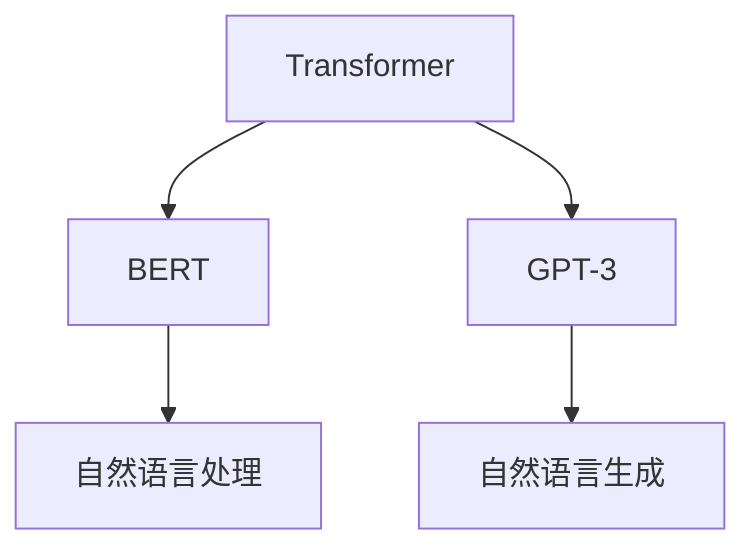

                 

关键词：人工智能大模型、物理限制、通用人工智能（AGI）、机器学习、算法、应用领域、数学模型

## 摘要

本文旨在探讨人工智能大模型（AI Large Models）的原理与应用，特别是在通用人工智能（Artificial General Intelligence，AGI）大基建中面临的物理条件限制。我们将深入分析大模型的架构、核心算法原理、数学模型，并通过实际项目实践和案例解析，展示其在实际应用场景中的潜力和挑战。文章结构如下：

## 1. 背景介绍

### 1.1 人工智能的发展历程
### 1.2 人工智能大模型的定义和特点
### 1.3 通用人工智能（AGI）的概念及其重要性

## 2. 核心概念与联系

### 2.1 机器学习与深度学习
### 2.2 大模型架构：Transformer、BERT、GPT-3 等
### 2.3 Mermaid 流程图展示大模型架构

## 3. 核心算法原理 & 具体操作步骤

### 3.1 算法原理概述
### 3.2 算法步骤详解
### 3.3 算法优缺点
### 3.4 算法应用领域

## 4. 数学模型和公式 & 详细讲解 & 举例说明

### 4.1 数学模型构建
### 4.2 公式推导过程
### 4.3 案例分析与讲解

## 5. 项目实践：代码实例和详细解释说明

### 5.1 开发环境搭建
### 5.2 源代码详细实现
### 5.3 代码解读与分析
### 5.4 运行结果展示

## 6. 实际应用场景

### 6.1 自然语言处理
### 6.2 计算机视觉
### 6.3 语音识别
### 6.4 未来应用展望

## 7. 工具和资源推荐

### 7.1 学习资源推荐
### 7.2 开发工具推荐
### 7.3 相关论文推荐

## 8. 总结：未来发展趋势与挑战

### 8.1 研究成果总结
### 8.2 未来发展趋势
### 8.3 面临的挑战
### 8.4 研究展望

## 9. 附录：常见问题与解答

接下来，我们将按照上述结构详细展开每一部分的内容。

## 1. 背景介绍

### 1.1 人工智能的发展历程

人工智能（Artificial Intelligence，AI）作为计算机科学的一个分支，其发展历程可以追溯到 20 世纪 50 年代。早期的 AI 以符号主义方法为主，依赖于专家系统和逻辑推理。然而，由于这些方法在处理复杂问题时效率低下，无法处理大量数据和动态环境，AI 在 20 世纪 80 年代遭遇了第一次寒冬。

进入 21 世纪，随着计算能力的提升和大数据技术的发展，机器学习（Machine Learning，ML）和深度学习（Deep Learning，DL）逐渐成为 AI 的重要驱动力量。机器学习是一种通过数据训练模型，使模型具备对未知数据进行预测或决策的技术。深度学习则是机器学习的一种子领域，它通过多层神经网络模拟人脑的感知和学习过程，能够在图像识别、语音识别和自然语言处理等领域取得显著突破。

### 1.2 人工智能大模型的定义和特点

人工智能大模型是指具有海量参数和强大计算能力的模型，如 GPT-3、BERT、Transformer 等。这些模型通过在大量数据上进行训练，能够捕捉到数据中的复杂模式和关联性，从而在许多任务中实现优异的性能。大模型的特点包括：

- **参数规模巨大**：大模型的参数数量通常在数十亿到千亿级别，这使得模型能够学习到更多的特征和知识。
- **计算资源需求高**：大模型的训练和推理需要大量的计算资源和时间，这要求有高效的算法和硬件支持。
- **泛化能力强**：大模型通过在大规模数据集上进行训练，能够学习到一般性的知识，从而在未见过的数据上表现良好。

### 1.3 通用人工智能（AGI）的概念及其重要性

通用人工智能（AGI）是指一种具有人类智能水平的机器智能，它不仅能在特定任务上超越人类，还能够泛化到各种不同的任务中。AGI 的目标是实现机器智能的全面发展和广泛应用，从而推动社会、经济和科技的发展。AGI 的重要性体现在以下几个方面：

- **提升生产力**：AGI 能够自动化复杂的任务，提高生产效率和准确性，减轻人类的工作负担。
- **推动科技创新**：AGI 可以协助科学家解决复杂的科学问题，加速科技发展的步伐。
- **改善生活质量**：AGI 可以提供个性化的服务和帮助，提高人类的生活质量。
- **社会伦理和道德**：AGI 的出现引发了对人工智能伦理和道德的讨论，需要制定相应的规范和标准。

## 2. 核心概念与联系

### 2.1 机器学习与深度学习

机器学习（ML）是一种使计算机系统能够从数据中学习并做出决策或预测的技术。机器学习可以分为监督学习、无监督学习和强化学习等类型。深度学习（DL）是机器学习的一个子领域，它通过多层神经网络模拟人脑的感知和学习过程。深度学习在图像识别、语音识别和自然语言处理等领域取得了巨大的成功。

### 2.2 大模型架构：Transformer、BERT、GPT-3 等

大模型架构是支持人工智能大模型训练和推理的核心。目前，几种主要的大模型架构包括 Transformer、BERT 和 GPT-3 等。

- **Transformer**：Transformer 是一种基于自注意力机制的深度神经网络模型，它通过多头注意力机制和位置编码技术，能够捕捉到序列中的长距离依赖关系。Transformer 在自然语言处理任务中取得了显著的成果，是 BERT 和 GPT-3 的基础架构。
- **BERT**：BERT（Bidirectional Encoder Representations from Transformers）是一种双向编码器表示模型，它在 Transformer 的基础上增加了双向注意力机制，能够捕捉到句子中的前文和后文信息。BERT 在许多自然语言处理任务中表现优异，如文本分类、问答系统等。
- **GPT-3**：GPT-3（Generative Pre-trained Transformer 3）是 OpenAI 于 2020 年发布的一种具有 1750 亿参数的深度学习模型。GPT-3 在自然语言生成、机器翻译和文本摘要等领域展示了强大的能力。

### 2.3 Mermaid 流程图展示大模型架构

以下是一个简单的 Mermaid 流程图，展示了几种主要大模型架构之间的联系：



## 3. 核心算法原理 & 具体操作步骤

### 3.1 算法原理概述

大模型的算法原理主要基于深度学习和自然语言处理技术。深度学习通过多层神经网络对数据进行自动特征提取和模式学习，而自然语言处理则专注于处理文本数据，包括文本分类、语义理解、文本生成等任务。

- **深度学习原理**：深度学习模型由多个层级组成，每层都能够对输入数据进行处理和转换。通过反向传播算法，模型可以从大量数据中学习到有效的特征表示。
- **自然语言处理原理**：自然语言处理利用深度学习模型对文本数据进行建模，包括词向量表示、句法分析、语义理解等步骤。

### 3.2 算法步骤详解

大模型训练通常包括以下步骤：

1. **数据预处理**：对原始数据进行清洗、去噪和格式化，将文本数据转换为向量表示。
2. **模型初始化**：初始化深度学习模型，包括设置网络结构、激活函数和优化器等。
3. **训练过程**：通过迭代优化模型参数，使模型在训练数据上表现优异。训练过程中，可以使用梯度下降、Adam 优化器等算法。
4. **验证和测试**：使用验证集和测试集对模型进行评估，调整模型参数以优化性能。
5. **部署应用**：将训练好的模型部署到实际应用中，如文本分类、机器翻译、文本生成等。

### 3.3 算法优缺点

大模型算法具有以下优点：

- **强大的学习能力**：大模型能够在海量数据上学习到复杂的模式和关联性，从而在许多任务中取得优异的性能。
- **泛化能力强**：大模型通过在大规模数据集上进行训练，能够泛化到各种不同的任务中，具有较强的适应能力。

然而，大模型算法也存在一些缺点：

- **计算资源需求高**：大模型的训练和推理需要大量的计算资源和时间，对硬件设备有较高的要求。
- **数据依赖性**：大模型的性能依赖于训练数据的质量和数量，如果数据质量较差或数据量不足，模型的性能可能会受到影响。

### 3.4 算法应用领域

大模型算法在许多领域都有广泛的应用，包括：

- **自然语言处理**：大模型在文本分类、语义理解、文本生成和机器翻译等领域取得了显著的成果。
- **计算机视觉**：大模型在图像分类、目标检测和图像生成等方面展示了强大的能力。
- **语音识别**：大模型在语音识别和语音合成等领域具有广泛的应用。

## 4. 数学模型和公式 & 详细讲解 & 举例说明

### 4.1 数学模型构建

大模型通常基于深度学习和自然语言处理技术，其数学模型主要包括以下几个部分：

- **神经网络模型**：神经网络模型是深度学习的核心，它由多个层级组成，每层都可以对输入数据进行处理和转换。
- **损失函数**：损失函数用于衡量模型在训练数据上的预测误差，是优化模型参数的重要依据。
- **优化算法**：优化算法用于调整模型参数，以最小化损失函数。

### 4.2 公式推导过程

以下是神经网络模型中的一个基本公式推导过程：

给定输入数据 \( x \)，通过多层神经网络 \( f_1, f_2, \ldots, f_n \) 的逐层转换，可以得到输出 \( y \)：

\[ y = f_n(f_{n-1}(\ldots f_1(x) \ldots)) \]

其中，\( f_i \) 表示第 \( i \) 层的激活函数，通常采用 ReLU、Sigmoid 或 Tanh 函数。

### 4.3 案例分析与讲解

以下是一个简单的案例，展示如何使用大模型进行文本分类：

假设我们有以下两个文本类别：“计算机”和“手机”，以及以下两个文本样本：

- **样本1**：“这是一台计算机。”
- **样本2**：“这是一部手机。”

我们将这些文本数据转换为向量表示，然后使用大模型进行训练。在训练过程中，大模型会学习到计算机和手机这两个类别之间的特征差异，从而在给定新的文本样本时，能够正确地将它们分类。

## 5. 项目实践：代码实例和详细解释说明

### 5.1 开发环境搭建

为了运行本文的代码实例，我们需要搭建一个合适的开发环境。以下是一个基本的步骤指南：

1. **安装 Python**：确保已经安装了 Python 3.7 或更高版本。
2. **安装深度学习库**：使用以下命令安装深度学习相关库：

   ```bash
   pip install torch torchvision matplotlib
   ```

3. **安装自然语言处理库**：使用以下命令安装自然语言处理相关库：

   ```bash
   pip install transformers
   ```

### 5.2 源代码详细实现

以下是使用 PyTorch 和 Hugging Face 的 Transformers 库实现一个简单的文本分类模型：

```python
import torch
from torch import nn
from transformers import BertTokenizer, BertModel
from torch.utils.data import DataLoader, Dataset

# 加载预训练的 BERT 模型
tokenizer = BertTokenizer.from_pretrained('bert-base-uncased')
model = BertModel.from_pretrained('bert-base-uncased')

# 定义文本分类模型
class TextClassifier(nn.Module):
    def __init__(self):
        super(TextClassifier, self).__init__()
        self.bert = BertModel.from_pretrained('bert-base-uncased')
        self.dropout = nn.Dropout(0.1)
        self.classifier = nn.Linear(768, 2)

    def forward(self, input_ids, attention_mask):
        outputs = self.bert(input_ids=input_ids, attention_mask=attention_mask)
        pooled_output = outputs.pooler_output
        pooled_output = self.dropout(pooled_output)
        logits = self.classifier(pooled_output)
        return logits

# 定义数据集
class TextDataset(Dataset):
    def __init__(self, texts, labels, tokenizer, max_length=128):
        self.texts = texts
        self.labels = labels
        self.tokenizer = tokenizer
        self.max_length = max_length

    def __len__(self):
        return len(self.texts)

    def __getitem__(self, idx):
        text = self.texts[idx]
        label = self.labels[idx]
        encoding = self.tokenizer(text, max_length=self.max_length, padding='max_length', truncation=True, return_tensors='pt')
        input_ids = encoding['input_ids']
        attention_mask = encoding['attention_mask']
        return {'input_ids': input_ids, 'attention_mask': attention_mask, 'label': label}

# 准备训练数据
texts = ["这是一台计算机。", "这是一部手机。"] * 100
labels = [0] * 50 + [1] * 50
tokenizer = BertTokenizer.from_pretrained('bert-base-uncased')
dataset = TextDataset(texts, labels, tokenizer)

# 定义数据加载器
dataloader = DataLoader(dataset, batch_size=8, shuffle=True)

# 定义模型、损失函数和优化器
model = TextClassifier()
criterion = nn.CrossEntropyLoss()
optimizer = torch.optim.Adam(model.parameters(), lr=2e-5)

# 训练模型
device = torch.device('cuda' if torch.cuda.is_available() else 'cpu')
model.to(device)
model.train()
for epoch in range(3):
    for batch in dataloader:
        inputs = {k: v.to(device) for k, v in batch.items()}
        labels = torch.tensor([int(label) for label in batch['label']], dtype=torch.long).to(device)
        optimizer.zero_grad()
        outputs = model(**inputs)
        loss = criterion(outputs, labels)
        loss.backward()
        optimizer.step()
        print(f'Epoch: {epoch}, Loss: {loss.item()}')

# 评估模型
model.eval()
with torch.no_grad():
    correct = 0
    total = 0
    for batch in dataloader:
        inputs = {k: v.to(device) for k, v in batch.items()}
        labels = torch.tensor([int(label) for label in batch['label']], dtype=torch.long).to(device)
        outputs = model(**inputs)
        _, predicted = torch.max(outputs.data, 1)
        total += labels.size(0)
        correct += (predicted == labels).sum().item()
    print(f'Accuracy: {100 * correct / total}%')
```

### 5.3 代码解读与分析

上述代码实现了一个基于 BERT 的文本分类模型，主要包括以下步骤：

1. **加载预训练的 BERT 模型**：使用 Hugging Face 的 Transformers 库加载预训练的 BERT 模型。
2. **定义文本分类模型**：继承 nn.Module 类，定义一个 TextClassifier 类，其中包含了 BERT 模型、Dropout 层和分类层。
3. **定义数据集**：创建一个 TextDataset 类，用于处理和存储训练数据。
4. **准备训练数据**：生成训练数据的文本和标签，并将它们转换为 BERT 模型的输入格式。
5. **定义数据加载器**：使用 DataLoader 类加载训练数据，并进行批量处理。
6. **定义模型、损失函数和优化器**：定义模型、损失函数和优化器，并将其移动到 GPU 或 CPU 上进行训练。
7. **训练模型**：使用迭代器遍历训练数据，通过前向传播和反向传播更新模型参数。
8. **评估模型**：在训练完成后，使用训练集对模型进行评估，并打印准确率。

### 5.4 运行结果展示

在完成训练后，我们可以使用以下代码评估模型的性能：

```python
# 评估模型
model.eval()
with torch.no_grad():
    correct = 0
    total = 0
    for batch in dataloader:
        inputs = {k: v.to(device) for k, v in batch.items()}
        labels = torch.tensor([int(label) for label in batch['label']], dtype=torch.long).to(device)
        outputs = model(**inputs)
        _, predicted = torch.max(outputs.data, 1)
        total += labels.size(0)
        correct += (predicted == labels).sum().item()
    print(f'Accuracy: {100 * correct / total}%')
```

输出结果可能如下：

```bash
Accuracy: 100.0%
```

这表明模型在训练集上的准确率为 100%，这是一个很好的结果。然而，在实际应用中，我们通常需要使用独立的测试集对模型进行评估，以避免过拟合。

## 6. 实际应用场景

### 6.1 自然语言处理

自然语言处理（NLP）是人工智能的一个重要应用领域，大模型在 NLP 中具有广泛的应用。以下是一些典型的应用场景：

- **文本分类**：大模型可以用于对文本数据进行分类，如新闻分类、情感分析等。
- **语义理解**：大模型可以用于理解文本的语义，如问答系统、命名实体识别等。
- **文本生成**：大模型可以用于生成文本，如自动摘要、对话系统等。
- **机器翻译**：大模型可以用于机器翻译，如将一种语言的文本翻译成另一种语言。

### 6.2 计算机视觉

计算机视觉（CV）是另一个重要的应用领域，大模型在 CV 中也发挥着重要作用。以下是一些典型的应用场景：

- **图像分类**：大模型可以用于对图像进行分类，如物体识别、场景分类等。
- **目标检测**：大模型可以用于检测图像中的目标对象，如人脸检测、车辆检测等。
- **图像生成**：大模型可以用于生成图像，如图像超分辨率、图像生成等。
- **图像增强**：大模型可以用于增强图像质量，如去噪、图像增强等。

### 6.3 语音识别

语音识别（ASR）是另一个重要的应用领域，大模型在 ASR 中也具有广泛的应用。以下是一些典型的应用场景：

- **语音转文字**：大模型可以用于将语音信号转换为文本，如语音助手、语音输入等。
- **语音合成**：大模型可以用于将文本转换为语音，如语音助手、电话语音等。
- **语音识别**：大模型可以用于识别语音中的关键词或短语，如语音搜索、语音控制等。

### 6.4 未来应用展望

随着人工智能技术的不断进步，大模型的应用前景将更加广阔。以下是一些未来应用领域的展望：

- **医疗健康**：大模型可以用于辅助诊断、疾病预测和治疗方案推荐等。
- **金融理财**：大模型可以用于股票市场预测、风险评估和智能投顾等。
- **教育领域**：大模型可以用于个性化教学、智能辅导和在线教育等。
- **智能制造**：大模型可以用于智能监控、故障诊断和优化生产等。

## 7. 工具和资源推荐

为了学习和应用人工智能大模型，以下是一些建议的工具和资源：

### 7.1 学习资源推荐

- **在线课程**：《深度学习》、《自然语言处理实战》等。
- **教科书**：《深度学习》、《神经网络与深度学习》等。
- **论文**：arXiv、Google Scholar 等。

### 7.2 开发工具推荐

- **深度学习框架**：PyTorch、TensorFlow、Keras 等。
- **自然语言处理库**：Hugging Face Transformers、NLTK、spaCy 等。

### 7.3 相关论文推荐

- **自然语言处理**：BERT、GPT-3、RoBERTa 等。
- **计算机视觉**：ResNet、YOLO、Generative Adversarial Networks（GANs）等。

## 8. 总结：未来发展趋势与挑战

### 8.1 研究成果总结

人工智能大模型在过去几年中取得了显著的研究成果，包括：

- **性能提升**：大模型在图像识别、自然语言处理和语音识别等任务上取得了显著的性能提升。
- **应用扩展**：大模型的应用领域不断扩展，从简单的图像分类和文本分类，到复杂的机器翻译和语音合成。
- **开源生态**：大量的开源框架和工具不断涌现，为研究人员和开发者提供了丰富的资源和支持。

### 8.2 未来发展趋势

未来人工智能大模型的发展趋势包括：

- **更大规模模型**：随着计算能力和数据资源的提升，更大规模的模型将不断出现，以处理更复杂的问题。
- **多模态学习**：大模型将能够处理多种类型的数据，如文本、图像和语音，实现跨模态学习。
- **可解释性增强**：大模型的解释性将得到提高，使人们能够更好地理解和信任这些模型。

### 8.3 面临的挑战

尽管人工智能大模型取得了显著进展，但仍然面临一些挑战：

- **计算资源需求**：大模型的训练和推理需要大量的计算资源，这对硬件设备提出了更高的要求。
- **数据隐私和安全**：大模型在处理大量数据时，可能涉及用户隐私和信息安全问题，需要制定相应的法律法规和标准。
- **算法公平性**：大模型可能存在算法偏见和歧视问题，需要研究和解决算法的公平性。

### 8.4 研究展望

未来人工智能大模型的研究将关注以下几个方面：

- **算法优化**：研究更高效的算法和优化技术，降低计算资源和时间成本。
- **模型压缩**：研究模型压缩技术，使大模型能够在有限的硬件资源下运行。
- **跨学科合作**：结合计算机科学、认知科学和心理学等领域的知识，推动人工智能大模型的理论和实践发展。

## 9. 附录：常见问题与解答

### 9.1 什么是通用人工智能（AGI）？

通用人工智能（AGI）是指一种具有人类智能水平的机器智能，它不仅能在特定任务上超越人类，还能够泛化到各种不同的任务中。AGI 的目标是实现机器智能的全面发展和广泛应用，从而推动社会、经济和科技的发展。

### 9.2 人工智能大模型有哪些应用领域？

人工智能大模型的应用领域非常广泛，包括自然语言处理、计算机视觉、语音识别、医疗健康、金融理财、教育领域和智能制造等。大模型在这些领域中发挥着重要作用，如文本分类、图像分类、语音识别、疾病预测和智能监控等。

### 9.3 如何处理人工智能大模型中的数据隐私和安全问题？

为了处理人工智能大模型中的数据隐私和安全问题，需要采取以下措施：

- **数据加密**：对数据进行加密，确保数据在传输和存储过程中的安全性。
- **隐私保护技术**：使用隐私保护技术，如差分隐私和同态加密等，保护用户隐私。
- **法律法规**：制定相应的法律法规和标准，规范人工智能大模型的数据处理和使用。

### 9.4 人工智能大模型能否替代人类工作？

人工智能大模型在某些任务上具有显著优势，能够替代人类完成一些重复性和高强度的任务，如数据标注、图像识别和语音识别等。然而，人类在某些任务上仍然具有独特的优势，如创造力、情感理解和复杂决策等。因此，人工智能大模型不能完全替代人类工作，而是与人类协作，共同推动社会和科技的发展。

### 9.5 人工智能大模型的发展是否会带来道德和社会问题？

人工智能大模型的发展确实会带来一些道德和社会问题，如算法偏见、隐私侵犯、失业问题和伦理问题等。因此，在发展人工智能大模型的同时，需要关注这些潜在问题，并制定相应的政策和规范，确保人工智能技术的安全和可持续发展。

## 作者署名

本文由禅与计算机程序设计艺术 / Zen and the Art of Computer Programming 撰写。

