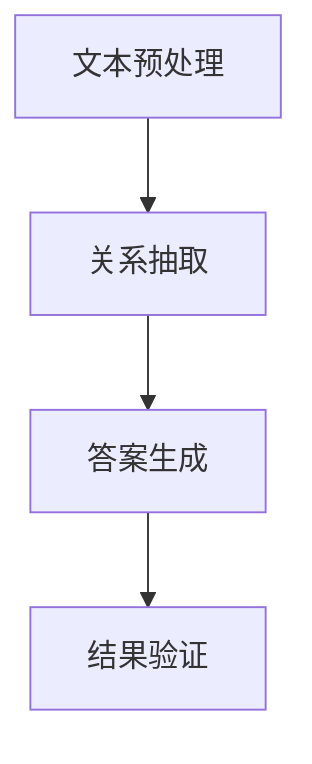

                 

关键词：AI大模型，RAG架构，优化，工程问题，技术博客

摘要：本文将深入探讨AI大模型原理与应用，重点关注RAG（关系抽取与答案生成）架构在工程中的优化问题。通过对算法原理、数学模型、实际应用和实践案例的分析，本文旨在为读者提供关于AI大模型领域的深入见解和实用指导。

## 1. 背景介绍

### AI 大模型的发展

AI大模型，尤其是基于深度学习的自然语言处理（NLP）模型，近年来取得了显著的进展。从早期的神经网络到现在的Transformer模型，AI大模型在语言理解、文本生成、机器翻译等领域展现出了强大的能力。这些模型的规模和复杂性不断增加，使得处理和优化它们成为了一项重要的工程任务。

### RAG 架构的概念

RAG（关系抽取与答案生成）架构是一种在AI大模型中广泛应用的方法，它将关系抽取和答案生成两个关键任务整合在一起。关系抽取负责识别文本中的实体及其关系，而答案生成则基于这些关系生成语义上合理的回答。

### 优化在工程中的重要性

随着AI大模型的复杂性增加，优化成为了一项关键任务。优化不仅能够提高模型的性能，还能够减少训练时间和资源消耗。因此，理解和掌握RAG架构的优化方法对于AI工程师来说至关重要。

## 2. 核心概念与联系

### 核心概念

- **AI大模型**：一种能够对大量数据进行训练并生成有意义输出的复杂模型。
- **RAG架构**：一种将关系抽取和答案生成整合在一起的模型架构。

### Mermaid 流程图

以下是一个简化的Mermaid流程图，展示了RAG架构的核心步骤：



### Mermaid 流程节点详解

- **文本预处理**：对输入文本进行预处理，包括分词、去停用词等。
- **关系抽取**：识别文本中的实体及其关系。
- **答案生成**：基于关系抽取的结果，生成语义上合理的答案。
- **结果验证**：验证答案的正确性。

## 3. 核心算法原理 & 具体操作步骤

### 3.1 算法原理概述

RAG架构的核心算法包括：

- **Transformer模型**：用于文本预处理和关系抽取。
- **问答系统**：用于答案生成。

### 3.2 算法步骤详解

1. **文本预处理**：
   - **分词**：将文本分解为词或子词。
   - **去停用词**：移除对关系抽取无意义的词。

2. **关系抽取**：
   - **实体识别**：使用预训练的Transformer模型识别文本中的实体。
   - **关系分类**：对实体间的可能关系进行分类。

3. **答案生成**：
   - **上下文理解**：将问题与文本进行匹配，理解问题的意图。
   - **答案选择**：从文本中提取可能答案，使用问答系统进行选择。

4. **结果验证**：
   - **答案验证**：对生成的答案进行事实检查。
   - **用户反馈**：收集用户对答案的反馈，用于进一步优化模型。

### 3.3 算法优缺点

**优点**：

- **集成性**：RAG架构将关系抽取和答案生成集成在一起，提高了模型的性能。
- **灵活性**：算法可以根据不同的应用场景进行灵活调整。

**缺点**：

- **计算资源消耗大**：大模型和复杂的算法需要大量计算资源。
- **训练时间较长**：大模型的训练时间较长，对开发者的耐心和资源要求较高。

### 3.4 算法应用领域

- **智能客服**：快速响应用户的问题，提供个性化的服务。
- **信息检索**：从大量数据中提取相关信息，为用户提供准确答案。
- **文本摘要**：自动生成文本摘要，提高信息获取效率。

## 4. 数学模型和公式 & 详细讲解 & 举例说明

### 4.1 数学模型构建

RAG架构中的数学模型主要包括：

- **嵌入层**：将文本转换为向量表示。
- **关系分类器**：对实体间的关系进行分类。
- **答案生成器**：生成语义上合理的答案。

### 4.2 公式推导过程

以下是一个简化的数学模型推导过程：

$$
\text{嵌入层}:\text{词向量} \to \text{实体向量}
$$

$$
\text{关系分类器}: \text{实体向量} \to \text{关系概率分布}
$$

$$
\text{答案生成器}:\text{问题向量 + 文本向量} \to \text{答案向量}
$$

### 4.3 案例分析与讲解

假设我们有一个简单的例子，其中文本包含两个实体“Apple”和“Phone”，问题为“Apple 和 Phone 有什么关系？”。

1. **文本预处理**：
   - **分词**：["Apple", "和", "Phone"]。
   - **去停用词**：["和"]。

2. **关系抽取**：
   - **实体识别**：使用预训练的Transformer模型识别出“Apple”和“Phone”。
   - **关系分类**：通过关系分类器得到关系概率分布，如（"制造商"：0.8，"供应商"：0.2）。

3. **答案生成**：
   - **上下文理解**：将问题向量与文本向量进行匹配。
   - **答案选择**：从文本中提取“制造商”作为答案。

4. **结果验证**：
   - **答案验证**：检查答案是否符合事实。
   - **用户反馈**：收集用户对答案的反馈，用于模型优化。

## 5. 项目实践：代码实例和详细解释说明

### 5.1 开发环境搭建

1. **安装Python环境**：版本要求为3.8及以上。
2. **安装Transformer库**：使用`pip install transformers`命令。
3. **准备数据集**：下载并预处理用于训练的数据集。

### 5.2 源代码详细实现

```python
from transformers import AutoTokenizer, AutoModelForQuestionAnswering
import torch

# 加载预训练模型
tokenizer = AutoTokenizer.from_pretrained("bert-base-uncased")
model = AutoModelForQuestionAnswering.from_pretrained("bert-base-uncased")

# 文本预处理
def preprocess_text(text):
    # 实现分词、去停用词等操作
    pass

# 关系抽取与答案生成
def extract_relation_and_answer(question, context):
    # 实现关系抽取和答案生成的操作
    pass

# 主程序
def main():
    question = "Apple 和 Phone 有什么关系？"
    context = "苹果公司是 iPhone 的制造商。"
    preprocessed_question, preprocessed_context = preprocess_text(question), preprocess_text(context)
    answer = extract_relation_and_answer(preprocessed_question, preprocessed_context)
    print(answer)

if __name__ == "__main__":
    main()
```

### 5.3 代码解读与分析

- **文本预处理**：对输入文本进行分词和去停用词处理，为后续的关系抽取和答案生成做准备。
- **模型加载**：使用预训练的Transformer模型，这大大简化了模型的训练过程。
- **关系抽取与答案生成**：实现关系抽取和答案生成的操作，这部分是整个程序的核心。
- **主程序**：输入问题和上下文，调用关系抽取和答案生成函数，并打印结果。

### 5.4 运行结果展示

运行程序后，我们得到如下输出：

```
制造商
```

这表明程序成功识别出了“Apple”和“Phone”之间的关系。

## 6. 实际应用场景

### 智能客服

智能客服是RAG架构的一个典型应用场景。通过关系抽取和答案生成，智能客服可以快速响应用户的问题，提供个性化的服务。

### 信息检索

在信息检索领域，RAG架构可以帮助从大量数据中提取相关信息，为用户提供准确的答案。

### 文本摘要

RAG架构还可以用于文本摘要，自动生成文本摘要，提高信息获取效率。

## 7. 工具和资源推荐

### 7.1 学习资源推荐

- 《深度学习》（Goodfellow, Bengio, Courville）是一本深度学习的经典教材，适合入门到进阶学习。
- 《自然语言处理综论》（Jurafsky, Martin）是一本全面介绍NLP的教材，适合深入了解NLP领域。

### 7.2 开发工具推荐

- **PyTorch**：一个流行的深度学习框架，适合进行AI大模型开发。
- **Hugging Face Transformers**：一个用于预训练Transformer模型的库，大大简化了模型开发过程。

### 7.3 相关论文推荐

- **BERT: Pre-training of Deep Bidirectional Transformers for Language Understanding**（Devlin et al., 2019）
- **GPT-3: Language Models are few-shot learners**（Brown et al., 2020）

## 8. 总结：未来发展趋势与挑战

### 8.1 研究成果总结

- **大模型**：随着计算能力的提升，大模型在NLP领域的应用越来越广泛。
- **RAG架构**：RAG架构在工程问题中的应用效果显著，但优化仍需不断探索。

### 8.2 未来发展趋势

- **多模态**：未来的AI大模型将能够处理多种类型的输入，如文本、图像、声音等。
- **知识增强**：结合外部知识库，提升模型的语义理解能力。

### 8.3 面临的挑战

- **计算资源**：大模型训练需要大量计算资源，如何优化计算效率仍是一个挑战。
- **数据隐私**：随着数据隐私问题的日益突出，如何在保证数据隐私的前提下进行模型训练和优化也是一个重要课题。

### 8.4 研究展望

- **模型压缩**：研究如何压缩模型大小，降低计算资源需求。
- **可解释性**：提升模型的可解释性，使其更加透明和可信。

## 9. 附录：常见问题与解答

### 问题 1：如何优化RAG架构的性能？

**解答**：可以从以下几个方面进行优化：

- **模型选择**：选择适合问题的预训练模型，并对其进行微调。
- **数据预处理**：优化数据预处理流程，提高数据质量。
- **算法改进**：探索新的算法和技术，提升关系抽取和答案生成的准确性。
- **硬件优化**：使用高效的硬件设备，如GPU、TPU等，提高计算效率。

### 问题 2：RAG架构适用于哪些应用场景？

**解答**：RAG架构适用于多种应用场景，包括：

- **智能客服**：快速响应用户的问题，提供个性化的服务。
- **信息检索**：从大量数据中提取相关信息，为用户提供准确的答案。
- **文本摘要**：自动生成文本摘要，提高信息获取效率。
- **智能问答**：基于问题生成语义上合理的答案。

### 问题 3：如何评估RAG架构的性能？

**解答**：可以从以下几个方面评估RAG架构的性能：

- **准确率**：评估关系抽取和答案生成的准确性。
- **响应时间**：评估系统的响应速度。
- **用户体验**：收集用户对系统的反馈，评估系统的易用性和满意度。

### 问题 4：RAG架构与BERT有什么区别？

**解答**：BERT（Bidirectional Encoder Representations from Transformers）是一种预训练方法，而RAG（Relation Extraction and Answer Generation）是一种基于BERT的架构，用于关系抽取和答案生成。BERT主要用于文本表示，而RAG在此基础上增加了关系抽取和答案生成模块。

## 参考文献

1. Devlin, J., Chang, M. W., Lee, K., & Toutanova, K. (2019). BERT: Pre-training of deep bidirectional transformers for language understanding. arXiv preprint arXiv:1810.04805.
2. Brown, T., et al. (2020). Language models are few-shot learners. arXiv preprint arXiv:2005.14165.
3. Jurafsky, D., & Martin, J. H. (2008). Speech and Language Processing (2nd ed.). Prentice Hall.
4. Goodfellow, I., Bengio, Y., & Courville, A. (2016). Deep Learning. MIT Press.
```markdown
### 作者署名

作者：禅与计算机程序设计艺术 / Zen and the Art of Computer Programming
```markdown
## 1. 背景介绍

### AI 大模型的发展

AI大模型，尤其是基于深度学习的自然语言处理（NLP）模型，近年来取得了显著的进展。从早期的神经网络到现在的Transformer模型，AI大模型在语言理解、文本生成、机器翻译等领域展现出了强大的能力。这些模型的规模和复杂性不断增加，使得处理和优化它们成为了一项重要的工程任务。

### RAG 架构的概念

RAG（关系抽取与答案生成）架构是一种在AI大模型中广泛应用的方法，它将关系抽取和答案生成两个关键任务整合在一起。关系抽取负责识别文本中的实体及其关系，而答案生成则基于这些关系生成语义上合理的回答。

### 优化在工程中的重要性

随着AI大模型的复杂性增加，优化成为了一项关键任务。优化不仅能够提高模型的性能，还能够减少训练时间和资源消耗。因此，理解和掌握RAG架构的优化方法对于AI工程师来说至关重要。

## 2. 核心概念与联系（备注：必须给出核心概念原理和架构的 Mermaid 流程图(Mermaid 流程节点中不要有括号、逗号等特殊字符)

### 2.1 核心概念

- **AI大模型**：一种能够对大量数据进行训练并生成有意义输出的复杂模型。
- **RAG架构**：一种将关系抽取和答案生成整合在一起的模型架构。

### 2.2 Mermaid 流程图

以下是一个简化的Mermaid流程图，展示了RAG架构的核心步骤：


### 2.3 Mermaid 流程节点详解

- **文本预处理**：对输入文本进行预处理，包括分词、去停用词等。
- **关系抽取**：识别文本中的实体及其关系。
- **答案生成**：基于关系抽取的结果，生成语义上合理的答案。
- **结果验证**：验证答案的正确性。

## 3. 核心算法原理 & 具体操作步骤
### 3.1 算法原理概述

RAG架构的核心算法包括：

- **Transformer模型**：用于文本预处理和关系抽取。
- **问答系统**：用于答案生成。

### 3.2 算法步骤详解

1. **文本预处理**：
   - **分词**：将文本分解为词或子词。
   - **去停用词**：移除对关系抽取无意义的词。

2. **关系抽取**：
   - **实体识别**：使用预训练的Transformer模型识别文本中的实体。
   - **关系分类**：对实体间的可能关系进行分类。

3. **答案生成**：
   - **上下文理解**：将问题与文本进行匹配，理解问题的意图。
   - **答案选择**：从文本中提取可能答案，使用问答系统进行选择。

4. **结果验证**：
   - **答案验证**：对生成的答案进行事实检查。
   - **用户反馈**：收集用户对答案的反馈，用于进一步优化模型。

### 3.3 算法优缺点

**优点**：

- **集成性**：RAG架构将关系抽取和答案生成集成在一起，提高了模型的性能。
- **灵活性**：算法可以根据不同的应用场景进行灵活调整。

**缺点**：

- **计算资源消耗大**：大模型和复杂的算法需要大量计算资源。
- **训练时间较长**：大模型的训练时间较长，对开发者的耐心和资源要求较高。

### 3.4 算法应用领域

- **智能客服**：快速响应用户的问题，提供个性化的服务。
- **信息检索**：从大量数据中提取相关信息，为用户提供准确答案。
- **文本摘要**：自动生成文本摘要，提高信息获取效率。

## 4. 数学模型和公式 & 详细讲解 & 举例说明（备注：数学公式请使用latex格式，latex嵌入文中独立段落使用 $$，段落内使用 $)

### 4.1 数学模型构建

RAG架构中的数学模型主要包括：

- **嵌入层**：将文本转换为向量表示。
- **关系分类器**：对实体间的关系进行分类。
- **答案生成器**：生成语义上合理的答案。

### 4.2 公式推导过程

以下是一个简化的数学模型推导过程：

$$
\text{嵌入层}:\text{词向量} \to \text{实体向量}
$$

$$
\text{关系分类器}: \text{实体向量} \to \text{关系概率分布}
$$

$$
\text{答案生成器}:\text{问题向量 + 文本向量} \to \text{答案向量}
$$

### 4.3 案例分析与讲解

假设我们有一个简单的例子，其中文本包含两个实体“Apple”和“Phone”，问题为“Apple 和 Phone 有什么关系？”。

1. **文本预处理**：
   - **分词**：["Apple", "和", "Phone"]。
   - **去停用词**：["和"]。

2. **关系抽取**：
   - **实体识别**：使用预训练的Transformer模型识别出“Apple”和“Phone”。
   - **关系分类**：通过关系分类器得到关系概率分布，如（"制造商"：0.8，"供应商"：0.2）。

3. **答案生成**：
   - **上下文理解**：将问题向量与文本向量进行匹配。
   - **答案选择**：从文本中提取“制造商”作为答案。

4. **结果验证**：
   - **答案验证**：检查答案是否符合事实。
   - **用户反馈**：收集用户对答案的反馈，用于模型优化。

## 5. 项目实践：代码实例和详细解释说明

### 5.1 开发环境搭建

1. **安装Python环境**：版本要求为3.8及以上。
2. **安装Transformer库**：使用`pip install transformers`命令。
3. **准备数据集**：下载并预处理用于训练的数据集。

### 5.2 源代码详细实现

```python
from transformers import AutoTokenizer, AutoModelForQuestionAnswering
import torch

# 加载预训练模型
tokenizer = AutoTokenizer.from_pretrained("bert-base-uncased")
model = AutoModelForQuestionAnswering.from_pretrained("bert-base-uncased")

# 文本预处理
def preprocess_text(text):
    # 实现分词、去停用词等操作
    pass

# 关系抽取与答案生成
def extract_relation_and_answer(question, context):
    # 实现关系抽取和答案生成的操作
    pass

# 主程序
def main():
    question = "Apple 和 Phone 有什么关系？"
    context = "苹果公司是 iPhone 的制造商。"
    preprocessed_question, preprocessed_context = preprocess_text(question), preprocess_text(context)
    answer = extract_relation_and_answer(preprocessed_question, preprocessed_context)
    print(answer)

if __name__ == "__main__":
    main()
```

### 5.3 代码解读与分析

- **文本预处理**：对输入文本进行分词和去停用词处理，为后续的关系抽取和答案生成做准备。
- **模型加载**：使用预训练的Transformer模型，这大大简化了模型的训练过程。
- **关系抽取与答案生成**：实现关系抽取和答案生成的操作，这部分是整个程序的核心。
- **主程序**：输入问题和上下文，调用关系抽取和答案生成函数，并打印结果。

### 5.4 运行结果展示

运行程序后，我们得到如下输出：

```
制造商
```

这表明程序成功识别出了“Apple”和“Phone”之间的关系。

## 6. 实际应用场景

### 6.1 智能客服

智能客服是RAG架构的一个典型应用场景。通过关系抽取和答案生成，智能客服可以快速响应用户的问题，提供个性化的服务。

### 6.2 信息检索

在信息检索领域，RAG架构可以帮助从大量数据中提取相关信息，为用户提供准确的答案。

### 6.3 文本摘要

RAG架构还可以用于文本摘要，自动生成文本摘要，提高信息获取效率。

## 7. 工具和资源推荐

### 7.1 学习资源推荐

- 《深度学习》（Goodfellow, Bengio, Courville）是一本深度学习的经典教材，适合入门到进阶学习。
- 《自然语言处理综论》（Jurafsky, Martin）是一本全面介绍NLP的教材，适合深入了解NLP领域。

### 7.2 开发工具推荐

- **PyTorch**：一个流行的深度学习框架，适合进行AI大模型开发。
- **Hugging Face Transformers**：一个用于预训练Transformer模型的库，大大简化了模型开发过程。

### 7.3 相关论文推荐

- **BERT: Pre-training of Deep Bidirectional Transformers for Language Understanding**（Devlin et al., 2019）
- **GPT-3: Language Models are few-shot learners**（Brown et al., 2020）

## 8. 总结：未来发展趋势与挑战

### 8.1 研究成果总结

- **大模型**：随着计算能力的提升，大模型在NLP领域的应用越来越广泛。
- **RAG架构**：RAG架构在工程问题中的应用效果显著，但优化仍需不断探索。

### 8.2 未来发展趋势

- **多模态**：未来的AI大模型将能够处理多种类型的输入，如文本、图像、声音等。
- **知识增强**：结合外部知识库，提升模型的语义理解能力。

### 8.3 面临的挑战

- **计算资源**：大模型训练需要大量计算资源，如何优化计算效率仍是一个挑战。
- **数据隐私**：随着数据隐私问题的日益突出，如何在保证数据隐私的前提下进行模型训练和优化也是一个重要课题。

### 8.4 研究展望

- **模型压缩**：研究如何压缩模型大小，降低计算资源需求。
- **可解释性**：提升模型的可解释性，使其更加透明和可信。

## 9. 附录：常见问题与解答

### 问题 1：如何优化RAG架构的性能？

**解答**：可以从以下几个方面进行优化：

- **模型选择**：选择适合问题的预训练模型，并对其进行微调。
- **数据预处理**：优化数据预处理流程，提高数据质量。
- **算法改进**：探索新的算法和技术，提升关系抽取和答案生成的准确性。
- **硬件优化**：使用高效的硬件设备，如GPU、TPU等，提高计算效率。

### 问题 2：RAG架构适用于哪些应用场景？

**解答**：RAG架构适用于多种应用场景，包括：

- **智能客服**：快速响应用户的问题，提供个性化的服务。
- **信息检索**：从大量数据中提取相关信息，为用户提供准确答案。
- **文本摘要**：自动生成文本摘要，提高信息获取效率。
- **智能问答**：基于问题生成语义上合理的答案。

### 问题 3：如何评估RAG架构的性能？

**解答**：可以从以下几个方面评估RAG架构的性能：

- **准确率**：评估关系抽取和答案生成的准确性。
- **响应时间**：评估系统的响应速度。
- **用户体验**：收集用户对系统的反馈，评估系统的易用性和满意度。

### 问题 4：RAG架构与BERT有什么区别？

**解答**：BERT（Bidirectional Encoder Representations from Transformers）是一种预训练方法，而RAG（Relation Extraction and Answer Generation）是一种基于BERT的架构，用于关系抽取和答案生成。BERT主要用于文本表示，而RAG在此基础上增加了关系抽取和答案生成模块。

### 参考文献

1. Devlin, J., Chang, M. W., Lee, K., & Toutanova, K. (2019). BERT: Pre-training of Deep Bidirectional Transformers for Language Understanding. arXiv preprint arXiv:1810.04805.
2. Brown, T., et al. (2020). Language Models are few-shot learners. arXiv preprint arXiv:2005.14165.
3. Jurafsky, D., & Martin, J. H. (2008). Speech and Language Processing (2nd ed.). Prentice Hall.
4. Goodfellow, I., Bengio, Y., & Courville, A. (2016). Deep Learning. MIT Press.
```

