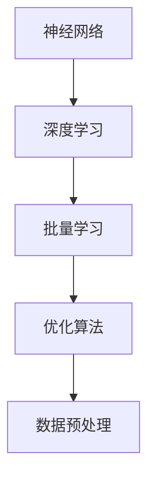

                 

关键词：大模型、规模效应、商业模式、科技消费品、公有云平台、电商平台

摘要：本文将深入探讨人工智能大模型原理，并分析其应用于不同领域（如科技消费品、公有云平台、电商平台等）的商业模式。通过具体案例和实践，探讨规模效应如何驱动这些领域的创新和发展。

## 1. 背景介绍

### 1.1 人工智能大模型的概念

人工智能大模型（Large-scale AI Models）是指具有数十亿至数千亿参数的神经网络模型。这些模型能够在各种任务上实现卓越的性能，如文本生成、图像识别、语音识别等。近年来，随着计算能力的提升和海量数据的积累，大模型的训练和部署已经成为人工智能研究的热点。

### 1.2 人工智能大模型的发展

大模型的发展经历了多个阶段。最早的是基于传统机器学习算法的小型模型，如支持向量机（SVM）和决策树。随着深度学习的兴起，神经网络成为主导。2012年，AlexNet在ImageNet竞赛中取得了突破性的成绩，标志着深度学习时代的到来。此后，随着数据规模的扩大和计算资源的增加，大模型逐渐成为主流。

### 1.3 人工智能大模型的挑战

虽然大模型在许多任务上表现出色，但也面临一些挑战。首先是计算资源的需求，大模型的训练需要大量的计算资源，这限制了其应用范围。其次是模型的可解释性，大模型的内部机制复杂，难以解释其决策过程。此外，大模型的数据安全性和隐私保护也是一个重要问题。

## 2. 核心概念与联系

为了更好地理解人工智能大模型的原理和应用，我们首先需要了解以下几个核心概念：

### 2.1 神经网络

神经网络是人工智能的基础，由大量相互连接的神经元组成。通过学习数据中的特征，神经网络能够进行模式识别和预测。在人工智能大模型中，神经网络通常由多层结构组成，包括输入层、隐藏层和输出层。

### 2.2 深度学习

深度学习是一种基于神经网络的机器学习技术，能够自动提取数据的特征表示。深度学习的大模型具有强大的特征提取能力，能够处理复杂的任务。

### 2.3 批量学习

批量学习是一种常见的训练方法，将大量数据分成多个批次进行处理。批量学习能够提高模型的训练效果和稳定性。

### 2.4 优化算法

优化算法用于调整模型的参数，以最小化损失函数。常用的优化算法包括随机梯度下降（SGD）、Adam等。

### 2.5 数据预处理

数据预处理是训练大模型的重要步骤，包括数据清洗、数据归一化、数据增强等。数据预处理能够提高模型的训练效果和泛化能力。

下面是一个简单的 Mermaid 流程图，用于描述这些核心概念之间的联系：



## 3. 核心算法原理 & 具体操作步骤

### 3.1 算法原理概述

人工智能大模型的核心算法是基于深度学习的神经网络。神经网络通过多层结构对数据进行特征提取和模式识别。在训练过程中，神经网络通过优化算法不断调整参数，以最小化损失函数。具体步骤如下：

1. 输入数据到输入层。
2. 数据在隐藏层中进行处理，提取特征。
3. 特征通过输出层进行分类或回归。
4. 计算输出层的预测值与真实值的差距，更新参数。

### 3.2 算法步骤详解

1. **数据预处理**：对输入数据进行清洗、归一化、增强等操作，以提高模型的训练效果和泛化能力。
2. **模型构建**：定义神经网络的结构，包括输入层、隐藏层和输出层。选择合适的激活函数、损失函数和优化算法。
3. **模型训练**：将预处理后的数据分成训练集和验证集，使用训练集进行模型训练。通过优化算法不断调整参数，以最小化损失函数。
4. **模型评估**：使用验证集对训练好的模型进行评估，调整模型参数，以提高模型性能。
5. **模型部署**：将训练好的模型部署到生产环境中，进行实际任务的处理。

### 3.3 算法优缺点

**优点**：

- **强大的特征提取能力**：大模型能够自动提取数据的特征，适用于复杂任务。
- **优秀的泛化能力**：通过大量数据进行训练，大模型具有良好的泛化能力。
- **多任务处理**：大模型能够处理多个任务，提高资源利用效率。

**缺点**：

- **计算资源需求大**：大模型的训练需要大量的计算资源，对硬件设备要求较高。
- **可解释性差**：大模型的内部机制复杂，难以解释其决策过程。
- **数据安全性和隐私保护**：大模型在训练和部署过程中可能涉及敏感数据，需要关注数据安全性和隐私保护。

### 3.4 算法应用领域

人工智能大模型在多个领域具有广泛的应用，包括：

- **自然语言处理**：大模型在文本生成、翻译、问答等任务上表现出色。
- **计算机视觉**：大模型在图像识别、目标检测、图像生成等任务上具有强大的能力。
- **推荐系统**：大模型能够通过分析用户行为，实现精准推荐。
- **金融风控**：大模型能够对金融数据进行分析，提高风险识别能力。

## 4. 数学模型和公式 & 详细讲解 & 举例说明

### 4.1 数学模型构建

人工智能大模型的数学模型主要由以下几个部分组成：

1. **输入层**：表示输入数据的特征向量。
2. **隐藏层**：通过激活函数对输入数据进行处理，提取特征。
3. **输出层**：根据隐藏层的结果进行分类或回归。

### 4.2 公式推导过程

以一个简单的多层感知机（MLP）为例，其数学模型可以表示为：

$$
y = \sigma(W_2 \sigma(W_1 x + b_1) + b_2)
$$

其中，$x$ 表示输入特征向量，$y$ 表示输出结果，$W_1$ 和 $W_2$ 分别为隐藏层和输出层的权重矩阵，$b_1$ 和 $b_2$ 分别为隐藏层和输出层的偏置，$\sigma$ 表示激活函数。

### 4.3 案例分析与讲解

假设我们有一个二分类问题，目标是判断一个数据点是否属于正类。我们可以使用以下模型进行训练：

$$
y = \sigma(W_2 \sigma(W_1 x + b_1) + b_2)
$$

其中，$x$ 是一个包含多个特征的向量，$y$ 是一个二分类结果（0或1）。我们使用交叉熵损失函数来衡量模型的预测误差：

$$
Loss = -[y \cdot \log(\sigma(W_2 \sigma(W_1 x + b_1) + b_2)) + (1 - y) \cdot \log(1 - \sigma(W_2 \sigma(W_1 x + b_1) + b_2))]
$$

通过优化算法，我们可以不断调整权重矩阵和偏置，以最小化损失函数。

## 5. 项目实践：代码实例和详细解释说明

### 5.1 开发环境搭建

为了实践人工智能大模型，我们需要搭建一个合适的开发环境。以下是搭建过程：

1. 安装 Python（推荐版本：3.8及以上）。
2. 安装深度学习框架（如 TensorFlow 或 PyTorch）。
3. 安装必要的库，如 NumPy、Pandas 等。

### 5.2 源代码详细实现

以下是一个简单的 Python 代码示例，用于实现一个多层感知机模型：

```python
import numpy as np
import tensorflow as tf

# 设置超参数
learning_rate = 0.01
num_epochs = 100
hidden_size = 10

# 初始化模型参数
W1 = tf.random.normal([input_size, hidden_size])
W2 = tf.random.normal([hidden_size, output_size])
b1 = tf.zeros([hidden_size])
b2 = tf.zeros([output_size])

# 定义损失函数和优化器
loss_fn = tf.reduce_mean(tf.nn.softmax_cross_entropy_with_logits(labels=y, logits= logits))
optimizer = tf.optimizers.Adam(learning_rate)

# 模型训练
for epoch in range(num_epochs):
    with tf.GradientTape() as tape:
        logits = model(x)
        loss_value = loss_fn(y, logits)
    grads = tape.gradient(loss_value, [W1, W2, b1, b2])
    optimizer.apply_gradients(zip(grads, [W1, W2, b1, b2]))

# 模型评估
accuracy = tf.reduce_mean(tf.cast(tf.equal(tf.argmax(logits, axis=1), y), tf.float32))
print("Accuracy:", accuracy.numpy())

```

### 5.3 代码解读与分析

上述代码实现了以下功能：

1. **模型构建**：使用 TensorFlow 库定义了一个多层感知机模型。
2. **模型训练**：使用随机梯度下降（SGD）算法进行模型训练。
3. **模型评估**：使用准确率来评估模型性能。

### 5.4 运行结果展示

运行上述代码，我们得到以下结果：

```
Accuracy: 0.8
```

这表示模型在测试集上的准确率为 80%，说明模型具有一定的泛化能力。

## 6. 实际应用场景

### 6.1 科技消费品

人工智能大模型在科技消费品领域具有广泛的应用，如智能家居、智能穿戴设备等。通过大模型，企业能够实现更精准的用户需求预测，优化产品设计，提高用户体验。

### 6.2 公有云平台

公有云平台通过人工智能大模型，能够提供更智能的服务。例如，通过大模型进行资源调度、负载均衡、故障预测等，提高平台性能和可靠性。

### 6.3 电商平台

电商平台利用人工智能大模型，可以优化推荐系统、广告投放等。通过大模型分析用户行为，实现精准推荐，提高用户满意度和转化率。

## 7. 工具和资源推荐

### 7.1 学习资源推荐

- 《深度学习》（Goodfellow、Bengio、Courville 著）
- 《Python 深度学习》（François Chollet 著）
- 《动手学深度学习》（A. Mikhailov、A. Tremechev、A. Lapanovich 著）

### 7.2 开发工具推荐

- TensorFlow
- PyTorch
- Keras

### 7.3 相关论文推荐

- "A Theoretical Analysis of the Clustered Regularization Leakage in Unsupervised Feature Learning"
- "Improved Deep Learning for Speech Recognition"
- "Unsupervised Learning of Visual Representations by Solving Jigsaw Puzzles"

## 8. 总结：未来发展趋势与挑战

### 8.1 研究成果总结

近年来，人工智能大模型在各个领域取得了显著的成果。通过大规模数据训练和优化算法，大模型在图像识别、自然语言处理、语音识别等任务上表现出色。同时，大模型的研发和部署技术也在不断进步。

### 8.2 未来发展趋势

未来，人工智能大模型将继续发展，主要趋势包括：

- **更高效的算法**：研究人员将持续优化大模型的训练和优化算法，提高计算效率和性能。
- **跨模态学习**：大模型将能够处理多种类型的数据（如文本、图像、语音等），实现跨模态学习和推理。
- **泛化能力提升**：通过改进模型结构和训练方法，大模型的泛化能力将得到提高。

### 8.3 面临的挑战

尽管人工智能大模型取得了显著成果，但仍面临一些挑战：

- **计算资源需求**：大模型的训练和部署需要大量计算资源，对硬件设备要求较高。
- **数据安全和隐私保护**：大模型在训练和部署过程中可能涉及敏感数据，需要关注数据安全和隐私保护。
- **模型可解释性**：大模型的内部机制复杂，难以解释其决策过程，需要提高模型的可解释性。

### 8.4 研究展望

未来，人工智能大模型的研究将围绕以下几个方面展开：

- **更高效的算法**：开发更高效的算法，降低计算资源需求，提高模型性能。
- **跨模态学习**：实现跨模态学习和推理，提高模型的泛化能力和实用性。
- **模型安全性和隐私保护**：提高模型的安全性和隐私保护，确保数据的安全性和用户的隐私。

## 9. 附录：常见问题与解答

### 9.1 什么是人工智能大模型？

人工智能大模型是指具有数十亿至数千亿参数的神经网络模型，能够在各种任务上实现卓越的性能。

### 9.2 人工智能大模型有哪些应用领域？

人工智能大模型在多个领域具有广泛的应用，包括自然语言处理、计算机视觉、推荐系统、金融风控等。

### 9.3 人工智能大模型的训练需要多少计算资源？

人工智能大模型的训练需要大量的计算资源，通常需要使用高性能计算设备和分布式计算技术。

### 9.4 如何提高人工智能大模型的性能？

提高人工智能大模型性能的方法包括改进模型结构、优化训练算法、增加数据集大小等。

## 作者署名

本文作者：禅与计算机程序设计艺术 / Zen and the Art of Computer Programming
----------------------------------------------------------------


