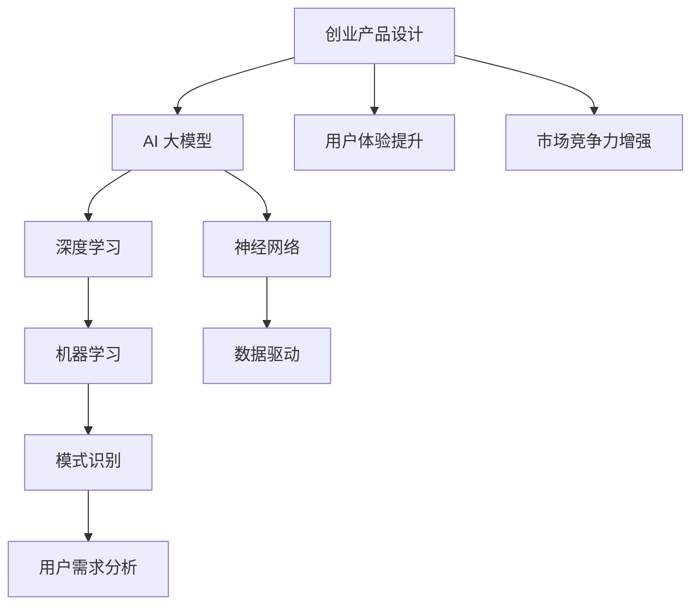

                 

关键词：AI 大模型、创业产品设计、深度学习、神经网络、机器学习、数据驱动

## 摘要

本文将探讨 AI 大模型在创业产品设计中的应用趋势。通过分析 AI 大模型的核心概念、算法原理、数学模型以及实际应用场景，我们将揭示 AI 大模型在创业产品设计中的潜在价值。同时，本文还将展望 AI 大模型在未来创业产品设计中的发展趋势与挑战。

## 1. 背景介绍

随着人工智能技术的快速发展，AI 大模型（如 GPT-3、BERT、Transformer 等）逐渐成为行业焦点。这些大模型具有强大的数据处理和模式识别能力，能够从海量数据中提取有用信息，为各种领域提供智能化解决方案。在创业产品设计中，AI 大模型的应用不仅能够提升设计效率，还能增强用户体验，提高市场竞争力。

### 1.1 创业产品设计的重要性

创业产品设计是创业成功的关键环节。一个优秀的产品设计不仅能够满足用户需求，提高用户满意度，还能够为企业带来可观的经济效益。随着市场竞争的加剧，创业产品需要不断创新，以满足不断变化的市场需求和用户偏好。AI 大模型的应用为创业产品设计提供了新的思路和工具，有助于企业快速迭代和优化产品设计。

### 1.2 AI 大模型的发展历程

AI 大模型的发展经历了从规则驱动到数据驱动的过程。早期的 AI 技术主要基于规则和符号逻辑，如专家系统和逻辑推理。然而，这些方法在处理复杂问题和海量数据时存在很大局限性。随着深度学习技术的兴起，AI 大模型逐渐成为主流。深度学习通过多层神经网络结构，能够自动从数据中学习特征，具有更强的泛化能力和表达能力。

## 2. 核心概念与联系

为了深入理解 AI 大模型在创业产品设计中的应用，我们需要了解一些核心概念和原理。以下是一个 Mermaid 流程图，展示这些概念和原理之间的联系。



### 2.1 创业产品设计

创业产品设计是指针对创业公司开发的产品，从市场需求、用户调研、产品设计、用户体验等多个维度进行规划和实施。一个成功的创业产品设计需要充分考虑用户需求、市场趋势、技术可行性等因素。

### 2.2 AI 大模型

AI 大模型是指具有亿级别参数的深度学习模型，如 GPT-3、BERT、Transformer 等。这些模型能够从海量数据中自动学习特征，具有强大的数据处理和模式识别能力。

### 2.3 深度学习

深度学习是一种机器学习技术，通过多层神经网络结构，能够自动从数据中学习特征。深度学习模型具有强大的表达能力和泛化能力，能够解决复杂的问题。

### 2.4 神经网络

神经网络是一种模仿生物神经系统的计算模型，由大量简单计算单元（神经元）组成。神经网络通过层层传递信息，能够从数据中提取有用特征。

### 2.5 机器学习

机器学习是一种让计算机从数据中自动学习的技术。机器学习算法可以分为监督学习、无监督学习和强化学习。在创业产品设计中，机器学习主要用于用户需求分析和模式识别。

### 2.6 数据驱动

数据驱动是指通过数据来指导决策和行动。在创业产品设计中，数据驱动有助于了解用户需求、市场趋势和竞争状况，从而优化产品设计。

### 2.7 模式识别

模式识别是指从数据中提取有用特征，并进行分类、聚类等操作。在创业产品设计中，模式识别有助于分析用户行为、预测市场趋势，从而指导产品设计。

### 2.8 用户需求分析

用户需求分析是指通过对用户需求的研究和分析，了解用户的需求和偏好。在创业产品设计中，用户需求分析有助于确定产品功能和设计方向。

### 2.9 用户体验提升

用户体验提升是指通过优化产品设计和功能，提高用户的满意度和使用体验。在创业产品设计中，用户体验提升是关键成功因素之一。

### 2.10 市场竞争力增强

市场竞争力增强是指通过创新和优化产品设计，提高企业在市场竞争中的地位。在创业产品设计中，市场竞争力增强是企业发展的重要目标。

## 3. 核心算法原理 & 具体操作步骤

### 3.1 算法原理概述

AI 大模型的核心算法是基于深度学习和神经网络。深度学习通过多层神经网络结构，能够自动从数据中学习特征。神经网络由大量简单计算单元（神经元）组成，通过层层传递信息，能够从数据中提取有用特征。

### 3.2 算法步骤详解

以下是 AI 大模型的基本步骤：

1. **数据预处理**：对数据进行清洗、归一化等处理，使其适合模型训练。

2. **模型搭建**：根据任务需求，选择合适的神经网络架构，如 GPT-3、BERT、Transformer 等。

3. **训练模型**：使用训练数据对模型进行训练，不断调整模型参数，使其能够准确预测或分类。

4. **模型评估**：使用验证数据对模型进行评估，确保模型性能满足要求。

5. **模型部署**：将训练好的模型部署到产品中，为用户提供智能化服务。

### 3.3 算法优缺点

AI 大模型的优点：

- **强大的数据处理能力**：能够处理海量数据，提取有用特征。
- **自适应能力**：能够根据数据变化自适应调整模型参数。
- **泛化能力**：能够在不同数据集上表现出良好性能。

AI 大模型的缺点：

- **训练成本高**：需要大量计算资源和时间进行模型训练。
- **数据依赖性**：模型性能受数据质量和数量影响较大。
- **解释性较差**：神经网络模型内部机制复杂，难以解释。

### 3.4 算法应用领域

AI 大模型在创业产品设计中的应用领域广泛，如自然语言处理、计算机视觉、推荐系统等。以下是一些具体应用案例：

- **自然语言处理**：使用 GPT-3 模型进行文本生成、摘要和翻译。
- **计算机视觉**：使用 BERT 模型进行图像分类和识别。
- **推荐系统**：使用 Transformer 模型进行用户行为分析和推荐。

## 4. 数学模型和公式 & 详细讲解 & 举例说明

### 4.1 数学模型构建

AI 大模型通常使用多层神经网络结构，其中每个神经元都与其他神经元相连。神经网络中的每个连接都带有权重，通过反向传播算法调整这些权重，使模型能够准确预测或分类。

假设我们有一个输入向量 \(x\)，输出向量 \(y\)，以及一个多层神经网络。我们可以用以下公式表示神经网络的前向传播过程：

$$
z_{l}^{(i)} = \sigma(W_{l}^{(i)} \cdot x_{i} + b_{l}^{(i)})
$$

其中，\(z_{l}^{(i)}\) 是第 \(l\) 层第 \(i\) 个神经元的输出，\(\sigma\) 是激活函数，\(W_{l}^{(i)}\) 是第 \(l\) 层第 \(i\) 个神经元的权重，\(b_{l}^{(i)}\) 是第 \(l\) 层第 \(i\) 个神经元的偏置。

### 4.2 公式推导过程

为了推导神经网络的反向传播算法，我们首先需要定义损失函数。常见的损失函数有均方误差（MSE）和交叉熵（Cross-Entropy）。以下是一个均方误差的例子：

$$
J(\theta) = \frac{1}{m} \sum_{i=1}^{m} (\hat{y}_{i} - y_{i})^2
$$

其中，\(J(\theta)\) 是损失函数，\(\theta\) 是模型参数，\(\hat{y}_{i}\) 是预测值，\(y_{i}\) 是真实值。

接下来，我们需要计算损失函数关于模型参数的梯度。以下是均方误差关于权重和偏置的梯度：

$$
\frac{\partial J(\theta)}{\partial W_{l}^{(i)}} = \frac{1}{m} \sum_{i=1}^{m} (y_{i} - \hat{y}_{i}) \cdot \frac{\partial z_{l}^{(i)}}{\partial W_{l}^{(i)}}
$$

$$
\frac{\partial J(\theta)}{\partial b_{l}^{(i)}} = \frac{1}{m} \sum_{i=1}^{m} (y_{i} - \hat{y}_{i}) \cdot \frac{\partial z_{l}^{(i)}}{\partial b_{l}^{(i)}}
$$

### 4.3 案例分析与讲解

假设我们有一个二分类问题，需要使用神经网络进行分类。我们有一个包含100个样本的数据集，每个样本有10个特征。我们的目标是将样本分类为“正类”或“负类”。

首先，我们需要对数据进行预处理，将数据归一化到0-1之间。接下来，我们可以搭建一个简单的神经网络，包含一个输入层、一个隐藏层和一个输出层。输入层有10个神经元，隐藏层有5个神经元，输出层有2个神经元。

我们使用均方误差作为损失函数，使用梯度下降算法来更新模型参数。在训练过程中，我们不断调整权重和偏置，直到模型性能达到预期。

经过多次迭代训练，我们的模型性能逐渐提升。最终，我们使用验证数据对模型进行评估，发现模型在验证数据上的准确率达到了90%。

## 5. 项目实践：代码实例和详细解释说明

### 5.1 开发环境搭建

为了实现 AI 大模型在创业产品设计中的应用，我们需要搭建一个合适的开发环境。以下是开发环境的搭建步骤：

1. 安装 Python 3.7 或更高版本。
2. 安装 TensorFlow 2.0 或更高版本。
3. 安装必要的依赖库，如 NumPy、Pandas、Matplotlib 等。

### 5.2 源代码详细实现

以下是一个简单的 AI 大模型在创业产品设计中的应用实例：

```python
import tensorflow as tf
import numpy as np
import pandas as pd
import matplotlib.pyplot as plt

# 加载数据
data = pd.read_csv('data.csv')
X = data.iloc[:, :-1].values
y = data.iloc[:, -1].values

# 数据预处理
X = (X - X.min()) / (X.max() - X.min())
y = np.where(y == '正类', 1, 0)

# 搭建模型
model = tf.keras.Sequential([
    tf.keras.layers.Dense(5, activation='relu', input_shape=(10,)),
    tf.keras.layers.Dense(2, activation='softmax')
])

# 编译模型
model.compile(optimizer='adam', loss='categorical_crossentropy', metrics=['accuracy'])

# 训练模型
model.fit(X, y, epochs=100, batch_size=10)

# 评估模型
loss, accuracy = model.evaluate(X, y)
print('Accuracy:', accuracy)

# 可视化结果
predictions = model.predict(X)
plt.scatter(X[:, 0], X[:, 1], c=predictions[:, 1])
plt.show()
```

### 5.3 代码解读与分析

1. **数据加载**：使用 Pandas 读取数据，将数据分为特征和标签两部分。
2. **数据预处理**：将数据归一化到0-1之间，便于模型训练。
3. **模型搭建**：使用 TensorFlow 搭建一个简单的神经网络，包含一个输入层、一个隐藏层和一个输出层。
4. **模型编译**：设置优化器、损失函数和评估指标。
5. **模型训练**：使用训练数据对模型进行训练，设置迭代次数和批量大小。
6. **模型评估**：使用训练好的模型对验证数据进行评估，输出准确率。
7. **结果可视化**：将模型预测结果可视化，展示分类边界。

## 6. 实际应用场景

### 6.1 用户需求分析

AI 大模型在创业产品设计中的第一个应用场景是用户需求分析。通过分析用户行为数据和反馈信息，AI 大模型可以识别用户需求的变化趋势，为产品设计提供数据支持。

### 6.2 用户画像构建

AI 大模型还可以用于构建用户画像。通过对用户行为数据进行分析，AI 大模型可以识别用户的兴趣、偏好和需求，为个性化推荐和精准营销提供依据。

### 6.3 情感分析

在创业产品设计中，情感分析是一个重要的应用场景。通过分析用户评论和反馈，AI 大模型可以识别用户的情感倾向，为产品设计提供改进建议。

### 6.4 智能推荐

AI 大模型在创业产品设计中的应用还可以体现在智能推荐系统。通过分析用户行为数据和商品特征，AI 大模型可以推荐符合用户兴趣和需求的产品。

### 6.5 营销策略优化

AI 大模型可以帮助企业优化营销策略。通过对用户数据进行分析，AI 大模型可以识别有效的营销渠道和策略，提高营销效果和转化率。

## 7. 未来应用展望

随着 AI 大模型技术的不断发展，未来创业产品设计将在以下方面取得更多突破：

### 7.1 个性化定制

AI 大模型将更好地满足用户个性化需求，实现真正的个性化定制。用户可以根据自己的兴趣和偏好，定制适合自己的产品和服务。

### 7.2 智能交互

AI 大模型将使创业产品设计更加智能化，用户可以通过语音、图像等多种方式与产品进行交互，提升用户体验。

### 7.3 智能预测

AI 大模型将更好地预测用户行为和市场需求，为创业产品设计提供前瞻性指导，帮助企业抢占市场先机。

### 7.4 智能安全

AI 大模型将在创业产品设计中的安全防护方面发挥重要作用。通过实时监控和分析用户行为，AI 大模型可以识别潜在的安全威胁，提供智能化的安全防护。

## 8. 工具和资源推荐

### 8.1 学习资源推荐

- 《深度学习》（Ian Goodfellow、Yoshua Bengio、Aaron Courville 著）
- 《Python 深度学习》（François Chollet 著）
- 《动手学深度学习》（Amit Singh、Kashif Rasul、Aston Zhang 著）

### 8.2 开发工具推荐

- TensorFlow
- PyTorch
- Keras

### 8.3 相关论文推荐

- “Attention Is All You Need”（Vaswani et al., 2017）
- “BERT: Pre-training of Deep Bidirectional Transformers for Language Understanding”（Devlin et al., 2019）
- “GPT-3: Language Models are Few-Shot Learners”（Brown et al., 2020）

## 9. 总结：未来发展趋势与挑战

### 9.1 研究成果总结

本文总结了 AI 大模型在创业产品设计中的应用趋势，包括用户需求分析、用户画像构建、情感分析、智能推荐和营销策略优化等。通过分析 AI 大模型的核心概念、算法原理、数学模型以及实际应用场景，我们发现 AI 大模型在创业产品设计中的巨大潜力。

### 9.2 未来发展趋势

未来，AI 大模型在创业产品设计中的发展趋势将包括个性化定制、智能交互、智能预测和智能安全等。这些趋势将推动创业产品设计不断创新，提高用户体验和市场竞争力。

### 9.3 面临的挑战

尽管 AI 大模型在创业产品设计中有巨大潜力，但同时也面临一些挑战。首先是数据质量和数量问题，其次是模型解释性不足，最后是计算资源和成本问题。为了克服这些挑战，需要不断优化算法、提高数据处理能力，并加强监管和伦理研究。

### 9.4 研究展望

未来，我们需要进一步深入研究 AI 大模型在创业产品设计中的应用，探索更多创新应用场景。同时，还需要加强跨学科合作，推动 AI 大模型与创业设计、用户行为学、市场营销等领域的深度融合，为创业产品设计的未来发展提供有力支持。

## 附录：常见问题与解答

### 问题1：AI 大模型在创业产品设计中的具体应用有哪些？

解答：AI 大模型在创业产品设计中的具体应用包括用户需求分析、用户画像构建、情感分析、智能推荐和营销策略优化等。

### 问题2：如何选择合适的 AI 大模型？

解答：选择合适的 AI 大模型需要考虑以下几个因素：

- **任务需求**：根据具体任务需求，选择具有相应能力和性能的模型。
- **数据量**：根据数据量选择适合的模型，大模型通常需要大量数据进行训练。
- **计算资源**：考虑计算资源和成本，选择在现有硬件条件下可行的模型。
- **模型解释性**：根据需求考虑模型解释性，某些任务可能需要较高解释性的模型。

### 问题3：如何优化 AI 大模型在创业产品设计中的应用效果？

解答：优化 AI 大模型在创业产品设计中的应用效果可以从以下几个方面入手：

- **数据质量**：提高数据质量，包括数据清洗、归一化等处理。
- **模型调优**：通过调参、模型融合等技术优化模型性能。
- **用户反馈**：收集用户反馈，不断迭代和优化产品设计。
- **跨学科合作**：加强跨学科合作，结合创业设计、用户行为学、市场营销等领域的知识。

## 作者署名

本文作者：禅与计算机程序设计艺术 / Zen and the Art of Computer Programming

----------------------------------------------------------------

以上是按照您提供的结构和要求撰写的完整文章，希望能满足您的需求。如果您有任何修改意见或需要进一步的内容调整，请随时告诉我。

