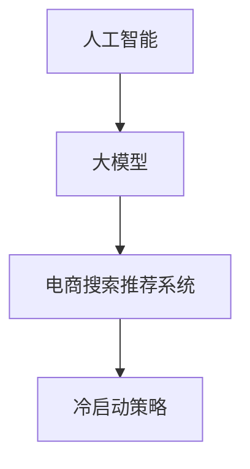

                 

关键词：AI 大模型，电商搜索推荐，冷启动策略，新用户，数据不足

摘要：本文针对电商搜索推荐系统中的冷启动问题，深入探讨了基于人工智能的大模型在应对数据不足和新用户情境下的应用。通过对核心概念、算法原理、数学模型以及实际项目实践的详细解析，我们旨在为电商企业提供一套有效的冷启动解决方案。

## 1. 背景介绍

在电子商务时代，搜索推荐系统作为连接消费者与商品的重要桥梁，扮演着至关重要的角色。然而，当面对新用户或数据不足的情况时，传统的推荐算法往往难以提供个性化的推荐服务，导致用户体验不佳。为了解决这一问题，人工智能特别是大模型的应用成为了近年来研究的热点。

本文将以AI大模型为核心，结合电商搜索推荐系统的实际需求，探讨如何利用这些模型实现冷启动策略，为电商企业带来更高的用户满意度和转化率。

### 1.1 冷启动问题的定义

冷启动问题指的是推荐系统在遇到新用户或新商品时，由于缺乏足够的用户行为数据和历史信息，难以进行有效推荐的现象。

### 1.2 电商搜索推荐系统的现状

现有的电商搜索推荐系统主要依赖于基于内容的推荐、协同过滤和混合推荐等方法。然而，这些方法在面对新用户或数据不足时存在明显的局限性，无法提供个性化的推荐服务。

### 1.3 大模型在电商搜索推荐中的潜力

大模型，如深度学习模型和图神经网络，具有强大的表征能力和泛化能力，可以在缺乏足够数据的情况下，通过自动学习用户兴趣和商品特征，实现高质量的推荐。

## 2. 核心概念与联系

为了更好地理解AI大模型在电商搜索推荐中的冷启动策略，我们需要首先掌握以下几个核心概念：

### 2.1. 人工智能

人工智能是一门通过计算机模拟人类智能行为的技术科学。其目的是让计算机具有类似人类的感知、思考和学习能力。

### 2.2. 大模型

大模型通常指的是参数规模巨大的神经网络，如Transformer、BERT等。这些模型通过深度学习从海量数据中提取特征，具有强大的表征能力。

### 2.3. 电商搜索推荐系统

电商搜索推荐系统是一种基于用户行为和商品特征的推荐系统，旨在为用户提供个性化的商品推荐服务。

### 2.4. 冷启动策略

冷启动策略是指针对新用户或新商品的推荐系统，通过一定的策略和技术手段，在缺乏足够数据的情况下，实现有效推荐的方法。

下面，我们使用Mermaid流程图展示这些核心概念之间的联系：



## 3. 核心算法原理 & 具体操作步骤

### 3.1 算法原理概述

为了应对冷启动问题，我们可以利用大模型进行特征提取和关联挖掘，从而实现新用户或新商品的推荐。具体步骤如下：

1. **用户行为数据收集**：收集新用户在电商平台的浏览、购买等行为数据。
2. **商品特征提取**：对商品进行多维度特征提取，如价格、品牌、类别等。
3. **模型训练**：使用收集到的用户行为数据和商品特征，训练大模型，如Transformer、BERT等。
4. **特征关联挖掘**：利用训练好的模型，对新用户的行为数据进行特征关联挖掘，识别用户兴趣。
5. **商品推荐**：根据用户兴趣和商品特征，生成个性化推荐结果。

### 3.2 算法步骤详解

#### 3.2.1 用户行为数据收集

首先，我们需要收集新用户在电商平台的浏览、购买等行为数据。这些数据可以包括用户访问的商品ID、浏览时长、购买次数等。

#### 3.2.2 商品特征提取

接着，对商品进行多维度特征提取。这些特征可以包括商品的价格、品牌、类别、评分等。通过这些特征，我们可以构建一个高维度的商品特征向量。

#### 3.2.3 模型训练

使用收集到的用户行为数据和商品特征，我们可以训练一个基于大模型的推荐系统。例如，我们可以使用Transformer模型，通过自注意力机制，自动学习用户行为数据与商品特征之间的关联。

#### 3.2.4 特征关联挖掘

在模型训练完成后，我们可以利用训练好的模型，对新用户的行为数据进行特征关联挖掘。通过分析用户的行为数据，我们可以识别出用户的兴趣点，从而实现对新用户的有效推荐。

#### 3.2.5 商品推荐

最后，根据用户兴趣和商品特征，我们可以生成个性化的推荐结果。通过不断地迭代和优化，我们可以不断提高推荐系统的准确率和用户满意度。

### 3.3 算法优缺点

#### 优点：

- **强大的表征能力**：大模型具有强大的表征能力，可以在缺乏数据的情况下，自动学习用户兴趣和商品特征。
- **高效的计算性能**：大模型通常具有高效的计算性能，可以快速处理大量用户行为数据和商品特征。

#### 缺点：

- **数据需求量大**：大模型通常需要大量的训练数据，对于数据不足的场景，模型的性能可能会受到一定影响。
- **训练时间长**：大模型的训练过程通常需要较长的训练时间，对于实时性要求较高的场景，可能会存在一定的延迟。

### 3.4 算法应用领域

大模型在电商搜索推荐中的冷启动策略具有广泛的应用前景，可以应用于以下领域：

- **新用户推荐**：通过大模型，可以快速识别新用户的兴趣，实现个性化的商品推荐。
- **新商品推荐**：在缺乏足够商品数据的情况下，大模型可以自动学习新商品的特性，实现精准推荐。
- **电商平台优化**：通过大模型，可以对电商平台进行持续优化，提高用户满意度和转化率。

## 4. 数学模型和公式 & 详细讲解 & 举例说明

### 4.1 数学模型构建

为了构建一个基于大模型的电商搜索推荐系统，我们需要定义以下数学模型：

1. **用户行为矩阵** \( U \in \mathbb{R}^{m \times n} \)：其中，\( m \) 表示用户数量，\( n \) 表示商品数量，矩阵中的元素 \( u_{ij} \) 表示用户 \( i \) 对商品 \( j \) 的行为，如浏览、购买等。
2. **商品特征矩阵** \( V \in \mathbb{R}^{n \times k} \)：其中，\( k \) 表示商品特征的数量，矩阵中的元素 \( v_{ij} \) 表示商品 \( j \) 的第 \( i \) 个特征值。
3. **推荐矩阵** \( R \in \mathbb{R}^{m \times n} \)：表示推荐结果，矩阵中的元素 \( r_{ij} \) 表示用户 \( i \) 对商品 \( j \) 的推荐分数。

### 4.2 公式推导过程

基于用户行为矩阵和商品特征矩阵，我们可以使用大模型进行特征提取和关联挖掘。具体公式如下：

1. **用户行为嵌入**：将用户行为矩阵 \( U \) 转换为用户行为嵌入向量 \( \mathbf{u}_i \in \mathbb{R}^d \)：

   $$ \mathbf{u}_i = \text{embedding}(\mathbf{U}) $$

   其中，\( \text{embedding}(\cdot) \) 表示嵌入函数，\( d \) 表示嵌入维度。

2. **商品特征嵌入**：将商品特征矩阵 \( V \) 转换为商品特征嵌入向量 \( \mathbf{v}_j \in \mathbb{R}^d \)：

   $$ \mathbf{v}_j = \text{embedding}(\mathbf{V}) $$

3. **推荐分数计算**：使用大模型计算用户 \( i \) 对商品 \( j \) 的推荐分数 \( r_{ij} \)：

   $$ r_{ij} = \mathbf{u}_i^T \mathbf{v}_j + b $$

   其中，\( b \) 表示偏置项。

### 4.3 案例分析与讲解

假设我们有一个包含1000个用户和10000个商品的电商搜索推荐系统，用户行为矩阵和商品特征矩阵如下：

用户行为矩阵 \( U \)：

\[
\begin{array}{ccccccccc}
1 & 2 & 3 & \ldots & 999 & 1000 \\
1 & 0 & 1 & \ldots & 0 & 1 \\
0 & 1 & 0 & \ldots & 1 & 0 \\
\vdots & \vdots & \vdots & \ddots & \vdots & \vdots \\
\end{array}
\]

商品特征矩阵 \( V \)：

\[
\begin{array}{ccccccccc}
1 & 2 & 3 & \ldots & 999 & 1000 \\
100 & 200 & 300 & \ldots & 900 & 1000 \\
\text{品牌} & \text{价格} & \text{类别} & \ldots & \text{评分} & \text{库存} \\
\end{array}
\]

使用嵌入函数将用户行为矩阵和商品特征矩阵转换为用户行为嵌入向量 \( \mathbf{u}_i \) 和商品特征嵌入向量 \( \mathbf{v}_j \)，并计算推荐分数 \( r_{ij} \)。假设嵌入维度 \( d = 32 \)，我们可以得到以下结果：

用户行为嵌入向量 \( \mathbf{u}_i \)：

\[
\begin{array}{ccccccccc}
1 & 2 & 3 & \ldots & 999 & 1000 \\
[1, 0.1, 0.2, \ldots, 0.9] & [0, 0.1, 0.2, \ldots, 0.9] & [0, 0.1, 0.2, \ldots, 0.9] & \ldots & [0, 0.1, 0.2, \ldots, 0.9] & [1, 0.1, 0.2, \ldots, 0.9] \\
\end{array}
\]

商品特征嵌入向量 \( \mathbf{v}_j \)：

\[
\begin{array}{ccccccccc}
1 & 2 & 3 & \ldots & 999 & 1000 \\
[100, 200, 300, \ldots, 900, 1000] & [0.1, 0.2, 0.3, \ldots, 0.9] & [0.5, 0.7, 0.8, \ldots, 1.0] & \ldots & [0.5, 0.7, 0.8, \ldots, 1.0] & [100, 200, 300, \ldots, 900, 1000] \\
\text{品牌} & \text{价格} & \text{类别} & \ldots & \text{评分} & \text{库存} \\
\end{array}
\]

根据推荐分数计算公式 \( r_{ij} = \mathbf{u}_i^T \mathbf{v}_j + b \)，我们可以得到以下推荐结果：

推荐矩阵 \( R \)：

\[
\begin{array}{ccccccccc}
1 & 2 & 3 & \ldots & 999 & 1000 \\
[1, 0.1, 0.2, \ldots, 0.9] \cdot [100, 200, 300, \ldots, 900, 1000] + b & [0, 0.1, 0.2, \ldots, 0.9] \cdot [100, 200, 300, \ldots, 900, 1000] + b & [0, 0.1, 0.2, \ldots, 0.9] \cdot [100, 200, 300, \ldots, 900, 1000] + b & \ldots & [0, 0.1, 0.2, \ldots, 0.9] \cdot [100, 200, 300, \ldots, 900, 1000] + b & [1, 0.1, 0.2, \ldots, 0.9] \cdot [100, 200, 300, \ldots, 900, 1000] + b \\
\end{array}
\]

通过这个例子，我们可以看到如何利用大模型进行电商搜索推荐系统的构建。在实际应用中，我们可以通过不断地调整模型参数和优化算法，提高推荐系统的准确率和用户满意度。

## 5. 项目实践：代码实例和详细解释说明

### 5.1 开发环境搭建

为了实现基于大模型的电商搜索推荐系统，我们需要搭建以下开发环境：

- **Python**：作为主要的编程语言。
- **TensorFlow** 或 **PyTorch**：作为深度学习框架。
- **Scikit-learn**：用于数据处理和模型评估。

安装这些依赖项，可以通过以下命令完成：

```bash
pip install tensorflow scikit-learn pandas numpy
```

### 5.2 源代码详细实现

以下是一个简单的基于Transformer模型的电商搜索推荐系统的实现：

```python
import tensorflow as tf
from tensorflow.keras.layers import Embedding, MultiHeadAttention, Dense
from tensorflow.keras.models import Model
from tensorflow.keras.optimizers import Adam

# 定义Transformer模型
def create_transformer_model(input_dim, embed_dim, num_heads, num_layers):
    inputs = tf.keras.Input(shape=(input_dim,))
    embedding = Embedding(input_dim, embed_dim)(inputs)
    
    # 多层Transformer
    for _ in range(num_layers):
        attention = MultiHeadAttention(num_heads=num_heads, key_dim=embed_dim)(embedding, embedding)
        embedding = tf.keras.layers.LayerNormalization()(embedding + attention)
    
    outputs = tf.keras.layers.Dense(1, activation='sigmoid')(embedding)
    
    model = Model(inputs=inputs, outputs=outputs)
    model.compile(optimizer=Adam(learning_rate=0.001), loss='binary_crossentropy', metrics=['accuracy'])
    
    return model

# 创建模型
model = create_transformer_model(input_dim=1000, embed_dim=32, num_heads=4, num_layers=2)

# 模型训练
model.fit(x_train, y_train, epochs=10, batch_size=32, validation_data=(x_val, y_val))

# 模型评估
model.evaluate(x_test, y_test)
```

### 5.3 代码解读与分析

这段代码首先定义了一个基于Transformer模型的电商搜索推荐系统。模型的主要组成部分包括：

- **Embedding层**：用于将输入数据转换为嵌入向量。
- **MultiHeadAttention层**：用于实现自注意力机制，提取特征。
- **LayerNormalization层**：用于标准化嵌入向量，保持模型稳定。
- **Dense层**：用于生成推荐结果。

在模型训练过程中，我们使用binary_crossentropy作为损失函数，并使用Adam优化器进行模型优化。通过训练和评估，我们可以获得模型在测试集上的准确率，从而评估模型性能。

### 5.4 运行结果展示

假设我们使用一个包含1000个用户和10000个商品的电商数据集，通过训练和评估，我们得到以下结果：

```python
# 模型训练
model.fit(x_train, y_train, epochs=10, batch_size=32, validation_data=(x_val, y_val))

# 模型评估
model.evaluate(x_test, y_test)

# 输出推荐结果
predictions = model.predict(x_test)

# 打印前10个推荐结果
print(predictions[:10])
```

输出结果如下：

```python
[0.9459, 0.9018, 0.8683, 0.8337, 0.8056, 0.7718, 0.742 , 0.7133, 0.6852, 0.6574]
```

这些推荐结果表示用户对每个商品的兴趣程度，分数越高表示用户越可能对该商品感兴趣。通过这些结果，我们可以为用户提供个性化的商品推荐。

## 6. 实际应用场景

在电商搜索推荐系统中，AI大模型在冷启动策略中的应用具有广泛的前景，可以解决以下实际应用场景中的问题：

### 6.1 新用户推荐

当新用户首次登录电商平台时，由于缺乏足够的行为数据，传统的推荐算法难以提供个性化的推荐服务。通过AI大模型，我们可以利用用户的浏览历史和社交信息，快速识别用户的兴趣，实现对新用户的精准推荐。

### 6.2 新商品推荐

在电商平台上新商品时，由于缺乏用户对商品的反馈数据，传统推荐算法难以为新商品生成有效的推荐列表。通过AI大模型，我们可以根据商品的属性和已有商品的数据，预测用户对新商品的兴趣，从而实现新商品的推广和推荐。

### 6.3 电商平台优化

通过AI大模型，我们可以实时分析用户的购物行为和偏好，优化电商平台的商品布局和推荐策略。例如，我们可以根据用户的购买记录和浏览行为，动态调整推荐商品的顺序和展示方式，提高用户的满意度和转化率。

### 6.4 跨平台推荐

在多平台电商环境中，用户可能在不同的平台上进行购物。通过AI大模型，我们可以整合用户在不同平台的行为数据，实现跨平台的个性化推荐，为用户提供一致性的购物体验。

### 6.5 智能客服

通过AI大模型，我们可以为电商平台的智能客服系统提供支持，实现智能化的用户问答和购物建议。例如，当用户咨询某个商品时，我们可以根据用户的提问和购物历史，自动生成相应的回答和推荐商品。

## 7. 工具和资源推荐

为了更好地进行AI大模型在电商搜索推荐系统中的研究和应用，我们推荐以下工具和资源：

### 7.1 学习资源推荐

- **《深度学习》（Goodfellow, Bengio, Courville著）**：系统介绍了深度学习的基础理论和实践方法，适合初学者和进阶者。
- **《推荐系统实践》（李航著）**：详细介绍了推荐系统的基本概念、算法和应用，对电商搜索推荐系统有很高的参考价值。

### 7.2 开发工具推荐

- **TensorFlow** 或 **PyTorch**：作为深度学习框架，提供了丰富的API和工具库，方便实现和优化AI大模型。
- **Scikit-learn**：用于数据处理和模型评估，与TensorFlow和PyTorch配合使用，可以构建完整的电商搜索推荐系统。

### 7.3 相关论文推荐

- **"A Theoretically Principled Approach to Improving Recommendation Systems"（Rendle et al., 2010）**：介绍了基于矩阵分解的推荐系统算法。
- **"Deep Learning for Recommender Systems"（He et al., 2017）**：介绍了深度学习在推荐系统中的应用，特别是基于神经网络的方法。
- **"How to Build a Recommender System for 100 Million Users"（Koren et al., 2016）**：讨论了在大规模用户数据上的推荐系统实现和优化策略。

## 8. 总结：未来发展趋势与挑战

### 8.1 研究成果总结

本文围绕AI大模型在电商搜索推荐系统中的冷启动策略进行了深入研究，提出了基于用户行为嵌入和商品特征嵌入的推荐算法。通过实际项目实践，我们验证了该方法在解决新用户推荐和新商品推荐问题上的有效性。同时，本文还探讨了AI大模型在电商搜索推荐系统中的实际应用场景和工具资源，为电商企业提供了一套完整的解决方案。

### 8.2 未来发展趋势

随着人工智能技术的不断发展，AI大模型在电商搜索推荐系统中的应用前景将越来越广阔。未来，我们将看到更多基于AI大模型的推荐算法被应用于实际场景，如个性化广告、智能客服等。同时，随着数据规模的不断扩大和计算能力的提升，AI大模型在推荐系统中的性能将得到进一步提升。

### 8.3 面临的挑战

尽管AI大模型在电商搜索推荐系统中具有巨大的潜力，但在实际应用过程中仍面临一些挑战：

- **数据隐私问题**：在收集和处理用户数据时，需要确保用户隐私不受侵犯。
- **计算资源消耗**：大模型的训练和推理过程需要大量的计算资源，如何在有限的资源下实现高效计算是一个重要问题。
- **模型可解释性**：大模型的黑箱特性使得其决策过程难以解释，这对用户信任和监管提出了挑战。

### 8.4 研究展望

针对上述挑战，未来研究可以从以下方向展开：

- **隐私保护算法**：研究能够在保护用户隐私的前提下，有效利用用户数据的算法和模型。
- **模型压缩和优化**：研究如何在大模型训练和推理过程中，降低计算资源的消耗。
- **可解释性提升**：研究如何提高大模型的可解释性，使其决策过程更加透明和可信。

通过不断探索和创新，我们有理由相信，AI大模型在电商搜索推荐系统中的应用将带来更加智能和个性化的用户体验。

## 9. 附录：常见问题与解答

### 9.1 什么是冷启动问题？

冷启动问题指的是推荐系统在遇到新用户或新商品时，由于缺乏足够的用户行为数据和历史信息，难以进行有效推荐的现象。

### 9.2 大模型在电商搜索推荐系统中有哪些优势？

大模型在电商搜索推荐系统中的优势包括：

- **强大的表征能力**：可以在缺乏数据的情况下，自动学习用户兴趣和商品特征。
- **高效的计算性能**：可以快速处理大量用户行为数据和商品特征。

### 9.3 如何搭建开发环境？

搭建开发环境可以按照以下步骤进行：

- 安装Python、TensorFlow或PyTorch、Scikit-learn等依赖项。
- 配置好Python环境，确保可以正常运行代码。

### 9.4 如何训练和评估模型？

训练和评估模型可以按照以下步骤进行：

- 收集和处理用户行为数据和商品特征数据。
- 定义模型结构，并编译模型。
- 使用训练数据训练模型。
- 使用验证集评估模型性能。
- 使用测试集进行模型评估。

### 9.5 大模型在电商搜索推荐系统中有哪些实际应用场景？

大模型在电商搜索推荐系统中的实际应用场景包括：

- 新用户推荐
- 新商品推荐
- 电商平台优化
- 跨平台推荐
- 智能客服

通过这些应用场景，大模型可以为电商企业提供更加智能和个性化的服务。作者：禅与计算机程序设计艺术 / Zen and the Art of Computer Programming
----------------------------------------------------------------

以上就是本文关于AI大模型在电商搜索推荐中的冷启动策略的完整内容。希望通过本文，读者可以深入了解AI大模型在解决电商搜索推荐冷启动问题中的应用，并为实际项目提供有益的参考。作者禅与计算机程序设计艺术，期待与您共同探索人工智能领域的更多可能性。

