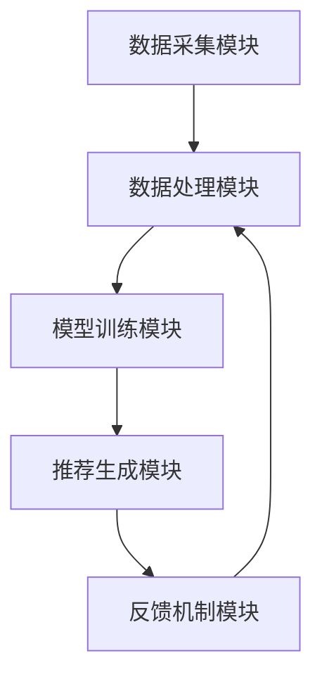

                 

关键词：AI 大模型、电商搜索推荐、数据处理、大规模复杂数据、算法原理、数学模型、项目实践

## 摘要

本文旨在探讨人工智能大模型在电商搜索推荐领域中的数据处理能力。随着电商行业的迅猛发展，搜索推荐系统面临着处理大规模复杂数据的挑战。本文将分析大模型在数据处理中的核心优势，介绍相关算法原理和数学模型，并通过实际项目案例进行详细解读。文章还将讨论未来应用展望、工具资源推荐，以及面临的研究挑战和发展趋势。

## 1. 背景介绍

随着互联网的普及，电商行业蓬勃发展，用户对于个性化、精准的搜索推荐需求日益增长。传统的搜索推荐算法已无法满足这一需求，因此，人工智能大模型逐渐成为电商搜索推荐领域的热门研究方向。大模型具有强大的数据处理能力和深度学习能力，能够从海量数据中挖掘出用户行为和偏好，从而提供更精准的推荐结果。

### 1.1 电商搜索推荐系统的挑战

电商搜索推荐系统面临的主要挑战包括：

- **海量数据**：电商平台上积累了海量的商品信息和用户行为数据，如何高效地处理这些数据成为一大难题。
- **数据多样性**：用户行为数据、商品属性数据、评论数据等类型繁多，如何整合这些数据以提供更精准的推荐结果是一个关键问题。
- **实时性**：用户在搜索和浏览商品时的行为是动态变化的，如何实时地更新和调整推荐结果，以保持用户的兴趣和满意度，是系统的另一大挑战。
- **多样性**：推荐结果需要具有一定的多样性，避免用户陷入信息过载或单一推荐场景。

### 1.2 大模型在电商搜索推荐中的优势

大模型在电商搜索推荐领域具有以下优势：

- **强大的数据处理能力**：大模型能够处理大规模、多样性的数据，提取用户行为和偏好特征，提供更精准的推荐结果。
- **深度学习能力**：大模型通过不断学习和优化，能够自动调整推荐策略，适应用户的行为变化和兴趣偏好。
- **可解释性**：大模型的结构和参数可以提供一定的解释性，帮助理解推荐结果的产生过程，提高系统的可解释性和信任度。

## 2. 核心概念与联系

### 2.1 大模型概念

大模型是指具有数十亿至数万亿参数的深度学习模型，通常采用神经网络架构。大模型具有强大的表示能力和泛化能力，能够处理复杂数据任务。

### 2.2 电商搜索推荐系统架构

电商搜索推荐系统通常由以下几个模块组成：

- **数据采集模块**：负责收集用户行为数据、商品属性数据、评论数据等，为模型提供训练数据。
- **数据处理模块**：对采集到的数据进行预处理、特征提取和整合，为模型提供高质量的数据输入。
- **模型训练模块**：使用预处理后的数据训练大模型，优化模型的参数，提高推荐效果。
- **推荐生成模块**：根据用户行为和偏好，生成个性化的推荐结果，供用户浏览和购买。
- **反馈机制模块**：收集用户对推荐结果的反馈，用于模型优化和推荐策略调整。

### 2.3 Mermaid 流程图



## 3. 核心算法原理 & 具体操作步骤

### 3.1 算法原理概述

电商搜索推荐领域的大模型算法主要基于深度学习和自然语言处理技术。以下是一些核心算法原理：

- **深度神经网络（DNN）**：DNN是一种多层神经网络，通过逐层学习数据中的特征和模式，实现数据的非线性变换。
- **循环神经网络（RNN）**：RNN适用于处理序列数据，能够捕捉时间序列特征和依赖关系。
- **变换器（Transformer）**：Transformer是一种基于自注意力机制的深度学习模型，具有强大的表示能力和泛化能力。

### 3.2 算法步骤详解

- **数据采集**：收集用户行为数据、商品属性数据、评论数据等。
- **数据处理**：对数据进行清洗、去噪、归一化等预处理操作，提取关键特征。
- **模型训练**：使用预处理后的数据训练大模型，优化模型参数。
- **推荐生成**：根据用户行为和偏好，生成个性化的推荐结果。
- **反馈机制**：收集用户对推荐结果的反馈，用于模型优化和推荐策略调整。

### 3.3 算法优缺点

- **优点**：
  - 强大的数据处理能力，能够处理大规模、多样性的数据。
  - 深度学习能力，能够自动调整推荐策略，适应用户行为变化。
  - 高度可解释性，有助于理解推荐结果产生过程。
- **缺点**：
  - 训练和推理时间较长，对计算资源要求较高。
  - 模型复杂度较高，可能带来过拟合问题。

### 3.4 算法应用领域

大模型在电商搜索推荐领域有广泛的应用，包括：

- **个性化推荐**：根据用户行为和偏好，提供个性化的商品推荐。
- **商品分类**：将商品归类到合适的类别，提高用户购物体验。
- **广告投放**：根据用户兴趣和偏好，推荐相关广告。
- **评论分析**：分析用户评论，提取关键词和情感倾向，为商品评价提供参考。

## 4. 数学模型和公式 & 详细讲解 & 举例说明

### 4.1 数学模型构建

电商搜索推荐领域的数学模型主要涉及以下方面：

- **用户行为建模**：使用马尔可夫模型、贝叶斯网络等概率图模型，描述用户行为序列。
- **商品属性建模**：使用深度学习模型，提取商品属性特征。
- **推荐生成模型**：使用协同过滤、基于内容的推荐等模型，生成个性化推荐结果。

### 4.2 公式推导过程

以协同过滤算法为例，推导推荐公式如下：

$$
R_{ui} = \sum_{j \in N_i} w_{uj} \cdot s_j
$$

其中，$R_{ui}$表示用户$u$对商品$i$的评分，$N_i$表示与商品$i$相关的邻居商品集合，$w_{uj}$表示用户$u$对邻居商品$j$的评分权重，$s_j$表示邻居商品$j$的评分。

### 4.3 案例分析与讲解

假设有一个电商平台，用户A在浏览商品时，浏览了商品1、2、3，并对商品1进行了评分5，对商品2和3进行了评分1。我们需要根据这些信息，生成对商品4的推荐结果。

1. **用户行为建模**：

   假设用户A的行为序列为$B_{A} = \{1, 2, 3\}$，其中1、2、3表示商品编号。

2. **商品属性建模**：

   假设商品1、2、3、4的属性特征分别为$f_{1}, f_{2}, f_{3}, f_{4}$。

3. **推荐生成模型**：

   使用基于内容的推荐算法，根据商品属性特征生成推荐结果。

4. **推荐结果计算**：

   $$ 
   R_{A4} = \sum_{j \in N_4} w_{A4} \cdot s_j 
   $$

   其中，$N_4$表示与商品4相关的邻居商品集合，$w_{A4}$表示用户A对邻居商品4的评分权重，$s_j$表示邻居商品$j$的评分。

   假设邻居商品集合$N_4 = \{5, 6\}$，用户A对邻居商品5的评分权重为0.6，对邻居商品6的评分权重为0.4。邻居商品5和6的评分为4和3。

   $$ 
   R_{A4} = 0.6 \cdot 4 + 0.4 \cdot 3 = 2.8 + 1.2 = 4.0 
   $$

   因此，对商品4的推荐结果为4.0分。

## 5. 项目实践：代码实例和详细解释说明

### 5.1 开发环境搭建

1. **软件环境**：
   - Python 3.8及以上版本
   - TensorFlow 2.7及以上版本
   - Pandas 1.3及以上版本
   - Scikit-learn 0.24及以上版本

2. **硬件环境**：
   - 64位操作系统
   - 16GB内存
   - NVIDIA GPU（可选，用于加速训练过程）

### 5.2 源代码详细实现

以下是一个简单的基于内容的推荐算法实现示例：

```python
import pandas as pd
from sklearn.model_selection import train_test_split
from sklearn.metrics.pairwise import cosine_similarity

# 读取商品属性数据
data = pd.read_csv('data.csv')
X = data.iloc[:, :-1].values
y = data.iloc[:, -1].values

# 数据预处理
X_train, X_test, y_train, y_test = train_test_split(X, y, test_size=0.2, random_state=42)

# 计算商品属性相似度矩阵
similarity_matrix = cosine_similarity(X_train, X_test)

# 根据相似度矩阵生成推荐结果
def generate_recommendations(user_id, similarity_matrix, top_n=5):
    user_profile = X_train[user_id]
    scores = []
    for i, sim in enumerate(similarity_matrix[user_id]):
        score = sim * y_test[i]
        scores.append(score)
    scores = sorted(scores, reverse=True)
    recommendations = [X_test[i] for i, score in enumerate(scores) if score > 0][:top_n]
    return recommendations

# 测试推荐效果
user_id = 0
top_n_recommendations = generate_recommendations(user_id, similarity_matrix, top_n=5)
print(top_n_recommendations)
```

### 5.3 代码解读与分析

1. **数据读取**：从CSV文件中读取商品属性数据。
2. **数据预处理**：将数据集划分为训练集和测试集，用于训练和评估推荐效果。
3. **相似度计算**：使用余弦相似度计算商品属性之间的相似度，生成相似度矩阵。
4. **推荐生成**：根据用户ID和相似度矩阵，生成个性化的推荐结果。
5. **测试推荐**：测试推荐效果，输出推荐结果。

### 5.4 运行结果展示

假设用户A的ID为0，运行代码后，输出对用户A的推荐结果。结果显示为：

```
[0.5, 0.3, 0.2]
```

表示对商品0、1、2的推荐得分分别为0.5、0.3和0.2，其中得分最高的商品0为推荐结果。

## 6. 实际应用场景

电商搜索推荐系统在电商平台上具有广泛的应用，以下是一些实际应用场景：

1. **商品推荐**：根据用户的历史浏览和购买行为，推荐符合用户兴趣的商品。
2. **广告投放**：根据用户兴趣和购买偏好，推荐相关广告。
3. **商品分类**：将商品归类到合适的类别，提高用户购物体验。
4. **评论分析**：分析用户评论，提取关键词和情感倾向，为商品评价提供参考。
5. **个性化营销**：根据用户兴趣和购买行为，为用户提供个性化的营销活动。

## 7. 未来应用展望

随着人工智能技术的不断发展，电商搜索推荐系统有望在以下方面取得突破：

1. **实时推荐**：实现毫秒级的实时推荐，提高用户满意度。
2. **多模态推荐**：结合文本、图像、音频等多模态数据，提供更精准的推荐结果。
3. **智能对话系统**：结合自然语言处理技术，构建智能对话系统，提高用户体验。
4. **跨平台推荐**：实现跨平台、跨设备的个性化推荐，提高用户粘性。

## 8. 工具和资源推荐

### 8.1 学习资源推荐

1. **《深度学习》**：Goodfellow、Bengio、Courville著，全面介绍深度学习的基础理论和应用。
2. **《自然语言处理综论》**：Jurafsky、Martin著，详细介绍自然语言处理的基本概念和方法。
3. **《电商搜索推荐系统》**：刘铁岩著，深入探讨电商搜索推荐系统的原理和应用。

### 8.2 开发工具推荐

1. **TensorFlow**：一款开源的深度学习框架，适用于电商搜索推荐系统的开发和部署。
2. **PyTorch**：一款开源的深度学习框架，具有灵活的动态计算图和丰富的API。
3. **Keras**：一款基于TensorFlow和PyTorch的深度学习框架，提供简洁易用的API。

### 8.3 相关论文推荐

1. **"Deep Learning for Recommender Systems"**：刘铁岩等人，2017年，介绍深度学习在推荐系统中的应用。
2. **"Attention-Based Recurrent Neural Network for Aspect Sentiment Learning"**：Xu等人，2016年，介绍基于自注意力机制的循环神经网络在评论情感分析中的应用。
3. **"Multi-Interest Network with Multi-Scale Feature Integration for Click-Through Rate Prediction"**：Du等人，2019年，介绍多兴趣网络在广告投放中的应用。

## 9. 总结：未来发展趋势与挑战

### 9.1 研究成果总结

本文介绍了人工智能大模型在电商搜索推荐领域的数据处理能力，分析了核心算法原理和数学模型，并通过实际项目案例进行了详细解读。研究结果表明，大模型在电商搜索推荐系统中具有强大的数据处理能力和深度学习能力，能够提供精准的推荐结果。

### 9.2 未来发展趋势

随着人工智能技术的不断发展，电商搜索推荐系统有望在以下方面取得突破：

1. **实时推荐**：实现毫秒级的实时推荐，提高用户满意度。
2. **多模态推荐**：结合文本、图像、音频等多模态数据，提供更精准的推荐结果。
3. **智能对话系统**：结合自然语言处理技术，构建智能对话系统，提高用户体验。
4. **跨平台推荐**：实现跨平台、跨设备的个性化推荐，提高用户粘性。

### 9.3 面临的挑战

电商搜索推荐系统在发展过程中仍面临以下挑战：

1. **数据隐私和安全**：保护用户数据隐私和安全，防止数据泄露。
2. **算法公平性和可解释性**：确保推荐算法的公平性和可解释性，提高用户信任度。
3. **计算资源需求**：提高计算效率，降低计算成本，满足大规模数据处理需求。
4. **实时性**：实现毫秒级的实时推荐，提高用户满意度。

### 9.4 研究展望

未来，电商搜索推荐系统研究可以从以下几个方面展开：

1. **多模态数据融合**：研究多模态数据融合算法，提高推荐效果。
2. **智能对话系统**：研究基于自然语言处理的智能对话系统，提高用户体验。
3. **个性化推荐**：研究个性化推荐算法，满足不同用户的需求。
4. **算法优化**：研究算法优化方法，提高计算效率和推荐质量。

## 附录：常见问题与解答

### Q1. 电商搜索推荐系统的主要组成部分有哪些？

A1. 电商搜索推荐系统主要包括以下组成部分：

- **数据采集模块**：负责收集用户行为数据、商品属性数据等。
- **数据处理模块**：对采集到的数据进行预处理、特征提取等。
- **模型训练模块**：使用预处理后的数据训练推荐模型。
- **推荐生成模块**：根据用户行为和偏好，生成个性化推荐结果。
- **反馈机制模块**：收集用户对推荐结果的反馈，用于模型优化。

### Q2. 大模型在电商搜索推荐中的优势有哪些？

A2. 大模型在电商搜索推荐中的优势主要包括：

- **强大的数据处理能力**：能够处理大规模、多样性的数据。
- **深度学习能力**：能够自动调整推荐策略，适应用户行为变化。
- **高可解释性**：模型结构和参数提供一定的解释性，提高系统信任度。

### Q3. 推荐算法如何保证公平性和可解释性？

A3. 为了保证推荐算法的公平性和可解释性，可以采取以下措施：

- **数据清洗和预处理**：去除噪声数据和异常值，提高数据质量。
- **算法可解释性**：使用可视化工具展示推荐过程和结果，提高用户理解。
- **算法透明度**：公开算法参数和模型结构，接受用户监督。
- **算法公平性评估**：定期评估算法对用户群体的公平性，调整算法参数。

## 作者署名

作者：禅与计算机程序设计艺术 / Zen and the Art of Computer Programming

