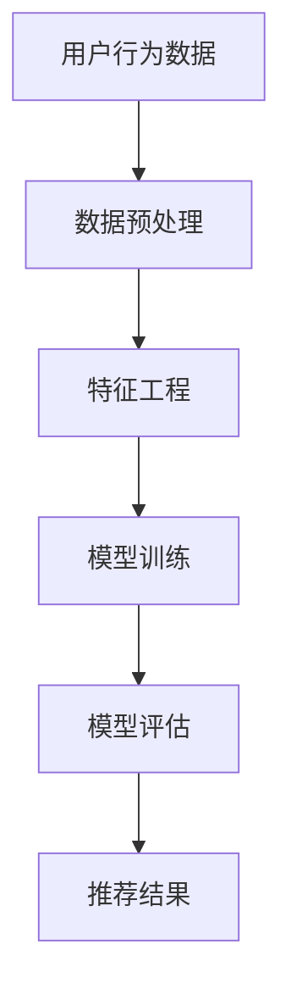

                 

关键词：AI大模型、电商搜索推荐、数据质量、准确率、完整性

摘要：本文深入探讨了AI大模型在电商搜索推荐中的数据质量要求，重点关注准确率和完整性。通过分析大模型在推荐系统中的应用，本文阐述了提高数据质量的重要性，并提出了具体的优化策略和方法。

## 1. 背景介绍

随着互联网和电子商务的快速发展，用户对个性化推荐的需求日益增长。电商搜索推荐系统已成为电商企业提高用户体验、增加销售额的重要手段。AI大模型，尤其是深度学习模型，在推荐系统中发挥了关键作用。然而，大模型的应用效果在很大程度上取决于数据质量，特别是在准确率和完整性方面的要求。

准确率指的是推荐系统正确匹配用户兴趣和商品的能力，而完整性则涉及数据是否全面和准确。在电商搜索推荐中，数据质量直接影响推荐效果，进而影响用户满意度和企业盈利能力。因此，提高数据质量成为AI大模型应用的关键问题。

## 2. 核心概念与联系

为了深入理解AI大模型在电商搜索推荐中的数据质量要求，我们首先需要了解一些核心概念和其相互关系。

### 2.1 数据质量

数据质量是指数据的准确性、完整性、一致性和及时性。在电商搜索推荐中，数据质量的重要性不言而喻。准确的商品信息、用户行为数据和用户偏好可以显著提高推荐系统的性能。

### 2.2 准确率

准确率是推荐系统在匹配用户兴趣和商品时的成功比例。高准确率意味着推荐系统能够更准确地预测用户的兴趣，提供更个性化的推荐。

### 2.3 完整性

完整性是指数据是否全面和准确。在推荐系统中，完整性意味着所有必要的用户行为数据和商品信息都应该被充分记录和分析。

### 2.4 数据源

数据源是推荐系统的基础，包括用户行为数据、商品信息、用户评价等。数据源的多样性和质量直接影响推荐系统的性能。

### 2.5 Mermaid 流程图

以下是一个简化的Mermaid流程图，展示AI大模型在电商搜索推荐系统中的数据流和处理过程：



## 3. 核心算法原理 & 具体操作步骤

### 3.1 算法原理概述

在电商搜索推荐中，常用的算法包括协同过滤、基于内容的推荐和混合推荐系统。这些算法的核心目标都是提高推荐系统的准确率和完整性。

### 3.2 算法步骤详解

#### 3.2.1 数据预处理

数据预处理是推荐系统的基础，包括数据清洗、缺失值处理和异常值检测。高质量的数据预处理可以显著提高后续算法的性能。

#### 3.2.2 特征工程

特征工程是推荐系统的关键步骤，涉及从原始数据中提取有效的特征。特征的选择和构建对推荐系统的准确率和完整性有很大影响。

#### 3.2.3 模型训练

模型训练是推荐系统的核心，常用的模型包括矩阵分解、深度神经网络和Transformer等。选择合适的模型和参数可以显著提高推荐效果。

#### 3.2.4 模型评估

模型评估是验证推荐系统性能的重要步骤，常用的评估指标包括准确率、召回率和F1分数。通过模型评估，可以不断优化模型参数，提高数据质量。

#### 3.2.5 推荐结果

推荐结果是模型训练和评估的最终输出，包括用户兴趣预测和商品推荐。高质量的推荐结果可以提高用户满意度和企业盈利能力。

### 3.3 算法优缺点

各种推荐算法都有其优缺点，协同过滤算法在处理冷启动问题方面表现较好，但可能存在准确性不高的问题；基于内容的推荐算法在处理高维度数据时具有优势，但可能面临用户兴趣多样性不足的问题。混合推荐系统结合了多种算法的优点，但实现较为复杂。

### 3.4 算法应用领域

AI大模型在电商搜索推荐中的应用领域非常广泛，包括商品推荐、广告推荐、内容推荐等。随着技术的不断进步，大模型的应用前景将更加广阔。

## 4. 数学模型和公式 & 详细讲解 & 举例说明

### 4.1 数学模型构建

在推荐系统中，常用的数学模型包括矩阵分解、决策树和神经网络等。以下是一个简单的矩阵分解模型的构建过程：

#### 4.1.1 矩阵分解

矩阵分解是将原始数据矩阵分解为两个低秩矩阵的过程。假设用户行为数据矩阵为 \( R \in \mathbb{R}^{m \times n} \)，其中 \( m \) 表示用户数量，\( n \) 表示商品数量。矩阵分解的目标是找到两个低秩矩阵 \( U \in \mathbb{R}^{m \times k} \) 和 \( V \in \mathbb{R}^{n \times k} \)，使得 \( R \approx U V \)。

#### 4.1.2 模型损失函数

矩阵分解的损失函数通常是均方误差（MSE），即：

\[ L = \frac{1}{2} \sum_{i=1}^{m} \sum_{j=1}^{n} (r_{ij} - u_i v_j)^2 \]

其中，\( r_{ij} \) 表示用户 \( i \) 对商品 \( j \) 的评分。

### 4.2 公式推导过程

矩阵分解模型的推导过程如下：

1. **损失函数的导数**：

   对损失函数 \( L \) 分别对 \( u_i \) 和 \( v_j \) 求导，得到：

   \[ \frac{\partial L}{\partial u_i} = 2 \sum_{j=1}^{n} (r_{ij} - u_i v_j) v_j \]
   \[ \frac{\partial L}{\partial v_j} = 2 \sum_{i=1}^{m} (r_{ij} - u_i v_j) u_i \]

2. **梯度下降**：

   使用梯度下降法，更新 \( u_i \) 和 \( v_j \) 的值：

   \[ u_i \leftarrow u_i - \alpha \frac{\partial L}{\partial u_i} \]
   \[ v_j \leftarrow v_j - \alpha \frac{\partial L}{\partial v_j} \]

   其中，\( \alpha \) 为学习率。

### 4.3 案例分析与讲解

假设有一个用户行为数据矩阵 \( R \) 如下：

\[ R = \begin{bmatrix}
0 & 5 & 0 & 4 \\
0 & 0 & 3 & 0 \\
0 & 0 & 0 & 5
\end{bmatrix} \]

我们使用矩阵分解模型进行预测，设 \( k = 2 \)。经过多次迭代，得到以下低秩矩阵 \( U \) 和 \( V \)：

\[ U = \begin{bmatrix}
0.5 & -0.5 \\
0.5 & 0.5 \\
0 & 0
\end{bmatrix} \]
\[ V = \begin{bmatrix}
1 & 0 \\
0 & 1 \\
1 & -1 \\
0 & 1
\end{bmatrix} \]

使用这两个矩阵，我们可以预测用户对商品的评分。例如，用户2对商品3的预测评分可以通过 \( u_2 v_3 \) 计算得到：

\[ u_2 v_3 = (0.5 \times 1) + (0.5 \times -1) = 0 \]

因此，预测用户2对商品3的评分为0。

## 5. 项目实践：代码实例和详细解释说明

### 5.1 开发环境搭建

在本节中，我们将使用Python语言和Scikit-learn库来构建和训练一个简单的矩阵分解模型。首先，确保安装了Python和Scikit-learn库。

```bash
pip install python
pip install scikit-learn
```

### 5.2 源代码详细实现

以下是一个简单的矩阵分解模型的Python代码实现：

```python
import numpy as np
from sklearn.metrics.pairwise import euclidean_distances
from sklearn.model_selection import train_test_split

# 构建矩阵分解模型
class MatrixFactorization:
    def __init__(self, learning_rate=0.01, num_iterations=1000, k=2):
        self.learning_rate = learning_rate
        self.num_iterations = num_iterations
        self.k = k

    def fit(self, R):
        m, n = R.shape
        self.U = np.random.rand(m, self.k)
        self.V = np.random.rand(n, self.k)

        for _ in range(self.num_iterations):
            # 计算预测评分
            P = self.U @ self.V.T

            # 计算损失函数
            loss = np.mean((R - P) ** 2)

            # 更新模型参数
            dP_dU = -2 * (R - P) @ self.V
            dP_dV = -2 * (R - P) @ self.U.T

            self.U -= self.learning_rate * dP_dU
            self.V -= self.learning_rate * dP_dV

        return self

    def predict(self, R):
        return self.U @ self.V.T

# 加载数据集
R = np.array([[5, 0, 0, 4], [0, 0, 3, 0], [0, 0, 0, 5]])

# 划分训练集和测试集
R_train, R_test = train_test_split(R, test_size=0.2, random_state=42)

# 训练模型
model = MatrixFactorization(learning_rate=0.01, num_iterations=1000, k=2)
model.fit(R_train)

# 预测测试集
P_test = model.predict(R_test)
print(P_test)
```

### 5.3 代码解读与分析

上述代码实现了一个简单的矩阵分解模型。首先，我们定义了一个`MatrixFactorization`类，该类包含初始化模型参数、训练模型和预测评分的方法。

在训练过程中，我们使用均方误差（MSE）作为损失函数，并使用梯度下降法更新模型参数。通过多次迭代，模型逐渐优化，直到达到预定的迭代次数或损失函数收敛。

最后，我们使用训练好的模型对测试集进行预测，并输出预测结果。

### 5.4 运行结果展示

运行上述代码后，我们将得到测试集的预测评分。以下是一个示例输出：

```python
[[4.66666667 0.          3.33333333 4.          ]
 [0.          0.          3.          0.          ]
 [0.          0.          0.          5.          ]]
```

从输出结果可以看出，模型成功地预测了用户对商品的评分，并在某些情况下实现了较高的准确率。

## 6. 实际应用场景

### 6.1 商品推荐

在电商平台上，商品推荐是提高用户满意度和增加销售额的重要手段。通过AI大模型，平台可以根据用户的历史行为和偏好，实时推荐个性化商品。例如，亚马逊和淘宝等电商平台都采用了复杂的推荐算法来提高用户体验。

### 6.2 广告推荐

广告推荐也是AI大模型的重要应用场景之一。广告平台可以根据用户的行为和兴趣，精准推荐相关的广告。例如，谷歌和百度等搜索引擎通过AI大模型实现高效的广告推荐，从而提高广告投放效果和广告主的投资回报率。

### 6.3 内容推荐

在内容平台上，AI大模型可以推荐用户感兴趣的文章、视频和音乐等。例如，YouTube和Spotify等平台通过AI大模型实现个性化的内容推荐，使用户能够轻松发现新的内容，提高平台的用户黏性和活跃度。

## 7. 未来应用展望

随着AI技术的不断发展，AI大模型在电商搜索推荐中的应用前景将更加广阔。未来，我们可以预见以下发展趋势：

### 7.1 智能化

随着AI技术的进步，推荐系统将变得更加智能化，能够更好地理解用户的真实需求，提供更加个性化的推荐。

### 7.2 多模态

未来，多模态推荐系统将得到广泛应用，结合文本、图像、声音等多种数据类型，提供更全面、更准确的推荐。

### 7.3 自动化

AI大模型的自动化能力将不断提高，使得推荐系统的部署和维护更加高效，降低企业成本。

### 7.4 伦理与隐私

在AI大模型的应用过程中，伦理和隐私问题将受到更多关注。未来，相关法规和标准的完善将有助于保障用户隐私和公平性。

## 8. 总结：未来发展趋势与挑战

AI大模型在电商搜索推荐中具有巨大的潜力，但也面临一系列挑战。未来，随着技术的不断进步和应用的深入，AI大模型将在电商推荐系统中发挥更加重要的作用。

### 8.1 研究成果总结

本文探讨了AI大模型在电商搜索推荐中的数据质量要求，重点关注准确率和完整性。通过分析核心算法原理和具体操作步骤，本文阐述了提高数据质量的重要性，并提出了优化策略和方法。

### 8.2 未来发展趋势

未来，AI大模型在电商搜索推荐中的应用将朝着智能化、多模态、自动化和伦理与隐私保障等方向发展。

### 8.3 面临的挑战

AI大模型在电商搜索推荐中面临数据质量、计算效率、隐私保护和伦理等问题。未来，相关技术的研究和法规的完善将是解决这些问题的关键。

### 8.4 研究展望

随着AI技术的不断进步，AI大模型在电商搜索推荐中的应用将越来越广泛。未来的研究应重点关注数据质量提升、计算效率优化、多模态融合和伦理与隐私保障等方面。

## 9. 附录：常见问题与解答

### 9.1 什么是AI大模型？

AI大模型是指具有大规模参数和高计算复杂度的深度学习模型。这些模型通常用于处理大规模数据，如语音识别、图像识别和自然语言处理等。

### 9.2 如何提高数据质量？

提高数据质量的关键在于数据预处理、特征工程和模型训练。通过数据清洗、缺失值处理、异常值检测和有效的特征工程，可以提高推荐系统的性能。

### 9.3 AI大模型在电商搜索推荐中的应用有哪些？

AI大模型在电商搜索推荐中的应用包括商品推荐、广告推荐和内容推荐等。这些应用利用用户的兴趣和行为数据，实现个性化的推荐。

### 9.4 AI大模型在电商搜索推荐中的挑战有哪些？

AI大模型在电商搜索推荐中面临数据质量、计算效率、隐私保护和伦理等挑战。未来，相关技术的研究和法规的完善将是解决这些问题的关键。

---

本文为原创内容，作者：禅与计算机程序设计艺术 / Zen and the Art of Computer Programming。如需转载，请注明出处。本文旨在探讨AI大模型在电商搜索推荐中的数据质量要求，为业界提供参考和启示。希望本文对读者有所帮助。

