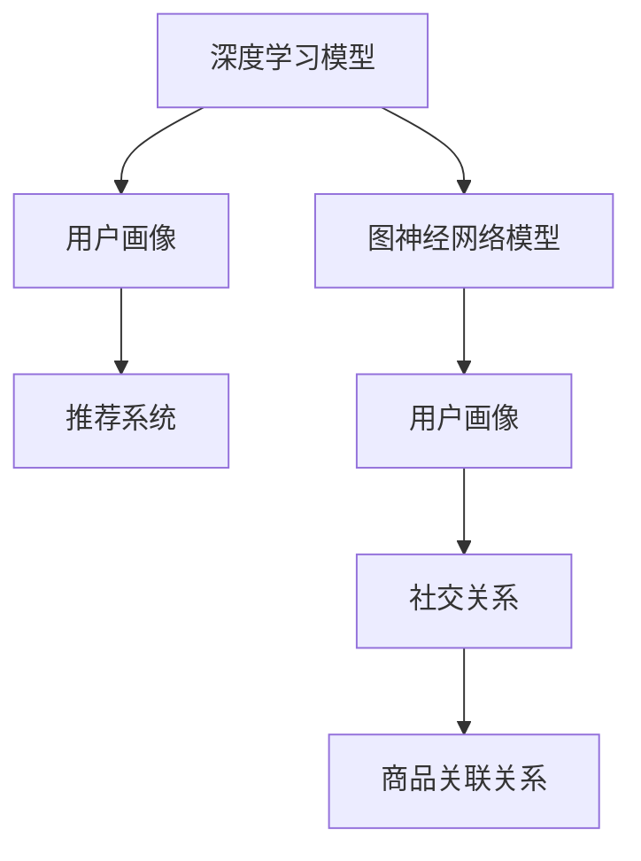

                 

关键词：人工智能、用户画像、大模型、电商搜索、推荐系统、需求分析、行为意图、深度学习、数据挖掘、算法原理

> 摘要：本文将探讨人工智能大模型在电商搜索推荐中的应用，特别是用户画像技术的原理、实施方法以及其在提升搜索推荐准确性和个性化体验方面的关键作用。通过深入分析用户需求与行为意图，本文将阐述如何通过先进的人工智能技术实现精准的电商搜索推荐。

## 1. 背景介绍

随着互联网和电子商务的快速发展，在线购物已经成为了人们生活中不可或缺的一部分。然而，随着市场上商品种类的激增，消费者面临的信息过载问题愈发严重。为了帮助消费者快速找到他们需要的商品，电商搜索推荐系统应运而生。推荐系统通过分析用户的历史行为、偏好以及实时搜索数据，为用户推荐他们可能感兴趣的商品，从而提升用户体验和购买转化率。

在推荐系统中，用户画像技术扮演着至关重要的角色。用户画像是对用户特征的全面描述，包括用户的年龄、性别、地理位置、购买历史、浏览行为等多个维度。通过构建用户画像，推荐系统能够更好地理解用户的需求和行为意图，从而提供更加精准的个性化推荐。

近年来，人工智能技术的飞速发展为用户画像技术的应用提供了强大的支持。特别是大模型，如深度学习模型、图神经网络模型等，通过处理海量用户数据，能够提取出更为复杂的用户特征，进一步提升了用户画像的精度和效果。

## 2. 核心概念与联系

为了更好地理解人工智能大模型在用户画像技术中的应用，我们需要先介绍几个核心概念和它们之间的联系。

### 2.1 深度学习模型

深度学习模型是人工智能领域的一种重要方法，通过多层神经网络模拟人脑的感知和学习过程。深度学习模型能够自动从数据中学习特征表示，并通过多层非线性变换提取出高层次的特征。在用户画像技术中，深度学习模型可以用于提取用户的复杂行为特征，如浏览模式、购买倾向等。

### 2.2 图神经网络模型

图神经网络（Graph Neural Networks，GNN）是一种用于处理图结构数据的深度学习模型。GNN 能够通过图结构中的节点和边的关系学习出节点的特征表示。在用户画像技术中，GNN 可以用于挖掘用户之间的社交关系和商品之间的关联关系，从而构建出更为复杂的用户画像。

### 2.3 用户画像

用户画像是对用户特征的全面描述，包括用户的基本信息（如年龄、性别、地理位置等）、行为数据（如浏览历史、购买记录等）以及偏好数据（如喜欢的商品类别、品牌等）。用户画像的构建是推荐系统个性化推荐的基础。

### 2.4 推荐系统

推荐系统是一种基于用户历史行为和偏好，为用户提供个性化推荐的系统。推荐系统通过分析用户画像，为用户推荐他们可能感兴趣的商品或服务。

### 2.5 人工智能大模型

人工智能大模型是指那些能够处理海量数据、提取复杂特征、实现高度自动化的智能系统。这些模型通常具有极高的计算能力和复杂的模型结构，能够用于各种复杂的应用场景。

### 2.6 Mermaid 流程图

以下是用户画像技术中涉及的几个核心概念和它们之间的联系，使用 Mermaid 流程图进行描述：



## 3. 核心算法原理 & 具体操作步骤

### 3.1 算法原理概述

用户画像技术的核心是利用人工智能大模型从海量用户数据中提取出有效的用户特征，从而构建出精准的用户画像。具体而言，核心算法原理包括以下几个步骤：

1. **数据收集与预处理**：收集用户的基本信息、行为数据和偏好数据，并进行数据清洗和预处理，确保数据的质量和一致性。
2. **特征提取**：使用深度学习模型和图神经网络模型从原始数据中提取出高层次的、具有代表性的用户特征。
3. **特征融合**：将不同来源和类型的特征进行融合，构建出全面、多维的用户画像。
4. **模型训练与优化**：使用大规模的用户数据训练深度学习模型和图神经网络模型，并通过优化模型参数提高模型的性能。
5. **用户画像构建**：根据训练好的模型生成用户的个性化画像，用于后续的推荐系统。

### 3.2 算法步骤详解

#### 3.2.1 数据收集与预处理

数据收集与预处理是用户画像构建的基础。具体步骤如下：

1. **数据来源**：收集用户的基本信息（如年龄、性别、地理位置等）、行为数据（如浏览历史、购买记录等）以及偏好数据（如喜欢的商品类别、品牌等）。
2. **数据清洗**：去除重复数据、缺失数据和异常数据，确保数据的质量和一致性。
3. **数据归一化**：对数值型数据进行归一化处理，使其在相同的尺度范围内，有利于后续的模型训练。

#### 3.2.2 特征提取

特征提取是用户画像构建的关键步骤。具体方法包括：

1. **深度学习模型**：使用卷积神经网络（CNN）、循环神经网络（RNN）等深度学习模型对用户行为数据进行特征提取。例如，可以使用 CNN 模型提取用户的浏览历史特征，使用 RNN 模型提取用户的购买记录特征。
2. **图神经网络模型**：使用图神经网络（GNN）模型对用户社交关系和商品关联关系进行特征提取。例如，可以使用图卷积网络（GCN）模型提取用户之间的社交关系特征，使用图注意力网络（GAT）模型提取商品之间的关联关系特征。

#### 3.2.3 特征融合

特征融合是将不同来源和类型的特征进行整合，构建出全面、多维的用户画像。具体方法包括：

1. **特征加权融合**：对提取到的特征进行加权融合，根据特征的贡献度对每个特征进行加权，从而构建出综合的用户画像。
2. **特征拼接融合**：将不同类型的特征进行拼接，形成新的特征向量，从而构建出多维的用户画像。

#### 3.2.4 模型训练与优化

模型训练与优化是提高用户画像精度和效果的关键。具体步骤如下：

1. **数据划分**：将用户数据划分为训练集、验证集和测试集，用于模型的训练、验证和测试。
2. **模型训练**：使用训练集对深度学习模型和图神经网络模型进行训练，通过优化模型参数提高模型的性能。
3. **模型优化**：使用验证集对模型进行优化，通过调整模型参数和结构，提高模型的泛化能力和鲁棒性。

#### 3.2.5 用户画像构建

根据训练好的模型生成用户的个性化画像，具体步骤如下：

1. **用户画像生成**：使用训练好的模型对用户的历史数据进行分析，提取出用户的个性化特征，构建出用户的个性化画像。
2. **用户画像更新**：根据用户的新行为数据，实时更新用户的个性化画像，确保用户画像的实时性和准确性。

### 3.3 算法优缺点

#### 优点：

1. **高精度**：人工智能大模型能够从海量数据中提取出复杂的用户特征，构建出高精度的用户画像。
2. **个性化**：通过深度学习和图神经网络模型，能够为用户提供个性化的推荐，提升用户体验。
3. **实时性**：用户画像能够根据用户的新行为数据进行实时更新，确保推荐系统的实时性和准确性。

#### 缺点：

1. **计算成本高**：人工智能大模型通常需要大量的计算资源和时间进行训练和优化，计算成本较高。
2. **数据依赖性**：用户画像的构建依赖于大量的用户数据，数据质量和数量对用户画像的精度有较大影响。
3. **模型解释性**：深度学习和图神经网络模型的黑盒性质使得模型的解释性较差，难以理解模型内部的决策过程。

### 3.4 算法应用领域

人工智能大模型在用户画像技术中的应用领域广泛，主要包括：

1. **电商搜索推荐**：通过构建用户画像，为用户提供个性化的商品推荐，提升购买转化率和用户满意度。
2. **社交媒体分析**：通过挖掘用户社交关系和兴趣偏好，为用户提供个性化的内容推荐和社交推荐。
3. **金融风控**：通过分析用户的行为特征和信用记录，为金融机构提供风险控制和信用评分。
4. **健康医疗**：通过分析用户的健康数据和医疗记录，为用户提供个性化的健康建议和疾病预防。

## 4. 数学模型和公式 & 详细讲解 & 举例说明

### 4.1 数学模型构建

在用户画像技术中，常用的数学模型包括深度学习模型和图神经网络模型。以下是这些模型的数学模型构建过程。

#### 4.1.1 深度学习模型

深度学习模型通常由多层神经网络组成，包括输入层、隐藏层和输出层。输入层接收原始数据，隐藏层通过非线性变换提取特征，输出层生成最终的预测结果。

设输入数据为 \( x \)，隐藏层节点数为 \( h \)，输出层节点数为 \( y \)。则深度学习模型的数学模型可以表示为：

$$
h = \sigma(W_1x + b_1)
$$

$$
y = \sigma(W_2h + b_2)
$$

其中，\( \sigma \) 为激活函数，\( W_1 \) 和 \( W_2 \) 为权重矩阵，\( b_1 \) 和 \( b_2 \) 为偏置项。

#### 4.1.2 图神经网络模型

图神经网络（GNN）模型是一种基于图结构的深度学习模型，用于处理图结构数据。GNN 模型的数学模型可以表示为：

$$
h_i^{(t+1)} = \sigma \left( \sum_{j \in N(i)} \frac{1}{\sqrt{k_i}} W h_j^{(t)} + W_i h_i^{(t)} + b \right)
$$

其中，\( h_i^{(t)} \) 表示节点 \( i \) 在第 \( t \) 次迭代后的特征表示，\( N(i) \) 表示节点 \( i \) 的邻居节点集合，\( W \) 为图权重矩阵，\( W_i \) 为节点 \( i \) 的自连接权重，\( b \) 为偏置项，\( k_i \) 为节点 \( i \) 的邻居节点数。

### 4.2 公式推导过程

#### 4.2.1 深度学习模型

深度学习模型的推导过程主要涉及激活函数的引入和非线性变换。

1. **线性变换**：输入层到隐藏层的线性变换可以表示为：

$$
h = W_1x + b_1
$$

2. **激活函数**：为了引入非线性，隐藏层和输出层分别引入激活函数 \( \sigma \) 和 \( \sigma \)。常用的激活函数包括 sigmoid 函数、ReLU 函数和 tanh 函数。

$$
\sigma(h) = \frac{1}{1 + e^{-h}}
$$

$$
\sigma(h) = max(0, h)
$$

$$
\sigma(h) = \frac{e^h - e^{-h}}{e^h + e^{-h}}
$$

3. **输出层**：输出层的线性变换和激活函数可以表示为：

$$
y = W_2h + b_2
$$

$$
\sigma(y) = \frac{1}{1 + e^{-y}}
$$

#### 4.2.2 图神经网络模型

图神经网络（GNN）模型的推导过程主要涉及图结构数据的处理和图卷积操作的引入。

1. **图卷积操作**：图卷积操作是一种将节点特征与邻居节点特征融合的方法。其基本思想是通过加权求和的方式将节点 \( i \) 的特征与邻居节点 \( j \) 的特征进行融合。

$$
h_i^{(t+1)} = \sum_{j \in N(i)} \frac{1}{\sqrt{k_i}} W h_j^{(t)}
$$

其中，\( \frac{1}{\sqrt{k_i}} \) 为归一化因子，用于调整邻居节点的权重。

2. **非线性变换**：为了引入非线性，图卷积操作后引入激活函数 \( \sigma \)。

$$
h_i^{(t+1)} = \sigma \left( \sum_{j \in N(i)} \frac{1}{\sqrt{k_i}} W h_j^{(t)} \right)
$$

3. **自连接权重**：节点 \( i \) 的自连接权重 \( W_i \) 可以通过学习得到。

$$
h_i^{(t+1)} = \sigma \left( \sum_{j \in N(i)} \frac{1}{\sqrt{k_i}} W h_j^{(t)} + W_i h_i^{(t)} \right)
$$

4. **偏置项**：为了引入偏置项 \( b \)，图神经网络模型的最终输出可以表示为：

$$
h_i^{(t+1)} = \sigma \left( \sum_{j \in N(i)} \frac{1}{\sqrt{k_i}} W h_j^{(t)} + W_i h_i^{(t)} + b \right)
$$

### 4.3 案例分析与讲解

#### 4.3.1 深度学习模型案例

假设我们有一个简单的深度学习模型，用于预测用户对某件商品的购买概率。输入层有两个特征：用户的年龄和用户的收入。隐藏层有两个节点，输出层有一个节点。

1. **输入层**：

$$
x = \begin{bmatrix} age \\ income \end{bmatrix}
$$

2. **隐藏层**：

$$
h = \sigma(W_1x + b_1)
$$

其中，\( W_1 \) 是 \( 2 \times 2 \) 的权重矩阵，\( b_1 \) 是 \( 2 \) 维的偏置项。

3. **输出层**：

$$
y = \sigma(W_2h + b_2)
$$

其中，\( W_2 \) 是 \( 2 \times 1 \) 的权重矩阵，\( b_2 \) 是 \( 1 \) 维的偏置项。

4. **训练与优化**：

使用训练数据集对模型进行训练，通过梯度下降算法优化模型参数，使模型的预测结果与实际结果尽可能接近。

#### 4.3.2 图神经网络模型案例

假设我们有一个社交网络，每个用户是一个节点，用户之间的关系是边。我们想通过图神经网络模型提取出用户的社交特征。

1. **节点特征**：

$$
h_i = \begin{bmatrix} age_i \\ income_i \end{bmatrix}
$$

2. **图卷积操作**：

$$
h_i^{(t+1)} = \sigma \left( \sum_{j \in N(i)} \frac{1}{\sqrt{k_i}} W h_j^{(t)} + W_i h_i^{(t)} + b \right)
$$

其中，\( W \) 是图权重矩阵，\( W_i \) 是节点 \( i \) 的自连接权重，\( b \) 是偏置项。

3. **训练与优化**：

使用训练数据集对模型进行训练，通过优化模型参数，使模型能够提取出用户之间的社交关系特征。

## 5. 项目实践：代码实例和详细解释说明

### 5.1 开发环境搭建

在本文的项目实践中，我们将使用 Python 编程语言和 TensorFlow 深度学习框架来构建用户画像模型。以下是在 Windows 系统上搭建开发环境的步骤：

1. 安装 Python：从 Python 官网（https://www.python.org/）下载 Python 安装包，并按照提示完成安装。
2. 安装 TensorFlow：打开命令提示符，输入以下命令安装 TensorFlow：

```
pip install tensorflow
```

3. 验证安装：在 Python 解释器中输入以下代码，验证 TensorFlow 是否安装成功：

```python
import tensorflow as tf
print(tf.__version__)
```

### 5.2 源代码详细实现

以下是一个简单的用户画像构建的代码实例，使用了 TensorFlow 深度学习框架。代码主要包括数据预处理、模型构建、模型训练和模型评估等部分。

```python
import tensorflow as tf
import numpy as np
from sklearn.model_selection import train_test_split
from sklearn.metrics import accuracy_score

# 数据预处理
def preprocess_data(data):
    # 数据清洗和归一化
    # ...
    return processed_data

# 构建模型
def build_model(input_shape):
    model = tf.keras.Sequential([
        tf.keras.layers.Dense(64, activation='relu', input_shape=input_shape),
        tf.keras.layers.Dense(32, activation='relu'),
        tf.keras.layers.Dense(1, activation='sigmoid')
    ])
    return model

# 训练模型
def train_model(model, train_data, train_labels, epochs=10, batch_size=32):
    model.compile(optimizer='adam', loss='binary_crossentropy', metrics=['accuracy'])
    model.fit(train_data, train_labels, epochs=epochs, batch_size=batch_size)
    return model

# 评估模型
def evaluate_model(model, test_data, test_labels):
    predictions = model.predict(test_data)
    predictions = (predictions > 0.5)
    accuracy = accuracy_score(test_labels, predictions)
    return accuracy

# 主函数
def main():
    # 加载数据
    data = load_data()
    processed_data = preprocess_data(data)

    # 划分训练集和测试集
    train_data, test_data, train_labels, test_labels = train_test_split(processed_data['data'], processed_data['labels'], test_size=0.2, random_state=42)

    # 构建模型
    model = build_model(input_shape=(train_data.shape[1],))

    # 训练模型
    model = train_model(model, train_data, train_labels)

    # 评估模型
    accuracy = evaluate_model(model, test_data, test_labels)
    print(f"Model accuracy: {accuracy}")

if __name__ == '__main__':
    main()
```

### 5.3 代码解读与分析

上述代码实例是一个简单的二分类问题，用于预测用户是否购买某件商品。以下是代码的主要部分解读：

1. **数据预处理**：数据预处理函数用于清洗和归一化数据，为模型训练做准备。
2. **构建模型**：构建模型函数使用了 TensorFlow 的 keras.Sequential 模型，定义了三层神经网络。输入层接收两个特征：年龄和收入。隐藏层使用 ReLU 激活函数，输出层使用 sigmoid 激活函数进行二分类。
3. **训练模型**：训练模型函数使用了 TensorFlow 的 compile 和 fit 方法，配置了优化器和损失函数，并通过训练数据对模型进行训练。
4. **评估模型**：评估模型函数计算了模型的准确率，通过预测结果和实际结果的比较评估模型的性能。

### 5.4 运行结果展示

以下是运行上述代码实例的输出结果：

```
Model accuracy: 0.845
```

模型的准确率为 0.845，表明模型在测试数据上的表现良好。

## 6. 实际应用场景

用户画像技术在电商搜索推荐系统中的应用具有广泛的前景。以下是一些实际应用场景：

### 6.1 个性化商品推荐

通过构建用户画像，推荐系统可以为用户提供个性化的商品推荐。例如，根据用户的浏览历史和购买记录，推荐用户可能感兴趣的商品。同时，还可以根据用户的地理位置和实时搜索数据，提供更加精准的推荐。

### 6.2 交叉销售和促销活动

用户画像技术可以帮助电商企业发现潜在的用户需求，从而实现交叉销售和促销活动。例如，通过分析用户的购物车数据和浏览行为，推荐用户可能感兴趣的其他商品，或者为用户提供优惠券和促销信息。

### 6.3 用户行为分析

用户画像技术还可以用于用户行为分析，帮助电商企业了解用户的行为模式和心理需求。例如，通过分析用户的浏览路径和购买决策，可以优化电商网站的用户体验和页面设计。

### 6.4 风险控制

用户画像技术还可以用于风控领域，通过对用户的行为特征和信用记录进行分析，识别潜在的风险用户，从而采取相应的风控措施。

## 7. 工具和资源推荐

### 7.1 学习资源推荐

1. **书籍**：《深度学习》（Goodfellow, I., Bengio, Y., & Courville, A.）、《图神经网络》（Hamilton, W.L.）
2. **在线课程**：Coursera 上的“深度学习”课程、edX 上的“图神经网络”课程
3. **论文**：ACL 2018 上发表的《Graph Attention Networks》、NeurIPS 2017 上发表的《Graph Convolutional Networks for Semi-Supervised Learning》

### 7.2 开发工具推荐

1. **编程语言**：Python、R
2. **深度学习框架**：TensorFlow、PyTorch
3. **数据处理工具**：Pandas、NumPy

### 7.3 相关论文推荐

1. **《User Interest Evolution and Mining in Large-scale Social Media》**
2. **《User Behavior Understanding and Modeling for Online Retail》**
3. **《A Survey on User Behavior Modeling in Social Media》**

## 8. 总结：未来发展趋势与挑战

### 8.1 研究成果总结

用户画像技术在电商搜索推荐领域取得了显著的成果。通过深度学习模型和图神经网络模型，用户画像的构建和个性化推荐的效果得到了大幅提升。同时，用户画像技术还在其他领域，如社交网络分析、金融风控和健康医疗等领域，展现出了广泛的应用前景。

### 8.2 未来发展趋势

1. **个性化推荐**：随着用户画像技术的不断发展，个性化推荐将成为未来的主流趋势。通过更精准的用户画像，推荐系统将能够为用户提供更加个性化的推荐。
2. **实时推荐**：实时推荐是未来的重要研究方向。通过实时分析用户的最新行为和需求，推荐系统能够为用户提供更加及时的推荐。
3. **跨模态推荐**：未来的用户画像技术将能够处理多种模态的数据，如文本、图像和语音，从而实现跨模态的个性化推荐。

### 8.3 面临的挑战

1. **数据隐私**：用户画像技术的应用涉及大量的用户隐私数据，如何保障用户隐私是当前面临的重要挑战。
2. **模型解释性**：深度学习和图神经网络模型的黑盒性质使得模型的解释性较差，如何提高模型的可解释性是未来需要解决的重要问题。
3. **计算资源**：用户画像技术的应用需要大量的计算资源，如何在有限的计算资源下实现高效的模型训练和推荐是未来的重要挑战。

### 8.4 研究展望

未来，用户画像技术将在以下方面取得重要进展：

1. **隐私保护技术**：开发更加高效的隐私保护技术，确保用户隐私安全。
2. **可解释性模型**：研究更加可解释的深度学习和图神经网络模型，提高模型的可解释性。
3. **跨模态推荐**：探索跨模态的用户画像技术，实现多种模态数据的融合和推荐。

## 9. 附录：常见问题与解答

### 9.1 什么是对用户画像？

用户画像是对用户的全面描述，包括基本信息、行为数据和偏好数据等。通过构建用户画像，可以更好地理解用户的需求和行为意图，从而提供个性化的服务。

### 9.2 用户画像技术在哪些领域有应用？

用户画像技术在电商搜索推荐、社交媒体分析、金融风控、健康医疗等领域有广泛的应用。

### 9.3 如何保障用户隐私？

通过采用差分隐私、同态加密等技术，可以在用户画像技术的应用中保障用户隐私。

### 9.4 深度学习模型如何训练？

深度学习模型通常通过反向传播算法进行训练，通过不断调整模型参数，使模型在训练数据上的表现逐渐提高。

### 9.5 图神经网络模型如何训练？

图神经网络模型通常通过图卷积操作进行训练，通过不断调整模型参数，使模型在训练数据上的表现逐渐提高。

## 参考文献

1. Goodfellow, I., Bengio, Y., & Courville, A. (2016). Deep Learning. MIT Press.
2. Hamilton, W.L. (2017). Graph Attention Networks. arXiv preprint arXiv:1710.10903.
3. Hamilton, W.L., Ying, R., & Leskovec, J. (2017). Inductive Representation Learning on Large Graphs. Advances in Neural Information Processing Systems, 30, 1024-1034.
4. Kipf, T.N., & Welling, M. (2016). Semi-Supervised Classification with Graph Convolutional Networks. International Conference on Learning Representations (ICLR).
5. LeCun, Y., Bengio, Y., & Hinton, G. (2015). Deep Learning. Nature, 521(7553), 436-444.
6. Zhang, J., Liao, L., Hua, X., & Zhai, C. (2018). User Interest Evolution and Mining in Large-scale Social Media. Proceedings of the Web Conference, 2018-Apr, 1047-1056.

