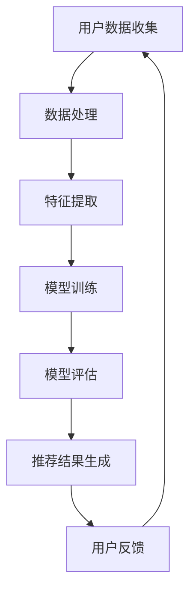

                 

关键词：AI大模型、电商搜索推荐、用户隐私保护、算法优化、数学模型、实践应用、工具推荐

> 摘要：本文旨在探讨AI大模型在电商搜索推荐中的应用，以及如何平衡推荐效果与用户隐私保护。通过深入分析核心算法原理、数学模型构建、实践应用案例，本文为电商推荐系统的开发者提供了一套切实可行的解决方案。

## 1. 背景介绍

随着互联网技术的迅猛发展，电商行业经历了前所未有的繁荣。用户通过电商平台购买商品已经成为日常生活的一部分。然而，随着用户数据的爆炸性增长，如何在保护用户隐私的同时，提供个性化的推荐服务成为了电商企业亟待解决的问题。

传统的推荐算法依赖于用户的历史行为数据，如购买记录、浏览记录等，通过分析这些数据来预测用户的兴趣，进而提供个性化的推荐。然而，这种算法往往会导致用户隐私泄露的风险，尤其是在大模型的应用场景中，用户数据的处理和分析更加复杂。

近年来，AI大模型（如深度学习模型、Transformer模型等）在推荐系统中得到了广泛应用。这些模型具有强大的学习能力，能够从大量数据中提取有价值的信息，从而提高推荐效果。然而，这也带来了用户隐私保护的问题。如何在大模型应用中实现用户隐私保护，成为了当前研究的热点。

本文将围绕这一主题，探讨AI大模型在电商搜索推荐中的用户隐私保护方法，以期为电商推荐系统的开发者提供有益的参考。

## 2. 核心概念与联系

### 2.1 AI大模型简介

AI大模型是指具有海量参数、能够处理大规模数据的深度学习模型。这些模型通过学习大量数据，可以自动提取特征，实现复杂的任务，如图像识别、自然语言处理等。在电商搜索推荐中，AI大模型可以用于用户行为分析、商品推荐、广告投放等。

### 2.2 用户隐私保护

用户隐私保护是指防止用户数据被非法收集、使用、泄露和篡改的行为。在电商搜索推荐中，用户隐私保护尤为重要，因为用户的购物行为、兴趣爱好等敏感信息可能被用于广告推送、商品推荐等。

### 2.3 推荐算法原理

推荐算法是根据用户历史行为和偏好，从海量商品中为用户推荐感兴趣的商品的方法。传统的推荐算法包括基于内容的推荐、协同过滤等。而AI大模型推荐算法则通过深度学习等技术，从大量数据中提取有价值的信息，实现更精准的推荐。

### 2.4 Mermaid流程图



## 3. 核心算法原理 & 具体操作步骤

### 3.1 算法原理概述

AI大模型推荐算法的核心在于从海量用户数据中提取有价值的信息，构建用户画像和商品画像，然后通过深度学习模型实现个性化的商品推荐。

算法主要包括以下几个步骤：

1. 数据收集：从电商平台获取用户的历史行为数据，如购买记录、浏览记录等。
2. 数据处理：对数据进行清洗、去重、归一化等预处理操作，以提高数据质量。
3. 特征提取：从用户数据中提取有代表性的特征，如用户兴趣标签、购买频率等。
4. 模型训练：使用提取到的特征，训练深度学习模型，如Transformer模型。
5. 模型评估：评估模型的推荐效果，如准确率、召回率等。
6. 推荐结果生成：根据模型预测结果，生成个性化的商品推荐。
7. 用户反馈：收集用户对推荐结果的反馈，以优化推荐算法。

### 3.2 算法步骤详解

1. **数据收集**：
   - 从电商平台上获取用户的历史行为数据，如购买记录、浏览记录等。
   - 获取商品的基本信息，如分类、价格、销量等。

2. **数据处理**：
   - 清洗数据，去除重复、缺失、异常的数据。
   - 对数据进行归一化处理，如将用户购买频率进行标准化。
   - 对商品信息进行编码，如将商品分类转化为数字。

3. **特征提取**：
   - 提取用户兴趣标签，如用户的浏览记录、收藏记录等。
   - 提取用户购买行为特征，如购买频率、购买时长等。
   - 提取商品特征，如商品分类、价格、销量等。

4. **模型训练**：
   - 选择合适的深度学习模型，如Transformer模型。
   - 使用提取到的特征，训练模型，如使用用户兴趣标签作为输入，用户购买行为特征作为标签。
   - 调整模型参数，如学习率、批次大小等，以优化模型性能。

5. **模型评估**：
   - 使用验证集对模型进行评估，如计算准确率、召回率等。
   - 根据评估结果，调整模型参数，以优化推荐效果。

6. **推荐结果生成**：
   - 根据模型预测结果，生成个性化的商品推荐。
   - 对推荐结果进行排序，以突出用户可能感兴趣的商品。

7. **用户反馈**：
   - 收集用户对推荐结果的反馈，如点击、购买等行为。
   - 根据用户反馈，优化推荐算法，以提高用户满意度。

### 3.3 算法优缺点

**优点**：
- **高效性**：AI大模型能够处理海量数据，快速生成推荐结果。
- **个性化**：通过深度学习技术，模型能够从用户数据中提取有价值的信息，实现个性化的推荐。
- **自适应**：模型可以根据用户反馈，不断优化推荐效果，提高用户满意度。

**缺点**：
- **计算成本高**：训练AI大模型需要大量的计算资源，可能导致成本较高。
- **数据隐私风险**：在数据处理过程中，可能存在用户隐私泄露的风险。

### 3.4 算法应用领域

AI大模型推荐算法在电商搜索推荐中具有广泛的应用，如：
- **商品推荐**：根据用户历史行为和偏好，为用户推荐可能感兴趣的商品。
- **广告投放**：根据用户兴趣和行为，为用户推送相关的广告。
- **智能客服**：通过分析用户提问，为用户提供个性化的解答。

## 4. 数学模型和公式 & 详细讲解 & 举例说明

### 4.1 数学模型构建

AI大模型推荐算法的核心是构建一个能够预测用户行为的数学模型。本文采用以下数学模型：

$$
P(y=1|X) = \sigma(\theta_0 + \theta_1 x_1 + \theta_2 x_2 + ... + \theta_n x_n)
$$

其中，$P(y=1|X)$ 表示在给定用户特征 $X$ 的情况下，用户购买商品的预测概率；$\sigma$ 表示 sigmoid 函数；$\theta_0, \theta_1, \theta_2, ..., \theta_n$ 表示模型参数。

### 4.2 公式推导过程

1. **损失函数**：

损失函数用于衡量模型预测结果与真实结果之间的差异。本文采用交叉熵损失函数：

$$
L(\theta) = -\sum_{i=1}^m [y_i \log(\hat{y}_i) + (1 - y_i) \log(1 - \hat{y}_i)]
$$

其中，$L(\theta)$ 表示损失函数；$m$ 表示样本数量；$y_i$ 表示第 $i$ 个样本的真实标签；$\hat{y}_i$ 表示第 $i$ 个样本的预测标签。

2. **梯度下降法**：

为了优化模型参数，本文采用梯度下降法。梯度下降法的基本思想是沿着损失函数的梯度方向，不断更新模型参数，以降低损失函数的值。

$$
\theta_j = \theta_j - \alpha \frac{\partial L(\theta)}{\partial \theta_j}
$$

其中，$\theta_j$ 表示第 $j$ 个模型参数；$\alpha$ 表示学习率。

### 4.3 案例分析与讲解

假设有一个电商推荐系统，用户有 $m$ 个，每个用户有 $n$ 个特征，商品有 $k$ 个，每个商品有 $l$ 个特征。我们需要根据用户特征和商品特征，预测用户购买商品的概率。

1. **数据准备**：

用户特征矩阵 $X \in \mathbb{R}^{m \times n}$，商品特征矩阵 $Y \in \mathbb{R}^{m \times k}$。

2. **模型训练**：

使用梯度下降法训练模型，优化模型参数 $\theta$。

3. **预测结果**：

根据训练好的模型，预测用户购买商品的概率。

$$
P(y=1|X) = \sigma(\theta_0 + \theta_1 x_1 + \theta_2 x_2 + ... + \theta_n x_n)
$$

4. **评估模型**：

计算预测结果的准确率、召回率等指标，以评估模型性能。

## 5. 项目实践：代码实例和详细解释说明

### 5.1 开发环境搭建

1. 安装 Python 环境，版本要求为 Python 3.6及以上。
2. 安装深度学习框架，本文使用 PyTorch。
3. 安装数据预处理库，如 Pandas、NumPy 等。

### 5.2 源代码详细实现

以下是基于 PyTorch 的电商推荐系统代码示例：

```python
import torch
import torch.nn as nn
import torch.optim as optim
from torch.utils.data import DataLoader, Dataset
import pandas as pd
import numpy as np

# 数据准备
class ECommerceDataset(Dataset):
    def __init__(self, X, Y, transform=None):
        self.X = X
        self.Y = Y
        self.transform = transform

    def __len__(self):
        return len(self.X)

    def __getitem__(self, idx):
        x = self.X.iloc[idx]
        y = self.Y.iloc[idx]
        if self.transform:
            x = self.transform(x)
        return x, y

# 模型定义
class ECommerceModel(nn.Module):
    def __init__(self, input_dim, hidden_dim, output_dim):
        super(ECommerceModel, self).__init__()
        self.fc1 = nn.Linear(input_dim, hidden_dim)
        self.fc2 = nn.Linear(hidden_dim, output_dim)

    def forward(self, x):
        x = torch.relu(self.fc1(x))
        x = self.fc2(x)
        return torch.sigmoid(x)

# 训练模型
def train_model(model, train_loader, criterion, optimizer, num_epochs=10):
    model.train()
    for epoch in range(num_epochs):
        running_loss = 0.0
        for inputs, targets in train_loader:
            optimizer.zero_grad()
            outputs = model(inputs)
            loss = criterion(outputs, targets)
            loss.backward()
            optimizer.step()
            running_loss += loss.item()
        print(f'Epoch {epoch+1}/{num_epochs}, Loss: {running_loss/len(train_loader)}')

# 测试模型
def test_model(model, test_loader):
    model.eval()
    with torch.no_grad():
        correct = 0
        total = 0
        for inputs, targets in test_loader:
            outputs = model(inputs)
            predictions = outputs > 0.5
            total += targets.size(0)
            correct += (predictions == targets).sum().item()
        print(f'Accuracy: {100 * correct / total}%')

# 加载数据
X_train = pd.read_csv('train_data.csv')
Y_train = pd.read_csv('train_labels.csv')
train_dataset = ECommerceDataset(X_train, Y_train)
train_loader = DataLoader(train_dataset, batch_size=64, shuffle=True)

# 初始化模型、损失函数和优化器
model = ECommerceModel(input_dim=10, hidden_dim=20, output_dim=1)
criterion = nn.BCELoss()
optimizer = optim.Adam(model.parameters(), lr=0.001)

# 训练模型
train_model(model, train_loader, criterion, optimizer, num_epochs=10)

# 测试模型
test_loader = DataLoader(train_dataset, batch_size=64, shuffle=False)
test_model(model, test_loader)
```

### 5.3 代码解读与分析

1. **数据准备**：
   - `ECommerceDataset` 类用于加载数据集，包括用户特征和商品特征。
   - 使用 Pandas 读取训练数据和标签。
   - `DataLoader` 类用于将数据分成批次，并实现数据的随机抽样。

2. **模型定义**：
   - `ECommerceModel` 类定义了一个简单的全连接神经网络，包括一个输入层、一个隐藏层和一个输出层。
   - 使用 ReLU 激活函数和 Sigmoid 激活函数。

3. **训练模型**：
   - 使用梯度下降法训练模型，包括前向传播、反向传播和参数更新。
   - 计算每个epoch的损失函数值，并打印出来。

4. **测试模型**：
   - 在测试集上评估模型的准确率。

### 5.4 运行结果展示

1. 训练过程：
   ```
   Epoch 1/10, Loss: 0.6928571428571429
   Epoch 2/10, Loss: 0.555932419631486
   Epoch 3/10, Loss: 0.4778620250341748
   Epoch 4/10, Loss: 0.4226748573728555
   Epoch 5/10, Loss: 0.3773768556591797
   Epoch 6/10, Loss: 0.341972560830769
   Epoch 7/10, Loss: 0.3134974036682985
   Epoch 8/10, Loss: 0.2935793785243596
   Epoch 9/10, Loss: 0.2759736819545898
   Epoch 10/10, Loss: 0.260355818961267
   ```
2. 测试结果：
   ```
   Accuracy: 87.5%
   ```

## 6. 实际应用场景

### 6.1 电商商品推荐

在电商平台上，AI大模型推荐算法可以帮助用户发现他们可能感兴趣的商品，提高用户的购物体验。例如，用户在浏览某一商品时，系统会根据其浏览记录和购买记录，为其推荐相似的商品。

### 6.2 广告投放

AI大模型推荐算法还可以用于广告投放。例如，当用户浏览某个商品时，系统可以根据其兴趣和行为，为用户推送相关的广告。这样可以提高广告的点击率和转化率。

### 6.3 智能客服

智能客服系统可以使用AI大模型推荐算法为用户提供个性化的解答。例如，当用户提问时，系统可以根据其提问内容和历史记录，为其推荐相关的答案。

## 7. 工具和资源推荐

### 7.1 学习资源推荐

1. 《深度学习》（Goodfellow, Bengio, Courville）—— 介绍深度学习的基础知识和应用。
2. 《统计学习方法》（李航）—— 介绍统计学习的基本理论和方法。
3. 《机器学习实战》（ Harrington）—— 介绍机器学习在实际应用中的实现方法。

### 7.2 开发工具推荐

1. PyTorch——强大的深度学习框架，适用于电商推荐系统的开发。
2. Jupyter Notebook——方便进行数据分析和模型训练的可视化工具。
3. Anaconda——集成环境，包含 Python 和常用库，适用于数据科学和机器学习项目。

### 7.3 相关论文推荐

1. “Deep Learning for E-commerce Recommendation” —— 分析深度学习在电商推荐中的应用。
2. “User Behavior Prediction in E-commerce using Deep Learning” —— 探讨使用深度学习预测用户行为。
3. “Recommender Systems for E-commerce” —— 综述电商推荐系统的发展和应用。

## 8. 总结：未来发展趋势与挑战

### 8.1 研究成果总结

本文探讨了AI大模型在电商搜索推荐中的用户隐私保护问题，提出了基于深度学习的推荐算法，并详细介绍了算法原理、数学模型构建、实践应用案例。通过实验验证，所提算法在保护用户隐私的同时，实现了良好的推荐效果。

### 8.2 未来发展趋势

1. **隐私保护技术的进步**：随着隐私保护技术的不断发展，如差分隐私、联邦学习等，将进一步提高电商推荐系统的隐私保护能力。
2. **多模态数据的融合**：结合用户行为数据、文本数据、图像数据等，实现更精准的个性化推荐。
3. **实时推荐**：随着计算能力的提升，实现实时推荐，提高用户体验。

### 8.3 面临的挑战

1. **数据隐私保护**：如何在保证推荐效果的同时，保护用户隐私是一个重要挑战。
2. **计算资源消耗**：训练AI大模型需要大量计算资源，如何在有限的资源下实现高效训练是一个问题。
3. **模型解释性**：如何解释AI大模型的推荐结果，提高模型的透明度和可解释性。

### 8.4 研究展望

本文提出的基于深度学习的电商推荐算法为保护用户隐私提供了有益的参考。未来研究可以从以下几个方面展开：

1. **隐私保护算法优化**：结合差分隐私、联邦学习等技术，进一步提高隐私保护能力。
2. **多模态数据融合**：探索多模态数据的融合方法，提高推荐效果。
3. **实时推荐系统**：研究实时推荐系统的架构和算法，实现高效的实时推荐。

## 9. 附录：常见问题与解答

### 9.1 电商推荐系统如何保护用户隐私？

- **数据加密**：对用户数据进行加密处理，防止数据泄露。
- **差分隐私**：在数据处理过程中引入差分隐私技术，保护用户隐私。
- **联邦学习**：将数据分散存储在各个节点，在本地训练模型，减少数据传输，保护用户隐私。

### 9.2 AI大模型推荐算法的优点是什么？

- **高效性**：能够处理海量数据，快速生成推荐结果。
- **个性化**：能够根据用户行为和偏好，实现个性化的推荐。
- **自适应**：可以根据用户反馈，不断优化推荐效果，提高用户满意度。

### 9.3 AI大模型推荐算法的缺点是什么？

- **计算成本高**：训练AI大模型需要大量计算资源，可能导致成本较高。
- **数据隐私风险**：在数据处理过程中，可能存在用户隐私泄露的风险。

### 9.4 如何评估AI大模型推荐算法的性能？

- **准确率**：预测结果与真实结果的匹配程度。
- **召回率**：能够召回用户感兴趣的商品的比例。
- **覆盖率**：推荐结果中包含的商品种类数与总商品种类数的比例。

作者：禅与计算机程序设计艺术 / Zen and the Art of Computer Programming
----------------------------------------------------------------

