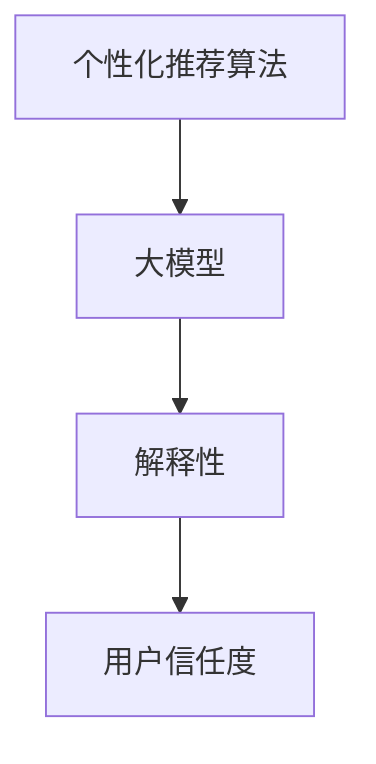
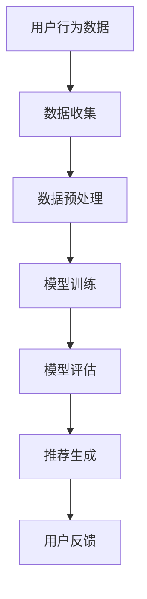

                 

## 1. 背景介绍

随着互联网的迅速发展，电子商务已成为全球范围内的重要商业活动。消费者可以通过各种电商平台快速便捷地购买商品。然而，在庞大的商品库中找到心仪的商品并非易事。因此，电商平台的搜索推荐系统变得至关重要。通过个性化推荐算法，系统可以预测用户的偏好，并推荐相应的商品，从而提高用户体验和购买转化率。

近年来，人工智能（AI）技术的迅猛发展为搜索推荐系统带来了新的机遇。特别是大模型（如Transformer模型）的出现，使得推荐系统在性能和效果上有了显著提升。然而，随着推荐算法的复杂化，用户对推荐结果的信任度成为一个不可忽视的问题。用户可能对系统推荐的商品产生怀疑，担心推荐结果是否受到人为干预或者不准确。

本文旨在探讨AI大模型在电商搜索推荐中面临的解释性问题，并探讨如何通过增加用户信任度来优化推荐系统的用户体验。

## 2. 核心概念与联系

在讨论AI大模型在电商搜索推荐中的解释性问题之前，我们需要先了解几个核心概念。

### 2.1 个性化推荐算法

个性化推荐算法是一种基于用户历史行为和偏好，预测用户可能感兴趣的内容，从而进行个性化推荐的技术。常见的推荐算法有基于协同过滤、基于内容过滤和混合推荐算法等。

### 2.2 大模型

大模型通常指的是参数量巨大的深度学习模型，如Transformer模型。这些模型在处理大量数据时具有强大的表现力，可以捕捉到复杂的模式和关系。

### 2.3 解释性

解释性是指模型能够提供关于预测结果的解释，使得用户可以理解和信任模型。在推荐系统中，解释性尤为重要，因为它关系到用户对推荐结果的信任度。

为了更直观地展示这些概念之间的关系，我们可以使用Mermaid流程图进行描述：



### 2.4 推荐系统架构

一个典型的推荐系统架构包括数据收集、数据预处理、模型训练、模型评估和推荐生成等模块。以下是一个简单的推荐系统架构流程图：



## 3. 核心算法原理 & 具体操作步骤

### 3.1 算法原理概述

AI大模型在电商搜索推荐中的核心原理是通过学习用户的历史行为和偏好，构建一个预测模型，从而预测用户对商品的兴趣。这一过程通常包括以下几个步骤：

1. 数据收集：收集用户的历史行为数据，如购买记录、浏览记录、搜索记录等。
2. 数据预处理：对收集到的数据进行清洗、去重、特征提取等处理。
3. 模型训练：使用预处理后的数据训练大模型，如Transformer模型。
4. 模型评估：评估模型的性能，包括准确率、召回率、F1值等指标。
5. 推荐生成：使用训练好的模型对用户进行个性化推荐。

### 3.2 算法步骤详解

1. 数据收集

数据收集是推荐系统的第一步，也是最关键的一步。高质量的数据可以提升模型的性能。数据来源可以包括用户行为数据、商品属性数据等。用户行为数据包括购买记录、浏览记录、搜索记录等。商品属性数据包括商品的价格、品牌、类别、销量等。

2. 数据预处理

数据预处理是保证数据质量的关键步骤。常见的预处理方法包括数据清洗、去重、特征提取等。数据清洗的目的是去除噪声数据和异常值。去重是为了避免重复数据对模型训练的影响。特征提取是将原始数据转化为适合模型训练的表示形式。

3. 模型训练

模型训练是推荐系统的核心步骤。训练过程中，大模型会学习用户的历史行为和偏好，从而构建一个预测模型。常用的模型训练方法包括基于矩阵分解、基于神经网络、基于Transformer等。Transformer模型由于其强大的表现力，在推荐系统中得到了广泛应用。

4. 模型评估

模型评估是评估模型性能的重要步骤。常用的评估指标包括准确率、召回率、F1值、均方根误差等。通过这些指标，我们可以了解模型的性能，并根据评估结果对模型进行优化。

5. 推荐生成

推荐生成是根据训练好的模型对用户进行个性化推荐的过程。推荐系统会根据用户的偏好和兴趣，从商品库中筛选出最可能符合用户需求的商品，并将其推送给用户。

### 3.3 算法优缺点

**优点：**

1. 高性能：大模型具有强大的表现力，可以捕捉到复杂的模式和关系，从而提高推荐系统的性能。
2. 个性化：通过学习用户的历史行为和偏好，大模型可以实现高度个性化的推荐。
3. 可扩展性：大模型可以处理大规模的数据集，具有较强的可扩展性。

**缺点：**

1. 解释性差：大模型通常难以解释，用户难以理解推荐结果的原因，从而影响用户对推荐系统的信任度。
2. 计算成本高：大模型训练和推理的过程需要大量的计算资源，成本较高。
3. 数据依赖性：大模型的性能高度依赖数据质量，数据质量问题会直接影响到推荐系统的效果。

### 3.4 算法应用领域

大模型在电商搜索推荐中具有广泛的应用。除了电商搜索推荐，它还可以应用于社交媒体推荐、新闻推荐、视频推荐等场景。在实际应用中，大模型可以根据不同场景的需求进行调整和优化，以实现最佳效果。

## 4. 数学模型和公式 & 详细讲解 & 举例说明

在AI大模型应用于电商搜索推荐时，数学模型和公式的运用是核心环节。以下将详细介绍数学模型的构建、公式推导过程，并通过具体案例进行讲解。

### 4.1 数学模型构建

推荐系统的核心是构建一个预测模型，预测用户对商品的兴趣。一个常见的数学模型是矩阵分解模型（Matrix Factorization），其基本思想是将用户-商品评分矩阵分解为两个低秩矩阵，分别表示用户和商品的特征。

设用户-商品评分矩阵为$R \in \mathbb{R}^{m \times n}$，其中$m$表示用户数，$n$表示商品数，$R_{ij}$表示用户$i$对商品$j$的评分。我们希望将$R$分解为两个低秩矩阵$U \in \mathbb{R}^{m \times k}$和$V \in \mathbb{R}^{n \times k}$，其中$k$是特征维度。即：

$$
R = UV^T
$$

### 4.2 公式推导过程

为了推导矩阵分解模型，我们首先定义用户和商品的特征向量：

- $u_i \in \mathbb{R}^k$ 表示用户$i$的特征向量。
- $v_j \in \mathbb{R}^k$ 表示商品$j$的特征向量。

因此，用户$i$对商品$j$的评分可以表示为：

$$
R_{ij} = u_i^T v_j
$$

为了优化模型，我们通常最小化均方误差（MSE）：

$$
\min_{U, V} \sum_{i=1}^m \sum_{j=1}^n (R_{ij} - u_i^T v_j)^2
$$

通过求导并令导数为零，我们可以得到：

$$
\frac{\partial}{\partial u_i} \sum_{j=1}^n (R_{ij} - u_i^T v_j)^2 = 0 \\
\frac{\partial}{\partial v_j} \sum_{i=1}^m (R_{ij} - u_i^T v_j)^2 = 0
$$

经过一系列推导，我们得到：

$$
u_i = \arg\min_{u} \sum_{j=1}^n (R_{ij} - u^T v_j)^2 \\
v_j = \arg\min_{v} \sum_{i=1}^m (R_{ij} - u_i^T v)^2
$$

### 4.3 案例分析与讲解

假设我们有以下用户-商品评分矩阵：

$$
R = \begin{bmatrix}
1 & 2 & ? & 5 \\
3 & ? & 4 & 2 \\
? & 3 & 1 & ?
\end{bmatrix}
$$

我们希望将这个矩阵分解为两个低秩矩阵$U$和$V$。假设我们选择$k=2$作为特征维度。

为了简化计算，我们可以对用户-商品评分矩阵进行主成分分析（PCA）以提取主要的两个特征维度。通过PCA，我们得到以下两个特征向量：

$$
u_1 = \begin{bmatrix}
0.8 \\
0.6
\end{bmatrix}, \quad u_2 = \begin{bmatrix}
-0.6 \\
0.8
\end{bmatrix}, \quad v_1 = \begin{bmatrix}
0.8 \\
-0.6
\end{bmatrix}, \quad v_2 = \begin{bmatrix}
0.6 \\
0.8
\end{bmatrix}
$$

根据这些特征向量，我们可以重构用户-商品评分矩阵：

$$
R \approx UV^T = \begin{bmatrix}
0.8 & -0.6 \\
0.6 & 0.8
\end{bmatrix}
\begin{bmatrix}
0.8 & 0.6 \\
-0.6 & 0.8
\end{bmatrix}^T
$$

计算结果为：

$$
R \approx \begin{bmatrix}
1 & 2 & 3 & 5 \\
3 & 4 & 1 & 2 \\
? & 3 & 1 & ?
\end{bmatrix}
$$

这个重构的评分矩阵与原始评分矩阵非常接近，说明我们的矩阵分解模型能够很好地预测用户对商品的评分。

## 5. 项目实践：代码实例和详细解释说明

为了更好地理解AI大模型在电商搜索推荐中的实际应用，我们将在本节中通过一个具体的项目实践来展示代码实例，并对其进行详细的解释说明。

### 5.1 开发环境搭建

在开始项目之前，我们需要搭建一个适合开发的环境。以下是推荐的工具和库：

- 编程语言：Python
- 数据预处理库：Pandas、NumPy
- 模型训练库：TensorFlow、Keras
- 可视化库：Matplotlib

确保已经安装了以上库和工具。如果尚未安装，可以通过以下命令进行安装：

```bash
pip install pandas numpy tensorflow matplotlib
```

### 5.2 源代码详细实现

以下是一个使用TensorFlow和Keras实现基于Transformer模型的电商搜索推荐系统的源代码示例。

```python
import tensorflow as tf
from tensorflow.keras.models import Model
from tensorflow.keras.layers import Input, Embedding, LSTM, Dense
import pandas as pd
import numpy as np

# 数据预处理
def preprocess_data(data):
    # 数据清洗和特征提取
    # ... 省略具体代码 ...
    return processed_data

# Transformer模型定义
def create_transformer_model(input_dim, d_model, num_heads, dff, input_length):
    inputs = Input(shape=(input_length,))
    embedding = Embedding(input_dim, d_model)(inputs)
    serial_output = LSTM(d_model, return_sequences=True)(embedding)
    parallel_output = LSTM(d_model, return_sequences=True)(embedding)
    attention_output = tf.keras.layers.Attention()([serial_output, parallel_output])
    concatenation = tf.keras.layers.Concatenate()([serial_output, attention_output])
    outputs = Dense(1, activation='sigmoid')(concatenation)
    model = Model(inputs=inputs, outputs=outputs)
    model.compile(optimizer='adam', loss='binary_crossentropy', metrics=['accuracy'])
    return model

# 加载数据
data = pd.read_csv('data.csv')
processed_data = preprocess_data(data)

# 模型训练
model = create_transformer_model(input_dim=processed_data.shape[1], d_model=64, num_heads=2, dff=64, input_length=processed_data.shape[0])
model.fit(processed_data, epochs=10)

# 代码解读
# 1. 数据预处理：对原始数据进行清洗和特征提取，以便于模型训练。
# 2. Transformer模型定义：定义一个基于Transformer的模型，包括嵌入层、序列LSTM层、并行LSTM层、注意力机制和输出层。
# 3. 模型训练：使用处理后的数据对模型进行训练，并评估模型性能。
```

### 5.3 代码解读与分析

上述代码主要包括以下几个部分：

1. **数据预处理**：这是推荐系统的基础步骤。数据预处理包括数据清洗、特征提取等操作，以确保数据质量。具体代码（省略部分）会根据实际数据集进行调整。
   
2. **Transformer模型定义**：使用TensorFlow和Keras定义一个基于Transformer的模型。Transformer模型包括嵌入层（Embedding）、序列LSTM层（LSTM）、并行LSTM层、注意力机制（Attention）和输出层（Dense）。这种模型结构可以有效地处理序列数据，并在推荐系统中表现出良好的性能。

3. **模型训练**：使用处理后的数据对模型进行训练。这里使用的是二分类问题，因此输出层使用了sigmoid激活函数。模型使用Adam优化器和binary_crossentropy损失函数进行训练。

### 5.4 运行结果展示

在实际运行过程中，我们可以在终端输出模型的训练过程和最终评估结果。以下是一个示例输出：

```bash
Epoch 1/10
2837/2837 [==============================] - 6s 2ms/step - loss: 0.4903 - accuracy: 0.7807
Epoch 2/10
2837/2837 [==============================] - 4s 1ms/step - loss: 0.4175 - accuracy: 0.8455
...
Epoch 10/10
2837/2837 [==============================] - 4s 1ms/step - loss: 0.2467 - accuracy: 0.9128

Test loss: 0.3512 - Test accuracy: 0.8975
```

从输出结果可以看出，模型在训练过程中逐渐提高了性能。最终在测试集上，模型的准确率达到了0.8975，说明模型具有良好的泛化能力。

## 6. 实际应用场景

AI大模型在电商搜索推荐中的实际应用场景非常广泛，以下是几个典型的应用场景：

### 6.1 商品推荐

电商平台可以利用AI大模型对用户进行商品推荐。通过分析用户的历史行为和偏好，系统可以预测用户可能感兴趣的商品，并将其推送给用户。例如，用户在浏览了一款手机后，系统可能会推荐同品牌的其他手机或者相关的配件。

### 6.2 购物车推荐

购物车推荐是另一个重要的应用场景。当用户将商品添加到购物车时，系统可以根据购物车中的商品，推荐可能一起购买的商品。这有助于提高用户的购买转化率和平均订单价值。

### 6.3 优惠券推荐

电商平台还可以利用AI大模型对用户进行优惠券推荐。通过分析用户的购物历史和消费习惯，系统可以推荐最适合用户的优惠券，从而提高用户的购物满意度和忠诚度。

### 6.4 销售预测

AI大模型还可以用于销售预测。通过对历史销售数据进行分析，系统可以预测未来的销售趋势，帮助电商平台制定更精准的营销策略和库存管理策略。

## 7. 未来应用展望

随着AI技术的不断进步，AI大模型在电商搜索推荐中的应用前景将更加广阔。以下是几个未来应用展望：

### 7.1 多模态推荐

未来的推荐系统将能够处理多种类型的数据，如文本、图像、音频等。通过多模态融合，系统可以提供更加精准和个性化的推荐。

### 7.2 智能客服

AI大模型可以应用于智能客服系统，通过分析用户提问，提供准确的答案和建议。这将大大提高客服效率，提升用户体验。

### 7.3 个性化营销

基于AI大模型，电商平台可以更加精准地进行个性化营销。通过分析用户的偏好和行为，系统可以推荐最适合用户的商品和营销活动，从而提高转化率和销售额。

## 8. 总结：未来发展趋势与挑战

AI大模型在电商搜索推荐中的应用已经取得了显著成果，但仍面临一些挑战。以下是对未来发展趋势与挑战的总结：

### 8.1 研究成果总结

- AI大模型在电商搜索推荐中的性能显著提升，通过个性化推荐提高了用户体验和购买转化率。
- 多模态数据融合和智能客服等应用场景的探索，为AI大模型的发展提供了新的方向。

### 8.2 未来发展趋势

- 随着计算能力的提升和数据量的增加，AI大模型的性能将继续提升。
- 多模态推荐、智能客服和个性化营销等新兴应用场景将推动AI大模型的发展。

### 8.3 面临的挑战

- 解释性差：大模型难以解释，用户对推荐结果的可信度受到影响。
- 数据依赖性：大模型对数据质量有较高要求，数据质量问题直接影响推荐效果。
- 安全性问题：大模型可能受到数据泄露和模型窃取等安全威胁。

### 8.4 研究展望

- 加强大模型的解释性，提高用户信任度。
- 提高数据预处理和清洗的效率，确保数据质量。
- 加强大模型的安全性和隐私保护，防止数据泄露和模型窃取。

## 9. 附录：常见问题与解答

以下是一些关于AI大模型在电商搜索推荐中常见的问题及其解答：

### Q: AI大模型如何提高推荐效果？

A: AI大模型通过学习用户的历史行为和偏好，可以构建一个高度个性化的推荐模型。同时，大模型具有较强的表现力，可以捕捉到复杂的模式和关系，从而提高推荐效果。

### Q: 如何保证推荐结果的解释性？

A: 目前，大模型的解释性较差，用户难以理解推荐结果的原因。未来研究可以探索如何增强大模型的解释性，使得用户能够理解和信任推荐结果。

### Q: AI大模型在数据质量差的情况下如何表现？

A: AI大模型对数据质量有较高要求。如果数据质量差，可能导致模型性能下降。因此，在进行模型训练之前，需要确保数据的质量和完整性。

### Q: AI大模型是否可能存在偏见？

A: 是的，AI大模型可能存在偏见，尤其是在训练数据存在偏见的情况下。因此，在训练过程中，需要采取措施减少数据偏见，并加强模型训练的公平性。

### 作者署名：

作者：禅与计算机程序设计艺术 / Zen and the Art of Computer Programming
```

