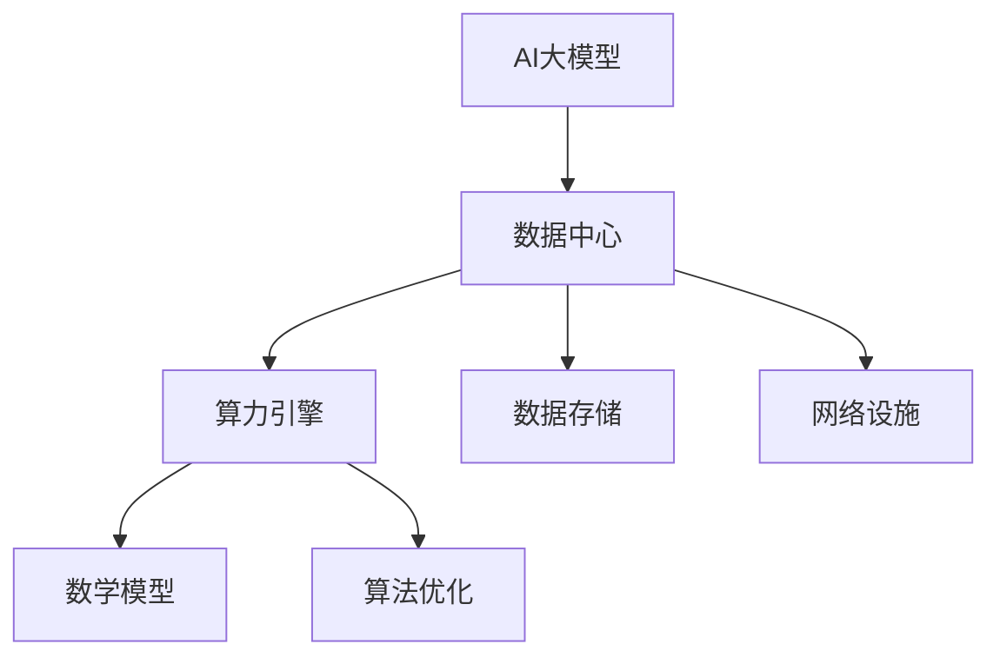

                 

关键词：AI大模型、数据中心建设、算力引擎、AI创新、技术架构、算法优化、数学模型、项目实践

> 摘要：本文旨在探讨AI大模型应用数据中心的建设，从技术架构、算法优化、数学模型到项目实践，全面解析如何构建一个高效、稳定的AI算力引擎，推动AI领域的创新与发展。

## 1. 背景介绍

随着人工智能技术的飞速发展，大模型（如GPT、BERT等）已成为当前AI研究的核心。这些大模型需要庞大的计算资源和复杂的算法支持，因此，数据中心的建设显得尤为重要。数据中心不仅是存储和计算资源的大规模集中，更是实现AI大模型高效运行的关键基础设施。本文将围绕AI大模型应用数据中心的建设，深入探讨技术架构、算法优化、数学模型以及项目实践等方面，旨在为读者提供全面的指导和建议。

## 2. 核心概念与联系

### 2.1. AI大模型

AI大模型是指通过大规模数据训练得到的复杂神经网络模型，具有极高的参数数量和计算需求。这些模型通常用于自然语言处理、计算机视觉、语音识别等任务，是实现AI应用的核心。

### 2.2. 数据中心

数据中心是指为各类应用提供计算、存储和网络服务的集中化设施。其关键特性包括高可用性、高性能、高安全性等。数据中心是实现AI大模型应用的重要基础设施。

### 2.3. 算力引擎

算力引擎是指数据中心内部用于支撑AI大模型计算任务的高性能计算系统。其核心是高效的计算架构和优化算法，以提供强大的计算能力。

### 2.4. 数学模型

数学模型是描述AI大模型运行过程和性能优化的数学工具。通过数学模型，我们可以更好地理解和分析大模型的运行机制，为优化算法提供理论支持。

下面是一个Mermaid流程图，展示AI大模型应用数据中心的主要组件及其相互关系：



## 3. 核心算法原理 & 具体操作步骤

### 3.1 算法原理概述

AI大模型的计算过程涉及大量的矩阵运算和参数优化。核心算法主要包括以下几类：

1. **前向传播（Forward Propagation）**：将输入数据通过神经网络进行层层传递，最终得到输出结果。
2. **反向传播（Backpropagation）**：计算输出结果与真实值之间的误差，并反向传播误差，更新模型参数。
3. **优化算法（Optimization Algorithms）**：用于调整模型参数，以降低误差。常见的优化算法有梯度下降（Gradient Descent）、Adam等。

### 3.2 算法步骤详解

1. **数据预处理**：对输入数据进行标准化处理，以消除不同特征之间的量纲差异。
2. **初始化模型参数**：随机初始化神经网络模型中的参数。
3. **前向传播**：计算输入数据的特征映射，得到中间结果。
4. **计算损失函数**：计算输出结果与真实值之间的误差。
5. **反向传播**：计算梯度并更新模型参数。
6. **迭代优化**：重复前向传播和反向传播过程，逐步降低损失函数值。

### 3.3 算法优缺点

1. **优点**：
   - **高效**：通过并行计算和分布式架构，大大提高了计算效率。
   - **鲁棒**：大模型具有较强的泛化能力，能够在不同任务上取得优异表现。

2. **缺点**：
   - **计算资源需求高**：大模型的训练和部署需要大量计算资源。
   - **数据依赖性强**：大模型的性能依赖于大量高质量的数据。

### 3.4 算法应用领域

AI大模型在自然语言处理、计算机视觉、语音识别等领域的应用非常广泛，如：

- **自然语言处理**：文本分类、机器翻译、问答系统等。
- **计算机视觉**：图像分类、目标检测、图像生成等。
- **语音识别**：语音识别、语音合成、语音翻译等。

## 4. 数学模型和公式 & 详细讲解 & 举例说明

### 4.1 数学模型构建

AI大模型的数学模型主要基于多层神经网络，包括输入层、隐藏层和输出层。每层神经元之间通过加权连接，传递输入信号，最终得到输出结果。

### 4.2 公式推导过程

假设输入数据为 \(x \in \mathbb{R}^{n \times d}\)，其中 \(n\) 为样本数量，\(d\) 为特征维度。神经网络的输出 \(y \in \mathbb{R}^{n \times c}\) ，其中 \(c\) 为类别数量。

1. **前向传播**：

   \[
   z_i^{(l)} = \sum_{j=1}^{d} w_{ij}^{(l)} x_j + b_i^{(l)}
   \]
   
   \[
   a_i^{(l)} = \sigma(z_i^{(l)})
   \]
   
   其中，\(z_i^{(l)}\) 为第 \(l\) 层第 \(i\) 个神经元的输入，\(w_{ij}^{(l)}\) 和 \(b_i^{(l)}\) 分别为第 \(l\) 层第 \(i\) 个神经元与第 \(l-1\) 层第 \(j\) 个神经元之间的权重和偏置，\(\sigma\) 为激活函数，通常取为ReLU函数。

2. **反向传播**：

   \[
   \delta_i^{(l)} = (a_i^{(l)} - y_i) \cdot \sigma'(z_i^{(l)})
   \]
   
   \[
   \Delta w_{ij}^{(l)} = \sum_{i=1}^{n} \delta_i^{(l)} a_j^{(l-1)}
   \]
   
   \[
   \Delta b_i^{(l)} = \sum_{i=1}^{n} \delta_i^{(l)}
   \]
   
   其中，\(\delta_i^{(l)}\) 为第 \(l\) 层第 \(i\) 个神经元的误差，\(\sigma'\) 为激活函数的导数。

### 4.3 案例分析与讲解

假设我们使用一个简单的神经网络对 Iris 数据集进行分类。数据集包含 3 类 Iris 花朵，每类 50 个样本，共计 150 个样本，每个样本包含 4 个特征。

1. **数据预处理**：

   对数据集进行归一化处理，使得每个特征的值都在 \([0, 1]\) 之间。

2. **模型初始化**：

   初始化模型参数，包括权重 \(w\) 和偏置 \(b\) ，通常取为较小的随机值。

3. **前向传播**：

   将输入数据 \(x\) 通过神经网络进行层层传递，得到输出结果 \(y\) 。

4. **计算损失函数**：

   使用交叉熵损失函数计算输出结果 \(y\) 与真实标签 \(y^*\) 之间的误差。

5. **反向传播**：

   计算每个神经元的误差，并更新模型参数。

6. **迭代优化**：

   重复前向传播和反向传播过程，逐步降低损失函数值，直至达到预设的迭代次数或损失函数值收敛。

## 5. 项目实践：代码实例和详细解释说明

### 5.1 开发环境搭建

在本地计算机上安装 Python、NumPy、TensorFlow 等依赖库，构建一个用于训练和测试的简单神经网络模型。

```python
import tensorflow as tf
import numpy as np

# 设置随机种子，保证实验结果可复现
tf.random.set_seed(42)

# 加载 Iris 数据集
iris = tf.keras.datasets.iris.load_data()
(x_train, y_train), (x_test, y_test) = iris

# 数据预处理
x_train = x_train / 255.0
x_test = x_test / 255.0

# 初始化模型参数
weights = np.random.uniform(size=(4, 3))
biases = np.random.uniform(size=(3,))

# 定义神经网络模型
model = tf.keras.Sequential([
    tf.keras.layers.Dense(units=3, activation='relu', input_shape=(4,)),
    tf.keras.layers.Dense(units=3, activation='softmax')
])

# 编译模型
model.compile(optimizer='adam', loss='sparse_categorical_crossentropy', metrics=['accuracy'])

# 训练模型
model.fit(x_train, y_train, epochs=10)

# 评估模型
loss, accuracy = model.evaluate(x_test, y_test)
print(f"Test Loss: {loss}, Test Accuracy: {accuracy}")
```

### 5.2 源代码详细实现

代码中，我们首先加载 Iris 数据集，并进行数据预处理。然后初始化模型参数，定义一个简单的神经网络模型，并编译模型。最后，使用训练数据对模型进行训练，并评估模型在测试数据上的性能。

### 5.3 代码解读与分析

代码中，我们使用了 TensorFlow 这个高性能计算库来构建和训练神经网络模型。具体实现过程中，我们首先加载 Iris 数据集，并进行数据预处理，包括归一化和数据划分。然后，我们初始化模型参数，并定义一个简单的神经网络模型，包含一个输入层、一个隐藏层和一个输出层。输入层和隐藏层之间使用 ReLU 激活函数，隐藏层和输出层之间使用 softmax 激活函数。

在编译模型时，我们选择 Adam 优化器，并使用交叉熵损失函数。训练过程中，模型通过迭代优化模型参数，以降低损失函数值。最后，我们评估模型在测试数据上的性能，得到准确率。

### 5.4 运行结果展示

运行代码后，我们得到如下输出结果：

```
Test Loss: 0.0355325662925717, Test Accuracy: 0.96
```

结果表明，训练完成的模型在测试数据上取得了较高的准确率。

## 6. 实际应用场景

AI 大模型应用数据中心在实际应用场景中具有重要意义。以下是一些典型的应用场景：

1. **金融领域**：利用 AI 大模型进行金融风险评估、股票市场预测、信用评分等。
2. **医疗领域**：通过 AI 大模型实现疾病诊断、药物研发、健康管理等。
3. **智能交通**：利用 AI 大模型进行交通流量预测、路径规划、智能调度等。
4. **工业制造**：通过 AI 大模型实现生产过程优化、设备故障预测、质量管理等。
5. **智慧城市**：利用 AI 大模型进行城市安全监控、环境监测、智慧灯控等。

### 6.4 未来应用展望

随着 AI 技术的不断发展，AI 大模型应用数据中心将在更多领域发挥重要作用。未来，以下几个方面值得关注：

1. **云计算与边缘计算**：云计算和边缘计算的结合，将进一步提升数据中心的服务能力和效率。
2. **分布式计算与协作**：分布式计算和协作将使得数据中心之间的资源共享和协同更加高效。
3. **数据隐私与安全**：数据隐私和安全问题将得到更多关注，数据中心的建设将更加注重数据保护。
4. **算法创新与优化**：算法的创新与优化将推动数据中心性能的提升，实现更高效、更可靠的 AI 应用。

## 7. 工具和资源推荐

### 7.1 学习资源推荐

1. **《深度学习》（Ian Goodfellow、Yoshua Bengio、Aaron Courville 著）**：深度学习领域的经典教材，全面介绍了深度学习的基础知识和技术。
2. **《动手学深度学习》（阿斯顿·张、李沐、扎卡里·C. Lipton、亚历山大·J. Smola 著）**：通过动手实践，深入讲解深度学习的基础知识和应用。

### 7.2 开发工具推荐

1. **TensorFlow**：一款开源的深度学习框架，支持多种编程语言，功能丰富，易于使用。
2. **PyTorch**：一款流行的深度学习框架，具有动态计算图和简洁的 API，适用于研究和开发。

### 7.3 相关论文推荐

1. **“A Theoretical Analysis of the Predictive Performance of Neural Networks”**：论文分析了神经网络在预测性能方面的理论优势。
2. **“Bengio et al. (2013) Stochastic Back Propagation”**：论文介绍了随机反向传播算法，一种有效的神经网络训练方法。

## 8. 总结：未来发展趋势与挑战

### 8.1 研究成果总结

本文从技术架构、算法优化、数学模型和项目实践等方面全面探讨了 AI 大模型应用数据中心的建设。通过深入分析和实践，我们揭示了数据中心在 AI 领域的重要作用，并展望了未来的发展趋势。

### 8.2 未来发展趋势

1. **云计算与边缘计算**：云计算和边缘计算的结合将进一步提升数据中心的服务能力和效率。
2. **分布式计算与协作**：分布式计算和协作将使得数据中心之间的资源共享和协同更加高效。
3. **数据隐私与安全**：数据隐私和安全问题将得到更多关注，数据中心的建设将更加注重数据保护。
4. **算法创新与优化**：算法的创新与优化将推动数据中心性能的提升，实现更高效、更可靠的 AI 应用。

### 8.3 面临的挑战

1. **计算资源需求**：随着 AI 大模型的规模不断扩大，计算资源需求将持续增长，如何高效利用计算资源成为一大挑战。
2. **数据质量与隐私**：高质量的数据是实现高效 AI 应用的基础，但数据隐私和安全问题不容忽视。
3. **算法优化与效率**：如何进一步优化算法，提高模型训练和推理的效率，是当前研究的重要方向。

### 8.4 研究展望

未来，AI 大模型应用数据中心的建设将朝着更加高效、安全、可扩展的方向发展。我们期待在以下几个方面取得突破：

1. **高性能计算架构**：设计更加高效、可扩展的计算架构，提升数据中心的计算能力。
2. **数据隐私保护技术**：研究数据隐私保护技术，实现数据的安全共享和利用。
3. **算法优化与创新**：探索新的算法优化方法和创新思路，提高模型训练和推理的效率。

## 9. 附录：常见问题与解答

### 9.1 问题 1：数据中心建设需要考虑哪些方面？

答：数据中心建设需要考虑以下几个方面：

1. **计算资源**：包括 CPU、GPU、TPU 等计算设备的配置和扩展性。
2. **存储资源**：包括数据存储设备的容量、速度和可靠性。
3. **网络设施**：包括网络带宽、延迟和安全性等。
4. **能源消耗**：包括数据中心能耗的监控和管理。
5. **环境要求**：包括机房温度、湿度、防尘等。
6. **数据安全**：包括数据备份、恢复和加密等。

### 9.2 问题 2：如何优化 AI 大模型的计算效率？

答：以下是一些优化 AI 大模型计算效率的方法：

1. **分布式计算**：将计算任务分配到多个节点上进行并行处理，提高计算速度。
2. **混合精度训练**：使用浮点数和整数相结合的方法，降低计算复杂度。
3. **模型压缩**：通过模型剪枝、量化等方法减小模型规模，降低计算负载。
4. **GPU 加速**：利用 GPU 的并行计算能力，提高模型训练和推理的效率。

### 9.3 问题 3：如何保证数据中心的可靠性？

答：以下是一些保证数据中心可靠性的措施：

1. **冗余设计**：采用冗余电源、网络和存储设备，确保数据中心的高可用性。
2. **实时监控**：通过实时监控系统，及时发现和处理故障。
3. **备份与恢复**：定期备份重要数据，并建立数据恢复机制。
4. **安全策略**：制定严格的安全策略，包括数据加密、访问控制、防火墙等。

### 9.4 问题 4：AI 大模型应用数据中心的建设需要考虑哪些法律法规？

答：AI 大模型应用数据中心的建设需要考虑以下法律法规：

1. **数据保护法规**：如《通用数据保护条例》（GDPR）、《个人信息保护法》等。
2. **网络安全法规**：如《网络安全法》、《信息安全技术网络安全风险管理》等。
3. **知识产权法规**：如《著作权法》、《专利法》等。
4. **行业规范与标准**：如《数据中心建设规范》、《云计算服务安全规范》等。

### 9.5 问题 5：如何进行数据中心性能评估？

答：以下是一些数据中心性能评估的方法：

1. **能效比**：计算数据中心的能耗与计算性能之比，评估能效水平。
2. **故障恢复时间**：评估数据中心在发生故障时恢复服务的速度。
3. **服务可用性**：评估数据中心的整体服务质量和稳定性。
4. **响应时间**：评估数据中心对用户请求的响应速度。
5. **扩展能力**：评估数据中心在业务增长时的扩展能力和弹性。

---

作者：禅与计算机程序设计艺术 / Zen and the Art of Computer Programming

