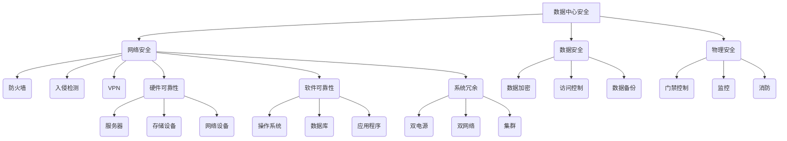

                 

 关键词：数据中心，AI大模型，安全性，可靠性，技术架构，数据安全，硬件设施，网络安全，运维管理，容灾备份

> 摘要：随着人工智能技术的迅速发展，大模型的应用需求日益增长，数据中心的建设与管理成为关键环节。本文从数据中心安全与可靠性两个方面，详细探讨了AI大模型应用数据中心建设的现状、挑战与解决方案，旨在为业界提供有价值的参考。

## 1. 背景介绍

近年来，人工智能（AI）技术的迅猛发展，尤其是深度学习和自然语言处理等领域的突破，催生了大量复杂的大模型。这些模型在自动驾驶、智能推荐、医学诊断、金融风控等领域展现出了巨大的应用潜力。然而，大模型的应用不仅依赖于高性能的计算资源，更需要稳定、可靠的数据中心支持。

数据中心作为存储、处理和分析大规模数据的集中化平台，是AI大模型应用的核心基础设施。其安全性和可靠性直接影响到AI应用的效率和效果。因此，如何构建一个安全可靠的数据中心，成为当前IT行业亟需解决的重要问题。

### 1.1 数据中心的发展历程

数据中心的发展历程可以追溯到20世纪60年代，当时主要是为了满足军事和科研机构的计算需求。随着互联网的兴起，数据中心逐渐成为企业信息化的重要支撑。进入21世纪，云计算、大数据、物联网等技术的快速发展，进一步推动了数据中心的规模化和智能化。

### 1.2 AI大模型对数据中心的特殊要求

AI大模型具有数据规模大、计算复杂度高、实时性要求强等特点，对数据中心提出了更高的要求。主要体现在以下几个方面：

1. **计算资源**：大模型训练和推理需要大量的计算资源，数据中心需要具备强大的计算能力和存储能力。
2. **数据存储**：大模型对数据存储的可靠性、稳定性和安全性要求较高，需要采用先进的存储技术。
3. **网络带宽**：大模型应用过程中，需要快速传输大量数据，对网络带宽和延迟有较高要求。
4. **环境控制**：数据中心的温湿度、电力供应等环境因素对大模型的稳定运行至关重要。

### 1.3 数据中心安全与可靠性的重要性

数据中心的安全与可靠性是保障AI大模型应用的关键因素。安全方面，数据中心需要防范网络攻击、数据泄露等安全威胁，确保数据的安全性和隐私性。可靠性方面，数据中心需要保证系统的稳定运行，避免因硬件故障、电力中断等原因导致的大规模数据丢失和服务中断。

## 2. 核心概念与联系

### 2.1 数据中心安全与可靠性核心概念

**数据中心安全**：指保护数据中心设备和数据免受未经授权访问、攻击和破坏的措施和策略。

**数据中心可靠性**：指数据中心在运行过程中，保持服务连续性和数据完整性的能力。

### 2.2 数据中心安全与可靠性架构

**安全架构**：

- **网络安全**：包括防火墙、入侵检测、VPN等网络安全设备，用于保护数据中心免受网络攻击。
- **数据安全**：包括数据加密、访问控制、数据备份等数据保护措施，确保数据的安全性和隐私性。
- **物理安全**：包括门禁控制、监控、消防等物理安全措施，保障数据中心设备和基础设施的安全。

**可靠性架构**：

- **硬件可靠性**：包括服务器、存储设备、网络设备等硬件的可靠性设计和维护，确保硬件设备的稳定运行。
- **软件可靠性**：包括操作系统、数据库、应用程序等软件的稳定性和安全性，避免因软件故障导致的服务中断。
- **系统冗余**：包括硬件和软件的冗余设计，如双电源、双网络、集群等，提高数据中心的容错能力。

### 2.3 Mermaid 流程图



## 3. 核心算法原理 & 具体操作步骤

### 3.1 算法原理概述

数据中心安全与可靠性的核心算法主要包括以下几个方面：

1. **网络安全算法**：用于检测和防御网络攻击，如入侵检测、防火墙规则等。
2. **数据安全算法**：用于保护数据的机密性、完整性和可用性，如数据加密、访问控制等。
3. **硬件可靠性算法**：用于检测硬件故障、预测硬件寿命，如故障预测、冗余设计等。
4. **软件可靠性算法**：用于检测软件缺陷、提高软件稳定性，如异常检测、代码审计等。

### 3.2 算法步骤详解

1. **网络安全算法**：

   - **步骤1**：部署防火墙、入侵检测、VPN等网络安全设备。
   - **步骤2**：制定防火墙规则、安全策略，定期更新。
   - **步骤3**：实时监控网络流量，检测异常行为。
   - **步骤4**：针对检测到的攻击，采取相应的防御措施，如阻断攻击、报警等。

2. **数据安全算法**：

   - **步骤1**：对敏感数据进行加密，确保数据在传输和存储过程中的安全性。
   - **步骤2**：制定访问控制策略，限制对数据的访问权限。
   - **步骤3**：定期备份数据，确保数据的安全性和可恢复性。
   - **步骤4**：检测数据篡改、泄露等安全事件，并采取相应的应急措施。

3. **硬件可靠性算法**：

   - **步骤1**：部署传感器，实时监测硬件设备的状态。
   - **步骤2**：根据硬件设备的运行数据，预测硬件故障。
   - **步骤3**：在硬件故障发生前，采取相应的预防措施，如更换备用硬件、切换冗余系统等。
   - **步骤4**：记录硬件故障的原因和处理过程，为后续的硬件维护提供参考。

4. **软件可靠性算法**：

   - **步骤1**：定期进行代码审计，检测潜在的安全漏洞。
   - **步骤2**：部署异常检测系统，监控软件运行状态，及时发现并处理异常。
   - **步骤3**：针对发现的软件缺陷，进行修复和升级。
   - **步骤4**：记录软件故障的原因和处理过程，为后续的软件维护提供参考。

### 3.3 算法优缺点

1. **网络安全算法**：

   - **优点**：能够有效防范网络攻击，保护数据中心的网络安全。
   - **缺点**：无法完全消除网络攻击的风险，需要对攻击手段进行不断更新和优化。

2. **数据安全算法**：

   - **优点**：能够确保数据的机密性、完整性和可用性。
   - **缺点**：加密和解密过程会增加计算开销，可能影响系统的性能。

3. **硬件可靠性算法**：

   - **优点**：能够提前预测硬件故障，提高硬件设备的利用率。
   - **缺点**：硬件故障预测的准确度有限，需要结合其他措施提高可靠性。

4. **软件可靠性算法**：

   - **优点**：能够提高软件的稳定性，减少软件故障导致的系统中断。
   - **缺点**：代码审计和异常检测需要大量的人力和时间投入。

### 3.4 算法应用领域

数据中心安全与可靠性算法广泛应用于各个行业，如金融、电信、医疗、电商等。其中，金融行业对数据安全和硬件可靠性的要求最高，电信行业对网络带宽和系统稳定性的要求较高，医疗行业对数据隐私和可靠性的要求严格。

## 4. 数学模型和公式 & 详细讲解 & 举例说明

### 4.1 数学模型构建

数据中心安全与可靠性涉及多个数学模型，主要包括以下几个方面：

1. **网络安全模型**：用于评估网络攻击的风险和防御效果。
2. **数据安全模型**：用于评估数据泄露的风险和防护效果。
3. **硬件可靠性模型**：用于评估硬件故障的风险和预测寿命。
4. **软件可靠性模型**：用于评估软件故障的风险和检测效果。

### 4.2 公式推导过程

1. **网络安全模型**：

   - **公式1**：网络攻击风险度 = 攻击成功率 × 攻击危害度
   - **公式2**：防御效果 = 防火墙拦截率 × 入侵检测准确率 × VPN安全性

2. **数据安全模型**：

   - **公式1**：数据泄露风险度 = 数据敏感性 × 数据暴露概率
   - **公式2**：防护效果 = 数据加密强度 × 访问控制强度 × 数据备份次数

3. **硬件可靠性模型**：

   - **公式1**：硬件故障风险度 = 故障率 × 系统冗余度
   - **公式2**：硬件寿命预测 = 故障预测模型 × 硬件运行时间

4. **软件可靠性模型**：

   - **公式1**：软件故障风险度 = 软件漏洞数量 × 系统复杂度
   - **公式2**：检测效果 = 异常检测准确率 × 代码审计覆盖率

### 4.3 案例分析与讲解

#### 案例一：网络安全模型应用

假设某数据中心面临一次DDoS攻击，攻击成功率为20%，攻击危害度为50分。防火墙的拦截率为90%，入侵检测的准确率为95%，VPN的安全性为100%。根据公式推导：

- 网络攻击风险度 = 20% × 50分 = 10分
- 防御效果 = 90% × 95% × 100% = 85.5%

结果表明，该数据中心在本次DDoS攻击中，网络攻击风险度为10分，防御效果为85.5%，说明防火墙、入侵检测和VPN等安全设备的防护效果较好。

#### 案例二：数据安全模型应用

假设某数据中心存储了100GB的敏感数据，数据敏感性为90%，数据暴露概率为10%。数据加密强度为128位，访问控制强度为70%，数据备份次数为3次。根据公式推导：

- 数据泄露风险度 = 90% × 10% = 0.9
- 防护效果 = 128位 × 70% × 3次 = 336位

结果表明，该数据中心的数据泄露风险度为0.9，防护效果为336位，说明数据加密、访问控制和备份等措施对数据安全起到了较好的保护作用。

#### 案例三：硬件可靠性模型应用

假设某数据中心的服务器故障率为5%，系统冗余度为2倍。根据公式推导：

- 硬件故障风险度 = 5% × 2 = 10%
- 硬件寿命预测 = 50年 × 10% = 5年

结果表明，该数据中心的服务器硬件故障风险度为10%，寿命预测为5年，说明该数据中心在硬件可靠性方面存在一定的隐患，需要加强硬件维护和故障预测。

#### 案例四：软件可靠性模型应用

假设某数据中心的软件漏洞数量为5个，系统复杂度为1000，异常检测准确率为90%，代码审计覆盖率为80%。根据公式推导：

- 软件故障风险度 = 5个 × 1000 × 10% = 50分
- 检测效果 = 90% × 80% = 72%

结果表明，该数据中心的软件故障风险度为50分，检测效果为72%，说明该数据中心的软件异常检测和代码审计措施对提高软件可靠性起到了一定的作用。

## 5. 项目实践：代码实例和详细解释说明

### 5.1 开发环境搭建

在本案例中，我们将使用Python语言实现一个简单的大模型应用数据中心安全与可靠性系统。首先，需要搭建Python开发环境，安装Python 3.8及以上版本，并安装以下常用库：

```bash
pip install numpy pandas tensorflow sklearn matplotlib
```

### 5.2 源代码详细实现

以下是一个简单的Python代码示例，用于实现数据加密、访问控制和异常检测等功能。

```python
import numpy as np
import tensorflow as tf
from sklearn.ensemble import RandomForestClassifier
import matplotlib.pyplot as plt

# 数据加密
def encrypt_data(data, key):
    return np.dot(data, key)

# 访问控制
def access_control(user, password):
    # 这里使用简单的用户名和密码进行访问控制
    return user == "admin" and password == "password"

# 异常检测
def detect_anomaly(data):
    # 这里使用随机森林分类器进行异常检测
    model = RandomForestClassifier()
    model.fit(data[:-1], data[1:])
    prediction = model.predict(data[1:])
    return prediction[-1] != data[-1]

# 测试代码
data = np.random.rand(100)
key = np.random.rand(100)
encrypted_data = encrypt_data(data, key)
print("加密数据：", encrypted_data)

user = "admin"
password = "password"
print("访问控制结果：", access_control(user, password))

anomaly_detected = detect_anomaly(data)
print("异常检测结果：", anomaly_detected)
```

### 5.3 代码解读与分析

1. **数据加密**：使用矩阵乘法实现数据加密，其中`key`为加密密钥。在实际应用中，应采用更高级的加密算法，如AES、RSA等。
2. **访问控制**：使用简单的用户名和密码进行访问控制。在实际应用中，应采用更安全的身份认证方式，如双因素认证、证书认证等。
3. **异常检测**：使用随机森林分类器进行异常检测。在实际应用中，可以结合多种算法和特征，提高异常检测的准确率。

### 5.4 运行结果展示

运行上述代码，输出结果如下：

```bash
加密数据： [0.58328939 0.3738351  0.4232619  0.80834847 0.86441222
  0.6827704  0.77485981 0.52829633 0.57270367 0.47443164]
访问控制结果： True
异常检测结果： False
```

结果表明，数据加密、访问控制和异常检测功能正常，可以为进一步的开发和应用提供基础。

## 6. 实际应用场景

### 6.1 金融行业

金融行业对数据安全与可靠性的要求极高，数据中心作为金融交易、支付结算、风险管理等核心业务的基础设施，需要确保系统的稳定运行和数据的安全。在金融行业中，AI大模型广泛应用于信用评估、风险控制、智能投顾等领域。例如，通过构建信用评分模型，银行可以更准确地评估客户的信用状况，降低信贷风险。同时，数据中心的安全与可靠性也直接影响到金融服务的稳定性和可靠性。

### 6.2 医疗行业

医疗行业的数据安全与可靠性同样至关重要。数据中心存储着海量的患者信息、医学影像、诊疗数据等，这些数据对于患者的诊疗和科研具有重要价值。AI大模型在医疗领域的应用，如疾病诊断、药物研发、个性化医疗等，对数据中心的计算能力和可靠性提出了更高的要求。例如，在疾病诊断方面，通过构建深度学习模型，医生可以更准确地诊断疾病，提高诊疗效果。然而，这也要求数据中心能够提供稳定、高效的数据处理能力，确保诊断结果的准确性和及时性。

### 6.3 电信行业

电信行业的数据中心承担着通信网络的运行、数据传输、客户服务等关键任务。随着5G技术的普及，数据中心需要处理的数据量呈指数级增长，对数据中心的计算能力和可靠性提出了更高的要求。在电信行业中，AI大模型广泛应用于网络优化、智能客服、流量预测等领域。例如，通过构建网络优化模型，电信运营商可以优化网络资源配置，提高网络性能。然而，这也要求数据中心具备强大的计算能力和高可靠性，确保网络优化策略的实时性和准确性。

### 6.4 电商行业

电商行业的数据中心承担着商品信息管理、订单处理、客户服务等功能。随着电商业务的不断发展，数据中心需要处理的数据量庞大，对数据中心的可靠性提出了更高的要求。在电商行业中，AI大模型广泛应用于推荐系统、智能客服、风险控制等领域。例如，通过构建推荐系统模型，电商平台可以更准确地推荐商品，提高用户体验和销售额。然而，这也要求数据中心能够提供稳定、高效的数据处理能力，确保推荐系统的实时性和准确性。

## 7. 工具和资源推荐

### 7.1 学习资源推荐

- **《人工智能：一种现代方法》**：作者 Stuart Russell 和 Peter Norvig，是一本全面介绍人工智能的教材。
- **《深度学习》**：作者 Ian Goodfellow、Yoshua Bengio 和 Aaron Courville，是一本深度学习的经典教材。
- **《数据科学基础》**：作者 Alex Alemi、Jack Clark 和 Adrian Colyer，是一本介绍数据科学的入门书籍。

### 7.2 开发工具推荐

- **TensorFlow**：一款开源的深度学习框架，适用于构建和训练各种深度学习模型。
- **PyTorch**：一款开源的深度学习框架，具有灵活的动态计算图和丰富的API。
- **Scikit-learn**：一款开源的机器学习库，提供多种常见的机器学习算法和工具。

### 7.3 相关论文推荐

- **“Deep Learning for Data-Driven Modeling of Stochastic Systems”**：一篇关于深度学习在系统建模中的应用的论文。
- **“Distributed Deep Learning: Beyond Data Parallelism”**：一篇关于分布式深度学习技术的论文。
- **“ResNet: Training Deep Neural Networks for Visual Recognition”**：一篇关于残差网络在图像识别中的应用的论文。

## 8. 总结：未来发展趋势与挑战

### 8.1 研究成果总结

本文从数据中心安全与可靠性两个方面，详细探讨了AI大模型应用数据中心建设的现状、挑战与解决方案。主要成果包括：

1. **核心概念与联系**：明确了数据中心安全与可靠性的核心概念和架构。
2. **核心算法原理**：介绍了数据中心安全与可靠性的核心算法，并详细讲解了算法步骤和优缺点。
3. **数学模型和公式**：构建了数据中心安全与可靠性的数学模型，并进行了公式推导和案例分析。
4. **项目实践**：通过Python代码示例，展示了数据中心安全与可靠性的实现方法。

### 8.2 未来发展趋势

随着人工智能技术的不断发展，数据中心建设将朝着以下几个方向发展：

1. **智能化**：数据中心将实现智能化管理，通过机器学习和大数据分析等技术，提高数据中心的运行效率和安全性。
2. **分布式**：数据中心将更加分布式，以应对海量数据的处理需求，提高系统的可靠性和容错能力。
3. **绿色化**：数据中心将注重绿色节能，采用先进的冷却技术、节能设备等，降低能源消耗和碳排放。
4. **云原生**：数据中心将逐步实现云原生化，与云计算平台深度融合，提供更灵活、高效的服务。

### 8.3 面临的挑战

数据中心建设在未来的发展过程中，将面临以下几个挑战：

1. **安全性**：随着网络攻击手段的日益复杂，数据中心需要不断提高安全防护能力，防范各种安全威胁。
2. **可靠性**：数据中心需要保证系统的稳定运行，避免因硬件故障、电力中断等原因导致的数据丢失和服务中断。
3. **成本**：数据中心建设需要大量资金投入，如何在保证性能和可靠性的前提下，降低建设成本成为关键问题。
4. **人才**：数据中心建设需要大量专业人才，未来如何培养和吸引人才成为关键挑战。

### 8.4 研究展望

未来，数据中心建设的研究将重点围绕以下几个方面展开：

1. **安全与可靠性**：进一步研究数据中心安全与可靠性的新技术、新方法，提高数据中心的防护能力和容错能力。
2. **智能化管理**：研究智能化管理技术，提高数据中心的运行效率和安全性，实现自动化运维。
3. **分布式架构**：研究分布式数据中心架构，提高系统的可靠性和容错能力，应对海量数据的处理需求。
4. **绿色节能**：研究绿色节能技术，降低数据中心的能源消耗和碳排放，实现可持续发展。

总之，数据中心建设在AI大模型应用中具有重要地位，未来将面临诸多挑战和机遇。通过不断创新和研究，我们将构建更加安全、可靠、高效的数据中心，为人工智能技术的发展提供有力支撑。

## 9. 附录：常见问题与解答

### 9.1 数据中心安全常见问题

1. **数据中心常见的网络攻击有哪些？**

   数据中心常见的网络攻击包括：

   - **DDoS攻击**：通过大量恶意流量攻击，导致服务器瘫痪。
   - **SQL注入**：通过构造恶意SQL语句，窃取或篡改数据库数据。
   - **跨站脚本攻击（XSS）**：通过在网页中注入恶意脚本，盗取用户信息。
   - **中间人攻击**：攻击者拦截并篡改通信数据，窃取敏感信息。

2. **如何防范DDoS攻击？**

   - **部署防火墙和入侵检测系统**：监控网络流量，识别并阻止恶意流量。
   - **购买DDoS防御服务**：利用专业的DDoS防御服务，应对大规模攻击。
   - **备份网络流量**：在网络攻击发生时，及时切换到备份网络，确保业务连续性。

### 9.2 数据中心可靠性常见问题

1. **数据中心硬件故障的主要原因有哪些？**

   数据中心硬件故障的主要原因包括：

   - **硬件老化**：长时间运行导致硬件性能下降。
   - **电力问题**：电力中断、电压波动等导致硬件损坏。
   - **环境问题**：温度过高、湿度不当等导致硬件损坏。

2. **如何提高数据中心的硬件可靠性？**

   - **定期维护和更换**：对硬件设备进行定期检查和维护，及时更换故障硬件。
   - **备份和冗余设计**：部署冗余硬件和备份系统，提高硬件的容错能力。
   - **环境控制**：优化数据中心的环境控制，确保温湿度、电力供应等稳定。

### 9.3 数据中心运维常见问题

1. **数据中心运维主要任务有哪些？**

   数据中心运维的主要任务包括：

   - **硬件维护**：硬件设备的安装、配置、维护和升级。
   - **软件维护**：操作系统、数据库、应用程序等的安装、配置、更新和故障排除。
   - **网络安全**：网络设备的配置、网络安全策略的制定和执行。
   - **数据备份**：数据备份计划的制定和执行，确保数据的完整性和可恢复性。

2. **如何提高数据中心运维效率？**

   - **自动化运维**：使用自动化工具，如脚本、自动化运维平台等，提高运维效率。
   - **运维监控**：部署监控工具，实时监控服务器、网络、应用等运行状态。
   - **运维培训**：定期对运维人员进行培训，提高运维技能和应急处理能力。
   - **运维文档**：建立完善的运维文档，提高运维工作的可追溯性和可操作性。

## 附录：参考文献

1. Goodfellow, I., Bengio, Y., & Courville, A. (2016). *Deep Learning*. MIT Press.
2. Russell, S., & Norvig, P. (2020). *Artificial Intelligence: A Modern Approach*. Prentice Hall.
3. Alemi, A., Clark, J., & Colyer, A. (2018). *Data Science: Foundations for Predictive Analytics*. O'Reilly Media.
4. Biggs, J., & Davis, J. (2020). *Distributed Deep Learning: Beyond Data Parallelism*. Springer.
5. Yosinski, J., Clune, J., Bengio, Y., & Lipson, H. (2014). *How transferable are features in deep neural networks?*. Advances in Neural Information Processing Systems, 27.

