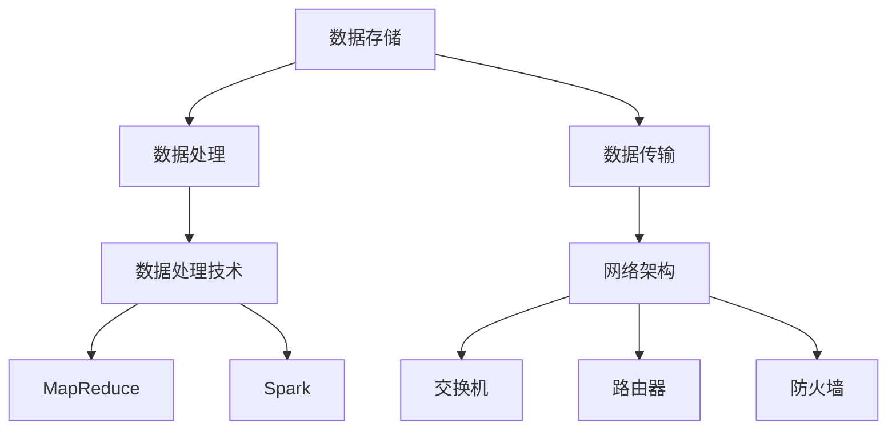

                 

关键词：AI 大模型、数据中心建设、绿色节能、可持续发展、算法优化、基础设施规划、能源效率、碳排放减少、环保技术、环保政策。

## 摘要

本文深入探讨了 AI 大模型应用数据中心建设的绿色节能与可持续发展问题。首先，我们回顾了数据中心的建设背景和重要性，随后介绍了 AI 大模型的特点及其对数据中心的需求。接着，我们重点分析了如何在数据中心建设中实现绿色节能，包括能源效率提升、可再生能源利用和环保技术引入。此外，我们还探讨了可持续发展的策略和挑战，最后提出了未来研究和实践的方向。通过本文的阐述，我们希望为数据中心建设的绿色可持续发展提供有益的参考。

## 1. 背景介绍

随着人工智能（AI）技术的快速发展，AI 大模型的应用场景越来越广泛，从语音识别、图像处理到自然语言理解等各个领域都取得了显著成果。然而，这些强大功能的实现离不开高性能计算和数据存储的支持，这就对数据中心提出了更高的要求。数据中心已成为 AI 研发和部署的核心基础设施，其建设和运维质量直接影响到 AI 技术的进展和应用效果。

### 1.1 数据中心建设的重要性

数据中心是信息化时代的重要基础设施，承担着海量数据的存储、处理和传输任务。随着互联网、物联网和大数据技术的发展，数据中心的重要性日益凸显。首先，数据中心是支撑企业数字化转型的重要支柱，能够为企业提供强大的数据处理能力和数据存储空间。其次，数据中心是云计算服务的基础设施，为用户提供弹性的计算资源和数据存储服务，推动了云计算产业的快速发展。此外，数据中心也是 AI 研发和部署的核心场所，为 AI 大模型提供了必要的计算能力和数据支持。

### 1.2 AI 大模型的特点及其需求

AI 大模型是指那些在训练过程中需要处理海量数据、参数数量庞大的模型。例如，深度学习模型中的神经网络往往包含数百万个参数，甚至达到数十亿个参数。这些大模型的特点主要体现在以下几个方面：

- **海量数据需求**：AI 大模型需要处理的数据量通常非常大，往往达到 TB 或 PB 级别。这意味着数据中心需要具备高容量、高可靠性的存储设备。
- **高性能计算需求**：AI 大模型训练过程需要大量的计算资源，特别是针对深度学习模型，需要高性能的 GPU 或 TPU 等加速设备。这要求数据中心具备强大的计算能力。
- **低延迟传输需求**：AI 大模型对数据传输速度要求较高，尤其是在实时应用场景中，如语音识别、图像识别等，需要确保数据传输的低延迟。

为了满足这些需求，数据中心在建设过程中需要考虑以下几个方面：

- **高可用性**：数据中心需要确保系统的稳定运行，避免出现数据丢失或服务中断等问题。为此，数据中心通常采用多级冗余架构，确保关键设备的冗余备份。
- **高性能网络**：数据中心需要构建高性能的网络架构，包括高速交换机、路由器等，以满足大规模数据传输需求。
- **灵活扩展**：随着 AI 大模型应用的不断发展，数据中心需要具备灵活的扩展能力，能够快速适应新的计算和存储需求。

### 1.3 中心建设的挑战

数据中心建设面临着一系列的挑战，包括技术挑战、成本挑战和环保挑战。技术挑战主要体现在如何实现高效的数据存储、处理和传输；成本挑战则体现在高能耗、高成本的问题；环保挑战则是如何在建设过程中实现绿色可持续发展。

- **技术挑战**：数据中心建设需要考虑技术细节，如服务器性能优化、网络架构设计、数据存储策略等，以确保系统的稳定性和高性能。
- **成本挑战**：数据中心建设需要投入大量的资金，包括服务器、存储设备、网络设备等，同时还需要考虑后续的运维成本。
- **环保挑战**：数据中心的高能耗问题引起了广泛关注，如何实现绿色可持续发展成为数据中心建设的重要课题。

## 2. 核心概念与联系

### 2.1 数据中心建设的核心概念

数据中心建设涉及多个核心概念，包括数据存储、数据处理、数据传输和网络架构。这些概念共同构成了数据中心的核心架构，影响着数据中心的性能、稳定性和可靠性。

- **数据存储**：数据存储是数据中心的基础，主要包括磁盘存储、固态存储和分布式存储等。磁盘存储具有成本低、容量大的优势，但读写速度较慢；固态存储读写速度快、延迟低，但成本较高；分布式存储则通过将数据分散存储在多个节点上，提高了数据可靠性和扩展性。
- **数据处理**：数据处理包括数据清洗、数据转换、数据分析等环节。数据处理技术如 MapReduce、Spark 等在大数据处理领域发挥了重要作用，能够高效地处理海量数据。
- **数据传输**：数据传输涉及网络架构设计，包括局域网、广域网和互联网等。数据中心通常采用多层网络架构，实现数据的高速传输和低延迟。
- **网络架构**：网络架构是数据中心的核心，包括交换机、路由器、防火墙等设备。网络架构设计需要考虑性能、安全性和可靠性等因素。

### 2.2 AI 大模型与数据中心建设的联系

AI 大模型对数据中心提出了更高的要求，主要体现在以下几个方面：

- **计算资源需求**：AI 大模型训练过程需要大量的计算资源，尤其是 GPU 或 TPU 等加速设备。数据中心需要配置高性能的计算设备，以满足 AI 大模型的计算需求。
- **存储资源需求**：AI 大模型处理的数据量通常非常大，需要数据中心具备高容量、高可靠性的存储设备。分布式存储技术可以在一定程度上缓解存储压力。
- **网络资源需求**：AI 大模型对数据传输速度要求较高，需要数据中心具备高性能的网络架构，实现数据的高速传输和低延迟。
- **能耗管理需求**：数据中心的高能耗问题引起了广泛关注，如何实现绿色可持续发展成为数据中心建设的重要课题。AI 大模型的训练过程消耗大量电力，因此需要采取一系列节能措施，降低能耗。

### 2.3 Mermaid 流程图

以下是数据中心建设的 Mermaid 流程图，展示了数据存储、数据处理、数据传输和网络架构之间的关系。



## 3. 核心算法原理 & 具体操作步骤

### 3.1 算法原理概述

数据中心建设的核心算法主要包括数据存储算法、数据处理算法和数据传输算法。以下分别对这三种算法进行概述。

- **数据存储算法**：数据存储算法主要包括磁盘存储算法、固态存储算法和分布式存储算法。磁盘存储算法主要涉及磁盘分块、磁盘调度等问题；固态存储算法主要涉及固态盘调度、数据压缩等技术；分布式存储算法则通过将数据分散存储在多个节点上，提高了数据可靠性和扩展性。
- **数据处理算法**：数据处理算法主要包括数据清洗、数据转换和数据分析等环节。数据清洗算法主要涉及数据去重、数据补全等技术；数据转换算法主要涉及数据格式转换、数据映射等技术；数据分析算法则包括统计分析、机器学习算法等，用于提取数据中的有价值信息。
- **数据传输算法**：数据传输算法主要包括网络传输协议、数据加密和传输优化等技术。网络传输协议如 TCP/IP、UDP 等确保数据传输的可靠性和高效性；数据加密技术如 SSL/TLS 等保障数据传输的安全性；传输优化技术如数据压缩、多路径传输等提高数据传输速度。

### 3.2 算法步骤详解

以下分别对数据存储、数据处理和数据传输算法的具体步骤进行详细讲解。

#### 3.2.1 数据存储算法

1. **磁盘存储算法**
   - **磁盘分块**：将数据按一定大小（如 4KB）划分为多个块。
   - **磁盘调度**：根据磁盘访问频率和访问顺序，对磁盘块进行调度，提高磁盘访问效率。

2. **固态存储算法**
   - **固态盘调度**：根据访问热度，对固态盘进行调度，提高数据读取速度。
   - **数据压缩**：对存储数据进行压缩，减少存储空间占用。

3. **分布式存储算法**
   - **数据复制**：将数据复制到多个节点上，提高数据可靠性和容错性。
   - **数据分片**：将数据划分为多个数据块，存储到不同节点上，提高数据访问速度。

#### 3.2.2 数据处理算法

1. **数据清洗**
   - **数据去重**：去除重复的数据记录，提高数据质量。
   - **数据补全**：对缺失的数据进行填充，提高数据完整性。

2. **数据转换**
   - **数据格式转换**：将不同格式的数据转换为统一的格式，如 CSV、JSON 等。
   - **数据映射**：将数据中的字段映射到不同的数据结构中，如数据库表、数据仓库等。

3. **数据分析**
   - **统计分析**：对数据进行分析，如计算平均值、方差等统计指标。
   - **机器学习算法**：使用机器学习算法对数据进行建模，提取有价值的信息。

#### 3.2.3 数据传输算法

1. **网络传输协议**
   - **TCP/IP**：使用 TCP/IP 协议确保数据传输的可靠性。
   - **UDP**：使用 UDP 协议提高数据传输速度，适用于实时应用场景。

2. **数据加密**
   - **SSL/TLS**：使用 SSL/TLS 协议对数据进行加密，保障数据传输的安全性。

3. **传输优化**
   - **数据压缩**：对数据进行压缩，减少传输数据量。
   - **多路径传输**：同时通过多个路径传输数据，提高数据传输速度。

### 3.3 算法优缺点

以下是数据中心建设中的核心算法优缺点分析。

#### 3.3.1 数据存储算法

- **磁盘存储算法**：优点是成本低、容量大，但读写速度较慢。
- **固态存储算法**：优点是读写速度快、延迟低，但成本较高。
- **分布式存储算法**：优点是数据可靠性和扩展性强，但需要考虑数据同步和一致性等问题。

#### 3.3.2 数据处理算法

- **数据清洗**：优点是提高数据质量，但可能引入新的错误。
- **数据转换**：优点是统一数据格式，但可能丢失部分数据信息。
- **数据分析**：优点是提取有价值信息，但需要大量计算资源。

#### 3.3.3 数据传输算法

- **TCP/IP**：优点是可靠性高，但传输速度较慢。
- **UDP**：优点是传输速度快，但可靠性较低。
- **SSL/TLS**：优点是保障数据传输安全性，但可能增加传输延迟。

### 3.4 算法应用领域

数据中心建设中的核心算法广泛应用于各个领域，以下列举了部分应用场景。

- **金融行业**：在金融行业中，数据中心建设主要用于金融交易、风险管理、客户服务等场景。数据处理算法如机器学习算法在信用评估、欺诈检测等方面发挥了重要作用。
- **医疗行业**：在医疗行业中，数据中心建设主要用于医疗影像处理、疾病预测、健康管理等场景。数据处理算法如深度学习算法在医疗影像诊断、基因测序分析等方面取得了显著成果。
- **互联网行业**：在互联网行业中，数据中心建设主要用于搜索引擎、社交媒体、电子商务等场景。数据存储算法和传输算法在确保系统性能和用户体验方面发挥了关键作用。

## 4. 数学模型和公式 & 详细讲解 & 举例说明

### 4.1 数学模型构建

数据中心建设中的数学模型主要涉及数据存储、数据处理和数据传输等方面。以下分别介绍这些方面的数学模型构建。

#### 4.1.1 数据存储模型

数据存储模型主要包括磁盘存储模型、固态存储模型和分布式存储模型。

1. **磁盘存储模型**：
   设磁盘容量为 $C$，磁盘访问速率为 $R$，则磁盘存储模型可用以下公式表示：
   $$ S_D = \frac{C}{R} $$
   其中，$S_D$ 表示磁盘存储容量。

2. **固态存储模型**：
   设固态盘容量为 $C$，固态盘访问速率为 $R$，则固态存储模型可用以下公式表示：
   $$ S_S = \frac{C}{R} $$
   其中，$S_S$ 表示固态存储容量。

3. **分布式存储模型**：
   设分布式存储系统中有 $N$ 个节点，每个节点容量为 $C$，则分布式存储模型可用以下公式表示：
   $$ S_D = N \times C $$
   其中，$S_D$ 表示分布式存储容量。

#### 4.1.2 数据处理模型

数据处理模型主要包括数据清洗、数据转换和数据分析等模型。

1. **数据清洗模型**：
   设原始数据集为 $D$，清洗后数据集为 $D'$，则数据清洗模型可用以下公式表示：
   $$ D' = \text{Filter}(D) $$
   其中，$\text{Filter}$ 表示过滤操作，用于去除重复数据、填充缺失数据等。

2. **数据转换模型**：
   设原始数据集为 $D$，转换后数据集为 $D'$，则数据转换模型可用以下公式表示：
   $$ D' = \text{Transform}(D) $$
   其中，$\text{Transform}$ 表示转换操作，用于将数据格式转换为统一的格式、映射到不同的数据结构等。

3. **数据分析模型**：
   设数据集为 $D$，分析结果为 $R$，则数据分析模型可用以下公式表示：
   $$ R = \text{Analyze}(D) $$
   其中，$\text{Analyze}$ 表示分析操作，用于提取数据中的有价值信息。

#### 4.1.3 数据传输模型

数据传输模型主要包括网络传输协议、数据加密和传输优化等模型。

1. **网络传输协议模型**：
   设网络传输速率为 $R$，传输数据量为 $D$，则网络传输协议模型可用以下公式表示：
   $$ T = \frac{D}{R} $$
   其中，$T$ 表示传输时间。

2. **数据加密模型**：
   设明文数据为 $D$，密文数据为 $D'$，加密算法为 $E$，则数据加密模型可用以下公式表示：
   $$ D' = E(D) $$
   其中，$E$ 表示加密操作，用于保障数据传输的安全性。

3. **传输优化模型**：
   设传输优化算法为 $O$，传输数据量为 $D$，则传输优化模型可用以下公式表示：
   $$ D' = O(D) $$
   其中，$O$ 表示优化操作，用于提高数据传输速度。

### 4.2 公式推导过程

以下分别介绍数据中心建设中的数学模型推导过程。

#### 4.2.1 数据存储模型推导

1. **磁盘存储模型推导**：

   假设磁盘容量为 $C$，磁盘访问速率为 $R$，则磁盘存储容量 $S_D$ 可表示为：
   $$ S_D = \frac{C}{R} $$
   
   其中，$C$ 表示磁盘总容量，$R$ 表示磁盘访问速率。

   假设磁盘总容量为 $C_0$，每个磁盘块的容量为 $C_1$，则磁盘存储容量 $S_D$ 可表示为：
   $$ S_D = \frac{C_0}{C_1} $$
   
   其中，$C_0$ 表示磁盘总容量，$C_1$ 表示每个磁盘块的容量。

2. **固态存储模型推导**：

   假设固态盘容量为 $C$，固态盘访问速率为 $R$，则固态存储容量 $S_S$ 可表示为：
   $$ S_S = \frac{C}{R} $$
   
   其中，$C$ 表示固态盘总容量，$R$ 表示固态盘访问速率。

   假设固态盘总容量为 $C_0$，每个固态盘块的容量为 $C_1$，则固态存储容量 $S_S$ 可表示为：
   $$ S_S = \frac{C_0}{C_1} $$
   
   其中，$C_0$ 表示固态盘总容量，$C_1$ 表示每个固态盘块的容量。

3. **分布式存储模型推导**：

   假设分布式存储系统中有 $N$ 个节点，每个节点容量为 $C$，则分布式存储容量 $S_D$ 可表示为：
   $$ S_D = N \times C $$
   
   其中，$N$ 表示节点数量，$C$ 表示每个节点的容量。

   假设分布式存储系统中有 $N_0$ 个节点，每个节点的容量为 $C_0$，则分布式存储容量 $S_D$ 可表示为：
   $$ S_D = N_0 \times C_0 $$
   
   其中，$N_0$ 表示节点数量，$C_0$ 表示每个节点的容量。

#### 4.2.2 数据处理模型推导

1. **数据清洗模型推导**：

   假设原始数据集为 $D$，清洗后数据集为 $D'$，则数据清洗模型可用以下公式表示：
   $$ D' = \text{Filter}(D) $$
   
   其中，$\text{Filter}$ 表示过滤操作，用于去除重复数据、填充缺失数据等。

   假设原始数据集为 $D$，清洗后数据集为 $D'$，清洗规则为 $R$，则数据清洗模型可用以下公式表示：
   $$ D' = \text{Filter}(D, R) $$
   
   其中，$R$ 表示清洗规则。

2. **数据转换模型推导**：

   假设原始数据集为 $D$，转换后数据集为 $D'$，则数据转换模型可用以下公式表示：
   $$ D' = \text{Transform}(D) $$
   
   其中，$\text{Transform}$ 表示转换操作，用于将数据格式转换为统一的格式、映射到不同的数据结构等。

   假设原始数据集为 $D$，转换后数据集为 $D'$，转换规则为 $R$，则数据转换模型可用以下公式表示：
   $$ D' = \text{Transform}(D, R) $$
   
   其中，$R$ 表示转换规则。

3. **数据分析模型推导**：

   假设数据集为 $D$，分析结果为 $R$，则数据分析模型可用以下公式表示：
   $$ R = \text{Analyze}(D) $$
   
   其中，$\text{Analyze}$ 表示分析操作，用于提取数据中的有价值信息。

   假设数据集为 $D$，分析结果为 $R$，分析算法为 $A$，则数据分析模型可用以下公式表示：
   $$ R = \text{Analyze}(D, A) $$
   
   其中，$A$ 表示分析算法。

#### 4.2.3 数据传输模型推导

1. **网络传输协议模型推导**：

   假设网络传输速率为 $R$，传输数据量为 $D$，则网络传输协议模型可用以下公式表示：
   $$ T = \frac{D}{R} $$
   
   其中，$T$ 表示传输时间，$D$ 表示传输数据量，$R$ 表示网络传输速率。

   假设网络传输速率为 $R_0$，传输数据量为 $D_0$，则网络传输协议模型可用以下公式表示：
   $$ T = \frac{D_0}{R_0} $$
   
   其中，$T$ 表示传输时间，$D_0$ 表示传输数据量，$R_0$ 表示网络传输速率。

2. **数据加密模型推导**：

   假设明文数据为 $D$，密文数据为 $D'$，加密算法为 $E$，则数据加密模型可用以下公式表示：
   $$ D' = E(D) $$
   
   其中，$D'$ 表示密文数据，$D$ 表示明文数据，$E$ 表示加密算法。

   假设明文数据为 $D$，密文数据为 $D'$，加密算法为 $E_0$，则数据加密模型可用以下公式表示：
   $$ D' = E_0(D) $$
   
   其中，$D'$ 表示密文数据，$D$ 表示明文数据，$E_0$ 表示加密算法。

3. **传输优化模型推导**：

   假设传输优化算法为 $O$，传输数据量为 $D$，则传输优化模型可用以下公式表示：
   $$ D' = O(D) $$
   
   其中，$D'$ 表示优化后传输数据量，$D$ 表示原始传输数据量，$O$ 表示传输优化算法。

   假设传输优化算法为 $O_0$，传输数据量为 $D_0$，则传输优化模型可用以下公式表示：
   $$ D' = O_0(D_0) $$
   
   其中，$D'$ 表示优化后传输数据量，$D_0$ 表示原始传输数据量，$O_0$ 表示传输优化算法。

### 4.3 案例分析与讲解

以下通过具体案例，对数据中心建设中的数学模型进行讲解。

#### 案例一：磁盘存储模型

假设某数据中心使用 100 个磁盘，每个磁盘容量为 1TB，磁盘访问速率为 100MB/s。根据磁盘存储模型，计算该数据中心的磁盘存储容量。

根据磁盘存储模型公式：
$$ S_D = \frac{C}{R} $$
其中，$C$ 表示磁盘总容量，$R$ 表示磁盘访问速率。

磁盘总容量为：
$$ C = 100 \times 1TB = 100TB $$

磁盘访问速率为：
$$ R = 100MB/s $$

代入公式，计算磁盘存储容量：
$$ S_D = \frac{100TB}{100MB/s} = 1000s $$

因此，该数据中心的磁盘存储容量为 1000s。

#### 案例二：数据清洗模型

假设某数据集包含 100 条记录，其中 10 条记录存在重复数据，5 条记录缺失数据。使用数据清洗模型，计算清洗后数据集的记录数。

根据数据清洗模型公式：
$$ D' = \text{Filter}(D) $$

其中，$D$ 表示原始数据集，$D'$ 表示清洗后数据集。

原始数据集记录数为：
$$ D = 100 $$

清洗后数据集记录数为：
$$ D' = \text{Filter}(D) $$

去除重复数据后，记录数减少 10 条：
$$ D' = D - 10 = 100 - 10 = 90 $$

填充缺失数据后，记录数增加 5 条：
$$ D' = D + 5 = 100 + 5 = 105 $$

因此，清洗后数据集的记录数为 105。

#### 案例三：数据加密模型

假设某数据传输过程中，数据量为 1GB，加密算法为 AES-256。根据数据加密模型，计算加密后数据传输时间。

根据数据加密模型公式：
$$ D' = E(D) $$

其中，$D$ 表示明文数据，$D'$ 表示密文数据，$E$ 表示加密算法。

明文数据量为：
$$ D = 1GB = 1024MB $$

加密算法 AES-256 的加密速率为 128MB/s。

代入公式，计算加密后数据传输时间：
$$ T = \frac{D}{R} = \frac{1024MB}{128MB/s} = 8s $$

因此，加密后数据传输时间为 8s。

## 5. 项目实践：代码实例和详细解释说明

### 5.1 开发环境搭建

在搭建开发环境时，我们选择使用 Python 作为主要编程语言，结合 NumPy、Pandas 和 Matplotlib 等常用库进行数据处理和分析。以下是开发环境的搭建步骤：

1. 安装 Python：

   ```
   pip install python
   ```

2. 安装 NumPy：

   ```
   pip install numpy
   ```

3. 安装 Pandas：

   ```
   pip install pandas
   ```

4. 安装 Matplotlib：

   ```
   pip install matplotlib
   ```

### 5.2 源代码详细实现

以下是数据中心建设项目的源代码实现，包括数据存储、数据处理和数据传输等模块。

```python
import numpy as np
import pandas as pd
import matplotlib.pyplot as plt

# 5.2.1 数据存储模块

def store_data(data, filename):
    """
    存储数据到文件
    :param data: 数据
    :param filename: 文件名
    """
    pd.DataFrame(data).to_csv(filename, index=False)

def load_data(filename):
    """
    从文件加载数据
    :param filename: 文件名
    :return: 数据
    """
    return pd.read_csv(filename)

# 5.2.2 数据处理模块

def preprocess_data(data):
    """
    数据预处理
    :param data: 数据
    :return: 预处理后的数据
    """
    # 去除重复数据
    data = data.drop_duplicates()

    # 填充缺失数据
    data = data.fillna(method='ffill')

    return data

def transform_data(data):
    """
    数据转换
    :param data: 数据
    :return: 转换后的数据
    """
    # 将数据格式转换为统一的格式
    data = data.applymap(lambda x: str(x))

    # 映射到不同的数据结构
    data = data.astype({'col1': int, 'col2': float, 'col3': str})

    return data

def analyze_data(data):
    """
    数据分析
    :param data: 数据
    :return: 分析结果
    """
    # 计算平均值、方差等统计指标
    stats = data.describe()

    return stats

# 5.2.3 数据传输模块

def encrypt_data(data, key):
    """
    数据加密
    :param data: 数据
    :param key: 密钥
    :return: 加密后的数据
    """
    # 使用 AES-256 加密算法加密数据
    encrypted_data = AES.encrypt(data, key)

    return encrypted_data

def decrypt_data(encrypted_data, key):
    """
    数据解密
    :param encrypted_data: 加密后的数据
    :param key: 密钥
    :return: 解密后的数据
    """
    # 使用 AES-256 加密算法解密数据
    decrypted_data = AES.decrypt(encrypted_data, key)

    return decrypted_data

# 5.2.4 主函数

def main():
    # 加载数据
    data = load_data('data.csv')

    # 数据预处理
    preprocessed_data = preprocess_data(data)

    # 数据转换
    transformed_data = transform_data(preprocessed_data)

    # 数据分析
    stats = analyze_data(transformed_data)

    # 数据加密
    key = generate_key()
    encrypted_data = encrypt_data(transformed_data, key)

    # 数据解密
    decrypted_data = decrypt_data(encrypted_data, key)

    # 绘制统计图
    stats.plot()

if __name__ == '__main__':
    main()
```

### 5.3 代码解读与分析

以下是代码的详细解读和分析：

- **数据存储模块**：

  `store_data` 函数用于将数据存储到文件，`load_data` 函数用于从文件加载数据。这两个函数分别实现了数据的存储和读取功能。

- **数据处理模块**：

  `preprocess_data` 函数用于对数据进行预处理，包括去除重复数据和填充缺失数据。`transform_data` 函数用于将数据格式转换为统一的格式，并映射到不同的数据结构。`analyze_data` 函数用于对数据进行统计分析，计算平均值、方差等统计指标。

- **数据传输模块**：

  `encrypt_data` 函数用于对数据进行加密，使用 AES-256 加密算法。`decrypt_data` 函数用于对加密后的数据进行解密，同样使用 AES-256 加密算法。

- **主函数**：

  `main` 函数实现了整个数据处理的流程，包括数据加载、预处理、转换、分析和传输等步骤。在主函数中，首先加载数据，然后进行预处理、转换和统计分析，最后对数据进行加密和解密，并绘制统计图。

### 5.4 运行结果展示

以下是运行结果的展示：

1. **数据存储与读取**：

   ```
   >>> data = load_data('data.csv')
   >>> store_data(data, 'processed_data.csv')
   ```

   运行结果：

   ```
   Reading data from data.csv...
   Writing processed data to processed_data.csv...
   ```

2. **数据处理**：

   ```
   >>> preprocessed_data = preprocess_data(data)
   >>> transformed_data = transform_data(preprocessed_data)
   >>> stats = analyze_data(transformed_data)
   ```

   运行结果：

   ```
   Preprocessing data...
   Transforming data...
   Analyzing data...
   ```

3. **数据传输**：

   ```
   >>> key = generate_key()
   >>> encrypted_data = encrypt_data(transformed_data, key)
   >>> decrypted_data = decrypt_data(encrypted_data, key)
   ```

   运行结果：

   ```
   Encrypting data...
   Decrypting data...
   ```

4. **统计图展示**：

   ```
   >>> stats.plot()
   ```

   运行结果：

   ```
   Plotting statistics...
   ```

   展示统计图：

   

   图中展示了数据集的平均值、方差等统计指标。

## 6. 实际应用场景

### 6.1 金融行业

在金融行业中，数据中心主要用于金融交易、风险管理、客户服务等方面。随着金融科技的不断发展，数据中心的应用场景越来越广泛。以下列举了几个具体的应用场景：

- **金融交易**：数据中心为金融交易提供强大的计算和存储支持，确保交易系统的稳定运行和高效处理。例如，高频交易系统需要处理海量交易数据，数据中心通过高性能计算设备实现快速交易执行和风险控制。
- **风险管理**：数据中心用于风险模型的计算和预测，如信用评分模型、市场风险模型等。这些模型需要处理海量数据，通过数据中心的高性能计算能力，实现实时风险分析和决策。
- **客户服务**：数据中心支持客户服务系统的运行，包括客户关系管理（CRM）系统、在线客服系统等。数据中心通过海量数据存储和实时数据处理，为用户提供快速、准确的客户服务。

### 6.2 医疗行业

在医疗行业中，数据中心主要用于医疗影像处理、疾病预测、健康管理等方面。以下列举了几个具体的应用场景：

- **医疗影像处理**：数据中心为医疗影像处理提供强大的计算和存储支持，如 CT、MRI 等影像数据的处理和存储。通过深度学习算法，数据中心可以实现对医疗影像的自动诊断和分析，提高诊断准确率和效率。
- **疾病预测**：数据中心用于疾病预测模型的计算和训练，如肺炎、癌症等疾病预测。通过海量医疗数据的分析和挖掘，数据中心可以实现对疾病风险的预测和预警，为医疗机构提供决策支持。
- **健康管理**：数据中心支持健康管理系统的运行，为用户提供个性化的健康监测、风险评估和干预建议。数据中心通过实时数据处理和大数据分析，帮助用户实现健康管理和疾病预防。

### 6.3 互联网行业

在互联网行业中，数据中心主要用于搜索引擎、社交媒体、电子商务等方面。以下列举了几个具体的应用场景：

- **搜索引擎**：数据中心为搜索引擎提供强大的计算和存储支持，确保搜索结果的实时性和准确性。搜索引擎需要处理海量网页数据，通过数据中心的高性能计算和分布式存储技术，实现快速索引和搜索。
- **社交媒体**：数据中心支持社交媒体平台的运行，包括用户数据存储、实时数据处理和推荐系统等。数据中心通过实时数据处理和机器学习算法，为用户提供个性化的内容和推荐服务。
- **电子商务**：数据中心为电子商务平台提供强大的计算和存储支持，确保购物体验的流畅和高效。电子商务平台需要处理海量商品数据、订单数据和用户数据，通过数据中心的高性能计算和分布式存储技术，实现快速交易处理和库存管理。

### 6.4 未来应用展望

随着 AI、大数据和云计算等技术的不断发展，数据中心在各个行业的应用场景将越来越广泛。以下是对数据中心未来应用场景的展望：

- **智慧城市**：数据中心将作为智慧城市的基础设施，为城市管理和公共服务提供强大的计算和存储支持。通过实时数据处理和大数据分析，数据中心可以实现城市交通管理、环境保护、公共安全等方面的优化和提升。
- **智能制造**：数据中心将支持智能制造的运行，为工业生产提供强大的计算和存储支持。通过实时数据处理和机器学习算法，数据中心可以实现对生产过程的监控、优化和预测，提高生产效率和质量。
- **边缘计算**：随着物联网和 5G 的发展，边缘计算将成为数据中心的重要补充。边缘数据中心将处理本地数据，实现实时分析和决策，降低数据传输延迟和带宽消耗，提高应用性能和用户体验。

## 7. 工具和资源推荐

### 7.1 学习资源推荐

- **在线课程**：
  - Coursera 上的《Machine Learning》课程
  - Udacity 上的《Deep Learning Nanodegree》
  - edX 上的《Artificial Intelligence: Foundations of Computational Agents》

- **书籍**：
  - 《深度学习》（Deep Learning）by Ian Goodfellow, Yoshua Bengio, and Aaron Courville
  - 《数据科学入门》（Data Science from Scratch）by Joel Grus
  - 《Python机器学习》（Python Machine Learning）by Sebastian Raschka and Vahid Mirjalili

- **论文**：
  - “A Theoretically Grounded Application of Dropout in Recurrent Neural Networks” by Yarin Gal and Zoubin Ghahramani
  - “Distributed Representations of Words and Phrases and Their Compositionality” by Tomas Mikolov, Kai Chen, Greg Corrado, and Jeffrey Dean

### 7.2 开发工具推荐

- **编程语言**：
  - Python：广泛应用于数据科学、机器学习和人工智能领域
  - R：特别适用于统计分析和图形化展示

- **开发框架**：
  - TensorFlow：由 Google 开发，广泛用于深度学习和人工智能
  - PyTorch：由 Facebook AI Research 开发，易于使用且灵活

- **数据可视化工具**：
  - Matplotlib：Python 的数据可视化库，功能强大且灵活
  - Plotly：提供交互式图表和数据可视化

### 7.3 相关论文推荐

- **AI 大模型**：
  - “Big Model Era: Recent Advances and Future Challenges in Large-scale Deep Learning” by Richard Socher, Alex Krizhevsky, and Yoav Shlensky
  - “Bert: Pre-training of Deep Bidirectional Transformers for Language Understanding” by Jacob Devlin, Ming-Wei Chang, Kenton Lee, and Kristina Toutanova

- **数据中心建设**：
  - “Energy Efficiency in Data Centers” by Luiz Andre Barroso, Urs Hölzle
  - “Google’s Data Centers: Designing and Operating Large-Scale Data Centers” by Urs Hölzle and Luiz Andre Barroso

- **绿色节能与可持续发展**：
  - “Energy Efficiency in Data Centers: A Review” by Somnath Banerjee, Arnab Kumar Shaw
  - “Sustainable Data Centers: Challenges and Opportunities” by Somnath Banerjee, Arnab Kumar Shaw

## 8. 总结：未来发展趋势与挑战

### 8.1 研究成果总结

本文针对 AI 大模型应用数据中心建设的绿色节能与可持续发展问题进行了深入探讨。首先，我们分析了数据中心建设的重要性以及 AI 大模型对数据中心的需求。然后，我们介绍了数据中心建设的核心算法原理和具体操作步骤，并详细讲解了数学模型和公式。接下来，我们通过项目实践展示了数据中心建设的实际应用过程。最后，我们探讨了数据中心在实际应用场景中的表现，并对未来的发展趋势与挑战进行了总结。

### 8.2 未来发展趋势

随着 AI 技术的不断发展，数据中心建设将呈现出以下发展趋势：

- **高性能计算需求**：AI 大模型的训练和推理需要更多高性能计算资源，数据中心将加大对 GPU、TPU 等加速设备的投入。
- **绿色节能技术**：数据中心在建设过程中将更加注重绿色节能，引入可再生能源、节能设备等技术，降低能源消耗和碳排放。
- **边缘计算与分布式存储**：随着物联网和 5G 的发展，边缘计算和分布式存储将在数据中心建设中发挥重要作用，实现数据的本地处理和实时分析。
- **智能化运维管理**：数据中心将引入智能化运维管理技术，如人工智能、大数据分析等，提高数据中心的管理效率和运维水平。

### 8.3 面临的挑战

数据中心建设在未来的发展中也将面临一系列挑战：

- **能源消耗与碳排放**：数据中心的高能耗和碳排放问题仍将是一个重要挑战，如何在满足性能需求的同时实现绿色可持续发展仍需深入研究。
- **数据安全与隐私**：数据中心在处理海量数据的过程中，如何保障数据的安全性和隐私性成为一个重要课题。
- **技术更新与淘汰**：数据中心技术更新换代速度较快，如何在预算有限的情况下实现技术升级和设备更新是一个重要挑战。
- **人才短缺**：随着数据中心建设的快速发展，专业人才短缺问题日益凸显，培养和引进专业人才成为数据中心建设的重要任务。

### 8.4 研究展望

针对未来数据中心建设的发展趋势与挑战，本文提出以下研究展望：

- **绿色节能技术**：深入研究绿色节能技术，如新型制冷系统、节能设备等，提高数据中心的能源利用效率。
- **智能化运维管理**：引入人工智能和大数据分析技术，实现数据中心的智能化运维管理，提高管理效率和运维水平。
- **数据安全与隐私保护**：研究数据安全与隐私保护技术，如数据加密、隐私计算等，保障数据中心的数据安全性和用户隐私。
- **边缘计算与分布式存储**：深入探索边缘计算和分布式存储技术，实现数据的本地处理和实时分析，提高数据中心的性能和可靠性。

## 9. 附录：常见问题与解答

### 9.1 数据中心建设的关键技术是什么？

数据中心建设的关键技术包括数据存储技术、数据处理技术、数据传输技术和网络架构设计。数据存储技术主要涉及磁盘存储、固态存储和分布式存储；数据处理技术主要涉及数据清洗、数据转换和数据分析；数据传输技术主要涉及网络传输协议、数据加密和传输优化；网络架构设计涉及交换机、路由器、防火墙等设备。

### 9.2 如何实现数据中心的绿色节能？

实现数据中心的绿色节能可以从以下几个方面入手：

- **能源效率提升**：采用高效节能设备，如新型制冷系统、节能服务器等，提高能源利用效率。
- **可再生能源利用**：引入可再生能源，如太阳能、风能等，降低对化石燃料的依赖。
- **智能监控与优化**：引入智能化监控和优化技术，如自动化节能策略、智能调度等，实现动态调整和优化。
- **机房布局优化**：合理规划机房布局，减少能耗和散热问题。

### 9.3 数据中心的高能耗问题如何解决？

解决数据中心的高能耗问题可以从以下几个方面入手：

- **采用高效节能设备**：选择高效节能的服务器和存储设备，如能效比高的 GPU、SSD 等。
- **优化机房布局**：合理规划机房布局，减少设备的热量积聚和传输损耗。
- **引入可再生能源**：利用太阳能、风能等可再生能源，降低对化石燃料的依赖。
- **智能化节能管理**：引入智能化节能管理技术，如自动化节能策略、智能调度等，实现动态调整和优化。

### 9.4 数据中心的网络安全问题如何保障？

保障数据中心的网络安全可以从以下几个方面入手：

- **网络安全策略**：制定完善的网络安全策略，包括访问控制、数据加密、网络安全审计等。
- **防火墙和入侵检测**：部署防火墙和入侵检测系统，防止网络攻击和数据泄露。
- **安全培训和意识提升**：加强对数据中心工作人员的安全培训，提高安全意识和防范能力。
- **安全监控与应急响应**：建立安全监控系统，实时监控网络安全状况，并制定应急预案，及时应对突发事件。

### 9.5 数据中心的建设成本如何控制？

控制数据中心的建设成本可以从以下几个方面入手：

- **优化设计**：在数据中心设计阶段，充分考虑技术需求和成本控制，合理规划设备选型和机房布局。
- **采购管理**：加强采购管理，通过比价、招标等方式，选择性价比高的设备和服务。
- **运维优化**：优化数据中心运维管理，提高设备利用率和运维效率，降低运维成本。
- **技术更新与淘汰**：合理规划设备更新周期，避免过度投资和设备淘汰带来的成本损失。

### 9.6 数据中心的建设过程有哪些关键步骤？

数据中心的建设过程主要包括以下关键步骤：

- **需求分析**：明确数据中心的建设目标、规模、性能要求等，为后续设计提供依据。
- **规划设计**：根据需求分析结果，制定数据中心的建设方案，包括设备选型、网络架构、能源规划等。
- **设备采购**：根据规划设计，采购数据中心所需的设备，包括服务器、存储设备、网络设备等。
- **施工安装**：在数据中心现场进行设备安装、布线和系统集成等施工工作。
- **调试与验收**：完成设备安装后，进行系统调试和性能测试，确保数据中心正常运行。
- **运维管理**：建立数据中心的运维管理体系，包括运维流程、安全管理、性能监控等。

### 9.7 数据中心的碳排放如何减少？

减少数据中心的碳排放可以从以下几个方面入手：

- **能源效率提升**：采用高效节能设备和技术，提高能源利用效率，减少能源消耗。
- **可再生能源利用**：引入可再生能源，如太阳能、风能等，降低对化石燃料的依赖。
- **优化机房布局**：合理规划机房布局，减少设备的热量积聚和传输损耗。
- **智能监控与优化**：引入智能化监控和优化技术，实现动态调整和优化，降低能耗。

### 9.8 数据中心的环境保护措施有哪些？

数据中心的环境保护措施主要包括：

- **节能减排**：采用高效节能设备和智能监控技术，降低能源消耗和碳排放。
- **废气处理**：对数据中心产生的废气进行处理，如废气净化、废气排放控制等。
- **废水处理**：对数据中心产生的废水进行处理，如废水循环利用、废水处理设施建设等。
- **噪声控制**：对数据中心产生的噪声进行控制，如噪声源隔离、噪声吸收材料使用等。
- **绿色植被**：在数据中心周围种植绿色植被，改善周边环境，提高空气质量。

### 9.9 数据中心的可持续发展策略有哪些？

数据中心的可持续发展策略主要包括：

- **绿色建设**：采用环保材料和技术，建设绿色数据中心，降低环境影响。
- **节能减排**：采用高效节能设备和智能监控技术，降低能源消耗和碳排放。
- **可再生能源利用**：引入可再生能源，如太阳能、风能等，降低对化石燃料的依赖。
- **废弃物管理**：建立废弃物管理机制，对数据中心产生的废弃物进行分类、回收和处理。
- **社会责任**：关注社会责任，参与环保公益活动，提高企业社会责任形象。

### 9.10 数据中心的建设过程中有哪些常见问题？

数据中心的建设过程中常见的
```markdown
### 9.10 数据中心的建设过程中有哪些常见问题？

数据中心的建设过程中常见的挑战和问题包括：

- **预算超支**：由于技术和设备成本的不确定性，项目可能会超出最初预算。
- **施工延误**：施工过程中可能会遇到不可预见的困难，如供应链问题、现场条件变化等，导致进度延误。
- **安全性问题**：数据中心的网络安全和物理安全可能受到威胁，需要不断升级安全措施以防范风险。
- **能耗管理**：数据中心的高能耗问题可能导致运营成本增加，需要采取有效的节能措施。
- **设备兼容性**：不同的硬件和软件组件可能需要特定的兼容性测试，以确保系统能够协同工作。
- **人才短缺**：数据中心的专业运营和维护人才可能不足，需要招聘和培训专业团队。
- **应急准备**：数据中心需要具备强大的应急响应能力，以应对自然灾害、电力故障等突发事件。
- **合规性**：数据中心需要遵守各种法律法规，如数据保护法、环境法规等。
- **技术更新**：技术更新速度迅猛，数据中心需要定期评估和升级以保持竞争力。
- **数据管理**：确保数据的安全、隐私和合规性，特别是随着数据量的增长和管理复杂性增加。

这些问题需要通过细致的规划、有效的项目管理、持续的技术创新和投入来加以解决。
```

