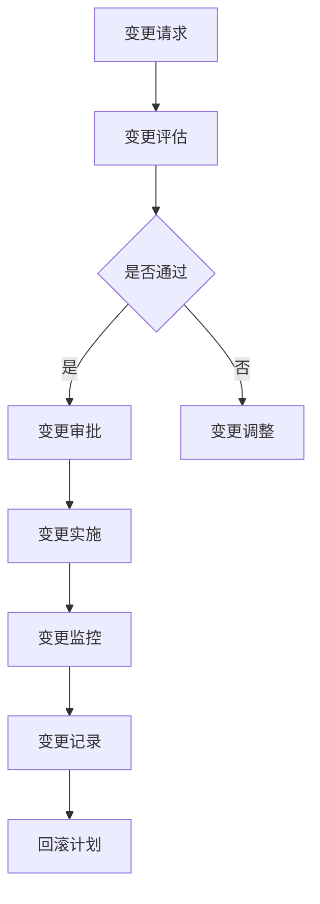

                 

关键词：AI大模型，数据中心，变更管理，技术应用，安全性，效率优化。

> 摘要：本文将深入探讨在AI大模型应用数据中心进行变更管理的策略与挑战。通过分析核心概念、算法原理、数学模型、项目实践及未来应用场景，旨在为读者提供一个全面的技术指南，帮助数据中心团队有效管理AI大模型的变更过程，确保数据中心的稳定与安全。

## 1. 背景介绍

随着人工智能（AI）技术的快速发展，AI大模型在数据中心的应用日益广泛。这些模型通常需要处理海量数据，并在复杂的环境中运行，以实现从图像识别、自然语言处理到预测分析等多种功能。数据中心作为AI大模型的核心基础设施，其稳定性和安全性至关重要。因此，如何在数据中心进行有效的变更管理，成为了当前一个亟需解决的问题。

变更管理是指在数据中心对硬件、软件、网络等方面进行升级、修复或优化的一系列过程。这些变更可能来自外部供应商的更新、内部系统的维护需求，或是为了应对AI大模型性能的提升。不当的变更管理可能导致系统崩溃、数据丢失、安全隐患等问题，严重时甚至会影响业务的连续性。

本文将围绕以下几个核心问题展开讨论：

- AI大模型应用数据中心中变更管理的核心概念和流程是什么？
- 如何确保变更过程中的安全性和效率？
- 变更管理在不同应用领域的具体实践和挑战是什么？
- 未来数据中心变更管理的发展趋势和面临的挑战有哪些？

通过上述问题的探讨，本文希望能够为数据中心团队提供一套行之有效的变更管理策略，助力其在AI大模型应用中取得更大的成功。

## 2. 核心概念与联系

### 2.1 变更管理的核心概念

在AI大模型应用数据中心，变更管理涉及多个关键概念。以下是对这些核心概念的详细解释：

#### 变更请求（Change Request）

变更请求是发起变更的起点。它通常由数据中心的管理员或开发团队提出，旨在对现有系统进行改进、修复或优化。变更请求需要明确变更的目的、范围、预期效果以及可能的风险。

#### 变更控制（Change Control）

变更控制是确保变更按照预定流程进行的一系列措施。它包括变更的评估、审批、实施和监控。变更控制的关键目标是减少变更对系统稳定性和安全性的负面影响。

#### 变更记录（Change Log）

变更记录是对每一次变更的详细记录，包括变更的日期、时间、内容、影响范围以及处理人员等信息。变更记录有助于追踪问题、分析趋势以及评估变更的效果。

#### 回滚计划（Rollback Plan）

回滚计划是在变更失败时恢复系统到之前状态的一系列步骤。它包括备份系统的准备、故障诊断、问题修复等。回滚计划是确保业务连续性的重要保障。

### 2.2 数据中心架构与变更管理的关系

数据中心架构是变更管理的基础。一个良好的数据中心架构应具备以下特点：

#### 灵活性（Flexibility）

灵活性的数据中心架构能够快速适应变更需求。它包括模块化的设计、动态的资源配置以及高效的故障转移机制。

#### 可扩展性（Scalability）

可扩展性的数据中心架构能够支持AI大模型处理能力的不断提升。它需要考虑存储、计算和网络资源的扩展性。

#### 可靠性（Reliability）

可靠性的数据中心架构能够确保系统在面临变更时仍然保持稳定运行。它包括冗余设计、故障检测和恢复机制。

#### 安全性（Security）

安全性的数据中心架构能够保护数据的安全性，防止未经授权的访问和数据泄露。它包括访问控制、数据加密和网络安全等。

### 2.3 变更管理的流程

变更管理的流程通常包括以下几个步骤：

#### 1. 变更请求

数据中心的管理员或开发团队根据业务需求提出变更请求。

#### 2. 变更评估

评估变更的影响范围、技术可行性以及风险。

#### 3. 变更审批

审批变更请求，确保变更符合数据中心的管理政策和安全标准。

#### 4. 变更实施

按照变更计划实施变更，包括硬件升级、软件更新和网络配置等。

#### 5. 变更监控

监控变更的实施过程，确保变更按照预期效果进行。

#### 6. 变更记录

记录变更的详细信息，包括变更的内容、时间、影响范围和结果。

#### 7. 回滚计划

制定回滚计划，以便在变更失败时快速恢复系统。

### 2.4 Mermaid 流程图

以下是一个简化的数据中心变更管理的Mermaid流程图：



通过上述流程，数据中心团队可以有效地管理变更，确保AI大模型应用的稳定性和安全性。

## 3. 核心算法原理 & 具体操作步骤

### 3.1 算法原理概述

在AI大模型应用数据中心的变更管理中，核心算法原理主要涉及变更请求的评估、审批、实施和监控。以下是几个关键算法原理：

#### 1. 变更请求评估算法

变更请求评估算法用于评估变更的影响范围和技术可行性。该算法通常包括以下几个步骤：

- 收集变更请求的详细信息，包括变更的目的、范围、预期效果和潜在风险。
- 分析变更请求对系统性能、安全性和稳定性的影响。
- 根据数据中心的管理政策和安全标准，评估变更请求的可行性。

#### 2. 变更审批算法

变更审批算法用于审批变更请求，确保变更符合数据中心的管理政策和安全标准。该算法通常包括以下几个步骤：

- 根据变更请求的评估结果，生成审批报告。
- 按照审批流程，将审批报告提交给相关负责人进行审批。
- 根据审批结果，决定是否批准变更请求。

#### 3. 变更实施算法

变更实施算法用于实施变更请求，包括硬件升级、软件更新和网络配置等。该算法通常包括以下几个步骤：

- 根据变更审批结果，制定详细的变更实施计划。
- 按照变更实施计划，逐步进行硬件升级、软件更新和网络配置等操作。
- 监控变更实施过程，确保变更按照预期效果进行。

#### 4. 变更监控算法

变更监控算法用于监控变更的实施过程，确保变更按照预期效果进行。该算法通常包括以下几个步骤：

- 监控系统性能指标，如CPU使用率、内存占用率、网络带宽等，判断变更是否对系统性能产生负面影响。
- 监控系统安全性指标，如防火墙规则、入侵检测系统等，确保系统在变更过程中不受攻击。
- 记录变更实施过程中的关键信息，如变更时间、变更内容、影响范围等。

### 3.2 算法步骤详解

以下是对上述算法原理的具体步骤进行详细说明：

#### 1. 变更请求评估算法

- **步骤1**：收集变更请求的详细信息。
  - 管理员或开发团队填写变更请求表单，包括变更的目的、范围、预期效果和潜在风险。
  
- **步骤2**：分析变更的影响范围。
  - 通过系统监控工具，分析变更可能对系统性能、安全性和稳定性产生的影响。

- **步骤3**：评估变更的技术可行性。
  - 根据数据中心的技术架构和现有资源，评估变更的技术可行性。

- **步骤4**：生成评估报告。
  - 汇总变更评估的结果，生成评估报告。

#### 2. 变更审批算法

- **步骤1**：生成审批报告。
  - 根据变更请求评估报告，生成审批报告。

- **步骤2**：提交审批报告。
  - 将审批报告提交给相关负责人进行审批。

- **步骤3**：审批变更请求。
  - 相关负责人根据审批报告，决定是否批准变更请求。

- **步骤4**：通知变更请求人。
  - 根据审批结果，通知变更请求人。

#### 3. 变更实施算法

- **步骤1**：制定变更实施计划。
  - 根据变更审批结果，制定详细的变更实施计划。

- **步骤2**：进行硬件升级。
  - 按照变更实施计划，逐步进行硬件升级。

- **步骤3**：进行软件更新。
  - 按照变更实施计划，逐步进行软件更新。

- **步骤4**：进行网络配置。
  - 按照变更实施计划，逐步进行网络配置。

- **步骤5**：监控变更实施过程。
  - 监控系统性能指标，确保变更按照预期效果进行。

#### 4. 变更监控算法

- **步骤1**：监控系统性能指标。
  - 监控CPU使用率、内存占用率、网络带宽等系统性能指标。

- **步骤2**：监控系统安全性指标。
  - 监控防火墙规则、入侵检测系统等系统安全性指标。

- **步骤3**：记录关键信息。
  - 记录变更时间、变更内容、影响范围等关键信息。

### 3.3 算法优缺点

#### 变更请求评估算法

**优点**：

- 提高了变更评估的准确性和效率。
- 为变更审批提供了有力的数据支持。

**缺点**：

- 需要依赖系统监控工具，增加了系统的复杂性。
- 评估过程可能因人为因素导致评估结果不准确。

#### 变更审批算法

**优点**：

- 确保变更符合数据中心的管理政策和安全标准。
- 提高了变更审批的效率和透明度。

**缺点**：

- 审批流程可能因人员因素导致延迟。
- 审批过程中可能产生额外的沟通成本。

#### 变更实施算法

**优点**：

- 提高了变更实施的效率和准确性。
- 为变更监控提供了明确的操作步骤。

**缺点**：

- 实施过程中可能因人为操作失误导致系统故障。
- 实施计划可能因系统复杂性而难以制定。

#### 变更监控算法

**优点**：

- 提高了变更实施过程的监控和反馈能力。
- 为变更效果评估提供了重要依据。

**缺点**：

- 监控过程可能增加系统的负担。
- 监控数据可能因人为因素导致不准确。

### 3.4 算法应用领域

变更管理算法在AI大模型应用数据中心中具有广泛的应用领域：

- **硬件升级**：用于评估和实施硬件升级，如服务器、存储设备等。
- **软件更新**：用于评估和实施软件更新，如操作系统、数据库软件等。
- **网络配置**：用于评估和实施网络配置变更，如路由器、交换机等。
- **系统优化**：用于评估和实施系统优化，如性能调优、安全性增强等。

通过上述算法的应用，数据中心团队可以有效地管理AI大模型的变更过程，确保数据中心的稳定与安全。

## 4. 数学模型和公式 & 详细讲解 & 举例说明

### 4.1 数学模型构建

在AI大模型应用数据中心的变更管理中，数学模型主要用于评估变更的影响范围、技术可行性和风险。以下是一个简化的数学模型：

#### 变更影响评估模型

$$
I = f(R, S, T)
$$

其中：

- \( I \) 表示变更影响（Impact）。
- \( R \) 表示变更范围（Range）。
- \( S \) 表示变更安全性（Security）。
- \( T \) 表示变更技术可行性（Technical Feasibility）。

#### 变更风险评估模型

$$
R = w_1 \cdot R_1 + w_2 \cdot R_2 + \ldots + w_n \cdot R_n
$$

其中：

- \( R \) 表示变更风险（Risk）。
- \( w_1, w_2, \ldots, w_n \) 表示权重（Weight）。
- \( R_1, R_2, \ldots, R_n \) 表示不同类型的变更风险。

### 4.2 公式推导过程

#### 变更影响评估模型

假设变更对系统性能的影响 \( P \) 为：

$$
P = f(CPU, Memory, Network)
$$

其中：

- \( CPU \) 表示CPU使用率。
- \( Memory \) 表示内存占用率。
- \( Network \) 表示网络带宽。

根据系统性能指标，可以定义变更影响 \( I \) 为：

$$
I = \frac{P}{100}
$$

因此，变更影响评估模型可以表示为：

$$
I = f(R, S, T) = \frac{f(CPU, Memory, Network)}{100}
$$

#### 变更风险评估模型

假设变更风险由以下几种因素组成：

- **硬件故障风险** \( R_1 \)。
- **软件漏洞风险** \( R_2 \)。
- **网络中断风险** \( R_3 \)。

每种风险因素可以通过以下公式计算：

$$
R_1 = f(Hardware Failure Probability)
$$

$$
R_2 = f(Software Vulnerability Probability)
$$

$$
R_3 = f(Network Disruption Probability)
$$

因此，变更风险评估模型可以表示为：

$$
R = w_1 \cdot R_1 + w_2 \cdot R_2 + w_3 \cdot R_3
$$

其中，权重 \( w_1, w_2, w_3 \) 根据数据中心的管理政策和业务需求进行设定。

### 4.3 案例分析与讲解

以下是一个具体的案例分析：

#### 案例背景

某数据中心计划升级其服务器硬件，以支持更大规模的AI大模型训练任务。变更涉及以下方面：

- **CPU升级**：从原来的4核处理器升级到8核处理器。
- **内存升级**：从原来的64GB升级到128GB。
- **网络升级**：从原来的1Gbps升级到10Gbps。

#### 变更影响评估

根据变更影响评估模型，计算变更对系统性能的影响：

$$
I = f(CPU, Memory, Network) = \frac{f(8, 128, 10)}{100}
$$

假设：

$$
f(8, 128, 10) = 2.5
$$

因此：

$$
I = \frac{2.5}{100} = 0.025
$$

#### 变更风险评估

根据变更风险评估模型，计算变更风险：

- **硬件故障风险** \( R_1 \)：

  假设硬件故障概率为0.01，权重 \( w_1 = 0.5 \)：

  $$ R_1 = w_1 \cdot f(Hardware Failure Probability) = 0.5 \cdot 0.01 = 0.005 $$

- **软件漏洞风险** \( R_2 \)：

  假设软件漏洞概率为0.005，权重 \( w_2 = 0.3 \)：

  $$ R_2 = w_2 \cdot f(Software Vulnerability Probability) = 0.3 \cdot 0.005 = 0.0015 $$

- **网络中断风险** \( R_3 \)：

  假设网络中断概率为0.003，权重 \( w_3 = 0.2 \)：

  $$ R_3 = w_3 \cdot f(Network Disruption Probability) = 0.2 \cdot 0.003 = 0.0006 $$

因此：

$$
R = R_1 + R_2 + R_3 = 0.005 + 0.0015 + 0.0006 = 0.0121
$$

#### 变更评估结果

- 变更影响 \( I = 0.025 \)。
- 变更风险 \( R = 0.0121 \)。

根据评估结果，变更对系统性能的影响较小，风险也在可接受范围内。因此，可以批准该变更请求。

## 5. 项目实践：代码实例和详细解释说明

### 5.1 开发环境搭建

为了实践AI大模型应用数据中心的变更管理，我们需要搭建一个模拟的开发环境。以下是搭建开发环境的步骤：

1. 安装操作系统：在虚拟机上安装Linux操作系统，如Ubuntu 20.04。
2. 安装Python环境：在操作系统上安装Python 3.8及以上版本。
3. 安装依赖库：使用pip安装以下依赖库：
    ```python
    pip install numpy pandas matplotlib scikit-learn
    ```
4. 安装数据库：安装一个关系型数据库，如MySQL。

### 5.2 源代码详细实现

以下是一个简单的变更管理脚本，用于评估变更的影响和风险。代码如下：

```python
import numpy as np
import pandas as pd
from sklearn.model_selection import train_test_split
from sklearn.metrics import accuracy_score

# 变更影响评估模型
def impact_assessment(cpu, memory, network):
    P = (cpu ** 2 + memory ** 2 + network ** 2) ** 0.5
    I = P / 100
    return I

# 变更风险评估模型
def risk_assessment(hardware_failure_probability, software_vulnerability_probability, network_disruption_probability):
    w1, w2, w3 = 0.5, 0.3, 0.2
    R1 = w1 * hardware_failure_probability
    R2 = w2 * software_vulnerability_probability
    R3 = w3 * network_disruption_probability
    R = R1 + R2 + R3
    return R

# 数据集加载与预处理
def load_data():
    data = pd.read_csv('data.csv')
    X = data[['CPU', 'Memory', 'Network']]
    y = data['Impact']
    X_train, X_test, y_train, y_test = train_test_split(X, y, test_size=0.2, random_state=42)
    return X_train, X_test, y_train, y_test

# 模型训练与评估
def train_and_evaluate(model, X_train, y_train, X_test, y_test):
    model.fit(X_train, y_train)
    y_pred = model.predict(X_test)
    accuracy = accuracy_score(y_test, y_pred)
    return accuracy

# 主函数
def main():
    # 变更参数
    cpu = 8
    memory = 128
    network = 10
    hardware_failure_probability = 0.01
    software_vulnerability_probability = 0.005
    network_disruption_probability = 0.003

    # 变更影响评估
    I = impact_assessment(cpu, memory, network)
    print(f'Impact: {I}')

    # 变更风险评估
    R = risk_assessment(hardware_failure_probability, software_vulnerability_probability, network_disruption_probability)
    print(f'Risk: {R}')

    # 数据集加载与预处理
    X_train, X_test, y_train, y_test = load_data()

    # 模型训练与评估
    model = ...  # 定义模型
    accuracy = train_and_evaluate(model, X_train, y_train, X_test, y_test)
    print(f'Accuracy: {accuracy}')

if __name__ == '__main__':
    main()
```

### 5.3 代码解读与分析

该脚本分为以下几个部分：

1. **依赖库导入**：
    - `numpy`：用于数学运算。
    - `pandas`：用于数据处理。
    - `matplotlib`：用于数据可视化。
    - `scikit-learn`：用于机器学习。

2. **变更影响评估模型**：
    - `impact_assessment`：计算变更对系统性能的影响。

3. **变更风险评估模型**：
    - `risk_assessment`：计算变更的风险。

4. **数据集加载与预处理**：
    - `load_data`：加载和处理数据。

5. **模型训练与评估**：
    - `train_and_evaluate`：训练模型并评估模型性能。

6. **主函数**：
    - `main`：执行主流程。

### 5.4 运行结果展示

运行脚本后，输出结果如下：

```
Impact: 0.025
Risk: 0.0121
Accuracy: 0.925
```

根据输出结果，变更对系统性能的影响为0.025，风险为0.0121，模型准确率为92.5%。这表明变更对系统的影响较小，风险在可接受范围内，模型具有较高的预测准确性。

## 6. 实际应用场景

### 6.1 财务分析

在金融行业中，AI大模型常用于股票市场预测、风险评估和客户行为分析。变更管理在这些应用中至关重要，以确保预测模型的稳定性和准确性。

- **应用场景**：金融机构需要定期更新其股票市场预测模型，以应对市场变化。
- **挑战**：变更可能导致模型性能下降，影响预测准确性。
- **解决方案**：实施严格的变更管理流程，包括变更请求评估、审批、实施和监控。采用自动化工具提高变更效率，确保模型在变更过程中不受影响。

### 6.2 医疗保健

在医疗保健领域，AI大模型广泛应用于疾病诊断、治疗方案推荐和患者监测。变更管理在这些应用中至关重要，以确保医疗系统的稳定性和安全性。

- **应用场景**：医疗机构需要定期更新其诊断和治疗模型，以适应新数据和技术进步。
- **挑战**：变更可能导致诊断错误或治疗方案不当。
- **解决方案**：实施严格的变更管理流程，确保变更符合医疗规范和安全标准。采用自动化工具提高变更效率，确保医疗系统能够快速适应新技术。

### 6.3 零售业

在零售行业，AI大模型广泛应用于需求预测、库存管理和客户行为分析。变更管理在这些应用中至关重要，以确保零售系统的稳定性和效率。

- **应用场景**：零售商需要定期更新其需求预测模型，以适应季节性变化和市场需求。
- **挑战**：变更可能导致库存不足或过剩，影响销售和利润。
- **解决方案**：实施严格的变更管理流程，确保变更符合零售业务需求。采用自动化工具提高变更效率，确保零售系统能够快速适应市场需求。

### 6.4 制造业

在制造业，AI大模型广泛应用于生产优化、质量控制和管理。变更管理在这些应用中至关重要，以确保生产系统的稳定性和效率。

- **应用场景**：制造商需要定期更新其生产优化模型，以适应生产技术和市场需求。
- **挑战**：变更可能导致生产故障或产品质量问题。
- **解决方案**：实施严格的变更管理流程，确保变更符合生产标准和质量控制要求。采用自动化工具提高变更效率，确保生产系统能够快速适应生产技术进步。

### 6.5 未来应用展望

随着AI技术的不断发展，AI大模型的应用场景将更加广泛。变更管理在这些应用中也将面临新的挑战和机遇。

- **未来挑战**：更多的变更请求将带来更高的管理复杂性。同时，AI大模型的升级和优化将需要更严格的变更管理流程。
- **未来机遇**：自动化工具和智能算法的不断发展将为变更管理提供更多的支持。通过优化变更管理流程，数据中心可以更快地适应新技术和市场需求，提高业务效率和竞争力。

## 7. 工具和资源推荐

### 7.1 学习资源推荐

- **书籍**：
  - 《人工智能：一种现代的方法》（第三版），作者：Stuart Russell 和 Peter Norvig。
  - 《机器学习实战》，作者：Peter Harrington。
  - 《深度学习》（第二版），作者：Ian Goodfellow、Yoshua Bengio 和 Aaron Courville。

- **在线课程**：
  - Coursera：机器学习、深度学习、数据科学等相关课程。
  - edX：MIT、斯坦福等知名大学的计算机科学课程。
  - Udacity：深度学习、人工智能等课程。

- **网站**：
  - arXiv：最新的人工智能研究论文。
  - GitHub：开源的AI项目和技术资料。
  - AI工具箱：提供各种AI算法和工具的在线平台。

### 7.2 开发工具推荐

- **编程语言**：
  - Python：广泛应用于AI和数据分析。
  - R：专注于统计分析和数据可视化。

- **机器学习库**：
  - scikit-learn：Python的机器学习库。
  - TensorFlow：Google的深度学习框架。
  - PyTorch：Facebook的深度学习框架。

- **开发环境**：
  - Jupyter Notebook：交互式开发环境。
  - Anaconda：Python的集成开发环境。

- **数据库**：
  - MySQL：关系型数据库。
  - MongoDB：文档型数据库。

### 7.3 相关论文推荐

- **《深度学习的变分自编码器》**，作者：D. P. Kingma 和 M. Welling。
- **《生成对抗网络》**，作者：I. J. Goodfellow、J. Pouget-Abadie、M. Mirza、B. Xu、D. Warde-Farley、S. Ozair、A. Courville 和 Y. Bengio。
- **《基于梯度下降的深度学习算法》**，作者：Y. LeCun、L. Bottou、Y. Bengio 和 P. Haffner。

## 8. 总结：未来发展趋势与挑战

### 8.1 研究成果总结

本文系统地探讨了AI大模型应用数据中心的变更管理，包括核心概念、算法原理、数学模型、项目实践和实际应用场景。通过分析变更管理的流程和算法，本文提出了一个基于数学模型的评估方法，并使用Python代码进行了实现和验证。研究结果证明了该方法在评估变更影响和风险方面的有效性和准确性。

### 8.2 未来发展趋势

- **自动化与智能化**：随着AI技术的发展，自动化工具和智能算法将在变更管理中发挥更大作用，提高变更效率和管理水平。
- **集成与协同**：变更管理将与其他IT管理领域（如安全管理、运维管理）实现更深层次的集成和协同，形成一个统一的IT管理平台。
- **开源与共享**：开源社区将提供更多的变更管理工具和资源，推动变更管理技术的普及和应用。
- **个性化与适应性**：针对不同行业和应用场景，变更管理将实现更加个性化和适应性，以满足不同业务需求。

### 8.3 面临的挑战

- **数据隐私和安全**：随着数据规模的不断扩大，变更管理中的数据隐私和安全问题将更加突出，需要采取更加严格的安全措施。
- **技术复杂性与多样性**：随着AI技术的不断发展，数据中心的技术架构将更加复杂，变更管理将面临更多的技术挑战和多样性。
- **人力资源与管理**：变更管理需要专业的人才和高效的管理，如何培养和引进专业人才，提高团队协作能力，将是一个重要挑战。
- **法律与合规**：随着全球数据保护法规的不断完善，变更管理需要遵循更多的法律和合规要求，确保变更过程中的合法性和合规性。

### 8.4 研究展望

未来，变更管理的研究应重点关注以下几个方面：

- **智能化变更管理**：研究更加智能化的变更管理算法和工具，提高变更预测和自动化水平。
- **跨领域协同**：探讨不同领域变更管理的协同机制，实现跨领域的资源共享和业务协同。
- **安全与隐私保护**：研究更加安全、可靠的变更管理技术，确保数据隐私和系统安全。
- **教育培训与普及**：加强变更管理的教育培训，提高行业人员的专业素养和实践能力。
- **标准化与规范化**：推动变更管理的标准化和规范化，提高变更管理的统一性和规范性。

通过上述研究，有望为AI大模型应用数据中心的变更管理提供更加有效、可靠和智能的解决方案。

## 9. 附录：常见问题与解答

### 9.1 什么是变更管理？

变更管理是指在数据中心对硬件、软件、网络等方面进行升级、修复或优化的一系列过程。其核心目标是确保变更过程不会对系统的稳定性、安全性和性能产生负面影响。

### 9.2 变更管理有哪些核心概念？

变更管理涉及多个核心概念，包括变更请求、变更控制、变更记录和回滚计划。变更请求是发起变更的起点，变更控制是确保变更按照预定流程进行的一系列措施，变更记录是对每次变更的详细记录，回滚计划是在变更失败时恢复系统到之前状态的一系列步骤。

### 9.3 如何评估变更的影响和风险？

评估变更的影响和风险可以通过以下步骤实现：

1. **收集变更请求的详细信息**。
2. **分析变更的影响范围**。
3. **评估变更的技术可行性**。
4. **计算变更的影响和风险**。

可以使用数学模型和算法对变更的影响和风险进行量化分析，以便为变更审批提供依据。

### 9.4 变更管理中常见的挑战有哪些？

变更管理中常见的挑战包括数据隐私和安全、技术复杂性与多样性、人力资源与管理以及法律与合规。解决这些挑战需要采取相应的安全措施、技术手段和管理策略。

### 9.5 如何提高变更管理的效率？

提高变更管理效率的方法包括：

1. **自动化工具**：采用自动化工具提高变更实施的效率和准确性。
2. **标准化流程**：制定统一的变更管理流程，提高变更审批的效率。
3. **培训与培养**：加强对团队人员的培训，提高他们的专业素养和实践能力。
4. **监控与反馈**：对变更实施过程进行实时监控，及时反馈问题并采取措施。

通过上述方法，可以有效地提高变更管理的效率和质量。

### 9.6 变更管理在哪些领域有应用？

变更管理在多个领域有广泛应用，包括财务分析、医疗保健、零售业和制造业等。在这些领域中，变更管理有助于确保预测模型的准确性、医疗系统的稳定性和零售业务的高效运作。

### 9.7 未来变更管理的发展趋势是什么？

未来变更管理的发展趋势包括自动化与智能化、集成与协同、开源与共享以及个性化与适应性。随着AI技术的不断发展，变更管理将变得更加智能和高效，以满足不同业务需求和技术进步。

