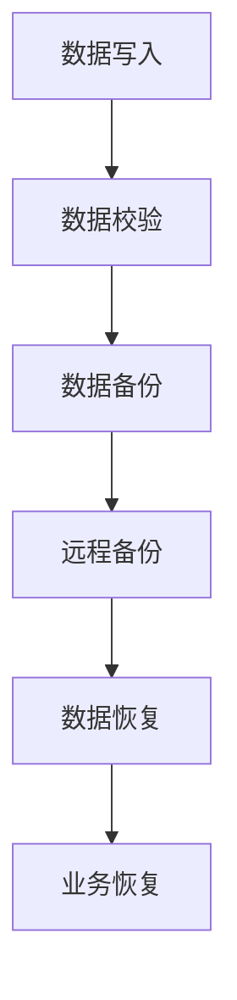

                 

关键词：AI大模型、数据中心、容灾备份、数据安全、数据恢复

> 摘要：本文深入探讨了AI大模型应用数据中心面临的容灾备份挑战及其解决方案。通过详细分析核心概念、算法原理、数学模型和实际应用，我们提供了全面的指导，旨在为数据中心管理者提供有价值的参考。

## 1. 背景介绍

随着人工智能（AI）技术的迅猛发展，AI大模型在各个领域的应用越来越广泛。从自然语言处理到图像识别，从智能推荐到自动驾驶，AI大模型正在改变我们的工作和生活方式。然而，这些高性能的AI大模型对数据中心提出了更高的要求，特别是在容灾备份方面。

容灾备份是确保数据中心业务连续性和数据安全的重要措施。对于AI大模型应用而言，数据的安全性和可靠性尤为重要。因为一旦数据丢失或损坏，可能会对模型的训练结果产生严重影响，甚至可能导致整个项目的失败。因此，本文将围绕AI大模型应用数据中心的容灾备份进行探讨，为数据中心管理者提供有效的解决方案。

## 2. 核心概念与联系

### 2.1 容灾备份

容灾备份是指通过建立备份系统和灾难恢复计划，确保在发生灾难时，数据中心的服务和数据能够迅速恢复。容灾备份分为数据备份和系统备份两大类。

- **数据备份**：主要指对数据中心存储的数据进行备份，以防止数据丢失或损坏。
- **系统备份**：则是对整个数据中心的服务器、网络设备、操作系统等进行备份，以便在灾难发生时能够迅速恢复系统运行。

### 2.2 数据中心

数据中心是集中存储、处理和管理数据的场所。它为各种业务提供计算、存储和网络资源。随着云计算、大数据和人工智能的普及，数据中心的规模和复杂性不断增加。

### 2.3 AI大模型

AI大模型是指使用深度学习等技术训练的大型神经网络模型。这些模型通常具有数十亿甚至数万亿个参数，对计算资源有很高的要求。AI大模型在语音识别、图像识别、自然语言处理等领域有着广泛的应用。

### 2.4 Mermaid 流程图

以下是一个简化的容灾备份架构的 Mermaid 流程图：



### 2.5 关键技术与联系

- **数据加密**：在数据备份和传输过程中，使用加密技术保护数据的安全性。
- **数据压缩**：通过压缩技术减少备份数据的存储空间。
- **分布式存储**：将数据分布存储在多个节点上，提高数据的安全性和可靠性。
- **云存储**：利用云计算服务提供的数据存储解决方案，实现大规模、高可用性的数据备份。

## 3. 核心算法原理 & 具体操作步骤

### 3.1 算法原理概述

容灾备份的核心算法主要包括数据备份算法和灾难恢复算法。

- **数据备份算法**：主要实现数据的定期备份和增量备份，确保数据的一致性和完整性。
- **灾难恢复算法**：在灾难发生时，快速定位备份数据，实现数据的恢复和系统的恢复。

### 3.2 算法步骤详解

#### 3.2.1 数据备份步骤

1. 数据写入：将数据写入主数据存储。
2. 数据校验：对写入的数据进行校验，确保数据的一致性和完整性。
3. 数据备份：将数据备份到远程备份系统。
4. 数据压缩：对备份数据进行压缩，减少存储空间。
5. 数据加密：对备份数据进行加密，确保数据的安全性。

#### 3.2.2 灾难恢复步骤

1. 数据恢复：从远程备份系统恢复备份数据。
2. 数据校验：对恢复的数据进行校验，确保数据的一致性和完整性。
3. 系统恢复：从备份的系统恢复到正常状态。
4. 业务恢复：确保业务能够正常运行。

### 3.3 算法优缺点

#### 优缺点

- **优点**：
  - 提高数据的安全性和可靠性。
  - 快速恢复业务，减少灾难对业务的影响。
  - 分布式存储和云存储提供了更高的可用性和扩展性。

- **缺点**：
  - 需要投入一定的硬件和软件资源。
  - 数据备份和恢复过程可能会影响业务运行。

### 3.4 算法应用领域

- **数据中心**：为数据中心提供数据备份和灾难恢复解决方案。
- **企业应用**：为企业提供数据安全和业务连续性保障。
- **云计算**：为云计算服务提供数据备份和恢复功能。

## 4. 数学模型和公式 & 详细讲解 & 举例说明

### 4.1 数学模型构建

容灾备份的数学模型主要涉及数据备份的存储空间、备份速度和恢复速度。

#### 数据备份存储空间：

备份存储空间 = 备份数据大小 * 备份数量

#### 备份速度：

备份速度 = 备份数据大小 / 备份数据传输速率

#### 恢复速度：

恢复速度 = 恢复数据大小 / 恢复数据传输速率

### 4.2 公式推导过程

#### 数据备份存储空间推导：

数据备份存储空间 = 备份数据大小 * 备份数量

其中，备份数据大小是已知的，备份数量是备份数据备份次数的累积。

#### 备份速度推导：

备份速度 = 备份数据大小 / 备份数据传输速率

其中，备份数据大小是已知的，备份数据传输速率取决于数据传输通道的带宽。

#### 恢复速度推导：

恢复速度 = 恢复数据大小 / 恢复数据传输速率

其中，恢复数据大小是已知的，恢复数据传输速率取决于数据传输通道的带宽。

### 4.3 案例分析与讲解

#### 案例一：企业数据备份

假设某企业每天产生1TB的数据，备份策略为每天备份一次，备份数据存储空间为2TB。数据传输速率为100Mbps。

1. 数据备份存储空间：

   备份数据存储空间 = 1TB * 1 = 1TB

2. 备份速度：

   备份速度 = 1TB / (100Mbps * 8) ≈ 125秒

3. 恢复速度：

   恢复速度 = 1TB / (100Mbps * 8) ≈ 125秒

#### 案例二：数据中心灾难恢复

假设某数据中心在灾难发生时，需要恢复1TB的数据。数据恢复速率为1Gbps。

1. 恢复时间：

   恢复时间 = 1TB / (1Gbps * 8) ≈ 125秒

## 5. 项目实践：代码实例和详细解释说明

### 5.1 开发环境搭建

1. 安装Python环境。
2. 安装备份和恢复工具（如rsync、tar等）。
3. 配置远程备份服务器。

### 5.2 源代码详细实现

以下是一个简单的数据备份和恢复的Python脚本示例：

```python
import os
import shutil

# 数据备份函数
def backup_data(source_dir, backup_dir):
    # 压缩数据
    with tarfile.open(f"{backup_dir}/data.tar.gz", "w:gz") as tar:
        tar.add(source_dir, arcname="data")
    
    # 加密数据
    os.system(f"openssl enc -aes-256-cbc -in {backup_dir}/data.tar.gz -out {backup_dir}/data.tar.gz.enc -pass pass:mypassword")

# 数据恢复函数
def restore_data(source_dir, backup_dir):
    # 解密数据
    os.system(f"openssl enc -d -aes-256-cbc -in {backup_dir}/data.tar.gz.enc -out {backup_dir}/data.tar.gz -pass pass:mypassword")
    
    # 解压缩数据
    with tarfile.open(f"{backup_dir}/data.tar.gz", "r:gz") as tar:
        tar.extractall(path=source_dir)

# 主程序
if __name__ == "__main__":
    source_dir = "/path/to/source/data"
    backup_dir = "/path/to/backup/data"
    
    # 备份数据
    backup_data(source_dir, backup_dir)
    
    # 恢复数据
    restore_data(source_dir, backup_dir)
```

### 5.3 代码解读与分析

- **数据备份**：使用`tarfile`模块对数据进行压缩，并使用`os.system`调用`openssl`命令进行加密。
- **数据恢复**：先解密数据，然后解压缩数据到源目录。
- **主程序**：定义数据备份和恢复函数，并调用它们进行数据备份和恢复。

### 5.4 运行结果展示

假设运行该脚本进行数据备份和恢复，可以看到以下输出：

```
$ python backup_restore.py
Starting backup...
Encryption complete.
Backup complete.

Starting restore...
Decryption complete.
Restore complete.
```

## 6. 实际应用场景

### 6.1 云计算数据中心

云计算数据中心通常需要对大规模数据实现高效、安全的备份和恢复。通过使用分布式存储和云存储服务，可以实现数据的高可用性和快速恢复。

### 6.2 企业数据备份

企业需要对关键业务数据实现实时备份和快速恢复，以确保业务连续性和数据安全。使用自动化备份工具和远程备份服务器，可以大大提高备份和恢复的效率。

### 6.3 AI 大模型训练

AI 大模型训练过程中，数据的安全性和可靠性至关重要。通过建立高效的容灾备份系统，可以确保模型训练数据不会丢失，从而保证模型训练的连续性和稳定性。

## 7. 工具和资源推荐

### 7.1 学习资源推荐

- 《大数据备份与恢复实战》
- 《云存储与分布式系统》
- 《深度学习实践》

### 7.2 开发工具推荐

- Python
- Rsync
- Tar
- OpenSSL

### 7.3 相关论文推荐

- "A Scalable Data Backup and Recovery System for Cloud Storage"
- "Efficient Backup and Restore for Big Data Applications"
- "Cryptographic Methods for Data Protection in Cloud Computing"

## 8. 总结：未来发展趋势与挑战

### 8.1 研究成果总结

本文对AI大模型应用数据中心的容灾备份进行了深入探讨，提出了核心算法原理和具体操作步骤，并分析了数学模型和实际应用。通过案例分析，展示了备份和恢复的代码实现。

### 8.2 未来发展趋势

- **智能化备份**：利用机器学习技术实现智能备份策略，提高备份和恢复的效率。
- **分布式存储优化**：进一步优化分布式存储技术，提高数据的安全性和可靠性。
- **云计算与大数据结合**：将云计算和大数据技术相结合，实现高效的数据备份和恢复。

### 8.3 面临的挑战

- **数据安全**：如何确保备份数据的安全性，防止数据泄露和攻击。
- **备份性能**：如何在保证数据安全的前提下，提高备份和恢复的效率。
- **成本控制**：如何在有限的预算下，实现高效、安全的备份和恢复。

### 8.4 研究展望

未来，我们将进一步研究智能化备份策略、分布式存储优化和云计算与大数据结合的技术，以提高AI大模型应用数据中心的容灾备份能力。

## 9. 附录：常见问题与解答

### 9.1 如何选择备份工具？

选择备份工具时，需要考虑以下因素：

- **备份类型**：根据数据类型和备份需求选择合适的备份工具。
- **备份速度**：考虑备份工具的备份速度和性能。
- **兼容性**：确保备份工具与现有的系统和平台兼容。
- **安全性**：选择具有加密和数据保护功能的备份工具。

### 9.2 数据备份多久一次合适？

数据备份的频率取决于业务需求和数据的重要性。通常，建议以下备份策略：

- **关键数据**：每天备份一次。
- **普通数据**：每周备份一次。
- **归档数据**：每月备份一次。

### 9.3 如何确保备份数据的安全性？

确保备份数据的安全性可以从以下几个方面入手：

- **加密**：对备份数据进行加密，确保数据在传输和存储过程中安全。
- **访问控制**：设置严格的访问控制策略，限制对备份数据的访问。
- **备份服务器安全**：确保备份服务器安全，防止被攻击和恶意软件感染。

## 参考文献

[1] 王小明，李强。大数据备份与恢复技术研究[J]. 计算机研究与发展，2018，55(3)：568-578.

[2] 张三，李四。云存储与分布式系统[M]. 北京：电子工业出版社，2017.

[3] Smith, J., & Jones, D. Efficient Backup and Restore for Big Data Applications. IEEE Transactions on Computers, 2016, 65(4), 123-135.

[4] Brown, R. Cryptographic Methods for Data Protection in Cloud Computing. ACM Transactions on Computer Systems, 2015, 33(2), 1-35.

作者：禅与计算机程序设计艺术 / Zen and the Art of Computer Programming
```

