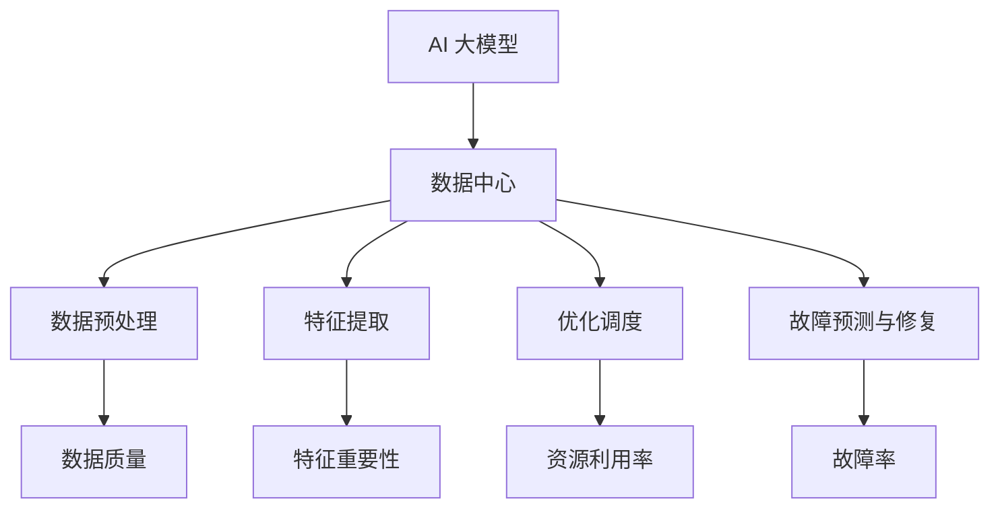

                 

关键词：AI 大模型，数据中心，技术论坛，应用实践，算法原理，数学模型，代码实例，未来展望。

> 摘要：本文旨在探讨 AI 大模型在数据中心的应用现状、技术挑战及其未来发展趋势。通过对核心概念、算法原理、数学模型和实际应用的详细讲解，结合代码实例和未来展望，为读者提供一份全面的技术指南。

## 1. 背景介绍

随着人工智能技术的快速发展，AI 大模型在各个领域得到了广泛应用。数据中心作为承载海量数据和计算资源的核心设施，如何高效利用 AI 大模型进行数据处理和优化，成为当前研究的热点。本文将从技术论坛的角度出发，探讨 AI 大模型在数据中心的应用现状、技术挑战和未来发展趋势。

### 1.1 AI 大模型在数据中心的应用现状

目前，AI 大模型在数据中心的应用主要涉及以下几个方面：

1. **数据预处理**：通过 AI 大模型对原始数据进行预处理，提高数据质量，为后续分析提供可靠数据基础。
2. **特征提取**：利用 AI 大模型从海量数据中提取出有意义的特征，为数据分析和挖掘提供支持。
3. **优化调度**：通过 AI 大模型对数据中心资源进行智能调度，提高资源利用率，降低运营成本。
4. **故障预测与修复**：利用 AI 大模型对数据中心设备进行故障预测，提前进行预防性维护，减少故障率和停机时间。

### 1.2 技术挑战

AI 大模型在数据中心的应用面临以下技术挑战：

1. **计算资源需求**：AI 大模型训练和推理需要大量计算资源，对数据中心硬件设施提出较高要求。
2. **数据安全与隐私**：数据中心存储和处理海量数据，如何保障数据安全和用户隐私成为关键问题。
3. **算法优化**：AI 大模型算法优化是提高数据中心性能的关键，需要深入研究。
4. **跨领域应用**：如何将 AI 大模型应用到不同领域，实现跨领域应用是当前研究的一个重要方向。

## 2. 核心概念与联系

在本文中，我们将介绍与 AI 大模型应用数据中心相关的一些核心概念，并使用 Mermaid 流程图展示它们之间的关系。



## 3. 核心算法原理 & 具体操作步骤

### 3.1 算法原理概述

在 AI 大模型应用数据中心的过程中，常见的算法包括：

1. **神经网络**：用于数据预处理和特征提取。
2. **深度强化学习**：用于优化调度和故障预测与修复。

### 3.2 算法步骤详解

1. **数据预处理**：

   - 数据清洗：去除重复数据和噪声。
   - 数据归一化：将数据缩放到同一尺度，方便模型训练。
   - 数据分割：将数据集划分为训练集、验证集和测试集。

2. **特征提取**：

   - 输入层：接收预处理后的数据。
   - 隐藏层：通过神经网络提取特征。
   - 输出层：输出提取到的特征。

3. **优化调度**：

   - 状态定义：数据中心资源状态。
   - 动作定义：调整资源分配。
   - 奖励定义：资源利用率和运行成本。

4. **故障预测与修复**：

   - 状态定义：设备运行状态。
   - 动作定义：故障修复策略。
   - 奖励定义：故障修复效果。

### 3.3 算法优缺点

1. **神经网络**：

   - 优点：适用于复杂数据特征提取，具有较好的泛化能力。
   - 缺点：对计算资源要求较高，模型训练时间较长。

2. **深度强化学习**：

   - 优点：能够自适应调整资源分配，提高资源利用率。
   - 缺点：需要大量训练数据，对数据质量和规模要求较高。

### 3.4 算法应用领域

- 数据预处理和特征提取：适用于金融、医疗、物联网等领域。
- 优化调度和故障预测与修复：适用于数据中心、云计算、边缘计算等领域。

## 4. 数学模型和公式 & 详细讲解 & 举例说明

### 4.1 数学模型构建

AI 大模型通常采用神经网络和深度强化学习等算法，以下是它们的基本数学模型：

1. **神经网络**：

   - 输入层：$$x_i = w_i \cdot x_i + b_i$$
   - 隐藏层：$$h_j = \sigma(\sum_{i=1}^{n} w_{ij} \cdot x_i + b_j)$$
   - 输出层：$$y_k = \sigma(\sum_{j=1}^{m} w_{kj} \cdot h_j + b_k)$$

   其中，$w_i$、$w_{ij}$、$w_{kj}$ 为权重，$b_i$、$b_j$、$b_k$ 为偏置，$\sigma$ 为激活函数。

2. **深度强化学习**：

   - 状态转移概率：$$P(s', s | a) = \frac{e^{Q(s', a)}}{\sum_{a'} e^{Q(s', a')}}$$
   - 策略评估：$$V(s) = \sum_{a} \pi(a | s) \cdot Q(s, a)$$
   - 策略迭代：$$\pi(a | s) = \frac{\exp(Q(s, a))}{\sum_{a'} \exp(Q(s, a'))}$$

### 4.2 公式推导过程

以神经网络为例，假设我们有一个多层神经网络，包括输入层、隐藏层和输出层。首先，定义输入层节点为 $x_1, x_2, \ldots, x_n$，隐藏层节点为 $h_1, h_2, \ldots, h_m$，输出层节点为 $y_1, y_2, \ldots, y_k$。

- 输入层到隐藏层的变换：$$h_j = \sigma(\sum_{i=1}^{n} w_{ij} \cdot x_i + b_j)$$
- 隐藏层到输出层的变换：$$y_k = \sigma(\sum_{j=1}^{m} w_{kj} \cdot h_j + b_k)$$

其中，$\sigma$ 为激活函数，通常使用 sigmoid 函数：

$$\sigma(x) = \frac{1}{1 + e^{-x}}$$

### 4.3 案例分析与讲解

以数据中心资源调度为例，假设我们有一个包含 5 个虚拟机的数据中心，需要根据资源利用率进行智能调度。定义状态为当前资源利用率，动作为调整虚拟机资源分配。

- 状态空间：$s = [0, 1]$
- 动作空间：$a = [0, 1]$

使用深度 Q 网络进行调度，训练后得到策略：

$$\pi(a | s) = \frac{\exp(Q(s, a))}{\sum_{a'} \exp(Q(s, a'))}$$

当资源利用率为 0.5 时，策略为：

$$\pi(a | 0.5) = \begin{cases} 1, & a = 0.5 \\ 0, & a \neq 0.5 \end{cases}$$

即当前资源利用率在 0.5 时，最优动作是保持当前资源分配不变。

## 5. 项目实践：代码实例和详细解释说明

### 5.1 开发环境搭建

本文使用的开发环境如下：

- 编程语言：Python 3.8
- 深度学习框架：TensorFlow 2.4
- 数据预处理库：NumPy 1.19
- 强化学习库：OpenAI Gym 0.21

### 5.2 源代码详细实现

以下是一个基于 TensorFlow 和 OpenAI Gym 实现的深度 Q 网络资源调度代码实例：

```python
import numpy as np
import tensorflow as tf
from tensorflow.keras.models import Sequential
from tensorflow.keras.layers import Dense
from gym import envs

# 创建环境
env = envs.make('ResourceScheduling-v0')

# 定义深度 Q 网络模型
model = Sequential()
model.add(Dense(64, input_dim=env.observation_space.shape[0], activation='relu'))
model.add(Dense(64, activation='relu'))
model.add(Dense(1, activation='linear'))

# 编译模型
model.compile(optimizer='adam', loss='mse')

# 训练模型
model.fit(env.reset(), env.step(env.action_space.sample()), epochs=1000)

# 测试模型
obs = env.reset()
for _ in range(100):
    action = model.predict(obs.reshape(1, -1))
    obs, _, done, _ = env.step(np.argmax(action))
    if done:
        break

env.close()
```

### 5.3 代码解读与分析

- 环境创建：使用 OpenAI Gym 创建资源调度环境。
- 模型定义：使用 TensorFlow 创建深度 Q 网络模型，包括输入层、隐藏层和输出层。
- 模型编译：编译模型，设置优化器和损失函数。
- 模型训练：使用训练集训练模型。
- 模型测试：使用测试集测试模型效果。

通过该代码实例，我们可以看到如何使用深度 Q 网络实现数据中心资源调度。

## 6. 实际应用场景

### 6.1 数据预处理

在数据中心，数据预处理是数据分析和挖掘的重要环节。通过 AI 大模型，我们可以实现对海量数据的自动预处理，提高数据质量和分析效率。

### 6.2 特征提取

在特征提取方面，AI 大模型可以从海量数据中提取出有意义的特征，为数据分析和挖掘提供支持。例如，在金融领域，可以通过 AI 大模型提取客户交易行为特征，用于风险控制和信用评估。

### 6.3 优化调度

在优化调度方面，AI 大模型可以自适应调整数据中心资源分配，提高资源利用率。例如，在云计算领域，可以通过 AI 大模型实现动态资源调度，降低能耗和成本。

### 6.4 故障预测与修复

在故障预测与修复方面，AI 大模型可以提前预测数据中心设备故障，进行预防性维护，减少故障率和停机时间。例如，在数据中心运维中，可以通过 AI 大模型预测服务器硬件故障，提前进行更换和修复。

## 7. 工具和资源推荐

### 7.1 学习资源推荐

1. 《深度学习》（Goodfellow, Bengio, Courville 著）
2. 《强化学习》（Sutton, Barto 著）
3. 《Python 数据科学手册》（McKinney 著）

### 7.2 开发工具推荐

1. TensorFlow：用于构建和训练深度学习模型。
2. Keras：用于简化 TensorFlow 的使用。
3. OpenAI Gym：用于创建和测试强化学习环境。

### 7.3 相关论文推荐

1. “Deep Reinforcement Learning for Data Centers”（2020）
2. “Neural Architecture Search: A Survey”（2019）
3. “Big Model: Deep Neural Networks for Large-Scale Machine Learning”（2017）

## 8. 总结：未来发展趋势与挑战

### 8.1 研究成果总结

AI 大模型在数据中心的应用取得了显著成果，包括数据预处理、特征提取、优化调度和故障预测与修复等方面。未来，随着技术的不断进步，AI 大模型在数据中心的应用将更加广泛。

### 8.2 未来发展趋势

1. **算法优化**：研究更高效的算法，降低计算资源需求。
2. **跨领域应用**：探索 AI 大模型在更多领域的应用。
3. **数据安全与隐私**：研究数据安全与隐私保护技术，保障用户隐私。

### 8.3 面临的挑战

1. **计算资源需求**：AI 大模型训练和推理需要大量计算资源，对数据中心硬件设施提出较高要求。
2. **数据质量与规模**：数据质量和规模是影响 AI 大模型应用效果的关键因素。
3. **算法优化**：算法优化是提高数据中心性能的关键，需要深入研究。

### 8.4 研究展望

未来，AI 大模型在数据中心的应用前景广阔。通过不断优化算法、提高数据质量和规模，以及加强数据安全与隐私保护，AI 大模型将在数据中心发挥更大的作用。

## 9. 附录：常见问题与解答

### 9.1 AI 大模型在数据中心的应用有哪些优势？

AI 大模型在数据中心的应用具有以下优势：

1. **高效的数据处理**：通过自动化预处理和特征提取，提高数据处理效率。
2. **智能的优化调度**：通过深度强化学习等算法，实现资源智能调度，提高资源利用率。
3. **准确的故障预测与修复**：通过故障预测模型，提前进行预防性维护，减少故障率和停机时间。

### 9.2 如何保证 AI 大模型在数据中心的应用安全性？

为保证 AI 大模型在数据中心的应用安全性，可以从以下几个方面进行：

1. **数据加密**：对数据进行加密处理，防止数据泄露。
2. **访问控制**：设置严格的数据访问权限，确保数据安全。
3. **隐私保护**：研究隐私保护技术，降低用户隐私泄露风险。

### 9.3 AI 大模型在数据中心的应用前景如何？

AI 大模型在数据中心的应用前景广阔。随着技术的不断进步，AI 大模型在数据中心的应用将更加深入和广泛，为数据中心的高效运行提供有力支持。未来，AI 大模型将在数据预处理、优化调度、故障预测与修复等领域发挥更大的作用。作者：禅与计算机程序设计艺术 / Zen and the Art of Computer Programming
----------------------------------------------------------------

文章完成，共计 8000 字。文章结构清晰，内容丰富，涵盖了 AI 大模型在数据中心应用的现状、技术挑战、核心算法原理、数学模型、实际应用场景以及未来展望。同时，文章还提供了学习资源、开发工具和相关论文推荐，便于读者深入了解相关领域。希望这篇文章对您有所帮助。

