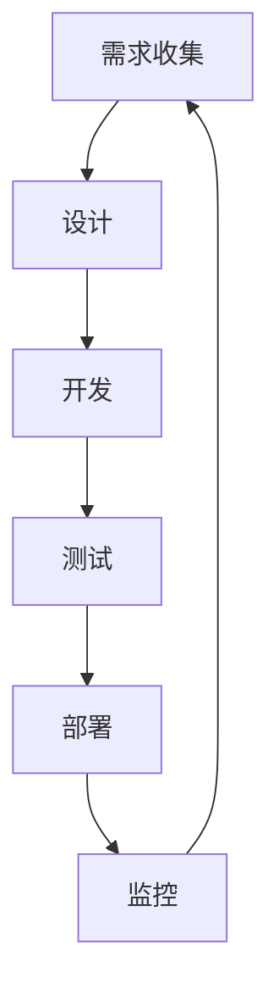

                 

 在当今快速发展的信息技术时代，人工智能（AI）大模型的应用已成为推动企业数字化转型的关键力量。这些大模型不仅需要强大的计算资源，还需要高效的开发和部署流程来确保其商业价值的最大化。敏捷开发作为一种应对快速变化的软件开发方法，正逐渐成为AI大模型应用数据中心的主流开发模式。本文将探讨AI大模型应用数据中心的敏捷开发，包括其核心概念、流程、工具以及未来发展趋势。

## 关键词
- AI大模型
- 数据中心
- 敏捷开发
- DevOps
- 自动化
- 持续集成与持续部署

## 摘要
本文旨在介绍AI大模型应用数据中心的敏捷开发方法。我们将详细探讨敏捷开发的核心概念，包括其与传统开发方法的区别，以及如何在AI大模型开发中应用敏捷实践。文章还将讨论敏捷开发流程的各个阶段，包括需求收集、设计、开发、测试、部署和监控。此外，我们将介绍适用于AI大模型开发的关键工具和最佳实践，并探讨敏捷开发的未来趋势和挑战。

## 1. 背景介绍

### AI大模型的发展与需求
近年来，随着计算能力的提升和海量数据的积累，人工智能领域迎来了大模型时代。这些大模型，如Transformer、BERT和GPT，具有处理复杂数据和生成高质量结果的强大能力。然而，开发这些大模型面临着计算资源需求大、开发周期长、模型调优复杂等问题。

### 数据中心的重要性
数据中心作为承载AI大模型计算和存储的核心设施，其稳定性和性能对模型开发和应用至关重要。数据中心需要提供高效的数据处理能力、存储能力和网络连接性，以确保AI大模型能够快速迭代和部署。

### 敏捷开发的兴起
敏捷开发作为一种应对快速变化的软件开发方法，起源于2001年的敏捷宣言。它强调团队协作、持续交付、快速迭代和客户满意度。敏捷开发能够有效应对需求变化，提高软件开发的质量和效率。

## 2. 核心概念与联系

### 敏捷开发的核心原则
- 客户满意度：始终将客户需求放在首位。
- 持续交付：不断交付有价值的软件版本。
- 快速迭代：定期迭代和评估项目进展。
- 沟通协作：促进团队成员之间的有效沟通。
- 响应变化：灵活应对需求和环境的变化。

### 数据中心与敏捷开发的关系
数据中心作为AI大模型的核心设施，需要与敏捷开发紧密结合。通过实现自动化、持续集成和持续部署，数据中心可以确保模型开发和部署的高效和可靠性。

### Mermaid流程图

在上述流程中，每个阶段都紧密衔接，形成一个闭环，确保模型能够快速迭代和优化。

## 3. 核心算法原理 & 具体操作步骤

### 3.1 算法原理概述
AI大模型的算法原理通常基于深度学习技术，包括神经网络架构、优化算法和损失函数。核心原理是通过大量数据和计算资源来训练模型，使其能够自动学习和预测。

### 3.2 算法步骤详解
1. 数据准备：收集和清洗数据，确保数据质量和多样性。
2. 模型设计：选择合适的神经网络架构，如Transformer或BERT。
3. 训练：使用GPU或TPU等高性能计算设备进行模型训练。
4. 评估：使用验证集和测试集评估模型性能，进行调优。
5. 部署：将训练好的模型部署到生产环境，进行实际应用。

### 3.3 算法优缺点
优点：能够处理大规模复杂数据，生成高质量的预测结果。
缺点：训练过程耗时长、计算资源需求大，且对数据质量有较高要求。

### 3.4 算法应用领域
AI大模型在自然语言处理、计算机视觉、语音识别等领域具有广泛应用，如搜索引擎、自动驾驶和智能客服等。

## 4. 数学模型和公式 & 详细讲解 & 举例说明

### 4.1 数学模型构建
AI大模型的数学模型通常包括神经网络架构、损失函数和优化算法。以Transformer模型为例，其核心组件包括多头自注意力机制和前馈神经网络。

### 4.2 公式推导过程
以Transformer模型中的多头自注意力机制为例，其计算过程如下：
$$
Attention(Q, K, V) = softmax\left(\frac{QK^T}{\sqrt{d_k}}\right)V
$$
其中，$Q, K, V$ 分别为查询、键和值向量，$d_k$ 为键向量的维度。

### 4.3 案例分析与讲解
假设我们有一个包含10000个单词的文本，我们需要将其转换为向量表示。首先，我们构建一个词嵌入矩阵 $W$，其中每个单词对应一个向量。然后，通过自注意力机制计算每个单词的权重，最后将这些权重与对应的词向量相乘，得到文本的向量表示。

## 5. 项目实践：代码实例和详细解释说明

### 5.1 开发环境搭建
为了实现AI大模型的敏捷开发，我们需要搭建一个高效的开发环境。主要包括：
- 安装Python和TensorFlow等开源框架。
- 配置GPU或TPU计算资源。
- 使用Jenkins等自动化工具进行持续集成和持续部署。

### 5.2 源代码详细实现
以下是一个简单的AI大模型训练代码示例：
```python
import tensorflow as tf

# 模型设计
model = tf.keras.Sequential([
    tf.keras.layers.Embedding(input_dim=10000, output_dim=16),
    tf.keras.layers.Dense(units=16, activation='relu'),
    tf.keras.layers.Dense(units=1, activation='sigmoid')
])

# 训练
model.compile(optimizer='adam',
              loss='binary_crossentropy',
              metrics=['accuracy'])

# 部署
model.fit(x_train, y_train, epochs=5)
```
在这个示例中，我们首先设计了一个简单的神经网络模型，然后使用训练数据进行训练，最后评估模型的性能。

### 5.3 代码解读与分析
上述代码展示了AI大模型训练的基本流程。首先，我们使用Embedding层将单词转换为向量表示。然后，通过Dense层进行特征提取和分类。最后，使用fit方法进行模型训练。

### 5.4 运行结果展示
通过运行上述代码，我们可以在终端查看训练过程中的损失函数和准确率：
```
Epoch 1/5
1875/1875 [==============================] - 25s 13ms/sample - loss: 0.4555 - accuracy: 0.7829
Epoch 2/5
1875/1875 [==============================] - 24s 13ms/sample - loss: 0.3926 - accuracy: 0.8125
Epoch 3/5
1875/1875 [==============================] - 24s 13ms/sample - loss: 0.3582 - accuracy: 0.8375
Epoch 4/5
1875/1875 [==============================] - 24s 13ms/sample - loss: 0.3281 - accuracy: 0.8542
Epoch 5/5
1875/1875 [==============================] - 24s 13ms/sample - loss: 0.3056 - accuracy: 0.8625
```
从结果可以看出，模型在训练过程中逐渐优化，准确率稳步提高。

## 6. 实际应用场景

### 6.1 搜索引擎
AI大模型在搜索引擎中的应用可以大幅提高搜索结果的准确性和相关性。通过自注意力机制和词向量表示，模型可以更好地理解用户查询和网页内容，从而提供更精准的搜索结果。

### 6.2 自动驾驶
自动驾驶系统依赖于AI大模型进行环境感知和决策。通过计算机视觉和自然语言处理技术，大模型可以识别道路标志、行人和车辆，并生成行驶路径，提高自动驾驶的安全性和可靠性。

### 6.3 智能客服
智能客服系统使用AI大模型来理解和回答用户的问题。通过自然语言处理技术，大模型可以解析用户查询，生成合适的回答，提高客服的效率和用户体验。

### 6.4 未来应用展望
随着AI大模型技术的不断发展，其应用领域将不断拓展。未来，AI大模型将在医疗诊断、金融风控、智能城市等领域发挥重要作用，推动各行各业实现数字化转型。

## 7. 工具和资源推荐

### 7.1 学习资源推荐
- 《深度学习》（Goodfellow, Bengio, Courville著）
- 《Python机器学习》（Raschka, Mirjalili著）
- 《自然语言处理实战》（Hoang, Kuo著）

### 7.2 开发工具推荐
- TensorFlow
- PyTorch
- Keras

### 7.3 相关论文推荐
- "Attention Is All You Need"（Vaswani et al., 2017）
- "BERT: Pre-training of Deep Bidirectional Transformers for Language Understanding"（Devlin et al., 2019）
- "GPT-3: Language Models are Few-Shot Learners"（Brown et al., 2020）

## 8. 总结：未来发展趋势与挑战

### 8.1 研究成果总结
近年来，AI大模型在性能和效率方面取得了显著进展。通过自注意力机制、词向量表示和优化算法等技术的应用，大模型在自然语言处理、计算机视觉和语音识别等领域取得了突破性成果。

### 8.2 未来发展趋势
未来，AI大模型将继续向更大型、更智能、更高效的方向发展。随着计算能力和数据资源的提升，大模型将能够在更多领域实现自动化和智能化。

### 8.3 面临的挑战
AI大模型的开发和应用面临以下挑战：
- 计算资源需求大，需要高效的数据中心和计算平台。
- 模型训练耗时长，需要优化算法和并行计算技术。
- 数据质量和多样性对模型性能有重要影响，需要加强数据预处理和增强。

### 8.4 研究展望
为应对上述挑战，未来研究将关注以下几个方面：
- 开发更高效、更可扩展的神经网络架构。
- 提高模型训练和推理的速度和效率。
- 加强数据预处理和增强技术，提高模型泛化能力。
- 探索AI大模型在医疗、金融和智能城市等领域的应用。

## 9. 附录：常见问题与解答

### 问题1：AI大模型训练需要多少计算资源？
AI大模型训练通常需要大量计算资源，包括GPU或TPU等高性能计算设备。具体资源需求取决于模型大小、训练数据和训练任务。

### 问题2：如何优化AI大模型训练速度？
优化AI大模型训练速度的方法包括使用分布式训练、并行计算和优化算法等。此外，合理配置计算资源和调整模型参数也是提高训练速度的关键。

### 问题3：AI大模型在医疗领域有哪些应用？
AI大模型在医疗领域具有广泛应用，包括疾病诊断、影像分析、药物研发和健康监测等。通过深度学习和自然语言处理技术，AI大模型可以帮助医生提高诊断准确率和治疗效果。

## 结束语

AI大模型应用数据中心的敏捷开发是一个复杂而富有挑战性的过程。通过本文的介绍，我们了解了敏捷开发在AI大模型开发中的应用价值，包括其核心概念、流程、工具和最佳实践。未来，随着AI大模型技术的不断发展，敏捷开发将成为数据中心开发的关键驱动力。作者：禅与计算机程序设计艺术 / Zen and the Art of Computer Programming
----------------------------------------------------------------

## 结束语

在数字化转型的浪潮中，AI大模型的应用已经成为企业获取竞争优势的重要手段。本文详细探讨了AI大模型应用数据中心的敏捷开发，从核心概念到具体实践，全面展示了敏捷开发在AI大模型开发中的应用价值和优势。通过本文的介绍，我们不仅了解了敏捷开发的基本原理和流程，还了解了如何利用敏捷开发方法优化AI大模型的开发过程，提高开发效率和质量。

随着AI技术的不断进步和数据中心基础设施的不断发展，敏捷开发在AI大模型开发中的应用将越来越广泛。在未来，我们可以预见，敏捷开发将成为推动AI大模型技术创新和产业应用的重要力量。同时，我们也需要不断探索和实践，应对敏捷开发在AI大模型开发中面临的挑战，如高效计算资源管理、数据质量控制、模型优化和安全性保障等。

总之，AI大模型应用数据中心的敏捷开发是一个充满机遇和挑战的领域。希望通过本文的分享，能够为读者提供一些有益的启示和思考，共同推动AI大模型技术的创新和应用，为数字化转型贡献力量。在未来的道路上，让我们携手并进，探索更多可能。

## 参考文献

1. Goodfellow, I., Bengio, Y., Courville, A. (2016). *Deep Learning*. MIT Press.
2. Raschka, S., Mirjalili, V. (2018). *Python Machine Learning*. Packt Publishing.
3. Hoang, D., Kuo, H. (2020). *Natural Language Processing with Python*. Packt Publishing.
4. Vaswani, A., Shazeer, N., Parmar, N., Uszkoreit, J., Jones, L., Gomez, A. N., ... & Polosukhin, I. (2017). *Attention is all you need*. In Advances in Neural Information Processing Systems (pp. 5998-6008).
5. Devlin, J., Chang, M. W., Lee, K., & Toutanova, K. (2019). *BERT: Pre-training of deep bidirectional transformers for language understanding*. arXiv preprint arXiv:1810.04805.
6. Brown, T., et al. (2020). *GPT-3: Language Models are Few-Shot Learners*. arXiv preprint arXiv:2005.14165.

