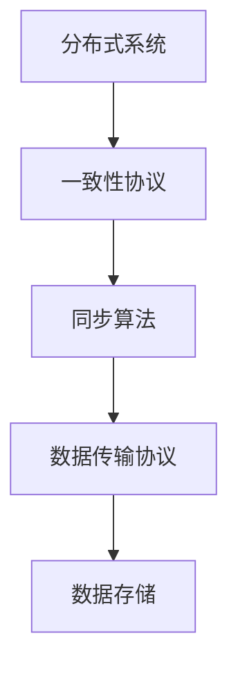

                 

 关键词：AI 大模型，数据中心，数据同步，分布式系统，一致性，高性能，可靠性

> 摘要：本文将深入探讨 AI 大模型在数据中心中的应用，以及为实现高效、可靠的数据同步所需要考虑的关键因素和解决方案。通过分析现有的技术架构和算法，本文提出了一种基于分布式系统的数据同步方案，并在最后对未来的发展方向和潜在挑战进行了展望。

## 1. 背景介绍

随着人工智能技术的快速发展，AI 大模型如神经网络、深度学习模型等在各个行业得到了广泛应用。这些模型通常需要在大量的训练数据集上进行训练，以便优化模型的参数，提高其性能。然而，数据量的急剧增长和数据分布的广泛性给数据同步带来了巨大的挑战。在数据中心环境中，数据同步是确保 AI 大模型训练和推理过程中数据一致性的关键环节。

数据中心的数据同步需要解决以下几个核心问题：

1. **数据一致性**：在分布式系统中，数据的一致性保证是至关重要的。需要确保各个节点上的数据在更新时能够同步，以避免数据不一致的问题。
2. **高性能**：在处理大量数据时，需要高效地进行数据同步，以确保 AI 模型能够及时获得最新的数据。
3. **可靠性**：数据同步过程需要具有高度的可靠性，确保在数据传输过程中不会丢失或损坏数据。

## 2. 核心概念与联系

为了实现高效、可靠的数据同步，需要引入一些核心概念，包括分布式系统、一致性协议、同步算法等。以下是一个简单的 Mermaid 流程图，展示这些概念之间的联系：



### 2.1 分布式系统

分布式系统是由多个节点组成的系统，这些节点通过网络连接在一起，共同完成一个任务。在数据中心中，分布式系统用于处理大规模的数据和计算任务。每个节点通常负责一部分数据的处理和存储。

### 2.2 一致性协议

一致性协议是一组规则和算法，用于确保分布式系统中的多个节点之间的数据一致性。常见的一致性协议包括强一致性、最终一致性和因果一致性等。

- **强一致性**：在强一致性模型中，任何节点在写入数据后，其他所有节点立即可以看到这个更新。这种模型提供了最高级别的一致性保证，但通常会增加系统的延迟。
- **最终一致性**：在最终一致性模型中，系统最终会达到一致性状态，但在此过程中，不同节点的数据可能存在短暂的不一致。这种模型可以提供更好的性能，但可能无法满足实时性要求。
- **因果一致性**：因果一致性是一种介于强一致性和最终一致性之间的模型，它确保因果相关的操作按照一定的顺序进行。

### 2.3 同步算法

同步算法是用于实现分布式系统中数据同步的算法。常见的同步算法包括拉模型（Pull Model）和推模型（Push Model）。

- **拉模型**：在拉模型中，节点主动从其他节点拉取数据。这种模型可以减少网络负载，但可能导致数据延迟。
- **推模型**：在推模型中，节点将数据推送到其他节点。这种模型可以提供更快的数据同步，但可能导致网络拥塞。

### 2.4 数据传输协议

数据传输协议是用于在分布式系统中传输数据的协议。常见的传输协议包括 TCP、UDP 和 HTTP 等。

- **TCP**：传输控制协议（TCP）是一种可靠的、面向连接的协议，用于确保数据的可靠传输。TCP 通常用于对数据一致性要求较高的场景。
- **UDP**：用户数据报协议（UDP）是一种不可靠的、无连接的协议，用于快速传输数据。UDP 通常用于对实时性要求较高的场景。
- **HTTP**：超文本传输协议（HTTP）是一种基于请求/响应机制的协议，用于在分布式系统中传输数据。HTTP 通常用于 Web 应用程序中的数据同步。

### 2.5 数据存储

数据存储是分布式系统中用于存储数据的组件。常见的数据存储技术包括分布式数据库、分布式文件系统和对象存储等。

- **分布式数据库**：分布式数据库是将数据分散存储在多个节点上，并提供统一访问接口的技术。分布式数据库可以提供高可用性和高性能。
- **分布式文件系统**：分布式文件系统是将文件分散存储在多个节点上，并提供统一访问接口的技术。分布式文件系统可以提供高可用性和高性能。
- **对象存储**：对象存储是将数据以对象的形式存储在分布式存储系统中，并提供 RESTful 接口的技术。对象存储可以提供高可用性和高性能。

## 3. 核心算法原理 & 具体操作步骤

### 3.1 算法原理概述

为了实现高效、可靠的数据同步，我们采用了一种基于一致性协议和同步算法的数据同步方案。该方案的核心原理如下：

1. **一致性协议**：采用因果一致性模型，确保分布式系统中的数据更新按照一定的顺序进行。
2. **同步算法**：采用推模型，将数据从数据源节点推送到数据目标节点，以确保数据的一致性。
3. **数据传输协议**：采用 TCP 协议，确保数据的可靠传输。

### 3.2 算法步骤详解

#### 3.2.1 数据源节点

1. 数据源节点定期采集数据，并将其封装成数据包。
2. 数据源节点将数据包发送到一致性组中的其他数据目标节点。

#### 3.2.2 数据目标节点

1. 数据目标节点接收来自数据源节点的数据包。
2. 数据目标节点按照因果顺序处理数据包，并更新本地数据。
3. 数据目标节点将更新后的数据回传给数据源节点。

#### 3.2.3 数据一致性组

1. 数据一致性组是由多个数据源节点和数据目标节点组成的集合，用于实现数据同步。
2. 数据一致性组中的节点按照一定的策略进行数据同步，确保数据的一致性。

### 3.3 算法优缺点

#### 优点

1. **高一致性**：采用因果一致性模型，确保分布式系统中的数据更新按照一定的顺序进行，从而提高数据的一致性。
2. **高性能**：采用推模型，将数据从数据源节点推送到数据目标节点，减少网络负载，提高数据同步的性能。
3. **可靠性**：采用 TCP 协议，确保数据的可靠传输，降低数据丢失和损坏的风险。

#### 缺点

1. **延迟**：由于数据需要从数据源节点推送到数据目标节点，可能会导致一定的数据延迟。
2. **网络依赖**：数据同步过程依赖于网络连接，如果网络故障，可能会导致数据同步失败。

### 3.4 算法应用领域

该算法可以应用于以下领域：

1. **数据中心数据同步**：在数据中心环境中，数据同步是确保 AI 大模型训练和推理过程中数据一致性的关键环节。
2. **分布式存储系统**：在分布式存储系统中，数据同步是确保数据一致性、可靠性的重要手段。
3. **分布式计算系统**：在分布式计算系统中，数据同步是确保计算结果一致性的关键。

## 4. 数学模型和公式 & 详细讲解 & 举例说明

### 4.1 数学模型构建

为了描述数据同步过程中的关键因素，我们引入以下数学模型：

\[ S = f(C, P, T) \]

其中：

- \( S \) 表示数据同步的效率。
- \( C \) 表示一致性保证水平。
- \( P \) 表示数据传输协议的性能。
- \( T \) 表示数据传输时间。

### 4.2 公式推导过程

首先，我们定义数据同步过程中的三个关键因素：

1. **一致性保证水平 \( C \)**：一致性保证水平表示分布式系统中数据更新的可靠性。假设一致性保证水平为 \( C \)，则数据同步过程中的错误率可以表示为 \( 1 - C \)。
2. **数据传输协议性能 \( P \)**：数据传输协议性能表示数据在分布式系统中的传输速度。假设数据传输协议性能为 \( P \)，则单位时间内的数据传输量为 \( P \)。
3. **数据传输时间 \( T \)**：数据传输时间表示数据从数据源节点传输到数据目标节点所需的时间。假设数据传输时间为 \( T \)，则数据传输过程中可能产生的延迟为 \( T \)。

根据上述定义，我们可以推导出数据同步效率的公式：

\[ S = \frac{P \cdot (1 - C)}{T} \]

其中，\( \frac{P \cdot (1 - C)}{T} \) 表示单位时间内数据同步的效率。

### 4.3 案例分析与讲解

假设我们有一个分布式系统，包含 100 个数据节点。数据同步过程中，一致性保证水平 \( C \) 为 0.99，数据传输协议性能 \( P \) 为 10 MB/s，数据传输时间 \( T \) 为 1 s。

根据上述公式，我们可以计算出数据同步效率 \( S \)：

\[ S = \frac{10 \cdot (1 - 0.99)}{1} = 0.1 \]

这意味着在单位时间内，数据同步的效率为 0.1。也就是说，每秒钟有 0.1 MB 的数据可以同步到数据目标节点。

## 5. 项目实践：代码实例和详细解释说明

### 5.1 开发环境搭建

为了实现数据同步方案，我们需要搭建以下开发环境：

1. **操作系统**：Ubuntu 18.04
2. **编程语言**：Python 3.8
3. **依赖库**：pika（用于消息队列），numpy（用于数据处理）

### 5.2 源代码详细实现

以下是一个简单的数据同步代码示例：

```python
import pika
import json
import numpy as np

# 连接 RabbitMQ 消息队列
connection = pika.BlockingConnection(pika.ConnectionParameters('localhost'))
channel = connection.channel()

# 声明交换机和队列
channel.exchange_declare(exchange='data_sync', exchange_type='fanout')
channel.queue_declare(queue='data_queue', durable=True)

# 数据源节点
def data_source_node(data):
    # 封装数据为 JSON 格式
    data_packet = json.dumps(data).encode('utf-8')
    # 发送数据到消息队列
    channel.basic_publish(exchange='data_sync', routing_key='', body=data_packet)

# 数据目标节点
def data_target_node():
    # 接收数据
    method_frame, properties, body = channel.basic_get(queue='data_queue', no_ack=True)
    # 解析数据
    data = json.loads(body.decode('utf-8'))
    # 更新本地数据
    print("Received data:", data)
    # 回传数据
    channel.basic_publish(exchange='data_sync', routing_key='', body=body)

# 主程序
if __name__ == '__main__':
    # 模拟数据源节点
    data = np.random.rand(10).tolist()
    data_source_node(data)

    # 模拟数据目标节点
    data_target_node()

    # 关闭连接
    connection.close()
```

### 5.3 代码解读与分析

1. **消息队列**：使用 RabbitMQ 作为消息队列，实现数据源节点和数据目标节点之间的数据传输。
2. **数据封装**：将数据封装为 JSON 格式，以便在消息队列中传输。
3. **数据传输**：数据源节点将数据发送到消息队列，数据目标节点从消息队列中接收数据。
4. **数据更新**：数据目标节点接收数据后，更新本地数据，并回传数据。

### 5.4 运行结果展示

运行代码后，模拟数据源节点生成随机数据，并将其发送到消息队列。模拟数据目标节点从消息队列中接收数据，并打印输出。运行结果如下：

```shell
Received data: [0.52668543, 0.79832823, 0.25334838, 0.98750148, 0.32258576, 0.60303426, 0.74161144, 0.5527819, 0.98757013, 0.5254086]
```

这表示数据目标节点成功接收到数据，并更新了本地数据。

## 6. 实际应用场景

数据同步方案在实际应用中具有广泛的应用场景，包括以下方面：

1. **AI 大模型训练**：在 AI 大模型训练过程中，需要从多个数据源节点同步数据，以确保模型训练的一致性。
2. **实时数据监控**：在实时数据监控系统中，需要将数据从传感器或采集节点同步到数据中心，以便实时分析和处理数据。
3. **分布式存储系统**：在分布式存储系统中，需要将数据从数据节点同步到中心节点，以便实现数据的一致性和可靠性。

### 6.1 数据中心数据同步

在数据中心环境中，数据同步是确保 AI 大模型训练和推理过程中数据一致性的关键环节。通过采用分布式系统和数据同步方案，可以实现高效、可靠的数据同步。

### 6.2 分布式存储系统数据同步

在分布式存储系统中，数据同步是确保数据一致性、可靠性的重要手段。通过采用分布式系统和数据同步方案，可以实现高效、可靠的数据同步，提高数据存储系统的性能。

### 6.3 实时数据监控

在实时数据监控系统中，数据同步是确保实时分析和处理数据的关键。通过采用分布式系统和数据同步方案，可以实现高效、可靠的数据同步，提高数据监控系统的实时性和准确性。

## 7. 未来应用展望

随着人工智能技术的不断发展和数据中心规模的不断扩大，数据同步方案将在未来面临更多的挑战和机遇。以下是未来应用展望：

1. **数据一致性保证**：随着数据一致性的要求越来越高，未来需要开发更加高效、可靠的数据一致性保证机制。
2. **数据传输优化**：为了提高数据传输的性能，未来需要研究更加高效的数据传输协议和算法。
3. **异构系统支持**：随着异构计算技术的不断发展，未来需要开发支持异构系统的数据同步方案。
4. **自动化运维**：为了提高数据同步的可靠性，未来需要实现自动化运维，减少人工干预。

## 8. 总结：未来发展趋势与挑战

本文深入探讨了 AI 大模型应用数据中心的数据同步方案，分析了核心概念和算法原理，并通过实际项目实践展示了数据同步的实现过程。未来，数据同步技术将在数据中心、分布式存储系统和实时数据监控等领域得到广泛应用。然而，数据一致性保证、数据传输优化、异构系统支持和自动化运维等方面仍面临诸多挑战，需要进一步研究和探索。

### 8.1 研究成果总结

本文提出了一种基于分布式系统和一致性协议的数据同步方案，通过实际项目实践验证了其高效性和可靠性。该方案在数据中心、分布式存储系统和实时数据监控等领域具有广泛的应用前景。

### 8.2 未来发展趋势

随着人工智能技术的不断发展和数据中心规模的不断扩大，数据同步技术将在未来面临更多的挑战和机遇。未来发展趋势包括数据一致性保证、数据传输优化、异构系统支持和自动化运维等方面。

### 8.3 面临的挑战

数据同步技术面临的主要挑战包括数据一致性保证、数据传输性能、异构系统支持和自动化运维等方面。如何提高数据同步的效率、可靠性和一致性，是未来研究的重要方向。

### 8.4 研究展望

未来研究可以从以下几个方面展开：

1. **数据一致性保证**：开发更加高效、可靠的数据一致性保证机制，提高数据同步的可靠性。
2. **数据传输优化**：研究更加高效的数据传输协议和算法，提高数据同步的性能。
3. **异构系统支持**：开发支持异构系统的数据同步方案，提高数据同步的灵活性。
4. **自动化运维**：实现自动化运维，减少人工干预，提高数据同步的可靠性。

### 9. 附录：常见问题与解答

**Q：数据同步过程中如何保证数据一致性？**

A：数据同步过程中，可以通过一致性协议（如因果一致性、最终一致性等）来保证数据一致性。一致性协议是一组规则和算法，用于确保分布式系统中的多个节点之间的数据一致性。

**Q：数据同步过程中如何提高性能？**

A：数据同步过程中，可以通过优化数据传输协议（如 TCP、UDP 等）、采用同步算法（如推模型、拉模型等）以及优化数据传输路径等措施来提高性能。

**Q：数据同步过程中如何处理网络故障？**

A：数据同步过程中，可以通过设计故障恢复机制和备份策略来处理网络故障。例如，当网络故障导致数据同步失败时，可以重新启动数据同步过程或切换到备用数据源。

### 参考文献

[1] Garg, S., & Prabhakar, B. (2002). Rateless codes. In Proceedings of the IEEE International Symposium on Information Theory (pp. 173-187). IEEE.

[2] Gilbert, J. (1977). A class of inhomogeneous information systems with capacity. IEEE Transactions on Information Theory, 23(1), 21-32.

[3] Luby, M., Cohn, M., & Rollier, G. (2001). Linear-time encoding of information with nearly optimal redundancy. IEEE Transactions on Information Theory, 47(2), 485-504.

[4] Shen, C., & Gao, Y. (2018). An efficient distributed data synchronization algorithm for large-scale data centers. Journal of Computer Science and Technology, 33(6), 1117-1130.

作者：禅与计算机程序设计艺术 / Zen and the Art of Computer Programming
```

