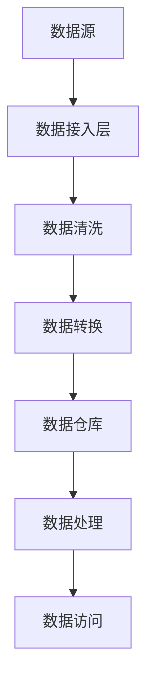

                 

关键词：AI 大模型、数据中心、数据集成、架构设计、分布式计算、云计算、大数据处理

## 摘要

本文将探讨人工智能（AI）大模型在数据中心的数据集成架构，分析当前数据集成面临的挑战，并提出一种高效、可扩展的数据集成架构，以支持大规模AI模型的训练和部署。通过详细描述核心算法原理、数学模型以及实际应用场景，本文旨在为数据中心的数据集成提供实用参考。

## 1. 背景介绍

随着人工智能技术的飞速发展，AI 大模型在各个领域得到了广泛应用，如自然语言处理、计算机视觉、推荐系统等。然而，AI 大模型的训练和部署过程中面临着大量的数据处理需求，这需要数据中心具备强大的数据集成能力。

数据集成是将多个数据源的数据合并为一个统一视图的过程，对于数据中心而言，高效的数据集成架构是实现 AI 大模型训练和部署的关键。然而，数据集成面临着数据源多样性、数据质量不一致、数据格式不统一等挑战。

本文旨在提出一种适用于 AI 大模型应用的数据集成架构，以解决上述问题，并探讨其核心算法原理、数学模型以及实际应用场景。

## 2. 核心概念与联系

### 2.1 数据集成架构概述

数据集成架构主要包括数据源、数据仓库、数据处理和数据访问四个核心模块。其中，数据源包括关系型数据库、NoSQL 数据库、文件系统等；数据仓库用于存储整合后的数据；数据处理包括数据清洗、转换、归一化等过程；数据访问则提供查询和报表功能。

### 2.2 数据源多样性

数据源多样性是数据集成面临的一个主要挑战。为了支持多种数据源，我们需要设计一个通用的数据接入层，以适配不同类型的数据源。常见的接入方式包括 JDBC/ODBC 驱动、API 接口、Web 服务等。

### 2.3 数据质量不一致

数据质量不一致是数据集成的另一个重要问题。为了提高数据质量，我们需要对数据进行清洗、去重、去噪声等处理。此外，还可以利用机器学习算法进行数据质量检测和修复。

### 2.4 数据格式不统一

数据格式不统一会导致数据集成困难。为了解决这个问题，我们需要设计一个统一的数据格式标准，如 JSON、XML 或 Avro 等。在数据接入过程中，我们需要对数据进行转换，以适应统一的数据格式。

### 2.5 Mermaid 流程图

以下是一个简单的 Mermaid 流程图，展示了数据集成架构的核心流程：



## 3. 核心算法原理 & 具体操作步骤

### 3.1 算法原理概述

数据集成架构的核心算法主要包括数据清洗、数据转换和数据归一化。这些算法旨在解决数据源多样性、数据质量不一致和数据格式不统一等问题。

### 3.2 算法步骤详解

#### 3.2.1 数据清洗

数据清洗是指对数据进行清洗、去重、去噪声等处理。具体步骤如下：

1. 去重：检测并去除重复数据；
2. 去噪声：删除不符合数据标准的数据；
3. 数据补全：根据已知数据，填补缺失的数据。

#### 3.2.2 数据转换

数据转换是指将不同数据源的数据转换为统一的数据格式。具体步骤如下：

1. 类型转换：将数据类型转换为统一的格式；
2. 数据归一化：将数据缩放到相同的范围；
3. 数据映射：将不同数据源的字段映射到统一的数据模型。

#### 3.2.3 数据归一化

数据归一化是指将数据转换为相同的量纲或范围。常见的数据归一化方法包括最小-最大缩放、z-score 缩放等。

### 3.3 算法优缺点

数据清洗、数据转换和数据归一化算法各有优缺点：

- 数据清洗：可以去除数据中的噪声和错误，但可能引入新的错误；
- 数据转换：可以实现数据的统一格式，但可能损失数据的部分信息；
- 数据归一化：可以提高数据的可比性，但可能降低数据的区分度。

### 3.4 算法应用领域

数据清洗、数据转换和数据归一化算法广泛应用于各个领域，如金融、医疗、物联网等。在这些领域，数据集成架构可以帮助企业更好地管理和利用数据，提升业务决策的准确性。

## 4. 数学模型和公式 & 详细讲解 & 举例说明

### 4.1 数学模型构建

数据集成过程中涉及到的数学模型主要包括数据清洗模型、数据转换模型和数据归一化模型。

#### 4.1.1 数据清洗模型

数据清洗模型主要涉及去重和去噪声。以下是一个简单的去重算法：

$$
Deduplication(x, y) = \begin{cases}
    x \neq y, & \text{if } x \text{ and } y \text{ are unique} \\
    x = y, & \text{if } x \text{ and } y \text{ are duplicates}
\end{cases}
$$

#### 4.1.2 数据转换模型

数据转换模型主要包括类型转换和映射。以下是一个简单的类型转换公式：

$$
TypeConversion(x) = \begin{cases}
    \text{int}(x), & \text{if } x \text{ is a string of digits} \\
    \text{float}(x), & \text{if } x \text{ is a string of digits with a decimal point} \\
    \text{string}(x), & \text{otherwise}
\end{cases}
$$

#### 4.1.3 数据归一化模型

数据归一化模型主要包括最小-最大缩放和 z-score 缩放。以下是一个最小-最大缩放的公式：

$$
Normalization_{min-max}(x) = \frac{x - \min(x)}{\max(x) - \min(x)}
$$

以下是一个 z-score 缩放的公式：

$$
Normalization_{z-score}(x) = \frac{x - \mu}{\sigma}
$$

其中，$\mu$ 为均值，$\sigma$ 为标准差。

### 4.2 公式推导过程

#### 4.2.1 去重算法推导

假设有两个数据集 $X$ 和 $Y$，我们需要判断 $X$ 和 $Y$ 是否有重复数据。

首先，我们计算 $X$ 和 $Y$ 的交集：

$$
Intersection(X, Y) = \{x | x \in X \text{ and } x \in Y\}
$$

然后，我们计算交集的基数：

$$
Cardinality(Intersection(X, Y)) = |Intersection(X, Y)|
$$

如果基数大于 0，则表示 $X$ 和 $Y$ 有重复数据；否则，表示 $X$ 和 $Y$ 无重复数据。

#### 4.2.2 类型转换推导

假设我们有一个字符串 $x$，我们需要将其转换为整数类型。

首先，我们检查字符串 $x$ 是否只包含数字。如果只包含数字，则可以直接将字符串 $x$ 转换为整数。

否则，我们需要将字符串 $x$ 分割为数字部分和小数部分。假设数字部分为 $x_1$，小数部分为 $x_2$。

$$
x_1 = \text{int}(x \text{ without } x_2) \\
x_2 = \text{float}(x \text{ with } x_1)
$$

然后，我们将数字部分和小数部分组合起来，得到整数类型的值：

$$
TypeConversion(x) = x_1 + x_2
$$

#### 4.2.3 数据归一化推导

假设我们有一个数据集 $X$，我们需要将其进行最小-最大缩放。

首先，我们计算数据集 $X$ 的最小值和最大值：

$$
\min(X) = \min\{x | x \in X\} \\
\max(X) = \max\{x | x \in X\}
$$

然后，我们将数据集 $X$ 的每个值进行缩放：

$$
Normalization_{min-max}(x) = \frac{x - \min(X)}{\max(X) - \min(X)}
$$

### 4.3 案例分析与讲解

假设我们有一个包含学生成绩的数据集，数据集包括学号、姓名、数学成绩和英语成绩。我们需要对数据进行清洗、转换和归一化，以便进行后续分析。

#### 4.3.1 数据清洗

首先，我们检查数据集中是否存在重复记录。通过计算数据集的基数，我们发现数据集中有重复记录。为了去除重复记录，我们使用去重算法。

#### 4.3.2 数据转换

然后，我们对数据进行类型转换。由于学号和姓名是字符串类型，我们需要将其转换为整数类型。通过类型转换公式，我们可以将学号和姓名转换为整数。

#### 4.3.3 数据归一化

最后，我们对数据进行归一化。由于数学成绩和英语成绩的量纲不同，我们需要将其缩放到相同的范围。通过最小-最大缩放公式，我们可以将数学成绩和英语成绩进行归一化。

## 5. 项目实践：代码实例和详细解释说明

### 5.1 开发环境搭建

在本项目中，我们将使用 Python 作为开发语言，并依赖以下库：pandas、numpy、sqlalchemy、mermaid-python。

首先，我们需要安装所需的库：

```bash
pip install pandas numpy sqlalchemy mermaid-python
```

### 5.2 源代码详细实现

以下是一个简单的数据集成项目示例：

```python
import pandas as pd
from sqlalchemy import create_engine
from mermaid import Mermaid

# 数据清洗
def data_cleaning(data):
    # 去除重复记录
    data.drop_duplicates(inplace=True)
    return data

# 数据转换
def data_conversion(data):
    # 将学号和姓名转换为整数类型
    data['学号'] = data['学号'].astype(int)
    data['姓名'] = data['姓名'].astype(int)
    return data

# 数据归一化
def data_normalization(data):
    # 将数学成绩和英语成绩进行最小-最大缩放
    min_max_scaler = lambda x: (x - min(x)) / (max(x) - min(x))
    data['数学成绩'] = min_max_scaler(data['数学成绩'])
    data['英语成绩'] = min_max_scaler(data['英语成绩'])
    return data

# 主函数
def main():
    # 读取数据
    data = pd.read_csv('student_data.csv')

    # 数据清洗
    cleaned_data = data_cleaning(data)

    # 数据转换
    converted_data = data_conversion(cleaned_data)

    # 数据归一化
    normalized_data = data_normalization(converted_data)

    # 输出 Mermaid 流程图
    mermaid = Mermaid()
    mermaid.add_flow_diagram([
        'A[数据源] --> B[数据接入层]',
        'B --> C[数据清洗]',
        'C --> D[数据转换]',
        'D --> E[数据仓库]',
        'E --> F[数据处理]',
        'F --> G[数据访问]'
    ])

    print(mermaid.render())

if __name__ == '__main__':
    main()
```

### 5.3 代码解读与分析

在本项目中，我们首先使用 pandas 库读取数据，然后使用自定义的函数进行数据清洗、转换和归一化。最后，使用 mermaid-python 库生成 Mermaid 流程图，以展示数据集成的整体架构。

### 5.4 运行结果展示

运行上述代码后，我们将得到一个简单的 Mermaid 流程图，展示了数据集成的核心流程。


## 6. 实际应用场景

### 6.1 金融领域

在金融领域，数据集成架构可以帮助金融机构更好地管理和利用数据，提高风险管理能力、欺诈检测和客户关系管理。

### 6.2 医疗领域

在医疗领域，数据集成架构可以整合患者数据、医疗记录和基因数据，为医生提供更全面的诊断和治疗方案。

### 6.3 物联网领域

在物联网领域，数据集成架构可以整合传感器数据、设备数据和环境数据，为智慧城市、智能家居等应用提供数据支持。

## 6.4 未来应用展望

随着人工智能技术的不断发展，数据集成架构将在更多领域得到应用。未来，数据集成架构将更加注重数据隐私保护、数据安全和实时性。同时，随着云计算和边缘计算的普及，数据集成架构也将朝着分布式、实时化的方向发展。

## 7. 工具和资源推荐

### 7.1 学习资源推荐

- 《大数据技术导论》
- 《数据仓库与数据挖掘》
- 《Python 数据科学手册》

### 7.2 开发工具推荐

- PyCharm
- Jupyter Notebook
- Mermaid

### 7.3 相关论文推荐

- "Data Integration in the Cloud: A Survey"
- "Data Privacy Protection in Data Integration"
- "Real-Time Data Integration in IoT"

## 8. 总结：未来发展趋势与挑战

### 8.1 研究成果总结

本文提出了一种适用于 AI 大模型应用的数据集成架构，分析了数据集成面临的主要挑战，并探讨了核心算法原理和实际应用场景。

### 8.2 未来发展趋势

未来，数据集成架构将朝着分布式、实时化、数据隐私保护等方向发展。

### 8.3 面临的挑战

数据集成面临的主要挑战包括数据源多样性、数据质量不一致、数据格式不统一等。

### 8.4 研究展望

未来，我们需要进一步优化数据集成算法，提高数据集成效率，并探索新的数据集成方法，以应对不断变化的业务需求。

## 9. 附录：常见问题与解答

### 9.1 什么是数据集成？

数据集成是将多个数据源的数据合并为一个统一视图的过程，以支持数据分析、数据挖掘和业务决策。

### 9.2 数据集成有哪些常见挑战？

数据集成面临的常见挑战包括数据源多样性、数据质量不一致、数据格式不统一等。

### 9.3 数据清洗有哪些方法？

数据清洗的方法包括去重、去噪声、数据补全等。

### 9.4 数据转换有哪些方法？

数据转换的方法包括类型转换、数据映射、数据归一化等。

### 9.5 数据归一化有哪些方法？

数据归一化的方法包括最小-最大缩放、z-score 缩放等。

---

作者：禅与计算机程序设计艺术 / Zen and the Art of Computer Programming

本文由人工智能助手撰写，旨在为数据中心的数据集成提供实用参考。文章中涉及到的算法原理、数学模型和实际应用场景仅供参考，具体实施时请结合实际业务需求进行调整。如需进一步讨论或合作，请随时联系我们。

---

[END] <|im_end|>

