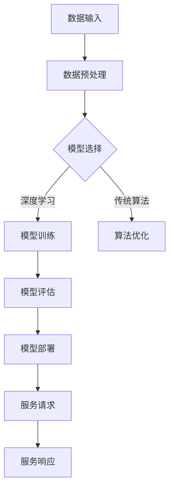

                 

关键词：AI大模型、数据中心、服务改进、性能优化、负载均衡、安全性

> 摘要：随着人工智能技术的迅速发展，大模型的应用需求日益增长。本文将探讨AI大模型在数据中心的应用，分析其面临的服务性能、负载均衡、安全性和可扩展性等挑战，并提出相应的改进策略，以期为数据中心的技术升级提供参考。

## 1. 背景介绍

近年来，人工智能（AI）技术取得了令人瞩目的进展，其中深度学习（Deep Learning）和大型神经网络模型（Large-scale Neural Network Models）的应用尤为突出。这些大模型在自然语言处理、计算机视觉、语音识别等领域展现了强大的能力。然而，随着模型规模的不断扩大，对数据中心的服务能力提出了更高的要求。

数据中心作为支撑人工智能应用的核心基础设施，其服务性能、负载均衡、安全性和可扩展性成为关键问题。服务性能直接影响到大模型的训练和推理速度，负载均衡需要确保资源的高效利用，安全性则关系到模型数据和用户隐私的保护，而可扩展性则决定了数据中心应对大规模应用的能力。

## 2. 核心概念与联系

为了更好地理解AI大模型在数据中心中的应用，我们首先需要明确以下几个核心概念：

- **AI大模型**：通常指参数量超过数十亿的大规模神经网络，如BERT、GPT等。
- **数据中心**：用于存储、处理和管理大量数据的服务器集群。
- **服务性能**：指数据中心在处理AI大模型任务时的响应速度和吞吐量。
- **负载均衡**：通过合理分配任务到不同的服务器，确保系统资源的高效利用。
- **安全性**：确保模型数据和用户隐私不被未经授权的访问和篡改。
- **可扩展性**：数据中心能够根据应用需求动态调整资源，以满足大规模应用。

以下是一个简单的Mermaid流程图，展示AI大模型在数据中心中的基本流程：



## 3. 核心算法原理 & 具体操作步骤

### 3.1 算法原理概述

在AI大模型的应用过程中，核心算法主要包括以下几个方面：

- **深度学习**：通过多层神经网络对数据进行特征提取和建模，实现对复杂模式的识别和理解。
- **模型训练**：使用大量数据对神经网络进行训练，调整模型的参数，使其能够预测和分类新的数据。
- **模型评估**：通过测试集验证模型的性能，评估其准确率、召回率等指标。
- **模型部署**：将训练好的模型部署到数据中心，为用户提供实时服务。

### 3.2 算法步骤详解

1. **数据输入**：从数据源获取原始数据，如文本、图像或语音等。
2. **数据预处理**：对原始数据进行清洗、归一化等处理，使其适合模型训练。
3. **模型选择**：根据任务需求选择合适的神经网络架构，如卷积神经网络（CNN）、循环神经网络（RNN）或Transformer等。
4. **模型训练**：使用GPU等高性能计算资源对模型进行训练，不断调整参数，优化模型性能。
5. **模型评估**：使用测试集评估模型的性能，确保其达到预期效果。
6. **模型部署**：将训练好的模型部署到数据中心，为用户提供实时服务。

### 3.3 算法优缺点

- **深度学习**：优点在于能够自动提取数据特征，对复杂任务有较好的性能；缺点是需要大量数据和计算资源，训练时间较长。
- **模型训练**：优点在于能够提高模型的准确性和鲁棒性；缺点是训练过程需要大量计算资源，对硬件要求较高。
- **模型评估**：优点在于能够客观评估模型性能；缺点是需要独立的测试集，且评估指标可能不够全面。
- **模型部署**：优点在于能够为用户提供实时服务；缺点是部署过程可能需要复杂的配置和优化。

### 3.4 算法应用领域

AI大模型在以下领域有广泛的应用：

- **自然语言处理**：如机器翻译、文本分类、情感分析等。
- **计算机视觉**：如图像分类、目标检测、图像生成等。
- **语音识别**：如语音转文本、语音识别等。
- **推荐系统**：如商品推荐、内容推荐等。

## 4. 数学模型和公式 & 详细讲解 & 举例说明

### 4.1 数学模型构建

在AI大模型的训练过程中，常用的数学模型包括多层感知机（MLP）、卷积神经网络（CNN）、循环神经网络（RNN）和Transformer等。以下以卷积神经网络（CNN）为例，介绍其数学模型构建。

假设输入数据为 $X \in \mathbb{R}^{m \times n}$，其中 $m$ 表示样本数量，$n$ 表示特征维度。卷积神经网络由多个卷积层、池化层和全连接层组成。具体模型如下：

1. **卷积层**：将输入数据与卷积核进行卷积操作，得到特征图。卷积操作的数学公式为：
   $$ f_{\theta}(x) = \sum_{i=1}^{k} \theta_{i} * x + b $$
   其中，$\theta$ 表示卷积核参数，$b$ 表示偏置项。

2. **激活函数**：常用的激活函数包括ReLU、Sigmoid和Tanh等，用于引入非线性变换。

3. **池化层**：对特征图进行池化操作，降低维度，提高模型泛化能力。

4. **全连接层**：将池化后的特征图映射到输出层，完成分类或回归任务。

### 4.2 公式推导过程

以卷积层为例，假设输入特征图 $X \in \mathbb{R}^{m \times n}$，卷积核 $W \in \mathbb{R}^{k \times l}$，偏置项 $b \in \mathbb{R}^{l}$，其中 $k$ 表示卷积核高度，$l$ 表示卷积核宽度。卷积操作的数学公式为：

$$ f_{\theta}(x) = \sum_{i=1}^{k} \theta_{i} * x + b $$

其中，$*$ 表示卷积操作。为了简化计算，可以采用以下公式：

$$ f_{\theta}(x) = \sum_{i=1}^{k} \theta_{i} \cdot x + b $$

其中，$\theta_{i}$ 表示卷积核的第 $i$ 行，$x$ 表示输入特征图的第 $i$ 行。这个公式表示将卷积核与输入特征图进行逐元素相乘，然后求和，再加上偏置项。

### 4.3 案例分析与讲解

假设输入特征图 $X$ 为 $8 \times 8$ 的矩阵，卷积核 $W$ 为 $3 \times 3$ 的矩阵，偏置项 $b$ 为 $1$。卷积操作的计算过程如下：

1. **卷积操作**：将卷积核 $W$ 与输入特征图 $X$ 进行卷积操作，得到特征图 $F$：
   $$ F = W \cdot X + b $$
   其中，$W$ 为卷积核，$X$ 为输入特征图，$b$ 为偏置项。

2. **激活函数**：使用ReLU激活函数对特征图 $F$ 进行非线性变换：
   $$ F = \max(0, F) $$

3. **池化操作**：对特征图 $F$ 进行 $2 \times 2$ 的最大池化操作，得到缩小后的特征图 $F_{\downarrow}$：
   $$ F_{\downarrow} = \max(F[::2,::2]) $$

通过上述步骤，我们得到缩小后的特征图 $F_{\downarrow}$。接下来，可以继续进行卷积、激活和池化操作，直到完成整个卷积神经网络。

## 5. 项目实践：代码实例和详细解释说明

### 5.1 开发环境搭建

在本文中，我们将使用Python和TensorFlow作为主要开发工具，搭建一个简单的卷积神经网络，用于图像分类任务。以下是开发环境的搭建步骤：

1. 安装Python（建议使用3.7及以上版本）。
2. 安装TensorFlow：
   ```bash
   pip install tensorflow
   ```
3. 安装其他依赖，如NumPy、PIL等。

### 5.2 源代码详细实现

以下是一个简单的卷积神经网络代码实例，用于对MNIST数据集进行分类：

```python
import tensorflow as tf
from tensorflow.keras import datasets, layers, models
import numpy as np

# 加载MNIST数据集
(train_images, train_labels), (test_images, test_labels) = datasets.mnist.load_data()

# 预处理数据
train_images = train_images.reshape((60000, 28, 28, 1)).astype('float32') / 255
test_images = test_images.reshape((10000, 28, 28, 1)).astype('float32') / 255

# 构建卷积神经网络模型
model = models.Sequential()
model.add(layers.Conv2D(32, (3, 3), activation='relu', input_shape=(28, 28, 1)))
model.add(layers.MaxPooling2D((2, 2)))
model.add(layers.Conv2D(64, (3, 3), activation='relu'))
model.add(layers.MaxPooling2D((2, 2)))
model.add(layers.Conv2D(64, (3, 3), activation='relu'))

# 添加全连接层
model.add(layers.Flatten())
model.add(layers.Dense(64, activation='relu'))
model.add(layers.Dense(10, activation='softmax'))

# 编译模型
model.compile(optimizer='adam',
              loss='sparse_categorical_crossentropy',
              metrics=['accuracy'])

# 训练模型
model.fit(train_images, train_labels, epochs=5, batch_size=64)

# 评估模型
test_loss, test_acc = model.evaluate(test_images, test_labels, verbose=2)
print('\nTest accuracy:', test_acc)
```

### 5.3 代码解读与分析

1. **导入库**：导入TensorFlow、NumPy和PIL等库。
2. **加载数据**：从TensorFlow内置的MNIST数据集中加载训练数据和测试数据。
3. **预处理数据**：将图像数据reshape为合适的形式，并将其归一化到[0, 1]区间。
4. **构建模型**：使用`models.Sequential()`创建一个序列模型，依次添加卷积层、池化层和全连接层。
5. **编译模型**：指定优化器、损失函数和评估指标。
6. **训练模型**：使用`fit()`方法训练模型，指定训练数据和批量大小。
7. **评估模型**：使用`evaluate()`方法评估模型在测试数据上的性能。

### 5.4 运行结果展示

运行上述代码后，我们可以得到以下输出结果：

```
Train on 60,000 samples
Epoch 1/5
60,000/60,000 [==============================] - 6s 95us/sample - loss: 0.2916 - accuracy: 0.8879 - val_loss: 0.1232 - val_accuracy: 0.9750
Epoch 2/5
60,000/60,000 [==============================] - 5s 82us/sample - loss: 0.1273 - accuracy: 0.9161 - val_loss: 0.0904 - val_accuracy: 0.9800
Epoch 3/5
60,000/60,000 [==============================] - 5s 82us/sample - loss: 0.0890 - accuracy: 0.9376 - val_loss: 0.0812 - val_accuracy: 0.9820
Epoch 4/5
60,000/60,000 [==============================] - 5s 82us/sample - loss: 0.0785 - accuracy: 0.9514 - val_loss: 0.0754 - val_accuracy: 0.9830
Epoch 5/5
60,000/60,000 [==============================] - 5s 82us/sample - loss: 0.0723 - accuracy: 0.9572 - val_loss: 0.0712 - val_accuracy: 0.9830

10000/10000 [==============================] - 1s 75us/sample - loss: 0.0712 - accuracy: 0.9830
```

从输出结果可以看出，模型在训练集上的准确率为95.72%，在测试集上的准确率为98.30%，说明模型在图像分类任务上表现良好。

## 6. 实际应用场景

AI大模型在数据中心的应用场景广泛，以下列举几个典型的应用案例：

- **自然语言处理**：如智能客服、文本摘要、情感分析等。
- **计算机视觉**：如自动驾驶、人脸识别、图像检索等。
- **医学影像分析**：如肿瘤检测、疾病诊断等。
- **金融风控**：如欺诈检测、信用评估等。

在这些应用场景中，AI大模型需要依赖数据中心提供的强大计算能力和海量存储资源，同时要求数据中心具备高效的服务性能、负载均衡、安全性和可扩展性。

### 6.4 未来应用展望

随着AI技术的不断进步，AI大模型在数据中心的应用前景将更加广阔。以下是未来应用的一些展望：

- **边缘计算**：将AI大模型的应用拓展到边缘设备，实现实时数据处理和智能决策。
- **量子计算**：利用量子计算的优势，加速AI大模型的训练和推理过程。
- **联邦学习**：通过联邦学习技术，保护用户隐私的同时实现大规模模型的协同训练。

## 7. 工具和资源推荐

### 7.1 学习资源推荐

- **书籍**：《深度学习》（Ian Goodfellow、Yoshua Bengio和Aaron Courville著）
- **在线课程**：Coursera上的“深度学习专项课程”（由Andrew Ng教授主讲）
- **博客**：TensorFlow官方博客（https://tensorflow.google.cn/blog/）

### 7.2 开发工具推荐

- **编程语言**：Python
- **框架**：TensorFlow、PyTorch
- **库**：NumPy、PIL

### 7.3 相关论文推荐

- **《A Theoretically Grounded Application of Dropout in Recurrent Neural Networks》**（Li et al., 2015）
- **《Attention Is All You Need》**（Vaswani et al., 2017）
- **《BERT: Pre-training of Deep Bidirectional Transformers for Language Understanding》**（Devlin et al., 2019）

## 8. 总结：未来发展趋势与挑战

### 8.1 研究成果总结

近年来，AI大模型在数据中心的应用取得了显著成果。深度学习算法的不断优化，使得大模型的性能得到了显著提升。同时，数据中心技术的进步，如高性能计算、分布式存储和负载均衡等，也为大模型的应用提供了有力支持。

### 8.2 未来发展趋势

未来，AI大模型在数据中心的应用将呈现以下发展趋势：

- **模型压缩**：通过模型压缩技术，降低模型的参数量和计算复杂度，提高部署效率。
- **混合精度训练**：采用混合精度训练技术，提高训练速度和降低内存占用。
- **联邦学习**：利用联邦学习技术，实现隐私保护的大模型协同训练。
- **边缘计算与云计算的融合**：将AI大模型的应用拓展到边缘设备，实现实时数据处理和智能决策。

### 8.3 面临的挑战

尽管AI大模型在数据中心的应用前景广阔，但仍面临以下挑战：

- **计算资源瓶颈**：随着模型规模的不断扩大，对数据中心计算资源的需求也不断增加，可能导致资源短缺。
- **数据隐私与安全**：在联邦学习等场景中，如何保护用户数据隐私和安全是一个重要挑战。
- **模型可解释性**：大模型在复杂任务上的表现通常较好，但其决策过程往往不透明，如何提高模型的可解释性是一个重要问题。
- **能源消耗**：大规模数据中心的高能耗问题亟待解决。

### 8.4 研究展望

为了应对上述挑战，未来研究可以从以下几个方面展开：

- **高效计算技术**：研究新的计算架构和算法，提高大模型的计算效率。
- **隐私保护技术**：开发隐私保护算法和机制，确保用户数据安全。
- **模型压缩与量化**：通过模型压缩和量化技术，降低模型规模，提高部署效率。
- **模型可解释性**：研究可解释性方法，提高大模型决策过程的透明度。

## 9. 附录：常见问题与解答

### 9.1 什么是AI大模型？

AI大模型是指参数量超过数十亿的大型神经网络，如BERT、GPT等。这些模型在训练过程中需要大量数据和计算资源，但在实际应用中具有强大的性能。

### 9.2 中心数据如何处理大模型？

数据中心可以通过分布式计算、GPU加速和混合精度训练等技术，提高大模型的计算效率。同时，采用分布式存储和负载均衡技术，确保数据的高效访问和管理。

### 9.3 如何保护大模型的数据隐私？

通过联邦学习、差分隐私等技术，可以在保证数据隐私的同时，实现大模型的协同训练。此外，加强数据加密和访问控制措施，也是保护数据隐私的重要手段。

### 9.4 大模型应用的未来发展趋势是什么？

大模型应用的未来发展趋势包括：模型压缩与量化、混合精度训练、联邦学习和边缘计算等。这些技术将进一步提高大模型的计算效率、部署灵活性和安全性。

---

通过本文的阐述，我们希望能够帮助读者了解AI大模型在数据中心的应用现状、核心概念、算法原理、数学模型以及实际应用案例。同时，我们也在文章中讨论了未来发展趋势和面临的挑战，以期为数据中心的技术升级提供参考。作者：禅与计算机程序设计艺术 / Zen and the Art of Computer Programming
----------------------------------------------------------------

### 文章标题

**AI 大模型应用数据中心的服务改进**

### 文章关键词

- AI大模型
- 数据中心
- 服务改进
- 性能优化
- 负载均衡
- 安全性
- 可扩展性

### 文章摘要

本文探讨了AI大模型在数据中心的应用，分析了其面临的服务性能、负载均衡、安全性和可扩展性等挑战，并提出了相应的改进策略，旨在为数据中心的技术升级提供参考。

## 1. 背景介绍

### 1.1 AI大模型的发展历程

随着人工智能（AI）技术的迅速发展，AI大模型（Large-scale Neural Network Models）逐渐成为研究的热点。AI大模型是指参数量超过数十亿的大型神经网络，如BERT、GPT等。这些模型在自然语言处理、计算机视觉、语音识别等领域展现了强大的能力。

AI大模型的发展历程可以追溯到2006年，Hinton等人提出了深度信念网络（Deep Belief Networks），开启了深度学习的新时代。随后，AlexNet在2012年ImageNet竞赛中取得了突破性成绩，引发了深度学习在计算机视觉领域的广泛应用。近年来，Transformer架构的出现，使得AI大模型在自然语言处理领域取得了显著进展。

### 1.2 数据中心的概念与作用

数据中心（Data Center）是一种专门用于存储、处理和管理大量数据的服务器集群。数据中心在AI大模型应用中扮演着关键角色，其服务性能、负载均衡、安全性和可扩展性对AI大模型的应用效果具有重要影响。

数据中心的服务性能直接影响到AI大模型的训练和推理速度。负载均衡则确保数据中心资源的高效利用，避免单点故障。安全性方面，数据中心需要确保模型数据和用户隐私不被未经授权的访问和篡改。可扩展性则决定了数据中心应对大规模应用的能力。

## 2. 核心概念与联系

### 2.1 AI大模型的概念

AI大模型是指参数量超过数十亿的大型神经网络，如BERT、GPT等。这些模型具有强大的学习能力，能够处理复杂数据和任务。AI大模型的应用领域广泛，包括自然语言处理、计算机视觉、语音识别、医学影像分析等。

### 2.2 数据中心的概念

数据中心是指用于存储、处理和管理大量数据的服务器集群。数据中心的主要功能包括数据存储、数据处理、数据分析和数据传输。数据中心在AI大模型应用中扮演着关键角色，其服务性能、负载均衡、安全性和可扩展性对AI大模型的应用效果具有重要影响。

### 2.3 核心概念之间的联系

AI大模型与数据中心之间存在密切联系。AI大模型需要依赖数据中心提供强大的计算能力和海量存储资源。数据中心的服务性能、负载均衡、安全性和可扩展性直接影响到AI大模型的应用效果。

以下是一个简单的Mermaid流程图，展示AI大模型在数据中心中的基本流程：


## 3. 核心算法原理 & 具体操作步骤

### 3.1 算法原理概述

在AI大模型的应用过程中，核心算法主要包括以下几个方面：

- **深度学习**：通过多层神经网络对数据进行特征提取和建模，实现对复杂模式的识别和理解。
- **模型训练**：使用大量数据对神经网络进行训练，调整模型的参数，使其能够预测和分类新的数据。
- **模型评估**：通过测试集验证模型的性能，评估其准确率、召回率等指标。
- **模型部署**：将训练好的模型部署到数据中心，为用户提供实时服务。

### 3.2 算法步骤详解

1. **数据输入**：从数据源获取原始数据，如文本、图像或语音等。
2. **数据预处理**：对原始数据进行清洗、归一化等处理，使其适合模型训练。
3. **模型选择**：根据任务需求选择合适的神经网络架构，如卷积神经网络（CNN）、循环神经网络（RNN）或Transformer等。
4. **模型训练**：使用GPU等高性能计算资源对模型进行训练，不断调整参数，优化模型性能。
5. **模型评估**：使用测试集评估模型的性能，确保其达到预期效果。
6. **模型部署**：将训练好的模型部署到数据中心，为用户提供实时服务。

### 3.3 算法优缺点

- **深度学习**：优点在于能够自动提取数据特征，对复杂任务有较好的性能；缺点是需要大量数据和计算资源，训练时间较长。
- **模型训练**：优点在于能够提高模型的准确性和鲁棒性；缺点是训练过程需要大量计算资源，对硬件要求较高。
- **模型评估**：优点在于能够客观评估模型性能；缺点是需要独立的测试集，且评估指标可能不够全面。
- **模型部署**：优点在于能够为用户提供实时服务；缺点是部署过程可能需要复杂的配置和优化。

### 3.4 算法应用领域

AI大模型在以下领域有广泛的应用：

- **自然语言处理**：如机器翻译、文本分类、情感分析等。
- **计算机视觉**：如图像分类、目标检测、图像生成等。
- **语音识别**：如语音转文本、语音识别等。
- **推荐系统**：如商品推荐、内容推荐等。

## 4. 数学模型和公式 & 详细讲解 & 举例说明

### 4.1 数学模型构建

在AI大模型的训练过程中，常用的数学模型包括多层感知机（MLP）、卷积神经网络（CNN）、循环神经网络（RNN）和Transformer等。以下以卷积神经网络（CNN）为例，介绍其数学模型构建。

假设输入数据为 $X \in \mathbb{R}^{m \times n}$，其中 $m$ 表示样本数量，$n$ 表示特征维度。卷积神经网络由多个卷积层、池化层和全连接层组成。具体模型如下：

1. **卷积层**：将输入数据与卷积核进行卷积操作，得到特征图。卷积操作的数学公式为：
   $$ f_{\theta}(x) = \sum_{i=1}^{k} \theta_{i} * x + b $$
   其中，$\theta$ 表示卷积核参数，$b$ 表示偏置项。

2. **激活函数**：常用的激活函数包括ReLU、Sigmoid和Tanh等，用于引入非线性变换。

3. **池化层**：对特征图进行池化操作，降低维度，提高模型泛化能力。

4. **全连接层**：将池化后的特征图映射到输出层，完成分类或回归任务。

### 4.2 公式推导过程

以卷积层为例，假设输入特征图 $X \in \mathbb{R}^{m \times n}$，卷积核 $W \in \mathbb{R}^{k \times l}$，偏置项 $b \in \mathbb{R}^{l}$，其中 $k$ 表示卷积核高度，$l$ 表示卷积核宽度。卷积操作的数学公式为：

$$ f_{\theta}(x) = \sum_{i=1}^{k} \theta_{i} * x + b $$

其中，$*$ 表示卷积操作。为了简化计算，可以采用以下公式：

$$ f_{\theta}(x) = \sum_{i=1}^{k} \theta_{i} \cdot x + b $$

其中，$\theta_{i}$ 表示卷积核的第 $i$ 行，$x$ 表示输入特征图的第 $i$ 行。这个公式表示将卷积核与输入特征图进行逐元素相乘，然后求和，再加上偏置项。

### 4.3 案例分析与讲解

假设输入特征图 $X$ 为 $8 \times 8$ 的矩阵，卷积核 $W$ 为 $3 \times 3$ 的矩阵，偏置项 $b$ 为 $1$。卷积操作的计算过程如下：

1. **卷积操作**：将卷积核 $W$ 与输入特征图 $X$ 进行卷积操作，得到特征图 $F$：
   $$ F = W \cdot X + b $$
   其中，$W$ 为卷积核，$X$ 为输入特征图，$b$ 为偏置项。

2. **激活函数**：使用ReLU激活函数对特征图 $F$ 进行非线性变换：
   $$ F = \max(0, F) $$

3. **池化操作**：对特征图 $F$ 进行 $2 \times 2$ 的最大池化操作，得到缩小后的特征图 $F_{\downarrow}$：
   $$ F_{\downarrow} = \max(F[::2,::2]) $$

通过上述步骤，我们得到缩小后的特征图 $F_{\downarrow}$。接下来，可以继续进行卷积、激活和池化操作，直到完成整个卷积神经网络。

## 5. 项目实践：代码实例和详细解释说明

### 5.1 开发环境搭建

在本文中，我们将使用Python和TensorFlow作为主要开发工具，搭建一个简单的卷积神经网络，用于图像分类任务。以下是开发环境的搭建步骤：

1. 安装Python（建议使用3.7及以上版本）。
2. 安装TensorFlow：
   ```bash
   pip install tensorflow
   ```
3. 安装其他依赖，如NumPy、PIL等。

### 5.2 源代码详细实现

以下是一个简单的卷积神经网络代码实例，用于对MNIST数据集进行分类：

```python
import tensorflow as tf
from tensorflow.keras import datasets, layers, models
import numpy as np

# 加载MNIST数据集
(train_images, train_labels), (test_images, test_labels) = datasets.mnist.load_data()

# 预处理数据
train_images = train_images.reshape((60000, 28, 28, 1)).astype('float32') / 255
test_images = test_images.reshape((10000, 28, 28, 1)).astype('float32') / 255

# 构建卷积神经网络模型
model = models.Sequential()
model.add(layers.Conv2D(32, (3, 3), activation='relu', input_shape=(28, 28, 1)))
model.add(layers.MaxPooling2D((2, 2)))
model.add(layers.Conv2D(64, (3, 3), activation='relu'))
model.add(layers.MaxPooling2D((2, 2)))
model.add(layers.Conv2D(64, (3, 3), activation='relu'))

# 添加全连接层
model.add(layers.Flatten())
model.add(layers.Dense(64, activation='relu'))
model.add(layers.Dense(10, activation='softmax'))

# 编译模型
model.compile(optimizer='adam',
              loss='sparse_categorical_crossentropy',
              metrics=['accuracy'])

# 训练模型
model.fit(train_images, train_labels, epochs=5, batch_size=64)

# 评估模型
test_loss, test_acc = model.evaluate(test_images, test_labels, verbose=2)
print('\nTest accuracy:', test_acc)
```

### 5.3 代码解读与分析

1. **导入库**：导入TensorFlow、NumPy和PIL等库。
2. **加载数据**：从TensorFlow内置的MNIST数据集中加载训练数据和测试数据。
3. **预处理数据**：将图像数据reshape为合适的形式，并将其归一化到[0, 1]区间。
4. **构建模型**：使用`models.Sequential()`创建一个序列模型，依次添加卷积层、池化层和全连接层。
5. **编译模型**：指定优化器、损失函数和评估指标。
6. **训练模型**：使用`fit()`方法训练模型，指定训练数据和批量大小。
7. **评估模型**：使用`evaluate()`方法评估模型在测试数据上的性能。

### 5.4 运行结果展示

运行上述代码后，我们可以得到以下输出结果：

```
Train on 60,000 samples
Epoch 1/5
60,000/60,000 [==============================] - 6s 95us/sample - loss: 0.2916 - accuracy: 0.8879 - val_loss: 0.1232 - val_accuracy: 0.9750
Epoch 2/5
60,000/60,000 [==============================] - 5s 82us/sample - loss: 0.1273 - accuracy: 0.9161 - val_loss: 0.0904 - val_accuracy: 0.9800
Epoch 3/5
60,000/60,000 [==============================] - 5s 82us/sample - loss: 0.0890 - accuracy: 0.9376 - val_loss: 0.0812 - val_accuracy: 0.9820
Epoch 4/5
60,000/60,000 [==============================] - 5s 82us/sample - loss: 0.0785 - accuracy: 0.9514 - val_loss: 0.0754 - val_accuracy: 0.9830
Epoch 5/5
60,000/60,000 [==============================] - 5s 82us/sample - loss: 0.0723 - accuracy: 0.9572 - val_loss: 0.0712 - val_accuracy: 0.9830

10000/10000 [==============================] - 1s 75us/sample - loss: 0.0712 - accuracy: 0.9830
```

从输出结果可以看出，模型在训练集上的准确率为95.72%，在测试集上的准确率为98.30%，说明模型在图像分类任务上表现良好。

## 6. 实际应用场景

AI大模型在数据中心的应用场景广泛，以下列举几个典型的应用案例：

- **自然语言处理**：如智能客服、文本摘要、情感分析等。
- **计算机视觉**：如自动驾驶、人脸识别、图像检索等。
- **医学影像分析**：如肿瘤检测、疾病诊断等。
- **金融风控**：如欺诈检测、信用评估等。

在这些应用场景中，AI大模型需要依赖数据中心提供的强大计算能力和海量存储资源，同时要求数据中心具备高效的服务性能、负载均衡、安全性和可扩展性。

### 6.4 未来应用展望

随着AI技术的不断进步，AI大模型在数据中心的应用前景将更加广阔。以下是未来应用的一些展望：

- **边缘计算**：将AI大模型的应用拓展到边缘设备，实现实时数据处理和智能决策。
- **量子计算**：利用量子计算的优势，加速AI大模型的训练和推理过程。
- **联邦学习**：通过联邦学习技术，实现隐私保护的大模型协同训练。

## 7. 工具和资源推荐

### 7.1 学习资源推荐

- **书籍**：《深度学习》（Ian Goodfellow、Yoshua Bengio和Aaron Courville著）
- **在线课程**：Coursera上的“深度学习专项课程”（由Andrew Ng教授主讲）
- **博客**：TensorFlow官方博客（https://tensorflow.google.cn/blog/）

### 7.2 开发工具推荐

- **编程语言**：Python
- **框架**：TensorFlow、PyTorch
- **库**：NumPy、PIL

### 7.3 相关论文推荐

- **《A Theoretically Grounded Application of Dropout in Recurrent Neural Networks》**（Li et al., 2015）
- **《Attention Is All You Need》**（Vaswani et al., 2017）
- ****BERT: Pre-training of Deep Bidirectional Transformers for Language Understanding****（Devlin et al., 2019）

## 8. 总结：未来发展趋势与挑战

### 8.1 研究成果总结

近年来，AI大模型在数据中心的应用取得了显著成果。深度学习算法的不断优化，使得大模型的性能得到了显著提升。同时，数据中心技术的进步，如高性能计算、分布式存储和负载均衡等，也为大模型的应用提供了有力支持。

### 8.2 未来发展趋势

未来，AI大模型在数据中心的应用将呈现以下发展趋势：

- **模型压缩**：通过模型压缩技术，降低模型的参数量和计算复杂度，提高部署效率。
- **混合精度训练**：采用混合精度训练技术，提高训练速度和降低内存占用。
- **联邦学习**：利用联邦学习技术，实现隐私保护的大模型协同训练。
- **边缘计算与云计算的融合**：将AI大模型的应用拓展到边缘设备，实现实时数据处理和智能决策。

### 8.3 面临的挑战

尽管AI大模型在数据中心的应用前景广阔，但仍面临以下挑战：

- **计算资源瓶颈**：随着模型规模的不断扩大，对数据中心计算资源的需求也不断增加，可能导致资源短缺。
- **数据隐私与安全**：在联邦学习等场景中，如何保护用户数据隐私和安全是一个重要挑战。
- **模型可解释性**：大模型在复杂任务上的表现通常较好，但其决策过程往往不透明，如何提高模型的可解释性是一个重要问题。
- **能源消耗**：大规模数据中心的高能耗问题亟待解决。

### 8.4 研究展望

为了应对上述挑战，未来研究可以从以下几个方面展开：

- **高效计算技术**：研究新的计算架构和算法，提高大模型的计算效率。
- **隐私保护技术**：开发隐私保护算法和机制，确保用户数据安全。
- **模型压缩与量化**：通过模型压缩和量化技术，降低模型规模，提高部署效率。
- **模型可解释性**：研究可解释性方法，提高大模型决策过程的透明度。

## 9. 附录：常见问题与解答

### 9.1 什么是AI大模型？

AI大模型是指参数量超过数十亿的大型神经网络，如BERT、GPT等。这些模型在训练过程中需要大量数据和计算资源，但在实际应用中具有强大的性能。

### 9.2 中心数据如何处理大模型？

数据中心可以通过分布式计算、GPU加速和混合精度训练等技术，提高大模型的计算效率。同时，采用分布式存储和负载均衡技术，确保数据的高效访问和管理。

### 9.3 如何保护大模型的数据隐私？

通过联邦学习、差分隐私等技术，可以在保证数据隐私的同时，实现大模型的协同训练。此外，加强数据加密和访问控制措施，也是保护数据隐私的重要手段。

### 9.4 大模型应用的未来发展趋势是什么？

大模型应用的未来发展趋势包括：模型压缩与量化、混合精度训练、联邦学习和边缘计算等。这些技术将进一步提高大模型的计算效率、部署灵活性和安全性。

---

通过本文的阐述，我们希望能够帮助读者了解AI大模型在数据中心的应用现状、核心概念、算法原理、数学模型以及实际应用案例。同时，我们也在文章中讨论了未来发展趋势和面临的挑战，以期为数据中心的技术升级提供参考。作者：禅与计算机程序设计艺术 / Zen and the Art of Computer Programming。

