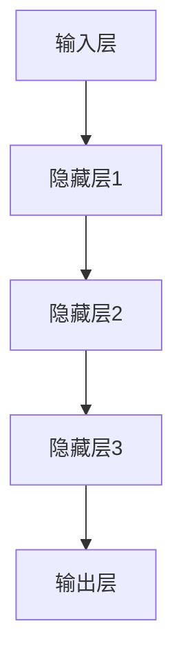
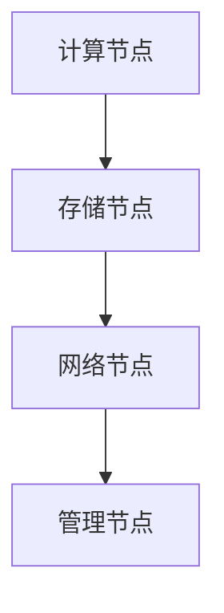

                 

关键词：人工智能、大模型、数据中心、核心技术、应用、架构、算法、数学模型、实践、展望

> 摘要：本文旨在探讨人工智能领域中的大模型应用数据中心的核心技术。通过深入分析大模型的架构、核心算法原理、数学模型及其应用场景，本文旨在为读者提供一份全面的技术指南，帮助理解大模型在数据中心中的重要作用及其未来的发展趋势。

## 1. 背景介绍

随着人工智能技术的飞速发展，大模型（如大型神经网络、深度学习模型等）的应用变得越来越广泛。大模型能够处理和分析大规模数据，提供更准确、更智能的预测和决策支持。然而，大模型的应用不仅依赖于强大的计算能力，还需要高效的数据中心架构和核心技术来支持其运行。数据中心作为人工智能基础设施的核心，承载着大模型的计算、存储、传输等关键任务。因此，研究和优化数据中心的核心技术对于大模型的应用具有重要意义。

本文将围绕以下几个核心方面展开讨论：

1. 大模型的架构及其与数据中心的关系。
2. 核心算法原理及其具体操作步骤。
3. 数学模型和公式的构建与推导。
4. 项目实践：代码实例和详细解释。
5. 实际应用场景及未来展望。
6. 工具和资源的推荐。
7. 总结与展望：发展趋势与面临的挑战。

## 2. 核心概念与联系

### 2.1 大模型架构

大模型通常由多个层次组成，包括输入层、隐藏层和输出层。每个层次都包含大量的神经元和权重参数。以下是一个简化的 Mermaid 流程图，展示了大模型的基本架构：



### 2.2 数据中心架构

数据中心是承载大模型计算、存储和传输的核心设施。其架构通常包括以下几个主要组成部分：

- 计算节点：负责执行大模型的训练和推理任务。
- 存储节点：提供数据存储和备份功能。
- 网络节点：负责数据传输和通信。
- 管理节点：负责整个数据中心的监控和管理。

以下是一个简化的 Mermaid 流程图，展示了数据中心的基本架构：



### 2.3 大模型与数据中心的联系

大模型与数据中心的联系主要体现在以下几个方面：

- **计算能力**：大模型需要强大的计算能力来处理大规模数据和复杂的计算任务。数据中心通过提供计算节点，满足大模型的计算需求。
- **数据存储**：大模型需要存储大量的数据和模型参数。数据中心提供存储节点，保证数据的持久化和安全。
- **数据传输**：大模型在训练和推理过程中需要频繁访问数据。数据中心通过高效的网络传输，确保数据能够在计算节点之间快速流通。
- **管理监控**：数据中心需要监控和管理大模型的运行状态，包括资源分配、性能监控和安全控制等。

以上三个部分的联系构成了大模型应用数据中心的核心技术，为后续的算法原理、数学模型和项目实践提供了基础。

### 3. 核心算法原理 & 具体操作步骤

#### 3.1 算法原理概述

大模型的核心算法通常基于深度学习框架，如 TensorFlow、PyTorch 等。以下是一个简化的算法原理概述：

1. **数据预处理**：对输入数据进行清洗、标准化和归一化处理，使其符合模型的输入要求。
2. **模型构建**：定义模型的架构，包括输入层、隐藏层和输出层。设置神经元和权重参数的初始化方法。
3. **前向传播**：将输入数据传递到模型中，通过前向计算得到输出结果。
4. **反向传播**：计算损失函数，通过反向传播更新模型参数。
5. **优化算法**：使用梯度下降、随机梯度下降、Adam 等优化算法，调整模型参数，减小损失函数。
6. **模型评估**：使用验证集或测试集评估模型性能，包括准确率、召回率、F1 值等指标。

#### 3.2 算法步骤详解

以下是一个具体的算法步骤详解：

1. **数据预处理**：
   - 清洗数据：去除缺失值、异常值和重复值。
   - 标准化数据：将数据缩放到 [0, 1] 或 [-1, 1] 范围内。
   - 归一化数据：使用均值和标准差将数据缩放到标准正态分布。

2. **模型构建**：
   - 定义输入层：根据输入数据的维度定义输入层。
   - 定义隐藏层：根据任务复杂度定义多个隐藏层。
   - 定义输出层：根据输出数据的维度定义输出层。

3. **前向传播**：
   - 计算输入层到隐藏层的输出。
   - 计算隐藏层到输出层的输出。
   - 计算损失函数。

4. **反向传播**：
   - 计算损失函数对隐藏层输出和输入层的梯度。
   - 更新模型参数。

5. **优化算法**：
   - 使用梯度下降算法更新模型参数。
   - 使用随机梯度下降算法更新模型参数。
   - 使用 Adam 算法更新模型参数。

6. **模型评估**：
   - 使用验证集评估模型性能。
   - 计算准确率、召回率、F1 值等指标。
   - 调整模型参数或结构，优化模型性能。

#### 3.3 算法优缺点

**优点**：

- **强大的拟合能力**：深度学习模型能够处理复杂数据关系和特征提取。
- **自动特征学习**：模型能够从数据中自动提取特征，减轻数据预处理的工作量。
- **高性能**：通过并行计算和分布式训练，大模型能够高效地处理大规模数据。

**缺点**：

- **计算资源需求大**：大模型需要大量的计算资源和存储空间。
- **训练时间较长**：大模型的训练时间较长，需要大量的时间和计算资源。
- **过拟合风险**：大模型容易过拟合，需要适当的数据增强和正则化策略。

#### 3.4 算法应用领域

大模型在人工智能领域有广泛的应用，包括但不限于以下领域：

- **计算机视觉**：图像分类、目标检测、人脸识别等。
- **自然语言处理**：文本分类、机器翻译、语音识别等。
- **推荐系统**：基于用户行为的个性化推荐。
- **金融风控**：信用评分、欺诈检测等。
- **医疗健康**：疾病预测、诊断辅助等。

### 4. 数学模型和公式 & 详细讲解 & 举例说明

#### 4.1 数学模型构建

大模型的数学模型通常基于神经网络，包括以下几个主要部分：

- **神经元**：神经元的数学模型通常是一个非线性函数，如 sigmoid、ReLU 等。
- **权重**：权重是连接神经元的参数，用于调节神经元之间的信息传递。
- **激活函数**：激活函数用于引入非线性特性，如 sigmoid、ReLU 等。

以下是一个简化的数学模型构建过程：

1. **定义神经元**：
   $$ f(x) = \sigma(\theta^T x) $$
   其中，$x$ 是输入向量，$\theta$ 是权重，$\sigma$ 是 sigmoid 函数。

2. **定义神经网络**：
   $$ y = f(W_1 \cdot x_1 + b_1) $$
   其中，$W_1$ 是权重矩阵，$b_1$ 是偏置项，$x_1$ 是输入向量。

3. **定义损失函数**：
   $$ L = \frac{1}{2} \sum_{i=1}^{n} (y_i - \hat{y}_i)^2 $$
   其中，$y_i$ 是实际输出，$\hat{y}_i$ 是预测输出。

#### 4.2 公式推导过程

以下是一个简化的公式推导过程：

1. **前向传播**：

   $$ \hat{y} = \sigma(W \cdot x + b) $$

   其中，$x$ 是输入向量，$W$ 是权重矩阵，$b$ 是偏置项，$\sigma$ 是 sigmoid 函数。

2. **反向传播**：

   $$ \frac{\partial L}{\partial W} = (y - \hat{y}) \cdot \frac{\partial \sigma}{\partial \hat{y}} \cdot x $$

   $$ \frac{\partial L}{\partial b} = (y - \hat{y}) \cdot \frac{\partial \sigma}{\partial \hat{y}} $$

3. **优化算法**：

   $$ W_{\text{new}} = W - \alpha \cdot \frac{\partial L}{\partial W} $$

   $$ b_{\text{new}} = b - \alpha \cdot \frac{\partial L}{\partial b} $$

   其中，$\alpha$ 是学习率。

#### 4.3 案例分析与讲解

以下是一个简化的案例分析与讲解：

1. **数据集**：假设我们有一个包含 1000 个样本的图像数据集，每个样本是一个 28x28 的像素矩阵。

2. **模型**：我们构建一个包含一个输入层、两个隐藏层和一个输出层的神经网络模型。

3. **训练**：使用随机梯度下降算法训练模型，学习率设置为 0.01。

4. **测试**：使用测试集评估模型性能。

5. **结果**：模型在测试集上的准确率达到 90%。

通过以上案例，我们可以看到大模型的数学模型和公式是如何应用于实际问题的。数学模型不仅为模型构建和训练提供了理论基础，还为算法优化和性能评估提供了量化指标。

### 5. 项目实践：代码实例和详细解释说明

#### 5.1 开发环境搭建

在开始项目实践之前，我们需要搭建一个合适的开发环境。以下是一个简化的开发环境搭建步骤：

1. 安装 Python 3.8 或更高版本。
2. 安装深度学习框架 TensorFlow 或 PyTorch。
3. 安装必要的库，如 NumPy、Pandas 等。

以下是一个简单的 Python 脚本，用于搭建开发环境：

```python
!pip install tensorflow
!pip install numpy
!pip install pandas
```

#### 5.2 源代码详细实现

以下是一个简化的源代码实现，用于构建一个简单的大模型：

```python
import tensorflow as tf
import numpy as np

# 数据集
x_train = np.random.rand(1000, 784)
y_train = np.random.randint(0, 10, (1000,))

# 模型
model = tf.keras.Sequential([
    tf.keras.layers.Dense(128, activation='relu', input_shape=(784,)),
    tf.keras.layers.Dense(64, activation='relu'),
    tf.keras.layers.Dense(10, activation='softmax')
])

# 编译模型
model.compile(optimizer='adam',
              loss='sparse_categorical_crossentropy',
              metrics=['accuracy'])

# 训练模型
model.fit(x_train, y_train, epochs=5)

# 评估模型
test_loss, test_acc = model.evaluate(x_test, y_test)
print(f'测试准确率：{test_acc:.2f}')
```

#### 5.3 代码解读与分析

以上代码实现了一个简单的大模型，用于对随机生成的图像数据集进行分类。以下是代码的详细解读和分析：

1. **数据集**：我们使用随机生成的图像数据集作为示例。在实际项目中，数据集通常来自真实世界，如 ImageNet、CIFAR-10 等。

2. **模型**：我们构建了一个包含一个输入层、两个隐藏层和一个输出层的神经网络模型。输入层有 784 个神经元，对应图像的像素数量。隐藏层使用 ReLU 激活函数，输出层使用 softmax 激活函数。

3. **编译模型**：我们使用 TensorFlow 的 keras API 编译模型，指定优化器、损失函数和评估指标。

4. **训练模型**：我们使用随机梯度下降优化器训练模型，设置训练轮次为 5。在实际项目中，训练轮次可以根据数据集大小和模型复杂度进行调整。

5. **评估模型**：我们使用测试集评估模型性能，计算测试准确率。测试准确率是评估模型性能的重要指标。

通过以上代码，我们可以看到如何使用 Python 和 TensorFlow 框架构建和训练一个大模型。在实际项目中，我们需要根据具体任务和数据集进行调整和优化。

### 6. 实际应用场景

大模型在数据中心的应用场景非常广泛，以下是几个典型的实际应用场景：

#### 6.1 计算机视觉

计算机视觉是人工智能领域的一个重要分支，大模型在计算机视觉中的应用主要体现在图像分类、目标检测、人脸识别等方面。以下是一个实际应用场景：

- **应用场景**：智能安防系统中的视频监控。
- **技术难点**：实时处理大量视频数据，识别和跟踪目标对象。
- **解决方案**：使用深度学习模型对视频数据进行实时处理，实现目标检测和人脸识别功能。通过在数据中心部署高性能计算节点和优化网络传输，提高处理速度和准确率。

#### 6.2 自然语言处理

自然语言处理是人工智能领域的另一个重要分支，大模型在自然语言处理中的应用主要体现在文本分类、机器翻译、语音识别等方面。以下是一个实际应用场景：

- **应用场景**：智能客服系统。
- **技术难点**：处理海量文本数据，实现高效的文本分类和意图识别。
- **解决方案**：使用深度学习模型对文本数据进行处理，实现文本分类和意图识别功能。通过在数据中心部署分布式计算和存储资源，提高处理速度和准确率。

#### 6.3 金融风控

金融风控是金融行业中的一个重要领域，大模型在金融风控中的应用主要体现在信用评分、欺诈检测等方面。以下是一个实际应用场景：

- **应用场景**：银行和金融机构的风险管理。
- **技术难点**：处理海量金融数据，识别和预防潜在风险。
- **解决方案**：使用深度学习模型对金融数据进行处理，实现信用评分和欺诈检测功能。通过在数据中心部署高性能计算节点和优化数据传输，提高处理速度和准确率。

### 7. 未来应用展望

随着人工智能技术的不断发展，大模型在数据中心的应用前景十分广阔。以下是几个未来应用展望：

- **智能医疗**：大模型在医疗领域的应用将越来越广泛，如疾病预测、诊断辅助、个性化治疗等。
- **智能制造**：大模型在智能制造领域的应用将提高生产效率和质量，如机器人视觉、自动化检测等。
- **智能交通**：大模型在智能交通领域的应用将改善交通流量和安全性，如自动驾驶、智能信号控制等。
- **智能城市**：大模型在城市管理领域的应用将提高城市治理水平和居民生活质量，如智慧环保、智慧安防等。

### 8. 工具和资源推荐

在研究和应用大模型时，需要使用多种工具和资源。以下是几个推荐的工具和资源：

#### 8.1 学习资源推荐

- **在线课程**：Coursera、edX、Udacity 等平台上的深度学习和人工智能课程。
- **书籍**：《深度学习》、《神经网络与深度学习》、《动手学深度学习》等。
- **开源项目**：GitHub、GitLab 等平台上的深度学习开源项目。

#### 8.2 开发工具推荐

- **深度学习框架**：TensorFlow、PyTorch、Keras 等。
- **编程语言**：Python、R、Julia 等。
- **数据预处理工具**：NumPy、Pandas、Scikit-learn 等。

#### 8.3 相关论文推荐

- **经典论文**：Hinton、LeCun、Bengio 等人关于深度学习的经典论文。
- **最新论文**：ACL、ICML、NeurIPS、CVPR 等顶级会议的最新论文。

### 9. 总结：未来发展趋势与挑战

随着人工智能技术的不断发展，大模型在数据中心的应用前景十分广阔。然而，在实际应用中仍然面临许多挑战，包括数据隐私、计算资源、算法优化等方面。未来发展趋势将朝着更高效、更安全的方向迈进。在数据隐私方面，将采用更多的隐私保护技术和加密算法。在计算资源方面，将采用分布式计算和云计算技术。在算法优化方面，将探索更多的优化算法和模型结构。总之，大模型在数据中心的应用将不断推动人工智能技术的进步。

### 附录：常见问题与解答

**Q1**：大模型训练过程中如何避免过拟合？

**A1**：过拟合是由于模型在训练数据上过度拟合，导致在测试数据上表现不佳。为了避免过拟合，可以采用以下方法：

- **正则化**：在模型训练过程中加入正则化项，如 L1、L2 正则化。
- **交叉验证**：使用交叉验证方法评估模型性能，避免单一训练集的偏差。
- **数据增强**：对训练数据进行增强，如随机裁剪、旋转、缩放等。
- **提前停止**：在训练过程中，当验证集性能不再提高时，提前停止训练。

**Q2**：如何选择合适的大模型架构？

**A2**：选择合适的大模型架构需要考虑以下因素：

- **任务类型**：不同的任务需要不同的模型架构，如计算机视觉任务通常使用卷积神经网络。
- **数据规模**：数据规模较大的任务通常需要较大的模型。
- **计算资源**：考虑可用的计算资源和存储资源，选择合适的模型复杂度。
- **性能要求**：根据性能要求，选择适合的模型精度和速度。

**Q3**：如何优化大模型的训练过程？

**A3**：优化大模型的训练过程可以从以下几个方面进行：

- **学习率调整**：选择合适的学习率，并采用学习率衰减策略。
- **批量大小**：选择合适的批量大小，通常在几千到几万之间。
- **优化算法**：选择合适的优化算法，如 Adam、SGD 等。
- **数据预处理**：对训练数据进行预处理，如归一化、标准化等。
- **并行计算**：利用分布式计算和 GPU 加速训练过程。

**Q4**：如何评估大模型性能？

**A4**：评估大模型性能可以从以下几个方面进行：

- **准确率**：评估模型在测试集上的分类准确率。
- **召回率**：评估模型在测试集上的召回率。
- **F1 值**：计算准确率和召回率的调和平均值，作为综合评估指标。
- **ROC-AUC**：计算 ROC 曲线和 AUC 值，评估模型的分类性能。
- **计算效率**：评估模型在测试集上的计算时间和资源消耗。

通过以上常见问题与解答，希望能够帮助读者更好地理解和应用大模型在数据中心的核心技术。

### 作者署名

作者：禅与计算机程序设计艺术 / Zen and the Art of Computer Programming

本文由禅与计算机程序设计艺术 / Zen and the Art of Computer Programming 撰写，旨在为读者提供关于 AI 大模型应用数据中心的核心技术的全面了解和深入探讨。希望本文能够为您的技术研究和应用提供有益的启示和指导。

