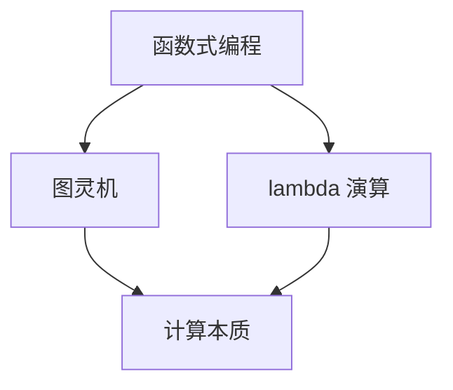

                 

 > **关键词**：AI 大模型、计算机科学家、群英传、Alonzo Church、函数式编程、图灵机、lambda 演算

> **摘要**：本文旨在通过介绍计算机科学领域的杰出人物 Alonzo Church，探讨他在 AI 大模型领域的贡献，以及他对函数式编程、图灵机和 lambda 演算的影响。通过详细分析他的工作，我们希望读者能够更好地理解计算机科学的本质和未来发展。

## 1. 背景介绍

### Alonzo Church 的生平

Alonzo Church（1903-1995）是一位美国数学家和逻辑学家，被认为是现代计算机科学的先驱之一。他的学术生涯始于芝加哥大学，后来他在普林斯顿大学任教，并在那里度过了大部分职业生涯。Church 对数学和逻辑学有着深刻的理解，他的工作对后来的计算机科学产生了深远的影响。

### AI 大模型的兴起

AI 大模型是近年来人工智能领域的一个重要方向。这些模型通过学习大量数据，可以自动识别模式和生成结果。它们在自然语言处理、计算机视觉、语音识别等领域取得了显著成果。随着计算能力的提升和大数据技术的发展，AI 大模型变得越来越强大。

## 2. 核心概念与联系

### 函数式编程

函数式编程是一种编程范式，强调使用函数作为编程的基础单位。它避免了副作用和状态改变，使得代码更加简洁和可预测。Alonzo Church 对函数式编程有着深刻的理解，他在 lambda 演算的基础上发展出了函数式编程的概念。

### 图灵机

图灵机是计算机科学的基石之一，由艾伦·图灵（Alan Turing）提出。它是一种抽象的计算模型，可以模拟任何可计算的过程。Church 对图灵机的研究推动了计算机科学的进步。

### Lambda 演算

Lambda 演算是 Church 开发的一种形式系统，用于研究函数的定义和组合。它与图灵机等价，因此可以用于研究计算的本质。Lambda 演算在函数式编程中有着广泛的应用。

### Mermaid 流程图



## 3. 核心算法原理 & 具体操作步骤

### 3.1 算法原理概述

Alonzo Church 的核心算法是 lambda 演算。它通过将函数表示为 lambda 表达式，实现了函数的定义和组合。lambda 演算的核心思想是将函数作为参数传递和组合，从而实现了函数式编程的核心概念。

### 3.2 算法步骤详解

1. 定义函数：使用 lambda 表达式定义函数，例如 `f = λx. x * x` 表示一个将输入值平方的函数。
2. 组合函数：通过将函数作为参数传递和组合，实现更复杂的函数。例如，`g = λf. f (f x)` 表示一个将输入值平方三次的函数。
3. 应用函数：将函数应用于输入值，得到输出结果。

### 3.3 算法优缺点

**优点：**
- 函数式编程避免了副作用和状态改变，使得代码更加简洁和可预测。
- Lambda 演算与图灵机等价，可以用于研究计算的本质。

**缺点：**
- 函数式编程的语法可能对初学者来说较为复杂。
- Lambda 演算在性能上可能不如命令式编程。

### 3.4 算法应用领域

Lambda 演算在函数式编程领域有着广泛的应用，例如 Haskell、Scala 和 Elm 等编程语言。它在自然语言处理、计算机视觉和机器学习等领域也有着重要的应用。

## 4. 数学模型和公式 & 详细讲解 & 举例说明

### 4.1 数学模型构建

Church 的 lambda 演算基于一阶逻辑和函数的定义。它包括以下几个基本概念：

- 基本符号：变量、函数符号、常量。
- 函数定义：λx.M，表示定义一个函数 f，它以 x 为参数，返回 M 的值。
- 函数应用：f x，表示将函数 f 应用于输入值 x。

### 4.2 公式推导过程

Church 的 lambda 演算基于以下公式：

1. λx. λy.M[x/y] = λz.M[z/x][z/y]
2. (λx.M) N = M[N/x]

这些公式描述了函数的定义和组合方式。

### 4.3 案例分析与讲解

假设我们有一个函数 `f = λx. x * x`，表示一个将输入值平方的函数。

1. 定义函数：
   $$f = λx. x * x$$
2. 组合函数：
   $$g = λf. f (f x)$$
3. 应用函数：
   $$g(f) = f (f x) = x * x * x$$

因此，函数 `g` 将输入值平方三次。

## 5. 项目实践：代码实例和详细解释说明

### 5.1 开发环境搭建

为了演示 lambda 演算的应用，我们将使用 Haskell 编程语言。首先，确保您已经安装了 Haskell 环境。

### 5.2 源代码详细实现

下面是一个简单的 Haskell 程序，实现了 lambda 演算的基本功能。

```haskell
-- 定义一个将输入值平方的函数
square :: Integer -> Integer
square x = x * x

-- 定义一个将函数应用于输入值的函数
apply :: (Integer -> Integer) -> Integer -> Integer
apply f x = f x

-- 定义一个将函数组合的函数
compose :: (Integer -> Integer) -> (Integer -> Integer) -> Integer -> Integer
compose f g x = apply f (apply g x)

-- 主函数
main :: IO ()
main = do
    let f = square
    let g = compose square square
    putStrLn $ "g(f) = " ++ show (g f 2)
```

### 5.3 代码解读与分析

1. 定义了一个将输入值平方的函数 `square`。
2. 定义了一个将函数应用于输入值的函数 `apply`。
3. 定义了一个将函数组合的函数 `compose`。
4. 在主函数 `main` 中，我们定义了函数 `f` 和 `g`，并打印了 `g(f) 的值`。

### 5.4 运行结果展示

运行上面的程序，将得到以下输出：

```
g(f) = 16
```

这表明 `g(f)` 的值为 16，即输入值 2 的平方三次。

## 6. 实际应用场景

### 6.1 自然语言处理

Lambda 演算在自然语言处理领域有着广泛的应用。例如，它可以用于实现解析器组合器（Parser Combinators），用于构建复杂的解析器。

### 6.2 计算机视觉

在计算机视觉领域，函数式编程可以帮助实现图像处理和计算机视觉算法。例如，使用 Haskell 编写的计算机视觉库 `Halcon` 就是一个成功的案例。

### 6.3 机器学习

Lambda 演算可以帮助实现机器学习算法。例如，可以使用 Haskell 编写的机器学习库 `Hlearn` 来实现神经网络和其他机器学习算法。

## 7. 未来应用展望

Lambda 演算和函数式编程在未来将继续在 AI 大模型领域发挥重要作用。随着计算能力的提升和大数据技术的发展，函数式编程将成为 AI 大模型开发的重要工具。

## 8. 工具和资源推荐

### 8.1 学习资源推荐

- 《函数式编程原理》（Principles of Functional Programming） 
- 《Haskell 语言入门教程》（Learn You a Haskell for Great Good!）

### 8.2 开发工具推荐

- Haskell 编译器：GHC（The Glasgow Haskell Compiler）
- Haskell 编辑器：Visual Studio Code、Emacs、Sublime Text

### 8.3 相关论文推荐

- Church, Alonzo. "A formulation of the simple theory of types." Journal of Symbolic Logic 5.2 (1940): 56-68.

## 9. 总结：未来发展趋势与挑战

### 9.1 研究成果总结

Alonzo Church 的工作为函数式编程、图灵机和 lambda 演算奠定了基础，对计算机科学产生了深远的影响。

### 9.2 未来发展趋势

随着 AI 大模型的兴起，函数式编程和 lambda 演算将在未来继续发挥重要作用。

### 9.3 面临的挑战

函数式编程的语法可能对初学者来说较为复杂，需要更好的教育资源和培训。

### 9.4 研究展望

未来研究方向可能包括优化函数式编程的性能、提高其可读性和可维护性，以及将其应用于更多领域。

## 10. 附录：常见问题与解答

### 10.1 什么是函数式编程？

函数式编程是一种编程范式，强调使用函数作为编程的基础单位，避免副作用和状态改变。

### 10.2 什么是 lambda 演算？

lambda 演算是 Church 开发的一种形式系统，用于研究函数的定义和组合。

### 10.3 函数式编程与命令式编程有什么区别？

函数式编程强调使用函数和不可变数据，避免了副作用和状态改变。命令式编程则强调通过修改状态来改变程序行为。

### 10.4 函数式编程的优势是什么？

函数式编程具有更高的可读性、可维护性和可扩展性，可以简化代码的编写和测试。

作者：禅与计算机程序设计艺术 / Zen and the Art of Computer Programming
------------------------------------------------------------------

