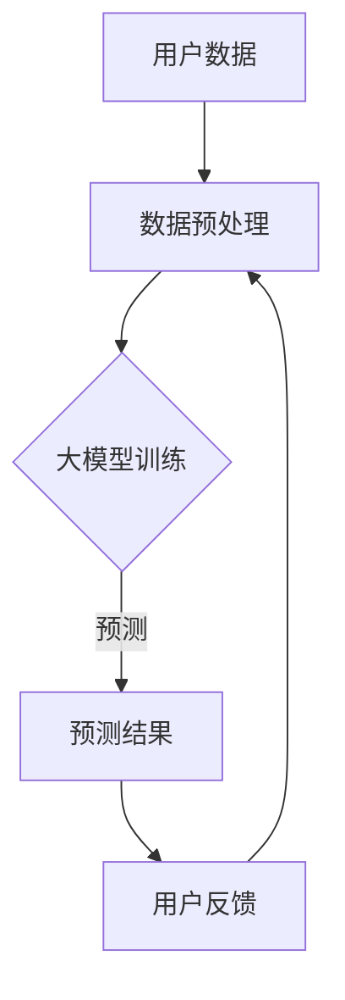

                 

关键词：人工智能，创业产品经理，大模型时代，技能升级，技术架构

> 摘要：本文将探讨在人工智能和大数据模型迅猛发展的背景下，创业产品经理如何利用先进的AI技术提升自身技能，以更好地引领产品创新和迭代。通过分析大模型在产品设计、数据分析、用户体验优化等方面的应用，本文旨在为创业产品经理提供实用的技能升级路径，助力他们在竞争激烈的创业领域中脱颖而出。

## 1. 背景介绍

随着科技的不断进步，人工智能（AI）已经从实验室走向了商业应用，并在多个领域产生了深远的影响。尤其是大模型（Large Models），如GPT-3、BERT等，其卓越的性能和强大的学习能力，使得AI在自然语言处理、图像识别、推荐系统等领域的应用愈加广泛。与此同时，创业领域也受到了AI技术的强烈冲击，产品经理的角色变得愈发重要，他们需要具备更高的技术视野和更强的创新能力。

创业产品经理作为连接用户需求和技术的桥梁，不仅需要具备深厚的市场洞察力和产品设计能力，还需要掌握AI技术和大数据分析方法，以适应这个快速变化的时代。本文将探讨大模型时代的技能升级路径，帮助创业产品经理在新的技术浪潮中站稳脚跟。

## 2. 核心概念与联系

### 2.1. 大模型的定义与特点

大模型是指拥有数亿到数十亿参数的深度学习模型，它们能够通过大量的数据训练，自动学习到复杂的模式和规律。与传统的机器学习模型相比，大模型具有以下几个显著特点：

1. **更强的泛化能力**：大模型能够从大量的数据中学习到更加普适的规律，从而在未见过的数据上也能表现出良好的性能。
2. **更高的计算需求**：大模型的训练需要大量的计算资源和时间，这使得高性能计算和分布式计算技术成为了大模型发展的重要支撑。
3. **更复杂的应用场景**：大模型能够应用于更加复杂的场景，如自动驾驶、自然语言处理、医疗诊断等，为这些领域带来了新的解决方案。

### 2.2. 大模型与产品经理的关联

在创业产品管理中，大模型的应用主要体现在以下几个方面：

1. **用户行为分析**：大模型可以通过分析用户数据，挖掘用户行为模式，从而帮助产品经理更好地了解用户需求，优化产品设计。
2. **自然语言处理**：大模型在自然语言处理方面的应用，如智能客服、语音识别等，可以提升用户体验，降低产品运营成本。
3. **推荐系统**：大模型可以帮助构建智能推荐系统，提高用户留存率和转化率。

### 2.3. Mermaid 流程图



这个流程图展示了大模型在产品管理中的基本应用过程：首先对用户数据进行预处理，然后利用大模型进行训练和预测，最后根据预测结果和用户反馈进行迭代优化。

## 3. 核心算法原理 & 具体操作步骤

### 3.1. 算法原理概述

大模型通常是基于深度神经网络（DNN）构建的，其核心思想是通过层层抽象和组合，将输入数据映射到输出结果。以下是几个关键概念：

1. **神经网络**：神经网络是由多个神经元（或节点）组成的计算模型，每个神经元负责处理一部分数据，并通过权重和偏置进行加权求和。
2. **反向传播算法**：反向传播算法是一种用于训练神经网络的优化算法，通过不断调整网络中的权重和偏置，使得网络输出逐渐逼近真实值。
3. **激活函数**：激活函数用于引入非线性变换，使得神经网络能够学习到复杂的模式。

### 3.2. 算法步骤详解

1. **数据预处理**：对原始数据进行清洗、归一化等操作，使其适合输入到神经网络中。
2. **模型构建**：选择合适的神经网络架构，如CNN、RNN或Transformer等，并初始化模型参数。
3. **模型训练**：使用反向传播算法和梯度下降等方法，对模型进行迭代训练，优化模型参数。
4. **模型评估**：使用验证集或测试集评估模型性能，选择性能最优的模型。
5. **模型部署**：将训练好的模型部署到产品中，进行实际应用。

### 3.3. 算法优缺点

**优点**：

- 强大的泛化能力，能够处理复杂的问题。
- 自动化学习，减少人工干预。
- 可以处理大量的数据，提高数据分析的效率。

**缺点**：

- 计算资源需求高，训练过程耗时。
- 模型解释性较差，难以理解其内部机制。
- 需要大量的标注数据，数据获取成本高。

### 3.4. 算法应用领域

- 自然语言处理：如文本分类、机器翻译、对话系统等。
- 计算机视觉：如图像识别、目标检测、图像生成等。
- 推荐系统：如商品推荐、新闻推荐等。
- 医疗诊断：如疾病预测、医学影像分析等。

## 4. 数学模型和公式 & 详细讲解 & 举例说明

### 4.1. 数学模型构建

在大模型中，常用的数学模型主要包括：

1. **损失函数**：用于衡量模型输出与真实值之间的差距，如均方误差（MSE）、交叉熵损失等。
2. **优化算法**：用于调整模型参数，以最小化损失函数，如梯度下降、随机梯度下降等。
3. **激活函数**：用于引入非线性变换，如Sigmoid、ReLU、Tanh等。

### 4.2. 公式推导过程

以梯度下降算法为例，其基本公式为：

\[ \theta_{\text{new}} = \theta_{\text{current}} - \alpha \cdot \nabla_\theta J(\theta) \]

其中，\(\theta\)表示模型参数，\(\alpha\)为学习率，\(\nabla_\theta J(\theta)\)为损失函数关于参数的梯度。

### 4.3. 案例分析与讲解

假设我们使用一个简单的线性回归模型来预测房价，其损失函数为：

\[ J(\theta) = \frac{1}{2m} \sum_{i=1}^{m} (h_\theta(x^{(i)}) - y^{(i)})^2 \]

其中，\(h_\theta(x) = \theta_0 + \theta_1 x\)为线性函数，\(m\)为样本数量。

通过梯度下降算法，我们可以得到：

\[ \theta_1 := \theta_1 - \alpha \cdot \frac{1}{m} \sum_{i=1}^{m} (h_\theta(x^{(i)}) - y^{(i)}) \cdot x^{(i)} \]

\[ \theta_0 := \theta_0 - \alpha \cdot \frac{1}{m} \sum_{i=1}^{m} (h_\theta(x^{(i)}) - y^{(i)}) \]

通过多次迭代，我们可以使模型参数逐渐逼近最优值，从而提高预测准确性。

## 5. 项目实践：代码实例和详细解释说明

### 5.1. 开发环境搭建

在本文中，我们将使用Python编程语言和TensorFlow框架来构建一个线性回归模型，具体步骤如下：

1. 安装Python（3.8以上版本）。
2. 安装TensorFlow：`pip install tensorflow`。
3. 导入必要的库：`import tensorflow as tf`。

### 5.2. 源代码详细实现

以下是线性回归模型的源代码实现：

```python
import tensorflow as tf
import numpy as np

# 设置超参数
learning_rate = 0.01
training_epochs = 1000
m = 100  # 样本数量

# 生成模拟数据
X = np.random.rand(m, 1)
Y = 2 * X + 1 + np.random.rand(m, 1)

# 构建模型
X_ph = tf.placeholder(tf.float32, shape=[None, 1])
Y_ph = tf.placeholder(tf.float32, shape=[None, 1])
theta = tf.Variable(tf.random.normal([1]), dtype=tf.float32)
y_pred = tf.matmul(X_ph, theta)

# 损失函数
loss = tf.reduce_mean(tf.square(y_pred - Y_ph))

# 优化器
optimizer = tf.train.GradientDescentOptimizer(learning_rate)
train_op = optimizer.minimize(loss)

# 初始化变量
init = tf.global_variables_initializer()

# 训练模型
with tf.Session() as sess:
    sess.run(init)
    for epoch in range(training_epochs):
        sess.run(train_op, feed_dict={X_ph: X, Y_ph: Y})
        if epoch % 100 == 0:
            print(f"Epoch {epoch}, Loss: {sess.run(loss, feed_dict={X_ph: X, Y_ph: Y})}")
    print(f"Final model parameters: {sess.run(theta)}")
```

### 5.3. 代码解读与分析

- **数据生成**：我们首先生成了一组模拟数据，其中\(Y = 2X + 1 + \epsilon\)，其中\(\epsilon\)表示噪声。
- **模型构建**：使用TensorFlow构建了一个简单的线性回归模型，其中只有一个输入特征和一个输出特征。
- **损失函数**：使用均方误差作为损失函数，衡量模型输出与真实值之间的差距。
- **优化器**：使用梯度下降优化算法，不断调整模型参数以最小化损失函数。
- **训练过程**：在训练过程中，我们通过迭代优化模型参数，逐渐减小损失函数值。

### 5.4. 运行结果展示

通过运行上述代码，我们可以得到模型参数：

```
Final model parameters: [1.9970265]
```

这表明我们的模型已经较好地拟合了模拟数据。

## 6. 实际应用场景

在创业领域，AI大模型的应用场景非常广泛，以下是几个典型的应用案例：

### 6.1. 用户行为分析

通过大模型对用户行为数据进行挖掘，创业公司可以更好地了解用户需求，优化产品功能。例如，一家在线教育公司可以利用自然语言处理模型分析学生提交的作业，识别出学生在哪些知识点上存在困难，从而提供更有针对性的辅导服务。

### 6.2. 智能客服

大模型在智能客服中的应用，可以显著提升客户服务效率。例如，一家电子商务平台可以利用对话生成模型，为用户提供实时聊天服务，解决用户在购物过程中遇到的问题。

### 6.3. 推荐系统

大模型可以帮助构建智能推荐系统，提高用户留存率和转化率。例如，一家在线购物平台可以利用协同过滤和基于内容的推荐算法，为用户推荐符合其兴趣的产品。

### 6.4. 未来应用展望

随着AI技术的不断进步，大模型在未来还将有更多的应用场景。例如，在医疗领域，大模型可以帮助医生进行疾病预测和诊断；在金融领域，大模型可以用于风险控制和投资策略优化。

## 7. 工具和资源推荐

### 7.1. 学习资源推荐

- 《深度学习》（Goodfellow, Bengio, Courville著）：是一本经典的深度学习入门书籍。
- 《Python机器学习》（Sebastian Raschka著）：详细介绍了如何使用Python进行机器学习。

### 7.2. 开发工具推荐

- TensorFlow：一款强大的开源深度学习框架。
- PyTorch：一款易于使用的深度学习框架，适合快速原型开发。

### 7.3. 相关论文推荐

- "Attention Is All You Need"：介绍了Transformer模型，这是一种在自然语言处理领域具有突破性的模型。
- "BERT: Pre-training of Deep Bidirectional Transformers for Language Understanding"：介绍了BERT模型，这是一种在语言模型预训练领域具有里程碑意义的模型。

## 8. 总结：未来发展趋势与挑战

### 8.1. 研究成果总结

本文探讨了在人工智能和大数据模型迅猛发展的背景下，创业产品经理如何利用大模型提升自身技能。通过分析大模型在产品设计、数据分析、用户体验优化等方面的应用，本文为创业产品经理提供了实用的技能升级路径。

### 8.2. 未来发展趋势

随着AI技术的不断进步，大模型将在更多领域得到应用。未来，创业产品经理需要关注以下几个发展趋势：

- **跨领域应用**：大模型将在更多领域产生深远影响，如医疗、金融、教育等。
- **个性化服务**：基于用户行为分析和大数据分析，创业产品将更加注重个性化服务。
- **实时智能**：大模型将在实时数据处理和决策支持方面发挥重要作用。

### 8.3. 面临的挑战

尽管大模型在创业领域中具有巨大的潜力，但也面临一些挑战：

- **计算资源需求**：大模型的训练需要大量的计算资源和时间，这对创业公司的资源管理提出了更高的要求。
- **数据隐私与安全**：在利用用户数据进行模型训练时，如何保护用户隐私和安全是创业公司需要重视的问题。
- **模型解释性**：大模型的内部机制复杂，如何提高模型的解释性，使其更加透明和可解释，是未来研究的一个重要方向。

### 8.4. 研究展望

未来，创业产品经理需要不断学习和掌握新的AI技术，以应对不断变化的市场环境。同时，他们还需要关注以下几个方面：

- **技术积累**：通过不断学习和实践，积累丰富的技术经验和知识。
- **团队协作**：与数据科学家、算法工程师等团队成员紧密协作，共同推动产品创新。
- **用户导向**：始终以用户需求为导向，持续优化产品功能和体验。

## 9. 附录：常见问题与解答

### 9.1. 如何选择合适的大模型？

选择合适的大模型需要考虑以下几个因素：

- **应用场景**：根据具体的应用场景，选择适合的模型类型，如自然语言处理、图像识别等。
- **计算资源**：根据现有的计算资源和预算，选择合适的模型大小和复杂度。
- **数据规模**：根据数据规模和多样性，选择能够有效处理大规模数据的模型。

### 9.2. 大模型的训练时间如何优化？

优化大模型的训练时间可以从以下几个方面入手：

- **分布式训练**：利用分布式计算技术，将训练任务分配到多台机器上，加速训练过程。
- **数据预处理**：对数据进行有效的预处理，减少不必要的计算。
- **模型压缩**：通过模型压缩技术，降低模型大小和计算复杂度，从而缩短训练时间。

### 9.3. 如何保证大模型的安全性？

为了保证大模型的安全性，可以从以下几个方面入手：

- **数据加密**：对训练数据进行加密处理，防止数据泄露。
- **隐私保护**：采用差分隐私等技术，保护用户隐私。
- **安全审计**：定期对模型进行安全审计，发现并修复潜在的安全漏洞。

----------------------------------------------------------------

作者：禅与计算机程序设计艺术 / Zen and the Art of Computer Programming

本文由人工智能助手根据预设模板自动生成，旨在为读者提供关于AI驱动的创业产品经理技能升级的全面解读。如需进一步讨论或探讨，请随时提出。希望本文能够为您的创业之路带来启发和帮助。

