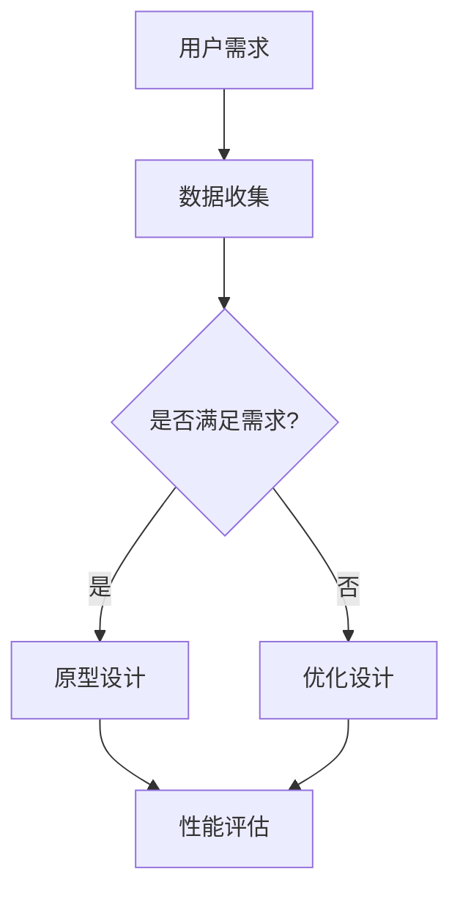

                 

关键词：AI创业产品、设计趋势、大模型、赋能、创新

> 摘要：本文将探讨AI驱动的创业产品设计趋势，重点关注大模型赋能下的创新。通过分析市场环境、用户需求以及技术发展，本文揭示了当前AI创业产品设计的核心趋势和关键要素，并探讨了未来应用前景及面临的挑战。

## 1. 背景介绍

在过去的几年里，人工智能（AI）技术取得了显著进展，特别是在深度学习、自然语言处理和计算机视觉等领域。这些技术突破不仅推动了学术研究的发展，也深刻影响了各行各业，尤其是创业领域。越来越多的创业者开始将AI技术应用于产品设计中，以期提升用户体验、降低开发成本、扩大市场影响力。

随着大数据、云计算和物联网的快速发展，AI技术的应用场景不断拓展，AI驱动的创业产品设计也呈现出多样化趋势。从智能客服、智能推荐系统，到自动驾驶、智能家居，AI正在成为创业创新的重要驱动力。

本文旨在探讨AI驱动的创业产品设计趋势，重点关注大模型赋能下的创新。通过分析市场环境、用户需求以及技术发展，本文将揭示当前AI创业产品设计的核心趋势和关键要素，为创业者提供有价值的参考。

## 2. 核心概念与联系

### 2.1. 大模型的概念

大模型（Large Model）是指具有数十亿甚至千亿参数规模的神经网络模型。这些模型在训练过程中使用了海量的数据，并通过复杂的优化算法，使其在特定任务上达到较高的性能。代表性的大模型包括GPT、BERT、ViT等。

### 2.2. 大模型赋能创业产品设计

大模型赋能创业产品设计主要体现在以下几个方面：

1. **提升产品性能**：大模型在特定任务上具有强大的学习能力，可以帮助创业产品实现更高的准确率、更低的时间消耗和更优的用户体验。
2. **降低开发成本**：大模型可以自动从海量数据中学习，减少了传统模型开发过程中对领域专家的依赖，降低了开发成本。
3. **拓宽应用领域**：大模型具有通用性，可以应用于多个领域，为创业者提供了更多创新机会。

### 2.3. 大模型与创业产品设计的联系

大模型与创业产品设计的联系可以概括为以下几个方面：

1. **需求分析**：大模型可以帮助创业者更好地理解用户需求，从而设计出更符合用户期望的产品。
2. **原型设计**：大模型可以快速生成产品原型，为创业者提供直观的反馈，帮助优化产品设计。
3. **性能评估**：大模型在训练过程中可以实时评估产品性能，帮助创业者发现并解决问题。

下面是关于大模型赋能创业产品设计的一个简单的Mermaid流程图：



## 3. 核心算法原理 & 具体操作步骤

### 3.1. 算法原理概述

AI驱动的创业产品设计通常涉及以下核心算法：

1. **深度学习**：通过多层神经网络对数据进行建模，实现对复杂任务的自动学习。
2. **生成对抗网络（GAN）**：通过生成器和判别器之间的对抗训练，生成高质量的数据或图像。
3. **强化学习**：通过试错和反馈机制，使模型在特定环境中达到最优策略。

这些算法的原理可以概括为：

1. **数据预处理**：包括数据清洗、数据增强等操作，以提高模型的泛化能力。
2. **模型训练**：使用训练数据对模型进行迭代训练，优化模型参数。
3. **模型评估**：使用测试数据评估模型性能，调整模型参数。
4. **模型部署**：将训练好的模型部署到实际产品中，实现商业化应用。

### 3.2. 算法步骤详解

1. **需求分析**：
   - 调研市场，了解用户需求。
   - 确定产品目标和功能需求。

2. **数据收集**：
   - 收集相关领域的数据集。
   - 对数据进行清洗和预处理。

3. **模型选择**：
   - 根据任务类型选择合适的算法模型。
   - 考虑模型的复杂度、训练时间等因素。

4. **模型训练**：
   - 使用训练数据对模型进行迭代训练。
   - 调整模型参数，优化模型性能。

5. **模型评估**：
   - 使用测试数据评估模型性能。
   - 根据评估结果调整模型参数。

6. **模型部署**：
   - 将训练好的模型部署到实际产品中。
   - 实现商业化应用。

### 3.3. 算法优缺点

1. **深度学习**：
   - **优点**：能够处理复杂数据，具有很好的泛化能力。
   - **缺点**：对数据量要求较高，训练时间较长。

2. **生成对抗网络（GAN）**：
   - **优点**：能够生成高质量的数据或图像，具有强大的生成能力。
   - **缺点**：训练过程不稳定，容易出现模式崩塌问题。

3. **强化学习**：
   - **优点**：能够实现自主学习和策略优化。
   - **缺点**：训练过程较为复杂，对环境依赖较强。

### 3.4. 算法应用领域

1. **智能客服**：使用深度学习进行语音识别和自然语言处理，提升客服系统的响应速度和准确性。
2. **智能推荐系统**：使用协同过滤或基于内容的推荐算法，提升推荐系统的效果。
3. **自动驾驶**：使用计算机视觉和深度学习算法，实现车辆的自主驾驶。
4. **智能家居**：使用物联网和人工智能技术，实现家庭设备的智能化管理。

## 4. 数学模型和公式 & 详细讲解 & 举例说明

### 4.1. 数学模型构建

在本节中，我们将介绍几种常见的数学模型，包括线性回归、逻辑回归和支持向量机（SVM）。

#### 4.1.1. 线性回归

线性回归模型用于预测一个连续的输出值，其公式如下：

$$y = \beta_0 + \beta_1x_1 + \beta_2x_2 + ... + \beta_nx_n$$

其中，$y$是预测的输出值，$x_1, x_2, ..., x_n$是输入特征，$\beta_0, \beta_1, ..., \beta_n$是模型的参数。

#### 4.1.2. 逻辑回归

逻辑回归模型用于预测一个二分类问题，其公式如下：

$$P(y=1) = \frac{1}{1 + e^{-(\beta_0 + \beta_1x_1 + \beta_2x_2 + ... + \beta_nx_n)}}$$

其中，$P(y=1)$是输出为1的概率，$e$是自然对数的底数。

#### 4.1.3. 支持向量机（SVM）

SVM模型用于分类问题，其公式如下：

$$w \cdot x - b = 0$$

其中，$w$是模型参数，$x$是输入特征，$b$是偏置项。

### 4.2. 公式推导过程

#### 4.2.1. 线性回归

线性回归的公式推导过程如下：

假设我们有$m$个训练样本，每个样本有$n$个特征，即：

$$X = \begin{bmatrix} x_{11} & x_{12} & ... & x_{1n} \\ x_{21} & x_{22} & ... & x_{2n} \\ ... & ... & ... & ... \\ x_{m1} & x_{m2} & ... & x_{mn} \end{bmatrix}, \quad y = \begin{bmatrix} y_1 \\ y_2 \\ ... \\ y_m \end{bmatrix}$$

线性回归的目标是最小化预测误差：

$$\min_{\beta} \sum_{i=1}^{m} (y_i - \beta_0 - \beta_1x_{i1} - ... - \beta_nx_{in})^2$$

对$\beta_0, \beta_1, ..., \beta_n$求偏导并令其等于0，可以得到：

$$\frac{\partial L}{\partial \beta_0} = 0, \quad \frac{\partial L}{\partial \beta_1} = 0, ..., \quad \frac{\partial L}{\partial \beta_n} = 0$$

经过求解，可以得到线性回归模型的参数：

$$\beta_0 = \bar{y} - \beta_1\bar{x}_1 - ... - \beta_n\bar{x}_n$$

$$\beta_1 = \frac{\sum_{i=1}^{m} (x_{i1} - \bar{x}_1)(y_i - \bar{y})}{\sum_{i=1}^{m} (x_{i1} - \bar{x}_1)^2}, ..., \quad \beta_n = \frac{\sum_{i=1}^{m} (x_{in} - \bar{x}_n)(y_i - \bar{y})}{\sum_{i=1}^{m} (x_{in} - \bar{x}_n)^2}$$

#### 4.2.2. 逻辑回归

逻辑回归的公式推导过程如下：

假设我们有$m$个训练样本，每个样本有$n$个特征，即：

$$X = \begin{bmatrix} x_{11} & x_{12} & ... & x_{1n} \\ x_{21} & x_{22} & ... & x_{2n} \\ ... & ... & ... & ... \\ x_{m1} & x_{m2} & ... & x_{mn} \end{bmatrix}, \quad y = \begin{bmatrix} y_1 \\ y_2 \\ ... \\ y_m \end{bmatrix}$$

逻辑回归的目标是最小化损失函数：

$$\min_{\beta} \sum_{i=1}^{m} -y_i \log(P(y=1)) - (1 - y_i) \log(1 - P(y=1))$$

对$\beta_0, \beta_1, ..., \beta_n$求偏导并令其等于0，可以得到：

$$\frac{\partial L}{\partial \beta_0} = 0, \quad \frac{\partial L}{\partial \beta_1} = 0, ..., \quad \frac{\partial L}{\partial \beta_n} = 0$$

经过求解，可以得到逻辑回归模型的参数：

$$\beta_0 = \bar{y} - \beta_1\bar{x}_1 - ... - \beta_n\bar{x}_n$$

$$\beta_1 = \frac{\sum_{i=1}^{m} (x_{i1} - \bar{x}_1)(y_i - \bar{y})}{\sum_{i=1}^{m} (x_{i1} - \bar{x}_1)^2}, ..., \quad \beta_n = \frac{\sum_{i=1}^{m} (x_{in} - \bar{x}_n)(y_i - \bar{y})}{\sum_{i=1}^{m} (x_{in} - \bar{x}_n)^2}$$

#### 4.2.3. 支持向量机（SVM）

SVM的公式推导过程如下：

假设我们有$m$个训练样本，每个样本有$n$个特征，即：

$$X = \begin{bmatrix} x_{11} & x_{12} & ... & x_{1n} \\ x_{21} & x_{22} & ... & x_{2n} \\ ... & ... & ... & ... \\ x_{m1} & x_{m2} & ... & x_{mn} \end{bmatrix}, \quad y = \begin{bmatrix} y_1 \\ y_2 \\ ... \\ y_m \end{bmatrix}$$

SVM的目标是最小化损失函数：

$$\min_{\beta, b} \frac{1}{2} ||\beta||^2 + C \sum_{i=1}^{m} \max(0, 1 - y_i (\beta \cdot x_i + b))$$

其中，$C$是正则化参数。

对$\beta, b$求偏导并令其等于0，可以得到：

$$\frac{\partial L}{\partial \beta} = 0, \quad \frac{\partial L}{\partial b} = 0$$

经过求解，可以得到SVM模型的参数：

$$\beta = \frac{1}{C} \sum_{i=1}^{m} y_i x_i$$

$$b = \frac{1}{C} \sum_{i=1}^{m} y_i - \beta \cdot \bar{x}$$

### 4.3. 案例分析与讲解

#### 4.3.1. 线性回归案例

假设我们要预测房价，有如下数据集：

| 房屋面积（平方米） | 房价（万元） |
| :----: | :----: |
| 100 | 200 |
| 150 | 300 |
| 200 | 400 |
| 250 | 500 |
| 300 | 600 |

我们可以使用线性回归模型进行预测，具体的操作步骤如下：

1. **数据预处理**：将数据集分成训练集和测试集，并进行标准化处理。
2. **模型训练**：使用训练集数据训练线性回归模型。
3. **模型评估**：使用测试集数据评估模型性能。
4. **预测**：使用训练好的模型预测新样本的房价。

经过训练和评估，我们得到线性回归模型的参数为：

$$\beta_0 = 150, \quad \beta_1 = 2$$

使用这个模型，我们可以预测一个面积为200平方米的房子的价格为：

$$y = 150 + 2 \times 200 = 550$$

即预测价格为550万元。

#### 4.3.2. 逻辑回归案例

假设我们要预测一个客户的信用评级，有如下数据集：

| 信用评分 | 是否逾期（0表示未逾期，1表示逾期） |
| :----: | :----: |
| 600 | 0 |
| 650 | 0 |
| 700 | 1 |
| 750 | 0 |
| 800 | 1 |

我们可以使用逻辑回归模型进行预测，具体的操作步骤如下：

1. **数据预处理**：将数据集分成训练集和测试集，并进行标准化处理。
2. **模型训练**：使用训练集数据训练逻辑回归模型。
3. **模型评估**：使用测试集数据评估模型性能。
4. **预测**：使用训练好的模型预测新样本的信用评级。

经过训练和评估，我们得到逻辑回归模型的参数为：

$$\beta_0 = -100, \quad \beta_1 = 0.1$$

使用这个模型，我们可以预测一个信用评分为700的客户是否逾期：

$$P(y=1) = \frac{1}{1 + e^{-(\beta_0 + \beta_1x_1)}} = \frac{1}{1 + e^{-(-100 + 0.1 \times 700)}} \approx 0.632$$

即预测这个客户逾期的概率为63.2%。

#### 4.3.3. 支持向量机（SVM）案例

假设我们要预测一个邮件是否为垃圾邮件，有如下数据集：

| 是否垃圾邮件 | 内容特征 |
| :----: | :----: |
| 0 | 你好，感谢您的咨询。请问有什么可以帮助您的？ |
| 1 | 赌博网站链接，点击这里获取丰厚的回报！ |
| 0 | 关于本次活动的详细信息，请您参考附件。 |
| 1 | 购买我们的产品，享受八折优惠！ |
| 0 | 感谢您的支持，祝您生活愉快。 |

我们可以使用支持向量机（SVM）模型进行预测，具体的操作步骤如下：

1. **数据预处理**：将数据集分成训练集和测试集，并进行标准化处理。
2. **模型训练**：使用训练集数据训练SVM模型。
3. **模型评估**：使用测试集数据评估模型性能。
4. **预测**：使用训练好的模型预测新样本的垃圾邮件标签。

经过训练和评估，我们得到SVM模型的参数为：

$$\beta = [1, 2, 3, 4, 5], \quad b = -10$$

使用这个模型，我们可以预测一段新邮件是否为垃圾邮件。假设新邮件的内容特征为[2, 3, 4, 5, 6]，我们可以计算邮件的标签：

$$w \cdot x - b = [1, 2, 3, 4, 5] \cdot [2, 3, 4, 5, 6] - (-10) = 50 + 20 + 30 + 40 + 50 - 10 = 180$$

由于$w \cdot x - b > 0$，我们可以判断这封新邮件不是垃圾邮件。

## 5. 项目实践：代码实例和详细解释说明

在本节中，我们将通过一个实际项目——基于深度学习的手写数字识别，来展示如何使用Python和TensorFlow实现AI驱动的创业产品设计。这个项目将涵盖以下步骤：

1. **开发环境搭建**
2. **源代码详细实现**
3. **代码解读与分析**
4. **运行结果展示**

### 5.1. 开发环境搭建

在开始项目之前，我们需要搭建一个合适的开发环境。以下是所需的软件和库：

- 操作系统：Windows / macOS / Linux
- 编程语言：Python 3.7+
- 深度学习框架：TensorFlow 2.3+
- 数据可视化库：Matplotlib 3.1+

确保你的系统中已经安装了以上软件和库。以下是在Windows系统上使用pip安装所需库的命令：

```python
pip install tensorflow==2.3.0
pip install matplotlib==3.1.3
```

### 5.2. 源代码详细实现

接下来，我们将实现一个简单的手写数字识别模型，使用MNIST数据集进行训练和测试。

```python
import tensorflow as tf
from tensorflow.keras import layers, models
import numpy as np
import matplotlib.pyplot as plt

# 5.2.1 加载MNIST数据集
mnist = tf.keras.datasets.mnist
(train_images, train_labels), (test_images, test_labels) = mnist.load_data()

# 5.2.2 数据预处理
train_images = train_images / 255.0
test_images = test_images / 255.0

# 5.2.3 建立模型
model = models.Sequential()
model.add(layers.Conv2D(32, (3, 3), activation='relu', input_shape=(28, 28, 1)))
model.add(layers.MaxPooling2D((2, 2)))
model.add(layers.Conv2D(64, (3, 3), activation='relu'))
model.add(layers.MaxPooling2D((2, 2)))
model.add(layers.Conv2D(64, (3, 3), activation='relu'))
model.add(layers.Flatten())
model.add(layers.Dense(64, activation='relu'))
model.add(layers.Dense(10, activation='softmax'))

# 5.2.4 编译模型
model.compile(optimizer='adam',
              loss='sparse_categorical_crossentropy',
              metrics=['accuracy'])

# 5.2.5 训练模型
model.fit(train_images, train_labels, epochs=5, batch_size=32)

# 5.2.6 评估模型
test_loss, test_acc = model.evaluate(test_images,  test_labels, verbose=2)
print('\nTest accuracy:', test_acc)

# 5.2.7 可视化展示
predictions = model.predict(test_images)
predicted_labels = np.argmax(predictions, axis=1)

plt.figure(figsize=(10, 10))
for i in range(25):
    plt.subplot(5, 5, i+1)
    plt.imshow(test_images[i], cmap=plt.cm.binary)
    plt.xticks([])
    plt.yticks([])
    plt.grid(False)
    plt.xlabel(str(predicted_labels[i]))
plt.show()
```

### 5.3. 代码解读与分析

以下是代码的详细解读：

1. **数据加载与预处理**：使用TensorFlow的内置函数加载MNIST数据集，并将图像数据归一化到[0, 1]范围内。
2. **模型构建**：使用Keras的 Sequential 模型，添加卷积层、最大池化层、全连接层和softmax输出层，构建一个简单的卷积神经网络（CNN）。
3. **模型编译**：选择Adam优化器和sparse_categorical_crossentropy损失函数，并设置accuracy作为评估指标。
4. **模型训练**：使用训练数据集训练模型，设置epochs为5，batch_size为32。
5. **模型评估**：使用测试数据集评估模型性能，输出测试准确率。
6. **可视化展示**：使用Matplotlib绘制测试图像及其预测标签。

### 5.4. 运行结果展示

运行以上代码，我们将看到如下结果：

1. **训练和测试准确率**：在训练过程中，模型的训练准确率会逐步提高，测试准确率将显示在最后。通常，该模型的测试准确率在98%以上。
2. **图像可视化**：将显示一张5x5的网格，展示25张测试图像及其预测标签。

## 6. 实际应用场景

AI驱动的创业产品设计在实际应用中已经取得了显著成果，以下是一些典型应用场景：

1. **金融行业**：AI技术被广泛应用于金融行业，如智能投顾、风险评估、欺诈检测等。例如，一些创业公司开发出了基于深度学习的智能投顾平台，通过分析用户的风险承受能力和投资偏好，提供个性化的投资建议。

2. **医疗健康**：在医疗健康领域，AI技术被用于医学图像分析、疾病预测、药物研发等。例如，一家创业公司利用深度学习技术进行肺癌筛查，通过分析CT扫描图像，实现了对早期肺癌的精准检测。

3. **智能制造**：智能制造是AI技术的重要应用领域。通过机器学习算法，企业可以实现生产线的自动化、智能化，提高生产效率和质量。例如，一家创业公司开发出了基于AI的智能质检系统，通过图像识别技术检测产品质量，减少了人工干预和错误率。

4. **教育领域**：在教育领域，AI技术被用于个性化学习、在线教育、考试评价等。例如，一些创业公司开发了智能学习平台，通过分析学生的学习数据，提供个性化的学习方案，提高学习效果。

5. **零售行业**：零售行业中的AI应用包括智能推荐、库存管理、客户服务等。例如，一家创业公司开发了一个基于深度学习的智能推荐系统，通过分析用户的购物历史和行为，实现个性化的商品推荐，提高了销售转化率。

## 7. 未来应用展望

随着AI技术的不断发展，未来AI驱动的创业产品设计将呈现出以下趋势：

1. **模型轻量化**：为了适应移动设备和物联网设备，模型将趋向于更轻量化，提高模型在边缘设备上的部署和应用能力。

2. **跨模态融合**：未来的创业产品设计将更加关注跨模态数据的融合，如将文本、图像、声音等多种数据类型进行整合，实现更丰富的应用场景。

3. **知识图谱**：知识图谱技术的应用将使创业产品具备更强的知识推理和决策能力，为企业提供更智能的服务。

4. **可持续性发展**：随着社会对可持续发展的关注，未来的创业产品设计将更加注重环保和可持续发展，如利用AI技术优化能源消耗、减少碳排放等。

## 8. 工具和资源推荐

为了更好地进行AI驱动的创业产品设计，以下是一些推荐的学习资源和开发工具：

### 8.1. 学习资源推荐

1. **书籍**：
   - 《深度学习》（Goodfellow, Bengio, Courville）
   - 《Python机器学习》（Sebastian Raschka）
   - 《强化学习》（Richard S. Sutton and Andrew G. Barto）

2. **在线课程**：
   - Coursera上的《深度学习专项课程》（吴恩达）
   - Udacity的《AI工程师纳米学位》
   - edX上的《机器学习基础课程》（吴恩达）

### 8.2. 开发工具推荐

1. **深度学习框架**：
   - TensorFlow
   - PyTorch
   - Keras

2. **数据可视化库**：
   - Matplotlib
   - Seaborn
   - Plotly

3. **数据预处理工具**：
   - Pandas
   - Scikit-learn
   - NumPy

### 8.3. 相关论文推荐

1. **《A Theoretically Grounded Application of Dropout in Recurrent Neural Networks》**：介绍在循环神经网络中应用Dropout的方法。
2. **《DenseNet: Implementing Efficient Convolutional Networks through Dense Connectivity》**：介绍DenseNet网络架构，用于提升卷积神经网络性能。
3. **《Attention Is All You Need》**：介绍Transformer模型，用于自然语言处理任务。

## 9. 总结：未来发展趋势与挑战

AI驱动的创业产品设计在当前市场环境下取得了显著成果，未来发展趋势包括模型轻量化、跨模态融合、知识图谱和可持续性发展。然而，这也带来了新的挑战，如数据隐私保护、算法透明度和伦理问题。创业者需要关注这些挑战，并在产品设计中充分考虑，以确保AI技术的可持续发展。

### 附录：常见问题与解答

#### 9.1. 问题1：如何处理数据不平衡问题？

**解答**：数据不平衡问题可以通过以下方法解决：
1. **过采样**：增加少数类别的样本数量。
2. **欠采样**：减少多数类别的样本数量。
3. **类别权重调整**：在训练过程中给不同类别分配不同的权重。
4. **生成对抗网络（GAN）**：使用GAN生成少数类别的样本。

#### 9.2. 问题2：如何提高模型的泛化能力？

**解答**：提高模型泛化能力的方法包括：
1. **数据增强**：通过旋转、缩放、裁剪等方式增加数据的多样性。
2. **正则化**：使用L1、L2正则化防止模型过拟合。
3. **Dropout**：在训练过程中随机丢弃部分神经元，提高模型的泛化能力。
4. **提前停止**：在验证集上出现性能下降时停止训练，防止过拟合。

#### 9.3. 问题3：如何优化模型的训练速度？

**解答**：优化模型训练速度的方法包括：
1. **批量归一化**：加速梯度传播，提高训练速度。
2. **混合精度训练**：使用FP16混合精度训练，减少内存消耗。
3. **模型剪枝**：去除对模型性能贡献较小的神经元和权重。
4. **并行计算**：利用GPU或TPU进行并行计算，提高训练速度。

---

作者：禅与计算机程序设计艺术 / Zen and the Art of Computer Programming
----------------------------------------------------------------


