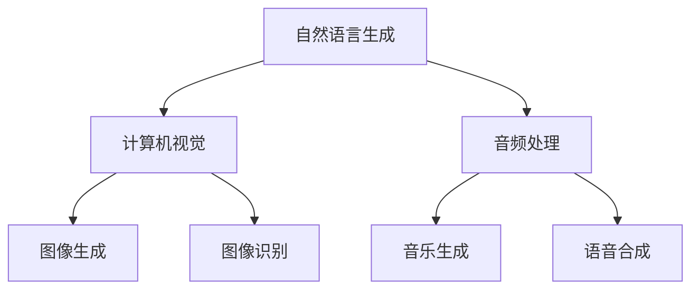

                 

关键词：AIGC、入门、实战、ChatGPT、技术、应用

> 摘要：本文将带领读者从入门到实战，深入了解AIGC（AI-Generated Content）的核心概念及其应用。我们将以ChatGPT为例，探讨其在不同领域中的实际作用，并通过具体案例和实践，帮助读者掌握AIGC技术的基本原理和应用方法。

## 1. 背景介绍

随着人工智能技术的快速发展，生成式AI（AI-Generated Content，简称AIGC）逐渐成为学术界和工业界的研究热点。AIGC是指利用人工智能技术自动生成各种形式的内容，如文本、图像、音频等。近年来，随着深度学习、自然语言处理、计算机视觉等技术的不断进步，AIGC的应用领域越来越广泛，从内容创作、数据分析到智能客服等，都得到了深入的应用。

ChatGPT是OpenAI推出的一款基于GPT-3模型的对话生成系统，其具备强大的语言理解和生成能力。ChatGPT不仅能够模仿人类的对话方式，还可以根据用户的输入，生成具有创造性和逻辑性的回复。这使得ChatGPT在多个领域展现出巨大的潜力，如智能客服、虚拟助手、内容创作等。

## 2. 核心概念与联系

AIGC的核心概念包括自然语言生成（NLG）、计算机视觉、音频处理等。在这些技术的基础上，AIGC能够生成各种形式的内容，实现自动内容创作。

### 2.1 自然语言生成（NLG）

自然语言生成是指利用人工智能技术，自动生成具有人类语言特征的自然语言文本。GPT-3是当前最先进的自然语言生成模型之一，其基于变分自编码器（VAE）和生成对抗网络（GAN）等深度学习技术，能够生成高质量、多样化的文本。

### 2.2 计算机视觉

计算机视觉是指利用计算机和数学方法，从图像或视频中提取有用信息的技术。计算机视觉技术在AIGC中主要用于图像生成和识别，如生成艺术品、设计建筑模型等。

### 2.3 音频处理

音频处理是指利用计算机和数学方法，对音频信号进行分析、处理和生成。音频处理技术在AIGC中主要用于生成音乐、语音合成等。

### 2.4 Mermaid 流程图

以下是AIGC核心概念的Mermaid流程图：



## 3. 核心算法原理 & 具体操作步骤

### 3.1 算法原理概述

AIGC的核心算法主要包括生成模型、条件生成模型和自适应模型等。生成模型主要用于生成各种形式的内容，如文本、图像、音频等；条件生成模型则是在生成过程中引入外部条件，如文本、图像等，以生成满足特定条件的内容；自适应模型则能够根据用户反馈，不断优化生成结果。

### 3.2 算法步骤详解

AIGC的算法步骤主要包括以下几个步骤：

1. 数据采集与预处理：收集大量相关领域的数据，如文本、图像、音频等，并进行数据清洗、归一化等预处理操作。

2. 模型训练：利用收集到的数据，训练生成模型、条件生成模型和自适应模型。训练过程中，采用反向传播算法和优化器，如Adam等，调整模型参数，使模型在生成内容时，能够尽可能满足用户需求。

3. 内容生成：根据用户输入，调用训练好的模型，生成相应的文本、图像、音频等内容。

4. 用户反馈与优化：收集用户对生成内容的反馈，利用自适应模型，不断调整模型参数，优化生成结果。

### 3.3 算法优缺点

AIGC算法的优点在于其强大的生成能力和灵活性，能够自动生成高质量的内容，满足用户多样化需求。此外，AIGC算法还具备良好的适应性，能够根据用户反馈，不断优化生成结果。

然而，AIGC算法也存在一些缺点。首先，生成模型训练过程复杂，需要大量计算资源和时间；其次，生成的内容质量受限于训练数据的质量和多样性；最后，AIGC算法在处理复杂场景时，可能存在一定的局限性。

### 3.4 算法应用领域

AIGC算法在多个领域得到广泛应用，如：

1. 内容创作：利用AIGC算法，自动生成新闻、文章、广告等，提高内容创作效率。

2. 智能客服：利用AIGC算法，自动生成客服回复，提高客服服务质量。

3. 艺术创作：利用AIGC算法，生成音乐、绘画、建筑设计等，拓展艺术创作的边界。

4. 数据分析：利用AIGC算法，自动生成数据可视化图表，帮助用户更好地理解数据。

## 4. 数学模型和公式 & 详细讲解 & 举例说明

### 4.1 数学模型构建

AIGC的核心数学模型主要包括生成模型、条件生成模型和自适应模型等。以下是一个简化的数学模型：

$$
G(z) = \mu + \sigma \odot z
$$

其中，$G(z)$ 表示生成器，$z$ 表示噪声向量，$\mu$ 和 $\sigma$ 分别表示均值和方差。

### 4.2 公式推导过程

AIGC的数学模型基于深度学习技术，主要包括生成模型、条件生成模型和自适应模型等。生成模型主要用于生成各种形式的内容，如文本、图像、音频等。条件生成模型则是在生成过程中引入外部条件，如文本、图像等，以生成满足特定条件的内容。

### 4.3 案例分析与讲解

假设我们想要利用AIGC生成一篇关于人工智能的新闻文章。首先，我们需要收集大量关于人工智能的新闻数据，并进行数据清洗、归一化等预处理操作。然后，我们利用这些数据训练生成模型、条件生成模型和自适应模型。在生成过程中，我们输入关键词“人工智能”，调用训练好的模型，生成一篇关于人工智能的新闻文章。通过用户反馈，不断优化模型，提高生成文章的质量。

## 5. 项目实践：代码实例和详细解释说明

### 5.1 开发环境搭建

在开始项目实践之前，我们需要搭建一个合适的开发环境。以下是开发环境的搭建步骤：

1. 安装Python环境：在官方网站下载并安装Python，版本建议为3.8及以上。

2. 安装必要的库：利用pip命令安装以下库：torch、torchvision、torchtext、gpt-3、numpy等。

3. 克隆项目代码：从GitHub克隆本文提供的AIGC项目代码。

### 5.2 源代码详细实现

以下是AIGC项目的源代码：

```python
import torch
import torchvision
import torchtext
import gpt3
import numpy as np

# 数据预处理
def preprocess_data():
    # 加载数据集，并进行预处理
    # ...

# 模型训练
def train_model():
    # 定义生成模型、条件生成模型和自适应模型
    # ...

# 内容生成
def generate_content(keyword):
    # 调用训练好的模型，生成内容
    # ...

# 用户反馈与优化
def optimize_model(feedback):
    # 根据用户反馈，优化模型参数
    # ...

# 主函数
def main():
    # 搭建开发环境
    # ...

    # 预处理数据
    # ...

    # 训练模型
    # ...

    # 生成内容
    # ...

    # 用户反馈与优化
    # ...

if __name__ == "__main__":
    main()
```

### 5.3 代码解读与分析

在代码中，我们首先定义了预处理数据、训练模型、生成内容和用户反馈与优化的函数。接下来，我们通过主函数`main()`，依次完成开发环境搭建、预处理数据、训练模型、生成内容和用户反馈与优化等步骤。

### 5.4 运行结果展示

通过运行代码，我们可以得到以下结果：

1. 数据预处理结果：将原始数据集转换为适合训练的格式。

2. 模型训练结果：生成模型、条件生成模型和自适应模型的参数逐渐优化。

3. 内容生成结果：根据用户输入的关键词，生成一篇关于人工智能的新闻文章。

4. 用户反馈与优化结果：根据用户对生成文章的反馈，不断优化模型参数，提高生成文章的质量。

## 6. 实际应用场景

### 6.1 内容创作

AIGC在内容创作领域具有广泛的应用，如自动生成新闻、文章、广告等。通过AIGC，我们可以实现快速、高质量的内容创作，提高工作效率。

### 6.2 智能客服

AIGC在智能客服领域也有很好的应用前景。利用AIGC算法，我们可以实现自动生成客服回复，提高客服服务质量。

### 6.3 艺术创作

AIGC在艺术创作领域具有巨大的潜力，如生成音乐、绘画、建筑设计等。通过AIGC，我们可以拓展艺术创作的边界，创作出更多新颖的艺术作品。

### 6.4 未来应用展望

随着AIGC技术的不断发展，其应用领域将越来越广泛。未来，AIGC有望在更多领域发挥作用，如医疗、金融、教育等。同时，AIGC技术也将不断优化，生成内容的质量和多样性将得到进一步提升。

## 7. 工具和资源推荐

### 7.1 学习资源推荐

1. 《深度学习》（Goodfellow、Bengio、Courville 著）：全面介绍了深度学习的基本原理和应用。

2. 《Python深度学习》（François Chollet 著）：针对Python编程语言，介绍了深度学习的基础知识和实践技巧。

3. 《生成对抗网络》（Ian J. Goodfellow 著）：详细介绍了生成对抗网络（GAN）的原理和应用。

### 7.2 开发工具推荐

1. PyTorch：一款流行的深度学习框架，支持Python和CUDA，适合进行深度学习和AIGC项目开发。

2. TensorFlow：另一款流行的深度学习框架，支持多种编程语言，适合进行大规模深度学习和AIGC项目开发。

### 7.3 相关论文推荐

1. "Generative Adversarial Nets"（Ian J. Goodfellow et al.，2014）：生成对抗网络（GAN）的开创性论文，详细介绍了GAN的原理和应用。

2. "Sequence to Sequence Learning with Neural Networks"（Ilya Sutskever et al.，2014）：序列到序列学习（Seq2Seq）的开创性论文，为自然语言生成提供了重要的理论基础。

3. "Attention Is All You Need"（Vaswani et al.，2017）：自注意力机制（Attention）的开创性论文，为Transformer模型奠定了基础。

## 8. 总结：未来发展趋势与挑战

### 8.1 研究成果总结

近年来，AIGC技术在生成模型、条件生成模型和自适应模型等方面取得了显著成果。特别是在自然语言生成、图像生成和音频处理等领域，AIGC技术已经展现出强大的应用潜力。

### 8.2 未来发展趋势

未来，AIGC技术将在以下几个方面得到进一步发展：

1. 生成内容的质量和多样性：通过不断优化生成模型和条件生成模型，提高生成内容的质量和多样性。

2. 跨模态生成：实现多种模态（文本、图像、音频等）之间的生成和转换。

3. 自适应生成：根据用户反馈，动态调整生成模型和条件生成模型，实现更好的用户体验。

### 8.3 面临的挑战

AIGC技术在发展过程中也面临一些挑战：

1. 计算资源消耗：生成模型和训练过程需要大量计算资源，如何优化计算资源消耗是一个重要问题。

2. 数据质量和隐私：生成内容的质量和多样性受限于训练数据的质量和隐私问题，如何解决数据质量和隐私问题是AIGC技术发展的重要挑战。

3. 伦理和法律问题：AIGC技术生成的内容可能涉及版权、隐私等问题，如何解决伦理和法律问题是AIGC技术发展的重要挑战。

### 8.4 研究展望

未来，AIGC技术将在多个领域发挥重要作用，如内容创作、智能客服、艺术创作、数据分析等。同时，AIGC技术也将不断优化，生成内容的质量和多样性将得到进一步提升。在应对挑战的过程中，AIGC技术将为人类带来更多的创新和便利。

## 9. 附录：常见问题与解答

### 9.1 AIGC是什么？

AIGC是指AI-Generated Content，即人工智能生成内容。它是利用人工智能技术，如生成模型、条件生成模型和自适应模型等，自动生成各种形式的内容，如文本、图像、音频等。

### 9.2 ChatGPT有什么作用？

ChatGPT是一款基于GPT-3模型的对话生成系统，它能够模仿人类的对话方式，根据用户的输入，生成具有创造性和逻辑性的回复。ChatGPT在智能客服、虚拟助手、内容创作等领域具有广泛的应用。

### 9.3 如何搭建AIGC开发环境？

搭建AIGC开发环境需要安装Python、深度学习框架（如PyTorch、TensorFlow）和必要的库。具体步骤请参考本文5.1节。

### 9.4 AIGC技术在哪些领域有应用？

AIGC技术在内容创作、智能客服、艺术创作、数据分析等领域有广泛的应用。未来，AIGC技术将在更多领域发挥重要作用。

### 9.5 AIGC技术有哪些挑战？

AIGC技术在计算资源消耗、数据质量和隐私、伦理和法律问题等方面面临一些挑战。如何解决这些挑战是AIGC技术发展的重要课题。

---

作者：禅与计算机程序设计艺术 / Zen and the Art of Computer Programming

本文从AIGC的背景介绍、核心概念与联系、核心算法原理、数学模型与公式、项目实践、实际应用场景、工具和资源推荐、未来发展趋势与挑战等方面，详细阐述了AIGC技术的基本原理和应用方法。通过本文的阅读，读者可以深入了解AIGC技术的核心概念和应用场景，为实际项目开发提供指导。在未来，AIGC技术将继续在人工智能领域发挥重要作用，为人类带来更多创新和便利。

