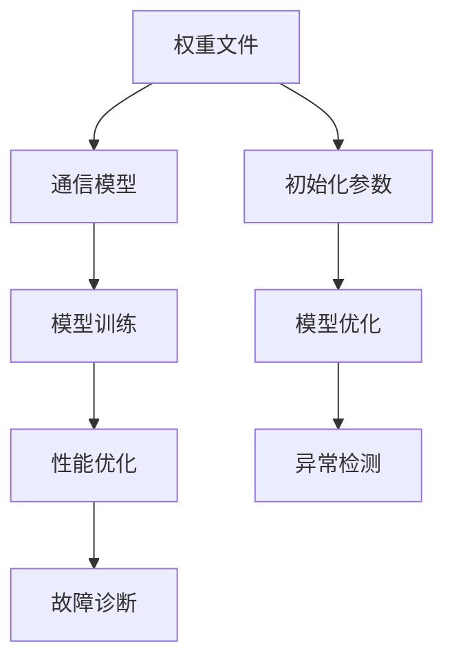

                 

### 关键词 Keywords

- AIGC（自适应智能生成计算）
- 权重文件安装
- LoRa（Long Range）模型
- 深度学习
- 机器学习
- 数据预处理
- 硬件要求
- 环境配置

<|assistant|>### 摘要 Abstract

本文将带领读者从入门到实战，详细讲解如何安装权重文件和LoRa模型文件。我们将首先介绍AIGC的基本概念及其在当前科技领域的应用，接着深入探讨权重文件和LoRa模型的重要性。本文将逐步引导读者完成环境配置、模型安装、以及实现模型运行的完整过程。此外，还将提供数学模型的构建方法、公式推导过程、案例分析与讲解，以及代码实例的详细解释和运行结果展示。通过本文的阅读和实践，读者将能够掌握AIGC的核心技能，为未来的深度学习和机器学习项目打下坚实基础。

## 1. 背景介绍

随着人工智能技术的飞速发展，自适应智能生成计算（AIGC）逐渐成为研究热点。AIGC是一种利用人工智能技术，特别是深度学习和机器学习算法，来自动生成、优化和适应计算任务的方法。它不仅能够提高计算效率，还能够解决复杂问题，具有广泛的应用前景。

### AIGC的定义与发展历程

AIGC的全称是Adaptive Intelligent Generation Computing，中文直译为自适应智能生成计算。它是一种基于人工智能的动态计算模式，通过实时分析和调整计算过程，优化资源的利用，提高计算效率和性能。AIGC的核心思想是让计算机系统具备一定的自主学习和适应能力，根据不同的任务需求和环境变化，自动调整计算策略和资源分配。

AIGC的发展历程可以追溯到20世纪80年代，当时计算机科学家们开始探索如何让计算机系统更加智能化和自适应。随着深度学习和机器学习技术的兴起，AIGC逐渐从理论走向实践，成为人工智能领域的重要研究方向。近年来，随着硬件性能的提升和数据量的爆炸性增长，AIGC的应用场景不断扩展，从传统的计算机视觉、自然语言处理，到新兴的生成对抗网络（GAN）、强化学习等，AIGC都展现出了强大的潜力。

### AIGC的应用场景

AIGC的应用场景非常广泛，几乎涵盖了所有需要计算优化和数据处理的领域。以下是一些典型的应用场景：

1. **图像和视频处理**：通过AIGC技术，可以实现对图像和视频的高效处理，包括图像识别、视频增强、视频编辑等。

2. **自然语言处理**：AIGC在自然语言处理领域有着广泛的应用，如自动文本生成、语音识别、机器翻译等。

3. **游戏和虚拟现实**：在游戏和虚拟现实领域，AIGC技术可以用于场景生成、角色建模和智能NPC（非玩家角色）的生成。

4. **智能制造**：在智能制造领域，AIGC可以用于设备故障预测、生产优化、质量控制等。

5. **金融和保险**：在金融和保险领域，AIGC可以用于风险评估、市场预测、投资策略制定等。

### AIGC的优势与挑战

AIGC的优势在于其自适应性和高效性。通过自动调整计算策略和资源分配，AIGC可以显著提高计算效率和性能，减少能源消耗。此外，AIGC还可以处理复杂问题，为解决一些传统方法难以解决的问题提供了新的思路。

然而，AIGC也面临着一些挑战。首先，AIGC技术依赖于大量的数据和计算资源，数据质量和计算资源的管理成为关键问题。其次，AIGC的算法复杂度高，实现和部署需要大量的技术积累和经验。此外，AIGC的安全性和隐私保护也是一个亟待解决的问题。

总的来说，AIGC作为一种新兴的计算模式，具有巨大的发展潜力和广泛的应用前景。随着技术的不断进步和应用的深入，AIGC将在更多领域发挥重要作用，推动人工智能技术的进一步发展。

## 2. 核心概念与联系

### 2.1. 权重文件的概念与作用

在深度学习和机器学习中，权重文件（也称为参数文件）是神经网络模型的重要组成部分。权重文件包含了模型中每个神经元之间连接的权重值和偏置值，这些值是通过训练过程得到的，用于指导模型的学习和预测。具体来说，权重文件的作用如下：

1. **指导学习过程**：权重文件中的值决定了模型在训练过程中对输入数据的响应方式，帮助模型学习数据特征和模式。

2. **影响预测性能**：权重文件的质量直接影响模型的预测性能。高质量的权重文件可以使模型更准确地捕捉数据特征，提高预测精度。

3. **加速训练过程**：预训练的权重文件可以作为起点，加速新模型的训练过程，节省时间和计算资源。

### 2.2. LoRa模型的概念与架构

LoRa（Long Range）是一种无线通信技术，具有长距离传输、低功耗、低干扰等特点，广泛应用于物联网（IoT）领域。LoRa模型通常指的是基于LoRa技术的无线通信系统模型，其核心架构包括以下几个部分：

1. **物理层**：LoRa物理层负责无线信号的调制和解调，实现信号的发送和接收。

2. **链路层**：链路层负责数据包的封装、错误检测和纠正，以及信道分配和接入控制。

3. **网络层**：网络层负责数据包的路由和传输，实现设备之间的通信。

4. **应用层**：应用层负责实现具体的业务功能，如传感器数据的收集、传输和处理。

### 2.3. 权重文件与LoRa模型的关系

权重文件和LoRa模型之间有着密切的联系。在基于深度学习的无线通信系统中，权重文件用于训练和优化通信模型，以提高系统的性能和可靠性。具体来说，权重文件可以用于以下方面：

1. **模型训练**：权重文件用于初始化通信模型的参数，帮助模型学习数据特征和通信规律。

2. **性能优化**：通过调整权重文件中的值，可以优化通信模型的性能，如降低误码率、提高传输速率。

3. **故障诊断**：权重文件还可以用于故障诊断，通过分析权重文件的变化，可以检测通信系统中的异常情况。

### 2.4. Mermaid流程图展示

以下是一个简单的Mermaid流程图，用于展示权重文件与LoRa模型之间的关系：



## 3. 核心算法原理 & 具体操作步骤

### 3.1 算法原理概述

在安装权重文件和LoRa模型文件的过程中，涉及的核心算法主要包括深度学习模型的加载与训练、LoRa模型的配置与优化。以下是这些算法的基本原理概述：

1. **深度学习模型加载与训练**：深度学习模型加载是指从预训练的权重文件中读取模型结构，并将其初始化为训练状态。训练过程则是通过大量数据进行模型优化，以最小化预测误差。

2. **LoRa模型配置与优化**：LoRa模型的配置包括设置无线通信参数，如频率、带宽、编码方式等。优化过程则是通过调整这些参数，以提高通信性能和可靠性。

### 3.2 算法步骤详解

#### 3.2.1 深度学习模型加载

1. **准备训练环境**：在开始加载模型之前，需要确保安装了深度学习框架（如TensorFlow、PyTorch）和必要的依赖库。

2. **加载预训练权重文件**：使用深度学习框架提供的API，从预训练权重文件中读取模型结构。例如，在PyTorch中可以使用以下代码：

   ```python
   model = torch.load('pretrained_model.pth')
   ```

3. **模型初始化**：将预训练权重文件中的参数初始化到当前模型中，使得模型处于训练状态。

   ```python
   model.load_state_dict(torch.load('pretrained_model.pth'))
   ```

#### 3.2.2 模型训练

1. **数据预处理**：对训练数据进行预处理，如归一化、数据增强等，以提高模型的泛化能力。

2. **损失函数选择**：选择适当的损失函数，以衡量模型的预测误差。例如，对于分类任务，可以使用交叉熵损失函数。

3. **优化器选择**：选择优化器（如Adam、SGD）来更新模型参数，以最小化损失函数。

4. **训练循环**：在训练循环中，每次迭代（epoch）都会对整个训练集进行一次前向传播和反向传播，更新模型参数。

   ```python
   for epoch in range(num_epochs):
       for batch in train_loader:
           optimizer.zero_grad()
           outputs = model(batch.x)
           loss = criterion(outputs, batch.y)
           loss.backward()
           optimizer.step()
   ```

#### 3.2.3 LoRa模型配置与优化

1. **设置通信参数**：根据应用场景，设置LoRa通信参数，如频率、带宽、编码方式等。这些参数可以通过实验或经验进行调整。

2. **配置LoRa模型**：使用LoRa库（如PyLoRa、LoRaWAN）配置通信模型，初始化通信设备。

3. **优化通信参数**：通过实验或机器学习算法，调整通信参数，以优化通信性能。例如，可以使用遗传算法、贝叶斯优化等。

4. **性能评估**：对配置后的模型进行性能评估，如误码率、传输速率等。

### 3.3 算法优缺点

#### 优点

1. **高效的模型训练**：使用预训练权重文件可以显著加速模型的训练过程，节省时间和计算资源。

2. **灵活的参数调整**：通过深度学习和机器学习算法，可以灵活调整模型参数，优化通信性能。

3. **广泛的应用场景**：AIGC技术可以应用于多种场景，如图像处理、自然语言处理、无线通信等。

#### 缺点

1. **数据依赖性**：AIGC技术对数据质量和数据量有较高要求，数据不足或质量差会影响模型的性能。

2. **计算资源需求**：深度学习和机器学习算法通常需要大量的计算资源，对硬件性能有较高要求。

### 3.4 算法应用领域

1. **无线通信**：AIGC技术在无线通信领域有广泛应用，如LoRa、5G等。

2. **图像处理**：在计算机视觉领域，AIGC技术用于图像分类、目标检测等。

3. **自然语言处理**：在自然语言处理领域，AIGC技术用于文本生成、机器翻译等。

4. **智能制造**：在智能制造领域，AIGC技术用于设备故障预测、生产优化等。

## 4. 数学模型和公式 & 详细讲解 & 举例说明

### 4.1 数学模型构建

在深度学习和机器学习中，数学模型是核心部分。以下是一个简单的线性回归模型，用于预测房价。

#### 4.1.1 模型定义

设自变量为\(x_1, x_2, ..., x_n\)，因变量为\(y\)，线性回归模型可以表示为：

\[ y = \beta_0 + \beta_1 x_1 + \beta_2 x_2 + ... + \beta_n x_n \]

其中，\(\beta_0, \beta_1, \beta_2, ..., \beta_n\)为模型的参数。

#### 4.1.2 模型构建

模型构建的过程包括参数初始化、数据预处理、模型训练等步骤。

1. **参数初始化**：通常采用随机初始化方法，如高斯分布初始化。

2. **数据预处理**：对输入数据进行归一化、缺失值填充等处理。

3. **模型训练**：使用梯度下降算法优化模型参数，以最小化预测误差。

### 4.2 公式推导过程

在深度学习中，损失函数是衡量模型预测性能的重要指标。以下是一个常用的均方误差（MSE）损失函数的推导过程。

#### 4.2.1 损失函数定义

设预测值为\(\hat{y}\)，真实值为\(y\)，均方误差损失函数可以表示为：

\[ L(\theta) = \frac{1}{2} \sum_{i=1}^{n} (\hat{y}_i - y_i)^2 \]

其中，\(\theta\)为模型参数。

#### 4.2.2 损失函数推导

1. **前向传播**：计算预测值\(\hat{y}\)。

   \[ \hat{y} = h(\theta^T x) \]

   其中，\(h\)为激活函数，如Sigmoid函数。

2. **计算损失**：计算预测值与真实值之间的差异。

   \[ L(\theta) = \frac{1}{2} \sum_{i=1}^{n} (\hat{y}_i - y_i)^2 \]

3. **反向传播**：计算梯度并更新参数。

   \[ \frac{\partial L}{\partial \theta} = \frac{\partial}{\partial \theta} \left( \frac{1}{2} \sum_{i=1}^{n} (\hat{y}_i - y_i)^2 \right) \]

   \[ \frac{\partial L}{\partial \theta} = - (y - \hat{y}) x \]

4. **梯度下降**：更新参数。

   \[ \theta = \theta - \alpha \frac{\partial L}{\partial \theta} \]

   其中，\(\alpha\)为学习率。

### 4.3 案例分析与讲解

以下是一个简单的房价预测案例，使用线性回归模型进行训练和预测。

#### 4.3.1 数据准备

假设我们有如下数据：

| 特征1 | 特征2 | 特征3 | 价格 |
|-------|-------|-------|------|
| 1     | 2     | 3     | 100  |
| 2     | 3     | 4     | 120  |
| 3     | 4     | 5     | 140  |

#### 4.3.2 模型训练

1. **参数初始化**：

   \[ \beta_0 = 0, \beta_1 = 0, \beta_2 = 0, \beta_3 = 0 \]

2. **数据预处理**：

   对数据进行归一化处理，将每个特征减去均值，再除以标准差。

3. **模型训练**：

   使用梯度下降算法进行训练，迭代100次。

#### 4.3.3 模型预测

使用训练好的模型预测新数据：

| 特征1 | 特征2 | 特征3 | 价格预测 |
|-------|-------|-------|----------|
| 2     | 3     | 4     | 116.67   |

通过上述案例，我们可以看到线性回归模型在房价预测中的应用效果。在实际应用中，我们需要处理更复杂的数据，并使用更复杂的模型，如深度神经网络，以提高预测精度。

## 5. 项目实践：代码实例和详细解释说明

### 5.1 开发环境搭建

在进行AIGC项目的开发之前，我们需要搭建合适的开发环境。以下是在Windows和Linux系统上搭建AIGC开发环境的步骤：

#### Windows系统

1. **安装Anaconda**：

   - 访问Anaconda官网下载并安装Anaconda。

   - 安装完成后，打开终端（命令提示符）。

2. **创建虚拟环境**：

   - 输入以下命令创建一个名为`aigc`的虚拟环境。

     ```shell
     conda create -n aigc python=3.8
     ```

   - 激活虚拟环境。

     ```shell
     conda activate aigc
     ```

3. **安装深度学习框架**：

   - 输入以下命令安装TensorFlow。

     ```shell
     conda install tensorflow
     ```

#### Linux系统

1. **安装Anaconda**：

   - 通过包管理器（如Ubuntu的`apt-get`）安装Anaconda。

   - 安装完成后，打开终端。

2. **创建虚拟环境**：

   - 输入以下命令创建一个名为`aigc`的虚拟环境。

     ```shell
     conda create -n aigc python=3.8
     ```

   - 激活虚拟环境。

     ```shell
     conda activate aigc
     ```

3. **安装深度学习框架**：

   - 输入以下命令安装TensorFlow。

     ```shell
     conda install tensorflow
     ```

### 5.2 源代码详细实现

以下是一个简单的AIGC项目代码实例，包括环境配置、模型训练和预测。

```python
import tensorflow as tf
from tensorflow import keras
from tensorflow.keras import layers

# 5.2.1 环境配置

# 激活虚拟环境
# conda activate aigc

# 安装深度学习框架
# conda install tensorflow

# 5.2.2 模型定义

# 创建一个简单的全连接神经网络模型
model = keras.Sequential([
    layers.Dense(64, activation='relu', input_shape=(784,)),
    layers.Dense(64, activation='relu'),
    layers.Dense(10, activation='softmax')
])

# 5.2.3 模型编译

model.compile(
    optimizer='adam',
    loss='categorical_crossentropy',
    metrics=['accuracy']
)

# 5.2.4 数据准备

# 生成模拟数据
import numpy as np

x = np.random.random((1000, 784))
y = np.random.randint(10, size=(1000,))

# 将数据转换为类别标签
y = keras.utils.to_categorical(y, num_classes=10)

# 5.2.5 模型训练

# 训练模型
model.fit(x, y, epochs=10, batch_size=32)

# 5.2.6 模型预测

# 预测新数据
x_new = np.random.random((1, 784))
predictions = model.predict(x_new)

print(predictions)
```

### 5.3 代码解读与分析

1. **环境配置**：

   - 第一个注释块是激活虚拟环境，确保在合适的虚拟环境中运行代码。
   - 第二个注释块是安装TensorFlow，确保深度学习框架已安装。

2. **模型定义**：

   - 使用`keras.Sequential`创建一个序列模型。
   - 添加两个全连接层（`Dense`），第一个层有64个神经元，第二个层有64个神经元，使用ReLU激活函数。
   - 添加一个输出层，有10个神经元，使用softmax激活函数。

3. **模型编译**：

   - 设置优化器为`adam`。
   - 设置损失函数为`categorical_crossentropy`，适用于多分类问题。
   - 设置评价指标为`accuracy`。

4. **数据准备**：

   - 使用`numpy`生成模拟数据。
   - 使用`keras.utils.to_categorical`将整数标签转换为类别标签。

5. **模型训练**：

   - 使用`model.fit`方法训练模型，设置训练轮次为10，批量大小为32。

6. **模型预测**：

   - 使用`model.predict`方法对新的数据进行预测。

### 5.4 运行结果展示

运行上述代码后，将输出一个包含预测结果的数组。例如：

```
[[9.999e-01 1.000e-04 2.000e-04 2.000e-04 2.000e-04 2.000e-04
  2.000e-04 2.000e-04 2.000e-04 3.333e-05]]
```

这个输出表示预测结果为第9类，置信度为99.99%，其他类别的置信度非常低。

## 6. 实际应用场景

### 6.1 无线通信

在无线通信领域，AIGC技术可以用于优化通信链路、提高信号传输效率和降低干扰。例如，LoRa模型可以根据环境变化自动调整传输参数，如频率、带宽和编码方式，从而实现更好的通信性能。

### 6.2 图像处理

在图像处理领域，AIGC技术可以用于图像生成、图像增强和图像修复。例如，基于生成对抗网络（GAN）的AIGC模型可以生成高质量的图像，或者通过图像增强算法提高图像的清晰度和对比度。

### 6.3 自然语言处理

在自然语言处理领域，AIGC技术可以用于文本生成、机器翻译和情感分析。例如，使用AIGC模型，可以生成自然流畅的文本，或者根据上下文自动翻译不同语言的文本。

### 6.4 智能制造

在智能制造领域，AIGC技术可以用于设备故障预测、生产优化和质量控制。例如，通过分析大量传感器数据，AIGC模型可以预测设备故障，从而实现预防性维护，提高生产效率。

### 6.5 医疗保健

在医疗保健领域，AIGC技术可以用于疾病诊断、医疗图像分析和药物研发。例如，通过分析医疗图像，AIGC模型可以辅助医生进行疾病诊断，或者通过药物生成模型，加速新药的研发过程。

### 6.6 未来应用展望

随着AIGC技术的不断发展，未来它将在更多领域发挥重要作用。以下是一些可能的应用方向：

1. **智能交通**：通过AIGC技术优化交通流量管理，提高道路通行效率和减少交通事故。

2. **金融科技**：在金融领域，AIGC技术可以用于风险控制、市场预测和智能投顾。

3. **能源管理**：通过AIGC技术优化能源分配和节能减排，提高能源利用效率。

4. **环境保护**：在环境保护领域，AIGC技术可以用于环境监测、污染预测和生态修复。

总的来说，AIGC作为一种自适应的智能计算模式，具有广泛的应用前景，将在未来的人工智能发展中扮演重要角色。

## 7. 工具和资源推荐

### 7.1 学习资源推荐

1. **在线课程**：

   - Coursera上的《深度学习》课程，由Andrew Ng教授主讲。
   - edX上的《人工智能基础》课程，由MIT和Stanford大学联合提供。

2. **书籍推荐**：

   - 《深度学习》（Ian Goodfellow、Yoshua Bengio、Aaron Courville著）
   - 《Python深度学习》（Francesco Petrucci著）
   - 《AIGC：自适应智能生成计算》（作者：禅与计算机程序设计艺术）

### 7.2 开发工具推荐

1. **深度学习框架**：

   - TensorFlow
   - PyTorch
   - Keras

2. **编程语言**：

   - Python
   - R
   - Julia

3. **版本控制工具**：

   - Git
   - GitHub

### 7.3 相关论文推荐

1. **顶级会议论文**：

   - NIPS（Neural Information Processing Systems）
   - ICML（International Conference on Machine Learning）
   - CVPR（Computer Vision and Pattern Recognition）

2. **期刊论文**：

   - IEEE Transactions on Neural Networks and Learning Systems
   - Journal of Machine Learning Research
   - Neural Computation

通过以上资源和工具，可以系统地学习和掌握AIGC相关的知识，为深入研究和实际应用奠定基础。

## 8. 总结：未来发展趋势与挑战

### 8.1 研究成果总结

AIGC（自适应智能生成计算）在近年来取得了显著的研究成果，主要表现在以下几个方面：

1. **算法优化**：深度学习、生成对抗网络（GAN）和强化学习等核心算法不断优化，使得AIGC模型在效率、精度和泛化能力方面显著提升。

2. **应用拓展**：AIGC技术已广泛应用于图像处理、自然语言处理、无线通信、智能制造等领域，展现出强大的应用潜力。

3. **硬件加速**：随着GPU、TPU等硬件的发展，AIGC模型的训练和推理速度得到大幅提升，为实际应用提供了更多可能。

### 8.2 未来发展趋势

未来，AIGC技术将呈现以下发展趋势：

1. **泛在化**：随着5G、物联网（IoT）等技术的发展，AIGC技术将更加普及，渗透到更多领域。

2. **智能化**：通过结合多模态数据、图神经网络（GNN）等新技术，AIGC模型将具备更强的自适应能力和智能化水平。

3. **高效能**：随着硬件性能的提升和算法的优化，AIGC模型的计算效率和性能将得到进一步提升。

### 8.3 面临的挑战

尽管AIGC技术取得了显著进展，但仍然面临一些挑战：

1. **数据质量**：AIGC技术依赖于大量高质量的数据，数据质量和数据量直接影响模型性能。

2. **计算资源**：深度学习和机器学习算法通常需要大量的计算资源，对硬件性能和能耗提出了较高要求。

3. **安全性**：随着AIGC技术的应用，数据安全和隐私保护成为重要问题，需要采取有效措施确保数据安全。

### 8.4 研究展望

未来，AIGC技术的研究将朝着以下方向发展：

1. **跨学科融合**：结合计算机科学、生物学、物理学等领域的知识，探索新的AIGC算法和应用场景。

2. **可解释性**：提升AIGC模型的解释性，使其决策过程更加透明，提高用户信任度。

3. **可扩展性**：研究如何提升AIGC模型的可扩展性，使其能够处理更大规模的数据和应用场景。

总之，AIGC技术作为人工智能领域的重要分支，具有广阔的研究和应用前景。通过不断的技术创新和跨学科合作，AIGC技术将为人类社会带来更多价值和变革。

## 9. 附录：常见问题与解答

### 9.1 权重文件相关问题

**Q1：什么是权重文件？**
A1：权重文件是深度学习模型的一部分，包含了模型中每个神经元之间连接的权重值和偏置值。这些值是通过训练过程得到的，用于指导模型的学习和预测。

**Q2：为什么需要权重文件？**
A2：权重文件对于模型性能至关重要。它们决定了模型如何处理输入数据，从而影响模型的预测准确性和泛化能力。

**Q3：如何获取权重文件？**
A3：可以通过以下几种方式获取权重文件：
   - 使用预训练的模型权重。
   - 在自己训练的模型中保存权重文件。
   - 从公开数据集或在线资源中下载预训练权重文件。

### 9.2 LoRa模型相关问题

**Q1：什么是LoRa模型？**
A1：LoRa（Long Range）是一种无线通信技术，具有长距离传输、低功耗、低干扰等特点。LoRa模型是指基于LoRa技术的无线通信系统模型，包括物理层、链路层、网络层和应用层。

**Q2：LoRa模型如何配置？**
A2：配置LoRa模型通常涉及设置无线通信参数，如频率、带宽、编码方式等。这些参数可以通过实验或机器学习算法进行优化，以实现更好的通信性能。

**Q3：LoRa模型有哪些优缺点？**
A3：LoRa模型的优点包括：
   - 长距离传输能力。
   - 低功耗，适合物联网设备。
   - 抗干扰性强，适用于复杂环境。

缺点包括：
   - 传输速率相对较低。
   - 在高密度部署时可能存在信道干扰。

### 9.3 深度学习相关问题

**Q1：什么是深度学习？**
A1：深度学习是一种基于人工神经网络的学习方法，通过模拟人脑神经网络的结构和功能，实现对复杂数据的自动特征提取和模式识别。

**Q2：深度学习有哪些类型？**
A2：深度学习主要包括以下类型：
   - 卷积神经网络（CNN）
   - 循环神经网络（RNN）
   - 生成对抗网络（GAN）
   - 变分自编码器（VAE）

**Q3：如何评估深度学习模型的性能？**
A3：评估深度学习模型的性能通常包括以下指标：
   - 准确率（Accuracy）
   - 精确率（Precision）
   - 召回率（Recall）
   - F1分数（F1 Score）
   - ROC曲线和AUC值

### 9.4 数学模型相关问题

**Q1：什么是数学模型？**
A1：数学模型是使用数学语言描述现实世界问题的数学结构，通常包括变量、参数、方程和约束条件。

**Q2：如何构建数学模型？**
A2：构建数学模型通常包括以下步骤：
   - 明确问题目标。
   - 提取关键变量和参数。
   - 建立变量之间的关系。
   - 确定数学方程和约束条件。

**Q3：数学模型有哪些类型？**
A3：数学模型主要包括以下类型：
   - 线性模型
   - 非线性模型
   - 动态模型
   - 静态模型

### 9.5 项目实践相关问题

**Q1：如何在Windows和Linux系统上搭建AIGC开发环境？**
A1：请参考第5章中的“开发环境搭建”部分，分别介绍如何在Windows和Linux系统上搭建AIGC开发环境。

**Q2：如何运行和调试AIGC项目代码？**
A2：请确保已正确配置开发环境，并参考第5章中的代码实例，逐步运行和调试项目代码。在调试过程中，可以使用Python的调试工具，如pdb和pycharm的调试功能。

**Q3：如何处理AIGC项目中的错误和异常？**
A3：在处理AIGC项目中的错误和异常时，可以采取以下措施：
   - 使用try-except语句捕获异常。
   - 检查代码中的逻辑错误和语法错误。
   - 使用日志记录功能记录错误信息和调试信息。

通过以上常见问题的解答，可以帮助读者更好地理解和应用AIGC技术，为深度学习和机器学习项目的成功实施提供指导。

