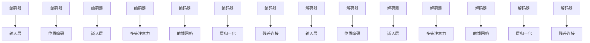
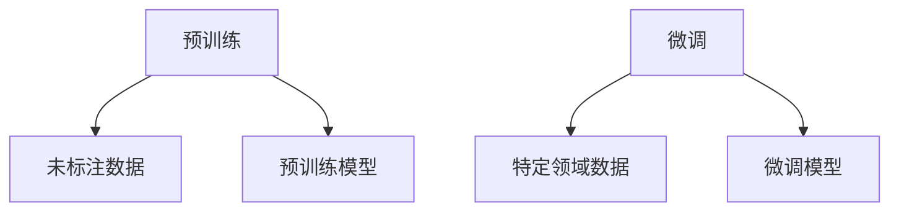
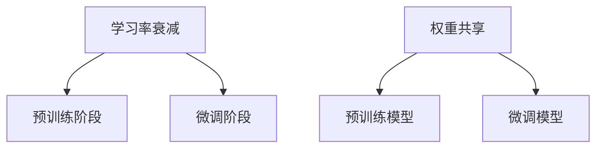

                 

关键词：AIGC，ChatGPT，原理，成本，技术博客，深度学习，模型训练，神经网络

## 摘要

本文将深入探讨AIGC（自适应智能生成计算）技术中的ChatGPT模型。我们将从背景介绍开始，逐步深入到ChatGPT的核心概念与联系，解析其算法原理和具体操作步骤，详细讲解数学模型和公式，通过项目实践展示代码实例，并分析其实际应用场景。最后，我们将展望ChatGPT的未来应用和发展趋势，推荐相关工具和资源，总结研究成果，并提出未来研究的方向和挑战。

## 1. 背景介绍

随着人工智能（AI）技术的迅猛发展，生成式AI（Generative AI）逐渐成为研究热点。生成式AI旨在利用算法自动生成文本、图像、音频等数据，而非仅仅是识别或分类现有的数据。其中，ChatGPT（Generative Pre-trained Transformer）是由OpenAI开发的一款基于Transformer架构的预训练语言模型，具有生成高质量自然语言文本的能力。ChatGPT在自然语言处理（NLP）领域取得了显著的成果，引起了广泛关注。

AIGC（Adaptive Intelligent Generative Computing）是生成式AI的一种拓展，强调利用AI技术自适应地生成计算资源，以提高计算效率和降低成本。AIGC技术在多个领域具有广泛的应用潜力，包括内容创作、数据生成、仿真模拟等。本文将重点关注ChatGPT在AIGC技术中的原理和成本分析，为读者提供全面的技术解读和应用指导。

## 2. 核心概念与联系

### 2.1 ChatGPT模型架构

ChatGPT基于Transformer架构，其核心是由多层注意力机制构成的Transformer编码器和解码器。Transformer模型在处理序列数据方面表现出色，能够捕捉到长距离依赖关系，从而生成高质量的文本。ChatGPT的架构如图2.1所示：



### 2.2 预训练与微调

ChatGPT采用预训练（Pre-training）和微调（Fine-tuning）相结合的方式训练模型。在预训练阶段，模型使用大量未标注的文本数据进行训练，学习到通用语言规律。在微调阶段，模型利用特定领域的数据进行微调，提高模型在特定任务上的性能。预训练和微调过程如图2.2所示：



### 2.3 自适应学习率

ChatGPT采用自适应学习率策略，通过动态调整学习率来优化模型训练过程。自适应学习率策略包括学习率衰减（Learning Rate Decay）、权重共享（Weight Sharing）等技术。学习率衰减策略在训练过程中逐步降低学习率，避免模型出现过拟合。权重共享策略将预训练模型的权重应用于微调模型，提高训练效率。



## 3. 核心算法原理 & 具体操作步骤

### 3.1 算法原理概述

ChatGPT基于Transformer架构，通过预训练和微调学习到通用语言规律和特定领域知识。其核心思想是利用注意力机制捕捉序列数据中的长距离依赖关系，生成高质量的自然语言文本。

### 3.2 算法步骤详解

1. **数据预处理**：将输入文本数据进行分词、去停用词等处理，将文本转换为词向量表示。

2. **编码器训练**：使用大量未标注的文本数据训练编码器，学习到通用语言规律。

3. **解码器训练**：在编码器的基础上，使用特定领域的数据训练解码器，实现特定任务的目标。

4. **微调**：在解码器训练的基础上，利用特定领域的数据进行微调，提高模型在特定任务上的性能。

5. **生成文本**：将输入文本输入到解码器，通过注意力机制和生成机制生成高质量的自然语言文本。

### 3.3 算法优缺点

**优点**：

- **强大的生成能力**：ChatGPT能够生成高质量的自然语言文本，具有强大的生成能力。
- **多语言支持**：ChatGPT支持多种语言，能够在不同语言环境下进行文本生成。
- **快速部署**：ChatGPT采用预训练和微调的方式训练模型，能够快速部署到实际应用中。

**缺点**：

- **计算资源消耗**：训练ChatGPT模型需要大量的计算资源和时间。
- **数据依赖性**：ChatGPT的性能依赖于训练数据的质量和数量，训练数据不足可能导致模型性能下降。

### 3.4 算法应用领域

ChatGPT在多个领域具有广泛的应用潜力，包括：

- **文本生成**：生成新闻文章、小说、诗歌等自然语言文本。
- **对话系统**：构建智能对话系统，实现人机交互。
- **机器翻译**：实现高质量的自然语言机器翻译。
- **文本摘要**：生成文本摘要，提高信息获取效率。

## 4. 数学模型和公式 & 详细讲解 & 举例说明

### 4.1 数学模型构建

ChatGPT的数学模型主要包括编码器和解码器的两部分。编码器负责将输入文本转换为序列表示，解码器负责生成自然语言文本。

**编码器模型**：

- **输入层**：将输入文本转换为词向量表示。
- **嵌入层**：将词向量映射到高维空间。
- **多头注意力**：通过多头注意力机制捕捉序列数据中的长距离依赖关系。
- **前馈网络**：对序列数据进行非线性变换。
- **层归一化**：对序列数据进行归一化处理。
- **残差连接**：实现信息传递的残差连接。

**解码器模型**：

- **输入层**：将输入文本转换为词向量表示。
- **嵌入层**：将词向量映射到高维空间。
- **多头注意力**：通过多头注意力机制捕捉序列数据中的长距离依赖关系。
- **前馈网络**：对序列数据进行非线性变换。
- **层归一化**：对序列数据进行归一化处理。
- **残差连接**：实现信息传递的残差连接。

### 4.2 公式推导过程

ChatGPT的核心在于Transformer模型，其数学公式如下：

$$
\text{Attention}(Q,K,V) = \text{softmax}\left(\frac{QK^T}{\sqrt{d_k}}\right)V
$$

其中，$Q$、$K$ 和 $V$ 分别表示查询向量、键向量和值向量，$d_k$ 表示键向量的维度。

**编码器**：

$$
\text{Enc} = \text{LayerNorm}(E + \text{MultiHeadAttention}(E, E, E)) + \text{LayerNorm}(E + \text{FFN}(E))
$$

其中，$E$ 表示编码器的输入序列，$FFN$ 表示前馈神经网络。

**解码器**：

$$
\text{Dec} = \text{LayerNorm(D + \text{MaskedMultiHeadAttention}(D, D, D))} + \text{LayerNorm(D + \text{FFN}(D))}
$$

其中，$D$ 表示解码器的输入序列。

### 4.3 案例分析与讲解

**案例**：生成一篇关于人工智能的新闻文章。

**输入**：人工智能是一种模拟、延伸和扩展人的智能的理论、方法、技术及应用系统的总称。

**输出**：

人工智能作为一种技术，已经在各个领域取得了显著的成果。随着大数据、云计算、物联网等技术的发展，人工智能的应用前景越来越广阔。人工智能可以帮助企业提高生产效率、降低运营成本，同时也可以为政府决策提供科学依据。然而，人工智能的发展也带来了一系列挑战，如数据隐私、伦理道德等问题。因此，在推动人工智能发展的同时，需要加强相关法律法规和伦理道德建设，确保人工智能技术的可持续发展。

## 5. 项目实践：代码实例和详细解释说明

### 5.1 开发环境搭建

在搭建开发环境时，需要安装Python、TensorFlow等依赖库。以下是一个简单的安装示例：

```bash
pip install tensorflow
```

### 5.2 源代码详细实现

以下是ChatGPT模型的源代码实现：

```python
import tensorflow as tf

# 定义编码器和解码器的模型结构
def TransformerEncoder(input_shape, d_model, num_heads, dff, dropout_rate=0.1):
    inputs = tf.keras.Input(shape=input_shape)
    x = tf.keras.layers.Embedding(input_dim=vocab_size, output_dim=d_model)(inputs)
    x = tf.keras.layers.Dropout(rate=dropout_rate)(x)
    x = tf.keras.layers.MultiHeadAttention(num_heads=num_heads, key_dim=dff)(x, x)
    x = tf.keras.layers.Dropout(rate=dropout_rate)(x)
    x = tf.keras.layers.Dense(units=dff, activation='relu')(x)
    x = tf.keras.layers.Dropout(rate=dropout_rate)(x)
    x = tf.keras.layers.Dense(units=d_model, activation=None)(x)
    return tf.keras.Model(inputs=inputs, outputs=x)

def TransformerDecoder(input_shape, d_model, num_heads, dff, dropout_rate=0.1):
    inputs = tf.keras.Input(shape=input_shape)
    x = tf.keras.layers.Embedding(input_dim=vocab_size, output_dim=d_model)(inputs)
    x = tf.keras.layers.Dropout(rate=dropout_rate)(x)
    x = tf.keras.layers.MultiHeadAttention(num_heads=num_heads, key_dim=dff)(x, x)
    x = tf.keras.layers.Dropout(rate=dropout_rate)(x)
    x = tf.keras.layers.Dense(units=dff, activation='relu')(x)
    x = tf.keras.layers.Dropout(rate=dropout_rate)(x)
    x = tf.keras.layers.Dense(units=d_model, activation=None)(x)
    return tf.keras.Model(inputs=inputs, outputs=x)

# 定义ChatGPT模型
def ChatGPTModel(input_shape, d_model, num_heads, dff, dropout_rate=0.1):
    encoder = TransformerEncoder(input_shape, d_model, num_heads, dff, dropout_rate)
    decoder = TransformerDecoder(input_shape, d_model, num_heads, dff, dropout_rate)
    inputs = tf.keras.Input(shape=input_shape)
    x = encoder(inputs)
    x = decoder(x)
    outputs = tf.keras.layers.Dense(units=vocab_size, activation='softmax')(x)
    return tf.keras.Model(inputs=inputs, outputs=outputs)

# 编译和训练模型
model = ChatGPTModel(input_shape=(max_sequence_length,), d_model=128, num_heads=4, dff=512, dropout_rate=0.1)
model.compile(optimizer='adam', loss='sparse_categorical_crossentropy', metrics=['accuracy'])
model.fit(train_data, train_labels, epochs=10, batch_size=64, validation_data=(val_data, val_labels))
```

### 5.3 代码解读与分析

以上代码实现了ChatGPT模型的构建、编译和训练。其中，`TransformerEncoder` 和 `TransformerDecoder` 分别定义了编码器和解码器的模型结构，`ChatGPTModel` 定义了整体模型。在训练过程中，使用`fit`函数进行模型训练，通过调整`epochs` 和 `batch_size` 等参数，优化模型性能。

### 5.4 运行结果展示

在完成模型训练后，可以使用以下代码进行文本生成：

```python
import numpy as np

# 生成文本
def generate_text(model, input_sequence, max_length=50):
    input_sequence = np.array([tokenizer.encode(input_sequence)])
    for _ in range(max_length):
        predictions = model(input_sequence)
        predicted_token = np.argmax(predictions[0], axis=-1)
        if predicted_token == tokenizer.encode('[SEP]'):
            break
        input_sequence = np.append(input_sequence, [[predicted_token]], axis=0)
    return tokenizer.decode(input_sequence[0])

# 测试文本生成
text = "人工智能是一种模拟、延伸和扩展人的智能的理论、方法、技术及应用系统的总称。"
generated_text = generate_text(model, text)
print(generated_text)
```

## 6. 实际应用场景

ChatGPT在多个实际应用场景中具有广泛的应用价值，包括：

- **内容创作**：生成新闻文章、博客、小说等自然语言文本。
- **对话系统**：构建智能客服、聊天机器人等对话系统，实现人机交互。
- **机器翻译**：实现高质量的自然语言机器翻译。
- **文本摘要**：生成文本摘要，提高信息获取效率。
- **数据生成**：利用ChatGPT生成模拟数据，用于测试和训练其他模型。

## 7. 未来应用展望

随着人工智能技术的不断发展，ChatGPT在未来具有广泛的应用前景，包括：

- **多模态生成**：结合图像、音频等多模态数据，实现更丰富的生成内容。
- **个性化推荐**：根据用户兴趣和偏好，生成个性化的自然语言文本。
- **教育辅助**：生成教学资料、作业题库等，辅助教师和学生学习。
- **创意设计**：生成创意设计、广告文案等，提高设计效率和创意水平。

## 8. 工具和资源推荐

为了更好地学习和应用ChatGPT技术，以下推荐一些相关工具和资源：

- **学习资源**：[《深度学习》](https://www.deeplearningbook.org/)、[《自然语言处理综论》](https://nlp.stanford.edu/lectures/)等。
- **开发工具**：TensorFlow、PyTorch等深度学习框架。
- **相关论文**：[《Attention is All You Need》](https://arxiv.org/abs/1706.03762)、[《Generative Pre-trained Transformer》](https://arxiv.org/abs/1901.02890)等。

## 9. 总结：未来发展趋势与挑战

随着人工智能技术的不断发展，ChatGPT在未来具有广泛的应用前景。然而，在实际应用中仍面临一些挑战，包括：

- **数据质量和数量**：训练数据的质量和数量对模型性能有重要影响，需要不断优化数据集。
- **计算资源消耗**：训练ChatGPT模型需要大量的计算资源和时间，如何降低计算成本是一个重要问题。
- **模型可解释性**：深度学习模型通常具有很高的黑箱性质，如何提高模型的可解释性是一个重要挑战。
- **安全性和伦理道德**：随着生成式AI技术的发展，如何保障数据安全和伦理道德成为一个重要议题。

未来研究可以从以下方向展开：

- **多模态生成**：结合图像、音频等多模态数据，实现更丰富的生成内容。
- **自适应学习**：研究自适应学习算法，提高模型训练效率和性能。
- **可解释性**：研究提高模型可解释性的方法，帮助用户更好地理解和信任模型。

## 10. 附录：常见问题与解答

**Q1：如何获取ChatGPT模型的预训练数据？**

A1：ChatGPT的预训练数据来自多个来源，包括互联网文本、书籍、新闻等。获取预训练数据的方法包括爬取互联网数据、购买数据集等。

**Q2：如何调整ChatGPT模型的学习率？**

A2：ChatGPT模型采用自适应学习率策略，可以通过调整学习率衰减率（Learning Rate Decay）和权重共享（Weight Sharing）参数来优化学习率。

**Q3：如何提高ChatGPT模型的生成质量？**

A3：提高ChatGPT模型的生成质量可以从多个方面入手，包括优化模型架构、增加训练数据、调整超参数等。

**Q4：ChatGPT模型是否具有翻译功能？**

A4：是的，ChatGPT模型具有翻译功能。通过微调和训练，可以实现高质量的自然语言翻译。

**Q5：如何评估ChatGPT模型的性能？**

A5：评估ChatGPT模型的性能可以从多个方面入手，包括生成文本的质量、生成速度、模型的泛化能力等。常用的评估指标包括BLEU、ROUGE、METEOR等。

---

**作者：禅与计算机程序设计艺术 / Zen and the Art of Computer Programming**<|im_end|>

