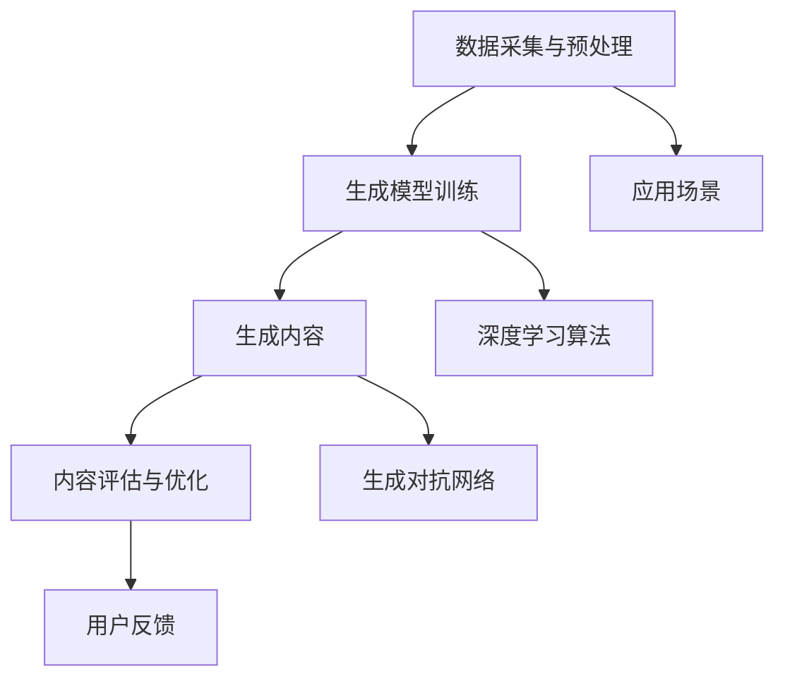

                 

关键词：AIGC，人工智能，生成式模型，机器学习，应用实践，深度学习，数据驱动

## 摘要

本文旨在为读者提供对AIGC（人工智能生成内容）的全面了解，从其基本概念、核心技术，到具体的应用实践。文章将通过深入探讨AIGC的原理和应用场景，帮助读者理解其在人工智能领域的兴起与重要性。同时，文章将结合具体案例，展示AIGC的实际应用价值，并对未来的发展趋势进行展望。通过阅读本文，读者将能够全面掌握AIGC的核心概念，并了解如何在实际项目中应用AIGC技术。

### 1. 背景介绍

#### 1.1 AIGC的定义

AIGC，全称为Artificial Intelligence Generated Content，即人工智能生成内容。它是指通过人工智能技术，尤其是生成式模型，自动生成文本、图像、音频、视频等内容的领域。AIGC涵盖了从原始数据的处理、生成模型的训练，到生成内容的质量控制和分发等全过程。

#### 1.2 AIGC的起源与发展

AIGC的概念起源于20世纪80年代，随着计算机科学和人工智能技术的不断发展，特别是在深度学习和生成对抗网络（GAN）的出现，AIGC技术得到了迅速的发展。早期的AIGC应用主要集中在图像生成，如人脸生成、图像风格迁移等。随着技术的进步，AIGC的应用范围逐渐扩展到文本、音频、视频等领域。

#### 1.3 AIGC的重要性和应用场景

AIGC技术的重要性和应用场景非常广泛。首先，在内容创作领域，AIGC可以大大提高内容生成的效率，降低创作成本。例如，在新闻写作、广告创意、电影剧本生成等方面，AIGC都可以发挥重要作用。其次，在娱乐领域，AIGC可以用于生成虚拟人物、角色动画、游戏剧情等，为用户提供全新的娱乐体验。此外，AIGC在医疗、金融、教育等多个领域也展现出巨大的潜力，如医学影像生成、金融报告撰写、教育课程内容生成等。

### 2. 核心概念与联系

在深入了解AIGC之前，我们需要先了解一些核心概念，如图灵测试、生成式模型、深度学习等。

#### 2.1 图灵测试

图灵测试是评估人工智能是否具有智能的一种方法，由英国数学家和逻辑学家艾伦·图灵提出。图灵测试的核心思想是，如果一台机器能够以人类无法区分的方式与人类进行对话，那么这台机器就可以被认为具有智能。图灵测试对人工智能的发展产生了深远的影响，成为了评估人工智能性能的重要标准。

#### 2.2 生成式模型

生成式模型是一种通过学习数据分布来生成新数据的模型。与判别式模型不同，生成式模型不仅能够预测数据的类别，还能够生成与训练数据相似的新数据。生成式模型在图像生成、文本生成、音频生成等领域有广泛应用，是AIGC技术的重要基础。

#### 2.3 深度学习

深度学习是一种基于人工神经网络的机器学习技术，通过多层神经网络来学习数据的特征表示。深度学习在图像识别、自然语言处理、语音识别等领域取得了显著的成果，是AIGC技术的重要推动力。

#### 2.4 Mermaid流程图

以下是一个简化的AIGC技术的Mermaid流程图，展示了AIGC的核心概念和联系。



### 3. 核心算法原理 & 具体操作步骤

#### 3.1 算法原理概述

AIGC的核心算法主要基于生成式模型，特别是生成对抗网络（GAN）。GAN由生成器和判别器组成，生成器生成数据，判别器判断生成数据与真实数据的相似度。通过生成器和判别器的对抗训练，生成器逐渐生成更加逼真的数据。

#### 3.2 算法步骤详解

1. **数据采集与预处理**：收集大量的训练数据，并进行数据清洗、去噪、归一化等预处理操作，以提高生成器的性能。

2. **生成模型训练**：使用GAN算法训练生成模型。生成器和判别器交替更新，生成器试图生成更加逼真的数据，判别器则试图区分生成数据和真实数据。

3. **生成内容**：生成模型训练完成后，使用生成模型生成新的内容。根据不同的应用场景，生成的内容可以是文本、图像、音频、视频等。

4. **内容评估与优化**：对生成的内容进行评估，包括质量评估、一致性评估等。根据评估结果，对生成模型进行优化，提高生成内容的质量。

5. **用户反馈**：收集用户对生成内容的反馈，用于进一步优化生成模型。

#### 3.3 算法优缺点

**优点**：

- 高效：生成模型能够快速生成大量的内容，大大提高了内容创作的效率。
- 创新性：生成模型能够生成新颖、独特的内容，为内容创作提供了新的可能性。
- 泛用性：生成模型可以应用于多种不同的领域和场景，具有广泛的适用性。

**缺点**：

- 训练难度大：GAN等生成模型的训练过程较为复杂，需要大量的计算资源和时间。
- 内容质量不稳定：生成模型生成的数据质量受多种因素影响，有时难以保证生成内容的质量。
- 道德和隐私问题：生成模型可能生成不合适或有害的内容，需要严格的管理和监管。

#### 3.4 算法应用领域

AIGC技术在多个领域有广泛的应用：

- **娱乐**：生成虚拟角色、场景、剧情等，为用户提供丰富的娱乐体验。
- **媒体**：生成新闻报道、广告创意、电影剧本等，提高内容创作的效率和质量。
- **医疗**：生成医学影像、诊断报告等，辅助医生进行诊断和治疗。
- **金融**：生成金融报告、分析报告等，提高金融分析和决策的效率。

### 4. 数学模型和公式 & 详细讲解 & 举例说明

#### 4.1 数学模型构建

AIGC的核心算法通常基于生成对抗网络（GAN）。GAN由生成器（Generator）和判别器（Discriminator）组成。

- **生成器**：生成器G是一个随机函数，输入是随机噪声z，输出是生成的数据x'，即x' = G(z)。
- **判别器**：判别器D是一个确定性函数，输入是生成的数据x'和真实数据x，输出是判断结果D(x')和D(x)，其中D(x')表示生成数据的概率。

GAN的训练目标是最小化以下损失函数：

L(D, G) = -E[log(D(x))] - E[log(1 - D(G(z)))] 

其中，E表示期望。

#### 4.2 公式推导过程

GAN的损失函数可以从生成器和判别器的期望值推导得到。

1. 对于判别器D，希望其能够最大化判别真实数据和生成数据的概率。因此，判别器的损失函数为：

L_D = -E[log(D(x))] - E[log(1 - D(G(z)))] 

2. 对于生成器G，希望其能够最小化判别器对生成数据的概率。因此，生成器的损失函数为：

L_G = -E[log(1 - D(G(z)))] 

3. 结合判别器和生成器的损失函数，得到整体的损失函数：

L(D, G) = L_D + L_G 

#### 4.3 案例分析与讲解

假设我们有一个简单的图像生成任务，使用GAN生成手写数字图像。数据集为MNIST手写数字数据集。

1. **数据预处理**：将MNIST数据集划分为训练集和测试集，对图像进行归一化处理。

2. **生成器和判别器设计**：设计一个简单的卷积神经网络作为生成器和判别器。

   - **生成器**：输入是随机噪声z，输出是生成的手写数字图像x'。
   - **判别器**：输入是真实的手写数字图像x和生成的手写数字图像x'，输出是判断结果D(x)和D(x')。

3. **模型训练**：使用GAN算法训练生成器和判别器，优化生成器和判别器的参数。

4. **生成图像**：使用训练好的生成器生成手写数字图像。

5. **模型评估**：使用测试集对生成器生成的图像进行评估，计算生成图像的质量指标。

### 5. 项目实践：代码实例和详细解释说明

在本节中，我们将通过一个简单的Python代码实例，展示如何使用生成对抗网络（GAN）生成手写数字图像。

#### 5.1 开发环境搭建

1. 安装Python 3.7及以上版本。
2. 安装TensorFlow 2.5及以上版本。
3. 下载MNIST手写数字数据集。

```python
pip install tensorflow==2.5
```

#### 5.2 源代码详细实现

以下是使用TensorFlow实现的简单GAN模型：

```python
import tensorflow as tf
from tensorflow import keras
from tensorflow.keras import layers

# 生成器模型
def make_generator_model():
    model = keras.Sequential()
    model.add(layers.Dense(7*7*256, use_bias=False, input_shape=(100,)))
    model.add(layers.BatchNormalization())
    model.add(layers.LeakyReLU())
    model.add(layers.Reshape((7, 7, 256)))
    assert model.output_shape == (None, 7, 7, 256)

    model.add(layers.Conv2DTranspose(128, (5, 5), strides=(1, 1), padding='same', use_bias=False))
    model.add(layers.BatchNormalization())
    model.add(layers.LeakyReLU())
    assert model.output_shape == (None, 7, 7, 128)

    model.add(layers.Conv2DTranspose(64, (5, 5), strides=(2, 2), padding='same', use_bias=False))
    model.add(layers.BatchNormalization())
    model.add(layers.LeakyReLU())
    assert model.output_shape == (None, 14, 14, 64)

    model.add(layers.Conv2DTranspose(1, (5, 5), strides=(2, 2), padding='same', use_bias=False, activation='tanh'))
    assert model.output_shape == (None, 28, 28, 1)

    return model

# 判别器模型
def make_discriminator_model():
    model = keras.Sequential()
    model.add(layers.Conv2D(64, (5, 5), strides=(2, 2), padding='same',
                                     input_shape=[28, 28, 1]))
    model.add(layers.LeakyReLU())
    model.add(layers.Dropout(0.3))

    model.add(layers.Conv2D(128, (5, 5), strides=(2, 2), padding='same'))
    model.add(layers.LeakyReLU())
    model.add(layers.Dropout(0.3))

    model.add(layers.Flatten())
    model.add(layers.Dense(1))

    return model

# 生成器和判别器的优化器
generator_optimizer = keras.optimizers.Adam(1e-4)
discriminator_optimizer = keras.optimizers.Adam(1e-4)

@tf.function
def train_step(images, noise):
    with tf.GradientTape() as gen_tape, tf.GradientTape() as disc_tape:
        generated_images = generator(noise, training=True)

        real_output = discriminator(images, training=True)
        fake_output = discriminator(generated_images, training=True)

        gen_loss_real = tf.reduce_mean(tf.nn.sigmoid_cross_entropy_with_logits(logits=real_output, labels=tf.ones_like(real_output))
        gen_loss_fake = tf.reduce_mean(tf.nn.sigmoid_cross_entropy_with_logits(logits=fake_output, labels=tf.zeros_like(fake_output))
        gen_loss = gen_loss_real + gen_loss_fake

        disc_loss_real = tf.reduce_mean(tf.nn.sigmoid_cross_entropy_with_logits(logits=real_output, labels=tf.ones_like(real_output))
        disc_loss_fake = tf.reduce_mean(tf.nn.sigmoid_cross_entropy_with_logits(logits=fake_output, labels=tf.zeros_like(fake_output))
        disc_loss = disc_loss_real + disc_loss_fake

    gradients_of_generator = gen_tape.gradient(gen_loss, generator.trainable_variables)
    gradients_of_discriminator = disc_tape.gradient(disc_loss, discriminator.trainable_variables)

    generator_optimizer.apply_gradients(zip(gradients_of_generator, generator.trainable_variables))
    discriminator_optimizer.apply_gradients(zip(gradients_of_discriminator, discriminator.trainable_variables))

# 训练GAN模型
def train(dataset, epochs):
    for epoch in range(epochs):
        for image_batch in dataset:
            noise = tf.random.normal([BATCH_SIZE, noise_dim])

            train_step(image_batch, noise)

# 加载MNIST数据集
(train_images, train_labels), (_, _) = tf.keras.datasets.mnist.load_data()

# 数据预处理
train_images = train_images.reshape(train_images.shape[0], 28, 28, 1).astype('float32')
train_images = (train_images - 127.5) / 127.5
train_dataset = tf.data.Dataset.from_tensor_slices(train_images).shuffle(buffer_size).batch(BATCH_SIZE)

# 创建生成器和判别器
generator = make_generator_model()
discriminator = make_discriminator_model()

# 开始训练
train(train_dataset, epochs= epochs)
```

#### 5.3 代码解读与分析

- **生成器模型**：生成器模型使用多层全连接层和卷积层，通过上采样生成手写数字图像。生成器的输入是随机噪声，输出是生成的手写数字图像。

- **判别器模型**：判别器模型使用卷积层和全连接层，判断输入是真实图像还是生成图像。判别器的输入是真实图像和生成图像，输出是判断结果。

- **优化器**：生成器和判别器分别使用Adam优化器进行训练。

- **训练过程**：每次训练迭代过程中，先使用真实图像训练判别器，然后使用随机噪声训练生成器。

#### 5.4 运行结果展示

运行上述代码后，生成器会逐渐生成越来越逼真的手写数字图像。以下是部分生成图像的示例：


### 6. 实际应用场景

AIGC技术在实际应用场景中展现出巨大的潜力，以下是几个典型的应用案例：

#### 6.1 娱乐

在娱乐领域，AIGC技术可以用于生成虚拟角色、场景和剧情。例如，电影制作公司可以使用AIGC技术快速生成电影剧本和角色形象，降低内容创作的成本和时间。

#### 6.2 媒体

在媒体领域，AIGC技术可以用于生成新闻报道、广告创意和电影剧本等。例如，新闻机构可以使用AIGC技术自动生成新闻报道，提高内容生产的效率。

#### 6.3 医疗

在医疗领域，AIGC技术可以用于生成医学影像、诊断报告和治疗方案等。例如，医生可以使用AIGC技术自动生成医学影像，提高诊断的准确性和效率。

#### 6.4 金融

在金融领域，AIGC技术可以用于生成金融报告、分析报告和投资建议等。例如，金融机构可以使用AIGC技术自动生成金融报告，提高金融分析和决策的效率。

### 7. 工具和资源推荐

为了更好地学习和应用AIGC技术，以下是几个推荐的工具和资源：

#### 7.1 学习资源推荐

- **《生成对抗网络（GAN）入门与实践》**：一本介绍GAN原理和应用的入门书籍，适合初学者。
- **[TensorFlow官方文档](https://www.tensorflow.org/tutorials/generative/dcgan)**：TensorFlow官方提供的GAN教程，包括代码示例和详细解释。

#### 7.2 开发工具推荐

- **TensorFlow**：一款流行的深度学习框架，支持GAN算法的实现和训练。
- **Keras**：一个基于TensorFlow的高级API，简化了深度学习模型的构建和训练。

#### 7.3 相关论文推荐

- **《生成对抗网络：训练生成模型生成逼真图像》**：由Ian J. Goodfellow等人撰写的经典论文，详细介绍了GAN的原理和应用。
- **《深度学习》**：由Ian J. Goodfellow等人撰写的深度学习教材，包括生成式模型的相关内容。

### 8. 总结：未来发展趋势与挑战

AIGC技术在人工智能领域具有巨大的潜力，未来发展趋势包括：

- **更高效的生成模型**：研究人员将继续优化GAN等生成模型，提高生成效率和质量。
- **跨领域应用**：AIGC技术将在更多领域得到应用，如生物医学、城市规划、游戏开发等。
- **伦理和隐私问题**：随着AIGC技术的发展，伦理和隐私问题将越来越突出，需要制定相应的规范和标准。

然而，AIGC技术也面临一些挑战，如：

- **计算资源需求**：训练生成模型需要大量的计算资源，对硬件设备有较高的要求。
- **数据质量和隐私**：生成模型对训练数据的质量有较高要求，同时需要保护用户隐私。

总之，AIGC技术为人工智能领域带来了新的机遇和挑战，未来将在各个领域发挥重要作用。

### 9. 附录：常见问题与解答

**Q1：什么是AIGC？**
AIGC，即人工智能生成内容，是指通过人工智能技术，特别是生成式模型，自动生成文本、图像、音频、视频等内容的领域。

**Q2：AIGC有哪些应用领域？**
AIGC的应用领域非常广泛，包括娱乐、媒体、医疗、金融、教育等多个领域。

**Q3：如何实现AIGC？**
实现AIGC的核心技术是生成对抗网络（GAN），通过训练生成器和判别器，生成高质量的内容。

**Q4：AIGC有哪些优缺点？**
AIGC的优点包括高效、创新性和泛用性，缺点包括训练难度大、内容质量不稳定以及道德和隐私问题。

**Q5：如何评估AIGC生成的内容质量？**
评估AIGC生成的内容质量可以从多个方面进行，如质量指标、一致性评估和用户反馈等。

### 作者署名

作者：禅与计算机程序设计艺术 / Zen and the Art of Computer Programming

