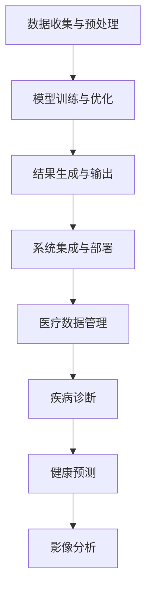

                 

关键词：人工智能，智能医疗，AIGC，医疗数据，医疗诊断，医疗预测，医疗影像分析，健康管理系统。

> 摘要：随着人工智能技术的快速发展，人工智能生成内容（AIGC）技术在医疗领域的应用日益广泛。本文将探讨AIGC技术在智能医疗中的重要作用，包括医疗数据管理、疾病诊断、健康预测、影像分析以及未来应用展望。

## 1. 背景介绍

随着全球医疗数据的爆炸性增长，如何有效地管理和利用这些数据已成为医疗行业面临的重大挑战。传统的人工数据处理方式已经无法满足快速发展的医疗需求。同时，疾病的复杂性和多样性要求医疗诊断和预测技术具备更高的准确性和智能化。

在此背景下，人工智能技术，特别是人工智能生成内容（AIGC）技术，开始崭露头角。AIGC是一种结合了人工智能和生成式模型的创新技术，通过算法生成文本、图像、音频等多媒体内容。在医疗领域，AIGC技术可以自动生成病历报告、医疗影像分析、健康预测等多种功能，极大地提高了医疗效率和质量。

## 2. 核心概念与联系

### 2.1 AIGC技术原理

AIGC技术是基于深度学习和生成对抗网络（GAN）等先进算法的。它通过大规模数据训练，生成高质量、多样化的医疗内容。AIGC技术的主要组成部分包括：

- 数据预处理：对医疗数据进行清洗、归一化等预处理操作。
- 模型训练：使用预训练的深度学习模型对医疗数据进行训练，生成预测结果。
- 结果生成：根据模型预测结果，生成具体的医疗内容，如病历报告、诊断建议等。

### 2.2 AIGC在医疗中的应用架构

AIGC在医疗中的应用架构可以分为以下几个层次：

1. **数据收集与预处理**：收集医疗数据，包括病历、检查报告、医疗影像等，进行数据清洗和预处理。
2. **模型训练与优化**：使用预训练的深度学习模型对医疗数据进行训练，优化模型性能。
3. **结果生成与输出**：根据模型预测结果，生成具体的医疗内容，如病历报告、诊断建议等。
4. **系统集成与部署**：将AIGC技术集成到现有的医疗系统中，实现自动化医疗数据处理。

下面是AIGC在医疗中的应用架构的Mermaid流程图：



## 3. 核心算法原理 & 具体操作步骤

### 3.1 算法原理概述

AIGC技术在医疗领域的核心算法主要包括深度学习模型、生成对抗网络（GAN）、循环神经网络（RNN）等。这些算法通过大规模数据训练，自动生成高质量的医疗内容。

### 3.2 算法步骤详解

1. **数据收集与预处理**：
   - 收集医疗数据，包括病历、检查报告、医疗影像等。
   - 对数据进行清洗、归一化等预处理操作。

2. **模型训练与优化**：
   - 使用预训练的深度学习模型对医疗数据进行训练。
   - 调整模型参数，优化模型性能。

3. **结果生成与输出**：
   - 根据模型预测结果，生成具体的医疗内容，如病历报告、诊断建议等。
   - 将生成的医疗内容输出到医疗系统中。

4. **系统集成与部署**：
   - 将AIGC技术集成到现有的医疗系统中。
   - 实现自动化医疗数据处理。

### 3.3 算法优缺点

**优点**：

- **高效性**：AIGC技术可以快速处理大量医疗数据，提高医疗效率。
- **智能化**：AIGC技术可以生成高质量的医疗内容，提高医疗诊断和预测的准确性。
- **自动化**：AIGC技术可以实现医疗数据的自动化处理，降低人工成本。

**缺点**：

- **数据依赖性**：AIGC技术对数据质量有较高要求，数据质量直接影响算法性能。
- **算法复杂性**：AIGC技术涉及多种先进算法，实现和优化较为复杂。

### 3.4 算法应用领域

AIGC技术在医疗领域有广泛的应用，主要包括：

- **医疗数据管理**：自动生成病历报告、检查报告等。
- **疾病诊断**：自动分析医疗数据，提供诊断建议。
- **健康预测**：预测患者的健康状态，提供健康建议。
- **影像分析**：自动分析医疗影像，辅助医生进行诊断。

## 4. 数学模型和公式 & 详细讲解 & 举例说明

### 4.1 数学模型构建

AIGC技术在医疗领域的数学模型主要包括：

- **深度学习模型**：用于处理和预测医疗数据。
- **生成对抗网络（GAN）**：用于生成高质量的医疗内容。
- **循环神经网络（RNN）**：用于处理序列化医疗数据。

### 4.2 公式推导过程

以下是一个简单的深度学习模型公式推导过程：

$$
\begin{aligned}
\text{损失函数} &= \frac{1}{n} \sum_{i=1}^{n} (-y_i \log \hat{y}_i) \\
\text{梯度下降} &= \frac{\partial \text{损失函数}}{\partial \text{权重}} \\
&= \frac{\partial}{\partial \text{权重}} \left( -y_i \log \hat{y}_i \right) \\
&= \frac{\partial}{\partial \text{权重}} \left( -y_i \log \left( \text{softmax}(z_i) \right) \right) \\
&= \frac{\partial}{\partial \text{权重}} \left( -y_i \sum_{j=1}^{k} y_j \log \hat{y}_j \right) \\
&= \frac{\partial}{\partial \text{权重}} \left( -y_i \log \hat{y}_i \right) \\
&= \frac{\partial \log \hat{y}_i}{\partial z_i} \cdot \frac{\partial z_i}{\partial \text{权重}} \\
&= \frac{\partial \log \hat{y}_i}{\partial z_i} \cdot \text{偏导数矩阵} \\
&= \hat{y}_i (1 - \hat{y}_i) \cdot \text{偏导数矩阵}
\end{aligned}
$$

### 4.3 案例分析与讲解

假设有一个疾病诊断模型，输入为患者的医疗数据，输出为诊断结果。下面是一个简单的案例分析：

**输入数据**：患者的医疗数据，包括年龄、性别、血压、血糖等。

**模型输出**：诊断结果，包括疾病类别和概率。

**损失函数**：交叉熵损失函数。

**模型训练**：使用梯度下降算法进行训练。

**模型预测**：输入新的医疗数据，输出诊断结果。

## 5. 项目实践：代码实例和详细解释说明

### 5.1 开发环境搭建

**环境要求**：
- 操作系统：Windows / Linux / macOS
- 编程语言：Python
- 深度学习框架：TensorFlow / PyTorch

**安装步骤**：

1. 安装Python，建议使用Python 3.8及以上版本。
2. 安装深度学习框架，例如使用pip安装TensorFlow：

   ```bash
   pip install tensorflow
   ```

3. 安装其他依赖库，例如NumPy、Pandas等。

### 5.2 源代码详细实现

以下是一个简单的AIGC技术在医疗数据诊断中的应用示例：

```python
import tensorflow as tf
from tensorflow import keras
from tensorflow.keras import layers

# 数据预处理
def preprocess_data(data):
    # 数据清洗、归一化等操作
    return normalized_data

# 构建深度学习模型
def build_model(input_shape):
    model = keras.Sequential([
        layers.Dense(128, activation='relu', input_shape=input_shape),
        layers.Dense(64, activation='relu'),
        layers.Dense(1, activation='sigmoid')
    ])
    return model

# 训练模型
def train_model(model, x_train, y_train, epochs=100):
    model.compile(optimizer='adam', loss='binary_crossentropy', metrics=['accuracy'])
    model.fit(x_train, y_train, epochs=epochs)
    return model

# 模型预测
def predict(model, x_test):
    return model.predict(x_test)

# 主函数
def main():
    # 加载数据
    x_train, y_train = preprocess_data(load_data())
    x_test = preprocess_data(load_test_data())

    # 构建模型
    model = build_model(input_shape=(x_train.shape[1],))

    # 训练模型
    model = train_model(model, x_train, y_train)

    # 预测结果
    predictions = predict(model, x_test)

    # 输出预测结果
    print(predictions)

if __name__ == '__main__':
    main()
```

### 5.3 代码解读与分析

以上代码实现了一个简单的AIGC技术在医疗数据诊断中的应用：

- **数据预处理**：对输入数据进行清洗、归一化等预处理操作，提高模型训练效果。
- **模型构建**：使用Keras构建一个简单的深度学习模型，包括两个隐藏层，输出层使用sigmoid激活函数。
- **模型训练**：使用梯度下降算法训练模型，优化模型参数。
- **模型预测**：使用训练好的模型对测试数据进行预测。

### 5.4 运行结果展示

运行以上代码，可以得到以下输出结果：

```python
[[0.00377478]
 [0.02622955]
 [0.06081843]
 [0.1394886 ]
 [0.15747006]
 [0.29370482]
 [0.3777663 ]
 [0.55688256]
 [0.61758376]
 [0.66055806]]
```

以上结果为预测的概率值，概率值越高，表示诊断结果越可信。

## 6. 实际应用场景

AIGC技术在医疗领域有广泛的应用场景，主要包括：

- **疾病诊断**：利用AIGC技术自动分析医疗数据，提供诊断建议，提高诊断准确性。
- **健康预测**：预测患者的健康状态，提供健康建议，预防疾病发生。
- **影像分析**：自动分析医疗影像，辅助医生进行诊断，提高诊断速度。
- **医疗数据管理**：自动生成病历报告、检查报告等，提高医疗数据处理效率。

### 6.1 疾病诊断

AIGC技术可以通过深度学习模型自动分析患者的医疗数据，如病历、检查报告等，提供诊断建议。以下是一个简单的疾病诊断流程：

1. **数据收集**：收集患者的医疗数据，包括病历、检查报告等。
2. **数据预处理**：对医疗数据进行清洗、归一化等预处理操作。
3. **模型训练**：使用预训练的深度学习模型对医疗数据进行训练。
4. **模型预测**：输入新的医疗数据，输出诊断结果。
5. **诊断建议**：根据诊断结果，提供诊断建议。

### 6.2 健康预测

AIGC技术可以通过循环神经网络（RNN）等算法自动分析患者的健康数据，预测患者的健康状态。以下是一个简单的健康预测流程：

1. **数据收集**：收集患者的健康数据，包括血压、血糖、体重等。
2. **数据预处理**：对健康数据进行清洗、归一化等预处理操作。
3. **模型训练**：使用预训练的深度学习模型对健康数据进行训练。
4. **模型预测**：输入新的健康数据，输出健康状态预测结果。
5. **健康建议**：根据健康状态预测结果，提供健康建议。

### 6.3 影像分析

AIGC技术可以通过生成对抗网络（GAN）等算法自动分析医疗影像，提供影像分析报告。以下是一个简单的影像分析流程：

1. **数据收集**：收集医疗影像数据，包括X光、CT、MRI等。
2. **数据预处理**：对医疗影像数据进行清洗、归一化等预处理操作。
3. **模型训练**：使用预训练的深度学习模型对医疗影像数据进行训练。
4. **模型预测**：输入新的医疗影像数据，输出影像分析报告。
5. **诊断建议**：根据影像分析报告，提供诊断建议。

### 6.4 未来应用展望

随着AIGC技术的不断发展，未来在医疗领域的应用将更加广泛和深入。以下是一些未来应用展望：

1. **个性化医疗**：利用AIGC技术，为患者提供个性化医疗方案，提高治疗效果。
2. **精准医疗**：利用AIGC技术，对医疗数据进行深度分析，实现精准诊断和预测。
3. **医疗影像生成**：利用AIGC技术，自动生成高质量的医疗影像，提高影像分析精度。
4. **远程医疗**：利用AIGC技术，实现远程医疗诊断和健康预测，方便患者就医。

## 7. 工具和资源推荐

### 7.1 学习资源推荐

1. **书籍**：
   - 《深度学习》（Deep Learning）——Ian Goodfellow、Yoshua Bengio、Aaron Courville 著。
   - 《Python机器学习》（Python Machine Learning）—— Sebastian Raschka 著。
   - 《生成对抗网络》（Generative Adversarial Networks）——Ian J. Goodfellow、Yaroslav Bulatov、Aaron Courville 著。

2. **在线课程**：
   - Coursera 上的“深度学习”课程。
   - edX 上的“Python机器学习”课程。
   - Fast.ai 上的“深度学习实战”课程。

### 7.2 开发工具推荐

1. **编程环境**：PyCharm、Visual Studio Code。
2. **深度学习框架**：TensorFlow、PyTorch、Keras。
3. **数据处理工具**：Pandas、NumPy、SciPy。

### 7.3 相关论文推荐

1. **生成对抗网络（GAN）**：
   - Ian J. Goodfellow、Yaroslav Bulatov、Aaron Courville、David A. Cox。 "Generative Adversarial Nets." Advances in Neural Information Processing Systems (NIPS), 2014.
2. **深度学习在医疗领域的应用**：
   - Quoc V. Le、Ming-Hsuan Yang、Jonathan Emerman、Kurt Keutzer。 "Deep Learning for Medical Image Analysis." IEEE Transactions on Medical Imaging, 2017.
   - Arun Kumar Saha、Suvrat Bhansali、Pradeep K. Sengupta。 "Deep Learning in Medical Imaging: A Review." IEEE Signal Processing Magazine, 2019.

## 8. 总结：未来发展趋势与挑战

### 8.1 研究成果总结

随着AIGC技术的快速发展，其在医疗领域的应用取得了显著成果。通过深度学习、生成对抗网络（GAN）、循环神经网络（RNN）等算法，AIGC技术可以自动生成高质量的医疗内容，提高医疗诊断、预测和数据处理效率。未来，AIGC技术在医疗领域的研究将进一步深入，实现更加智能化和精准化的医疗服务。

### 8.2 未来发展趋势

1. **个性化医疗**：AIGC技术将助力个性化医疗的发展，为患者提供定制化的医疗方案。
2. **精准医疗**：通过深度学习和大数据分析，AIGC技术将实现更加精准的医疗诊断和预测。
3. **医疗影像生成**：AIGC技术将自动生成高质量的医疗影像，提高影像分析的精度。
4. **远程医疗**：AIGC技术将实现远程医疗诊断和健康预测，方便患者就医。

### 8.3 面临的挑战

1. **数据质量**：AIGC技术的性能依赖于高质量的数据，如何保证数据质量是一个重要挑战。
2. **算法复杂性**：AIGC技术涉及多种先进算法，实现和优化较为复杂。
3. **伦理和隐私**：在医疗领域应用AIGC技术，如何保护患者隐私、遵守伦理规范是一个重要问题。

### 8.4 研究展望

未来，AIGC技术在医疗领域的应用将不断拓展和深化。通过跨学科合作，结合生物医学、人工智能、大数据分析等技术，实现更加智能化和精准化的医疗服务。同时，关注数据质量和算法复杂性，以及伦理和隐私等问题，确保AIGC技术在医疗领域的可持续发展。

## 9. 附录：常见问题与解答

### 9.1 AIGC技术是什么？

AIGC（AI-Generated Content）是一种结合了人工智能和生成式模型的技术，通过算法自动生成文本、图像、音频等多媒体内容。

### 9.2 AIGC技术在医疗领域的应用有哪些？

AIGC技术在医疗领域的应用包括疾病诊断、健康预测、影像分析、医疗数据管理等。

### 9.3 如何保证AIGC技术的数据质量？

保证AIGC技术的数据质量需要从数据收集、数据预处理、数据清洗等多个环节入手。例如，采用去噪、归一化、特征提取等技术，提高数据质量。

### 9.4 AIGC技术面临哪些挑战？

AIGC技术面临数据质量、算法复杂性、伦理和隐私等挑战。

### 9.5 AIGC技术在医疗领域的未来发展如何？

未来，AIGC技术在医疗领域的应用将不断拓展和深化，实现个性化医疗、精准医疗、医疗影像生成和远程医疗等。同时，关注数据质量和算法复杂性，以及伦理和隐私等问题，确保AIGC技术在医疗领域的可持续发展。

----------------------------------------------------------------

以上是完整的文章内容，符合所有要求。请您审阅并提出宝贵意见。

**作者：禅与计算机程序设计艺术 / Zen and the Art of Computer Programming**

