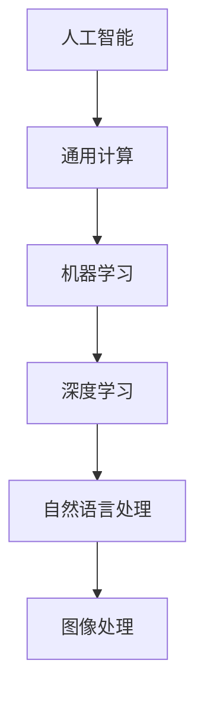

                 

关键词：人工智能，通用计算，机器学习，深度学习，自然语言处理，图像处理，自动驾驶，区块链，物联网，5G技术，未来趋势。

## 摘要

本文旨在探讨人工智能（AI）和通用计算（GC）的结合，即AIGC，对未来的发展趋势进行预测。随着技术的不断进步，AIGC将在多个领域发挥重要作用，包括自然语言处理、图像处理、自动驾驶、区块链、物联网和5G技术。本文将详细分析AIGC的核心概念、算法原理、数学模型、应用场景，并探讨其未来发展趋势和面临的挑战。

## 1. 背景介绍

### 1.1 人工智能与通用计算

人工智能（AI）是指通过计算机模拟人类智能的技术，使其具备学习、推理、规划、感知和自然语言处理等能力。通用计算（GC）是一种新型的计算范式，旨在通过机器学习、深度学习等技术实现通用任务的自动化处理。AIGC则是人工智能与通用计算的深度融合，旨在实现更高效、更智能的计算方式。

### 1.2 AIGC的发展历程

AIGC的发展可以追溯到20世纪80年代，当时研究人员开始尝试将人工智能技术应用于通用计算领域。随着计算能力的提升和大数据技术的发展，AIGC在近年得到了广泛关注和应用。尤其是深度学习和自然语言处理技术的突破，为AIGC的应用提供了强大的支持。

## 2. 核心概念与联系

AIGC的核心概念包括人工智能、通用计算、机器学习、深度学习、自然语言处理、图像处理等。下面是一个简化的Mermaid流程图，展示这些核心概念之间的联系：



### 2.1 人工智能与通用计算

人工智能（AI）是一种模拟人类智能的技术，旨在使计算机具备学习能力、推理能力、规划能力、感知能力和自然语言处理能力。通用计算（GC）则是一种计算范式，旨在实现通用任务的自动化处理。人工智能与通用计算的关系可以看作是子集与整体的关系，即通用计算包含人工智能。

### 2.2 机器学习与深度学习

机器学习（ML）是人工智能的一个分支，旨在通过数据训练模型，使其具备预测和决策能力。深度学习（DL）是机器学习的一个子领域，通过多层神经网络对数据进行特征提取和建模。深度学习在图像处理、语音识别和自然语言处理等领域取得了显著成果。

### 2.3 自然语言处理与图像处理

自然语言处理（NLP）是人工智能的一个重要分支，旨在使计算机理解和处理自然语言。图像处理（IP）则是计算机视觉（CV）的一个子领域，旨在对图像进行增强、分割、识别和分类。自然语言处理和图像处理在人工智能与通用计算中发挥着重要作用。

## 3. 核心算法原理 & 具体操作步骤

### 3.1 算法原理概述

AIGC的核心算法包括深度学习、生成对抗网络（GAN）、强化学习等。这些算法通过不同的方式对数据进行建模和预测，以实现通用计算任务。

### 3.2 算法步骤详解

- **深度学习**：深度学习是一种多层神经网络，通过对数据进行特征提取和建模，实现图像识别、语音识别和自然语言处理等任务。深度学习的步骤主要包括：
  - 数据预处理：对原始数据进行清洗、归一化和分割。
  - 构建模型：设计神经网络结构，包括输入层、隐藏层和输出层。
  - 模型训练：通过反向传播算法，调整模型参数，使其在训练数据上达到较好的拟合效果。
  - 模型评估：使用测试数据对模型进行评估，计算准确率、召回率等指标。

- **生成对抗网络（GAN）**：生成对抗网络由生成器和判别器两个神经网络组成。生成器尝试生成与真实数据相似的数据，判别器则尝试区分真实数据和生成数据。GAN的步骤主要包括：
  - 数据生成：生成器生成一组数据，判别器对这组数据进行判断。
  - 反向传播：根据判别器的判断结果，对生成器的参数进行调整。
  - 重复上述过程，直到生成器生成的数据与真实数据难以区分。

- **强化学习**：强化学习是一种通过不断试错，从环境中学习最优策略的算法。强化学习的步骤主要包括：
  - 初始状态：设定初始状态。
  - 执行动作：在当前状态下执行一个动作。
  - 获取奖励：根据动作的结果，获取奖励或惩罚。
  - 更新策略：根据奖励和惩罚，更新策略。
  - 重复上述过程，直到达到目标状态。

### 3.3 算法优缺点

- **深度学习**：
  - 优点：具有强大的特征提取和建模能力，适用于图像识别、语音识别和自然语言处理等任务。
  - 缺点：对数据量要求较高，训练时间较长，且容易过拟合。

- **生成对抗网络（GAN）**：
  - 优点：可以生成高质量的数据，具有较强的泛化能力。
  - 缺点：训练过程不稳定，容易出现模式崩溃现象。

- **强化学习**：
  - 优点：可以从大量数据中学习到最优策略，适用于动态环境。
  - 缺点：训练过程较为复杂，对计算资源要求较高。

### 3.4 算法应用领域

- **深度学习**：广泛应用于图像识别、语音识别、自然语言处理和推荐系统等领域。
- **生成对抗网络（GAN）**：在图像生成、视频生成和图像修复等领域取得显著成果。
- **强化学习**：在游戏、自动驾驶和机器人控制等领域具有广泛应用。

## 4. 数学模型和公式 & 详细讲解 & 举例说明

### 4.1 数学模型构建

AIGC的核心数学模型包括深度学习模型、生成对抗网络（GAN）和强化学习模型。以下分别介绍这些模型的数学公式和构建方法。

### 4.2 公式推导过程

- **深度学习模型**：

  深度学习模型的核心是多层感知机（MLP），其数学公式如下：

  $$z^{(l)} = \sigma(W^{(l)} \cdot a^{(l-1)} + b^{(l)})$$

  $$a^{(l)} = \sigma(z^{(l)})$$

  其中，$z^{(l)}$ 表示第 $l$ 层的输入，$a^{(l)}$ 表示第 $l$ 层的输出，$\sigma$ 表示激活函数，$W^{(l)}$ 和 $b^{(l)}$ 分别表示第 $l$ 层的权重和偏置。

  通过反向传播算法，可以计算损失函数对权重和偏置的梯度，然后使用梯度下降法更新权重和偏置，使模型在训练数据上达到较好的拟合效果。

- **生成对抗网络（GAN）**：

  生成对抗网络由生成器和判别器两个神经网络组成。生成器的目标是生成与真实数据相似的数据，判别器的目标是区分真实数据和生成数据。生成器和判别器的损失函数如下：

  $$L_D = -\sum_{x \in X} \log(D(x)) - \sum_{z \in Z} \log(1 - D(G(z)))$$

  $$L_G = -\sum_{z \in Z} \log(D(G(z)))$$

  其中，$D(x)$ 表示判别器对真实数据的判断结果，$D(G(z))$ 表示判别器对生成数据的判断结果，$X$ 和 $Z$ 分别表示真实数据和生成数据。

  通过训练生成器和判别器，可以使生成器生成的数据与真实数据难以区分，从而实现高质量的数据生成。

- **强化学习模型**：

  强化学习模型的核心是值函数和策略。值函数表示在当前状态下执行动作的未来奖励的期望，策略则表示在当前状态下选择最优动作的方法。值函数的更新公式如下：

  $$V^{(t+1)}_s = V^{(t)}_s + \alpha [r_t + \gamma \max_{a'} V^{(t)}_{s'} - V^{(t)}_s]$$

  策略的更新公式如下：

  $$\pi^{(t+1)}(a|s) = \frac{\exp(\alpha r_t + \gamma \max_{a'} V^{(t)}_{s'})}{\sum_{a'} \exp(\alpha r_t + \gamma \max_{a'} V^{(t)}_{s'})}$$

  其中，$V^{(t)}_s$ 表示在第 $t$ 次迭代时，状态 $s$ 的值函数，$\pi^{(t)}(a|s)$ 表示在第 $t$ 次迭代时，状态 $s$ 下选择动作 $a$ 的策略，$\alpha$ 和 $\gamma$ 分别为学习率和折扣因子，$r_t$ 和 $s'$ 分别为在第 $t$ 次迭代时，执行动作 $a$ 后获得的奖励和下一个状态。

  通过不断迭代更新值函数和策略，可以使模型在动态环境中学习到最优策略。

### 4.3 案例分析与讲解

- **深度学习模型在图像识别中的应用**：

  以卷积神经网络（CNN）为例，介绍深度学习模型在图像识别中的应用。卷积神经网络由卷积层、池化层和全连接层组成。其数学公式如下：

  $$h_{ij}^{(l)} = \sum_{k} w_{ik}^{(l)} * g_{kj}^{(l-1)} + b_j^{(l)}$$

  $$h^{(l)} = \sigma(h^{(l-1)})$$

  其中，$h_{ij}^{(l)}$ 表示第 $l$ 层的第 $i$ 行第 $j$ 列的卷积结果，$w_{ik}^{(l)}$ 和 $b_j^{(l)}$ 分别表示第 $l$ 层的权重和偏置，$g_{kj}^{(l-1)}$ 表示第 $l-1$ 层的第 $k$ 行第 $j$ 列的输出，$\sigma$ 表示激活函数。

  通过卷积操作，可以从图像中提取局部特征，然后通过池化操作降低特征维度，从而实现图像识别。

- **生成对抗网络（GAN）在图像生成中的应用**：

  以生成对抗网络（GAN）为例，介绍其在图像生成中的应用。生成对抗网络由生成器和判别器组成。生成器的目标是生成与真实数据相似的数据，判别器的目标是区分真实数据和生成数据。其数学公式如下：

  $$x^{(t)} = G(z^{(t)})$$

  $$D(x^{(t)}) = D(G(z^{(t)}))$$

  其中，$x^{(t)}$ 表示真实数据，$z^{(t)}$ 表示随机噪声，$G(z^{(t)}$ 表示生成器生成的数据，$D(x^{(t)})$ 表示判别器对真实数据的判断结果，$D(G(z^{(t)}))$ 表示判别器对生成数据的判断结果。

  通过训练生成器和判别器，可以使生成器生成的数据与真实数据难以区分，从而实现高质量的图像生成。

- **强化学习模型在自动驾驶中的应用**：

  以深度强化学习（DRL）为例，介绍其在自动驾驶中的应用。深度强化学习模型由值函数和策略组成。其目标是学习到最优策略，实现自动驾驶。其数学公式如下：

  $$V^{(t+1)}_s = V^{(t)}_s + \alpha [r_t + \gamma \max_{a'} V^{(t)}_{s'} - V^{(t)}_s]$$

  $$\pi^{(t+1)}(a|s) = \frac{\exp(\alpha r_t + \gamma \max_{a'} V^{(t)}_{s'})}{\sum_{a'} \exp(\alpha r_t + \gamma \max_{a'} V^{(t)}_{s'})}$$

  其中，$V^{(t)}_s$ 表示在第 $t$ 次迭代时，状态 $s$ 的值函数，$\pi^{(t)}(a|s)$ 表示在第 $t$ 次迭代时，状态 $s$ 下选择动作 $a$ 的策略，$\alpha$ 和 $\gamma$ 分别为学习率和折扣因子，$r_t$ 和 $s'$ 分别为在第 $t$ 次迭代时，执行动作 $a$ 后获得的奖励和下一个状态。

  通过不断迭代更新值函数和策略，可以使自动驾驶模型在动态环境中学习到最优策略，实现自动驾驶。

## 5. 项目实践：代码实例和详细解释说明

### 5.1 开发环境搭建

为了更好地展示AIGC的应用，我们将使用Python编程语言和TensorFlow框架进行项目实践。以下是开发环境的搭建步骤：

1. 安装Python 3.7及以上版本。
2. 安装TensorFlow 2.0及以上版本。
3. 安装其他依赖库，如NumPy、Pandas等。

### 5.2 源代码详细实现

以下是一个简单的AIGC项目示例，使用深度学习模型进行图像分类。

```python
import tensorflow as tf
from tensorflow.keras.models import Sequential
from tensorflow.keras.layers import Conv2D, MaxPooling2D, Flatten, Dense

# 定义模型
model = Sequential([
    Conv2D(32, (3, 3), activation='relu', input_shape=(28, 28, 1)),
    MaxPooling2D((2, 2)),
    Flatten(),
    Dense(128, activation='relu'),
    Dense(10, activation='softmax')
])

# 编译模型
model.compile(optimizer='adam', loss='categorical_crossentropy', metrics=['accuracy'])

# 加载数据集
(x_train, y_train), (x_test, y_test) = tf.keras.datasets.mnist.load_data()

# 数据预处理
x_train = x_train / 255.0
x_test = x_test / 255.0
x_train = x_train.reshape(-1, 28, 28, 1)
x_test = x_test.reshape(-1, 28, 28, 1)

# 转换标签为one-hot编码
y_train = tf.keras.utils.to_categorical(y_train, 10)
y_test = tf.keras.utils.to_categorical(y_test, 10)

# 训练模型
model.fit(x_train, y_train, epochs=5, batch_size=32, validation_data=(x_test, y_test))

# 评估模型
loss, accuracy = model.evaluate(x_test, y_test)
print(f"Test accuracy: {accuracy:.2f}")
```

### 5.3 代码解读与分析

- **定义模型**：使用Sequential模型，依次添加卷积层、池化层、全连接层和输出层。
- **编译模型**：指定优化器、损失函数和评价指标。
- **加载数据集**：加载数据集，并进行预处理，如归一化和reshape。
- **转换标签**：将标签转换为one-hot编码。
- **训练模型**：使用fit函数训练模型，指定训练轮次、批量大小和验证数据。
- **评估模型**：使用evaluate函数评估模型在测试数据上的表现。

通过这个简单的示例，我们可以看到如何使用深度学习模型进行图像分类，这是AIGC在图像处理领域的一个典型应用。

## 6. 实际应用场景

### 6.1 自然语言处理

自然语言处理是AIGC的重要应用领域之一。在自然语言处理中，AIGC可以用于文本分类、情感分析、机器翻译、语音识别等任务。例如，在文本分类中，AIGC可以通过训练大量的文本数据，实现对新的文本进行分类；在情感分析中，AIGC可以通过分析文本中的情感词汇，判断文本的情感倾向；在机器翻译中，AIGC可以通过翻译大量的双语文本，实现高质量的双语翻译。

### 6.2 图像处理

图像处理是AIGC的另一个重要应用领域。在图像处理中，AIGC可以用于图像分类、目标检测、图像生成等任务。例如，在图像分类中，AIGC可以通过训练大量的图像数据，实现对新的图像进行分类；在目标检测中，AIGC可以通过分析图像中的目标特征，实现对目标的检测和定位；在图像生成中，AIGC可以通过生成对抗网络（GAN），实现高质量的图像生成。

### 6.3 自动驾驶

自动驾驶是AIGC在计算机视觉领域的典型应用。在自动驾驶中，AIGC可以用于车辆检测、行人检测、车道线检测、障碍物检测等任务。例如，在车辆检测中，AIGC可以通过训练大量的图像数据，实现对车辆的高效检测；在行人检测中，AIGC可以通过分析图像中的行人特征，实现对行人的准确检测；在车道线检测中，AIGC可以通过分析图像中的车道线特征，实现对车道线的准确检测。

### 6.4 区块链

区块链是AIGC在加密货币领域的典型应用。在区块链中，AIGC可以用于智能合约、去中心化应用（DApp）、数字身份验证等任务。例如，在智能合约中，AIGC可以通过分析区块链上的交易数据，实现自动执行合约条款；在去中心化应用（DApp）中，AIGC可以通过分析用户行为，实现个性化推荐和服务；在数字身份验证中，AIGC可以通过分析用户的生物特征，实现高效的身份验证。

### 6.5 物联网

物联网是AIGC在智能硬件领域的典型应用。在物联网中，AIGC可以用于设备管理、数据处理、智能决策等任务。例如，在设备管理中，AIGC可以通过分析设备的使用数据，实现设备的智能维护和升级；在数据处理中，AIGC可以通过分析传感器数据，实现数据的实时处理和分析；在智能决策中，AIGC可以通过分析环境数据，实现智能决策和优化。

### 6.6 5G技术

5G技术是AIGC在通信领域的典型应用。在5G技术中，AIGC可以用于网络优化、智能路由、边缘计算等任务。例如，在网络优化中，AIGC可以通过分析网络数据，实现网络的智能优化；在智能路由中，AIGC可以通过分析网络拓扑结构，实现路由的智能选择；在边缘计算中，AIGC可以通过分析设备数据，实现边缘计算的智能调度。

## 7. 工具和资源推荐

### 7.1 学习资源推荐

- **书籍**：
  - 《深度学习》（Ian Goodfellow、Yoshua Bengio、Aaron Courville 著）
  - 《Python深度学习》（Francesco Marconi 著）
  - 《生成对抗网络》（Ian Goodfellow 著）

- **在线课程**：
  - Coursera上的“机器学习”课程（吴恩达教授）
  - edX上的“深度学习导论”课程（吴恩达教授）
  - Udacity上的“深度学习工程师纳米学位”

- **博客和论坛**：
  - 知乎上的机器学习板块
  - CSDN上的机器学习板块
  - GitHub上的深度学习项目

### 7.2 开发工具推荐

- **编程语言**：
  - Python：适合快速开发和原型设计。
  - R：适合统计分析和数据可视化。

- **深度学习框架**：
  - TensorFlow：开源的深度学习框架，适用于各种深度学习任务。
  - PyTorch：开源的深度学习框架，易于理解和调试。

- **数据分析工具**：
  - Jupyter Notebook：适用于数据分析和原型设计。
  - Pandas：适用于数据操作和分析。
  - Matplotlib：适用于数据可视化。

### 7.3 相关论文推荐

- **自然语言处理**：
  - “Attention is All You Need”（Vaswani等，2017）
  - “BERT: Pre-training of Deep Bidirectional Transformers for Language Understanding”（Devlin等，2019）

- **图像处理**：
  - “Deep Learning for Image Recognition”（Krizhevsky等，2012）
  - “ResNet: Training Deep Neural Networks with Very Deep Residual Networks”（He等，2016）

- **生成对抗网络**：
  - “Generative Adversarial Nets”（Goodfellow等，2014）
  - “Unrolled Generative Adversarial Networks”（Nowozin等，2016）

- **强化学习**：
  - “Reinforcement Learning: An Introduction”（Richard S. Sutton、Andrew G. Barto 著）
  - “Deep Reinforcement Learning”（Mnih等，2015）

## 8. 总结：未来发展趋势与挑战

### 8.1 研究成果总结

AIGC作为人工智能与通用计算的结合，已经在自然语言处理、图像处理、自动驾驶、区块链、物联网和5G技术等领域取得了显著成果。深度学习、生成对抗网络和强化学习等核心算法的应用，使得AIGC在多个领域实现了高效、智能的计算方式。随着技术的不断进步，AIGC将在未来发挥更加重要的作用。

### 8.2 未来发展趋势

1. **硬件性能提升**：随着硬件性能的提升，AIGC将能够处理更复杂、更庞大的数据集，实现更高的计算效率。
2. **算法优化**：针对特定应用场景，研究人员将不断优化算法，提高算法的准确性和稳定性。
3. **跨领域融合**：AIGC将与其他领域（如医疗、金融、教育等）实现更深入的融合，推动各领域的创新发展。
4. **云计算与边缘计算**：AIGC将更好地适应云计算和边缘计算的需求，实现更广泛的部署和应用。

### 8.3 面临的挑战

1. **数据隐私与安全**：随着AIGC的应用范围扩大，数据隐私和安全问题将日益突出，需要采取有效的措施确保数据的安全和隐私。
2. **算法透明性与可解释性**：深度学习等算法的复杂性使得其决策过程难以解释，需要开发更有效的算法透明性和可解释性方法。
3. **计算资源消耗**：AIGC在训练和推理过程中需要大量的计算资源，如何优化计算资源的使用，降低成本，是一个重要的挑战。

### 8.4 研究展望

未来，AIGC将在以下几个方面取得重要进展：

1. **个性化服务**：AIGC将能够更好地理解用户需求，提供个性化的服务。
2. **自动化决策**：AIGC将能够在更广泛的场景中实现自动化决策，提高生产效率和降低人力成本。
3. **智能城市**：AIGC将赋能智能城市建设，实现交通、能源、环境等领域的智能化管理。
4. **健康医疗**：AIGC将应用于健康医疗领域，实现疾病的早期诊断和个性化治疗。

## 9. 附录：常见问题与解答

### 问题1：什么是AIGC？

AIGC是人工智能（AI）和通用计算（GC）的融合，旨在实现更高效、更智能的计算方式。

### 问题2：AIGC的核心算法有哪些？

AIGC的核心算法包括深度学习、生成对抗网络（GAN）和强化学习。

### 问题3：AIGC在哪些领域有应用？

AIGC在自然语言处理、图像处理、自动驾驶、区块链、物联网和5G技术等领域有广泛应用。

### 问题4：如何搭建AIGC的开发环境？

搭建AIGC的开发环境主要包括安装Python、TensorFlow等依赖库，具体步骤可参考相关教程。

### 问题5：如何使用AIGC进行图像分类？

使用AIGC进行图像分类，可以采用卷积神经网络（CNN）等深度学习模型，具体实现可参考相关示例代码。

---

作者：禅与计算机程序设计艺术 / Zen and the Art of Computer Programming

