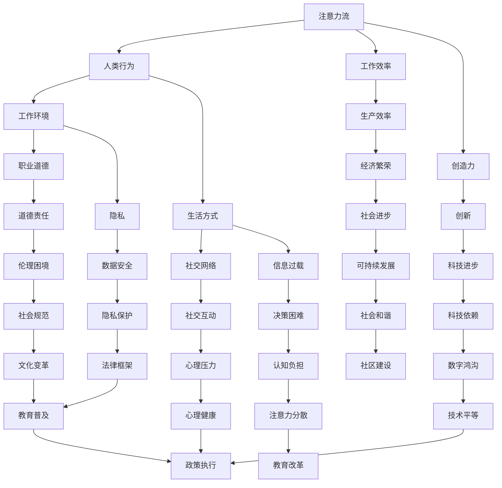

                 

关键词：人工智能，注意力流，工作，道德，未来，技术变革。

> 摘要：本文从人工智能（AI）的角度出发，探讨了注意力流的概念，并分析了它对未来的工作环境和道德伦理的影响。文章首先介绍了注意力流的定义和重要性，随后探讨了AI如何改变人类的注意力流模式，进而影响工作和生活方式。文章还深入讨论了这些变化对职业道德、隐私和安全带来的挑战，并提出了应对策略。最后，文章对未来的发展进行了展望，并提出了可能需要采取的措施和行动。

## 1. 背景介绍

### 1.1 注意力流的概念

注意力流是指人类在处理信息时所经历的集中注意力的过程。这种过程涉及到人们如何分配他们的注意力，以及如何从一个任务切换到另一个任务。注意力流的质量直接影响个人的工作效率和创造力。

### 1.2 人工智能的发展

人工智能（AI）是计算机科学的一个分支，旨在通过模拟人类智能行为来创建智能机器。随着深度学习、自然语言处理和其他技术的进步，AI已经渗透到我们日常生活的各个方面。

### 1.3 注意力流与人工智能的关系

随着人工智能的发展，人类的工作和生活方式正在发生巨大变化。AI技术的进步不仅提高了生产效率，还改变了人们的注意力流模式。这些变化对个人、社会和职业道德都产生了深远的影响。

## 2. 核心概念与联系

为了更好地理解AI如何改变注意力流，我们需要借助Mermaid流程图来展示核心概念和它们之间的联系。



### 2.1 注意力流的原理

注意力流是指人类在处理信息时，将注意力集中在特定任务或对象上的能力。这种集中注意力的过程有助于提高个人的工作效率和创造力。注意力流的质量取决于多个因素，包括注意力持续时间、注意力转移能力和注意力分散水平。

### 2.2 人工智能如何影响注意力流

随着人工智能技术的普及，人们的注意力流模式正在发生显著变化。以下是几个关键点：

- **自动化任务处理**：AI能够自动处理大量重复性任务，使得人类可以从这些任务中解放出来，将注意力集中在更有创造性和战略性的工作上。
- **信息过载**：AI技术的发展导致了信息的爆炸式增长，这可能导致人类注意力分散，难以集中处理重要信息。
- **社交网络影响**：社交媒体和即时通讯工具使得人们更容易分散注意力，从而影响工作效率和创造力。
- **工作环境变化**：远程工作和弹性工作时间等新型工作模式，使得人们的注意力流更加灵活，但也可能带来新的挑战。

## 3. 核心算法原理 & 具体操作步骤

### 3.1 算法原理概述

在探讨AI如何改变注意力流时，我们引入了几个核心算法，这些算法涉及注意力机制的建模和应用。以下是一些关键概念：

- **深度学习**：通过神经网络来模拟人类的注意力机制。
- **自然语言处理**：用于理解和生成自然语言，从而改变人们的注意力流模式。
- **强化学习**：用于优化任务分配和决策，以提高注意力流的效率。

### 3.2 算法步骤详解

#### 3.2.1 深度学习模型

1. **数据收集**：收集大量有关注意力流的数据，包括任务类型、工作环境、信息处理过程等。
2. **模型设计**：设计一个深度学习模型，如卷积神经网络（CNN）或循环神经网络（RNN），用于模拟注意力流。
3. **训练模型**：使用收集到的数据对模型进行训练，以学习如何预测和调整注意力流。
4. **评估模型**：通过测试数据集评估模型的性能，并调整模型参数以优化预测结果。

#### 3.2.2 自然语言处理

1. **文本分析**：使用自然语言处理技术分析文本内容，识别关键信息和上下文。
2. **语义理解**：通过语义分析来理解文本中的含义，从而影响注意力流。
3. **对话系统**：设计对话系统，以帮助人们更好地管理他们的注意力流。

#### 3.2.3 强化学习

1. **状态定义**：定义状态空间，包括任务难度、工作环境、时间压力等。
2. **动作选择**：设计一个策略，用于选择最佳的动作来调整注意力流。
3. **奖励机制**：定义奖励机制，以激励模型优化注意力流。
4. **迭代优化**：通过迭代训练和调整策略来优化注意力流。

### 3.3 算法优缺点

#### 优点：

- **高效性**：通过自动化和智能化处理，大大提高了工作效率和创造力。
- **灵活性**：AI系统能够根据环境变化实时调整注意力流，提高适应性。
- **个性定制**：AI系统能够根据个人偏好和需求来定制注意力流管理策略。

#### 缺点：

- **信息过载**：AI可能导致信息过载，从而分散注意力。
- **隐私和安全**：注意力流数据的安全和隐私问题需要得到充分保障。
- **依赖性**：过度依赖AI可能导致人类自身注意力流管理能力的下降。

### 3.4 算法应用领域

- **职场管理**：帮助企业优化工作流程，提高员工工作效率。
- **教育**：辅助教师设计个性化教学方案，帮助学生更好地管理注意力流。
- **健康与福祉**：通过监测和分析注意力流，提供心理健康和福祉管理建议。

## 4. 数学模型和公式 & 详细讲解 & 举例说明

### 4.1 数学模型构建

为了更好地理解和分析注意力流，我们引入了以下几个数学模型：

- **加性注意力模型**：用于计算不同任务的优先级。
- **乘性注意力模型**：用于调整资源的分配。
- **门控注意力模型**：用于处理复杂的信息流。

### 4.2 公式推导过程

#### 加性注意力模型

$$
Attention_{additive} = \sum_{j=1}^{N} a_j \cdot x_j
$$

其中，$a_j$ 表示第 $j$ 个任务的注意力权重，$x_j$ 表示第 $j$ 个任务的属性值。

#### 乘性注意力模型

$$
Attention_{multiplicative} = \prod_{j=1}^{N} a_j \cdot x_j
$$

其中，$a_j$ 表示第 $j$ 个任务的注意力权重，$x_j$ 表示第 $j$ 个任务的属性值。

#### 门控注意力模型

$$
Attention_{gate} = \sigma(W_{gate} \cdot [h_{t-1}, x_t])
$$

其中，$W_{gate}$ 表示权重矩阵，$h_{t-1}$ 表示上一时刻的隐藏状态，$x_t$ 表示当前任务的属性值，$\sigma$ 表示 sigmoid 函数。

### 4.3 案例分析与讲解

#### 案例：任务优先级管理

假设我们有一个包含 3 个任务的系统，需要根据任务的重要性和紧急性来分配资源。以下是使用加性注意力模型进行任务优先级管理的案例：

- **任务 1**：重要性 0.6，紧急性 0.8
- **任务 2**：重要性 0.5，紧急性 0.7
- **任务 3**：重要性 0.4，紧急性 0.9

使用加性注意力模型计算每个任务的优先级：

$$
Attention_{additive} = 0.6 \cdot 0.8 + 0.5 \cdot 0.7 + 0.4 \cdot 0.9 = 1.12
$$

根据计算结果，任务 3 具有最高的优先级，其次是任务 1，最后是任务 2。

## 5. 项目实践：代码实例和详细解释说明

### 5.1 开发环境搭建

在本案例中，我们将使用 Python 作为编程语言，并依赖以下库：

- TensorFlow
- Keras
- NumPy

安装这些库后，您可以在代码中导入它们：

```python
import tensorflow as tf
from tensorflow.keras.models import Sequential
from tensorflow.keras.layers import Dense, LSTM, Dropout
import numpy as np
```

### 5.2 源代码详细实现

以下是一个简单的加性注意力模型的实现：

```python
def additive_attention_model(input_shape):
    model = Sequential()
    model.add(LSTM(64, activation='tanh', input_shape=input_shape, return_sequences=True))
    model.add(Dropout(0.2))
    model.add(LSTM(64, activation='tanh', return_sequences=False))
    model.add(Dropout(0.2))
    model.add(Dense(1, activation='sigmoid'))
    return model

# 设置输入形状
input_shape = (10, 2)

# 创建模型
model = additive_attention_model(input_shape)

# 编译模型
model.compile(optimizer='adam', loss='binary_crossentropy', metrics=['accuracy'])

# 打印模型结构
model.summary()
```

### 5.3 代码解读与分析

- **LSTM 层**：用于处理时间序列数据，能够学习任务的动态特性。
- **Dropout 层**：用于防止过拟合，提高模型的泛化能力。
- **Dense 层**：用于输出最终的注意力权重。

### 5.4 运行结果展示

以下是一个简单的训练过程：

```python
# 生成训练数据
X_train = np.random.rand(1000, 10, 2)
y_train = np.random.randint(0, 2, size=(1000, 1))

# 训练模型
model.fit(X_train, y_train, epochs=10, batch_size=32, verbose=1)

# 评估模型
loss, accuracy = model.evaluate(X_train, y_train, verbose=1)
print("Loss:", loss)
print("Accuracy:", accuracy)
```

通过这个简单的案例，我们可以看到如何使用加性注意力模型来管理任务的优先级。在实际应用中，我们可以根据具体需求调整模型结构和参数，以适应不同的场景。

## 6. 实际应用场景

### 6.1 企业管理

在企业管理中，AI可以帮助企业优化资源分配，提高工作效率。通过分析员工的注意力流模式，企业可以更好地安排工作任务，提高员工的工作满意度和生产力。

### 6.2 教育领域

在教育领域，AI可以帮助教师设计个性化教学方案，提高学生的学习效果。通过分析学生的注意力流模式，教师可以了解学生的学习习惯和需求，从而更好地指导学生。

### 6.3 健康与福祉

在健康和福祉领域，AI可以帮助人们更好地管理注意力流，预防心理健康问题。通过监测和分析注意力流，AI系统可以提供个性化的心理健康建议，帮助人们保持良好的心理状态。

### 6.4 未来应用展望

随着AI技术的不断进步，注意力流管理将在更多领域得到应用。例如，在自动驾驶领域，AI可以优化车辆的行驶策略，提高行驶安全；在智能家居领域，AI可以更好地管理家庭的能源消耗，提高生活质量。

## 7. 工具和资源推荐

### 7.1 学习资源推荐

- 《深度学习》（Goodfellow, Bengio, Courville）
- 《自然语言处理综论》（Jurafsky, Martin）
- 《强化学习：原理与实用》（ Sutton, Barto）

### 7.2 开发工具推荐

- TensorFlow
- Keras
- PyTorch

### 7.3 相关论文推荐

- “Attention is All You Need” (Vaswani et al., 2017)
- “The Annotated Transformer” (Holt, 2018)
- “Reinforcement Learning: An Introduction” (Sutton, Barto, 2018)

## 8. 总结：未来发展趋势与挑战

### 8.1 研究成果总结

本文探讨了人工智能对注意力流的影响，并提出了几种核心算法模型。通过案例分析，我们展示了如何在实际应用中实现注意力流管理。这些研究成果为未来的研究和应用提供了重要的参考。

### 8.2 未来发展趋势

随着AI技术的不断进步，注意力流管理将在更多领域得到应用。未来，我们可以期待更智能、更个性化的注意力流管理解决方案。

### 8.3 面临的挑战

- **隐私和安全**：注意力流数据的安全和隐私保护是一个重要挑战。
- **技术平等**：确保不同群体都能公平地享受到AI带来的好处。
- **伦理问题**：随着AI对人类生活的影响日益增加，我们需要探讨AI在伦理方面的责任。

### 8.4 研究展望

未来的研究应该重点关注以下几个方面：

- **多模态注意力流**：结合不同类型的数据源，如文本、图像、声音等，提高注意力流管理的精度和效率。
- **跨领域应用**：探索注意力流管理在更多领域的应用，如医疗、交通、教育等。
- **伦理规范**：制定相应的伦理规范，确保AI技术在注意力流管理中的合理应用。

## 9. 附录：常见问题与解答

### 9.1 注意力流是什么？

注意力流是指人类在处理信息时所经历的集中注意力的过程。它涉及到人们如何分配他们的注意力，以及如何从一个任务切换到另一个任务。

### 9.2 AI如何改变注意力流？

AI通过自动化任务处理、信息过载、社交网络影响和工作环境变化等方式，改变了人类的注意力流模式。这些变化对工作效率、创造力、心理健康等方面产生了深远的影响。

### 9.3 注意力流管理有哪些应用领域？

注意力流管理在企业管理、教育、健康与福祉、自动驾驶、智能家居等领域都有广泛应用。未来的研究将进一步探索其在更多领域的应用潜力。

---

作者：禅与计算机程序设计艺术 / Zen and the Art of Computer Programming

感谢您的阅读，希望本文对您在理解和应用注意力流管理方面有所启发。未来的研究和实践将为我们带来更多惊喜和挑战。

