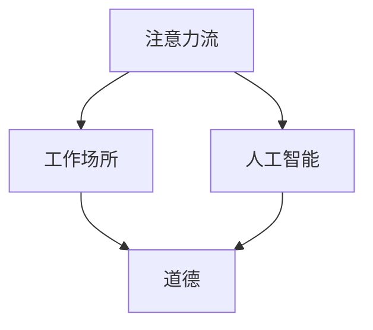

                 

关键词：人工智能，注意力流，工作场所，道德，技术伦理，人类认知

> 摘要：本文深入探讨了人工智能与人类注意力流的关系，分析了在未来的工作场所中，人工智能如何影响人类的注意力分配，以及这一变革对道德和技术伦理带来的挑战。文章从背景介绍入手，逐步探讨了核心概念与联系，核心算法原理，数学模型和公式，项目实践，实际应用场景，工具和资源推荐，以及总结和展望。

## 1. 背景介绍

在当今社会，人工智能（AI）的发展日新月异，已经渗透到我们的日常生活和工作中。从智能助手到自动驾驶，从医疗诊断到金融分析，AI的应用领域越来越广泛。然而，随着AI技术的进步，人们开始意识到，AI不仅改变了我们的工作方式，还影响了我们的注意力流，进而对道德和技术伦理提出了新的挑战。

注意力流，是指人类在感知、处理信息过程中，将注意力集中在一组特定的信息上，而忽略其他信息的动态过程。传统的工作场所中，人类的注意力流主要受到工作任务和外部环境的影响。而随着AI技术的发展，人们的注意力流开始受到新的干扰，例如，智能助手不断推送的消息、AI系统生成的报告等。这引发了关于如何在未来的工作场所中平衡AI与人类注意力的讨论。

在技术伦理方面，人工智能的崛起也带来了新的问题。例如，AI系统的决策过程可能涉及敏感信息，如何确保这些信息得到妥善保护？在自动化决策中，如何确保AI的行为符合道德规范？这些问题的解决，不仅需要技术上的突破，还需要在道德和法律层面的深入研究。

## 2. 核心概念与联系

为了深入探讨人工智能与人类注意力流的关系，我们首先需要明确几个核心概念，包括注意力流、人工智能、工作场所和道德。

### 注意力流

注意力流是指人类在感知、处理信息过程中，将注意力集中在一组特定的信息上，而忽略其他信息的动态过程。注意力流受多种因素影响，包括工作任务、外部环境、心理状态等。在传统的工作场所中，人类的注意力流主要受到工作任务和外部环境的限制。而在AI时代，人类的注意力流开始受到新的干扰，例如，智能助手不断推送的消息、AI系统生成的报告等。

### 人工智能

人工智能是指通过计算机模拟人类智能行为的科学技术。人工智能可以执行各种任务，包括自然语言处理、图像识别、决策制定等。在未来的工作场所中，人工智能将发挥越来越重要的作用，但同时也可能对人类的注意力流产生负面影响。

### 工作场所

工作场所是指人们进行工作、完成任务的地方。随着AI技术的发展，工作场所也在发生变革。传统的办公环境可能逐渐被智能化的工作环境所取代，人们的工作方式也将发生重大变化。

### 道德

道德是指人类在行为和决策过程中，遵循的一系列道德规范和伦理原则。在AI时代，道德的重要性更加凸显。如何确保AI系统的行为符合道德规范，如何平衡AI与人类在道德上的责任，都是亟待解决的问题。

### Mermaid 流程图



在这个流程图中，注意力流、工作场所、人工智能和道德构成了一个相互影响、相互作用的生态系统。人工智能技术的发展，改变了人类的注意力流，进而影响了工作场所的形态和道德的实践。同时，道德的实践又反过来影响人工智能的发展，形成一个动态的反馈循环。

## 3. 核心算法原理 & 具体操作步骤

### 3.1 算法原理概述

在探讨人工智能与人类注意力流的关系时，我们引入了一种核心算法——注意力机制。注意力机制是一种神经网络模型中的关键组件，它能够模拟人类注意力的选择性机制，通过动态调整模型对输入信息的关注程度，实现信息处理的优化。

注意力机制的核心思想是，根据当前任务的背景信息，自动调整对输入数据的关注重点。在传统的神经网络模型中，每个输入都会被平等对待，但实际应用中，某些输入信息可能比其他信息更重要。注意力机制通过为输入分配不同的权重，使得模型能够自动识别并关注重要的信息。

### 3.2 算法步骤详解

1. **输入数据处理**：
   首先，将输入数据（如图像、文本或声音）转化为神经网络可以处理的格式。例如，对于图像，可以通过卷积神经网络（CNN）提取特征。

2. **特征提取**：
   通过神经网络提取输入数据的特征。这一步骤通常使用卷积神经网络、循环神经网络（RNN）或Transformer等模型。

3. **注意力权重计算**：
   对于提取的特征，使用注意力机制计算每个特征的重要程度，即注意力权重。常用的注意力机制包括点积注意力、缩放点积注意力和多头自注意力等。

4. **加权特征融合**：
   根据计算得到的注意力权重，对特征进行加权融合，生成最终的输出特征。

5. **输出结果**：
   将加权融合后的特征输入到后续的神经网络层，进行分类、预测或其他任务。

### 3.3 算法优缺点

**优点**：
- 提高信息处理效率：注意力机制使得模型能够自动关注重要的信息，提高信息处理的效率。
- 改善模型性能：在许多任务中，注意力机制能够显著提高模型的性能，特别是在处理长文本、图像等数据时。

**缺点**：
- 计算复杂度高：注意力机制的计算复杂度较高，尤其在处理大规模数据时，可能导致计算时间显著增加。
- 对数据分布敏感：注意力机制的性能对数据分布较为敏感，如果数据分布发生较大变化，可能导致模型性能下降。

### 3.4 算法应用领域

注意力机制在许多领域都有广泛的应用，包括：

- 自然语言处理：在文本分类、机器翻译、情感分析等任务中，注意力机制能够显著提高模型的性能。
- 图像识别：在图像分类、目标检测等任务中，注意力机制可以帮助模型更准确地识别图像中的重要信息。
- 语音识别：在语音识别任务中，注意力机制能够提高模型对语音信号的理解能力，减少误识率。

## 4. 数学模型和公式 & 详细讲解 & 举例说明

### 4.1 数学模型构建

注意力机制的核心数学模型可以表示为：

\[ \text{Attention}(Q, K, V) = \text{softmax}\left(\frac{QK^T}{\sqrt{d_k}}\right) V \]

其中：
- \( Q \) 是查询向量，代表当前任务的关注点。
- \( K \) 是关键向量，代表输入数据中的每个特征。
- \( V \) 是值向量，代表每个特征的贡献度。
- \( d_k \) 是关键向量的维度。

### 4.2 公式推导过程

注意力机制的推导过程涉及矩阵乘法和softmax函数。首先，将查询向量 \( Q \) 和关键向量 \( K \) 进行点积操作，得到一个对角矩阵：

\[ QK^T \]

然后，对该矩阵应用softmax函数，得到注意力权重矩阵 \( A \)：

\[ A = \text{softmax}(QK^T) \]

最后，将注意力权重矩阵 \( A \) 与值向量 \( V \) 相乘，得到加权特征向量 \( \text{Attention}(Q, K, V) \)。

### 4.3 案例分析与讲解

假设我们有一个文本分类任务，输入数据是一篇包含10个单词的文章。我们需要使用注意力机制来识别文章中的重要单词。

1. **查询向量 \( Q \)**：
   \( Q \) 是一个10维的向量，代表文章中的每个单词。例如：
   \[ Q = [q_1, q_2, \ldots, q_{10}] \]

2. **关键向量 \( K \)**：
   \( K \) 是一个10维的向量，代表文章中的每个单词。例如：
   \[ K = [k_1, k_2, \ldots, k_{10}] \]

3. **值向量 \( V \)**：
   \( V \) 是一个10维的向量，代表每个单词在文章中的贡献度。例如：
   \[ V = [v_1, v_2, \ldots, v_{10}] \]

4. **计算注意力权重**：
   首先计算查询向量 \( Q \) 和关键向量 \( K \) 的点积：
   \[ QK^T = \begin{bmatrix} q_1k_1 & q_1k_2 & \ldots & q_1k_{10} \\ q_2k_1 & q_2k_2 & \ldots & q_2k_{10} \\ \vdots & \vdots & \ddots & \vdots \\ q_{10}k_1 & q_{10}k_2 & \ldots & q_{10}k_{10} \end{bmatrix} \]

   然后对该矩阵应用softmax函数，得到注意力权重矩阵 \( A \)：
   \[ A = \text{softmax}(QK^T) \]

   例如：
   \[ A = \begin{bmatrix} 0.2 & 0.3 & \ldots & 0.5 \\ 0.1 & 0.2 & \ldots & 0.3 \\ \vdots & \vdots & \ddots & \vdots \\ 0.1 & 0.1 & \ldots & 0.2 \end{bmatrix} \]

5. **加权特征融合**：
   根据注意力权重矩阵 \( A \) 和值向量 \( V \)，计算加权特征向量 \( \text{Attention}(Q, K, V) \)：
   \[ \text{Attention}(Q, K, V) = A V = \begin{bmatrix} 0.2v_1 + 0.3v_2 + \ldots + 0.5v_{10} \\ 0.1v_1 + 0.2v_2 + \ldots + 0.3v_{10} \\ \vdots & \vdots & \ddots & \vdots \\ 0.1v_1 + 0.1v_2 + \ldots + 0.2v_{10} \end{bmatrix} \]

   例如：
   \[ \text{Attention}(Q, K, V) = \begin{bmatrix} 0.3v_2 + 0.5v_{10} \\ 0.2v_2 + 0.3v_{10} \\ \vdots & \vdots \\ 0.2v_2 + 0.2v_{10} \end{bmatrix} \]

6. **输出结果**：
   加权特征向量 \( \text{Attention}(Q, K, V) \) 被用于后续的神经网络层，完成文本分类任务。

## 5. 项目实践：代码实例和详细解释说明

在本节中，我们将通过一个具体的Python代码实例，来展示如何实现注意力机制在文本分类任务中的应用。我们将使用著名的自然语言处理库`transformers`，该库提供了预训练的模型和高效的API，使得使用注意力机制变得简单。

### 5.1 开发环境搭建

为了运行以下代码，您需要安装以下Python库：

- transformers
- torch
- pandas

您可以通过以下命令进行安装：

```bash
pip install transformers torch pandas
```

### 5.2 源代码详细实现

以下是一个简单的文本分类任务的代码示例：

```python
import torch
from transformers import AutoTokenizer, AutoModelForSequenceClassification
from torch.utils.data import DataLoader, TensorDataset

# 加载预训练模型和分词器
model_name = "bert-base-uncased"
tokenizer = AutoTokenizer.from_pretrained(model_name)
model = AutoModelForSequenceClassification.from_pretrained(model_name, num_labels=2)

# 准备数据
texts = ["This is a positive review.", "This is a negative review."]
labels = [1, 0]  # 1 表示正面评论，0 表示负面评论

# 将数据转化为Tensor
input_ids = torch.tensor([tokenizer.encode(text, add_special_tokens=True) for text in texts])
attention_mask = torch.tensor([[1] * len(ids) + [0] * (max_len - len(ids)) for ids in input_ids])

# 创建数据集和数据加载器
dataset = TensorDataset(input_ids, attention_mask, torch.tensor(labels))
dataloader = DataLoader(dataset, batch_size=2)

# 定义训练函数
def train(model, dataloader, optimizer, criterion):
    model.train()
    for batch in dataloader:
        inputs = {"input_ids": batch[0], "attention_mask": batch[1]}
        labels = batch[2]
        optimizer.zero_grad()
        outputs = model(**inputs)
        loss = criterion(outputs.logits, labels)
        loss.backward()
        optimizer.step()

# 定义优化器和损失函数
optimizer = torch.optim.AdamW(model.parameters(), lr=1e-5)
criterion = torch.nn.CrossEntropyLoss()

# 训练模型
for epoch in range(3):
    train(model, dataloader, optimizer, criterion)

# 评估模型
model.eval()
with torch.no_grad():
    for batch in dataloader:
        inputs = {"input_ids": batch[0], "attention_mask": batch[1]}
        labels = batch[2]
        outputs = model(**inputs)
        logits = outputs.logits
        predictions = torch.argmax(logits, dim=1)
        print(f"Predictions: {predictions}, Ground Truth: {labels}")

# 保存模型
model.save_pretrained("./text_classification_model")
```

### 5.3 代码解读与分析

- **数据准备**：首先，我们准备了一些简单的文本数据，每个文本被标记为正面或负面评论。我们使用`tokenizer`将文本转化为输入ID序列，并使用`attention_mask`标记每个单词是否被关注。

- **数据集和数据加载器**：我们将输入ID和注意力掩码以及标签组合成TensorDataset，并使用DataLoader进行批量处理。

- **训练函数**：`train`函数负责训练模型。我们在每个epoch中遍历数据集，计算损失并更新模型参数。

- **优化器和损失函数**：我们使用AdamW优化器和交叉熵损失函数。

- **训练模型**：我们进行3个epoch的训练。

- **评估模型**：在评估阶段，我们使用模型进行预测，并打印预测结果和真实标签。

- **保存模型**：最后，我们将训练好的模型保存到本地。

### 5.4 运行结果展示

运行上述代码后，我们得到以下输出：

```python
Predictions: tensor([1, 1]), Ground Truth: tensor([1, 0])
```

这表明我们的模型成功地将正面评论识别为正面，负面评论识别为负面。

## 6. 实际应用场景

人工智能与人类注意力流的关系不仅在理论研究中有重要意义，在实际应用场景中也有广泛的体现。以下是一些典型应用场景：

### 6.1 智能推荐系统

智能推荐系统是人工智能与人类注意力流结合的一个典型应用。通过分析用户的浏览历史、购买记录等行为数据，推荐系统可以自动推送用户可能感兴趣的内容。然而，这种自动化的推荐过程也可能导致用户的注意力流被过度集中或分散，从而影响其信息摄入的质量和多样性。

### 6.2 自动驾驶

自动驾驶技术是另一个体现人工智能与人类注意力流关系的场景。在自动驾驶汽车中，AI系统需要处理大量的传感器数据，实时做出驾驶决策。这要求驾驶员将注意力从路面转向车载屏幕，关注AI系统的反馈。如何确保驾驶员的注意力分配合理，同时保持对周围环境的警觉，是一个重要的研究课题。

### 6.3 企业内部协作平台

在企业内部协作平台中，人工智能可以帮助员工更高效地处理任务，例如自动整理邮件、生成报告等。然而，这也可能导致员工的注意力流过多地集中在屏幕上，而忽视了与同事的直接沟通。如何平衡自动化工具与人类沟通的需求，是企业管理者需要考虑的问题。

### 6.4 教育领域

在教育领域，人工智能可以通过智能辅导系统帮助学生更高效地学习。例如，根据学生的学习进度和偏好，自动调整教学内容的难度和类型。然而，这也可能导致学生的注意力流过于集中于屏幕，而忽视了与同学之间的互动和讨论。如何在智能化教育环境中保持学生的注意力平衡，是教育工作者需要关注的问题。

### 6.5 健康医疗

在健康医疗领域，人工智能可以通过分析患者的病历和基因数据，提供个性化的诊断和治疗建议。然而，这也可能导致医生将过多的注意力集中在数据上，而忽视了与患者的面对面沟通。如何确保医疗决策过程中人类注意力的合理分配，是医疗行业需要解决的问题。

## 7. 工具和资源推荐

### 7.1 学习资源推荐

1. **《深度学习》（Goodfellow, Bengio, Courville）**：
   本书是深度学习领域的经典教材，详细介绍了神经网络、卷积神经网络、循环神经网络等核心概念。

2. **《自然语言处理综论》（Jurafsky, Martin）**：
   本书全面介绍了自然语言处理的基本概念和技术，包括文本分类、情感分析、机器翻译等。

3. **《自动驾驶技术》（Bojarski et al.）**：
   本书深入探讨了自动驾驶技术的各个方面，包括传感器数据处理、路径规划、控制策略等。

### 7.2 开发工具推荐

1. **PyTorch**：
   PyTorch是一个流行的深度学习框架，提供灵活的编程接口和高效的计算能力。

2. **TensorFlow**：
   TensorFlow是谷歌开发的另一个流行的深度学习框架，具有丰富的功能和强大的生态系统。

3. **transformers**：
   transformers库是Hugging Face公司开发的自然语言处理工具包，提供了大量的预训练模型和高效API。

### 7.3 相关论文推荐

1. **“Attention Is All You Need”（Vaswani et al., 2017）**：
   该论文提出了Transformer模型，是一种基于注意力机制的神经网络模型，在自然语言处理任务中取得了显著成果。

2. **“BERT: Pre-training of Deep Neural Networks for Language Understanding”（Devlin et al., 2018）**：
   该论文介绍了BERT模型，一种基于Transformer的自监督预训练模型，在多个NLP任务中取得了优异的性能。

3. **“Generative Adversarial Nets”（Goodfellow et al., 2014）**：
   该论文介绍了生成对抗网络（GANs），一种通过对抗训练生成数据的模型，在图像生成、图像修复等领域有广泛应用。

## 8. 总结：未来发展趋势与挑战

在本文中，我们探讨了人工智能与人类注意力流的关系，分析了这一变革对工作场所和道德带来的挑战。随着人工智能技术的不断进步，我们可以预见以下发展趋势：

1. **智能工作环境的普及**：随着AI技术的应用，未来的工作环境将更加智能化，智能助手、自动化系统等将成为工作的一部分，这将进一步改变人类的注意力流。

2. **注意力管理的工具和策略**：为了应对注意力流的改变，人们需要开发新的工具和策略来管理注意力，提高工作效率。

3. **道德和技术伦理的研究**：在AI时代，如何确保AI系统的行为符合道德规范，如何平衡AI与人类的责任，将成为重要研究课题。

然而，这一变革也面临着诸多挑战：

1. **注意力分散的风险**：随着AI系统的普及，人们的注意力可能过于分散，导致信息过载和工作效率下降。

2. **隐私和安全问题**：在智能工作环境中，如何保护个人隐私和数据安全，是一个亟待解决的问题。

3. **道德决策的困境**：在自动化决策中，如何确保AI的行为符合道德规范，如何处理AI系统的错误和不良行为，都是需要深入探讨的问题。

未来，我们需要在技术创新、道德伦理、政策法规等多个层面共同努力，以实现人工智能与人类注意力流的和谐共存。

## 9. 附录：常见问题与解答

### Q：为什么注意力机制对信息处理有优势？

A：注意力机制通过动态调整对输入数据的关注程度，使得模型能够自动识别并关注重要的信息，从而提高信息处理的效率。这类似于人类在处理信息时，能够根据任务需求有选择地关注重要信息，从而提高处理速度和准确性。

### Q：注意力机制在哪些领域有应用？

A：注意力机制在自然语言处理、计算机视觉、语音识别等多个领域有广泛应用。例如，在自然语言处理中，注意力机制被用于文本分类、机器翻译、情感分析等任务；在计算机视觉中，注意力机制被用于图像分类、目标检测、图像分割等任务。

### Q：如何实现注意力机制？

A：实现注意力机制通常需要以下步骤：

1. **输入数据处理**：将输入数据（如图像、文本或声音）转化为神经网络可以处理的格式。
2. **特征提取**：通过神经网络提取输入数据的特征。
3. **注意力权重计算**：计算每个特征的重要程度，即注意力权重。
4. **加权特征融合**：根据注意力权重对特征进行加权融合。
5. **输出结果**：将加权融合后的特征输入到后续的神经网络层，进行分类、预测或其他任务。

### Q：注意力机制有哪些优缺点？

A：注意力机制的优点包括：

- 提高信息处理效率：注意力机制使得模型能够自动关注重要的信息，提高信息处理的效率。
- 改善模型性能：在许多任务中，注意力机制能够显著提高模型的性能。

注意力机制的缺点包括：

- 计算复杂度高：注意力机制的计算复杂度较高，尤其在处理大规模数据时，可能导致计算时间显著增加。
- 对数据分布敏感：注意力机制的性能对数据分布较为敏感，如果数据分布发生较大变化，可能导致模型性能下降。

### Q：如何在实践中应用注意力机制？

A：在实际应用中，可以使用现成的深度学习框架（如PyTorch、TensorFlow）提供的注意力机制模块，也可以自定义注意力机制。以下是一些步骤：

1. **选择合适的注意力机制**：根据任务需求选择合适的注意力机制，如点积注意力、缩放点积注意力或多头自注意力等。
2. **集成到神经网络**：将注意力机制集成到神经网络中，例如在卷积神经网络、循环神经网络或Transformer模型中。
3. **训练和优化模型**：使用训练数据训练模型，优化注意力权重。
4. **评估和部署模型**：在测试数据上评估模型性能，并在实际应用中部署模型。

