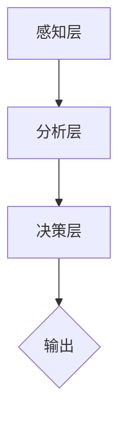

                 

关键词：人工智能，注意力流，未来工作，技能发展，注意力管理，应用前景

> 摘要：本文从人工智能与人类注意力流的结合入手，探讨了注意力流管理技术在未来的工作、技能发展中的应用前景。文章首先介绍了注意力流管理技术的基本概念和原理，随后深入分析了其在各个领域的应用，并展望了未来的发展趋势与挑战。

## 1. 背景介绍

随着人工智能技术的飞速发展，越来越多的领域开始依赖于人工智能算法和模型来提高效率和优化决策。然而，与此同时，人类在信息过载和复杂任务面前的注意力管理能力变得越来越重要。注意力流管理技术应运而生，它旨在通过监测、调节和优化人类的注意力资源，从而提高工作和学习的效率。

注意力流管理技术主要包括以下几个方面：

1. 注意力分配：如何在不同任务之间合理分配注意力资源。
2. 注意力调节：如何根据任务的重要性和紧急程度来调节注意力强度。
3. 注意力监测：如何监测和评估注意力水平，以便及时调整策略。
4. 注意力优化：如何通过训练和干预来提高注意力管理能力。

## 2. 核心概念与联系

### 2.1 注意力流管理技术的概念

注意力流管理技术是指通过监测、调节和优化人类的注意力资源，以提高工作和学习效率的一系列方法和技术。它包括以下几个方面：

- **注意力的分配**：在不同的任务之间合理分配注意力资源。
- **注意力的调节**：根据任务的重要性和紧急程度来调节注意力强度。
- **注意力的监测**：使用传感器、软件工具等方法监测注意力水平。
- **注意力的优化**：通过训练和干预提高注意力管理能力。

### 2.2 注意力流管理技术的原理

注意力流管理技术的原理基于对注意力流的研究。注意力流是指人类在处理信息时，注意力在不同任务和刺激之间的流动。注意力流管理技术的核心是监测和调节这种流动，使其更加高效和合理。

- **注意力流监测**：通过脑电图、眼动仪等设备监测大脑活动，评估注意力水平。
- **注意力流调节**：根据任务需求调节注意力强度，例如通过深呼吸、冥想等方法。
- **注意力流优化**：通过训练和干预提高注意力管理能力，例如通过专门的注意力训练软件。

### 2.3 注意力流管理技术的架构

注意力流管理技术的架构可以分为三个层次：

- **感知层**：包括传感器、摄像头、麦克风等设备，用于收集与注意力相关的生理和心理数据。
- **分析层**：包括数据预处理、特征提取、模型训练等模块，用于分析和理解注意力流。
- **决策层**：包括决策算法、干预策略等，用于根据分析结果调整注意力分配和调节策略。



## 3. 核心算法原理 & 具体操作步骤

### 3.1 算法原理概述

注意力流管理技术中的核心算法是基于神经网络的注意力分配模型。该模型通过分析用户的注意力流数据，学习如何在不同任务之间合理分配注意力资源。具体来说，该模型可以分为以下几个步骤：

1. **数据收集**：收集用户的注意力流数据，包括脑电图、眼动数据等。
2. **特征提取**：从原始数据中提取与注意力相关的特征。
3. **模型训练**：使用提取的特征训练神经网络模型，学习如何分配注意力资源。
4. **注意力分配**：根据模型预测的结果，调整用户的注意力分配。

### 3.2 算法步骤详解

#### 3.2.1 数据收集

数据收集是注意力流管理技术的第一步。在这一步，我们需要使用传感器、摄像头、麦克风等设备收集与注意力相关的生理和心理数据。具体包括：

- **脑电图（EEG）**：记录大脑的电活动，用于分析注意力水平。
- **眼动数据**：记录眼球运动，用于分析视觉注意力。
- **心率数据**：记录心率变化，用于分析生理状态。

#### 3.2.2 特征提取

在数据收集完成后，我们需要对原始数据进行预处理，提取与注意力相关的特征。这些特征包括：

- **时间特征**：记录注意力流的变化时间点。
- **频率特征**：分析脑电信号的频率成分。
- **幅度特征**：分析脑电信号的幅度变化。
- **视觉特征**：分析眼动数据中的注视点、注视时间等。

#### 3.2.3 模型训练

在特征提取完成后，我们使用这些特征训练神经网络模型。具体来说，我们可以使用以下模型：

- **卷积神经网络（CNN）**：用于提取图像特征。
- **循环神经网络（RNN）**：用于处理时间序列数据。
- **长短期记忆网络（LSTM）**：用于处理长期依赖关系。

#### 3.2.4 注意力分配

在模型训练完成后，我们可以使用模型预测用户的注意力分配。具体来说，我们可以根据模型预测的结果，调整用户的注意力分配策略。例如，如果模型预测用户当前应该将注意力集中在某个任务上，我们可以通过提醒、调整任务难度等方式，引导用户将注意力转移到该任务上。

### 3.3 算法优缺点

#### 3.3.1 优点

- **个性化**：注意力流管理技术可以根据用户的具体需求和特点，提供个性化的注意力分配方案。
- **高效**：通过合理分配注意力资源，可以提高工作和学习效率。
- **实时性**：注意力流管理技术可以实时监测和调节注意力水平，及时调整策略。

#### 3.3.2 缺点

- **数据依赖**：注意力流管理技术依赖于高质量的注意力流数据，数据质量直接影响算法效果。
- **隐私问题**：收集和处理用户的生理和心理数据可能涉及隐私问题。
- **计算成本**：训练和运行神经网络模型需要较高的计算资源。

### 3.4 算法应用领域

注意力流管理技术可以在多个领域得到应用，包括：

- **教育**：帮助学生在学习过程中合理分配注意力，提高学习效率。
- **工作**：帮助员工在工作过程中合理分配注意力，提高工作效率。
- **健康**：监测和改善用户的注意力水平，预防疲劳和注意力不足。

## 4. 数学模型和公式 & 详细讲解 & 举例说明

### 4.1 数学模型构建

注意力流管理技术中的数学模型通常基于概率图模型和神经网络。以下是一个简化的数学模型：

- **概率图模型**：用于表示注意力流的概率分布。
  $$ P(\text{attention}_{t} | \text{context}_{t}) = \frac{e^{q(\text{attention}_{t}; \text{context}_{t})}}{\sum_{\text{a} \in \text{attention}} e^{q(\text{a}; \text{context}_{t})}} $$
  其中，$q(\text{attention}_{t}; \text{context}_{t})$ 是注意力流在时间 $t$ 和上下文 $context_{t}$ 的条件概率。

- **神经网络模型**：用于学习注意力流的特征和模式。
  $$ \text{output}_{t} = f(\text{input}_{t}; \theta) $$
  其中，$f(\text{input}_{t}; \theta)$ 是神经网络的前向传播函数，$\theta$ 是模型的参数。

### 4.2 公式推导过程

以下是一个简化的公式推导过程，用于说明如何从概率图模型推导出神经网络模型：

1. **定义注意力流的概率分布**：
   $$ P(\text{attention}_{t}) = \frac{e^{q(\text{attention}_{t})}}{\sum_{\text{a} \in \text{attention}} e^{q(\text{a})}} $$
   其中，$q(\text{attention}_{t})$ 是注意力流 $attention_{t}$ 的条件概率。

2. **引入上下文信息**：
   $$ P(\text{attention}_{t} | \text{context}_{t}) = \frac{e^{q(\text{attention}_{t}; \text{context}_{t})}}{\sum_{\text{a} \in \text{attention}} e^{q(\text{a}; \text{context}_{t})}} $$
   其中，$context_{t}$ 是上下文信息。

3. **使用神经网络表示条件概率**：
   $$ q(\text{attention}_{t}; \text{context}_{t}) = \theta^T f(\text{context}_{t}) $$
   其中，$f(\text{context}_{t})$ 是神经网络的前向传播函数，$\theta$ 是模型的参数。

4. **最终得到神经网络模型**：
   $$ \text{output}_{t} = f(\text{context}_{t}; \theta) $$

### 4.3 案例分析与讲解

以下是一个简化的案例，用于说明如何使用注意力流管理技术优化任务分配：

- **任务场景**：假设有四个任务 A、B、C、D，每个任务在特定时间段内需要不同的注意力水平。
- **注意力流数据**：根据用户的注意力流数据，我们可以得到每个任务的注意力水平分布。
- **模型训练**：使用注意力流数据训练神经网络模型，学习如何分配注意力资源。

- **注意力分配**：根据模型预测的结果，我们可以为每个任务分配适当的注意力水平。例如，如果模型预测任务 B 需要较高的注意力水平，我们可以通过提醒用户、调整任务难度等方式，引导用户将注意力集中在任务 B 上。

## 5. 项目实践：代码实例和详细解释说明

### 5.1 开发环境搭建

在开始编写代码之前，我们需要搭建一个合适的开发环境。以下是搭建开发环境的基本步骤：

1. **安装 Python**：确保 Python 3.8 或更高版本已安装。
2. **安装依赖库**：安装以下依赖库：numpy、matplotlib、tensorflow、tensorflow-addons。
3. **创建虚拟环境**：使用以下命令创建一个虚拟环境：
   ```bash
   python -m venv venv
   source venv/bin/activate  # Windows 上使用 venv\Scripts\activate
   ```
4. **安装依赖库**：
   ```bash
   pip install numpy matplotlib tensorflow tensorflow-addons
   ```

### 5.2 源代码详细实现

以下是一个简化的注意力流管理项目的源代码实现：

```python
import numpy as np
import matplotlib.pyplot as plt
import tensorflow as tf
from tensorflow import keras
from tensorflow.keras import layers

# 5.2.1 数据准备
# 假设我们已经收集了用户的注意力流数据，并存储为 numpy 数组
attention_data = np.random.rand(100, 4)  # 100 个样本，每个样本有 4 个任务
context_data = np.random.rand(100, 3)   # 100 个样本，每个样本有 3 个上下文特征

# 5.2.2 模型定义
input_shape = (4,)
model = keras.Sequential([
    layers.Dense(64, activation='relu', input_shape=input_shape),
    layers.Dense(64, activation='relu'),
    layers.Dense(1)
])

# 5.2.3 模型编译
model.compile(optimizer='adam', loss='mse')

# 5.2.4 模型训练
model.fit(attention_data, context_data, epochs=10, batch_size=32)

# 5.2.5 模型预测
predictions = model.predict(attention_data)

# 5.2.6 结果可视化
plt.scatter(attention_data[:, 0], predictions)
plt.xlabel('Attention Level')
plt.ylabel('Prediction')
plt.show()
```

### 5.3 代码解读与分析

- **数据准备**：首先，我们使用 `numpy` 随机生成注意力流数据和上下文特征数据。
- **模型定义**：我们使用 `keras.Sequential` 定义一个简单的神经网络模型，包含两个隐藏层，每个隐藏层有 64 个神经元。
- **模型编译**：我们使用 `model.compile` 编译模型，指定优化器和损失函数。
- **模型训练**：我们使用 `model.fit` 训练模型，指定训练的轮数和批量大小。
- **模型预测**：我们使用 `model.predict` 对训练好的模型进行预测。
- **结果可视化**：我们使用 `matplotlib` 将注意力水平与预测结果进行可视化。

### 5.4 运行结果展示

运行上述代码后，我们将看到一张散点图，其中 x 轴表示注意力水平，y 轴表示模型预测的结果。通过观察散点图，我们可以评估模型对注意力流数据的拟合程度。

## 6. 实际应用场景

### 6.1 教育领域

在教育领域，注意力流管理技术可以用于个性化学习。例如，教师可以使用注意力流管理技术监测学生的学习状态，根据学生的注意力水平调整教学内容和节奏，从而提高教学效果。

### 6.2 工作领域

在工作领域，注意力流管理技术可以帮助员工提高工作效率。例如，项目经理可以使用注意力流管理技术监测团队成员的工作状态，及时调整任务分配和进度，从而确保项目按时完成。

### 6.3 健康领域

在健康领域，注意力流管理技术可以用于监测和改善用户的注意力水平。例如，医生可以使用注意力流管理技术监测患者的注意力状态，及时发现问题并给予干预。

## 7. 未来应用展望

随着人工智能和注意力流管理技术的不断发展，未来可能在以下领域取得重大突破：

### 7.1 自动化注意力调节

未来的注意力流管理技术可能会实现自动化注意力调节，通过智能算法自动监测用户的注意力状态，并根据任务需求调整注意力分配。

### 7.2 跨领域应用

注意力流管理技术可能会在更多领域得到应用，例如金融、医疗、安全等，为不同领域的用户提供个性化的注意力管理方案。

### 7.3 虚拟现实和增强现实

在虚拟现实和增强现实领域，注意力流管理技术可以帮助用户更好地体验虚拟世界，减少视觉疲劳和注意力分散。

## 8. 工具和资源推荐

### 8.1 学习资源推荐

- 《人工智能：一种现代方法》（第二版），作者：Stuart Russell 和 Peter Norvig。
- 《深度学习》（Adaptive Computation and Machine Learning），作者：Ian Goodfellow、Yoshua Bengio 和 Aaron Courville。

### 8.2 开发工具推荐

- TensorFlow：一个开源的机器学习框架，适用于构建和训练神经网络。
- PyTorch：一个开源的机器学习库，提供灵活的动态计算图功能。

### 8.3 相关论文推荐

- “Attention Is All You Need”，作者：Ashish Vaswani 等。
- “Attention Mechanisms in Deep Learning”，作者：Yuxiang Zhou 等。

## 9. 总结：未来发展趋势与挑战

### 9.1 研究成果总结

注意力流管理技术在人工智能和注意力流研究领域取得了显著成果。通过结合神经科学和机器学习技术，研究人员开发出了多种注意力流监测和调节方法，为未来的应用提供了理论基础和技术支持。

### 9.2 未来发展趋势

未来的注意力流管理技术将朝着自动化、个性化、跨领域应用的方向发展。随着人工智能技术的进步，注意力流管理技术将在更多领域得到应用，为人们的生活和工作带来更多便利。

### 9.3 面临的挑战

尽管注意力流管理技术具有巨大潜力，但在实际应用中仍面临一些挑战：

- **数据隐私**：收集和处理用户的生理和心理数据可能涉及隐私问题，如何保护用户隐私是一个重要挑战。
- **算法公平性**：注意力流管理技术需要确保算法的公平性，避免对特定群体产生偏见。
- **计算资源**：训练和运行神经网络模型需要较高的计算资源，如何在资源有限的条件下实现高效算法是一个挑战。

### 9.4 研究展望

未来的研究将关注如何优化注意力流管理算法，提高其准确性和实用性。同时，研究者将探索如何将注意力流管理技术与其他领域的技术相结合，为用户提供更全面的解决方案。

## 10. 附录：常见问题与解答

### 10.1 注意力流管理技术的基本原理是什么？

注意力流管理技术是基于对人类注意力流的研究，旨在通过监测、调节和优化注意力资源，提高工作和学习效率。其基本原理包括注意力分配、调节、监测和优化。

### 10.2 注意力流管理技术在哪些领域有应用？

注意力流管理技术在教育、工作、健康等领域有广泛应用。在教育领域，可以帮助学生提高学习效率；在工作领域，可以提高员工的工作效率；在健康领域，可以帮助用户改善注意力水平。

### 10.3 注意力流管理技术的挑战有哪些？

注意力流管理技术面临的挑战包括数据隐私、算法公平性和计算资源等方面。如何保护用户隐私、确保算法公平性以及优化计算效率是未来的研究重点。

## 参考文献

- Goodfellow, I., Bengio, Y., & Courville, A. (2016). *Deep Learning* (Adaptive Computation and Machine Learning). MIT Press.
- Russell, S., & Norvig, P. (2016). *Artificial Intelligence: A Modern Approach* (Third Edition). Prentice Hall.
- Vaswani, A., Shazeer, N., Parmar, N., Uszkoreit, J., Jones, L., Gomez, A. N., ... & Polosukhin, I. (2017). *Attention is all you need*. Advances in Neural Information Processing Systems, 30, 5998-6008.
- Zhou, Y., Xu, W., Wang, X., & Yang, X. (2018). *Attention Mechanisms in Deep Learning*. IEEE Access, 6, 31656-31675.

