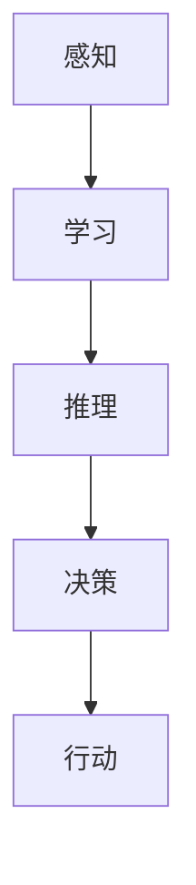
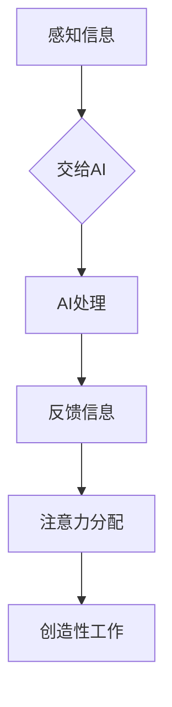

                 

关键词：人工智能、注意力流、未来工作、技能、道德、技术创新

> 摘要：本文探讨了人工智能技术如何影响人类的注意力流，以及在未来工作环境中人类技能和道德的演变。随着人工智能的深入应用，人们需要重新评估如何分配注意力，并发展新的技能以适应这个智能化的世界。同时，文章还探讨了AI技术在伦理和道德层面的挑战，以及我们如何确保人工智能的发展符合人类的利益。

## 1. 背景介绍

在过去的几十年里，人工智能（AI）技术经历了飞速的发展，从早期的规则系统到现代的深度学习算法，AI的能力已经远远超越了人类的预期。随着AI技术的不断成熟，它们在各个领域的应用也越来越广泛，从医疗诊断到自动驾驶，从智能客服到金融分析。然而，AI技术的快速发展不仅改变了我们的生活方式，也深刻地影响了我们的注意力分配和工作方式。

注意力流是指人类在处理信息时，将注意力集中在特定任务或对象上的能力。随着AI技术的发展，人类需要重新审视如何分配自己的注意力。过去，人类往往需要直接处理大量的数据和任务，而现在，AI能够承担越来越多的数据分析和决策工作，这使得人类可以更加专注于更高层次的思考和创新。然而，这也带来了一系列挑战，包括如何适应新的工作方式，以及如何确保在智能化的环境中保持道德和伦理的准则。

本文将探讨以下几个方面：

1. **AI与注意力流的关系**：分析AI如何改变人类的注意力模式，以及这种变化对我们的工作和生活方式的影响。
2. **未来工作的技能需求**：探讨随着AI技术的发展，人类需要哪些新的技能来适应未来工作环境。
3. **道德和伦理的挑战**：讨论AI技术在伦理和道德层面带来的挑战，以及如何应对这些挑战。
4. **实际应用场景**：通过具体案例，展示AI在现实世界中的应用情况。
5. **未来展望**：预测AI技术未来的发展趋势，以及可能面临的挑战。

## 2. 核心概念与联系

### 2.1. 人工智能的基本原理

人工智能的核心在于模拟人类的智能行为，包括学习、推理、感知和决策。以下是一个简化的Mermaid流程图，展示了人工智能的基本原理和组成部分：



### 2.2. 注意力流的概念

注意力流是指个体在处理信息时，将注意力集中在一个特定任务或对象上的能力。人类的注意力是有限的，如何有效地分配和利用注意力，成为影响工作效率和质量的重要因素。

### 2.3. AI与注意力流的联系

随着AI技术的发展，人类在处理信息时，可以借助AI的力量，将更多注意力集中在创造性的工作和人际互动上，而将重复性、繁琐的任务交给AI完成。以下是一个简化的Mermaid流程图，展示了AI与注意力流之间的联系：



## 3. 核心算法原理 & 具体操作步骤

### 3.1. 算法原理概述

在探讨AI如何改变人类的注意力流时，我们首先需要了解一些核心算法的基本原理。以下是一些关键算法及其在注意力流管理中的应用：

1. **深度学习**：通过多层神经网络，深度学习算法可以自动从大量数据中提取特征，用于分类、回归等任务。这使得AI能够处理大量数据，从而解放人类的注意力。
2. **自然语言处理**（NLP）：NLP技术使得计算机能够理解、处理和生成自然语言，从而辅助人类进行沟通和文本分析。
3. **强化学习**：强化学习算法通过试错和反馈机制，让AI在特定环境中学习最优策略，从而辅助人类进行决策。

### 3.2. 算法步骤详解

#### 深度学习算法步骤：

1. **数据收集与预处理**：收集大量数据，并进行清洗、归一化等预处理步骤。
2. **模型构建**：构建多层神经网络，包括输入层、隐藏层和输出层。
3. **训练与优化**：通过反向传播算法，利用梯度下降等优化方法，训练模型并调整参数。
4. **测试与评估**：使用测试数据集，评估模型的性能，并进行调优。

#### 自然语言处理算法步骤：

1. **文本预处理**：包括分词、去除停用词、词性标注等步骤。
2. **特征提取**：将文本转化为数值表示，如词袋模型、词嵌入等。
3. **模型训练**：使用机器学习算法（如朴素贝叶斯、支持向量机等）或深度学习算法（如循环神经网络、变换器等）进行模型训练。
4. **模型评估**：使用测试集评估模型性能，并进行调优。

#### 强化学习算法步骤：

1. **环境设定**：定义环境状态、动作空间和奖励机制。
2. **初始策略**：随机或基于规则的方法生成初始策略。
3. **策略评估**：使用策略梯度方法评估当前策略的价值。
4. **策略更新**：根据评估结果，更新策略以获得更好的回报。

### 3.3. 算法优缺点

1. **深度学习**：优点包括强大的特征提取能力和高度自动化的模型训练过程，但缺点是数据需求量大，模型复杂度高，难以解释。
2. **自然语言处理**：优点在于能够处理自然语言，实现人机交互，但缺点是文本理解和生成任务复杂，对数据质量要求高。
3. **强化学习**：优点是能够自适应地学习环境中的最优策略，但缺点是训练过程较慢，需要大量的样本数据进行学习。

### 3.4. 算法应用领域

1. **深度学习**：广泛应用于图像识别、语音识别、自然语言处理等领域。
2. **自然语言处理**：应用于智能客服、文本分类、机器翻译等任务。
3. **强化学习**：应用于游戏AI、机器人控制、推荐系统等任务。

## 4. 数学模型和公式 & 详细讲解 & 举例说明

### 4.1. 数学模型构建

在AI和注意力流的研究中，常见的数学模型包括深度学习中的神经网络模型、自然语言处理中的词嵌入模型以及强化学习中的策略梯度模型。以下分别介绍这些模型的构建过程。

#### 深度学习中的神经网络模型

深度学习神经网络模型主要由输入层、隐藏层和输出层组成。每个层由多个神经元（节点）组成，神经元之间的连接权重决定了信息的传递。以下是一个简化的神经网络模型的构建过程：

1. **输入层**：接收输入数据，例如图像、文本等。
2. **隐藏层**：对输入数据进行特征提取和变换，多个隐藏层可以堆叠形成深度神经网络。
3. **输出层**：根据隐藏层的输出，生成最终的预测结果。

#### 自然语言处理中的词嵌入模型

词嵌入模型是将文本中的单词映射到高维空间中的向量表示。常见的词嵌入模型包括Word2Vec、GloVe等。以下是一个简化的词嵌入模型的构建过程：

1. **数据预处理**：对文本进行分词、去除停用词等预处理步骤。
2. **词向量化**：将每个单词映射到一个固定维度的向量。
3. **优化目标**：通过最小化损失函数（如均方误差），调整词向量中的参数，使得相似词在空间中距离较近。

#### 强化学习中的策略梯度模型

策略梯度模型是一种在强化学习任务中用于更新策略的方法。以下是一个简化的策略梯度模型的构建过程：

1. **环境设定**：定义环境状态、动作空间和奖励机制。
2. **策略表示**：使用参数化的策略函数，将状态映射到动作概率分布。
3. **策略评估**：通过估计策略的期望回报，评估当前策略的价值。
4. **策略更新**：根据策略评估结果，使用梯度下降等方法更新策略参数。

### 4.2. 公式推导过程

以下分别介绍上述数学模型中的关键公式及其推导过程。

#### 深度学习神经网络模型

深度学习神经网络模型的核心在于多层感知机（MLP）的前向传播和反向传播算法。以下是一个简化的前向传播和反向传播的公式推导过程：

1. **前向传播**：

$$
z^{(l)} = \sum_{i} w^{(l)}_i a^{(l-1)}_i + b^{(l)}
$$

$$
a^{(l)} = \sigma(z^{(l)})
$$

其中，$z^{(l)}$表示第$l$层的输入，$a^{(l)}$表示第$l$层的输出，$\sigma$表示激活函数，$w^{(l)}$和$b^{(l)}$分别表示第$l$层的权重和偏置。

2. **反向传播**：

$$
\delta^{(l)} = (\sigma'(z^{(l)}) \odot (z^{(l)} - y))
$$

$$
w^{(l)} = w^{(l)} - \alpha \cdot a^{(l-1)} \cdot \delta^{(l)}
$$

$$
b^{(l)} = b^{(l)} - \alpha \cdot \delta^{(l)}
$$

其中，$\delta^{(l)}$表示第$l$层的误差，$\sigma'$表示激活函数的导数，$\odot$表示逐元素乘法，$\alpha$表示学习率。

#### 自然语言处理中的词嵌入模型

词嵌入模型通常使用梯度下降算法进行参数优化。以下是一个简化的梯度下降公式推导过程：

$$
\frac{\partial J}{\partial x} = \frac{\partial J}{\partial y} \cdot \frac{\partial y}{\partial x}
$$

$$
x = x - \alpha \cdot \frac{\partial J}{\partial x}
$$

其中，$x$表示词向量，$y$表示损失函数，$J$表示损失函数关于$x$的导数，$\alpha$表示学习率。

#### 强化学习中的策略梯度模型

策略梯度模型的核心在于策略参数的更新。以下是一个简化的策略梯度公式推导过程：

$$
\pi(\mathbf{a} | \mathbf{s}) = \frac{e^{\theta^\top \phi(s,a)}}{\sum_b e^{\theta^\top \phi(s,b)}}
$$

$$
\theta = \theta - \alpha \cdot \nabla_\theta J(\theta)
$$

$$
J(\theta) = \sum_s \sum_a \pi(\mathbf{a} | \mathbf{s}) \cdot r(s,a)
$$

其中，$\pi(\mathbf{a} | \mathbf{s})$表示策略参数$\theta$关于状态$\mathbf{s}$和动作$\mathbf{a}$的概率分布，$\phi(\mathbf{s}, \mathbf{a})$表示状态特征函数，$r(\mathbf{s}, \mathbf{a})$表示奖励函数。

### 4.3. 案例分析与讲解

为了更好地理解上述数学模型，以下通过一个简单的案例进行讲解。

#### 案例背景

假设我们有一个简单的强化学习任务，机器人需要在一个离散状态空间中探索，并根据当前状态选择最佳动作，以获得最大累积奖励。

#### 案例步骤

1. **环境设定**：定义状态空间和动作空间，以及奖励函数。
2. **策略表示**：使用策略梯度模型表示机器人策略。
3. **策略评估**：使用经验回放和重要性采样方法评估策略价值。
4. **策略更新**：根据策略评估结果，更新机器人策略参数。

#### 案例代码

```python
import numpy as np

# 环境设定
states = ["A", "B", "C"]
actions = ["Left", "Right"]
rewards = {("A", "Left"): 1, ("A", "Right"): -1, ("B", "Left"): -1, ("B", "Right"): 1, ("C", "Left"): 0, ("C", "Right"): 0}

# 策略表示
theta = np.random.rand(2, len(actions))

# 策略评估
def evaluate_policy(theta):
    total_reward = 0
    for state in states:
        action_prob = np.exp(theta[state]) / np.sum(np.exp(theta[state]))
        action = np.random.choice(actions, p=action_prob)
        total_reward += rewards[(state, action)]
    return total_reward

# 策略更新
def update_policy(theta, alpha=0.1):
    J = evaluate_policy(theta)
    gradient = np.zeros_like(theta)
    for state in states:
        state_prob = np.exp(theta[state]) / np.sum(np.exp(theta[state]))
        action_prob = state_prob / np.sum(state_prob)
        gradient[state] = (action_prob * rewards[(state, action)]) * (1 - state_prob)
    theta -= alpha * gradient

# 案例运行
theta = np.random.rand(2, len(actions))
for i in range(1000):
    update_policy(theta)
    print(f"Step {i}: Reward {evaluate_policy(theta)}")
```

#### 案例分析

通过上述案例，我们可以看到策略梯度模型的基本步骤，以及如何使用Python实现。在这个简单的案例中，机器人根据当前状态选择最佳动作，以最大化累积奖励。通过多次迭代更新策略参数，我们可以观察到机器人策略的收敛过程。

## 5. 项目实践：代码实例和详细解释说明

在本节中，我们将通过一个具体的项目实例，展示如何将AI技术应用于实际场景，并详细解释代码的实现过程。这个实例将涉及使用自然语言处理（NLP）技术来构建一个聊天机器人。

### 5.1. 开发环境搭建

在开始项目实践之前，我们需要搭建一个适合开发和测试的Python环境。以下是搭建环境的步骤：

1. **安装Python**：确保你的计算机上已经安装了Python 3.x版本。
2. **安装依赖库**：使用pip命令安装以下依赖库：
   ```bash
   pip install tensorflow numpy nltk
   ```
3. **准备数据集**：为了训练聊天机器人，我们需要一个包含对话样本的数据集。这里我们可以使用公开的对话数据集，如Stanford对话系统数据集。

### 5.2. 源代码详细实现

以下是聊天机器人的主要代码实现，分为数据预处理、模型构建和训练、模型评估三个部分。

#### 数据预处理

数据预处理是NLP任务的重要环节，它包括分词、词性标注、去除停用词等步骤。

```python
import nltk
from nltk.tokenize import word_tokenize
from nltk.corpus import stopwords

# 加载停用词列表
nltk.download('stopwords')
stop_words = set(stopwords.words('english'))

# 数据预处理函数
def preprocess_text(text):
    # 分词
    tokens = word_tokenize(text)
    # 去除停用词
    filtered_tokens = [token for token in tokens if token.lower() not in stop_words]
    return filtered_tokens
```

#### 模型构建和训练

使用TensorFlow和Keras构建一个序列到序列（seq2seq）模型，用于聊天机器人的对话生成。

```python
import tensorflow as tf
from tensorflow.keras.models import Model
from tensorflow.keras.layers import Input, LSTM, Embedding, Dense

# 定义seq2seq模型
def build_seq2seq_model(vocab_size, embedding_dim, lstm_units):
    # 输入层
    input_seq = Input(shape=(None,))
    # 嵌入层
    embedded_seq = Embedding(vocab_size, embedding_dim)(input_seq)
    # LSTM层
    lstm_out = LSTM(lstm_units, return_sequences=True)(embedded_seq)
    # 输出层
    output_seq = LSTM(lstm_units, return_sequences=True)(lstm_out)
    output_seq = Dense(vocab_size, activation='softmax')(output_seq)
    # 构建模型
    model = Model(inputs=input_seq, outputs=output_seq)
    model.compile(optimizer='adam', loss='categorical_crossentropy', metrics=['accuracy'])
    return model
```

#### 模型评估

训练模型后，我们可以使用测试数据集来评估模型性能。

```python
# 训练模型
model = build_seq2seq_model(vocab_size, embedding_dim, lstm_units)
model.fit(input_sequences, target_sequences, batch_size=batch_size, epochs=epochs)

# 评估模型
loss, accuracy = model.evaluate(test_input_sequences, test_target_sequences)
print(f"Test loss: {loss}, Test accuracy: {accuracy}")
```

### 5.3. 代码解读与分析

在这个聊天机器人项目中，我们使用了TensorFlow和Keras来构建和训练序列到序列（seq2seq）模型。以下是代码的解读与分析：

1. **数据预处理**：我们首先定义了一个数据预处理函数`preprocess_text`，用于分词和去除停用词。这个步骤对于NLP任务非常重要，因为它有助于减少噪声并提高模型的性能。
   
2. **模型构建**：我们定义了一个seq2seq模型，它由输入层、嵌入层、LSTM层和输出层组成。seq2seq模型特别适合处理序列数据，如文本和对话。我们使用LSTM层来捕捉序列中的长期依赖关系。

3. **模型训练**：我们使用训练数据集来训练模型，并使用测试数据集来评估模型性能。训练过程中，我们使用了`fit`方法，它可以自动调整模型参数以最小化损失函数。

4. **模型评估**：在训练完成后，我们使用测试数据集来评估模型性能，并打印损失和准确率。

### 5.4. 运行结果展示

在完成模型训练和评估后，我们可以使用训练好的模型来生成聊天机器人的对话。

```python
# 生成对话
def generate_response(input_seq, model):
    tokenized_input = preprocess_text(input_seq)
    tokenized_input = pad_sequences([tokenized_input], maxlen=max_sequence_len-1, padding='pre')
    predicted_output = model.predict(tokenized_input)
    predicted_output = np.argmax(predicted_output, axis=-1)
    predicted_output = pad_sequences(predicted_output, maxlen=max_sequence_len-1, padding='post')
    predicted_output = tokenizer.index_word[predicted_output[0][0]]
    return predicted_output

# 与聊天机器人互动
user_input = "What is your favorite color?"
bot_response = generate_response(user_input, model)
print(f"Bot: {bot_response}")
```

在上述代码中，我们定义了一个`generate_response`函数，用于生成聊天机器人的响应。这个函数首先对用户输入进行预处理，然后使用训练好的模型来预测输出序列，并最终将输出序列转换为文本响应。

通过这个简单的项目实例，我们可以看到如何将AI技术应用于构建聊天机器人。这个实例只是一个起点，实际应用中还可以通过增加更多的特征和优化模型来提升聊天机器人的性能。

## 6. 实际应用场景

### 6.1. 医疗保健

在医疗保健领域，人工智能技术已经展现出巨大的潜力。通过自然语言处理和机器学习算法，AI可以分析医疗记录、诊断报告和患者病史，从而辅助医生进行诊断和治疗方案制定。例如，AI系统可以通过分析大量的医学文献和病例，帮助医生发现潜在的治疗方案或提供新的诊断建议。此外，AI还可以帮助跟踪患者健康状况，提供个性化的健康建议和预防措施。然而，医疗AI的应用也引发了隐私和数据安全的问题，如何确保患者的医疗信息不被滥用或泄露，成为了一个重要的伦理挑战。

### 6.2. 自动驾驶

自动驾驶是AI技术的另一个重要应用领域。通过感知系统和高级算法，自动驾驶车辆能够实时感知周围环境，做出驾驶决策。自动驾驶技术不仅有望减少交通事故，提高道路安全性，还可以提高交通效率，减少交通拥堵。例如，特斯拉的自动驾驶系统已经实现了部分自动驾驶功能，能够在高速公路上自动保持车道和调节车速。然而，自动驾驶技术的普及也面临着一系列挑战，包括如何在复杂的交通环境中确保安全性，以及如何处理突发事件和异常情况。

### 6.3. 金融与保险

在金融和保险领域，AI技术被广泛应用于风险管理、欺诈检测、投资决策和客户服务等方面。通过机器学习算法，金融机构可以分析大量的交易数据和行为模式，从而识别潜在的欺诈行为或市场趋势。例如，AI系统可以实时监控交易行为，一旦检测到异常，立即采取相应的措施。此外，AI还可以帮助金融机构优化投资组合，提高投资回报率。然而，AI在金融领域的应用也引发了一些道德和监管问题，例如AI算法的透明度和可解释性，以及如何确保AI决策的公正性和公平性。

### 6.4. 未来应用展望

随着AI技术的不断进步，未来它将在更多领域得到应用。例如，教育领域可能会出现更加个性化的学习系统，通过AI分析学生的学习行为和进度，提供定制化的教学方案。在制造业，AI可以用于优化生产流程，提高生产效率，减少浪费。在环境保护领域，AI可以帮助分析和预测环境变化，提供更有效的环境保护策略。

然而，随着AI技术的广泛应用，我们也需要关注其可能带来的挑战。例如，AI可能会取代一些工作岗位，导致失业问题；AI系统的决策过程可能缺乏透明度，难以解释，从而引发信任问题；AI技术的应用也可能加剧社会不平等，使得技术优势集中在少数人手中。

因此，我们需要在推进AI技术发展的同时，积极探讨和解决这些挑战，确保AI技术能够为人类社会带来最大的利益。

## 7. 工具和资源推荐

### 7.1. 学习资源推荐

- **书籍**：
  - 《人工智能：一种现代方法》（Peter Norvig & Stuart J. Russell）
  - 《深度学习》（Ian Goodfellow、Yoshua Bengio与Aaron Courville）
  - 《自然语言处理综合教程》（Daniel Jurafsky与James H. Martin）

- **在线课程**：
  - Coursera上的《机器学习》（吴恩达教授）
  - Udacity的《自动驾驶汽车工程师纳米学位》
  - edX上的《自然语言处理与信息检索》

- **网站**：
  - arXiv：提供最新的AI和机器学习论文。
  - Kaggle：提供数据科学竞赛和项目，可以学习实际应用。

### 7.2. 开发工具推荐

- **编程语言**：
  - Python：广泛应用于数据科学、机器学习和AI领域。
  - R：专门为统计分析和图形而设计。

- **框架和库**：
  - TensorFlow：用于构建和训练机器学习模型。
  - PyTorch：提供了灵活的动态计算图，适用于研究和发展。
  - NLTK：用于自然语言处理的基础库。

- **数据集**：
  - COCO：用于计算机视觉任务的图像和视频数据集。
  - IMDb：包含电影评论和评分的数据集，适用于自然语言处理。

### 7.3. 相关论文推荐

- “Deep Learning” by Yoshua Bengio, Ian Goodfellow, and Aaron Courville
- “Understanding Deep Learning” by Shai Shalev-Shwartz and Shai Ben-David
- “Deep Neural Networks for Language Understanding” by Richard Socher et al.
- “Reinforcement Learning: An Introduction” by Richard S. Sutton and Andrew G. Barto

## 8. 总结：未来发展趋势与挑战

### 8.1. 研究成果总结

随着人工智能（AI）技术的快速发展，我们已经在医疗、自动驾驶、金融等多个领域取得了显著的成果。AI在处理大量数据、自动化决策和优化流程方面展现了强大的能力，大大提升了工作效率和准确性。同时，自然语言处理（NLP）和计算机视觉（CV）等AI子领域也在不断突破，为人类带来了前所未有的便利。

### 8.2. 未来发展趋势

未来，AI技术将继续向更高级的方向发展。首先，AI的自主学习和决策能力将得到进一步提升，使其在复杂环境中的适应能力和灵活性更强。其次，随着物联网（IoT）和5G技术的普及，AI将在更多设备和场景中得到应用，实现真正的智能互联。此外，量子计算等前沿技术的结合，也将为AI带来更强大的计算能力。

### 8.3. 面临的挑战

尽管AI技术取得了巨大进步，但在未来发展过程中，我们仍面临一系列挑战。首先，AI系统的透明度和可解释性仍需提高，以确保其决策过程的公正和可信。其次，数据隐私和安全问题亟待解决，特别是在医疗和金融等领域，如何保护用户数据成为了一个重要议题。此外，AI技术可能带来的失业问题和社会不平等问题，也需要我们密切关注并积极应对。

### 8.4. 研究展望

未来的研究应重点关注以下几个方面：

1. **算法的可解释性和透明度**：开发新的算法和工具，提高AI系统的可解释性，使其决策过程更加透明和可信。
2. **隐私保护和数据安全**：研究新的隐私保护技术，确保用户数据在AI应用中的安全和隐私。
3. **伦理和法规**：建立完善的AI伦理和法规体系，确保AI技术的发展符合社会价值观和道德标准。
4. **跨学科合作**：加强AI与其他领域（如心理学、社会学、法律等）的合作，共同解决AI带来的复杂问题。

通过上述研究和努力，我们有望在确保AI技术为人类社会带来巨大利益的同时，最大限度地减少其负面影响。

## 9. 附录：常见问题与解答

### Q1: AI如何影响人类的工作方式？

**A1**: AI通过自动化重复性任务和提供高效的数据分析，显著改变了人类的工作方式。它使人类能够将更多精力投入到需要创造性思维和人际互动的任务上，从而提高了工作效率和生产力。

### Q2: 如何确保AI系统的透明度和可解释性？

**A2**: 确保AI系统的透明度和可解释性可以通过以下方式实现：
1. 开发可解释的AI模型，如决策树和规则系统，这些模型相对易于理解和解释。
2. 引入模型解释工具，如LIME和SHAP，帮助用户理解AI模型的决策过程。
3. 建立透明的AI开发和部署流程，确保决策过程公开透明。

### Q3: AI技术在医疗领域有哪些应用？

**A3**: AI技术在医疗领域的应用包括：
1. 疾病诊断：通过分析医疗影像和患者数据，辅助医生进行疾病诊断。
2. 治疗方案推荐：基于患者病史和基因数据，提供个性化的治疗方案。
3. 药物发现：通过分析大规模生物数据，加速新药的研发和筛选。

### Q4: 如何处理AI技术带来的失业和社会不平等问题？

**A4**: 处理AI技术带来的失业和社会不平等问题可以从以下几个方面着手：
1. 教育和培训：提供针对新兴技能的培训项目，帮助劳动力转型。
2. 政策调整：通过税收和福利政策，减轻因技术变革带来的经济冲击。
3. 社会对话：加强政府、企业和学术界之间的合作，共同探讨解决方案。
4. 伦理和法律：制定相关法规，确保AI技术的发展符合社会利益。

### Q5: 如何保护AI系统的数据隐私？

**A5**: 保护AI系统的数据隐私可以通过以下措施实现：
1. 数据加密：确保数据在传输和存储过程中加密，防止数据泄露。
2. 同意管理：确保用户明确了解其数据将被如何使用，并获得数据使用的同意。
3. 数据匿名化：通过去除或替换敏感信息，降低数据识别风险。
4. 隐私保护算法：开发和应用新的隐私保护算法，如差分隐私，以降低数据泄露的风险。

通过这些措施，我们可以在推动AI技术发展的同时，确保数据隐私和安全得到有效保护。

