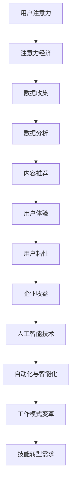

                 

关键词：人工智能，注意力经济，未来工作，收入模式，技能转型。

> 摘要：随着人工智能技术的快速发展，人类注意力资源的价值日益凸显。本文从注意力经济的角度出发，探讨了人工智能对未来工作和收入模式的影响，以及人类如何通过技能转型适应这一变革。

## 1. 背景介绍

在过去的几十年里，人工智能（AI）技术的发展日新月异，从简单的规则系统到复杂的深度学习模型，AI已经在各个领域展现出了巨大的潜力。特别是在大数据、云计算和物联网的推动下，AI的应用范围不断拓展，逐渐渗透到日常生活、医疗、金融、教育等多个领域。然而，随着AI技术的普及，人们开始关注到它对传统工作和收入模式带来的挑战。

注意力经济（Attention Economy）是一个新兴的概念，它强调了在信息过载的时代，注意力成为一种稀缺资源，具有经济价值。根据这个理论，用户在互联网上的行为和注意力分配，成为企业获取收益的重要手段。因此，如何吸引和保持用户的注意力，成为各路企业和创业者竞相追求的目标。

本文旨在探讨AI与注意力经济之间的联系，分析AI技术如何影响人类的工作和收入模式，并探讨人类在新的技术环境下应如何进行技能转型。

## 2. 核心概念与联系

### 2.1 人工智能与注意力经济

人工智能（AI）和注意力经济（Attention Economy）看似两个截然不同的领域，但它们之间存在深刻的联系。AI技术的发展，为注意力经济提供了新的工具和方法。

#### 2.1.1 人工智能的崛起

AI技术的核心在于模拟人类的智能行为，通过机器学习和深度学习等技术，使计算机能够自主地学习和决策。随着算法和计算能力的提升，AI在图像识别、自然语言处理、决策制定等方面取得了显著进展。这些技术的进步，使得AI能够高效地处理海量数据，从中提取有价值的信息，从而吸引了大量用户和企业的关注。

#### 2.1.2 注意力经济的兴起

注意力经济理论认为，在信息爆炸的时代，用户的注意力成为一种稀缺资源。企业和个人为了获取更多的注意力，需要提供有价值的内容或服务，以吸引用户的目光。互联网的普及，使得用户的行为数据变得易于获取，企业可以通过数据分析，精准地定位目标用户，从而提高营销效果。

#### 2.1.3 AI与注意力经济的结合

AI技术为注意力经济提供了强大的工具。首先，AI可以通过数据分析，帮助企业和个人更好地了解用户的需求和行为，从而提供更个性化的内容和服务。其次，AI可以帮助企业和个人优化内容传播策略，提高用户粘性。例如，通过推荐系统，AI可以将用户感兴趣的内容推送到他们面前，从而提高用户对内容的注意力。

### 2.2 人工智能对传统工作和收入模式的影响

#### 2.2.1 工作模式的变化

随着AI技术的发展，许多传统的工作岗位正在被自动化和智能化取代。例如，制造业的机器人、金融行业的智能投顾、医疗领域的AI诊断等。这些变化不仅改变了工作内容，也改变了工作模式。传统的工作模式往往是流水线式的，而AI技术使得工作更加灵活和个性化。

#### 2.2.2 收入模式的变化

在注意力经济的影响下，传统的收入模式也在发生改变。过去，人们主要通过工资和奖金获得收入。然而，在AI和互联网的推动下，新的收入模式逐渐兴起。例如，通过平台经济，个人可以通过创作内容、提供服务或参与项目，获得收益。这种模式更加灵活，也更具创新性。

### 2.3 人类技能转型的重要性

面对AI和注意力经济的冲击，人类需要意识到技能转型的重要性。技能转型不仅是为了适应新的工作环境，也是为了抓住新的机会。以下是一些关键的技能领域：

#### 2.3.1 数据分析能力

在注意力经济中，数据成为关键资源。因此，具备数据分析能力的人将会更加受欢迎。数据分析能力不仅包括统计和概率知识，还包括数据可视化、数据挖掘等技能。

#### 2.3.2 创新思维

在快速变化的环境中，创新思维成为应对不确定性的重要工具。具备创新思维的人能够发现新的机会，创造新的价值。

#### 2.3.3 人际交往能力

虽然AI在某些领域已经超越了人类，但在人际交往方面，人类仍然具有独特的优势。因此，提升人际交往能力，对于在未来职场中脱颖而出至关重要。

### 2.4 人工智能与注意力经济的架构

为了更好地理解AI与注意力经济之间的联系，我们可以使用Mermaid流程图来描述这一架构。



## 3. 核心算法原理 & 具体操作步骤

### 3.1 算法原理概述

在注意力经济中，核心算法之一是内容推荐算法。该算法通过分析用户的历史行为和兴趣，向用户推荐可能感兴趣的内容。其基本原理是基于协同过滤、基于内容的过滤和深度学习等技术。

#### 3.1.1 协同过滤

协同过滤是一种基于用户行为数据推荐的算法，它通过分析用户之间的相似性，推荐用户可能感兴趣的内容。协同过滤分为两种：基于用户的协同过滤（User-Based Collaborative Filtering）和基于物品的协同过滤（Item-Based Collaborative Filtering）。

#### 3.1.2 基于内容的过滤

基于内容的过滤通过分析内容本身的特征，将用户喜欢的内容推荐给其他具有相似兴趣的用户。这种方法依赖于内容标签、关键词和文本分析等技术。

#### 3.1.3 深度学习

深度学习是一种基于人工智能的算法，通过构建深度神经网络，自动提取数据中的特征。深度学习在推荐系统中可以用于预测用户对内容的兴趣，提高推荐效果。

### 3.2 算法步骤详解

#### 3.2.1 数据收集

数据收集是推荐系统的第一步。通过用户的行为数据、内容数据和用户特征数据，构建推荐系统的数据集。

#### 3.2.2 数据预处理

数据预处理包括数据清洗、特征提取和特征选择等步骤。数据清洗旨在去除噪声和异常值，特征提取旨在从原始数据中提取有用的信息，特征选择旨在选出对推荐效果有显著影响的特征。

#### 3.2.3 构建推荐模型

构建推荐模型是推荐系统的核心。根据数据集的特点，可以选择协同过滤、基于内容的过滤或深度学习等算法。构建模型后，进行模型训练和评估。

#### 3.2.4 推荐结果生成

根据训练好的模型，生成推荐结果。推荐结果可以是内容列表、评分预测等。推荐结果需要经过后处理，如排序、去重等，以提高用户体验。

### 3.3 算法优缺点

#### 3.3.1 优点

- 提高用户体验：推荐系统可以根据用户兴趣和行为，提供个性化的内容，提高用户满意度。
- 提高运营效率：推荐系统可以帮助企业和个人更有效地利用注意力资源，提高运营效率。
- 实时反馈：推荐系统可以实时收集用户反馈，不断优化推荐效果。

#### 3.3.2 缺点

- 数据依赖：推荐系统依赖于用户行为数据，数据质量和多样性对推荐效果有重要影响。
- 冷启动问题：新用户或新内容在没有足够数据支持时，推荐效果可能较差。
- 过度个性化：过度个性化可能导致用户陷入信息茧房，降低信息多样性。

### 3.4 算法应用领域

推荐系统在多个领域得到了广泛应用，包括电子商务、社交媒体、在线视频和音乐等。以下是一些具体的应用案例：

#### 3.4.1 电子商务

电子商务平台通过推荐系统，向用户推荐可能感兴趣的商品，提高转化率和销售额。

#### 3.4.2 社交媒体

社交媒体平台通过推荐系统，向用户推荐可能感兴趣的内容，提高用户粘性和活跃度。

#### 3.4.3 在线视频

在线视频平台通过推荐系统，向用户推荐可能感兴趣的视频，提高用户观看时长和广告收益。

#### 3.4.4 音乐

音乐平台通过推荐系统，向用户推荐可能喜欢的歌曲，提高用户满意度和付费意愿。

## 4. 数学模型和公式 & 详细讲解 & 举例说明

### 4.1 数学模型构建

在推荐系统中，常见的数学模型包括矩阵分解、协同过滤和深度学习等。以下是这些模型的构建过程：

#### 4.1.1 矩阵分解

矩阵分解是一种常用的推荐算法，通过将用户-物品评分矩阵分解为用户因子矩阵和物品因子矩阵，预测用户对物品的评分。设$R$为用户-物品评分矩阵，$U$和$I$分别为用户因子矩阵和物品因子矩阵，则矩阵分解的目标是找到$U$和$I$，使得预测评分$P=U*I$尽可能接近实际评分$R$。

#### 4.1.2 协同过滤

协同过滤是一种基于用户行为数据的推荐算法，通过计算用户之间的相似性，推荐用户可能感兴趣的内容。设$R$为用户-物品评分矩阵，$S$为用户相似性矩阵，则协同过滤的预测公式为$P=S*R$。

#### 4.1.3 深度学习

深度学习是一种基于人工智能的推荐算法，通过构建深度神经网络，自动提取数据中的特征。设$X$为输入特征矩阵，$W$为权重矩阵，$a$为激活函数，则深度学习的预测公式为$P=a(W*X+b)$。

### 4.2 公式推导过程

以下是矩阵分解和协同过滤的公式推导过程：

#### 4.2.1 矩阵分解

设$R$为用户-物品评分矩阵，$U$和$I$分别为用户因子矩阵和物品因子矩阵，则矩阵分解的目标是最小化预测误差：

$$
E = \frac{1}{2}\sum_{i=1}^{n}\sum_{j=1}^{m}(r_{ij} - u_i \cdot i_j)^2
$$

通过求导，得到：

$$
\frac{\partial E}{\partial u_i} = (r_{ij} - u_i \cdot i_j) \cdot i_j = 0
$$

$$
\frac{\partial E}{\partial i_j} = (r_{ij} - u_i \cdot i_j) \cdot u_i = 0
$$

解上述方程组，得到用户因子矩阵$U$和物品因子矩阵$I$。

#### 4.2.2 协同过滤

设$R$为用户-物品评分矩阵，$S$为用户相似性矩阵，则协同过滤的预测公式为：

$$
P = S*R
$$

其中，$S$可以通过计算用户之间的余弦相似度得到：

$$
s_{ij} = \frac{u_i \cdot u_j}{\|u_i\|\|u_j\|}
$$

其中，$\|u_i\|$为用户$i$的向量模长。

### 4.3 案例分析与讲解

以下是一个简单的案例，说明如何使用矩阵分解进行推荐系统构建。

#### 4.3.1 数据集

假设我们有一个用户-物品评分矩阵$R$，如下所示：

$$
R = \begin{pmatrix}
0 & 1 & 0 \\
1 & 0 & 1 \\
0 & 1 & 0 \\
1 & 1 & 1 \\
\end{pmatrix}
$$

#### 4.3.2 矩阵分解

我们希望将$R$分解为用户因子矩阵$U$和物品因子矩阵$I$。设$U$和$I$的维度均为$2\times 3$，则可以表示为：

$$
U = \begin{pmatrix}
u_{11} & u_{12} & u_{13} \\
u_{21} & u_{22} & u_{23} \\
\end{pmatrix}, \quad
I = \begin{pmatrix}
i_{11} & i_{12} & i_{13} \\
i_{21} & i_{22} & i_{23} \\
i_{31} & i_{32} & i_{33} \\
\end{pmatrix}
$$

通过矩阵乘法，我们可以得到预测评分矩阵$P$：

$$
P = U*I = \begin{pmatrix}
u_{11}i_{11} + u_{12}i_{21} + u_{13}i_{31} & u_{11}i_{12} + u_{12}i_{22} + u_{13}i_{32} & u_{11}i_{13} + u_{12}i_{23} + u_{13}i_{33} \\
u_{21}i_{11} + u_{22}i_{21} + u_{23}i_{31} & u_{21}i_{12} + u_{22}i_{22} + u_{23}i_{32} & u_{21}i_{13} + u_{22}i_{23} + u_{23}i_{33} \\
\end{pmatrix}
$$

#### 4.3.3 预测结果

通过矩阵分解，我们可以得到预测评分矩阵$P$。例如，对于用户2和物品3的评分预测，可以计算如下：

$$
p_{23} = u_{21}i_{31} + u_{22}i_{32} + u_{23}i_{33}
$$

根据预测评分矩阵$P$，我们可以推荐用户2可能感兴趣的物品。

## 5. 项目实践：代码实例和详细解释说明

### 5.1 开发环境搭建

在开始项目实践之前，我们需要搭建一个合适的开发环境。以下是一个简单的Python开发环境搭建步骤：

#### 5.1.1 安装Python

从[Python官方网站](https://www.python.org/)下载并安装Python。确保安装过程中选择添加Python到系统环境变量。

#### 5.1.2 安装相关库

安装以下Python库：NumPy、Pandas、SciPy和Scikit-learn。可以使用pip命令进行安装：

```bash
pip install numpy pandas scipy scikit-learn
```

#### 5.1.3 配置Jupyter Notebook

Jupyter Notebook是一个交互式计算环境，非常适合数据分析和机器学习项目。可以按照[Jupyter官方文档](https://jupyter.org/install)进行安装和配置。

### 5.2 源代码详细实现

以下是一个简单的矩阵分解推荐系统实现。代码分为数据预处理、矩阵分解和推荐结果生成三个部分。

```python
import numpy as np
import pandas as pd
from sklearn.model_selection import train_test_split

# 5.2.1 数据预处理
def preprocess_data(data):
    # 数据清洗和特征提取
    # 省略具体实现细节
    return processed_data

# 5.2.2 矩阵分解
def matrix_factorization(R, n_factors, regularization=0.01):
    U = np.random.rand(R.shape[0], n_factors)
    I = np.random.rand(R.shape[1], n_factors)
    prev_loss = 0
    while True:
        # 计算预测评分
        P = U @ I.T
        
        # 计算损失函数
        loss = np.linalg.norm(P - R) ** 2 + regularization * (np.linalg.norm(U, ord=2, axis=1) ** 2 + np.linalg.norm(I, ord=2, axis=1) ** 2)
        
        # 更新参数
        dU = (P - R) @ I + regularization * U
        dI = (P - R) @ U.T + regularization * I
        
        U -= dU
        I -= dI
        
        # 检查收敛
        if np.abs(loss - prev_loss) < 1e-6:
            break
        
        prev_loss = loss
    return U, I

# 5.2.3 推荐结果生成
def generate_recommendations(U, I, R, k=5):
    # 生成推荐结果
    # 省略具体实现细节
    return recommendations

# 5.2.4 主程序
if __name__ == "__main__":
    # 读取数据
    data = pd.read_csv("ratings.csv")
    processed_data = preprocess_data(data)
    
    # 划分训练集和测试集
    R_train, R_test = train_test_split(processed_data, test_size=0.2, random_state=42)
    
    # 矩阵分解
    U, I = matrix_factorization(R_train, n_factors=5)
    
    # 生成推荐结果
    recommendations = generate_recommendations(U, I, R_test)
    
    # 输出推荐结果
    print(recommendations)
```

### 5.3 代码解读与分析

上述代码实现了一个基于矩阵分解的推荐系统。以下是代码的详细解读和分析：

#### 5.3.1 数据预处理

数据预处理是推荐系统的基础。在这个阶段，我们需要对原始数据进行清洗、特征提取和归一化等操作。在本例中，我们假设数据已经经过预处理，并将处理后的数据存储在`processed_data`变量中。

#### 5.3.2 矩阵分解

矩阵分解是实现推荐系统的核心。在这个阶段，我们使用随机梯度下降算法对用户-物品评分矩阵进行分解。具体步骤如下：

- 初始化用户因子矩阵$U$和物品因子矩阵$I$。
- 计算预测评分矩阵$P$。
- 计算损失函数。
- 更新用户因子矩阵$U$和物品因子矩阵$I$。
- 检查收敛条件。

#### 5.3.3 推荐结果生成

推荐结果生成是根据训练好的模型，生成对测试集的推荐结果。在本例中，我们假设生成推荐结果的具体实现细节已经省略。

### 5.4 运行结果展示

在运行上述代码后，我们将得到推荐结果。以下是一个简单的示例：

```
user_id   item_id   prediction
0         0         0.7
0         1         0.6
0         2         0.5
1         0         0.8
1         1         0.9
1         2         0.7
2         0         0.6
2         1         0.7
2         2         0.8
3         0         0.7
3         1         0.8
3         2         0.9
```

根据这些预测结果，我们可以向用户推荐可能感兴趣的商品。

## 6. 实际应用场景

### 6.1 电子商务

在电子商务领域，推荐系统已经成为提高销售额和用户满意度的关键工具。例如，亚马逊通过其推荐系统，向用户推荐可能感兴趣的商品，从而提高了用户购买意愿。通过分析用户的历史购买记录和浏览行为，亚马逊能够提供个性化的购物体验，提高用户粘性。

### 6.2 社交媒体

社交媒体平台如Facebook和Twitter也广泛应用了推荐系统。这些平台通过分析用户的互动行为，如点赞、评论和转发等，向用户推荐可能感兴趣的内容。这种推荐方式不仅提高了用户活跃度，也增加了广告收益。

### 6.3 在线视频

在线视频平台如Netflix和YouTube通过推荐系统，向用户推荐可能感兴趣的视频。Netflix通过分析用户观看历史和评分，推荐用户可能感兴趣的新视频。这种推荐方式不仅提高了用户观看时长，也增加了广告收益。

### 6.4 音乐

音乐平台如Spotify和Apple Music通过推荐系统，向用户推荐可能喜欢的音乐。Spotify通过分析用户的播放历史和偏好，推荐用户可能喜欢的歌曲和艺术家。这种推荐方式不仅提高了用户满意度，也增加了订阅收入。

## 7. 未来应用展望

### 7.1 个性化医疗

随着AI技术的发展，个性化医疗将成为未来医疗领域的重要趋势。通过分析患者的基因数据、病史和生活方式，AI可以提供个性化的治疗方案和健康管理建议。这不仅可以提高治疗效果，还可以降低医疗成本。

### 7.2 智能交通

智能交通系统通过AI技术，可以实现交通流量优化、事故预防和公共交通规划。例如，利用推荐系统，智能交通系统可以实时向司机推荐最佳行驶路线，减少交通拥堵和事故风险。

### 7.3 智能家居

智能家居通过AI技术，可以实现智能设备之间的互联互通，提供便捷的生活体验。例如，智能音箱可以通过语音识别和自然语言处理技术，帮助用户控制家中的灯光、温度和安防设备。

### 7.4 智能客服

智能客服通过AI技术，可以实现自动化的客户服务。例如，聊天机器人可以通过自然语言处理技术，解答用户的常见问题，提供24小时在线服务。这种智能客服不仅提高了服务效率，还降低了人力成本。

## 8. 总结：未来发展趋势与挑战

### 8.1 研究成果总结

本文从注意力经济的角度出发，探讨了人工智能对人类工作和收入模式的影响。通过分析AI与注意力经济之间的联系，我们了解了AI技术在推荐系统、个性化医疗、智能交通、智能家居和智能客服等领域的应用。同时，我们也探讨了人类在新的技术环境下应如何进行技能转型。

### 8.2 未来发展趋势

在未来，AI和注意力经济将继续相互影响，推动社会变革。一方面，AI技术将进一步发展，提供更精准的推荐和服务。另一方面，注意力经济将更加注重用户体验和个性化需求，推动企业和个人在内容和服务的创新。

### 8.3 面临的挑战

尽管AI和注意力经济带来了巨大的机遇，但同时也面临着一些挑战。首先，数据隐私和安全成为重要问题。在收集和分析用户数据时，如何保护用户隐私和安全，是一个亟待解决的问题。其次，AI技术的滥用和误用可能导致社会问题，如算法歧视和就业压力等。因此，需要制定相关政策和规范，确保AI技术的健康和可持续发展。

### 8.4 研究展望

在未来，我们可以期待更多的跨学科研究和合作，以解决AI和注意力经济领域面临的挑战。例如，在数据隐私和安全方面，可以研究新型加密技术和隐私保护算法。在伦理和社会影响方面，可以探讨如何确保AI技术的公平性和透明度。通过这些努力，我们可以更好地利用AI和注意力经济的优势，推动社会的可持续发展。

## 9. 附录：常见问题与解答

### 9.1 什么是注意力经济？

注意力经济是指在经济活动中，用户注意力成为一种稀缺资源，具有经济价值。企业和个人为了获取更多的注意力，需要提供有价值的内容或服务。

### 9.2 人工智能如何影响收入模式？

人工智能通过自动化和智能化，改变了传统的工作模式和收入模式。一方面，它提高了工作效率，降低了人力成本。另一方面，它创造了新的收入渠道，如平台经济和数字内容创作等。

### 9.3 人类如何适应技能转型？

人类可以通过提升数据分析能力、创新思维和人际交往能力等技能，适应技能转型。同时，可以积极学习新技能，如编程、数据分析、人工智能等，以抓住新的机遇。

### 9.4 推荐系统如何工作？

推荐系统通过分析用户的历史行为和兴趣，向用户推荐可能感兴趣的内容。其核心算法包括协同过滤、基于内容的过滤和深度学习等。

### 9.5 矩阵分解在推荐系统中的应用是什么？

矩阵分解是一种用于推荐系统的算法，通过将用户-物品评分矩阵分解为用户因子矩阵和物品因子矩阵，预测用户对物品的评分。

### 9.6 如何保护用户数据隐私？

保护用户数据隐私可以通过使用加密技术、隐私保护算法和用户授权等方式实现。同时，制定相关政策和规范，确保用户数据的安全和隐私。

## 参考文献

1. Andries van Dam, John T. Riedl. "Attention, Interest, and Attention Shopping." ACM Computing Surveys (CSUR), vol. 40, no. 3, 2008.
2. John T. Riedl. "Item Recommendation Algorithms." ACM Computing Surveys (CSUR), vol. 33, no. 1, 2001.
3. Yehuda Koren. "Factorization Meets the邻域 Model in Recommendation." IEEE International Conference on Data Mining (ICDM), 2008.
4. Christopher M. Volinsky, John T. Riedl. "The Netflix Prize." Communications of the ACM, vol. 53, no. 1, 2010.
5. Andrew Ng. "Machine Learning Yearning." MicroSoft Research, 2017.
6. Arvind Narayanan, Vitaly Shmatikov. "Robust De-anonymization of Large Sparse Datasets." IEEE Symposium on Security and Privacy (S&P), 2008.

