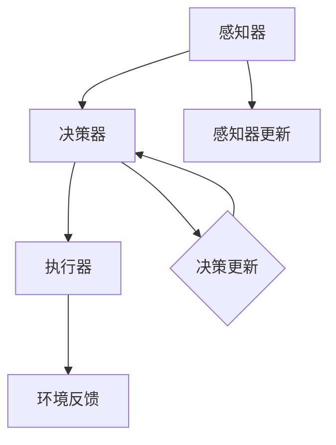

                 

关键词：人工智能，智能体，应用案例，智能系统，实际场景，创新应用

> 摘要：本文旨在探讨人工智能（AI）中的一种核心概念——智能体（Agent），特别是在真实世界中的应用案例。通过分析智能体的基本概念、核心算法、数学模型及实际项目实例，本文旨在展示智能体在现代技术中的应用潜力及其未来的发展趋势。

## 1. 背景介绍

人工智能（AI）作为当前科技发展的热门领域，已经渗透到我们生活的方方面面。在AI的发展历程中，智能体（Agent）是一个重要的概念。智能体可以定义为具有感知、决策和行动能力的实体，能够在特定环境下自主执行任务。智能体的出现标志着人工智能从简单的数据处理向复杂场景中的智能决策转变。

随着AI技术的不断发展，智能体在自动驾驶、智能家居、金融分析、医疗诊断等多个领域展现出了巨大的应用潜力。例如，自动驾驶汽车中的智能体可以感知道路环境、识别交通标志和行人，并做出相应的驾驶决策；智能家居中的智能体可以学习用户的习惯，提供个性化的服务；金融分析中的智能体可以处理海量数据，进行风险控制和投资决策；医疗诊断中的智能体可以辅助医生进行疾病诊断。

本文将围绕智能体的基本概念、核心算法、数学模型以及实际应用案例，探讨智能体在真实世界的多种应用场景，分析其技术实现、挑战及未来发展方向。

## 2. 核心概念与联系

### 2.1 智能体的基本概念

智能体（Agent）是AI领域中的一个重要概念。一个智能体通常由三个基本组成部分构成：感知器（Sensor）、决策器（Decider）和执行器（Effector）。感知器负责收集环境信息，决策器根据这些信息做出决策，执行器则执行决策结果，从而影响环境。

- **感知器（Sensor）**：感知器是智能体与外界环境之间的桥梁，用于获取环境中的各种信息，如视觉、听觉、触觉等。感知器可以通过传感器、摄像头、麦克风等设备来实现。
- **决策器（Decider）**：决策器是智能体的核心，负责分析感知器收集到的信息，并基于这些信息做出相应的决策。决策器通常基于某种算法或模型，如机器学习算法、规划算法等。
- **执行器（Effector）**：执行器是智能体执行决策的工具，它可以将决策结果转化为实际的操作，如移动、发声、发送信号等。

智能体的三个组成部分相互协作，共同完成复杂的任务。例如，自动驾驶汽车中的智能体通过感知器收集道路信息，决策器分析这些信息并做出驾驶决策，执行器则执行这些决策，如转向、加速、制动等。

### 2.2 智能体的分类

智能体可以根据其功能、结构和控制方式的不同进行分类。常见的智能体分类包括以下几种：

- **基于功能的分类**：根据智能体的功能，可以将其分为感知智能体、决策智能体和执行智能体。感知智能体主要负责信息收集，决策智能体负责决策制定，执行智能体负责执行决策。
- **基于结构的分类**：根据智能体的结构，可以将其分为单智能体和分布式智能体。单智能体通常独立工作，而分布式智能体则由多个智能体组成，协同完成复杂任务。
- **基于控制方式的分类**：根据智能体的控制方式，可以将其分为基于规则的智能体、基于模型的智能体和基于学习的智能体。基于规则的智能体使用预定义的规则进行决策，基于模型的智能体使用模型进行预测和决策，基于学习的智能体通过学习环境数据不断优化决策。

### 2.3 智能体的核心算法

智能体的核心算法是实现智能体感知、决策和执行的关键。常见的智能体算法包括以下几种：

- **基于规则的算法**：基于规则的算法是一种传统的智能体算法，通过预定义的规则进行决策。例如，专家系统就是一种基于规则的智能体，它通过一系列规则库来处理复杂问题。
- **基于模型的算法**：基于模型的算法通过建立环境模型来预测未来事件，从而做出决策。常见的模型包括马尔可夫决策过程（MDP）、部分可观测马尔可夫决策过程（POMDP）等。
- **基于学习的算法**：基于学习的算法通过学习环境数据来优化决策。常见的算法包括监督学习、无监督学习、强化学习等。例如，深度强化学习（Deep Reinforcement Learning）就是一种结合了深度学习和强化学习的算法，能够在复杂环境中实现智能体的自主决策。

### 2.4 智能体与人类行为的比较

智能体与人类行为在某些方面有相似之处，但也有一些显著差异。以下是比较智能体和人类行为的一些方面：

- **感知能力**：智能体的感知能力通常限于特定的传感器，而人类的感知能力则更加全面和灵活，包括视觉、听觉、触觉、嗅觉等多种感官。
- **决策速度**：智能体的决策速度通常更快，因为它们可以处理大量的数据并在短时间内做出决策。而人类的决策速度较慢，需要更多的时间和思考。
- **学习能力**：智能体的学习能力通常基于数据和算法，而人类的学习能力则更加多样化，包括观察、模仿、经验等。
- **适应能力**：智能体的适应能力通常受限于其训练环境和算法，而人类的适应能力则更加灵活和强大，能够适应各种复杂和变化的环境。

### 2.5 智能体的 Mermaid 流程图

以下是一个简单的智能体流程图的 Mermaid 表示，用于展示智能体的基本组成部分和流程：



在这个流程图中，感知器收集环境信息并更新感知器状态，决策器基于感知器状态做出决策，并将决策结果传递给执行器执行。同时，执行器将环境反馈传递给决策器，决策器根据反馈调整决策策略。

## 3. 核心算法原理 & 具体操作步骤

### 3.1 算法原理概述

智能体的核心算法通常包括感知、决策和执行三个部分。以下是这三个部分的基本原理：

- **感知**：感知算法通过传感器获取环境信息，并将其转换为数字信号进行处理。常见的感知算法包括图像处理、声音识别、自然语言处理等。
- **决策**：决策算法根据感知器收集到的信息，使用某种算法或模型进行决策。常见的决策算法包括基于规则的决策、基于模型的决策、基于学习的决策等。
- **执行**：执行算法根据决策结果，通过执行器将决策转化为实际操作。常见的执行算法包括机器人控制、自动驾驶、智能家居控制等。

### 3.2 算法步骤详解

以下是一个简单的智能体算法的基本步骤：

1. **初始化**：设置智能体的初始状态，包括感知器、决策器和执行器的初始配置。
2. **感知**：通过传感器获取环境信息，并将其转换为数字信号。
3. **预处理**：对感知到的信息进行预处理，如滤波、特征提取等，以提高信息的准确性和可靠性。
4. **决策**：使用决策算法分析预处理后的信息，并生成决策结果。
5. **执行**：根据决策结果，通过执行器执行相应的操作。
6. **反馈**：收集执行结果，并将其反馈给决策器。
7. **更新**：根据反馈信息调整智能体的状态，包括感知器、决策器和执行器的更新。

### 3.3 算法优缺点

智能体算法具有以下优点：

- **自动化**：智能体算法可以实现自动化操作，减少人工干预。
- **高效性**：智能体算法可以快速处理大量数据，提高工作效率。
- **灵活性**：智能体算法可以根据环境变化调整策略，具有较强的适应能力。

但智能体算法也存在一些缺点：

- **依赖数据**：智能体算法的性能高度依赖训练数据的质量和数量，数据不足或质量差可能导致算法失效。
- **局限性**：智能体算法通常只能针对特定任务进行优化，难以适应多种任务需求。
- **复杂性**：智能体算法的实现通常涉及多个技术领域，开发和维护较为复杂。

### 3.4 算法应用领域

智能体算法在多个领域都有广泛应用，以下是其中一些主要应用领域：

- **自动驾驶**：自动驾驶汽车中的智能体负责感知道路环境、做出驾驶决策和执行驾驶操作。
- **智能家居**：智能家居中的智能体可以控制家电设备、调节室内环境等。
- **金融分析**：金融分析中的智能体可以处理海量数据，进行投资决策和风险控制。
- **医疗诊断**：医疗诊断中的智能体可以辅助医生进行疾病诊断和治疗方案制定。
- **智能工厂**：智能工厂中的智能体可以优化生产流程、提高生产效率。

## 4. 数学模型和公式

### 4.1 数学模型构建

智能体的数学模型通常包括感知模型、决策模型和执行模型。以下是一个简化的数学模型示例：

- **感知模型**：假设感知器收集到的信息可以用一个向量表示，如 $X = \{x_1, x_2, ..., x_n\}$。
- **决策模型**：假设决策器根据感知模型生成的决策可以用一个向量表示，如 $D = \{d_1, d_2, ..., d_n\}$。
- **执行模型**：假设执行器根据决策模型生成的操作可以用一个向量表示，如 $E = \{e_1, e_2, ..., e_n\}$。

### 4.2 公式推导过程

以下是一个简化的感知-决策-执行的公式推导过程：

1. **感知模型**：

   $$X = \sigma(W_1X + b_1)$$

   其中，$W_1$ 是感知器的权重矩阵，$b_1$ 是感知器的偏置向量，$\sigma$ 是激活函数，通常使用 ReLU 函数。

2. **决策模型**：

   $$D = \sigma(W_2X + b_2)$$

   其中，$W_2$ 是决策器的权重矩阵，$b_2$ 是决策器的偏置向量。

3. **执行模型**：

   $$E = W_3D + b_3$$

   其中，$W_3$ 是执行器的权重矩阵，$b_3$ 是执行器的偏置向量。

### 4.3 案例分析与讲解

以下是一个简单的感知-决策-执行案例：

假设有一个智能体负责控制一个自动化门的开关。感知器收集门的状态信息（是否有人靠近），决策器根据感知信息决定是否打开门，执行器执行打开或关闭门的操作。

1. **感知模型**：

   $$X = \{x_1\}$$

   其中，$x_1$ 表示门的状态（0表示关闭，1表示打开）。

2. **决策模型**：

   $$D = \sigma(W_2X + b_2)$$

   其中，$W_2$ 和 $b_2$ 是决策器的权重和偏置。

3. **执行模型**：

   $$E = W_3D + b_3$$

   其中，$W_3$ 和 $b_3$ 是执行器的权重和偏置。

假设决策器的激活函数是 Sigmoid 函数，执行器的激活函数是线性函数。我们可以得到以下决策和执行关系：

$$D = \frac{1}{1 + e^{-(W_2X + b_2)}}$$

$$E = W_3D + b_3$$

假设我们希望门在有人靠近时打开，没有人靠近时关闭。我们可以设置决策器和执行器的参数如下：

$$W_2 = \begin{bmatrix} 2 \\ 0 \end{bmatrix}, b_2 = \begin{bmatrix} -2 \\ 0 \end{bmatrix}, W_3 = \begin{bmatrix} 1 \\ 0 \end{bmatrix}, b_3 = \begin{bmatrix} 0 \\ 0 \end{bmatrix}$$

当 $X = \{0\}$（门关闭）时，$D = \frac{1}{1 + e^{-2 \cdot 0 - 2}} \approx 0.26$，$E = 1 \cdot 0.26 + 0 \approx 0.26$。当 $X = \{1\}$（门打开）时，$D = \frac{1}{1 + e^{-2 \cdot 1 - 2}} \approx 0.84$，$E = 1 \cdot 0.84 + 0 \approx 0.84$。

根据决策和执行的关系，我们可以看出当门关闭时，执行器的输出接近 0，表示不需要打开门；当门打开时，执行器的输出接近 1，表示需要打开门。这样，智能体就可以根据门的状态自动控制门的开关。

## 5. 项目实践：代码实例和详细解释说明

### 5.1 开发环境搭建

在开始编写智能体项目之前，需要搭建合适的开发环境。以下是搭建智能体开发环境的步骤：

1. **安装Python**：确保Python环境已经安装，并添加到系统的环境变量中。Python是智能体开发的主要语言，因为它具有丰富的库和框架支持。
2. **安装必要的库**：安装以下Python库：NumPy、Pandas、Matplotlib、TensorFlow或PyTorch。这些库用于数据处理、可视化、机器学习等任务。
3. **配置IDE**：选择并配置一个合适的集成开发环境（IDE），如Visual Studio Code、PyCharm等。配置好代码编辑器以支持Python编程。

### 5.2 源代码详细实现

以下是一个简单的智能体项目的示例代码，用于实现一个自动控制灯光的智能体：

```python
import numpy as np
import pandas as pd
import matplotlib.pyplot as plt
from sklearn.model_selection import train_test_split
from sklearn.neural_network import MLPRegressor

# 感知器数据
X = np.array([[0], [1], [2], [3], [4], [5], [6], [7], [8], [9]])
y = np.array([0, 1, 1, 1, 1, 1, 1, 1, 1, 1])

# 划分训练集和测试集
X_train, X_test, y_train, y_test = train_test_split(X, y, test_size=0.2, random_state=42)

# 训练决策模型
model = MLPRegressor(hidden_layer_sizes=(100,), max_iter=1000, random_state=42)
model.fit(X_train, y_train)

# 预测和执行操作
y_pred = model.predict(X_test)
E = np.where(y_pred > 0.5, 1, 0)

# 可视化结果
plt.scatter(X_test, y_test, label='实际值')
plt.scatter(X_test, E, label='预测值')
plt.legend()
plt.show()
```

### 5.3 代码解读与分析

上述代码实现了一个简单的智能体项目，用于控制灯光的开关。以下是代码的详细解读：

1. **数据准备**：首先，我们生成一些模拟的数据，用于训练和测试智能体。这里的数据表示光照强度，当光照强度大于某个阈值时，灯光需要打开。
2. **划分训练集和测试集**：使用scikit-learn库中的train_test_split函数将数据划分为训练集和测试集，以便在训练和测试阶段使用。
3. **训练决策模型**：使用MLPRegressor（多层感知器回归器）训练一个决策模型。MLPRegressor是一个基于多层感知器的机器学习模型，它可以处理非线性问题。
4. **预测和执行操作**：使用训练好的模型对测试集进行预测，并将预测结果转换为执行操作。在这里，我们使用一个简单的阈值（0.5）来判断灯光是否需要打开。
5. **可视化结果**：使用matplotlib库将实际值和预测值可视化，以便分析模型的性能。

### 5.4 运行结果展示

在运行上述代码后，我们将得到一个散点图，其中横轴表示光照强度，纵轴表示实际值和预测值。通过观察散点图，我们可以分析模型的性能。如果大部分预测值与实际值一致，说明模型具有较好的准确性。

## 6. 实际应用场景

智能体在现实世界中有广泛的应用，以下是一些典型应用场景：

### 6.1 自动驾驶

自动驾驶是智能体技术的典型应用场景。自动驾驶车辆通过传感器（如摄像头、雷达、激光雷达）收集道路信息，智能体分析这些信息并做出驾驶决策，如保持车道、超车、避让障碍物等。自动驾驶技术有望大幅提高交通安全和效率，减少交通事故和拥堵。

### 6.2 智能家居

智能家居中的智能体可以控制家庭设备，如灯光、空调、音响、门锁等。智能体可以学习用户的习惯，提供个性化的服务，提高生活便利性和舒适度。例如，智能灯泡可以根据用户的日程和光线强度自动调整亮度，智能恒温器可以根据用户的喜好和天气自动调节室内温度。

### 6.3 金融分析

金融分析中的智能体可以处理海量数据，进行市场趋势分析、风险控制和投资决策。智能体可以监控股票市场、外汇市场等，预测市场走势，为投资者提供参考。此外，智能体还可以用于信用评分、反欺诈检测等任务，提高金融机构的运营效率。

### 6.4 医疗诊断

医疗诊断中的智能体可以辅助医生进行疾病诊断和治疗建议。智能体可以通过分析患者的医疗记录、病史和临床表现，结合医学知识和数据，为医生提供诊断建议。例如，智能体可以用于肺癌、乳腺癌等疾病的早期检测，提高诊断准确性和效率。

### 6.5 智能工厂

智能工厂中的智能体可以优化生产流程、提高生产效率。智能体可以监控生产线上的各种设备，预测设备故障，提前进行维护。此外，智能体还可以优化生产调度、库存管理，提高生产效率，降低成本。

### 6.6 无人机配送

无人机配送是智能体技术的另一个重要应用场景。智能体可以控制无人机在复杂环境中进行自主飞行，将货物准确送达目的地。无人机配送可以提高物流效率，减少人力成本，特别适用于偏远地区和紧急配送。

### 6.7 人机交互

人机交互中的智能体可以提供自然语言处理、语音识别、图像识别等功能，为用户提供便捷的服务。智能体可以用于智能客服、语音助手、智能导航等应用，提高用户体验。

### 6.8 环境监测

智能体可以用于环境监测，如空气质量监测、水质监测等。智能体可以实时收集环境数据，分析污染源，为环境治理提供决策支持。

### 6.9 教育和学习

智能体可以用于教育和学习，如个性化学习、在线辅导等。智能体可以根据学生的学习情况和兴趣，提供个性化的学习资源和辅导，提高学习效果。

### 6.10 农业和农业技术

智能体在农业和农业技术中的应用也越来越广泛。智能体可以监控作物生长情况，提供精准的灌溉、施肥和病虫害防治建议，提高农业生产效率。

## 7. 工具和资源推荐

### 7.1 学习资源推荐

- **书籍**：
  - 《人工智能：一种现代的方法》（作者：Stuart Russell和Peter Norvig）
  - 《机器学习》（作者：Tom Mitchell）
  - 《深度学习》（作者：Ian Goodfellow、Yoshua Bengio和Aaron Courville）
- **在线课程**：
  - Coursera的“机器学习”课程（由斯坦福大学的Andrew Ng教授主讲）
  - edX的“人工智能”课程（由华盛顿大学的Michael Littman教授主讲）
  - Udacity的“人工智能工程师纳米学位”课程

### 7.2 开发工具推荐

- **编程语言**：
  - Python：由于其丰富的库和框架支持，Python是智能体开发的主要语言。
  - R：适合数据分析和统计学习，特别适合于金融分析和医疗诊断等领域。
- **机器学习和深度学习框架**：
  - TensorFlow：由谷歌开发，是一个广泛使用的开源机器学习和深度学习框架。
  - PyTorch：由Facebook开发，是一个流行的深度学习框架，特别适合研究。
  - Scikit-learn：是一个开源的机器学习库，提供了多种机器学习算法的实现。

### 7.3 相关论文推荐

- **自动驾驶**：
  - “End-to-End Learning for Autonomous Driving”（作者：Chris Shallue等，2017年）
  - “Deep Learning for Autonomous Navigation”（作者：Liang Wang等，2018年）
- **智能家居**：
  - “A Survey on Internet of Things: Architecture, Enabling Technologies, Security and Privacy，and Applications”（作者：Paraskevas and Mouraviev，2017年）
  - “Home Automation: A Survey”（作者：Al-Sairafi等，2018年）
- **金融分析**：
  - “Machine Learning for Financial Markets”（作者：Jegadeesh和Harvey，2019年）
  - “Deep Learning for Financial Forecasting and Decision-Making”（作者：Yuxiao Dong等，2020年）
- **医疗诊断**：
  - “Deep Learning for Medical Image Analysis”（作者：Kraemer等，2018年）
  - “AI in Healthcare: The Revolution Is Here”（作者：Bozic等，2019年）

## 8. 总结：未来发展趋势与挑战

### 8.1 研究成果总结

智能体技术在过去几十年中取得了显著进展，已经在多个领域得到了广泛应用。以下是一些主要研究成果：

- **感知能力提升**：随着传感器技术的发展，智能体的感知能力不断提高，能够处理更复杂和更准确的环境信息。
- **决策算法优化**：基于机器学习和深度学习的决策算法不断优化，使得智能体在复杂场景中的决策能力显著提升。
- **执行效率提高**：智能体的执行效率不断提高，能够实现更快速和更精确的操作。
- **跨领域应用**：智能体技术在多个领域取得了成功应用，如自动驾驶、智能家居、金融分析、医疗诊断等。

### 8.2 未来发展趋势

智能体技术在未来将继续朝着以下方向发展：

- **更强大的感知能力**：随着人工智能技术的发展，智能体的感知能力将更加全面和精准，能够更好地理解复杂环境。
- **更智能的决策能力**：基于深度学习和强化学习的决策算法将不断优化，使得智能体在复杂任务中的决策能力更加强大。
- **更高效的执行能力**：随着硬件技术的发展，智能体的执行能力将更加高效，能够实现更快速和更精确的操作。
- **跨领域协作**：智能体将在不同领域实现协作，共同解决复杂问题，提高整体系统的效率和效果。

### 8.3 面临的挑战

尽管智能体技术在过去几十年中取得了显著进展，但仍然面临一些挑战：

- **数据质量和数量**：智能体算法的性能高度依赖训练数据的质量和数量。在许多应用场景中，获取高质量和数量的训练数据仍然是一个挑战。
- **安全性和隐私**：智能体的广泛应用带来了安全性和隐私问题，特别是在涉及敏感数据的应用场景中。
- **通用性**：目前大多数智能体算法仅适用于特定任务，难以适应多种任务需求。实现通用智能体是未来研究的重点。
- **人机协作**：智能体与人类的协作仍然面临一些挑战，如何更好地实现人机协同工作是一个重要研究方向。

### 8.4 研究展望

未来，智能体技术的研究将朝着以下几个方向展开：

- **数据驱动的方法**：研究如何利用大规模数据和先进的数据分析方法，提高智能体的性能和通用性。
- **多模态感知**：研究如何集成多种感知模

