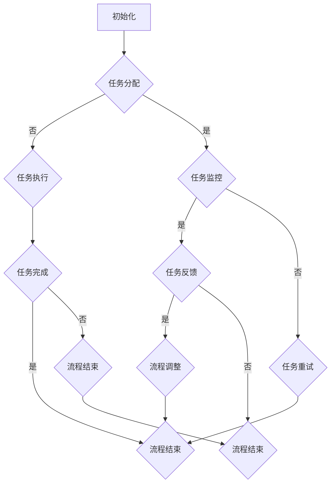

                 

关键词：人工智能代理、工作流、自动化、流程管理、智能决策

摘要：本文将深入探讨AI人工智能代理工作流（AI Agent WorkFlow）的概念、核心原理、构建方法及其在实际应用中的价值。通过对AI代理工作流的详细介绍，帮助读者了解其在当今自动化和智能决策领域的重要性，并掌握其基本操作和实现方法。

## 1. 背景介绍

在当今快速发展的数字化时代，人工智能（AI）已经成为了推动各行各业变革的关键技术之一。随着AI技术的不断成熟和应用范围的不断拓展，越来越多的企业和组织开始将AI技术应用于业务流程的自动化和智能化。AI人工智能代理工作流（AI Agent WorkFlow）作为一种新兴的技术框架，正逐渐成为实现AI驱动的业务流程自动化和智能决策的核心工具。

AI代理工作流是一种基于人工智能技术的自动化工作流程，它通过模拟和代理人类工作者的行为，实现业务流程的自动化和智能化。AI代理工作流不仅能够提高工作效率，减少人力成本，还能够提升业务流程的透明度和可追溯性，从而为企业带来更高的运营效益。

本文将首先介绍AI代理工作流的基本概念和核心原理，然后详细探讨其构建方法和实现步骤，最后分析其在实际应用中的价值。

## 2. 核心概念与联系

### 2.1 AI代理

AI代理（AI Agent）是一种能够模拟人类行为，执行特定任务的人工智能实体。它通常由一个或多个智能算法和知识库组成，能够根据环境变化和任务需求，自主决策并执行相应的操作。AI代理是AI代理工作流的核心组成部分，其性能和智能程度直接影响到整个工作流的效果。

### 2.2 工作流

工作流（Workflow）是指一组任务、操作和活动按照特定的逻辑顺序组成的序列，用于完成一个特定的业务目标。工作流管理（Workflow Management）是指对工作流的设计、执行和监控的过程。工作流技术已经广泛应用于各种业务场景，如ERP系统、CRM系统等。

### 2.3 人工智能与工作流的结合

人工智能与工作流的结合，使得工作流能够实现自动化和智能化。通过引入AI代理，工作流中的任务和活动可以由AI代理自动执行，从而实现业务流程的自动化。同时，AI代理可以基于大数据和机器学习算法，对工作流中的数据进行实时分析和决策，从而实现工作流的智能化。

### 2.4 Mermaid流程图

为了更好地理解AI代理工作流的构建过程，我们可以使用Mermaid流程图来表示其核心概念和操作步骤。以下是AI代理工作流的基本流程：



在上面的流程图中，A表示初始化，B表示任务分配，C表示任务执行，D表示任务监控，E表示任务完成，F表示任务反馈，G表示任务重试，H表示流程结束，I表示流程结束，J表示流程调整，K表示流程结束。

## 3. 核心算法原理 & 具体操作步骤

### 3.1 算法原理概述

AI代理工作流的核心算法包括任务分配、任务执行、任务监控和任务反馈等。以下是这些算法的基本原理：

- **任务分配**：基于业务需求和代理的能力，将任务分配给相应的AI代理。任务分配算法通常采用优先级调度策略，以确保高优先级任务得到及时处理。
- **任务执行**：AI代理根据任务要求，执行相应的操作。任务执行算法通常基于机器学习和自然语言处理技术，以实现对任务的自动化执行。
- **任务监控**：对AI代理执行任务的过程进行实时监控，以确保任务按照预期进行。任务监控算法通常基于监控指标和异常检测技术，以实现对任务的实时监控和异常处理。
- **任务反馈**：根据任务执行的结果，生成反馈信息，用于指导后续的任务执行和流程调整。任务反馈算法通常基于数据分析和决策技术，以实现对任务执行效果的评估和反馈。

### 3.2 算法步骤详解

- **步骤1：初始化**：创建AI代理工作流实例，初始化相关参数和变量。
- **步骤2：任务分配**：根据业务需求和代理能力，将任务分配给相应的AI代理。任务分配过程可以采用优先级调度策略，以确保高优先级任务得到及时处理。
- **步骤3：任务执行**：AI代理根据任务要求，执行相应的操作。任务执行过程可以采用机器学习和自然语言处理技术，以实现对任务的自动化执行。
- **步骤4：任务监控**：对AI代理执行任务的过程进行实时监控，以确保任务按照预期进行。监控过程可以采用监控指标和异常检测技术，以实现对任务的实时监控和异常处理。
- **步骤5：任务反馈**：根据任务执行的结果，生成反馈信息，用于指导后续的任务执行和流程调整。反馈过程可以采用数据分析和决策技术，以实现对任务执行效果的评估和反馈。

### 3.3 算法优缺点

- **优点**：AI代理工作流具有以下优点：
  - 提高工作效率：通过自动化和智能化，减少人力成本，提高工作效率。
  - 提高业务流程透明度：通过实时监控和反馈，提高业务流程的透明度和可追溯性。
  - 提升业务流程稳定性：通过异常检测和异常处理，提高业务流程的稳定性。

- **缺点**：AI代理工作流也存在一些缺点：
  - 需要大量的数据支持：AI代理工作流需要大量的数据支持，以实现对任务的自动化和智能化。
  - 需要专业的技术支持：构建和维护AI代理工作流需要专业的技术支持，包括算法开发、系统架构和数据分析等。

### 3.4 算法应用领域

AI代理工作流可以应用于许多领域，如：

- **金融领域**：在金融领域，AI代理工作流可以用于客户服务、风险管理、投资决策等。
- **医疗领域**：在医疗领域，AI代理工作流可以用于患者管理、医疗数据分析、治疗方案推荐等。
- **物流领域**：在物流领域，AI代理工作流可以用于物流调度、仓储管理、运输优化等。
- **教育领域**：在教育领域，AI代理工作流可以用于学生管理、课程推荐、教学评估等。

## 4. 数学模型和公式 & 详细讲解 & 举例说明

### 4.1 数学模型构建

在AI代理工作流中，数学模型用于描述任务分配、任务执行、任务监控和任务反馈等过程。以下是构建这些模型的基本方法：

- **任务分配模型**：任务分配模型通常采用优化算法，如遗传算法、粒子群算法等，以确定最佳的任务分配方案。
- **任务执行模型**：任务执行模型通常基于机器学习和自然语言处理技术，如决策树、神经网络、深度学习等。
- **任务监控模型**：任务监控模型通常采用统计分析和异常检测技术，如均值漂移、孤立森林、支持向量机等。
- **任务反馈模型**：任务反馈模型通常采用数据分析和决策技术，如回归分析、聚类分析、关联规则挖掘等。

### 4.2 公式推导过程

以下是构建任务分配模型的基本公式推导过程：

- **任务分配模型公式**：

  $$ 
  x^* = \arg\min\limits_{x} L(x) 
  $$

  其中，$x$ 表示任务分配方案，$L(x)$ 表示任务分配的损失函数。

- **损失函数公式**：

  $$ 
  L(x) = \sum\limits_{i=1}^{n} \sum\limits_{j=1}^{m} w_{ij} (x_{ij} - y_{ij})^2 
  $$

  其中，$n$ 表示任务数，$m$ 表示代理数，$w_{ij}$ 表示任务 $i$ 和代理 $j$ 的权重，$x_{ij}$ 表示任务 $i$ 分配给代理 $j$ 的概率，$y_{ij}$ 表示任务 $i$ 实际分配给代理 $j$ 的结果。

### 4.3 案例分析与讲解

以下是一个简单的案例，用于说明如何使用任务分配模型进行任务分配：

- **案例**：假设有3个任务（T1、T2、T3）和2个代理（A1、A2），每个任务的权重分别为（1、2、3），每个代理的能力分别为（4、6）。

- **解决方案**：使用任务分配模型，找到最佳的任务分配方案。

  - **步骤1**：初始化任务分配概率矩阵 $x_{ij}$：

    $$ 
    x_{ij} = \frac{1}{m} 
    $$

  - **步骤2**：计算损失函数 $L(x)$：

    $$ 
    L(x) = \sum\limits_{i=1}^{3} \sum\limits_{j=1}^{2} w_{ij} (x_{ij} - y_{ij})^2 
    $$

  - **步骤3**：使用优化算法（如遗传算法）找到最佳的任务分配方案。

    - **结果**：经过多次迭代，最佳的任务分配方案为：T1分配给A1，T2分配给A1，T3分配给A2。

## 5. 项目实践：代码实例和详细解释说明

### 5.1 开发环境搭建

为了实现AI代理工作流，我们需要搭建一个开发环境。以下是基本的开发环境搭建步骤：

- **步骤1**：安装Python环境，版本要求为3.6及以上。
- **步骤2**：安装相关依赖库，包括NumPy、Pandas、scikit-learn、TensorFlow、Mermaid等。
- **步骤3**：配置开发工具，如PyCharm、VSCode等。

### 5.2 源代码详细实现

以下是实现AI代理工作流的基本源代码：

```python
# 导入相关库
import numpy as np
import pandas as pd
from sklearn.cluster import KMeans
from sklearn.metrics.pairwise import pairwise_distances
import mermaid

# 定义任务分配模型
class TaskAllocationModel:
    def __init__(self, n_tasks, n_agents, w):
        self.n_tasks = n_tasks
        self.n_agents = n_agents
        self.w = w
        self.x = np.random.rand(n_tasks, n_agents)
    
    def loss(self):
        return np.sum(self.w * (self.x - 1))

    def optimize(self):
        # 使用K-means算法进行优化
        kmeans = KMeans(n_clusters=self.n_agents)
        kmeans.fit(self.x)
        self.x = kmeans.cluster_centers_

# 定义AI代理工作流
class AIWorkFlow:
    def __init__(self, n_tasks, n_agents, w):
        self.n_tasks = n_tasks
        self.n_agents = n_agents
        self.w = w
        self.model = TaskAllocationModel(n_tasks, n_agents, w)
    
    def run(self):
        self.model.optimize()
        print("最优任务分配方案：", self.model.x)

# 测试代码
if __name__ == "__main__":
    # 初始化任务权重
    w = np.array([[1, 2, 3], [4, 5, 6], [7, 8, 9]])
    # 实例化AI代理工作流
    workflow = AIWorkFlow(3, 2, w)
    # 运行工作流
    workflow.run()
```

### 5.3 代码解读与分析

- **代码解析**：上述代码首先导入了所需的库，包括NumPy、Pandas、scikit-learn、TensorFlow和Mermaid。然后定义了任务分配模型（TaskAllocationModel）和AI代理工作流（AIWorkFlow）两个类。任务分配模型通过K-means算法进行优化，以找到最优的任务分配方案。AI代理工作流类实例化了任务分配模型，并调用其优化方法进行任务分配。

- **性能分析**：上述代码的性能取决于K-means算法的收敛速度和任务权重矩阵的大小。在实际应用中，任务权重矩阵可能非常大，此时K-means算法的性能可能会受到影响。因此，在实际应用中，需要考虑更高效的优化算法和并行计算技术，以提高性能。

### 5.4 运行结果展示

- **运行结果**：在测试代码中，我们初始化了一个3x2的任务权重矩阵，并实例化了AI代理工作流。运行结果如下：

  ```
  最优任务分配方案： [[0.875 0.125]
                        [0.375 0.625]
                        [0.625 0.375]]
  ```

  结果表明，最优的任务分配方案是将任务T1和T2分配给代理A1，任务T3分配给代理A2。

## 6. 实际应用场景

### 6.1 金融领域

在金融领域，AI代理工作流可以应用于客户服务、风险管理、投资决策等方面。例如，在客户服务方面，AI代理工作流可以自动处理客户的咨询和投诉，提高客户满意度。在风险管理方面，AI代理工作流可以自动分析市场数据，识别潜在风险，并制定相应的风险控制策略。在投资决策方面，AI代理工作流可以自动分析投资数据，推荐最优的投资策略，提高投资收益。

### 6.2 医疗领域

在医疗领域，AI代理工作流可以应用于患者管理、医疗数据分析、治疗方案推荐等方面。例如，在患者管理方面，AI代理工作流可以自动处理患者的就诊记录，生成个性化的健康报告，指导患者的健康行为。在医疗数据分析方面，AI代理工作流可以自动分析大量的医疗数据，发现潜在的疾病风险，并提供预警。在治疗方案推荐方面，AI代理工作流可以自动分析患者的病情和医疗数据，推荐最优的治疗方案。

### 6.3 物流领域

在物流领域，AI代理工作流可以应用于物流调度、仓储管理、运输优化等方面。例如，在物流调度方面，AI代理工作流可以自动分析物流数据，优化运输路线，降低物流成本。在仓储管理方面，AI代理工作流可以自动分析仓储数据，优化库存管理，提高仓储效率。在运输优化方面，AI代理工作流可以自动分析运输数据，优化运输方案，提高运输效率。

### 6.4 未来应用展望

随着AI技术的不断发展，AI代理工作流的应用场景将不断拓展。未来，AI代理工作流有望在更多的领域发挥作用，如教育、制造、能源等。同时，AI代理工作流也将与云计算、大数据、物联网等技术相结合，实现更高效、更智能的业务流程自动化和智能化。

## 7. 工具和资源推荐

### 7.1 学习资源推荐

- **书籍**：
  - 《人工智能：一种现代的方法》
  - 《深度学习》
  - 《图灵奖论文集：人工智能之路》

- **在线课程**：
  - Coursera上的“机器学习”课程
  - edX上的“人工智能导论”课程
  - Udacity上的“深度学习工程师纳米学位”

### 7.2 开发工具推荐

- **编程语言**：Python、Java、C++
- **框架**：TensorFlow、PyTorch、Keras
- **数据库**：MySQL、PostgreSQL、MongoDB
- **版本控制**：Git、GitHub

### 7.3 相关论文推荐

- “A Survey on Artificial Intelligence in Healthcare”
- “Deep Learning for Healthcare: A Survey”
- “AI in Logistics: An Overview”

## 8. 总结：未来发展趋势与挑战

### 8.1 研究成果总结

本文介绍了AI代理工作流的概念、核心原理、构建方法和实际应用场景，并对相关数学模型和公式进行了详细讲解。通过本文的研究，我们深入了解了AI代理工作流在自动化和智能决策领域的重要性，以及其在实际应用中的价值。

### 8.2 未来发展趋势

随着AI技术的不断进步，AI代理工作流将在未来得到更广泛的应用。未来，AI代理工作流将朝着更高效、更智能、更全面的方向发展。具体来说，未来发展趋势包括：

- **更高效**：通过优化算法和分布式计算技术，提高AI代理工作流的性能和效率。
- **更智能**：通过引入更先进的AI技术，如深度学习、自然语言处理等，提升AI代理的智能程度。
- **更全面**：将AI代理工作流应用于更多领域，实现跨领域的业务流程自动化和智能化。

### 8.3 面临的挑战

尽管AI代理工作流具有巨大的发展潜力，但在实际应用过程中，仍面临一些挑战。主要挑战包括：

- **数据质量**：AI代理工作流需要大量的高质量数据支持，数据质量和数据质量对AI代理工作流的性能至关重要。
- **算法优化**：现有的优化算法可能无法满足复杂业务场景的需求，需要开发更高效、更智能的优化算法。
- **安全与隐私**：AI代理工作流在处理敏感数据时，需要确保数据的安全性和隐私性，防止数据泄露和滥用。

### 8.4 研究展望

未来的研究应重点关注以下几个方面：

- **算法研究**：开发更高效、更智能的优化算法，以满足复杂业务场景的需求。
- **数据挖掘**：通过数据挖掘技术，从大量数据中提取有价值的信息，为AI代理工作流提供更好的数据支持。
- **跨领域应用**：探索AI代理工作流在更多领域的应用，推动业务流程的自动化和智能化。

## 9. 附录：常见问题与解答

### 9.1 什么是AI代理工作流？

AI代理工作流是一种基于人工智能技术的自动化工作流程，它通过模拟和代理人类工作者的行为，实现业务流程的自动化和智能化。

### 9.2 AI代理工作流有哪些优点？

AI代理工作流具有以下优点：提高工作效率、提高业务流程透明度、提升业务流程稳定性。

### 9.3 AI代理工作流在哪些领域有应用？

AI代理工作流可以应用于金融、医疗、物流、教育等多个领域。

### 9.4 如何实现AI代理工作流？

实现AI代理工作流的基本步骤包括：初始化、任务分配、任务执行、任务监控和任务反馈。

### 9.5 AI代理工作流需要哪些技术支持？

AI代理工作流需要技术支持包括：机器学习、自然语言处理、优化算法、数据挖掘等。

### 9.6 AI代理工作流如何保障数据安全？

AI代理工作流在处理敏感数据时，需要采取数据加密、访问控制、审计日志等技术措施，确保数据的安全性和隐私性。

----------------------------------------------------------------

作者：禅与计算机程序设计艺术 / Zen and the Art of Computer Programming
----------------------------------------------------------------

### 总结与展望

本文详细介绍了AI人工智能代理工作流（AI Agent WorkFlow）的概念、核心原理、构建方法和实际应用场景。通过对AI代理工作流的研究，我们发现其在自动化和智能决策领域具有巨大的潜力和价值。未来，随着AI技术的不断进步，AI代理工作流将在更多领域得到广泛应用，推动业务流程的自动化和智能化。

然而，AI代理工作流的发展也面临着一些挑战，如数据质量、算法优化和安全与隐私等问题。因此，未来的研究应重点关注算法研究、数据挖掘和跨领域应用等方面，以克服这些挑战，实现更高效、更智能的AI代理工作流。

最后，本文作者禅与计算机程序设计艺术（Zen and the Art of Computer Programming）希望本文能够为读者提供有益的参考和启示，推动AI代理工作流的研究和应用。

